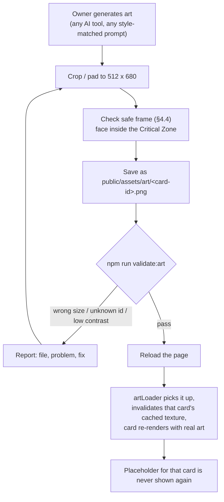

# HYPEBOUND — Art Requirements & Placeholder Art System

> **Status:** Discipline specification. Subordinate to `../design/00-core-rules.md`
> (rules canon), `../tech/00-architecture-contract.md` (tech canon), and
> `../../src/engine/types.ts` (type canon). Where those documents are silent this
> document decides, and its decisions are binding on `src/ui/cardRenderer/`,
> `src/ui/art/`, and `src/ui/battle/`.
>
> Siblings: [Animation requirements](./02-animation-requirements.md) ·
> [Audio requirements](./03-audio-requirements.md)

> ## ⚠ SUPERSEDED IN PART — cards are now FULL-BLEED
>
> The artwork fills the **entire card** and the UI is overlaid on top of it.
> There is no small "art window". Any art-window dimensions later in this
> document are historical; **§0 immediately below is the current spec.**

## 0. Full-bleed card layout (CURRENT)

**Source size: 512 × 680 px** (portrait, ratio 0.753). Art and card are the same
dimensions, so matching art is placed 1:1 with no cropping. Art of a different
aspect is cover-fitted (centred, overflow cropped).

Draw order: your art, clipped to the Current's frame silhouette → top scrim →
bottom scrim → frame rim → UI overlays.

### Safe zones — keep the subject clear of these

| Region | Y range | What is drawn over it |
|---|---|---|
| **Top band** | 0–132 px | Cost gem (left), faction crest (centre), Current badge (right). Darkened by a scrim. |
| **Focal area** | 132–390 px | **Nothing.** Put the face and main subject here. |
| **Name banner** | 392–442 px | Card name on a Current-tinted plate |
| **Type line** | ~460 px | e.g. `CHARACTER — IDOL` |
| **Text box** | 476–618 px | Rules text on a near-opaque panel |
| **Bottom band** | 618–680 px | Attack chip (left), rarity gems (centre), health chip (right) |

In short: **the middle ~38% of the card is yours, the top ~20% is tinted, and
the bottom ~42% is covered.** Compose so the face sits roughly one third down
and the image can afford to lose its lower half.

The outer ~8 px is clipped by the frame silhouette — keep essentials 12 px in.

### Checking your art

```bash
npm run dev
# then in the browser console:
hypebound.previewCard("idols-lumi-starcall")
```

Renders that card at full size with whatever art is on disk; click to dismiss.
Art hot-loads — a card repaints itself the moment its image arrives, so you do
not need to reload after dropping a file in.

Batch-render to PNG for review:

```bash
node scripts/preview-cards.mjs idols-encore-diva goth-crypt-usher
```

---

**The governing constraint:** the owner supplies AI-generated card art *later*.
The game must look finished, premium, and intentional today, with **zero image
files present**, and must absorb art files one at a time without a rebuild,
without a code change, and without a single broken-image box.

---

## 1. Principles

| # | Principle | Consequence |
|---|---|---|
| **A1** | **Art is optional; the frame is not.** Every visual system degrades to a designed state, never an empty state. | A missing PNG produces procedural art that a player reads as a deliberate style, not a bug. |
| **A2** | **Shape carries meaning; color decorates it.** (Core rules §10, §8.2) | Every Current, status, rarity, and faction is identifiable in greyscale. Color is always the *second* signal. |
| **A3** | **Premium lives in the frame, the board, and the light** — not in the art file. (REQUIREMENTS: "Premium feel in card frame design (not the art itself)") | Frame rendering, lighting, and material quality get the polish budget. |
| **A4** | **Readable at 96 px.** A card is most often seen as a board mesh ~96–140 px tall. | Composition rules are written for the thumbnail first, the enlarged card second. |
| **A5** | **Original archetypes only.** (Core rules §1) | No real, named person may be depicted, referenced, caricatured, or implied. No real logos, no real platform UI chrome. |
| **A6** | **Deterministic art.** | The same card produces the same placeholder on every machine, every run, forever — placeholders are seeded from the card **id**, never from `Math.random`. |

---

## 2. Asset locations & naming

Resolution is handled by `src/ui/art/artLoader.ts`, which tries extensions in the
order **`png` → `webp` → `jpg`** and falls back to procedural art. Loading is
fire-and-forget: the first frame renders the placeholder, and the card
re-renders when the real image arrives.

| Asset class | Path | Size | Format | Fallback |
|---|---|---|---|---|
| Card art (all types incl. leaders) | `public/assets/art/<card-id>.png` | **512 × 680** | PNG-24 (or WebP/JPG) | Procedural placeholder |
| Leader full art | `public/assets/art/full/<leader-card-id>.png` | **1024 × 1536** | PNG-24 / WebP | Card art upscaled behind a blurred backdrop → placeholder |
| Character full art (gallery, story) | `public/assets/art/full/<card-id>.png` | **1024 × 1536** | PNG-24 / WebP | as above |
| Battlefield | `public/assets/art/battlefields/<battlefield-id>.png` | **2048 × 1024** | WebP preferred | Procedural board (`board.ts` default skin) |
| Card back | `public/assets/art/backs/<back-id>.png` | **512 × 680** | PNG-24 | Procedural default back |
| Banner / event key art | `public/assets/art/banners/<banner-id>.png` | **1920 × 640** | WebP | Solid faction-token gradient + title type |
| Emote | `public/assets/art/emotes/<emote-id>.png` | **256 × 256** | PNG-24, alpha | Text-only emote chip |
| Profile frame | `public/assets/art/frames/<frame-id>.png` | **512 × 512** | PNG-24, alpha, 9-slice safe | No frame |

**Naming is the card id, verbatim.** Ids are kebab-case and faction-prefixed
(`idols-lumi-starcall`, `neutral-borrowed-clout`). A card may override the key
with its `art` field (`CardDefBase.art`), which is used as a *path fragment* —
so `"art": "full/idols-lumi-starcall"` resolves to
`assets/art/full/idols-lumi-starcall.png`. Cosmetic variants (`variantOf`) get
their own id and therefore their own file; they never overwrite the base art.

> **[DECISION]** Sub-directory resolution (`full/`, `battlefields/`, `backs/`, …)
> requires a second resolver alongside `getCardArt()`:
> `getVariantArt(kind, id)`, same extension chain, same fire-and-forget
> semantics, same "missing is fine" contract. This is an additive change to
> `src/ui/art/artLoader.ts` — no other module is affected.

---

## 3. The procedural placeholder art system

### 3.1 Contract

Canon (architecture contract §5) specifies the placeholder as
**"current-colored gradient + icon + name."** This section is the exact
rendering spec for that. It is implemented in
`src/ui/cardRenderer/placeholderArt.ts` and must satisfy three tests:

1. **The intentionality test.** A player who never sees a real art file must
   believe this *is* the art style, not a failure. No grey boxes, no
   question-mark glyphs, no stretched icons, no "image not found."
2. **The distinctness test.** Two different cards of the same Current must
   produce visibly different compositions. Two cards of different Currents must
   be distinguishable in greyscale.
3. **The determinism test.** Rendering the same card twice — in different
   sessions, on different machines, in different languages — produces
   byte-identical output.

### 3.2 Seeding

```
seed = FNV1a32(card.id + ":" + current)
rand = xorshift32(seed)      // all placeholder randomness draws from this
```

> **[DECISION — corrects a live defect]** The seed uses `card.id`, **not**
> `card.name`. Names are localized through `i18n.t()`; seeding on the name would
> make a card's placeholder change when the player switches language, breaking
> the determinism test. `placeholderArt.ts` currently seeds on
> `name + current` and must be changed to `id + ":" + current`.

### 3.3 Layer stack (normative)

All coordinates are given in **art-window space**: a rect `(x, y, w, h)` supplied
by the caller. Percentages are of `w`/`h` as noted. Layers composite in order.

| # | Layer | Spec |
|---|---|---|
| **L0** | **Current gradient wash** | Vertical linear gradient over the full rect. Stops: `0.00 → mix(lo, key, 0.35)`, `0.55 → lo`, `1.00 → abyss`. Colors from `CURRENT_PALETTE` (§6.3). This is the "Current-colored gradient" of the canon contract and is the single strongest Current read. |
| **L1** | **Horizon massing** | 7–11 vertical blocks (count from `rand`) across the bottom, each `0.86 × (w / count)` wide, heights `16–48 % h`, filled `abyss` at `α 0.40`. Reads as a skyline for digital factions and as a treeline/ridge for Root/Gale cards. |
| **L2** | **Key-light cones** | 3 trapezoidal cones from the top edge at `x = 20 %, 50 %, 80 % w`, 12 px wide at origin, spreading to `10–20 % w` at the base. Fill = vertical gradient `hi @ α 0.30 → transparent`, composite `screen`. |
| **L3** | **Subject silhouette** | Centered figure, base at `96 % h`, total height `62 % h`. Torso = a tapered quad with quadratic shoulders; head = circle of radius `13 %` of figure height, seated above the shoulder line. Fill `#05030B @ α 0.90`. Behind it: a radial rim-glow, `key @ α 0.55 → transparent`, radius `70 %` of figure height. **This silhouette is what makes the placeholder read as "a character card," and is what a real art file replaces.** |
| **L4** | **Current motion motif** | Per-Current particle/line pass, composite `screen`, drawn in `hi`. Exact motifs in §3.4. |
| **L5** | **Current sigil** | The Current's icon (§9.1) drawn at radius `26 % h`, centered at `(50 % w, 34 % h)`, in `hi` at `α 0.10`, **behind** nothing — it composites over L4 but under L6. This is the "icon" of the canon contract. In `bare` context (§3.5) opacity rises to `α 0.18` and radius to `30 % h`. |
| **L6** | **Identity plate** *(context-dependent)* | Card name in 600-weight small caps, letter-spacing `1.2 px`, centered, baseline at `88 % h`, over a `0 → abyss @ α 0.75` gradient scrim occupying the bottom `22 % h`. Auto-shrinks from 22 px to 14 px (at 512-px-wide reference) to fit; truncates with an ellipsis below 14 px. Beneath it, the Current label (`CINDER`, `TIDE`, …) at 10 px, `α 0.7`. **Rendered only in `bare` and `full` contexts** — see §3.5. |
| **L7** | **Pending watermark** | `ART PENDING`, 10 px / 600 weight / `1.5 px` tracking, `hi @ α 0.28`, bottom-right, 8 px inset. Deliberately quiet: it informs a developer without reading as an error to a player. Suppressed entirely in screenshot/marketing mode (`?artpending=0`). |

### 3.4 Per-Current motion motifs (L4)

Each motif is drawn with `strokeStyle = fillStyle = hi`, `lineWidth 2`,
composite `screen`, with per-element alpha as listed. Counts are fixed so the
particle cost is bounded and identical everywhere.

| Current | Motif | Elements | Geometry |
|---|---|---|---|
| **Cinder** | Rising embers | 26 discs | Radius `1–3.6 px`, positions biased to the lower `85 % h`, `α 0.25–0.75` |
| **Tide** | Wave bands | 5 sine polylines | `y = 45 % + i·11 % h`, amplitude 5 px, period ~163 px, `α 0.16–0.36` |
| **Root** | Growing stems | 9 quadratic curves | From the bottom edge, height `15–45 % h`, lateral drift ±30 px, `α 0.20–0.50` |
| **Gale** | Speed lines | 16 segments | Length `20–70 % w`, 5 px upward rake, `α 0.14–0.42` |
| **Pulse** | Circuit traces | 12 orthogonal polylines | 3 axis-aligned segments each, step ≤ 60 px, `α 0.18–0.48` |
| **Halo** | Radiant spokes | 14 rays | Radiating from the figure's chest, inner `40 %`, outer `+10–30 % h`, `α 0.10–0.30` |
| **Veil** | Fracture cracks | 8 jagged polylines | 4 segments each, ±50 px jitter, `α 0.20–0.55` |
| **Prism** | Refraction fan | 7 bands | From `(50 % w, 30 % h)` to evenly spaced points on the bottom edge; **stroke color `hsl(i/7·360, 90 %, 68 %)`**, `lineWidth 4`, `α 0.16` — the only layer that leaves the Current palette, because Prism *is* the spectrum |

### 3.5 Contexts

`drawPlaceholderArt(ctx, rect, current, card, context)` takes a context that
decides layer participation. This exists so the canon-required *name* is always
present in the system without printing the card's name twice on a card face
that already has a name plate.

| Context | Used by | Layers | Notes |
|---|---|---|---|
| `framed` | `renderCard.ts` art window | L0–L5, L7 | Name is omitted; the card frame's name plate already carries it 10 px below the art window. Sigil at `α 0.10`. |
| `bare` | three.js board art plane, deck covers, hand thumbnails without a full frame, history-rail chips | L0–L7 | Full stack including the identity plate. |
| `full` | Full-art fallback (leader showcase, character gallery, victory sequence) | L0–L7 at 1024 × 1536, with L1 horizon at `24 % h` and L3 figure height `70 % h` | Composition re-tuned for the taller canvas; identity plate at 32 px. |

### 3.6 Non-character card types

Characters get the silhouette. Other types must not, or every Action looks like
a person. **[DECISION]** L3 is replaced per card type:

| Card type | L3 replacement | Rationale |
|---|---|---|
| `character`, `leader` | Figure silhouette (as specified) | The default |
| `action`, `transformation` | **Impact glyph** — a hollow ring of radius `26 % h` at `(50 %, 48 %)` with 6 radial ticks, plus a downward chevron burst; `#05030B @ α 0.85` with a `key` rim | Reads as "an effect happens" |
| `reaction` | **Trap card silhouette** — a face-down card rectangle at `-14°`, `38 % w × 30 % h`, with a corner lifting | Reads as "set, hidden" |
| `equipment` | **Hanging silhouette** — a vertical mount line from the top edge with a symmetric object mass (blade/mic/tool ambiguous) at `55 % h` | Reads as "a thing you attach" |
| `location` | **No figure.** L1 horizon massing doubles in height (`32–72 % h`) and gains a two-point perspective floor line at `78 % h` | Reads as "a place" |
| `event` | **Banner silhouette** — a full-width ribbon at `40–56 % h` with notched ends, plus 3 falling confetti quads | Reads as "a global thing in effect" |

Every type keeps L0, L2, L4, L5, L6, L7 unchanged.

### 3.7 Token cards

Tokens (`token: true`) use the placeholder system with **L3 scaled to 48 % h**
and an added L3b "×N" ghost duplicate offset `(+8 px, +6 px)` at `α 0.35`,
signalling "this is a spawned copy." Tokens are the cards least likely to ever
receive owner art, so their placeholder must be the most self-sufficient.

### 3.8 Quality gate

A placeholder build passes only if all of the following are true:

- [ ] Rendered contact sheet of **every** card in `data/cards/**` shows no two
      identical compositions within a Current.
- [ ] Greyscale contact sheet: all 8 Currents distinguishable by motif alone.
- [ ] At 96 px tall, the silhouette/glyph is still a recognizable mass.
- [ ] No layer draws outside `rect` (the art window clip is a safety net, not the
      composition boundary).
- [ ] Full-deck render (30 cards) completes in ≤ 60 ms on the low quality tier.

---

## 4. Owner art pipeline

### 4.1 The drop-in workflow



No build step. No code change. No manifest entry. **The filename is the
contract.**

### 4.2 File specification

| Property | Value | Why |
|---|---|---|
| Dimensions | **512 × 680 px** (aspect 0.753) | Fills the 346 × 244 card art window at 1.48× with headroom for the 8 frame crops, and supplies enough vertical range for full-bleed board hover |
| Color space | sRGB, no embedded ICC other than sRGB | Canvas/WebGL compositing assumes sRGB |
| Bit depth | 8 bit/channel | |
| Alpha | Allowed but **not** required; anything transparent composites over the Current gradient wash (L0), which is a designed backdrop | Lets the owner drop cut-out characters and still get a finished card |
| Max file size | 400 KB (PNG) / 220 KB (WebP) | Collection screens load ~60 card images at once |
| Naming | exact `card.id` | |
| Forbidden | Text of any kind baked into the art; borders/frames baked into the art; drop-shadowed card mockups; watermarks | The frame renderer owns all chrome and all typography |

### 4.3 Master canvas map

The 512 × 680 master is divided into three horizontal bands. Only the middle
band appears on the card face; the outer bands exist so the same file also
serves full-bleed contexts.

```
        x=0        48       112                      400      464    512
        |          |         |                        |        |      |
  y=0   +----------+---------+------------------------+--------+------+
        |                                                             |
        |   TOP OVERFLOW BAND  (y 0-84)                               |
        |   hair, hats, halos, weapon tips, hologram spill            |
        |   VISIBLE ONLY in full-art contexts                         |
  y=84  +=============================================================+  <-- CARD WINDOW top
        |                                                             |
        |          +---------------------------------------+          |
  y=132 |          |  S A F E   F R A M E                  |          |  <-- inside all 8 frame crops
        |          |   +-------------------------------+   |          |
        |          |   |                               |   |          |
        |          |   |  C R I T I C A L   Z O N E    |   |          |
        |          |   |  head + primary silhouette    |   |          |
  y=210 |          |   |  - - - - - (o) - - - - - - -  |   |          |  <-- FOCAL ANCHOR (256, 210)
        |          |   |            eye-line           |   |          |
        |          |   |                               |   |          |
  y=246 |- - - - - | - | - - - - - - - - - - - - - - - | - | - - - - -|  <-- name-plate vignette onset
        |          |   +-------------------------------+   |          |
  y=300 |          |        (vignette strengthens)         |          |
        |          |                                       |          |
  y=397 |          +---------------------------------------+          |
        |     bottom 16 px of the window sit under the name plate     |
  y=445 +=============================================================+  <-- CARD WINDOW bottom
        |                                                             |
        |   BOTTOM OVERFLOW BAND  (y 445-680)                         |
        |   lower body, ground contact, floor VFX, shadow             |
        |   VISIBLE ONLY in full-art contexts                         |
  y=680 +-------------------------------------------------------------+
```

| Region | Master rect (x0, y0, x1, y1) | Size | Rule |
|---|---|---|---|
| **Card Window** | `(0, 84) – (512, 445)` | 512 × 361 | Exactly what the card-face art window shows. Aspect 1.418 matches the 346 × 244 window; cover-fit trims a hairline. |
| **Safe Frame** | `(48, 132) – (464, 397)` | 416 × 265 | Guaranteed visible under **all 8** Current frame shapes. All meaningful content lives here. |
| **Critical Zone** | `(112, 132) – (400, 300)` | 288 × 168 | Head, face, and the single most identifying prop. Must be legible at 96 px. |
| **Focal Anchor** | `(256, 210)` | — | The subject's eye-line. Place it within ±32 px. Every card composed to this anchor gives the collection grid a calm, professional read. |
| **Vignette band** | `y 246 – 445` | — | The renderer draws a `transparent → abyss @ α 0.85` gradient here so the name plate is readable over any art. **Do not** put critical detail below `y 300`. |
| **Name-plate occlusion** | `y 429 – 445` | 512 × 16 | Physically covered by the name plate. |
| **Overflow bands** | `y 0–84`, `y 445–680` | — | Free composition space for full-art contexts. Must not contain anything the card face needs. |

### 4.4 What each frame shape crops

The art window is clipped by the **Current's frame silhouette**, scaled to the
window rect. This is what makes a Cinder card recognizable at a glance in
greyscale (core rules §8.2, "frame shape language"). Intrusions below are the
maximum bite taken out of the Card Window, in **master pixels**.

| Current | `frameShape` | Silhouette | Corner intrusion (TL / TR / BR / BL) | Edge behavior |
|---|---|---|---|---|
| **Cinder** | `flame-notch` | Rounded body; five flame peaks rise **out** of the top edge; one wide ember flare drops **out** of the bottom center | 24 / 24 / 24 / 24 (rounded) | Outward only — reveals more art at top/bottom |
| **Tide** | `wave-round` | Heavily rounded corners; three wave bulges push **out** of each vertical edge | 50 / 50 / 50 / 50 (rounded) | Outward ±14 px on left/right |
| **Root** | `hex-stone` | Deep 45° chamfers on all four corners — a stone hexagon | 58 / 58 / 58 / 58 (chamfer) | Straight edges |
| **Gale** | `ribbon-sweep` | Asymmetric: top-right and bottom-left cut long and low into a swept ribbon | 22 / **90** / 22 / **90** (chamfer) | The largest single cut in the set — the safe frame's 48 px inset is sized for it |
| **Pulse** | `circuit-angle` | 45° chamfers; two stepped tabs push **out** of each vertical edge | 38 / 38 / 38 / 38 (chamfer) | Outward tabs 18 px |
| **Halo** | `radiant-circle` | Top edge arcs into a dome that rises **out** at center while the top corners are cut down | 40 / 40 / 26 / 26 | Top corners lose 40 px; dome gains 26 px at center |
| **Veil** | `shard-mirror` | Irregular shard chips on every edge, deterministic (never animated jitter) | ≤ 34 all corners | ±22 px in/out on all four edges |
| **Prism** | `crystal-facet` | Octagonal facet cut; mid-edge facet points push **out** | 32 / 32 / 32 / 32 (chamfer) | Outward 6 px at edge midpoints |

**Derivation of the 48 px safe inset.** For a 45° chamfer of size `L`, a point
inset `d` from both edges survives when `2d > L`. The worst case is Gale's
90 px chamfer → `d > 45`. Rounded corners of radius `r` require
`d > r(1 − 1/√2)` → Tide's 50 px radius needs 15 px. **48 px covers every
shape with margin**, and is the value the Safe Frame uses.

> **[DECISION — implementation gap]** `renderCard.ts::drawArtWindow` currently
> clips the art window to a **rounded rectangle for all eight Currents**. It must
> clip with `traceFrame(shape, artRect)` instead, and stroke the art-window rim
> along the same path. Until it does, the crop table above is aspirational and
> the Current read at thumbnail size is weaker than canon §8.2 requires.

### 4.5 Validation tooling

`npm run validate:art` (additive to the existing `validate` script) reports, and
never blocks the game from running:

| Check | Severity | Message |
|---|---|---|
| File name does not match any card id | **error** | `orphan art: <file> — no card with this id` |
| Dimensions ≠ 512 × 680 | **error** | `<id>: expected 512x680, got WxH` |
| File > 400 KB | warning | `<id>: 612 KB — recompress` |
| Mean luminance of the Critical Zone within 8 % of the mean luminance of the Safe Frame ring | warning | `<id>: low subject/background separation — the frame will swallow it` |
| Any card with `rarity: legendary` lacking art | info | coverage report only |
| Coverage summary | info | `art coverage: 41 / 386 cards (10.6 %)` |

The same coverage number is surfaced in-app on a developer overlay via
`artCoverage()` (already implemented in `artLoader.ts`).

### 4.6 Generation guidance (for the owner's AI tool)

A reusable prompt skeleton that produces on-style, correctly framed art. The
bracketed slots are filled from the card's own data.

```
[SUBJECT: one original character archetype, e.g. "a holographic idol singer
mid-note, arms raised, stage-mic in one hand"], anime key-visual illustration,
cel-shaded with soft airbrush gradients, crisp linework, dramatic three-quarter
view, waist-up composition, eye-line one third from the top, single strong
[CURRENT KEY COLOR] rim light from behind-left, cool ambient fill, glossy black
and chrome environment, [FACTION MOTIF LIST], volumetric haze, shallow depth of
field, empty space around the head, plain uncluttered background, portrait
512x680, no text, no watermark, no border, no frame, no logo, no UI
```

Per-card substitutions come from the card definition: `current` → key color and
motif (§6.3), `faction` → environment and motif list (§6.4), `type` → framing
rule (§6.6). Ten cards generated from this skeleton with different subjects will
sit together on a board without looking like ten different games.

---

## 5. Style guide — anime-inspired consistency

### 5.1 Rendering target

| Attribute | Specification |
|---|---|
| **Idiom** | Modern anime **key visual** — the promotional illustration style, not manga panel art and not Western comic inking |
| **Shading** | Two-tone cel base (light / shadow) with a soft airbrushed transition on skin and hair only. Hard terminator on fabric, metal, and props |
| **Line** | Present and visible. Weight varies: heavy on the outer silhouette, medium on major forms, light on interior detail. Lines are **colored**, not black — tinted toward the local shadow hue |
| **Detail budget** | High on the face and one hero prop; deliberately low on everything else. Detail is a spotlight, not a texture |
| **Texture** | Minimal. Material is communicated by specular behavior (glossy / matte / emissive), not by surface noise |
| **Photorealism** | Forbidden. Photo-bashed elements, real photographic backgrounds, and 3D-render finishes break the set |
| **Aspect of humor** | The comedy lives in **what** is depicted (a trainee apologizing for only practicing fourteen hours), never in the rendering. The art is played straight and beautifully; that is what makes the joke land |

### 5.2 Lighting model (binding)

Every card uses the same three-light logic. This single rule does more for set
consistency than any palette decision.

| Light | Role | Rule |
|---|---|---|
| **Key** | Primary form-definer | From the **upper front-left**, ~35° above and ~30° left of camera. Neutral-to-warm white unless the faction overrides it |
| **Rim** | The signature | From **behind-right**, colored in the card's **Current key color** (§6.3), at 1.3–1.8× key intensity on the silhouette edge. **This is the law of the set:** every character is separated from the background by a Current-colored rim. It is also the reason placeholder and real art sit together — the placeholder's L3 rim-glow is the same idea |
| **Fill** | Shadow readability | Ambient bounce from below-front, cool, ~20 % of key. Shadows never go to pure black — minimum value `#12101A` |

**Emissive rules.** Screens, holograms, neon, and VFX are emissive and bloom.
Emissives occupy **≤ 20 % of the Critical Zone** — beyond that the face stops
reading at thumbnail size. **Exception (binding, from the Touch-Grass Order
faction doc):** Touch-Grass Order art uses **no emissive glow at all** — a single
directional daylight key with soft bounce, and any screen in frame is off,
cracked, taped over, or in a bucket. That contrast is a designed faction
statement and must survive art direction reviews.

### 5.3 Global palette

| Token | Value | Use |
|---|---|---|
| Void | `#05030B` | Deepest background, silhouette fill |
| Panel | `#0E0B18` | Card wells, HUD panels |
| Chrome | `#9AA0B4` | Frame metal, filigree, rails |
| Glass | `#FFFFFF @ 8 %` | Panel surfaces, holographic sheets |
| Ink | `#EDEAF6` | Primary text |
| Ink-dim | `#A7A2BC` | Secondary text, reminder text |
| Alert | `#FF4D6A` | Damage numerals, lethal, error |
| Affirm | `#7DFFB0` | Healing numerals, valid target |

### 5.4 Per-Current palette (canonical for canvas rendering)

These are the values in `src/ui/cardRenderer/palette.ts` and mirror the CSS
custom properties named in `data/currents.json` (`colorToken`). **The canvas
values and the CSS custom properties must be kept in sync; the palette module is
the source of truth for canvas.**

| Current | `key` (rim light, frame) | `hi` (highlight) | `lo` (frame body) | `abyss` (behind art) | Frame shape | Label |
|---|---|---|---|---|---|---|
| **Cinder** | `#FF6B2C` | `#FFC08A` | `#7A2408` | `#2A0D02` | `flame-notch` | CINDER |
| **Tide** | `#2F93FF` | `#A8D8FF` | `#0B2F63` | `#04122C` | `wave-round` | TIDE |
| **Root** | `#56C264` | `#B6F0BE` | `#16401F` | `#07190B` | `hex-stone` | ROOT |
| **Gale** | `#4FE3D0` | `#C8FFF7` | `#10514A` | `#04201D` | `ribbon-sweep` | GALE |
| **Pulse** | `#A855F7` | `#E4BCFF` | `#3A1263` | `#170528` | `circuit-angle` | PULSE |
| **Halo** | `#FFD86B` | `#FFF6D6` | `#6B5011` | `#2A1E03` | `radiant-circle` | HALO |
| **Veil** | `#8B5CF6` | `#CBB2FF` | `#21103F` | `#0D0619` | `shard-mirror` | VEIL |
| **Prism** | `#FF8FD8` | `#FFF0FB` | `#4A1F52` | `#1C0A20` | `crystal-facet` | PRISM |

**Prism exception:** Prism frames animate a slow spectrum sweep across the facet
edges (hue rotation, 8 s period, amplitude ±40°). Prism art may use the full
spectrum; every other Current keeps its art within ±25° of its `key` hue, plus
neutrals, plus one complementary accent.

### 5.5 Per-faction palette

Faction identity lives in **art content, emblem, environment, and board skin —
never in frame shape** (frame shape belongs to the Current) **and never in color
alone** (every faction badge is a distinct glyph with a text label). Values below
are the canonical set consolidated from `docs/design/factions/*.md`.

| Faction | Primary | Secondary | Accent | Base | Environment |
|---|---|---|---|---|---|
| **Neon Idols** | Stagelight Pink `#FF3DAE` | Holo Cyan `#4DE1FF` | Encore Gold `#FFD86B` | Backstage Black `#0B0714` | Virtual concert stage, glass runways, drone spotlights, lightstick ocean |
| **Gothic Royalty** | Requiem Violet `#6B2FA0` | Oxblood `#7A1024` | Candle Gold `#D9A441` | Crypt Plum `#120814` | Neon cathedral, LED stained glass, rose hedges through server racks |
| **Viral Influencers** | Ember Orange `#FF6A2B` | Alert Red `#FF2E4D` | Streak Yellow `#FFC93D` | Scorch Brown-Black `#160B08` | Trending panel, ring lights, burning ticker tape, odometer counters |
| **Corporate Creators** | Boardroom Green `#1E7A5A` | Brand-Safe White `#F2F6F3` | Sponsor Gold `#E8B23A` | Executive Black `#090E0C` | Flagship studio lobby, glass elevators, sponsor banners, contract scrolls |
| **Digital Demons** | Bluescreen Cobalt `#2B4BFF` | Hellfire Crimson `#C41425` | Datarot Green `#5CFFA8` | Dead-Pixel Black `#050409` | Cathedral-scale open PC case, stacked error dialogs, glowing fan grilles |
| **Cosplay Champions** | Iridescent Spectrum (white/silver base) | Sea-Glass Teal `#5FD3C8` | Trophy Ribbon Gold `#E8C468` | Hall Slate `#14171C` | Convention halls, workshop benches, masquerade stages, badge-line queues |
| **Afterparty Crew** | Last-Call Amber `#FF9E3D` | Rainwet Teal `#2FA7B0` | Karaoke Magenta `#FF4FA3` | Four A.M. Navy `#0A1018` | Wet asphalt, convenience-store fluorescents, karaoke rooms, pre-dawn sky |
| **Touch-Grass Order** | Meadow Green `#4C8B3A` | Clear-Noon Blue `#7FB8E0` | Trail Clay `#B4623A` | Loam Brown `#2C2419` | Parks, ridgelines, chalked pitches, real weather, canvas and rope |
| **Algorithm Syndicate** | Syndicate Indigo `#2B37C9` | Watchlist Teal `#25C2C7` | Brass Kickback `#C9A227` | Cold-Aisle Black `#070A16` | Back room of the data centre, velvet rope, brass fittings, monitor wall |
| **Meme Collective** | Format Lime `#A8FF3C` | Deep-Fry Magenta `#FF2FC2` | Prism Sheen `#DCEBFF` | Basement Grey `#101216` | 3 a.m. basement, sticker-bombed laptops, corkboard and red string, prize wheel |
| **Neutral** | Drama Grey `#8F8AA8` | — | — | Panel `#0E0B18` | No fixed environment; neutral cards borrow the board's ambience |

> **[NOTE — sibling divergence]** `src/ui/cardRenderer/palette.ts::FACTION_COLOR`
> currently holds a *different*, less considered set of faction hues (e.g.
> Corporate Creators as `#4D8FD6` blue rather than Boardroom Green). The values
> in the table above — which come from the faction design docs — are authoritative;
> `FACTION_COLOR` must be updated to match.

### 5.6 Composition rules

1. **One subject.** A card depicts one character, one object, or one place. Group
   shots are reserved for Legendaries and Locations.
2. **Anchor the eye-line.** The subject's eyes sit at the Focal Anchor `(256, 210)`
   ±32 px. This is the single rule that makes a mixed-source art set look curated.
3. **Silhouette first.** Fill the subject black; it must remain identifiable.
   If it doesn't, add negative space around the head or exaggerate one prop.
4. **Three-quarter default.** Straight-on front views are reserved for Leaders and
   for characters whose joke *is* confrontation. Pure profile is forbidden — it
   reads as an outline at thumbnail size.
5. **Head clearance.** ≥ 24 master px of clear space above the highest point of
   the head, inside the Safe Frame.
6. **Background depth ≤ 3 planes.** Subject / mid prop / far wash. A fourth plane
   turns to noise at 96 px.
7. **Background contrast.** The Critical Zone's mean luminance must differ from
   its surrounding ring by ≥ 15 %. Backgrounds are 20–40 % less saturated than
   the subject.
8. **Motion reads left→right.** Attacks, gusts, and gestures travel toward the
   right edge, matching board attack direction and the trigger-resolution order
   (left→right, core rules §5.5).
9. **No frame in the art.** No borders, vignettes, corner ornaments, or drop
   shadows — the renderer adds a vignette (§4.3) and would double it.
10. **Nothing important below `y 300`.** The name-plate vignette lives there.

### 5.7 Character framing by card type

| Card type | Crop | Notes |
|---|---|---|
| **Leader** | Chest-up hero shot, direct-to-camera, symmetrical | Leaders also require full art (§7) |
| **Character (Legendary)** | Waist-up, dynamic three-quarter, one hero prop, environment implied | The set's showpieces |
| **Character (Epic)** | Waist-up or bust, three-quarter | |
| **Character (Rare)** | Bust to chest-up | |
| **Character (Common)** | Bust, simplified background wash | Commons appear most often; keep them the calmest |
| **Token** | Bust, plain wash, exaggerated single feature | Read at 64 px on a crowded board |
| **Action / Transformation** | The *effect*, not a person: an impact, a gesture with hands only, a moment of change | If a person appears, they are small and back-lit |
| **Reaction** | A moment of anticipation — a hand hovering, a tripwire, an unopened notification | Reactions are seen face-down most of the time; the art matters on reveal |
| **Equipment** | The object alone, three-quarter, floating with a soft ground shadow, hero-lit | No wearer; the wearer changes |
| **Location** | Wide establishing shot, one-point perspective, no foreground figure | The only landscape composition in the set |
| **Event** | A crowd, a sky, or a headline moment — something happening *to everyone* | Never a single named-looking character |

### 5.8 Do / Don't

| ✅ Do | ❌ Don't |
|---|---|
| Rim-light every character in its Current's key color | Light characters flatly or with white-only rims |
| Keep the face inside the Critical Zone | Compose full-body shots — the frame eats the legs |
| Use exactly one hero prop per card | Give a character six accessories and no focal point |
| Play the drama straight; let the *name* be funny | Draw a wink-at-the-camera "this is a joke" pose |
| Invent original archetypes (the eternal understudy, the soundboard gremlin) | Depict, caricature, or imply any real, named person |
| Imply platforms with invented glyphs and shapes | Reproduce any real logo, platform UI, or brand mark |
| Leave the background 20–40 % less saturated than the subject | Let the background out-contrast the face |
| Match the faction environment list (§5.5) | Put a Touch-Grass character in a neon alley |
| Keep emissives ≤ 20 % of the Critical Zone | Cover the face in bloom |
| Deliver on a transparent or simple backdrop when unsure | Bake a card frame, border, or drop shadow into the file |
| Keep readable at 96 px | Rely on fine linework or small text |
| Use suggestion for anything risqué; the target rating is Teen | Produce sexualized, gory, or hateful content — such files are rejected at review, not at validation |

### 5.9 Content & safety rules (binding)

- **No real people.** Not by name, likeness, signature look, catchphrase, or
  unmistakable silhouette. Every character is an original archetype.
- **No real brands or platforms.** Invented glyphs only.
- **Rating target: Teen.** Stylized conflict; no blood pooling, no dismemberment,
  no torture imagery. Digital Demons express horror through *machines*, not gore.
- **No sexualization**, including of characters who could read as minors. Idol
  and cosplay archetypes are drawn as performers, not as pin-ups.
- **Slurs, hate symbols, and real-world political iconography are forbidden**, in
  art and in art-adjacent props (signage, chat overlays, banners).
- **Chat/comment props must be gibberish or i18n-sourced**, never real handles.

---

## 6. Leader full art

Leaders carry the game's face: the lobby showcase, the character gallery, the
victory sequence, and the story campaign.

| Deliverable | Path | Size | Notes |
|---|---|---|---|
| Leader card art | `art/<leader-id>.png` | 512 × 680 | Same rules as any card; chest-up, direct-to-camera |
| **Leader full art** | `art/full/<leader-id>.png` | **1024 × 1536** | Full figure, transparent background **required** |
| Leader portrait bust | `art/portrait/<leader-id>.png` | 512 × 512 | Circular-safe; used in HUD orbs, history rail, profile |
| Leader emblem | `art/emblem/<leader-id>.png` | 256 × 256, alpha | Personal sigil, distinct from the faction crest |
| Expression set *(story campaign)* | `art/portrait/<leader-id>.<neutral\|smug\|angry\|hurt\|delighted\|defeated>.png` | 512 × 512 | Six expressions; `neutral` is the fallback for all missing others |

**Full-art composition (binding):**

| Region | Master `y` | Rule |
|---|---|---|
| Headroom | 0 – 180 | Clear; hair/hat/halo may enter |
| Face band | 180 – 460 | The face. Never occluded by the lobby's HUD overlay |
| Torso | 460 – 900 | Hero prop lives here |
| Legs / base | 900 – 1400 | May be cropped by the lobby frame; must not carry meaning |
| Ground fade | 1400 – 1536 | Fades to transparent — the figure never ends on a hard cut |

- **Transparent background is mandatory** so the three.js lobby scene composites
  its own faction backdrop behind the leader.
- The figure's horizontal center sits at `x = 512` ±64; the lobby crops to a
  vertical strip on narrow aspect ratios.
- **Idle animation is procedural, not authored:** the presenter applies a
  breathing sine (±6 px vertical, 4.2 s period) and a parallax tilt (±2°) driven
  by pointer position. No sprite sheets. Reduced motion pins the pose (see
  `02-animation-requirements.md` §11).
- **Fallback chain:** `art/full/<id>` → `art/<id>` upscaled 2× behind a 24 px
  Gaussian-blurred copy of itself → `full`-context procedural placeholder (§3.5).
  The lobby is never empty.

---

## 7. Battlefield & board art

The board is three.js geometry, not a painting. Battlefield art supplies
**textures for a fixed slot set**, so any battlefield works with any deck.

### 7.1 Board slot map

```
                         [ enemy location ]  [ 6 enemy character slots ]
   +-----------------------------------------------------------------------+
   |  BACKDROP PLANE (skybox card, 4096 x 1024, cylindrical)               |
   |    +---------------------------------------------------------------+  |
   |    |  FAR SET DRESSING (parallax plane, alpha, 2048 x 512)         |  |
   |    |    +-------------------------------------------------------+  |  |
   |    |    |  BOARD SURFACE (2048 x 1024, tiling-safe seam)         |  |  |
   |    |    |     center seam <- trigger rail / confluence button     |  |  |
   |    |    +-------------------------------------------------------+  |  |
   |    +---------------------------------------------------------------+  |
   +-----------------------------------------------------------------------+
                         [ your location ]  [ 6 your character slots ]
```

### 7.2 Texture set

| Layer | File | Size | Requirements |
|---|---|---|---|
| Board surface | `battlefields/<id>.png` | 2048 × 1024 | The 12 character slots and 2 location slots are drawn by the renderer as glowing inlays; the texture must be **quiet** where they land (luminance variance < 12 % inside slot rects) |
| Backdrop | `battlefields/<id>.backdrop.png` | 4096 × 1024 | Cylindrical, horizontally tileable at the seam |
| Set dressing | `battlefields/<id>.dressing.png` | 2048 × 512, alpha | Parallaxes at 0.35× camera yaw |
| Ambient tint | declared in `data/battlefields.json` | — | `{ key, fill, fog }` hex triple applied to the scene lights so 3D cards sit in the same light as the painting |

### 7.3 Binding board rules

1. **The board never out-contrasts a card.** Board surface luminance stays inside
   12–45 %; cards render at 55–95 %.
2. **Slot legibility beats beauty.** If a battlefield makes an empty slot hard to
   find during a drag, it fails review.
3. **The center seam is UI space.** The trigger-order rail and the Confluence
   button live there (screens doc §6.2). Keep the middle 8 % of the board surface
   visually calm.
4. **Motion is limited to the backdrop and dressing planes**, at ≤ 0.15 units/s
   drift, and stops entirely under reduced motion.
5. **Ship a high-contrast variant** (`<id>.hc.png`) that darkens value without
   shifting hue, for the high-contrast accessibility theme. Required for
   light-valued battlefields (Touch-Grass Order's meadow specifically).
6. **Default battlefield** (`default`) is fully procedural — a glossy black slab
   with chrome slot inlays and a Current-neutral rim. It ships with zero art
   files and is what every mode falls back to.

### 7.4 Camera & lighting reference

Fixed by the architecture contract §5 and the existing scene: perspective FOV
**38°**, position `(0, 11.4, 9.1)`, target `(0, 0, −0.5)` — a shallow top-down
tilt. Battlefield art must be composed for that specific oblique view: horizons
sit high, ground detail foreshortens hard, and anything under a card slot is
invisible.

---

## 8. UI icon inventory

### 8.1 Production rules

| Rule | Value |
|---|---|
| Authoring | **Procedural canvas paths** (`src/ui/cardRenderer/icons.ts`), not image files — they scale to any DPI, retint per context, and add zero bytes |
| Unit space | Each icon draws inside a unit box `(-1, -1) – (1, 1)` centered on origin; the caller sets translate/scale/color |
| Stroke weight | `0.16–0.22` unit (i.e. ~8–11 % of the icon box) so strokes survive at 16 px |
| Minimum size | 16 px for status pips, 20 px for Current badges, 24 px for interactive icons |
| Optical balance | Every icon fills 78–88 % of its box; no icon may appear systematically smaller than its neighbors |
| **Accessibility** | Every icon has (a) a distinct **silhouette**, (b) a **text label** available (always shown when `verboseLabels` is on — the default), and (c) a tooltip with the canonical text from the matching data file. **Never color-only.** (Core rules §5.4, §10) |
| Greyscale test | Print the full sheet at 16 px in pure black on white: every icon must remain uniquely identifiable |

### 8.2 Current icons (8)

Icon ids match `data/currents.json` → `icon`.

| Current | Icon id | Silhouette | Distinguishing feature at 16 px |
|---|---|---|---|
| **Cinder** | `current-cinder` | Upward teardrop flame with a smaller inner tongue at 55 % alpha | Single pointed apex, wide base |
| **Tide** | `current-tide` | Falling droplet above a double-crest wave stroke | Droplet + horizontal wave line below |
| **Root** | `current-root` | Hexagon outline containing a vertical stem with two opposed leaves | Only hexagon **outline** in the set |
| **Gale** | `current-gale` | Three horizontal sweep lines, each curling into a hook on the right | Only all-linework icon |
| **Pulse** | `current-pulse` | Filled zig-zag lightning bolt | Only hard-angled solid mass |
| **Halo** | `current-halo` | Ring with 8 radiating spokes, alternating long/short | Only concentric-radial form |
| **Veil** | `current-veil` | Crescent mask with a horizontal slit eye knocked out | Only crescent with negative space |
| **Prism** | `current-prism` | Triangle outline; one beam enters left, three diverge right | Only triangle |

**Badge presentation.** On a card, the Current appears as a badge combining
icon + text label (`LAYOUT.badge`, 148 × 46 at 400 × 560). On a board mesh it
appears as icon + label chip. On the advantage indicator it appears twice
(attacker icon, chevron, defender icon, `+1` chip) — see
`02-animation-requirements.md` §7.

### 8.3 Faction crests (11)

Crest ids match `data/factions.json` → `crest`. Each is a distinct glyph, always
paired with a text label.

| Faction | Crest id | Glyph |
|---|---|---|
| Neon Idols | `crest-neon-idols` | Five-point stage star with a light-cone wedge behind it |
| Gothic Royalty | `crest-gothic-royalty` | Thorned crown — three points, thorns curling outward from the band |
| Viral Influencers | `crest-viral-influencers` | Upward arrow whose shaft becomes a flame |
| Corporate Creators | `crest-corporate-creators` | Hexagonal corporate seal containing a rising chart arrow |
| Digital Demons | `crest-digital-demons` | Horned power symbol — a broken-circle power glyph with two horns |
| Cosplay Champions | `crest-cosplay-champions` | Convention badge (rounded rect with a clip notch) crossed by a sewing needle |
| Afterparty Crew | `crest-afterparty-crew` | Crescent moon crossed by a handheld microphone |
| Touch-Grass Order | `crest-touch-grass-order` | Two offset rectangles — a painted trail blaze |
| Algorithm Syndicate | `crest-algorithm-syndicate` | Three-card fan pierced by a rightward chevron |
| Meme Collective | `crest-meme-collective` | Cardboard square with a hand-drawn upward arrow (deliberately wobbly stroke) |
| Neutral | `crest-neutral` | Empty speech bubble outline containing three dots |

> **[DECISION — implementation gap]** `icons.ts::drawFactionCrest` currently
> renders a **generic petal-ring** parameterized only by faction index. It is a
> stand-in and must be replaced with the 11 authored glyphs above, which are the
> ones the faction design docs already reference.

### 8.4 Status icons (10)

Every silhouette below matches the `iconShape` value in `data/statuses.json` —
**that file is the contract**. Text comes from the same file's `text` field.

| Status | `iconShape` | Silhouette | Polarity ring | Amount badge |
|---|---|---|---|---|
| **Scorched** | `flame` | Teardrop flame with inner tongue (shares the Cinder mark — intentional, Scorched *is* Cinder's signature) | Negative (notched ring) | — |
| **Shielded** | `bubble` | Soft circular membrane, double-stroke outline, one specular arc at the upper-left | Positive (smooth ring) | — |
| **Armor** | `plate` | Three stacked horizontal lamellar bands with beveled ends | Positive | `X` numeral, right-bottom |
| **Cancelled** | `strike-circle` | Open circle crossed by a single diagonal bar | Negative | turns remaining |
| **Lurking** | `hood` | Hood silhouette with a void where the face would be | Positive | — |
| **Warded** | `ward-diamond` | Diamond outline containing a smaller solid diamond | Positive | turns remaining |
| **Weakened** | `down-chevron` | Two stacked downward chevrons | Negative | `−X` numeral |
| **Empowered** | `up-chevron` | Two stacked upward chevrons | Positive | `+X` numeral |
| **Cursed** | `hex-eye` | Hexagon outline containing a horizontal lens-shaped eye | Negative | — |
| **Banished** | `leaf-exit` | Leaf with an arrow exiting to the upper-right | Negative | return turn |

**Presentation rules.**

- Positive statuses draw a **smooth** 1.5 px ring; negative statuses draw a
  **notched** ring (8 notches). This gives polarity a shape signal independent of
  the icon and of color.
- Status pips render in a row beneath the character's stat chips, max 4 visible;
  overflow collapses to a `+N` chip that expands on hover/tap.
- Ordering is fixed and deterministic so the row never reshuffles:
  `scorched, cursed, cancelled, weakened, banished, shielded, armor, warded, lurking, empowered`.
- Every pip carries a tooltip with the exact canonical text and remaining
  duration (screens doc §6.2, "Status inspection").

> **[DECISION — implementation gap]** `icons.ts` currently draws **Shielded** as a
> heater shield and **Armor** as a pentagon with a slot. The data contract says
> `bubble` and `plate`. The icons must be redrawn to match the data, because
> `iconShape` is what the tooltip system, the deck-builder legend, and the
> in-game guide all key off.

### 8.5 Keyword badges (16)

Keywords appear as small chips on board meshes and in the card-text renderer.
Ids match `KeywordId` in `types.ts`.

| Keyword | Glyph | Keyword | Glyph |
|---|---|---|---|
| `viral` | Two nested arrows forming a loop | `afterparty` | Crescent with three descending sparks |
| `spotlight` | Downward light cone onto a disc | `rushwind` | Double right-pointing chevron with a trailing line |
| `parasocial` | Heart with a signal-wave through it | `flow` | Circular arrow around a droplet |
| `trending` | Rising step chart with an arrowhead | `grow` | Sprout with a counter notch on the stem |
| `collab` | Two interlocking rings | `overload` | Lightning bolt inside a padlock body |
| `comeback` | U-turn arrow rising from a baseline | `inspire` | Upward chevron radiating three short rays |
| `raid` | Forward-tilted arrowhead with speed lines | `corrupt` | Solid drop with a bite chipped out of it |
| `touch-grass` | Grass tuft with an exit arrow (shares the Banished family) | `refract` | Triangle splitting one beam into three (Prism mark) |

Chips are icon + label at ≥ 20 px; icon-only below that, with the label in the
tooltip. `overload`, `grow`, and `collab` carry their parameter as a numeral
inside the chip.

### 8.6 Resource, meter & HUD icons

| Icon | Glyph | States |
|---|---|---|
| **Hype crystal** | Hexagonal faceted crystal, cyan specular | `filled` (bright, inner glow) · `spent` (hollow outline) · `locked` (hollow + padlock overlay, for Overload debt) · `temp` (filled with a dashed outline, for this-turn-only Hype) |
| **Hype cost gem** | Same crystal, larger, on the card's top-left | `normal` · `discounted` (numeral in Affirm green + a small down-chevron) · `increased` (Alert red + up-chevron) |
| **Obsession node** | Heart outline with a signal-wave crossing it | Meter of 10 nodes; `empty` · `filled` · `fixation notch` (single tick at node 3) · `ultimate notch` (double tick at node 7) |
| **Obsessed badge** | Diamond containing a bold exclamation stroke + the word `OBSESSED` | Appears at 8+; always accompanied by the text "+1 damage taken" (never color-only) |
| **Full Fixation burst** | Ten-node meter ringed by a radiating outline | Appears at exactly 10 |
| **Leader health orb** | Droplet with an interior heartbeat line; numeral always printed inside | `healthy` · `damaged` (crack overlay at ≤ 33 %) · `armored` (plate chip attached) |
| **Armor chip** | Reuses the `plate` status glyph | numeral |
| **Deck counter** | Three stacked card edges in perspective | `normal` · `low` (≤ 5, pulses) · `empty` (Burnout preview badge attached) |
| **Discard counter** | Card falling into a slot with a downward arrow | — |
| **Burnout mark** | Frayed candle-wick glyph with an ember | Numeral = next fatigue damage |
| **Turn timer ring** | Circular progress ring around End Turn | `normal` · `rope` (final 15 s: dashed stroke + numeral + audio cue) |
| **Confluence button** | Two Current icons overlapping in a vesica, joined by a `+` | `available` · `used this turn` (greyed + strike) · `unavailable` (outline only, with reason on hover) |
| **Resonance tracker** | Seven-segment arc; each segment fills per qualifying card | `n/7` numeral always shown |
| **Advantage chip** | `[attacker Current icon] › [defender Current icon]  +1` | Only rendered when an elemental bonus applies |
| **Lethal marker** | Broken-signal skull: a skull outline whose lower half dissolves into pixels | On any target a confirmed action would kill |
| **Trigger chip** | Numbered hexagon with the source card's Current icon inside | `queued` · `resolving` (enlarged) · `resolved` (faded, drifts left) · `fizzled` (strike-through, for the 20-trigger cap) |
| **Reaction marker** | Face-down card corner with a coiled-spring glyph | Yours: inspectable. Enemy's: count + set-turn only |
| **Event marker** | Ribbon banner with a countdown numeral | — |
| **Location durability** | Row of pips shaped like keystone blocks | Consumed pips hollow out |

### 8.7 Currency & economy icons

Currency **names** are owned by the economy document; this document owns their
**glyphs**, addressed by role so a rename never invalidates the art.

| Role | Glyph | Notes |
|---|---|---|
| Soft currency | Speech-bubble coin — a coin whose face is a chat bubble | Earned by play |
| Premium currency | Faceted spotlight gem — a four-point star cut | Real-money purchases |
| Crafting material | Signal shard — an angular fragment with a broken-transmission notch | Dismantle/craft |
| Event currency | Ticket stub with a tear line | Recolored per event; glyph is fixed |
| Targeted-pull token | Backstage pass on a lanyard clip | Pity/target system |
| Pack | Wrapped card sleeve with a torn corner | Pre-open state |

> **[NOTE — sibling divergence]** `docs/design/03-screens-and-navigation.md` §1.4
> names the currencies Buzz / Clout / Static; `docs/design/07-economy-and-monetization.md`
> §2 names them Clout / Limelight / Signal (+ Backstage Tokens). Those two
> documents must reconcile. This document is deliberately name-agnostic.

### 8.8 Rarity gems

Rendered at `LAYOUT.rarityGem` (centered on the card's lower edge, r = 13 at
400 × 560) and repeated on collection tiles.

| Rarity | Facets | Silhouette | Color | Label |
|---|---|---|---|---|
| **Common** | 1 | Flat-cut circle | `#B8B2CC` | COMMON |
| **Rare** | 2 | Two-facet lozenge (vertical split) | `#4D9FFF` | RARE |
| **Epic** | 3 | Three-facet trefoil cut | `#C168FF` | EPIC |
| **Legendary** | 4 | Four-facet star cut inside a crown ring | `#FFB43D` | LEGENDARY |

**Facet count is the accessible signal** (core rules §10: never color-only);
color is secondary; the label appears in the card detail view and whenever
`verboseLabels` is on. Legendary additionally gets a slow specular sweep across
the gem (2.4 s period) — suppressed under reduced motion.

### 8.9 Cosmetic finishes

| Finish | Rendering |
|---|---|
| **Animated Premium** | An additive parallax layer over the art window: 3 sprite planes offset by pointer/tilt, plus a 4 s specular sweep across the frame. Never obscures cost, stats, name, Current badge, or rules text |
| **Alternate Art** | A different art file under a variant id. Same frame, same everything else |
| **Event Variant** | Alternate art + an event stamp glyph in the art window's lower-left, inside the Safe Frame |
| **Holo** | A screen-blended interference pattern clipped to the frame silhouette; intensity capped at `α 0.35`; disabled entirely under high-contrast mode |

All finishes must pass the readability review named in the economy doc: **if a
cosmetic makes any rules-relevant element harder to read, it does not ship.**

---

## 9. Performance budgets

| Budget | Value |
|---|---|
| Card texture cache | ≤ 64 rendered card canvases resident; LRU eviction |
| Card render cost | ≤ 6 ms per card at 400 × 560 on the low tier (measured: full frame + art window + text) |
| Placeholder render cost | ≤ 2 ms (it is a subset of the above) |
| Art image decode | Off-main-thread (`decoding: "async"`, already set in `artLoader.ts`) |
| Board texture memory | ≤ 24 MB total across surface + backdrop + dressing |
| Collection grid | Virtualized; ≤ 40 card canvases live at once |
| Icons | Zero bytes — all procedural |

---

## 10. Delivery checklist

**Per card art file**

- [ ] 512 × 680, sRGB, ≤ 400 KB, named exactly `<card-id>`
- [ ] Eye-line at the Focal Anchor `(256, 210)` ±32 px
- [ ] Head and hero prop inside the Critical Zone `(112, 132)–(400, 300)`
- [ ] Nothing meaningful outside the Safe Frame `(48, 132)–(464, 397)`
- [ ] Nothing meaningful below `y 300` (name-plate vignette)
- [ ] Current-colored rim light present
- [ ] Silhouette test passed (fill black, still identifiable)
- [ ] Legible at 96 px tall
- [ ] No baked text, frame, border, watermark, or drop shadow
- [ ] No real person, brand, logo, or platform chrome
- [ ] `npm run validate:art` clean

**Per battlefield**

- [ ] Surface 2048 × 1024, backdrop 4096 × 1024 (seam-tileable), dressing 2048 × 512 with alpha
- [ ] Slot rects quiet (luminance variance < 12 %)
- [ ] Center seam calm (middle 8 %)
- [ ] Ambient tint triple declared
- [ ] High-contrast variant supplied for light-valued boards

**Per leader**

- [ ] Card art + full art (transparent, 1024 × 1536) + portrait bust (512 × 512)
- [ ] Face inside `y 180–460` of the full art
- [ ] Ground fade to transparent at the bottom
- [ ] Six expressions supplied or `neutral` accepted as the fallback for all

---

*Related: [Animation requirements](./02-animation-requirements.md) ·
[Audio requirements](./03-audio-requirements.md) ·
[Core rules](../design/00-core-rules.md) ·
[Architecture contract](../tech/00-architecture-contract.md) ·
[Screens & navigation](../design/03-screens-and-navigation.md)*
