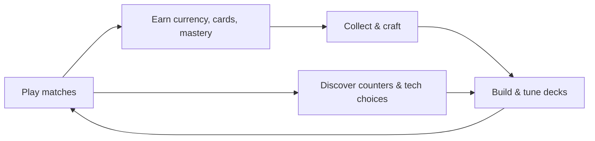
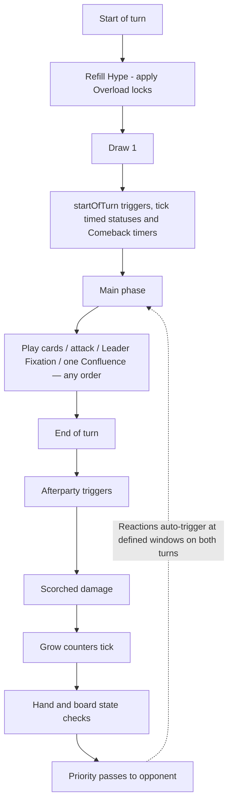
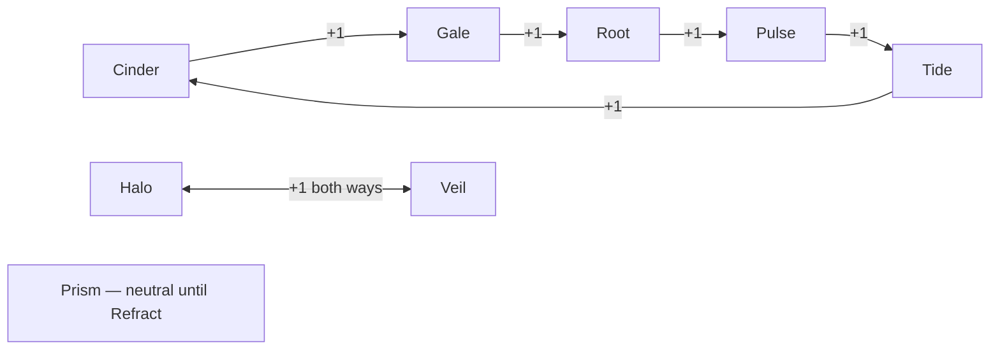

# HYPEBOUND — Game Design Document (GDD)

> **Status: Master overview.** This is the entry point for anyone joining the project.
> It summarizes every system and links to the document that owns it.
> Rules numbers quoted here are summaries of **`00-core-rules.md`**, which is
> CANONICAL — if this document and the core rules ever disagree, the core rules win.
> The technical counterpart is **`../tech/00-architecture-contract.md`** (also canonical).

**Working title:** HYPEBOUND
**Tagline:** *A card game about being chronically online, for people who are chronically online.*

---

## 1. Elevator Pitch

**One sentence:** HYPEBOUND is a comedic, anime-styled collectible card game where rival internet icons — virtual idols, glitch demons, hiking-club paladins — battle for the feed in fast, readable, deeply strategic 5–12 minute matches, in your browser on PC or phone.

**One paragraph:** You are the Leader of an exaggerated online community in a neon "digital nightlife" world. Each turn you spend **Hype** (a clean, ramping resource) to deploy Characters, Actions, and trap-like Reactions, while a second dial — **Obsession** — tempts you to push deeper into the fandom for powerful Leader abilities at the cost of becoming dangerously fragile. Ten factions (from **Neon Idols** to the **Touch-Grass Order**) and eight elemental **Currents** with a simple +1-damage advantage cycle create real deck-building identity without rules bloat. The satire of internet culture is the paint job; underneath is a rigorously readable, deterministic card game with no pay-to-win, published odds, and matches short enough to play "one more" on a lunch break.

---

## 2. Product Snapshot

| Fact | Value |
|---|---|
| Genre | 1v1 collectible card game (Hearthstone-like), plus single-player campaigns |
| Platforms | Desktop browsers (mouse primary); mobile browsers, **landscape only** (touch) |
| Match length target | 5–12 minutes |
| Technology | TypeScript deterministic rules engine; three.js battle board; DOM for all other screens |
| Content model | Fully data-driven: cards, keywords, factions, Currents, balance, missions in JSON |
| Multiplayer | Engine is server-shaped from day one; local vs AI first, authoritative server designed in `../tech/03-multiplayer-architecture.md` |
| Business model | Cosmetics-first. No pay-to-win, no hidden odds, no dark patterns (binding — see §9) |
| Art pipeline | Owner-supplied AI-generated card art dropped in later; game runs fully with generated placeholders keyed by card id |
| Audience rating target | Teen (comedic satire, stylized conflict, no real people, no gambling-pattern monetization) |

---

## 3. Design Pillars

Every feature, card, and screen must pass all five pillars. When pillars conflict, they are listed here in priority order — Pillar 1 wins.

### Pillar 1 — Readable First
The player must always understand what is happening and what will happen. Valid targets are highlighted, damage (including elemental +1) is previewed before confirmation, statuses are icons with distinct shapes and tooltips, trigger order is displayed as it resolves, and no information is ever conveyed by color alone. Animations are exciting the first time and skippable/shortenable forever after. *Litmus test: a new player watching a match can narrate what happened; a colorblind player loses zero information.*

### Pillar 2 — Depth Without a Rules Tax
Easy to learn, hard to master. The base game is one resource (Hype), one attack rule, and short keyword text. Depth comes from combinations — Currents, Confluences, Obsession timing, Reaction bluffing, faction engines — not from exceptions. Every strong strategy has visible counterplay, and alternate win conditions ("Finale" cards) are always telegraphed at least two turns ahead. *Litmus test: the tutorial teaches everything needed for a fair first match in under 10 minutes; ranked players are still discovering lines months later.*

### Pillar 3 — Comedy That Survives Without the Memes
The internet-culture satire is self-aware, affectionate, and original — fandoms, streamers, virtual idols, digital demons, con floors — never references to real, named people. Crucially, the game must be genuinely fun and legible with every joke removed: card names and flavor carry the humor, rules text carries the game. *Litmus test: replace all card names with "Card 1..N" and the game is still excellent; read any card aloud in five years and it is still funny, not dated.*

### Pillar 4 — Ethical Economy
All gameplay-affecting cards are earnable through play. Money buys cosmetics and time-savers only, with exact published probabilities, duplicate protection, guaranteed-card (pity) progress, direct crafting, and spending controls. Forbidden forever: hidden odds, fake discounts, misleading countdowns, real-money-exclusive gameplay cards, and pressure loops that punish healthy play schedules. *Litmus test: a player who never spends can build any competitive deck on a reliable timeline; a player who spends heavily gains zero win-rate.*

### Pillar 5 — Respect the Clock (5–12 Minute Matches)
Matches are designed to resolve in 5–12 minutes: 30-card decks, Hype capped at 10, a 75-second turn timer with a 15-second warning, escalating **Burnout** (fatigue) damage, and pacing rules that forbid long non-interactive combo turns (trigger cascades cap at 20). Menus follow the same principle — Play, Collection, and Deck Builder are always one obvious tap away. *Litmus test: median ranked match ≤ 9 minutes; 95th percentile ≤ 14; no single turn regularly exceeds 90 seconds of real time.*

---

## 4. Target Audience

| Segment | Who they are | What HYPEBOUND gives them |
|---|---|---|
| **Primary — CCG-literate internet natives (16–34)** | Have played Hearthstone-style games; fluent in streaming/fandom culture; play on PC and phone interchangeably | Familiar core loop with fresh identity (Obsession risk dial, Currents, Reactions), a theme that gets them, and an economy that doesn't insult them |
| **Secondary — short-session strategy players** | Want a "real" strategy game in commute-sized bites; bounce off 25-minute matches and 200-page rulebooks | 5–12 minute matches, browser access with nothing to install, readable-first UI, strong single-player modes (roguelike, puzzles, story) |
| **Tertiary — lapsed TCG players** | Burned by pay-to-win economies and FOMO monetization elsewhere | Cosmetics-first model, published odds, direct crafting, catch-up systems, and depth worth returning for |

Explicit non-goals: we do not chase players who want simulation-grade complexity (stack-based interrupt chains, priority passing on every action) or players seeking gambling-style thrill from pack opening — the economy is deliberately boring in the best way.

---

## 5. Core Fantasy

**You are the Leader of a larger-than-life online community, fighting rival communities for the spotlight.** Your deck is your fandom: performers, moderators, cursed hardware, sponsored megaprojects, one guy who insists everyone should go outside. Playing cards *feels* like orchestrating a perfect stream night — Hype builds, the crowd (Obsession) gets more invested, combos land like a viral moment, and your Leader's **Ultimate Fixation** is the moment the whole internet is watching you.

The push-your-luck heart of the fantasy: leaning into your fandom makes you powerful *and* fragile. At 8+ Obsession you are **Obsessed** — taking +1 damage from everything while you charge toward **Full Fixation** at 10. Every faction expresses a recognizable, affectionate archetype of online life (see §7), and the Touch-Grass Order exists specifically to punish players who never log off.

The core loop, at every scale:

Detailed loop and session design: `02-gameplay-loop-and-match-flow.md`.

---

## 6. Rules Summary

Everything in this section is a *summary*. Canonical text and numbers: **`00-core-rules.md`**. All numbers live in `data/balance.json` — never hardcoded.

### 6.1 Match structure at a glance

| Rule | Value |
|---|---|
| Deck | Exactly 30 cards; max 2 copies per card (Legendary: 1); 1 Leader chosen separately |
| Leader health | 30 |
| Board | 6 character slots + 1 location slot per player; max 1 Equipment per character |
| Starting hand | First player 4 cards, second player 5 + **Borrowed Clout** (0-cost Action: "+1 Hype this turn only") |
| Mulligan | Once during setup: shuffle back any subset, redraw the same count |
| Draw | 1 card at start of your turn; hand limit 10 (excess is destroyed — "**Lost in the Feed**") |
| Hype | Max Hype = your turn number, capped at 10; refills at the start of your turn |
| Turn timer | 75 s + 15 s "Stream Buffering" warning rope |
| Fatigue | "**Burnout**": drawing from an empty deck deals 1, 2, 3, … escalating leader damage |
| Victory | Reduce the enemy leader to 0 health; simultaneous 0–0 is a draw |
| Alternate wins | Only via explicit Legendary "Finale" cards: visible to the opponent, ≥ 2 turns from reveal to trigger, always interactable |

Full match flow, phase-by-phase timing, and edge cases: `02-gameplay-loop-and-match-flow.md`.

### 6.2 Hype (primary resource)
A ramping mana resource: max equals your turn number, capped at 10, refills every turn. No resource cards exist, so you are never resource-screwed by draw. Some effects grant temporary Hype (this turn only) or, rarely, permanent extra max Hype (still capped at 10). **Overload (X)** cards trade a strong effect now for X locked Hype next turn.

### 6.3 Obsession (secondary system)
A 0–10 per-player meter — a *strategic risk dial*, never a second card-playing currency. You gain it by supporting your characters (+1 the first time each turn you buff/heal/shield/equip a friendly character), via **Parasocial** triggers, and from explicit effects. You spend it on your Leader's **Fixation** (3 Obsession, once per turn) and **Ultimate Fixation** (7 Obsession, once per match). The risk: at **8+** you are **Obsessed** (leader takes +1 damage from all enemy sources; some enemy cards — notably Touch-Grass Order — gain bonuses against you). At **10**, **Full Fixation**: your Ultimate costs 0 this turn (still once per match), then Obsession resets to 5. Charging your ultimate makes you fragile at the worst possible moment — by design.

### 6.4 Card categories

| Category | In the 30? | One-line summary |
|---|---|---|
| **Leader** | No (1 per deck) | 30 health; passive; Fixation + Ultimate Fixation; defines your faction and Currents |
| **Character** | Yes | Attack/Health body in a board slot; attacks once per turn; summoning sickness unless **Raid** |
| **Action** | Yes | One-shot spell |
| **Reaction** | Yes | Set face-down (max 2 set); auto-triggers on its condition during either player's turn |
| **Equipment** | Yes | Attaches to a friendly character (max 1 each); grants stats/keywords |
| **Location** | Yes | Persistent aura or activated ability with Durability; new location replaces old |
| **Transformation** | Yes | Action subtype: permanently transforms a target into a stated form |
| **Event** | Yes | Global effect for N turns in a visible banner zone (max 1 active per player) |

Combat is simultaneous (attacker and defender trade damage); **Spotlight** forces targeting; **Lurking** prevents it. Nine canonical statuses (Scorched, Shielded, Armor X, Cancelled, Lurking, Weakened X, Empowered X, Cursed, Banished) each have a distinct icon shape. Ten thematic keywords (**Viral, Spotlight, Parasocial, Trending, Collab, Cancelled, Comeback, Afterparty, Raid, Touch Grass**) use fixed templated wording — glossary and templating system: `05-keyword-glossary.md`. Card anatomy, rarity philosophy, and example cards for every faction: `03-card-design-and-example-cards.md`.

### 6.5 Factions (10)
Every card belongs to exactly one faction or is Neutral; a deck uses its Leader's faction + Neutral, further filtered by Currents.

| Faction | Currents | Fantasy | Plays like |
|---|---|---|---|
| **Neon Idols** | Halo / Pulse | Virtual idol groups, arena concerts | Wide boards, buffs, performance combo chains |
| **Gothic Royalty** | Veil / Root | Vampire courts of dead fandoms | Curses, sacrifice, resurrection; slow inevitability |
| **Viral Influencers** | Gale / Cinder | Clout chasers, trend hijackers | Follower tokens, copying, going wide fast |
| **Corporate Creators** | Root / Halo | Media megacorp, sponsorship empire | Hype ramp, contracts, expensive finishers |
| **Digital Demons** | Cinder / Veil | Glitch demons, cursed hardware | High-risk power, corruption, transformations |
| **Cosplay Champions** | Prism / Tide | Con-floor heroes, craftsmanship | Equipment, costume swaps, adaptation |
| **Afterparty Crew** | Cinder / Tide | The 3 A.M. friend group | End-of-turn engines, delayed payoffs |
| **Touch-Grass Order** | Root / Gale | Hiking-club paladins, detox monks | Buff removal, anti-combo, Banish, punishes Obsessed enemies |
| **Algorithm Syndicate** | Pulse / Tide | The recommendation engine as a crime family | Draw, deck manipulation, foresight |
| **Meme Collective** | Prism / Gale | An anarchic meme commune | Bounded randomness, repeated-joke escalation |

Full identities, color language, leaders, and three deck archetypes each: `04-faction-guide.md`.

### 6.6 The Eight Currents (elemental system)
Lore: the **First Signal** once connected all things; the **Great Fracture** split it into seven natural Currents — **Cinder, Tide, Root, Gale, Pulse, Halo, Veil** — with **Prism** emerging where fragments recombine. Every card is attuned to exactly one Current, expressed in its frame shape, icon, VFX, and SFX (never color alone). Each Current has one signature keyword (Scorched, Flow, Grow X, Rushwind, Overload (X), Inspire, Corrupt, Refract).

**Advantage cycle — exactly +1 damage, never more, unless a card states otherwise:**

**Confluences:** playing cards of two compatible Currents in one turn unlocks that pair's free Confluence ability, once per player per turn (nine total: Steamveil, Bloom, Sandstorm, Tempest, Starflare, Blackflame, Sanctuary, Eclipse, Refraction). **Deck rules:** cards must match the Leader's Primary/Secondary Current, plus up to 3 splashed Prism cards. **Pure decks** (single natural Current) trade Confluence access for **Perfect Resonance** — a one-time Current-specific bonus after playing 7 cards of that Current. There is no elemental resource; everything costs Hype. Full lore, per-Current identity kits, and Confluence detail: `06-currents-and-lore.md`.

---

## 7. Modes & Meta-Game Summary

| Area | Highlights | Owning doc |
|---|---|---|
| Game modes | Tutorial, AI practice (6 difficulty tiers up to Boss), casual & ranked constructed, draft/arena, daily challenges, weekly rule modifiers, puzzle battles, boss battles, co-op raids, events, custom/friend matches, tournaments, spectating, replays, sandbox, offline AI | `07-game-modes.md` |
| Ranked | Placements, divisions, MMR, seasonal resets, milestone rank protection, cosmetic season rewards, leaderboards, anti-smurf/anti-cheat, reconnection | `07-game-modes.md` |
| Roguelike campaign | Small temporary deck, branching map, elites, events, temporary cards & upgrades, artifacts, shops, faction bosses — runs feel different but plannable | `08-roguelike-campaign.md` |
| Story campaign | Chapters per major leader/faction; fame, burnout, rivalry, online vs real identity; dialogue, animated portraits, branching decisions | `09-story-campaign.md` |
| Economy | Banners with exact odds, pity progress, duplicate protection, direct crafting, wishlist; cosmetics-first catalog | `10-economy-and-monetization.md` |
| Progression | Account level, faction/leader mastery, character affinity, missions, achievements, battle pass, login rewards — no unhealthy playtime pressure, seasonal catch-up | `11-progression-and-missions.md` |
| Screens & UI | All ~38 required screens, navigation map, lobby rules ("promos never dominate or hide navigation"), battle HUD, UI component list | `12-screens-and-navigation.md` |
| Social | Friends, challenges, deck sharing, spectating, guilds, emotes, moderation-first communication (no open voice chat) | `13-social-and-community.md` |

---

## 8. Presentation Summary

**Visual:** "digital nightlife" — neon, chrome, glass, holograms, virtual concert stages, convention halls — with purple/blue/pink/red/gold accents and social-media motifs (notification pings, live-chat ribbons, follower counters). Premium feel lives in the procedural card frames (one shape language per Current) and board polish, not in the art files, which the owner supplies later; every card renders with a stylish generated placeholder until then. The battle board is three.js with a slightly top-down (~35–40° pitch) Hearthstone-like layout; every other screen is DOM for accessibility and iteration speed. Details: `../art/01-art-direction.md`, `../art/02-animation-vfx-requirements.md`.

**Audio:** faction themes, dynamic battle music, leader intros, card voice lines, five independent volume channels, and a streamer-safe mode; all content is manifest-driven and the game runs silently with zero audio files present. Details: `../art/03-audio-direction.md`.

**Accessibility (binding, from the core rules):** scalable text, reduced motion, colorblind-safe shape+label iconography, high contrast, screen-shake and animation-speed controls, keyboard navigation and remapping, touch support, audio cues.

---

## 9. Product Principles (non-negotiable)

These restate the binding principles of `00-core-rules.md` §10; every discipline is accountable to them.

1. **No pay-to-win.** All gameplay-affecting cards obtainable via play. Money buys cosmetics and time-savers only — with published exact probabilities, duplicate protection, pity progress, spending controls, and direct crafting. No hidden odds, fake discounts, misleading timers, or FOMO loops.
2. **Readable first.** Information never depends on color alone; all animations skippable/shortenable after first view; reduced-motion, colorblind, high-contrast, and scalable-text support are launch requirements, not stretch goals.
3. **Deterministic engine.** Same seed + same action log ⇒ same result, always. Replays, spectating, and server authority all depend on this; `Math.random` and `Date` are banned from the engine.
4. **Data-driven content.** Cards, keywords, factions, Currents, balance, missions, and events are JSON. Adding content of existing mechanic types requires zero engine changes — the owner must be able to add cards, music, and modes without AI assistance.
5. **Honest UI.** No fake online features: modes that need a server are labeled "coming online," never stubbed with lies. Promotions never dominate or hide navigation.

---

## 10. Document Map

Reading order for a new team member: this document → `00-core-rules.md` → your discipline's docs. Canonical documents are marked ★ — they win all conflicts.

| # | Document | Path | What it owns |
|---|---|---|---|
| ★ | Requirements brief | [`../REQUIREMENTS.md`](../REQUIREMENTS.md) | The owner's complete original specification; completeness checklist |
| ★ | Core rules | [`00-core-rules.md`](00-core-rules.md) | Canonical rules: numbers, keywords, statuses, factions, Currents, product principles |
| 01 | Game Design Document | [`01-game-design-document.md`](01-game-design-document.md) | This document — vision, pillars, audience, summaries, doc map |
| 02 | Gameplay loop & match flow | [`02-gameplay-loop-and-match-flow.md`](02-gameplay-loop-and-match-flow.md) | Core loop at all scales; full match-flow diagram; turn phases; pacing targets |
| 03 | Card design & example cards | [`03-card-design-and-example-cards.md`](03-card-design-and-example-cards.md) | Card anatomy, rarity philosophy, design patterns, example cards for all 10 factions |
| 04 | Faction guide | [`04-faction-guide.md`](04-faction-guide.md) | Per-faction identity, color language, leaders, signature mechanics, 3 archetypes each |
| 05 | Keyword glossary | [`05-keyword-glossary.md`](05-keyword-glossary.md) | Canonical keyword/templating system enforced by the card validator |
| 06 | Currents & lore | [`06-currents-and-lore.md`](06-currents-and-lore.md) | First Signal / Great Fracture lore; per-Current identity kits; Confluences; Resonance |
| 07 | Game modes | [`07-game-modes.md`](07-game-modes.md) | All modes incl. ranked system, draft, puzzles, events, tournaments, spectating, replays |
| 08 | Roguelike campaign | [`08-roguelike-campaign.md`](08-roguelike-campaign.md) | Run structure, map generation, artifacts, shops, faction bosses |
| 09 | Story campaign | [`09-story-campaign.md`](09-story-campaign.md) | Chapters, characters, narrative themes, dialogue and branching systems |
| 10 | Economy & monetization | [`10-economy-and-monetization.md`](10-economy-and-monetization.md) | Currencies, banner/pack system, odds & pity, crafting, cosmetics catalog, spending controls |
| 11 | Progression & missions | [`11-progression-and-missions.md`](11-progression-and-missions.md) | Account/faction/leader mastery, missions, achievements, battle pass, catch-up |
| 12 | Screens & navigation | [`12-screens-and-navigation.md`](12-screens-and-navigation.md) | Screen-navigation diagram, every required screen, lobby & battle HUD, UI component list |
| 13 | Social & community | [`13-social-and-community.md`](13-social-and-community.md) | Friends, guilds, spectating, emotes, moderation, safety defaults |
| 14 | Balance assumptions | [`14-balance-assumptions.md`](14-balance-assumptions.md) | Initial costing baselines, stat curves, Current/Confluence guardrail budgets, testing levers |
| ★ | Architecture contract | [`../tech/00-architecture-contract.md`](../tech/00-architecture-contract.md) | Canonical tech: stack, directory layout, engine model, UI architecture, conventions |
| T1 | Card data schema | [`../tech/01-card-data-schema.md`](../tech/01-card-data-schema.md) | JSON card schema, effects DSL (triggers/ops/targets), validation rules |
| T2 | UI & rendering | [`../tech/02-ui-and-rendering.md`](../tech/02-ui-and-rendering.md) | three.js battle scene, presenter/animation queue, card frame renderer, input & responsive layout |
| T3 | Multiplayer architecture | [`../tech/03-multiplayer-architecture.md`](../tech/03-multiplayer-architecture.md) | Authoritative server design, transport, reconnection, replays, anti-cheat |
| T4 | AI design | [`../tech/04-ai-design.md`](../tech/04-ai-design.md) | Six difficulty tiers, evaluator heuristics, boss AI rules |
| T5 | Testing plan | [`../tech/05-testing-plan.md`](../tech/05-testing-plan.md) | Test matrix: every keyword/status/Confluence, determinism, validator, per-faction interactions |
| A1 | Art direction | [`../art/01-art-direction.md`](../art/01-art-direction.md) | Visual style guide, card frame specs per Current, board look, placeholder art requirements |
| A2 | Animation & VFX requirements | [`../art/02-animation-vfx-requirements.md`](../art/02-animation-vfx-requirements.md) | Per-Current VFX language, Confluence flourishes, animation timing/skip rules, reduced motion |
| A3 | Audio direction | [`../art/03-audio-direction.md`](../art/03-audio-direction.md) | Music/SFX/voice requirements, manifest slots, channel mixing, streamer-safe mode |
| P1 | Development milestones | [`../plan/01-development-milestones.md`](../plan/01-development-milestones.md) | Phased delivery plan, milestone acceptance criteria, risk register |

---

## 11. Glossary of Project Terms

| Term | Meaning |
|---|---|
| **Hype** | Primary resource; max = turn number, cap 10, refills each turn |
| **Obsession** | 0–10 risk meter; fuels Leader Fixations; 8+ = **Obsessed** (fragile), 10 = **Full Fixation** |
| **Fixation / Ultimate Fixation** | Leader abilities costing 3 (once per turn) / 7 Obsession (once per match) |
| **Current** | One of 8 elements (Cinder, Tide, Root, Gale, Pulse, Halo, Veil, Prism); every card has exactly one |
| **Confluence** | Free once-per-turn ability unlocked by playing two compatible Currents in a turn |
| **Perfect Resonance** | One-time bonus for pure single-Current decks after 7 cards of that Current |
| **Finale card** | Legendary alternate-win card; always visible, ≥ 2 turns to trigger, always interactable |
| **Burnout** | Fatigue: escalating damage when drawing from an empty deck |
| **Lost in the Feed** | Destruction of cards drawn over the 10-card hand limit |
| **Borrowed Clout** | Second player's compensation card (+1 Hype this turn only) |
| **Stream Buffering** | The 15-second turn-timer warning rope |
| **EngineEvent / PlayerIntent** | The engine's only outputs/inputs — see the architecture contract |

---

*Last updated: 2026-07-24. Maintained alongside `00-core-rules.md`; propose rules changes there first, then update summaries here.*
