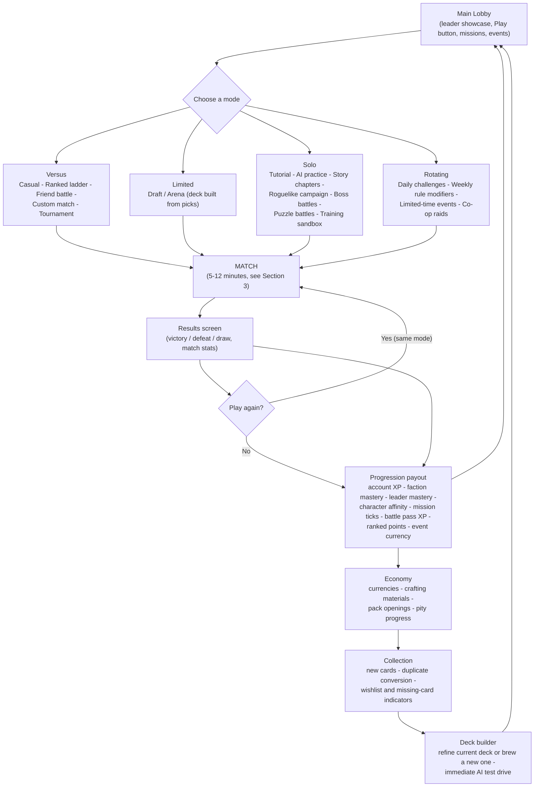
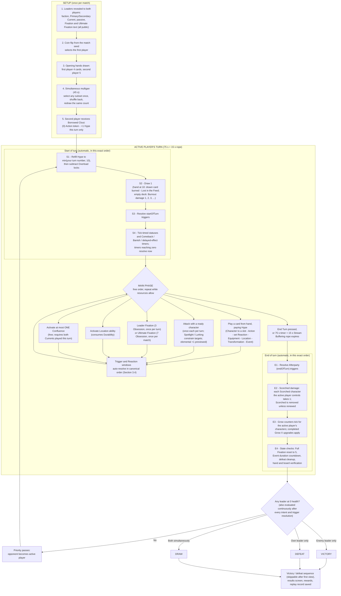
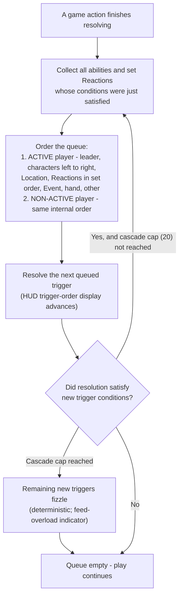

# HYPEBOUND — Gameplay Loop & Match Flow

> **Status: Derived design document.** Rules authority is
> [`00-core-rules.md`](00-core-rules.md) (canonical). Engine behavior authority is
> [`../tech/00-architecture-contract.md`](../tech/00-architecture-contract.md).
> Where those documents are silent, this document makes the binding decision and
> marks it **[DECISION]**. All numbers referenced here live in `data/balance.json`.

---

## 1. Scope and reading guide

This document defines the game at two zoom levels:

| Level | Loop | Cycle time | Section |
|---|---|---|---|
| Session (macro) | play → progress → collect → build → play | 15–40 min (2–4 matches) | §2 |
| Match (micro) | setup → alternating turns → match end | 5–12 min | §3 |

Terminology used throughout:

- **Turn** — one player's turn. Turn numbers are counted **per player** (canon: Max Hype = *your* turn number). "Turn 5" means that player's fifth turn.
- **Round** — one turn from each player.
- **Active player** — the player whose turn it is. Only the active player submits intents; the non-active player interacts exclusively through pre-set Reactions and triggered abilities.

---

## 2. Session-level core gameplay loop

### 2.1 Loop diagram



### 2.2 Loop narrative

The match is the atomic unit of a session. Every match — win, lose, or draw —
feeds progression (missions, mastery, battle pass), progression feeds the
economy (currencies, materials, packs), the economy feeds the collection, and
the collection feeds the deck builder, which changes how the next match plays.
The loop is closed at every mode: no mode awards zero progression
(REQUIREMENTS: "rewards experimentation and regular play").

Session design targets **[DECISION]**:

| Metric | Target |
|---|---|
| One match | 5–12 min (§5) |
| One daily-mission clear | 1–3 matches |
| Typical session | 2–4 matches, 15–40 min |
| Loop friction | Lobby → in-match in ≤ 3 clicks; results → next match in ≤ 2 clicks |

### 2.3 Mode branches — how each mode enters the match loop

All modes run the same deterministic engine (`createMatch(config)`); a mode is a
config delta plus a meta-layer around the match. **[DECISION]** — the deltas below:

| Mode | Deck source | Match rule delta | Meta layer after match |
|---|---|---|---|
| Interactive tutorial | Scripted fixed decks | Scripted draws (fixed seed), no turn timer, guided prompts | One-time rewards, unlocks AI practice |
| AI practice / offline AI | Player deck | AI opponent (Beginner–Expert), pausable | Reduced XP, mission progress |
| Casual constructed | Player deck | None | Full XP, missions, battle pass |
| Ranked ladder | Player deck | None; MMR matchmaking, reconnection rules | Ranked points, seasonal rewards |
| Draft / Arena | Drafted 30-card deck | None in-match | Run record (wins/losses), run rewards |
| Roguelike campaign | Temporary run deck | Artifacts as match modifiers, boss rules | Map node advance, card/artifact picks |
| Story chapters | Fixed or player deck per encounter | Scripted encounters, unique boss rules | Chapter progress, dialogue, unlocks |
| Daily challenge | Player or preset deck | One daily rule modifier | Daily mission credit |
| Weekly modifier | Player deck | Rotating global mutator (from `events.json`) | Weekly mission credit |
| Puzzle battles | Preset | Loads a mid-match `MatchState`; win within constraints | Puzzle completion rewards |
| Boss battles / co-op raids | Player deck | Boss leader with unique cards/rules; raids are server modes ("coming online" until then) | Event currency |
| Custom / friend battle | Player deck | Host-configurable (timer, health, modifiers) | No ranked effect; missions still tick |
| Tournament | Locked deck lineup | Bracket rules | Tournament rewards |
| Spectator / replay | n/a | No intents; `MatchRecord` playback through the presenter | None |

---

## 3. Match-level flow

### 3.1 Match flow diagram



### 3.2 Setup sequence (detail)

| # | Step | Rule | Source |
|---|---|---|---|
| 1 | Leader reveal | Both leaders shown with faction, Currents, passive, Fixation, and Ultimate Fixation. **All leader information is open information for the whole match** — the deck's legal Current pool is therefore public knowledge. | **[DECISION]** (canon silent on visibility) |
| 2 | Coin flip | First player chosen by one draw from the match's seeded PRNG (`rng.ts`), before any intents. Deterministic and replayable. Presented as a short themed animation ("the Algorithm picks who goes live first"), ≤ 5 s, skippable. | **[DECISION]**; determinism per architecture contract §3 |
| 3 | Opening hands | First player draws 4, second player draws 5. | Canon §2 |
| 4 | Mulligan | Simultaneous, one pass each, **45 s** window (`timer.mulliganSeconds` **[DECISION]**). Select any subset of the opening hand; selected cards are shuffled back **first**, then the same count is drawn (redrawing a returned card is possible). Confirming early ends your side immediately; on timeout, the current selection is applied (no selection = keep all). | Canon §2; timer value is a decision |
| 5 | Borrowed Clout | After mulligan resolves, the second player's hand gains **Borrowed Clout** — (0) Action token: "+1 Hype this turn only." It cannot be mulliganed (it arrives after the mulligan). Second player therefore starts with 6 cards in hand including the token. | Canon §2; timing and hand-count reading are **[DECISION]** |

**Borrowed Clout attunement [DECISION].** Canon §8.3 requires every card to have
exactly one Current; Borrowed Clout is attuned to **Prism** for display purposes,
but **system tokens (`token: true`) never count toward Confluence pair detection,
Perfect Resonance, or "cards of a Current played" effects.** Without this
exclusion, the second player of every Prism-leader matchup would get a free
Refraction setup on turn 1. Tokens *do* count as "cards played this turn" for
**Trending**-style counters (they are genuinely played from hand).

### 3.3 Turn sequence — canonical order, expanded

The order below is canon §2 verbatim, with engine-level sub-steps made explicit.

#### Start of turn (automatic; no player input; reactions may still trigger)

| Step | What happens | Notes |
|---|---|---|
| **S1 Refill Hype** | Max Hype = min(your turn number, 10). Current Hype refills to max, then **Overload (X)** locks from last turn are subtracted (locked crystals shown as jammed/crackling). | Permanent max-Hype bonuses (rare) apply before the cap check; cap is absolute. |
| **S2 Draw 1** | Draw the top card. At hand limit 10, the drawn card is destroyed instead — **Lost in the Feed** (shown shredding into feed static). Empty deck: no card; take **Burnout** damage instead (1, then 2, then 3, … per draw attempt). | Draw-triggered abilities and Reactions fire here in normal trigger order. |
| **S3 startOfTurn triggers** | All `startOfTurn` abilities resolve in canonical trigger order (§3.4). | |
| **S4 Timer tick** | Timed statuses (e.g. "Weakened 1 until your next turn"), **Comeback** timers, **Banish** returns, and `scheduleDelayed` effects that key off *this player's* turn start tick down; anything reaching zero resolves now (Comeback cards return to hand, Banished characters return to the board with base stats). | Each timer is bound at creation to a specific player's turn boundary, per its card text. **[DECISION]** |

#### Main phase (player-driven; any order; repeat while resources allow)

| Action | Cost | Limit |
|---|---|---|
| Play a Character | Hype | Board max 6; summoning sickness unless **Raid** |
| Play an Action / Transformation | Hype | Needs a legal target if "choose" (canon §5.3) |
| Set a Reaction face-down | Hype (paid on set) | Max 2 set at once |
| Play an Equipment | Hype | 1 per character; new replaces old |
| Play a Location | Hype | 1 slot; new replaces old |
| Play an Event | Hype | 1 active per player; new replaces old |
| Attack with a ready character | Free | Once per character per turn; Spotlight taunts; Lurking untargetable |
| Leader **Fixation** | 3 Obsession (no Hype **[DECISION]**) | Once per turn |
| Leader **Ultimate Fixation** | 7 Obsession (0 at Full Fixation) | Once per match |
| Activate Location ability | Durability | As stated on the Location |
| Activate a Confluence | Free | **One per player per turn** (§3.5) |
| End turn | — | Ends main phase immediately |

**Turn timer.** 75 s per turn from turn 1 (`timer.turnSeconds`); at expiry, the
15 s **"Stream Buffering"** rope burns visibly (`timer.ropeSeconds`). When the
rope ends: any in-progress drag/targeting is cancelled, and `endTurn` is issued
automatically. **[DECISION]** AFK protection: a player whose turn ends by rope
with **zero intents submitted** for 2 consecutive turns receives a warning; a
3rd such turn auto-concedes (`timer.afkTurnLimit: 3`).

#### End of turn (automatic; exact order is load-bearing)

| Step | What happens | Why the order matters |
|---|---|---|
| **E1 Afterparty** | All of the active player's `endOfTurn` (**Afterparty**) triggers resolve, in canonical trigger order (§3.4). | Afterparty engines act **before** burn damage — an Afterparty heal can save a Scorched ally. |
| **E2 Scorched** | Each **Scorched** character the active player controls takes 1 damage; the status is then removed unless renewed. (Scorched resolves on **its controller's** turn end — enemy Scorched characters burn on the enemy's turn.) | Burn deaths happen before Grow, so a Scorched Grow character must survive the burn to tick. |
| **E3 Grow** | Each surviving **Grow X** character of the active player advances its counter for this turn-end; counters reaching X apply their permanent upgrade now. | Growth is the last "gain" of the turn; it can never be burned off in the same step. |
| **E4 State checks** | In order: (a) **Full Fixation** reset — if Obsession hit 10 this turn, reset it to 5; (b) active player's **Event** banner duration decrements, expiring at 0 (`eventTick`); (c) defeat cleanup and Comeback scheduling for anything that died in E1–E3; (d) hand/board invariants verified; (e) victory/defeat/draw evaluation. | **[DECISION]** — canon names the step; this defines its contents. |

Victory is *also* evaluated continuously after every intent and every trigger
resolution (state-based); E4(e) is the final gate before priority passes.

### 3.4 Reaction windows and trigger ordering

**Design intent:** the non-active player interacts without ever holding
priority. There are **no manual interrupts** — Reactions are set face-down in
advance (paying Hype on set) and fire automatically. This keeps turns fast and
makes the 75 s timer honest.

Canonical rules (canon §5.5) plus binding refinements:

1. **When windows open.** A trigger window opens after every *resolved game
   action*: a card finishing resolution, an attack, a damage or heal instance,
   a defeat, a status application, a Confluence activation, a Fixation, a draw,
   and each start/end-of-turn step. Reactions and triggered abilities whose
   conditions were satisfied by that action enter the queue. Windows exist in
   **both** players' turns, including during S1–S4 and E1–E4.
2. **Ordering.** Active player's triggers first, then the non-active player's.
   Within one player **[DECISION — zone refinement of canon's "board order
   left→right, then hand/other zones"]**: **Leader (passive) → characters
   left→right → Location → set Reactions in set order (oldest first) → Event
   banner → hand → deck/other.**
3. **Cascades.** Resolving a trigger may satisfy new conditions; new triggers
   are appended using the same ordering rule. A single root action may cascade
   at most **20** triggered effects (`rules.triggerCap`); beyond that, further
   triggers fizzle with a visible "feed overload" indicator.
4. **Reactions are single-use. [DECISION]** A Reaction reveals when it fires,
   resolves, and is then discarded. If its condition is met while another
   trigger is resolving, it queues like any trigger. A revealed Reaction that
   finds no legal target on resolution fizzles (still discarded).
5. **Attack-declaration timing. [DECISION]** "When attacked / when the enemy
   attacks" Reactions fire at attack declaration and resolve **before** combat
   damage; "when damaged / when defeated" conditions fire after damage.
6. **UI contract.** The trigger-order display (battle HUD) shows the queue as
   it resolves; each entry names its source card. This is the REQUIREMENTS
   "trigger-order display" and is fed exclusively by `TriggerQueued` /
   `TriggerResolved` engine events.



**Worked micro-example** (used again in §4): the active player plays a (3)
Character. The played card has no `onPlay` ability (active player's triggers:
none). The opponent has a face-down Reaction *"When the enemy plays a Character
costing (3) or more, deal 1 damage to it."* — it is the only non-active trigger,
so it reveals, resolves, and is discarded. Had the active player's card also
had an `onPlay` trigger, that trigger would resolve **first** (active player
priority), and could even remove the threat before the Reaction resolves — but
the Reaction's condition was already satisfied, so it still fires if its target
is legal at resolution.

### 3.5 Confluence activation timing

Prerequisites and limits (canon §8.5, with timing made exact):

| Rule | Value |
|---|---|
| Window | Your own **main phase only** — never during the opponent's turn, never during S/E steps |
| Prerequisite | This turn you have **played** at least one non-token card of each Current in an available pair (setting a Reaction counts as playing it **[DECISION]**; a Reaction *triggering* on the enemy turn does not register a Current for you **[DECISION]**) |
| Frequency | **Once per player per turn**, even if several pairs qualify — you pick one |
| Cost | Free (no Hype, no Obsession) |
| Counts as | An *activation*, not a card play — it advances no Trending, Confluence, or Resonance counters **[DECISION]** |
| Resolution | Immediate and atomic; it opens normal trigger windows (a leader passive or Reaction may respond) |
| UI | Button appears the moment the pair is satisfied, showing both Current sigils; press-and-hold (or hover) shows the full rules preview from `predict()`; all 9 Confluence rules inspectable in-match |
| Reset | Current-played registers clear at end of turn |

**Pair availability.** A deck's possible Confluences are exactly those of the 9
canonical entries (canon §8.5) it can assemble from cards it can legally play:

- **Dual natural decks** — their leader's Primary+Secondary pair, *if that pair
  is among the 9*.
- **Prism-primary decks** (Cosplay Champions, Meme Collective) — **Refraction**
  (Prism + any second Current played that turn).
- **Any deck splashing Prism** (up to 3 cards) — **Refraction** becomes
  available on turns where a Prism splash card and any natural-Current card are
  both played. **[DECISION]** — this follows the literal "Prism + any" pair and
  is a deliberate reward for spending splash slots; per canon §8.7, competitive
  viability must never *require* it.

> **Flagged canon gap (reported upward, not resolved here):** four faction
> Current pairs have **no Confluence** in the canonical 9-entry table:
> Neon Idols (Halo+Pulse), Gothic Royalty (Veil+Root), Viral Influencers
> (Gale+Cinder), and Algorithm Syndicate (Pulse+Tide) — yet canon §8.6 says dual
> decks trade Resonance for "their two Currents' pair." This document does not
> invent new Confluences; until canon is amended, those four factions' dual
> decks reach Confluences only via the Prism-splash route above.

### 3.6 Match end

| Outcome | Condition | Sequence |
|---|---|---|
| **Victory** | Enemy leader at 0 health (checked continuously and at E4) | `MatchEnded` event → victory animation (8–12 s, skippable after first view) → results screen |
| **Defeat** | Own leader at 0 | Defeat sequence, same pacing |
| **Draw** | Both leaders reach 0 in the same resolution (e.g. mutual burn) | Neutral sequence; **[DECISION]** a draw changes no ranked points and still grants participation/mission progress |
| **Concede** | `concede` intent, available any time via the in-match menu | Immediate defeat |
| **Finale (alternate win)** | An explicit Legendary Finale card completes its visible, ≥2-turn, interactable condition (canon §2) | Treated as victory with a card-specific flourish |
| **AFK timeout** | 3 consecutive zero-intent rope turns (§3.3) | Auto-concede |

After `MatchEnded`: the results screen shows outcome, match stats (damage,
cards played, Confluences, Obsession peaks), then the rewards payout (§2). The
complete `MatchRecord { seed, deckLists, intents[] }` is saved for replays and
match history. Disconnection/reconnection policy for online modes:
[`../tech/03-multiplayer-architecture.md`](../tech/03-multiplayer-architecture.md);
against local AI, the match simply pauses.

---

## 4. Annotated example turn

Player A ("you") pilots **Afterparty Crew** (Cinder primary / Tide secondary —
Confluence: **Steamveil**). Player B pilots **Digital Demons** (Veil primary /
Cinder secondary — Confluence: **Blackflame**). It is **A's turn 5**.

### 4.1 Card reference (example cards; all names are original archetypes)

| Card | Faction | Current | Type | Rarity | Cost | Stats | Rules text |
|---|---|---|---|---|---|---|---|
| **DJ Last Call** | Afterparty Crew | Cinder | Leader | — | — | 30 HP | Passive **Set List**: *When you activate a Confluence, your leader gains Armor 1.* Fixation (3): *Deal 1 damage to a character.* Ultimate (7): *This turn, your Afterparty triggers resolve twice.* |
| **Blue Screen Baron** | Digital Demons | Veil | Leader | — | — | 30 HP | Passive **Fatal Exception**: *The first time a friendly character is defeated each turn, deal 1 damage to the enemy leader.* |
| Chatstorm Piper | Afterparty Crew | Tide | Character | Rare | 2 | 3/4 | **Parasocial** *(When you target this friendly character with a card or ability, it gains +1/+1 and you gain 1 Obsession.)* |
| Bouncer of the Vibe | Afterparty Crew | Tide | Character | Common | 3 | 2/5 | **Grow 3**: *gains +2/+2.* |
| Afterhours Firebreather | Afterparty Crew | Cinder | Character | Common | 3 | 3/3 | **Afterparty**: *Deal 1 damage to the enemy leader.* |
| Neon Nightcap | Afterparty Crew | Tide | Action | Common | 2 | — | *Heal a friendly character 3.* |
| Popup Impling | Digital Demons | Cinder | Character | Common | 2 | 3/3 | — |
| Doomscroll Fiend | Digital Demons | Veil | Character | Rare | 3 | 2/5 | *When another friendly character is defeated, this gains +1 Attack.* |
| Forced Update | Digital Demons | Veil | Reaction | Common | 1 | — | *When the enemy plays a Character costing (3) or more, deal 1 damage to it.* |

### 4.2 State before A's turn 5

| | Player A (DJ Last Call) | Player B (Blue Screen Baron) |
|---|---|---|
| Leader | 24 / 30 HP | 26 / 30 HP |
| Obsession | 2 | 4 |
| Hand / Deck | 3 / 21 | 5 / 20 |
| Board slot 1 | Chatstorm Piper 3/4, **at 2 HP**, **Scorched** (from B's burn Action last turn) | Popup Impling 3/3 |
| Board slot 2 | Bouncer of the Vibe 2/5, Grow counter **2 of 3** | Doomscroll Fiend 2/5 |
| Reactions set | none | 1 face-down (Forced Update, set turn 4) |

### 4.3 Turn log

**Start of turn** (~4 s of presentation):

1. **S1 — Refill Hype.** A's turn number is 5 → Max Hype 5; refill to **5/5**.
   No Overload locks (none were incurred last turn).
2. **S2 — Draw 1.** A draws **Neon Nightcap**. Hand 4, deck 20. Hand limit 10
   not reached; no Burnout (deck non-empty).
3. **S3 — startOfTurn triggers.** None on either side.
4. **S4 — Timer tick.** No timed statuses, Comeback, Banish, or delayed effects
   are bound to A's turn start. (Note: Piper's **Scorched** is *not* ticked
   here — it resolves at E2.)

**Main phase** (player time; this turn takes ~48 s of the 75 s timer):

5. **Play Afterhours Firebreather** (3) into slot 3. **Hype 5 → 2.**
   - Trigger window: A has no `onPlay` triggers (active player first — empty).
     B's face-down **Forced Update** condition is met (enemy Character, cost ≥ 3):
     it reveals, deals 1 to Firebreather (**3/3 → at 2 HP**), and is discarded.
     B now has 0 Reactions set.
   - Confluence tracker: A has played **Cinder** this turn (Steamveil ½).
6. **Play Neon Nightcap** (2), targeting Chatstorm Piper. **Hype 2 → 0.**
   - Card resolves first: heal 3, capped at missing health → Piper heals 2
     (back to 4/4, full).
   - Trigger window, active player first: Piper's **Parasocial** (it was
     targeted by a friendly card): Piper gains +1/+1 → **4/5, at 5 HP**, and A
     gains **+1 Obsession**.
   - Support check: this is the first time this turn A supported (healed) a
     friendly character → **+1 Obsession** (`obsession.supportPerTurn`).
   - **Obsession: 2 → 4** (one from support-per-turn, one from Parasocial —
     stacking, distinct sources). A further heal/buff this turn would give no
     additional *support* Obsession, though Parasocial would still pay.
   - Confluence tracker: A has now also played **Tide** → the **Steamveil**
     button lights up on the HUD with the Cinder and Tide sigils.
7. **Activate Confluence — Steamveil** (free; A's one Confluence this turn).
   Target: Afterhours Firebreather → *cannot be targeted by enemy Actions until
   A's next turn* (protecting the Afterparty engine from Demon removal).
   - Trigger window: A's leader passive **Set List** fires → DJ Last Call gains
     **Armor 1**.
8. **Attack: Chatstorm Piper → Popup Impling.** The targeting arrow preview
   (from `predict()`, before confirmation) reads:
   - on Impling: **5 damage** = 4 (Piper's Attack) **+ 1 elemental** (Tide
     beats Cinder, canon §8.4), with a lethal marker (5 ≥ 3 HP);
   - on Piper: **3 counter-damage** (Impling's Attack; Cinder has no bonus
     against Tide — the cycle is one-directional).
   - A confirms. Combat is simultaneous: Impling takes 5 and is defeated;
     Piper takes 3 → **at 2 HP**.
   - Trigger window on the defeat — active player (A) first: none. Then B, in
     B's internal order (leader before characters): **Fatal Exception** — first
     friendly defeat this turn → 1 damage to A's leader (**24 → 23**; Armor 1
     absorbs nothing yet? No — Armor absorbs first: **Armor 1 → 0, leader stays
     24**). Then **Doomscroll Fiend** gains +1 Attack → **3/5**.
9. **Attack: Bouncer of the Vibe → Blue Screen Baron.** Preview: **2 damage**,
   no elemental bonus (Tide only beats Cinder; the Baron is Veil — only Halo
   and Veil punish each other). B's leader **26 → 24**. Leaders deal no
   counter-damage.
10. Firebreather cannot attack (summoning sickness, no **Raid**). A has 4
    Obsession and *could* use Fixation (3) — and declines, banking toward the
    Ultimate at 7. The meter shows the risk ahead: at 8+ A would become
    **Obsessed** (+1 damage taken from all enemy sources).
11. **End Turn** pressed at ~48 s. The rope never appeared.

**End of turn** (automatic, exact canonical order):

12. **E1 — Afterparty.** A's `endOfTurn` triggers in board order left→right:
    only Afterhours Firebreather (slot 3) → 1 damage to B's leader
    (**24 → 23**). (If B had a set Reaction such as *"When your leader takes
    damage during the enemy turn, draw 1,"* it would resolve immediately after
    this trigger — non-active player's triggers follow the active player's.)
13. **E2 — Scorched.** A's Scorched characters burn: Piper takes 1
    (**2 HP → 1 HP**). Scorched is removed (not renewed this turn).
14. **E3 — Grow.** Bouncer of the Vibe survived A's turn-end → Grow counter
    **2 → 3 = complete**: permanent +2/+2 → **4/7, at 7 HP**. (Had the Bouncer
    been Scorched and died at E2, no tick — E2 before E3 is why.)
15. **E4 — State checks.** No Full Fixation (Obsession 4). No Event banners.
    No pending defeats. Hand 2 of 10, board 3 of 6 — legal. Victory check:
    A 24, B 23 — match continues.
16. **Priority passes.** B becomes active player and begins **B's turn 5**.

**Turn summary ledgers:**

| Ledger | Start → End |
|---|---|
| A Hype | 5 → 2 (Firebreather) → 0 (Nightcap); Confluence and attacks free |
| A Obsession | 2 → 4 (+1 support, +1 Parasocial) |
| B leader HP | 26 → 24 (Bouncer attack) → 23 (Afterparty) |
| A leader HP | 24 → 24 (Fatal Exception absorbed by Set List Armor 1) |
| Board delta | A: +Firebreather (at 2 HP), Piper 4/5 at 1 HP, Bouncer grown to 4/7. B: −Popup Impling, Doomscroll Fiend 3/5, Reaction spent |

**Engine view of step 8** (the attack), as the presenter receives it —
abbreviated `EngineEvent` stream per the architecture contract:

```jsonc
[
  { "type": "AttackDeclared",   "attackerId": "a-piper", "targetId": "b-impling" },
  { "type": "DamageDealt",      "sourceId": "a-piper",   "targetId": "b-impling",
    "amount": 5, "elementalBonus": 1 },
  { "type": "DamageDealt",      "sourceId": "b-impling", "targetId": "a-piper",
    "amount": 3, "elementalBonus": 0 },
  { "type": "CharacterDefeated","characterId": "b-impling" },
  { "type": "TriggerQueued",    "sourceId": "b-leader",  "trigger": "onDefeat" },
  { "type": "DamageDealt",      "sourceId": "b-leader",  "targetId": "a-leader",
    "amount": 1, "elementalBonus": 0, "absorbedByArmor": 1 },
  { "type": "TriggerQueued",    "sourceId": "b-fiend",   "trigger": "onDefeat" },
  { "type": "StatChanged",      "characterId": "b-fiend", "attack": 3 }
]
```

The pre-confirmation preview came from `predict(state, attackIntent)`:
`{ totalDamage: 5, base: 4, elementalBonus: 1, lethal: true, counterDamage: 3 }` —
the UI renders the "+1" with the Tide-beats-Cinder advantage badge (icon +
label, never color alone).

---

## 5. Pacing analysis — why the numbers land in 5–12 minutes

### 5.1 Time model **[DECISION — design targets, validated in playtest]**

Matchmaking/loading are excluded from the 5–12 minute window; it is measured
from leader reveal to the results screen.

| Segment | Target duration |
|---|---|
| Setup: leader reveal + coin flip | ≤ 10 s (skippable to 3 s) |
| Mulligan | 15–45 s (45 s cap; most players confirm early) |
| Turn transition + start-of-turn presentation | ≤ 4 s |
| Single action animation (full speed) | ≤ 1.2 s; fast mode ≈ 0.5 s; instant near-0 (per-event-type memory after first view) |
| Victory/defeat sequence | 8–12 s, skippable |

Behavioral turn-duration targets (what a typical turn actually takes — the 75 s
timer is a ceiling, not a norm):

| Per-player turn | Typical action count | Target duration |
|---|---|---|
| 1–2 | 0–1 plays | 10–20 s |
| 3–5 | 2–3 actions | 25–40 s |
| 6–9 | 3–5 actions | 35–55 s |
| 10+ | 4–6 actions | 40–60 s |
| Absolute ceiling | — | 90 s (75 + 15 rope) |

The structural reason early turns are short is **Hype = turn number**: turns
1–3 physically cannot contain many actions (1–3 Hype buys one or two cards).
The ramp back-loads complexity exactly where the game is being decided.

### 5.2 Turn-count targets by archetype speed **[DECISION — binding balance targets]**

"Lethal turn" = the per-player turn by which the archetype aims to reduce the
enemy leader's 30 HP to 0 against a goldfish (non-interacting) opponent; real
matches add 1–2 turns of interaction. Expected duration uses the §5.1 model
with stage-weighted averages (aggro turns are simpler and faster: ≈ 24 s mean;
midrange ≈ 28 s; control ≈ 30 s) plus ~60 s of setup/outro.

| Speed band | Representative archetypes | Lethal turn (per player) | Total turns (both players) | Expected duration |
|---|---|---|---|---|
| Hyper-aggro | Viral Influencers follower flood (Gale/Cinder); Digital Demons all-in burn (Cinder/Veil) | 6–7 | 11–13 | 5–6.5 min |
| Aggro-tempo | Neon Idols performance curve (Halo/Pulse); Afterparty Crew burn engine (Cinder/Tide) | 7–8 | 13–16 | 6–8 min |
| Midrange | Cosplay Champions equipment (Prism/Tide); Touch-Grass tempo (Root/Gale); Meme Collective value (Prism/Gale) | 8–10 | 15–19 | 7–9.5 min |
| Control | Gothic Royalty attrition (Veil/Root); Corporate Creators ramp (Root/Halo); Algorithm Syndicate engine (Pulse/Tide) | 10–12 | 19–23 | 8.5–11.5 min |
| Attrition mirror (worst case) | Control vs control, Finale clocks running | 13–15 | 25–29 | 11.5–12.5 min — acceptable rare tail, tuning trigger if common |

Telemetry guardrail: if any ladder-common archetype's median match falls
outside 5–12 minutes, or the control-mirror tail exceeds ~5% of matches, the
levers in §5.5 are pulled.

### 5.3 Damage tempo math

**Aggro must be able to kill by turn 7; control must be able to stop it by
turn 6.** With 30 leader HP, the aggro cumulative-damage budget is:

| Per-player turn | 1 | 2 | 3 | 4 | 5 | 6 | 7 |
|---|---|---|---|---|---|---|---|
| Damage that turn | 0 | 2 | 4 | 5 | 6 | 7 | 6+ |
| Cumulative | 0 | 2 | 6 | 11 | 17 | 24 | 30 |

This curve is achievable with Hype = turn number: a wide board of 2–3 Attack
bodies (turn-3 onward) plus 1–2 points of reach (burn, Afterparty pings, the
elemental +1). It is *stoppable* because every faction receives at least one
board-wide answer in the 4–6 Hype band (canon §8.7: every Current gets
defensive tools; Viral Influencers' listed weakness is exactly this AoE
window). Games therefore fork around turns 5–7 — aggro closes, or control
stabilizes at 12–18 HP and the game enters its 8–12 midgame, ended by
finishers rather than stalling out:

- **Hype cap 10** (reached on turn 10) means both players deploy their largest
  threats from turn 8–10; the value gap between "cheap answers" and "big
  threats" collapses, so control cannot durdle indefinitely.
- **Obsession ultimates (7)** come online around turns 5–8 for support-heavy
  decks (+1/turn support cadence plus Parasocial and card effects), creating a
  deliberate midgame power spike — and the 8+ **Obsessed** penalty makes
  holding a charged meter dangerous, discouraging passive hoarding.
- **Elemental +1** makes trades ~25–50% more efficient on typical 2–4 Attack
  bodies, so boards resolve instead of gridlocking.
- **Finale cards** give slow decks a *visible, interactable, ≥2-turn* clock —
  inevitability with counterplay windows, not extra length.

### 5.4 Backstops (hard caps on degenerate length)

| Backstop | Math | Effect |
|---|---|---|
| **Burnout** (fatigue) | First player: 4 opening + 1/turn → deck of 30 empties after the turn-26 draw; Burnout starts turn 27 at 1 and escalates (1+2+…+8 = 36 ≥ 30) | Any leader is dead by roughly per-player turn 33–34 even from full health; pure-stall mirrors cannot exceed ~28–30 total minutes even theoretically, and reaching fatigue at all is a 2× outlier vs. targets |
| **Turn timer** | 75 + 15 s rope, from turn 1 | Worst-case *individual* turn is 90 s regardless of board complexity |
| **AFK rule** | 3 zero-intent rope turns → auto-concede | Absent players cannot hold matches hostage |
| **Trigger cap** | 20 per root action | Combo turns are bounded in wall-clock time |
| **Hand limit 10 / 1 Event / 1 Location / 6 slots** | Zone caps | Bounded state = bounded decision time per turn |

### 5.5 Tuning levers (all in `data/balance.json`)

If telemetry drifts outside the 5–12 window, adjust in this order (smallest
blast radius first):

| Symptom | Lever | Key |
|---|---|---|
| Turns too slow in real time | Animation budgets, default speed after first view | presenter config |
| Players routinely rope | Turn timer / rope | `timer.turnSeconds`, `timer.ropeSeconds` |
| Aggro kills before turn 6 | Leader health up; cheap-drop statlines down | `leader.startingHealth`, card data |
| Games regularly pass turn 13 | AoE cost band up; finisher cost band down; Finale clocks shortened | card data |
| Control mirrors stall | Burnout start earlier / increment up | `fatigue.start`, `fatigue.increment` |
| Ultimates online too early/late | Obsession gain cadence | `obsession.supportPerTurn`, card data |

Leader health (30), Hype cap (10), and draw rate (1/turn) are **identity
numbers** — changing them reshapes every archetype at once and requires a full
balance pass; they are last-resort levers.

---

## 6. Cross-references

| Topic | Document |
|---|---|
| Canonical rules (authority for everything above) | [`00-core-rules.md`](00-core-rules.md) |
| Faction identities, leaders, deck archetypes | [`04-faction-guide.md`](04-faction-guide.md) |
| Keyword templating and full glossary | [`05-keyword-glossary.md`](05-keyword-glossary.md) |
| Currents, Confluences, Resonance lore and data | [`06-currents-and-lore.md`](06-currents-and-lore.md) |
| Engine, intents, events, determinism, `predict()` | [`../tech/00-architecture-contract.md`](../tech/00-architecture-contract.md) |
| Server authority, reconnection, spectating | [`../tech/03-multiplayer-architecture.md`](../tech/03-multiplayer-architecture.md) |
