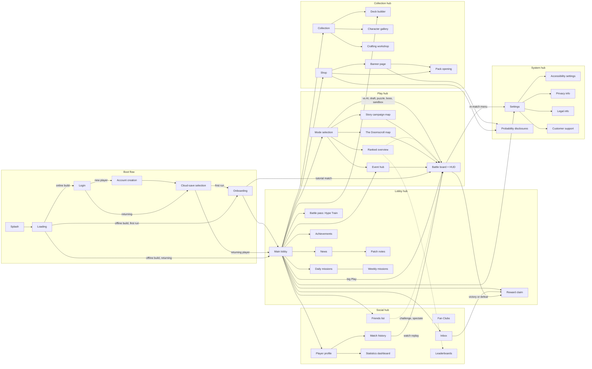

# HYPEBOUND — Screens & Navigation

> **Status:** Design specification. Subordinate to `00-core-rules.md` (rules canon) and
> `../tech/00-architecture-contract.md` (tech canon). Screen implementations live in
> `src/ui/screens/` (DOM) and `src/ui/battle/` (three.js board), routed by `src/ui/shell.ts`.
>
> This document covers all 39 required screens plus the Battle board, the full
> navigation graph, and two detailed layout specifications (Main Lobby, Battle Interface).

---

## 1. Navigation model

### 1.1 Routing

All screens are addressed by hash routes handled by `src/ui/shell.ts`. The router owns a
back stack; the browser Back button and the in-app Back control are equivalent.

| Concept | Rule |
|---|---|
| Route form | `#/segment` or `#/segment/child` (e.g. `#/settings/accessibility`) |
| Screen lifecycle | `enter(params)` → `resume()` / `suspend()` → `exit()`; screens must release three.js resources on `exit()` |
| Back stack depth | Unlimited; **Back from any hub root returns to Main Lobby; Back from Main Lobby does nothing** (never exits mid-session) |
| Deep links | Every route is directly enterable (guarded: routes gated by unlocks redirect to their hub root with a toast) |
| Battle exception | `#/battle` cannot be entered by URL alone; it requires an active `LocalMatchDriver` session. A dead link redirects to `#/modes`. Leaving `#/battle` mid-match opens the Concede confirmation |

### 1.2 Screen types

| Type | Behavior |
|---|---|
| **Boot screen** | Full screen, no chrome, linear flow only (Splash → … → Main Lobby) |
| **Hub root** | Full screen with persistent top bar + bottom navigation bar |
| **Sub-screen** | Full screen with top bar (Back + title + currencies); no bottom nav bar |
| **Overlay** | Modal on top of the current screen (card enlargement, reward claim popup, in-battle menu); dismissible; scrim behind; never stacks more than 2 deep |
| **Battle** | three.js scene + DOM HUD; no top bar / nav bar; its own in-match menu |

Global (not screens): the **portrait-rotation overlay** on mobile ("Rotate your device — HYPEBOUND is landscape only") and the **connection-lost banner** (online builds).

### 1.3 Persistent chrome

- **Top bar** (all hub roots and sub-screens): Back (sub-screens only), screen title, player
  chip (avatar + name + level), currency balances (see §1.4), Settings gear. Height 56 px
  at 1280×720 reference; scales with UI text setting.
- **Bottom navigation bar** (hub roots only): fixed order —
  `PLAY · COLLECTION · DECK BUILDER · MODES · EVENTS · SHOP · SOCIAL · INBOX · NEWS`.
  The first three are the mandated always-easy-to-find entries and are never reordered,
  hidden, or covered (see §5.4 promo rules). Height 64 px reference; minimum hit target
  44×44 px per control.

### 1.4 Currencies (displayed in top bar)

Names are decided here (canon is silent); values and sinks live in the economy model and
`data/balance.json`.

| Currency | Name | Earned by | Spent on |
|---|---|---|---|
| Soft | **Buzz** | Matches, missions, achievements, events | Card packs, standard cosmetics |
| Premium | **Clout** | Purchases; also earnable slowly via battle pass and achievements | Cosmetics, banner pulls, time-savers (never exclusive gameplay power — core rules §10) |
| Crafting | **Static** | Dismantling duplicates | Direct crafting of any card |
| Event | per-event (e.g. **Con Tickets**) | The active event only | That event's reward shop |

### 1.5 Availability legend (offline build vs designed-for-online)

Per the architecture contract §7 (**no fake online UI**): server-dependent modes and
screens are shown honestly as "Coming online" — greyed entries with an explainer panel
describing the feature — never stubbed with fake data, fake friends, or fake ladders.

| Tag | Meaning |
|---|---|
| **NOW** | Fully functional in the current offline build (local profile, `save/` persistence, vs-AI matches) |
| **NOW (reduced)** | Ships now with a local-only subset; the online remainder is labeled "Coming online" inside the screen |
| **ONLINE** | Designed and specced, requires the future server; reachable entry points show the "Coming online" tag, or (boot-flow auth screens) are skipped entirely by the offline boot path |

---

## 2. Screen inventory

All 39 required screens plus the Battle board (an implementation necessity, not one of the
39 listed screens).

| # | Screen | Route | Hub | Type | Availability |
|---|---|---|---|---|---|
| 1 | Splash | (boot, unrouted) | Boot flow | Boot | NOW |
| 2 | Loading | (boot, unrouted) | Boot flow | Boot | NOW |
| 3 | Login | `#/login` | Boot flow | Boot | ONLINE |
| 4 | Account creation | `#/signup` | Boot flow | Boot | ONLINE |
| 5 | Cloud-save selection | `#/saves` | Boot flow | Boot | ONLINE |
| 6 | Onboarding | `#/onboarding` | Boot flow | Boot | NOW |
| 7 | Main lobby | `#/lobby` | Lobby hub | Hub root | NOW |
| 8 | News | `#/news` | Lobby hub | Hub root | NOW (reduced) |
| 9 | Patch notes | `#/news/patch-notes` | Lobby hub | Sub-screen | NOW |
| 10 | Reward claim | `#/rewards` | Lobby hub | Sub-screen + overlay | NOW |
| 11 | Battle pass ("Hype Train") | `#/pass` | Lobby hub | Sub-screen | NOW (reduced) |
| 12 | Daily missions | `#/missions/daily` | Lobby hub | Sub-screen | NOW |
| 13 | Weekly missions | `#/missions/weekly` | Lobby hub | Sub-screen | NOW |
| 14 | Achievements | `#/achievements` | Lobby hub | Sub-screen | NOW |
| 15 | Collection | `#/collection` | Collection hub | Hub root | NOW |
| 16 | Deck builder | `#/decks` (`#/decks/:slot`) | Collection hub | Hub root | NOW |
| 17 | Character gallery | `#/gallery` | Collection hub | Sub-screen | NOW |
| 18 | Crafting workshop | `#/workshop` | Collection hub | Sub-screen | NOW |
| 19 | Banner page | `#/banners` | Collection hub | Sub-screen | NOW (reduced) |
| 20 | Pack opening | `#/packs/open` | Collection hub | Sub-screen | NOW |
| 21 | Shop | `#/shop` | Collection hub | Hub root | NOW (reduced) |
| 22 | Mode selection | `#/modes` | Play hub | Hub root | NOW (reduced) |
| 23 | Ranked overview | `#/ranked` | Play hub | Sub-screen | ONLINE |
| 24 | Event hub | `#/events` | Play hub | Hub root | NOW (reduced) |
| 25 | Story campaign map | `#/story` | Play hub | Sub-screen | NOW |
| 26 | Roguelike campaign map ("The Doomscroll") | `#/doomscroll` | Play hub | Sub-screen | NOW |
| — | Battle (board + HUD) | `#/battle` | Play hub | Battle | NOW (vs AI, replays, sandbox) |
| 27 | Friends list | `#/friends` | Social hub | Sub-screen | ONLINE |
| 28 | Guilds / communities ("Fan Clubs") | `#/clubs` | Social hub | Sub-screen | ONLINE |
| 29 | Inbox | `#/inbox` | Social hub | Hub root | NOW (reduced) |
| 30 | Player profile | `#/profile` | Social hub | Sub-screen | NOW |
| 31 | Match history | `#/profile/history` | Social hub | Sub-screen | NOW |
| 32 | Statistics dashboard | `#/profile/stats` | Social hub | Sub-screen | NOW |
| 33 | Leaderboards | `#/leaderboards` | Social hub | Sub-screen | ONLINE |
| 34 | Settings | `#/settings` | System hub | Sub-screen + battle overlay | NOW |
| 35 | Accessibility settings | `#/settings/accessibility` | System hub | Sub-screen | NOW |
| 36 | Probability disclosures | `#/fairness` | System hub | Sub-screen | NOW |
| 37 | Privacy info | `#/privacy` | System hub | Sub-screen | NOW |
| 38 | Legal info | `#/legal` | System hub | Sub-screen | NOW |
| 39 | Customer support | `#/support` | System hub | Sub-screen | NOW (reduced) |

Match-adjacent **overlays** that are not top-level screens: Mulligan, Victory/Defeat
sequence, in-battle menu, draft-pick view (Remix Draft flow), Doomscroll node events,
card enlargement, status inspection, Currents interaction guide.

---

## 3. Screen navigation diagram

Solid nodes ship in the offline build; dashed nodes are designed-for-online. Edges show
primary navigation; additionally, the bottom nav bar links every hub root from any other
hub root, and the Settings gear is reachable from every screen (including Battle, as an
overlay).



---

## 4. Screen specifications

Format per screen: **Purpose** / **Key elements** / **Entry points** / **Exit points**.
Metadata line repeats route and availability from §2.

### 4.1 Boot flow

#### 4.1.1 Splash
`(unrouted)` · Boot · **NOW**

**Purpose.** Instant brand moment while the app shell initializes; legal ownership line.

**Key elements.** HYPEBOUND logotype with a single short neon-flicker animation
(respects reduced motion: static logo); studio line; build version string bottom-left
(e.g. `v0.4.1 (offline)`); "streamer-safe audio: ON/OFF" badge if the setting is active.

**Entry points.** App launch only.

**Exit points.** Auto-advances to Loading after 2.5 s or on any input, whichever is first.
No interaction besides skip.

#### 4.1.2 Loading
`(unrouted)` · Boot · **NOW**

**Purpose.** Load and zod-validate all `data/*.json` bundles, warm the card-frame
renderer, restore the save envelope.

**Key elements.** Determinate progress bar with stage label ("Validating cards… 7/14
bundles"); rotating gameplay tip (from i18n tip list, 4 s cadence); one showcased card
render (proves the renderer is warm); on validation failure, an error dialog with
"Retry" and "Copy diagnostic report".

**Entry points.** Splash; also shown on hard reload and on returning from a version
migration.

**Exit points.** Online build → Login. Offline build → Onboarding (first run) or Main
lobby (returning; local profile auto-loaded from `save/`). Failure → retry loop.

#### 4.1.3 Login
`#/login` · Boot · **ONLINE**

**Purpose.** Authenticate against the future account service. Not rendered in the offline
build — the boot path skips the entire auth trio rather than faking it.

**Key elements.** Email + password; "Play as guest" (local-only profile, upgradeable
later); "Create account"; "Forgot password"; region/language selector; links to
Privacy info and Legal info.

**Entry points.** Loading (online build); session expiry from any screen.

**Exit points.** Success → Cloud-save selection. "Create account" → Account creation.
Guest → Onboarding/Main lobby. Legal links → Privacy info / Legal info (return here).

#### 4.1.4 Account creation
`#/signup` · Boot · **ONLINE**

**Purpose.** Create a new account with safe defaults.

**Key elements.** Display name (profanity/impersonation filter, 3–16 chars); email;
password with strength meter; date-of-birth age gate; required checkboxes for Terms and
Privacy (link to Legal/Privacy screens); marketing opt-in **unchecked by default**;
"Back to login".

**Entry points.** Login.

**Exit points.** Success → Cloud-save selection (fresh account: creates empty cloud
slot, proceeds directly). Cancel → Login.

#### 4.1.5 Cloud-save selection
`#/saves` · Boot · **ONLINE**

**Purpose.** Resolve which save to use when a device has a local profile and the account
has cloud data.

**Key elements.** Two summary cards — LOCAL vs CLOUD — each showing: account level,
cards owned, decks, last played timestamp, device name; a diff line ("Cloud is 3 days
newer"); explicit choice buttons "Use cloud" / "Keep local (upload)"; irreversibility
warning dialog on confirm; "Merge is not supported" note.

**Entry points.** Login / Account creation; also triggered when a sync conflict is
detected at lobby entry.

**Exit points.** Choice confirmed → Onboarding (if the chosen save is fresh) or Main
lobby.

#### 4.1.6 Onboarding
`#/onboarding` · Boot · **NOW**

**Purpose.** First-run flow: pick a starter leader, play the interactive tutorial match,
receive starter decks. Doubles as the "Interactive tutorial" game mode (replayable later
from Mode selection).

**Key elements.** (1) Starter-leader pick — three leaders spanning playstyles (Neon
Idols = synergy, Digital Demons = risk, Touch-Grass Order = control) with a one-line
pitch each; (2) scripted tutorial battle "First Stream" on the real battle board (turns
1–4 fully guided with highlight callouts covering Hype, playing a Character, attacking,
Obsession gain, End Turn; turns 5+ free play vs Beginner AI); (3) reward beat — all ten
faction starter decks granted (free starter decks are required by core rules §10),
tutorial missions unlocked.

**Entry points.** Loading (offline first run); Cloud-save selection (fresh save); Mode
selection → "Tutorial" (replay).

**Exit points.** Tutorial complete → Reward claim overlay → Main lobby. "Skip tutorial"
(confirmation dialog; rewards still granted via Reward claim) → Main lobby.

### 4.2 Lobby hub

#### 4.2.1 Main lobby
`#/lobby` · Hub root · **NOW**

**Purpose.** Home screen: launch play in one tap, surface progression and live content
without burying navigation. Full layout spec in §5.

**Key elements.** Leader showcase (animated, three.js lobby background scene); big PLAY
button with quick-mode selector; active deck widget; ranked division badge (offline
build: "Ranked — coming online"); daily mission progress; active events; featured
banner tile; battle-pass progress; online friends strip (offline: hidden, not faked);
unclaimed rewards badge; news carousel; currency balances; bottom nav bar.

**Entry points.** Boot flow; Back from any hub root; post-match return; nav bar from
anywhere.

**Exit points.** Every hub root via nav bar; PLAY → Battle (last-played mode) or Mode
selection (chevron); each widget deep-links to its screen (missions → Daily missions,
pass → Battle pass, rewards → Reward claim, banner tile → Banner page, news card →
News, rank badge → Ranked overview, leader showcase → Character gallery, deck widget →
Deck builder); Settings gear → Settings.

#### 4.2.2 News
`#/news` · Hub root · **NOW (reduced)**

**Purpose.** All announcements: events, seasons, dev updates. Offline build reads a local
news JSON shipped with the build; live feed is an online feature.

**Key elements.** Article list (image, title, date, category chip: Event / Update /
Esports / Dev Blog); category filter; article reader view with rich text and deep-link
buttons ("Open Event Hub"); unread markers; "Patch notes" shortcut.

**Entry points.** Nav bar; lobby news carousel card; inbox announcement message.

**Exit points.** Patch notes; deep links to Event hub / Banner page / Battle pass; Back
→ previous screen.

#### 4.2.3 Patch notes
`#/news/patch-notes` · Sub-screen · **NOW**

**Purpose.** Versioned, precise record of every balance and content change.

**Key elements.** Version list (newest first) with date and headline; per-version
sections: Cards changed (before → after diff rendered on real card frames), Rules,
Systems, Bug fixes; filter by faction/Current; search; "changed since you last played"
highlight band.

**Entry points.** News; post-update dialog on first launch after a version change;
Collection (card detail → "recent changes").

**Exit points.** Card diff → Collection detail view of that card; Back → News.

#### 4.2.4 Reward claim
`#/rewards` · Sub-screen + overlay · **NOW**

**Purpose.** Single queue where every earned grant lands (missions, pass tiers,
achievements, events, mastery, compensation). No reward is auto-consumed invisibly.

**Key elements.** Grant list grouped by source with icons and amounts (cards shown on
their frames); "Claim" per item and "Claim all"; short celebratory reveal animation
(skippable, and auto-shortened after first view per core rules §10); overflow note for
duplicate protection ("converted to 25 Static"); empty state.

**Entry points.** Lobby rewards badge; Inbox attachments; automatic overlay after
Victory/Defeat sequences and Battle pass tier-ups; Achievements "claim" buttons.

**Exit points.** Back to invoking screen; "claimed card" tap → Collection detail.

#### 4.2.5 Battle pass — "Hype Train"
`#/pass` · Sub-screen · **NOW (reduced)**

**Purpose.** Seasonal progression track. Decision: 50 tiers per ~10-week season; free
track carries all gameplay-relevant items (packs, Buzz, Static); premium track
(Clout-purchased) is cosmetics-first per core rules §10. Offline build runs the free
track from local `progression.json` data; premium purchase is "Coming online".

**Key elements.** Horizontal tier rail (auto-scrolls to current tier) with free row and
premium row; tier XP bar with sources breakdown ("match XP, mission XP"); season name,
theme art, honest end date; catch-up note ("tier XP requirement decreases in the final
3 weeks"); claim buttons feeding Reward claim; premium purchase panel with full contents
listed before purchase.

**Entry points.** Lobby pass widget; nav via lobby; season-start news deep link;
post-match XP summary tap.

**Exit points.** Reward claim; Shop (premium purchase, online); Back → Lobby.

#### 4.2.6 Daily missions
`#/missions/daily` · Sub-screen · **NOW**

**Purpose.** Three light daily objectives; the primary daily Buzz/XP source.

**Key elements.** 3 mission cards (from `data/missions.json`) with progress bars and
rewards; one free reroll per day; true reset countdown (24:00 UTC); "extra slot
tomorrow" preview; tab switch to Weekly. Missions are completable in any mode including
vs AI (no unhealthy-playtime pressure; a missed day never removes earned progress).

**Entry points.** Lobby mission widget; Weekly missions tab; post-match summary
("mission progressed" tap).

**Exit points.** Weekly missions (tab); mission "Go" button deep-links to the relevant
mode (e.g. "Play 10 Halo cards" → Mode selection with deck hint); Back → Lobby.

#### 4.2.7 Weekly missions
`#/missions/weekly` · Sub-screen · **NOW**

**Purpose.** Three larger weekly objectives that reward experimentation (play other
factions/Currents, use Confluences, win with different leaders).

**Key elements.** Same layout as Daily with weekly reset countdown (Monday 00:00 UTC);
larger rewards (pass XP + Static); progress persists across the week; catch-up note
("weekly missions from last week remain claimable for 3 days").

**Entry points.** Daily missions (tab); lobby mission widget (when dailies are done it
deep-links here).

**Exit points.** Daily missions (tab); mode deep links; Back → Lobby.

#### 4.2.8 Achievements
`#/achievements` · Sub-screen · **NOW**

**Purpose.** Long-term goals and titles; the browsable trophy room.

**Key elements.** Category tabs: Combat, Collection, Currents, Factions, Modes, Social
(Social tab marked "Coming online" in offline build); tiered achievements (I–V) with
progress bars; rewards (titles, profile frames, Buzz, Static, Clout for milestone
tiers); title equip shortcut; completion percentage per category; hidden achievements
shown as "???" with an unlock hint.

**Entry points.** Lobby (profile chip → profile → achievements, and lobby overflow);
Player profile "Achievements" button; unlock toast tap.

**Exit points.** Reward claim (claiming); Player profile (equip title); Back.

### 4.3 Collection hub

#### 4.3.1 Collection
`#/collection` · Hub root · **NOW**

**Purpose.** Browse, search, and understand every card; entry point to crafting and
lore.

**Key elements.** Text search (name, rules text, flavor); filter rail: faction, cost,
rarity, type, keyword, Current, ownership (owned / missing / new); grid view (card
frames, owned-count pips, missing cards greyed with "craftable" chip) and detail view
(full card, animated premium preview toggle, keyword explanations, interaction notes
("How this works with…"), lore page tab, variant selector); favorites (pin) and locks
(exclude from mass-dismantle); craft/dismantle buttons with Static prices; duplicate
protection notice; "suggested replacements" for missing cards; per-set completion
meter.

**Entry points.** Nav bar; lobby; Deck builder ("full collection" jump); Patch notes
card diff; Reward claim card tap; Pack opening ("view in collection").

**Exit points.** Crafting workshop (with card pre-selected); Character gallery (from a
Leader/Character's lore tab); Deck builder ("add to deck" when invoked from there);
Back.

#### 4.3.2 Deck builder
`#/decks`, `#/decks/:slot` · Hub root · **NOW**

**Purpose.** Create and refine 30-card decks under Leader/faction/Current rules
(core rules §7, §8.6); validate before play.

**Key elements.** Deck slot list (12 save slots) with covers and validity badges;
editor: leader selection first (drives legal card pool: leader's faction + Neutral,
Primary/Secondary Currents, Prism splash counter 0–3); card list with counts (2 max, 1
for Legendary); live Hype-cost curve histogram; type distribution bar; Current split
donut with Resonance/Confluence indicator ("Pure Halo — Perfect Resonance enabled" /
"Halo+Pulse — Confluence: Starflare? no — Tempest/…"); validation panel (errors
must be fixed to save as playable); suggested cards and replacements-for-missing;
"Auto-complete deck" and AI-assisted build ("build around this card"); deck name (16
chars), custom cover pick, card-back pick; import/export deck code (clipboard string);
per-deck stats tab (games, winrate — from local match history); "Compare versions"
(diff against last saved); **"Test vs AI"** button that launches an immediate practice
match with the draft deck.

**Entry points.** Nav bar; lobby deck widget "Edit"; Collection ("new deck from this
leader"); Mode selection (deck picker "edit").

**Exit points.** Battle ("Test vs AI"); Collection (browse pool full-screen); Mode
selection ("save and play"); Back (autosaves draft as unplayable if invalid).

#### 4.3.3 Character gallery
`#/gallery` · Sub-screen · **NOW**

**Purpose.** The cast browser: leaders and named characters as characters, not cards —
lore, mastery, skins, voice lines.

**Key elements.** Character grid filtered by faction; character page: animated portrait,
faction/Current badges, biography and relationships ("Rivals: …"), leader mastery
level and character affinity progress with reward track, unlocked skins/alt-art
carousel with equip, voice-line jukebox (respects streamer-safe setting), "cards
featuring this character" strip, story-chapter link when one exists.

**Entry points.** Lobby leader showcase tap; Collection lore tab; Story campaign map
(character node); Player profile showcase.

**Exit points.** Story campaign map (chapter link); Collection (card strip); Back.

#### 4.3.4 Crafting workshop
`#/workshop` · Sub-screen · **NOW**

**Purpose.** Deterministic acquisition: turn Static into exactly the card you want;
dismantle spares. Direct crafting of every gameplay card is a core-rules §10 guarantee.

**Key elements.** Static balance (large); craft panel with rarity price list — defaults
(live in `data/balance.json` `economy.craftCost` / `economy.dustValue`): craft
40/100/400/1600 Static for Common/Rare/Epic/Legendary, dismantle 10/25/100/400 (premium
variants dismantle higher); search + "missing cards" filter; mass-dismantle spares
(respects locks, duplicate protection, confirmation with itemized list); crafting queue
animation (skippable); "recently changed cards refund full Static for 2 weeks" notice
fed by Patch notes.

**Entry points.** Collection craft/dismantle buttons; Deck builder missing-card chip;
Shop ("out of packs to buy? craft directly"); nav via Collection.

**Exit points.** Collection (view crafted card); Deck builder (return with card added,
when invoked from there); Back.

#### 4.3.5 Banner page
`#/banners` · Sub-screen · **NOW (reduced)**

**Purpose.** Premium presentation of current card banners with total transparency —
every element required by the brief, nothing forbidden by core rules §10. Offline
build: banners open with earned Buzz only; Clout purchase is "Coming online".

**Key elements.** Featured banner art + name + honest duration (absolute end datetime,
no fake countdowns); featured-card strip with interactive full-card previews; 1-pack
and 10-pack buttons with prices in both currencies; currency balances; **"Rates"
button → exact probability table inline + link to Probability disclosures**;
guaranteed-card (pity) progress bar with the exact rule stated ("Legendary guaranteed
within 30 packs; featured within 60 — progress carries between same-type banners");
wishlist (pick 3 cards to weight duplicate protection toward); targeted-card system
("choose your guaranteed featured card"); opening-history log; duplicate-conversion
table (what a dupe becomes in Static); first-time reward badge; banner rules text;
animation-skip toggle; banner list rail (active + upcoming + rerun schedule).

**Entry points.** Shop; lobby featured-banner tile; news deep link.

**Exit points.** Pack opening (after a pull); Probability disclosures; Shop; Back.

#### 4.3.6 Pack opening
`#/packs/open` · Sub-screen · **NOW**

**Purpose.** The reveal ceremony. Decision: packs contain 5 cards, rarity floor 1
Rare+, exact odds published on the Probability disclosures screen.

**Key elements.** Pack stack (count of unopened packs by type); tap/drag-to-tear
opening scene with per-rarity reveal VFX (Legendary gets the big moment); "Reveal all"
and "Skip animation" (remembered); x10 batch grid result; duplicate conversions shown
inline ("+25 Static"); new-card badge and "view in Collection"; running session
summary; reduced-motion variant (instant grid).

**Entry points.** Banner page (post-pull); Shop (owned packs); Reward claim (pack
grants).

**Exit points.** Collection (new card); Banner page ("pull again"); Back.

#### 4.3.7 Shop
`#/shop` · Hub root · **NOW (reduced)**

**Purpose.** Cosmetics-first storefront. Offline build sells Buzz-priced cosmetics and
packs only; the Clout top-up tab and real-money flows are "Coming online" (no fake
purchase buttons).

**Key elements.** Tabs: Featured / Cosmetics (card backs, leader skins, portraits,
emotes, battlefields, profile frames, intro & victory animations, alt art, holo
effects, music packs, UI themes) / Packs / Clout (online); every item shows full
preview before purchase (3D preview for battlefields/skins); prices in one currency
each, no fake discounts or strikethrough games; purchase confirmation with balance
after; spending controls panel (monthly Clout limit, purchase-confirmation delay,
self-exclusion) linked from every tab; restore-purchases (online); Probability
disclosures link wherever packs are sold.

**Entry points.** Nav bar; lobby; Banner page; Battle pass premium panel.

**Exit points.** Banner page; Pack opening; Probability disclosures; Settings (spending
controls detail); Back.

### 4.4 Play hub

#### 4.4.1 Mode selection
`#/modes` · Hub root · **NOW (reduced)**

**Purpose.** Every way to play, honestly labeled. This is the screen where the
"no fake online UI" rule is most visible: server modes are present, greyed, and
tagged **Coming online** with an explainer — never queueable.

**Key elements.** Mode grid grouped in four bands, each tile showing name, 1-line
description, deck requirement, and availability tag:

| Band | Modes | Offline build |
|---|---|---|
| Learn | Interactive tutorial, VS AI practice (Beginner–Expert), Training sandbox | NOW |
| Solo | Story campaign, The Doomscroll (roguelike), Daily challenges, Puzzle battles, Boss battles, This Week's Meta (weekly modifier, date-seeded from local data), Remix Draft vs AI | NOW |
| Versus | Casual constructed, Ranked ladder, Friend battles, Custom match (vs AI now; vs humans online), Tournament mode | Custom vs AI NOW; rest ONLINE |
| Watch & co-op | Co-op raids, Spectator mode, Match replays | Replays NOW; rest ONLINE |

Deck picker drawer (slots + validity, "edit" jump); AI difficulty selector where
relevant; last-played mode is highlighted (it is what the lobby PLAY button launches).

**Entry points.** Nav bar; lobby PLAY chevron; mission "Go" deep links.

**Exit points.** Battle (playable modes); Ranked overview; Story map; Doomscroll map;
Event hub; Deck builder (deck picker "edit"); Back → Lobby.

#### 4.4.2 Ranked overview
`#/ranked` · Sub-screen · **ONLINE**

**Purpose.** Ladder home: rank state, season, rewards, rules. Requires the
matchmaking server; offline build shows the mode tile as "Coming online" and this
screen renders the honest explainer panel only.

**Key elements.** Rank badge and division — tiers (decision):
**Lurker → Follower → Poster → Influencer → Trendsetter → Icon → Terminally Online**
(each tier IV–I divisions; top tier is MMR-ordered); placement state (5 placement
matches); MMR-driven matchmaking note; rank-protection markers at tier floors; season
timeline with reset rules (soft MMR squish) and seasonal cosmetic reward track
preview; per-season deck statistics (games/winrate by deck); leaderboard shortcut;
fair-play panel (anti-smurf, anti-cheat, reconnection policy summary); "Queue" button.

**Entry points.** Mode selection; lobby rank badge; Leaderboards.

**Exit points.** Battle (queue pop); Leaderboards; Reward claim (season rewards);
Back.

#### 4.4.3 Event hub
`#/events` · Hub root · **NOW (reduced)**

**Purpose.** Limited-time content in one place. Offline build runs data-driven local
events (from `data/events.json`, date-windowed); live-ops events are online.

**Key elements.** Active event cards (art, honest end datetime, mode rules, event
currency balance, reward shop); upcoming rail; past-events archive with rerun notices
("Event reruns are guaranteed" per core rules §10); event mission list; event
leaderboard tab (online); rules popup per event ("This Week's Meta: all Afterparty
triggers fire twice").

**Entry points.** Nav bar; lobby events widget; news deep links; mission deep links.

**Exit points.** Battle (event match); event reward shop → Reward claim; Back.

#### 4.4.4 Story campaign map
`#/story` · Sub-screen · **NOW**

**Purpose.** Chapter-based narrative per major leader/faction: dialogue, battles,
branching decisions.

**Key elements.** Faction-chapter shelf (locked chapters show unlock conditions);
chapter map: linear node path with node types (dialogue scene with animated portraits,
battle encounter, decision node with visible branch split, reward node); completion
stars per node (win / win with faction deck / bonus objective); decision recap ("You
sided with the moderators"); replay any completed node; skip-dialogue and
dialogue-log controls; subtitle support.

**Entry points.** Mode selection; Character gallery chapter links; lobby event widget
during story events.

**Exit points.** Battle (encounter nodes); dialogue overlay (scene nodes); Reward
claim (chapter completion); Back.

#### 4.4.5 Roguelike campaign map — "The Doomscroll"
`#/doomscroll` · Sub-screen · **NOW**

**Purpose.** Run-based single-player: a small temporary deck grows through a branching
node map toward a faction boss. Runs are seeded (deterministic engine) so a run is
replayable and shareable by seed.

**Key elements.** Run setup panel (choose leader; starting 15-card temporary deck;
optional unlocked starting artifact; seed display/entry); branching map (3 acts, ~8
floors each) with node icons: normal fight, elite fight, random event, shop, healing
node, recruit node, boss; current run sidebar: temporary deck list, passive artifacts,
card upgrades, leader HP carried between fights, Buzz-of-the-run currency; node
preview on hover (fight difficulty, event hint); "Abandon run" (confirmation, records
stats); post-run summary with unlock track (new starting artifacts, cosmetics).

**Entry points.** Mode selection; lobby events widget during Doomscroll events.

**Exit points.** Battle (fight nodes — battle uses run deck and run rules); event/shop
overlays (map-level, not separate screens); post-run summary → Reward claim → Mode
selection; Back (run persists, resumable).

#### 4.4.6 Battle (board + HUD) — not one of the 39
`#/battle` · Battle · **NOW** (vs AI, tutorial, solo modes, replays, sandbox)

**Purpose.** The match itself: three.js board + DOM HUD, fed exclusively by
`EngineEvent`s via `presenter.ts`. Full layout spec in §6.

**Key elements.** See §6 — leaders/health, Hype, Obsession meters, hand, deck/discard
counters, board slots, timers, End Turn, history rail, trigger-order display,
targeting, previews, inspection overlays, emotes, in-match menu, victory/defeat.

**Entry points.** Lobby PLAY; Mode selection; Ranked queue (online); Story/Doomscroll
nodes; Event hub; Deck builder "Test vs AI"; Onboarding tutorial; Match history
replays; Friends challenge/spectate (online).

**Exit points.** Victory/Defeat sequence → Reward claim → originating screen; Concede
(via in-match menu, confirmed) → originating screen; replays/spectate → their list
screen on exit.

### 4.5 Social hub

#### 4.5.1 Friends list
`#/friends` · Sub-screen · **ONLINE**

**Purpose.** Friends, presence, direct interaction. Offline build shows the honest
explainer panel; no fake friends, no fake presence.

**Key elements.** Friend list with online status and current activity ("In battle —
spectate?"); add friend by player ID; requests inbox; per-friend actions: direct
challenge (custom match), spectate, share deck (sends deck code to their Inbox),
recent-opponents list with "add friend"; block and report actions; privacy quick-link
(who can see status / send requests — safe defaults: friends-of-friends off, requests
from recent opponents on).

**Entry points.** Nav bar (SOCIAL); lobby friends widget; post-match opponent line.

**Exit points.** Battle (challenge accept / spectate); Player profile (tap friend);
Inbox (deck shares); Settings → privacy; Back.

#### 4.5.2 Guilds / communities — "Fan Clubs"
`#/clubs` · Sub-screen · **ONLINE**

**Purpose.** Small communities (up to 30 members) with shared goals. Moderated by
design: no unrestricted public voice chat exists anywhere in the product.

**Key elements.** Club search/browse (name, language, activity level, "open /
apply / invite-only"); club page: banner, motto, roster with roles (Leader / Mod /
Member), weekly club missions with shared progress bar and all-members rewards,
friendly-tournament scheduler (bracket of members), club feed (text chat with
word-filter, slow-mode default, report/mute per message), club customization
(cosmetic banner items); create-club flow (name filter, costs Buzz).

**Entry points.** Nav bar (SOCIAL); lobby overflow; invite links from Inbox.

**Exit points.** Battle (friendly tournament match); Player profile (member tap);
Reward claim (club mission rewards); Back.

#### 4.5.3 Inbox
`#/inbox` · Hub root · **NOW (reduced)**

**Purpose.** System and social messages with attachments. Offline build carries local
system mail only (version-migration grants, returning-player rewards, event notices);
player-to-player items are online.

**Key elements.** Message list (unread badges, sender: System / Club / Friend);
message view with attachments routed through Reward claim (never auto-claimed); deck
codes render as tappable deck previews ("Save to slot…"); moderation notices; delete /
mark-read; retention note ("mail expires in 30 days — attachments are reclaimed to
Reward claim").

**Entry points.** Nav bar; lobby inbox badge; push-style toast tap.

**Exit points.** Reward claim; Deck builder (import shared deck); News (announcement
links); Back.

#### 4.5.4 Player profile
`#/profile` (own), `#/profile/:id` (others, online) · Sub-screen · **NOW**

**Purpose.** Identity and showcase; the hub for history and statistics.

**Key elements.** Avatar portrait + profile frame + equipped title (all editable via
cosmetic picker); account level and XP; faction mastery bars (10) and top leader
mastery; showcase shelf (pin 3 of: favorite cards, achievements, seasonal ranks);
favorite deck display (shareable code); lifetime headline stats (matches, winrate,
longest streak); buttons: Match history, Statistics dashboard, Achievements; privacy
controls (profile visibility: everyone / friends / private — default friends); on
other players' profiles (online): add friend, challenge, block, report.

**Entry points.** Top-bar player chip (anywhere); Friends list; Leaderboards row;
post-match opponent tap (online).

**Exit points.** Match history; Statistics dashboard; Achievements; cosmetic pickers
(overlays); Back.

#### 4.5.5 Match history
`#/profile/history` · Sub-screen · **NOW**

**Purpose.** Recent matches with full replay access. Replays re-simulate
`{seed, decks, intents[]}` through the deterministic engine (architecture contract §3),
so this works fully offline.

**Key elements.** Match rows (last 50 stored locally): result, mode, date, duration,
your leader/deck vs opponent leader, final board thumbnail, Obsession peak; filters
(mode, faction, result); actions per row: **Watch replay**, copy replay code, view
opponent profile (online), "run it back" (rematch vs same AI profile); import replay
code field.

**Entry points.** Player profile; post-match summary "view in history"; Statistics
dashboard drill-down.

**Exit points.** Battle in replay mode (playback controls: pause, 1×/2×/4×, jump to
turn; both hands revealed — the match is over); Deck builder ("edit the deck I
played"); Back.

#### 4.5.6 Statistics dashboard
`#/profile/stats` · Sub-screen · **NOW**

**Purpose.** Aggregated performance for self-improvement, computed from local match
summaries (global meta stats are an online addition).

**Key elements.** Filter header (season / mode / faction); winrate by faction, by
Current, by deck (sortable table with games threshold note); per-deck detail: winrate
by opponent faction, average match length, average final Obsession, Confluence
activations per game, Resonance completion rate; curve reality check ("your average
turn-3 Hype spent"); trends sparkline (last 30 matches); export CSV.

**Entry points.** Player profile; Deck builder per-deck stats "full stats" link; Match
history header.

**Exit points.** Match history (drill into matches behind a number); Deck builder
(deck row "edit"); Back.

#### 4.5.7 Leaderboards
`#/leaderboards` · Sub-screen · **ONLINE**

**Purpose.** Global and filtered rankings; requires the server (no fake ladder is ever
rendered offline — explainer panel only).

**Key elements.** Tabs: Ranked ladder (top 200 + "your position" pinned row), Fan
Clubs, Event leaderboards; filters: region, season, faction; row: rank, name, title,
club tag, rating, top deck's leader; tap row → Player profile; season archive
selector; anti-cheat note ("boards are cleaned retroactively").

**Entry points.** Ranked overview; Event hub leaderboard tab; nav overflow (SOCIAL).

**Exit points.** Player profile; Ranked overview; Back.

### 4.6 System hub

#### 4.6.1 Settings
`#/settings` · Sub-screen; also in-battle overlay · **NOW**

**Purpose.** All configuration. In battle, the same panel opens as an overlay (with
Concede added) without leaving the match.

**Key elements.** Sections: **Gameplay** (animation speed full/fast/instant, damage
preview always/on-drag, confirm End Turn with unspent Hype, auto-pass ropes off);
**Graphics** (quality tier auto/low/med/high, resolution scale, screen-shake toggle,
battlefield VFX density); **Audio** (master + 5 channel sliders: music, voice,
interface, battle effects, ambient — per architecture contract §6; streamer-safe mode
toggle); **Controls** (remappable keyboard bindings, controller layout, touch
tap-tap vs drag preference, pointer sensitivity); **Account & Data** (cloud sync
status (online), export/delete local data, spending controls, language); links row:
Accessibility, Privacy info, Legal info, Customer support, Probability disclosures.

**Entry points.** Gear icon on every screen's top bar; in-battle menu; first-boot
prompt after Onboarding ("tune your experience?").

**Exit points.** Accessibility settings; Privacy / Legal / Support / Fairness screens;
Back (settings apply instantly, no save button).

#### 4.6.2 Accessibility settings
`#/settings/accessibility` · Sub-screen · **NOW**

**Purpose.** Dedicated, discoverable accessibility surface (binding requirements from
core rules §10 and architecture contract §5).

**Key elements.** Scalable UI text (80–160%, live preview); reduced motion (presenter
switches to fades); color-blind modes (deuteranopia / protanopia / tritanopia
palettes — icons already never color-only); high-contrast theme; subtitles for all
voice lines + size; screen-shake off; animation-speed control (duplicate of Gameplay,
intentionally reachable here); keyboard navigation on + focus outline size;
controller support toggle + remap; icon labels ("always show text labels under
icons"); audio cues (turn start, lethal available, timer rope) with volume; detailed
card-text mode (always show reminder text, even on Epic/Legendary, overriding the §6
templating omission — display-only, card data unchanged).

**Entry points.** Settings; first-boot prompt; in-battle menu ("Accessibility").

**Exit points.** Back → Settings (or battle overlay).

#### 4.6.3 Probability disclosures
`#/fairness` · Sub-screen · **NOW**

**Purpose.** The single authoritative odds page. Legally-toned, plainly written; core
rules §10 forbids hidden or shifting odds, so this page is versioned and dated.

**Key elements.** Per-pack-type exact rates table (per-card-slot rarity odds; 5-card
pack, floor 1 Rare+); per-banner featured rates and pity math with a worked example
("worst case: Legendary by pack 30, featured by 60"); duplicate-conversion table;
wishlist weighting explanation; "rates last changed" log with diffs; plain-language
FAQ ("Do odds change while I open? No — every pack uses the published table.").

**Entry points.** Banner page "Rates"; Shop pack tabs; Settings links row; first
purchase confirmation dialog.

**Exit points.** Back → invoking screen.

#### 4.6.4 Privacy info
`#/privacy` · Sub-screen · **NOW**

**Purpose.** What data is collected, why, and the player's controls.

**Key elements.** Plain-language summary above the formal policy; data categories
table (account, gameplay telemetry, purchases, device); controls: export my data,
delete account/local data (typed confirmation), analytics opt-out toggle,
personalized-content opt-out; children's-privacy statement; contact for data
requests; policy version + effective date.

**Entry points.** Settings; Account creation checkboxes; Login footer; store-listing
deep link.

**Exit points.** Customer support (data requests); Back.

#### 4.6.5 Legal info
`#/legal` · Sub-screen · **NOW**

**Purpose.** Terms of service, EULA, and attributions.

**Key elements.** Document list: Terms of Service, EULA, open-source licenses
(generated from the dependency manifest — three, zod, tooling), IP/trademark
notices, imprint/company info; each document with version + effective date; in-app
reader with text scaling.

**Entry points.** Settings; Account creation; Splash long-press (version → legal);
store requirements deep link.

**Exit points.** Back.

#### 4.6.6 Customer support
`#/support` · Sub-screen · **NOW (reduced)**

**Purpose.** Self-service help and contact. Offline build ships FAQ + diagnostic
export; live ticketing is online.

**Key elements.** Searchable FAQ (top articles: purchases, save data, rules
questions link to the in-game Currents/keyword guides); "Report a bug" flow —
category, description, auto-attached diagnostic file (version, device, validated-data
hash, last match seed; PII-free, shown to the player before sending/exporting);
"Contact us" (online: ticket form with response-time honesty; offline: export
diagnostic + mailto link); safety center: report-a-player outcomes explanation,
block management, self-exclusion and spending-control shortcuts; service status
(online).

**Entry points.** Settings; Shop purchase-failure dialogs; moderation notices in
Inbox.

**Exit points.** Settings (spending controls); Privacy info; Back.

---

## 5. Layout spec — Main Lobby

Reference layout at 1280×720 landscape (scales to 4K and to mobile landscape; on
narrow aspect ratios the right sidebar collapses into horizontally swipeable widget
cards above the nav bar — the nav bar itself never moves).

### 5.1 Wireframe

```
+----------------------------------------------------------------------------------------------------+
| [avatar] NovaStan_99  Lv 24    [Rank: Trendsetter II]     [Buzz 12,450] [Clout 380] [Static 2,140] |
|                                                                          [+ Get Clout]     [Gear]  |
+----------------------------------------------------------------------------------------------------+
|                                |  NEWS CAROUSEL                       |  DAILY MISSIONS  (2/3)     |
|   LEADER SHOWCASE              |  +--------------------------------+  |   > Win 2 matches     1/2  |
|                                |  | "Season of the Doomscroll"     |  |   > Play 10 Halo cards 10  |
|   (animated selected leader,   |  |  promo art        [<]  [>]     |  |   > Support 6 times   4/6  |
|    faction backdrop scene,     |  |  o . . .                       |  |  HYPE TRAIN (battle pass)  |
|    idle animation +            |  +--------------------------------+  |   Tier 17  [########----]  |
|    occasional voice line)      |  FEATURED BANNER                     |  EVENTS                    |
|                                |  +--------------------------------+  |   Glitch Week   ends 2d 4h |
|                                |  | "Neon Nocturne" ends 2d 14h    |  |  FRIENDS  (4 online)       |
|   [tap -> Character gallery]   |  +--------------------------------+  |   [av][av][av][av]  +12    |
|                                |                                      |  REWARDS  (2 unclaimed)    |
|                                |  ACTIVE DECK "Encore Rush"  30/30 OK |   [ Claim ]                |
|                                |  [cover art] [leader chip]  [Edit]   |                            |
|                                |                                      |                            |
|                                |      +------------------------+      |                            |
|                                |      |       P L A Y          |      |                            |
|                                |      +------------------------+      |                            |
|                                |      vs AI - Intermediate  [v]       |                            |
+----------------------------------------------------------------------------------------------------+
| [PLAY] [COLLECTION] [DECK BUILDER] [MODES] [EVENTS] [SHOP] [SOCIAL] [INBOX (1)] [NEWS]             |
+----------------------------------------------------------------------------------------------------+
```

### 5.2 Region table

| Region | Position / size (reference) | Content & behavior |
|---|---|---|
| Top bar | Full width × 56 px | Player chip (→ Profile), rank badge (→ Ranked overview; offline: "Ranked — coming online", not clickable to a fake ladder), currency balances (→ Shop), "+ Get Clout" (online), Settings gear |
| Leader showcase | Left column, 34% width, full content height | three.js lobby background scene (architecture contract §5): selected leader with idle animation on faction backdrop; occasional voice line (respects voice channel + streamer-safe); tap → Character gallery; long-press → quick leader swap among decks. Reduced motion: static pose |
| News carousel | Center column top, 40% width × ≤200 px (≤28% of content height) | Up to 5 cards, auto-advance 6 s, pauses on hover/focus, dot indicators + arrows; card tap → News article or deep link |
| Featured banner tile | Under carousel, 40% × 72 px | Current banner art strip, name, true end time; tap → Banner page |
| Active deck widget | Center column, 40% × 88 px | Deck name, validity badge (30/30 OK / INVALID with reason), cover, leader chip; "Edit" → Deck builder; tap name → deck slot list |
| PLAY button | Center column bottom, 320×88 px, visual weight #1 on screen | Launches last-played mode with active deck (fresh install default: VS AI Intermediate); chevron opens quick mode list; invalid deck → routes to Deck builder with explanation toast |
| Sidebar widgets | Right column, 26% width, vertical stack | Daily missions (top 3 with progress; → Daily missions), Hype Train tier + bar (→ Battle pass), Events (nearest-ending first; → Event hub), Friends online strip (online build only — offline the widget is absent, not faked; → Friends), Rewards badge + Claim (→ Reward claim) |
| Bottom nav bar | Full width × 64 px | Fixed order per §1.3; badge counts on INBOX/REWARD-carrying entries |

### 5.3 Information priority

1. PLAY (largest interactive element; highest contrast).
2. Bottom nav (PLAY / COLLECTION / DECK BUILDER first — the three mandated entries).
3. Active deck validity (a broken deck must be obvious before queueing).
4. Progression pulls (missions, pass, rewards).
5. Live content (events, banner, news).
6. Ambience (leader showcase — beautiful, but informationally optional).

### 5.4 Promo placement rules (binding)

1. Promotional content may render **only** inside the News carousel and the Featured
   banner tile. No other region ever hosts promotion.
2. The promo regions have the fixed maximum sizes in §5.2 and never grow, float,
   overlap, or reflow neighboring regions. If no promo exists, they show evergreen
   art — the layout never collapses.
3. **No full-screen interstitials.** At most one lobby spotlight dialog per calendar
   day (e.g. season launch), dismissible immediately, close target ≥ 44×44 px, never
   auto-navigating to the Shop, never re-shown after dismissal that day.
4. Promos never cover, dim, or push the top bar, PLAY, the deck widget, or the nav
   bar. A modal's scrim counts as covering — promo dialogs use the spotlight slot
   only.
5. All countdowns display true end datetimes (core rules §10: no misleading
   countdowns, no fake discounts). Ended content disappears at the stated time.
6. Motion hierarchy: promo animation intensity must remain below the leader
   showcase's, and all promo motion respects reduced-motion settings.
7. Badge counts (rewards, inbox) reflect real claimable state only — never used as
   attention bait for shop content.

---

## 6. Layout spec — Battle Interface

Layout follows the architecture contract §5 board look verbatim: slight top-down
(~35–40° pitch) three.js board; DOM HUD overlay (`hud.ts`); enemy hand top; leaders
top/bottom center with health orbs; two character rows center; hand fan bottom; End
Turn right; history rail left; Hype crystals bottom-right; Obsession meters beside
each leader; Reaction/Event zones flanking leaders; location slots at row ends.

### 6.1 Wireframe

```
+------------------------------------------------------------------------------------------------------+
| [Menu]                     ENEMY HAND (7 card backs, fanned)             ENEMY: [Deck 18] [Disc 5]   |
| +-------+                                                                                            |
| |HISTORY| [R][R]   +--------------------+  OBSESSION 8/10 (!)   [EVENT: "Sponsored Storm" - 2 turns] |
| | RAIL  | Reaction |   ENEMY LEADER     |  ########-- OBSESSED                                       |
| |       | zone (2) |   HP 23 . Armor 2  |                                                            |
| | T3 o  |          +--------------------+                                                            |
| | T3 o  |                                                                                            |
| | T2 o  | [LOC] [C1] [C2] [C3] [C4] [C5] [C6]              <- enemy row (their location far left)    |
| | T2 o  |. . . . . . . . . . . . . . . . . . . . . . . . . . . . . . . . . . . . . . . . . .         |
| | T1 o  |  TRIGGERS: [1 Afterparty][2 Scorched]->      [CONFLUENCE: Cinder + Tide = STEAMVEIL]       |
| | ...   |. . . . . . . . . . . . . . . . . . . . . . . . . . . . . . . . . . . . . . . . . .         |
| |(click | [C1] [C2] [C3] [C4] [C5] [C6] [LOC]              <- your row (your location far right)     |
| |  to   |                                                                                            |
| |expand)| [R]      +--------------------+  OBSESSION 5/10       [EVENT: (empty)]   +-------------+   |
| +-------+ Reaction |   YOUR LEADER      |  #####-----           Resonance 4/7      |  END TURN   |   |
|           zone (1) |   HP 27   [Emote]  |                                          |   (0:58)    |   |
|                    +--------------------+                                          +-------------+   |
|                                                                                                      |
|                     YOUR HAND (card fan, drag up to play)              HYPE 5/5  * * * * * o o o o o |
|                                                                        YOU: [Deck 20] [Disc 6]      |
+------------------------------------------------------------------------------------------------------+
```

### 6.2 Element inventory

Every element is driven by `EngineEvent`s / `predict()` output; the HUD never
re-derives rules (architecture contract §3).

| Element | Position | Behavior |
|---|---|---|
| Enemy hand | Top center | Card backs only (redacted view); count implicit and shown numerically on hover/focus |
| Deck counters (both) | Enemy top-right; yours bottom-right | Remaining cards; at ≤5 cards pulses; at 0 shows Burnout preview ("next draw: 1 damage", escalating) |
| Discard counters (both) | Beside each deck counter | Count; tap → discard-pile inspection overlay (scrollable card list; both piles are public information) |
| Leaders + health orbs | Top / bottom center | Health orb (number always rendered, never color-only), Armor chip when present, passive-ability icon; tap → leader inspection overlay |
| Obsession meters | Beside each leader (right side) | 0–10 segmented meter with numeral; at 8+ the OBSESSED state shows a distinct icon + label ("+1 damage taken") not just a color; at 10 a Full Fixation flash and the reset-to-5 is animated at end of turn (core rules §3.2); Fixation (3) and Ultimate (7) cost markers are notched on the meter; tap → obsession rules overlay |
| Fixation buttons | Under your leader portrait | Fixation (3 Obsession, once/turn) and Ultimate Fixation (7, once/match) buttons with affordable/spent states; hover → full ability text + `predict()` preview |
| Reaction zones | Flanking each leader (outer-left) | Your set Reactions face-down but inspectable by you (reveal on tap); enemy zone shows count + the turn each was set, nothing more (redacted); max 2 set (core rules §4) |
| Event zones | Flanking each leader (outer-right) | Active Event banner: name + remaining turns, visible to both (max 1 per player; new replaces old); tap → full card |
| Character rows | Two center rows, 6 slots each | 3D card meshes with stat chips (attack/health), status icons (distinct shapes + tooltips), keyword badges, Grow counters, Comeback timers; empty legal drop slots highlight during card drag |
| Location slots | End of each row — enemy's at their row's far left (viewer), yours at your row's far right (rotational symmetry) | Location card with Durability pips; activated ability button when usable |
| Hand fan | Bottom center | Fanned cards; hover lifts + enlarges; playable cards glow when affordable; Trending/discount costs shown live on the cost gem; drag up to play (tap-tap fallback on touch) |
| Hype crystals | Bottom-right | Filled/spent crystal pips + `5/5` numeral; Overload-locked crystals for next turn render with a lock glyph and count |
| End Turn button | Right edge, mid-low | Primary action; ring timer around it (75 s); label states: "END TURN" / "WAITING…" / attention pulse when you have lethal-relevant unspent resources (per Gameplay setting) |
| Turn timer | Ring on End Turn + rope | Final 15 s: "Stream Buffering" rope — a glitching progress strand across the board's center seam + audio cue (accessibility: also a numeral) |
| Turn/phase indicator | Center-left above the seam | "Your turn — Turn 5"; announces start-of-turn/end-of-turn resolution phases during trigger resolution |
| History rail | Left edge, full height | Newest-on-top icon chips of `EngineEvent` groups (card played, attack, trigger, Confluence…), grouped by turn; hover highlights involved units on the board; click expands to the full scrolling action log with plain-language entries |
| Trigger-order display | Center seam, above the rows | When triggers cascade (§5.5 ordering): numbered queue chips render in resolution order, the resolving chip enlarges, resolved chips fade left; if the 20-trigger cap fizzles further triggers, a "Feed overloaded — remaining triggers fizzle" chip appears |
| Confluence button | Center seam, right of trigger area | Appears only when a Confluence is available this turn (both Current symbols + name, per core rules §8.5); hover/press-hold → rules preview and targets; consumed state shows which was used this turn |
| Resonance tracker | Near your Obsession meter (pure decks only) | "Resonance 4/7" progress; at threshold, activation flourish and the one-time bonus banner |
| Targeting arrows | Drag layer | Drag from source; legal targets highlighted, illegal dimmed and non-snapping; arrowhead color+shape differs for attack vs. beneficial targeting |
| Damage / healing previews | On hovered target during drag | From `predict()`: net damage/heal numerals on every affected unit, elemental +1 shown as both Current icons with a "+1" chip (advantage indicator, core rules §5.2/§8), Shielded/Armor absorption shown struck-through, lethal marked with a distinct skull-glyph badge |
| Settings (in-match menu) | Top-left `[Menu]` | Overlay: Settings sections (§4.6.1), Accessibility, Currents interaction guide, deck list reminder (cards remaining by type), Concede (double-confirm); match continues behind scrim vs AI is paused — online matches never pause |
| Emotes | Button on your leader portrait | Wheel of 6 equipped emotes; 5 s cooldown; enemy emotes can be muted from their portrait context menu (safe default: muted for non-friends online) |
| Status inspection | Any status icon | Tap/hover → tooltip stack naming each status, its exact effect and remaining duration (canonical text from `data/statuses.json`) |
| Card enlargement | Any card, board or hand | Right-click / long-press (0.4 s) → full-size card overlay with keyword reminder text, Current + advantage mini-wheel, related-card links, variant art shown as owned |
| Currents guide | "?" in in-match menu and on the Confluence preview | Full-screen overlay: 8 Currents, advantage cycle diagram, all 9 Confluences, Resonance rules — the in-game interaction guide required by the brief |

### 6.3 Match-flow overlays

- **Mulligan:** opening hand face-up center; tap cards to mark for replacement (any
  subset, once — core rules §2); "Keep" confirms; 45 s mulligan timer (decision;
  `timer.mulliganSeconds` in `data/balance.json`); second player's **Borrowed Clout**
  card is shown with an explainer tooltip.
- **Victory / Defeat sequence:** board camera push-in on the winning leader; leader
  victory animation + line (defeat: brief, non-humiliating "stream ended" treatment);
  results panel: XP gains (account, faction mastery, leader mastery), mission ticks,
  rank delta (online); all skippable, and auto-shortened after first view (core rules
  §10). Continue → Reward claim (if grants) → originating screen.
- **Replay / spectate variant:** End Turn is replaced by a playback bar (pause,
  1×/2×/4×, jump-to-turn); replays reveal both hands (match concluded); spectators
  (online) see redacted views with a broadcast delay.

### 6.4 Readability rules (binding)

- Every meaningful state (statuses, Currents, Obsessed, lethal) is communicated by
  shape/icon/label plus color — never color alone (core rules §10).
- Animations are exciting on first view, then fast-forwardable per event type;
  the engine never waits on the presenter (architecture contract §5).
- All HUD text scales with the accessibility text-size setting; the three.js board
  reserves safe margins so scaled DOM overlays never occlude board slots.
- Audio cues (turn start, timer rope, lethal available) mirror every timed visual.

---

## 7. Offline build vs designed-for-online summary

**Ships now (offline build):** Splash, Loading, Onboarding, Main lobby, News (local
feed), Patch notes, Reward claim, Battle pass (free track), Daily missions, Weekly
missions, Achievements, Collection, Deck builder, Character gallery, Crafting
workshop, Banner page (Buzz-only), Pack opening, Shop (Buzz cosmetics/packs), Mode
selection, Event hub (local data-driven events), Story campaign map, The Doomscroll,
Battle (tutorial, vs AI, solo modes, sandbox, replays), Inbox (local system mail),
Player profile, Match history, Statistics dashboard, Settings, Accessibility
settings, Probability disclosures, Privacy info, Legal info, Customer support
(FAQ + diagnostics).

**Designed-for-online (specced, honest "Coming online" presentation, per the
architecture contract's no-fake-online-UI rule):** Login, Account creation,
Cloud-save selection, Ranked overview, casual/ranked/friend/custom-vs-human queues,
tournaments, co-op raids, spectating, Friends list, Fan Clubs, Leaderboards, live
news feed, Clout purchases and real-money shop, live-ops events, player-to-player
inbox. Server architecture: `../tech/03-multiplayer-architecture.md`.

**Presentation rule for online features (restated):** greyed entry + "Coming online"
tag + a one-paragraph honest explainer of the designed feature. Never: fake queues,
placeholder friends, empty-but-live-looking ladders, or disabled buttons that
pretend to be temporarily broken.

---

*Related documents: rules — `00-core-rules.md`; factions — `04-faction-guide.md`;
keywords — `05-keyword-glossary.md`; Currents lore — `06-currents-and-lore.md`;
tech contract — `../tech/00-architecture-contract.md`; multiplayer —
`../tech/03-multiplayer-architecture.md`.*
