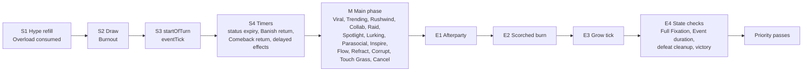
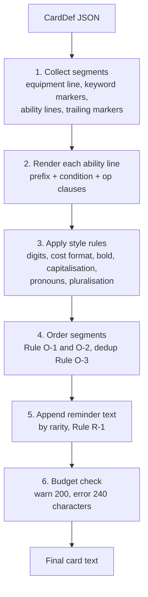

# HYPEBOUND — Keyword Glossary, Status Reference & Card-Text Templating Specification

> **Status: Derived design document — normative for implementation.**
> Rules authority is [`00-core-rules.md`](00-core-rules.md) (canonical). Type
> authority is [`../../src/engine/types.ts`](../../src/engine/types.ts)
> (canonical). Engine behaviour authority is
> [`../tech/00-architecture-contract.md`](../tech/00-architecture-contract.md).
> Where those are silent, this document makes the binding call and marks it
> **[DECISION]**. Every mechanic specified here is expressible with the existing
> effects DSL; exceptions are listed in §10.
>
> This document is the specification that the engine's automatic card-text
> templater (`src/engine/cardText.ts`) implements and that the card validator
> (`src/engine/validation.ts`) enforces. It is written to be unambiguous rather
> than elegant: where two readings are possible, the ruling is stated.

---

## 1. Scope & reading guide

| Part | Contents | Primary consumer |
|---|---|---|
| §2 | Timing framework: turn anchors, duration model, card-play micro-sequence | `triggers.ts`, `statuses.ts` |
| §3 | Keyword glossary — all 18 canonical keywords, with timing, edge cases, UI | design, `keywords.ts`, UI |
| §4 | Status glossary — all 10 canonical statuses, with timing, edge cases, UI | `statuses.ts`, `hud.ts` |
| §5 | Cross-interaction quick reference + the named hard cases | rules arbitration, tests |
| §6 | Card-text templating system — grammar, tables, style rules | `cardText.ts` |
| §7 | Worked examples: effects-DSL JSON → final card text | `cardText.ts` tests |
| §8 | Validator checklist | `validation.ts` |
| §9 | Data-conformance actions for existing content | content pass |
| §10 | Flagged canon gaps and open items | project owner |

**Vocabulary.** "Character" = a `CharacterInstance` on a board slot. "Entity" =
a character *or* a leader (both can carry statuses). "Permanent" = anything that
persists in play: character, Equipment, Location, Event, set Reaction. "Play" =
a resolved `playCard` intent. "Support" = buff, heal, shield, or equip a
friendly character (canon §3.2). "Controller" = the seat that owns the entity
now; "owner" = the seat whose deck the card came from (they differ only for
stolen copies).

---

## 2. Timing framework

### 2.1 Turn anchors (normative labels)

These labels are used by every timing entry in §3 and §4. They expand canon §2's
turn sequence and match
[`02-gameplay-loop-and-match-flow.md`](02-gameplay-loop-and-match-flow.md) §3.3.

| Anchor | Step | What resolves here |
|---|---|---|
| **S1** | Refill Hype | `hypeMax = min(turnOfSeat + permanent bonuses, 10)`; `hype = hypeMax − hypeLockedNextTurn`; **Overload** debt consumed and cleared |
| **S2** | Draw 1 | Draw; hand-limit burn (**Lost in the Feed**); **Burnout** fatigue damage |
| **S3** | `startOfTurn` triggers | `startOfTurn` effects; `eventTick` effects of the active player's Event banner |
| **S4** | Timer tick | (a) timed statuses decrement and expire; (b) **Banished** returns; (c) **Comeback** returns; (d) `scheduleDelayed` effects due this turn |
| **M** | Main phase | All player intents; all play-time keywords; all combat |
| **E1** | Afterparty | `afterparty` triggers of the active player |
| **E2** | Scorched | **Scorched** burn on the active player's entities |
| **E3** | Grow | **Grow** counters tick; `growComplete` upgrades apply |
| **E4** | State checks | (a) Full Fixation reset; (b) Event duration decrement/expiry; (c) defeat cleanup + Comeback scheduling; (d) zone-invariant verification; (e) victory evaluation |



**Anchor ordering is load-bearing and must never be reordered:** E1 before E2
lets an Afterparty heal save a Scorched ally; E2 before E3 means a Scorched
Grow character must survive the burn to tick.

### 2.2 Duration model — **[DECISION T-1]** (binding)

Canon §2 places timer ticks at the **start** of a turn (S4). `StatusInstance`
carries `remainingTurns`. Both are satisfied by counting in **seat-turns**:

> `remainingTurns` counts **seat-turn starts remaining**. Every timed status,
> on every entity, decrements by 1 at **S4 of every turn** (either seat's).
> A status is removed when it reaches 0, before any other S4 work.

`durationTurns: N` in an `applyStatus` / `cancel` op is converted at application
time so that expiry lands at **S4 of the applying player's Nth subsequent turn**:

| Application context | Stored `remainingTurns` |
|---|---|
| Applied during the applying player's **own** turn | `2N` |
| Applied during the **opponent's** turn (a Reaction, an enemy-turn trigger) | `2N − 1` |
| `durationTurns` omitted | `null` — until removed, dispelled, or the entity leaves play |

Worked checks:

| Case | Result |
|---|---|
| **Sandstorm** (Weakened 1 on enemy characters, my turn) | `remainingTurns = 2`; enemy plays their whole turn Weakened; removed at S4 of my next turn. Matches "until your next turn". |
| **Steamveil** (Warded 1 on my own character, my turn) | `remainingTurns = 2`; protection covers the enemy's entire turn; removed at S4 of my next turn. |
| Enemy Reaction applies Weakened 1 to my character during my turn | `remainingTurns = 1`; removed at S4 of the enemy's next turn, i.e. it lasts only the remainder of my turn. |

Absolute-deadline fields (`banishedUntilTurn`, `healingDisabledUntilTurn`,
`aurasDisabledUntilTurn`, `ComebackEntry.returnsOnTurn`,
`DelayedEffect.triggersOnTurn`) store `globalTurnCounter` values and are checked
at S4 (or at read time for `healingDisabledUntilTurn` and
`aurasDisabledUntilTurn`). They are **not** decremented.

**Event duration is the one exception [DECISION T-2]:** an Event's
`remainingTurns` decrements at **E4(b)** of its controller's turns and **does
not decrement on the turn it was played**. An `Event (3 turns)` therefore ticks
at S3 of three of your subsequent turns and expires at E4 of the third.

### 2.3 Card-play micro-sequence — **[DECISION P-0]** (binding)

Every `playCard` intent resolves in exactly this order. Keyword timing entries in
§3 reference these P-steps.

| Step | Action |
|---|---|
| **P1** | Legality + cost lock. Effective cost computed (§6.10.3), Hype paid, `hypeSpentThisTurn += cost`. Cost is locked here; later cost changes never refund. |
| **P2** | `priorPlays = cardsPlayedThisTurn` snapshot (for **Rushwind**), then `cardsPlayedThisTurn += 1`; card leaves hand. |
| **P3** | Placement: character to slot / Equipment attaches / Location replaces / Event banner set / Reaction set face-down / Action & Transformation to the resolving zone. |
| **P4** | **Refract** choice applied (identity first); the card registers its Current(s) in `currentsPlayedThisTurn` (Refract registers **both** Prism and the chosen Current). |
| **P5** | `onPlay` effects resolve, in `effects` array order. The trigger queue is drained after each `EffectDef` completes (canon §5.5). |
| **P6** | **Refraction** check: if `refractionCurrent` equals this card's live Current, repeat P5 once, then clear `refractionCurrent`. |
| **P7** | `rushwind` effects resolve if `priorPlays ≥ 1`. |
| **P8** | **Viral** copy created. |
| **P9** | **Overload** lock added (`overload` field and/or any `lockHype` ops already applied inline in P5). |
| **P10** | Resonance progress advances (originals only — not Viral copies, not tokens). |
| **P11** | Post-play trigger window: other cards' `onCardPlayed`, enemy Reactions, and any triggers queued but not yet drained. |

**Actions and Transformations** move to the discard pile after P11.
**Reactions** are considered *played* at P1–P3 (paying Hype on set) and their
`reaction` effect resolves later, in its own window.

---

## 3. Keyword glossary

18 canonical keywords. Each entry gives: identity, canonical text, DSL
realization, exact timing, edge-case rulings, and UI presentation.

`data/keywords.json` currently has no icon field. **[DECISION K-0]** — add
`iconShape: string` to `KeywordDef` and to every entry in `keywords.json`,
matching the shape-family discipline already used by `statuses.json`
(accessibility: shape + label, never colour alone). The shape names used below
are the normative values. This is an additive change; see §10.

---

### 3.1 **Viral**

| Field | Value |
|---|---|
| Keyword id | `viral` |
| Canonical text | *When you play this, add a copy to your hand that costs (1) less (minimum 1) and loses Viral.* |
| Card fields | `keywords: ["viral"]` |
| DSL realization | Engine-native (`keywords.ts`); no ops. The copy is a `CardInstance` with `costDelta: -1`, `removedKeywords: ["viral"]`, `viralCopy: true`. |
| Emits | `keywordTriggered {keyword:"viral"}`, `cardAddedToHand {source:"viral"}` |
| Legal on | Any card type except `leader`. |

**Timing.** Resolves at **P8** — after the card's own `onPlay` and `rushwind`
effects, before Overload. Viral is a *play* trigger, not an *effect* trigger: it
fires even if the card's effects fizzle for want of a legal target.

**Cost clamp [DECISION K-1].** The discount is clamped at generation:
`costDelta = −min(1, baseCost − 1)`. A Viral copy of a (1) card stores
`costDelta: 0` and costs (1). This keeps the global rule
`effectiveCost = max(0, base + Σ deltas)` true everywhere (§6.10.3).

| # | Situation | Ruling |
|---|---|---|
| 1 | **Viral copy of a Trending card** | The copy keeps **Trending** (only **Viral** is stripped). Its printed cost is unchanged; it carries `costDelta −1`, and Trending's discount is computed on top, floored at (1) by K-1 and TR-1. A (5) Trending Viral card played as the 3rd card of a turn, from a copy, costs `max(1, 5 − 1 − 2) = 2`. |
| 2 | Hand is at 10 when the copy would be created | The copy is destroyed on creation — **Lost in the Feed** (`cardBurned {reason:"handFull"}`). The keyword still counts as having triggered. |
| 3 | Playing a Viral copy | It has no Viral, so it makes no further copy. It **does** count for `cardsPlayedThisTurn`, **Trending**, **Rushwind** and Confluence Current registration, but **does not** advance **Perfect Resonance** (`viralCopy` is not an original). |
| 4 | The card is **Cancelled**-adjacent | Cancelled is a board status; a card in hand can never be Cancelled. `addKeyword: "viral"` applied to a card **in play** does nothing — Viral only functions during P8 of a play from hand. |
| 5 | Viral card played by an effect rather than from hand (`summon`, `resurrect`) | Summoning and resurrecting are not *playing*. No copy. |
| 6 | Viral + **Refraction** double on-play | Refraction repeats P5 (`onPlay`) only. Viral still fires exactly **once**. |

**UI.** Pip shape `share-arrow` (a forked arrow), rendered in the card's keyword
strip. On resolution, the created copy flies from the played card to the hand
fan with a duplicate-ghost VFX. Tooltip: *"**Viral** — When you play this, add a
copy to your hand that costs (1) less (minimum 1) and loses Viral."* The hand
card shows a small "copy" corner fold and its discounted cost in the cost gem
with a delta chip `−1`.

---

### 3.2 **Spotlight**

| Field | Value |
|---|---|
| Keyword id | `spotlight` |
| Canonical text | *Enemies must attack characters with Spotlight before other targets.* |
| Card fields | `keywords: ["spotlight"]`; grantable via `addKeyword` or Equipment `grantKeywords` |
| DSL realization | Engine-native attack-legality rule (`intents.ts → canAttack` / `legalTargets`) |
| Emits | `RulesError {code:"spotlightEnforced"}` on an illegal attack (the UI must prevent it) |
| Legal on | Characters only. Leaders may never have Spotlight — validator rejection. |

**Timing.** Evaluated continuously, at **attack declaration** during M. It is a
targeting restriction, not a trigger: it never enters the trigger queue.

**Rule.** If the defending side controls ≥1 **attackable** character with
Spotlight, every attack that side receives must target one of them. "Attackable"
excludes **Lurking** characters and characters that are **Banished**.

| # | Situation | Ruling |
|---|---|---|
| 1 | **Spotlight + Lurking on the same board** | Lurking characters are removed from the attackable set *first*. A Lurking Spotlight character imposes no restriction and cannot be attacked. If every Spotlight character is Lurking, the attacker may attack anything, including the leader. |
| 2 | Spotlight character is **Cancelled** | Cancelled blanks all text and keywords (§4.4): the character no longer has Spotlight and no longer taunts. |
| 3 | Spotlight character is **Warded** | Warded blocks enemy Actions and abilities, not attacks. The enemy is still forced to attack it. This combination is intentionally strong and is priced accordingly. |
| 4 | Several Spotlight characters | The attacker freely chooses among them; there is no "closest" rule. |
| 5 | Spotlight granted by Equipment, Equipment destroyed mid-turn | The keyword is lost immediately; attack legality is re-evaluated on the next declaration, never retroactively. |
| 6 | Spotlight and a direct-damage Action targeting the leader | Spotlight constrains **attacks** only. Damage from cards, Confluences, and Fixations ignores it. |

**UI.** Pip shape `cone` (a downward stage-light cone). The character renders
with a persistent volumetric spotlight cone on the 3D board and a bright rim
light. While a Spotlight is active on the enemy side, illegal attack targets
grey out and the targeting arrow snaps red with the label
*"Spotlight — you must attack a Spotlight character."*

---

### 3.3 **Parasocial**

| Field | Value |
|---|---|
| Keyword id | `parasocial` |
| Canonical text | *When you target this friendly character with a card or ability, it gains +1/+1 and you gain 1 Obsession.* |
| Card fields | `keywords: ["parasocial"]`; trigger `onTargeted` |
| DSL realization | `{"trigger":"onTargeted","ops":[{"op":"buff","target":{"select":"self"},"attack":1,"health":1},{"op":"gainObsession","amount":1}]}` — auto-supplied by the keyword when no explicit `onTargeted` effect is present |
| Emits | `keywordTriggered`, `buffApplied`, `obsessionChanged {reason:"parasocial"}` |

**Timing.** Fires during **M**, in the trigger window immediately after the
targeting effect finishes resolving (so a heal lands first, then the +1/+1). It
is the controller's own trigger and therefore resolves before any opponent
trigger in the same window.

**What counts as targeting [DECISION K-2].**

| `TargetSpec.select` | Targets? |
|---|---|
| `choose` | **Yes** |
| `random` | **Yes** — the engine resolves it to one specific entity and the UI draws the arrow |
| `triggering` | Yes, if the bound entity is this character and the binding came from a `choose`/`random` selection |
| `all`, `adjacent`, `self`, `leader` | **No** |

Equipment attaching to the character counts as targeting it. Confluence and
Fixation targets count. Attacking is **not** targeting.

| # | Situation | Ruling |
|---|---|---|
| 1 | The **enemy** targets it (removal, a debuff) | No trigger. The keyword says *"when **you** target this **friendly** character"* — it is controller-relative. |
| 2 | Board-wide buff ("give your characters +1/+1") | `select: "all"` does not target. No trigger, no Obsession. |
| 3 | One card targets 2 Parasocial characters (`count: 2`) | Both trigger: +1/+1 each and **+2 Obsession total**. The once-per-turn *support* Obsession (canon §3.2) is separate and still only +1. |
| 4 | Obsession already at 10 | The +1 is clamped and produces no `obsessionChanged` event. The +1/+1 still applies. **Full Fixation** does not re-trigger. |
| 5 | Parasocial granted by **Oshi Mark**, Equipment destroyed | Keyword lost with the Equipment; already-gained +1/+1 buffs are permanent and remain. |
| 6 | Parasocial character is **Cancelled** | Suppressed — no buff, no Obsession. The targeting effect itself still resolves. |
| 7 | Self-targeting: the character's own ability targets itself with `choose` | It is a chosen target, so Parasocial fires. Guarded by the self-retrigger rule (§3.16, I-1): the resulting buff cannot re-enter the same Parasocial. |

**UI.** Pip shape `heart-link` (a heart bisected by a chain link). Every trigger
plays a short pink pulse from the targeting arrow into the character, and the
Obsession meter animates +1 with a distinct rising chime. Tooltip includes the
live line *"Obsession: 4 / 10 — at 8 you become **Obsessed**."*

---

### 3.4 **Trending**

| Field | Value |
|---|---|
| Keyword id | `trending` |
| Canonical text | *While in your hand, this costs (1) less for each other card you've played this turn (minimum 1). Resets each turn.* |
| Card fields | `keywords: ["trending"]` |
| DSL realization | Engine-native dynamic cost (`keywords.ts → effectiveCost`); never stored in `costDelta` |
| Emits | `costModified` is **not** emitted for Trending (it is recomputed, not applied); the hand UI re-renders on `cardPlayed` |

**Timing.** Recomputed continuously while the card is in hand, and locked at
**P1** when played. `cardsPlayedThisTurn` resets at the start of each of your
turns, so the discount resets with it.

**Clamp [DECISION TR-1].** `trendingDiscount = min(cardsPlayedThisTurn, base − 1)`.
Trending can never take a card below (1); it stacks additively with other
reductions, which are then floored at (0) per §6.10.3.

| # | Situation | Ruling |
|---|---|---|
| 1 | Setting a face-down **Reaction** | Counts as playing a card (Hype is paid on set). Advances Trending. |
| 2 | Activating a **Confluence**, a **Fixation**, or a Location ability | Activations are not card plays. No Trending advance. |
| 3 | **Borrowed Clout** and other tokens played from hand | Count. Tokens are genuinely played (gameplay-loop §3.2), so the second player can start a Trending chain on turn 1. |
| 4 | Trending card in the **deck** or **discard** | No effect; Trending is a hand-only modifier. Cards drawn mid-turn immediately benefit from the current count. |
| 5 | Opponent steals it (`stealCopy`) | The copy works normally for them, using **their** `cardsPlayedThisTurn`. |
| 6 | Cost drops after P1 | Irrelevant — cost is locked at P1; there are no refunds. |
| 7 | Trending + a (1)-cost card | Always costs (1). Displayed with no discount chip. |

**UI.** Pip shape `flame-arrow` (an upward chevron with a trailing spark). In
hand, a Trending card shows a live "▼ N" discount chip beside the cost gem that
animates each time you play another card, and its frame carries a scrolling
trend-line motif. Tooltip shows the arithmetic explicitly:
*"Base (5) − 2 cards played = (3). Minimum (1)."*

---

### 3.5 **Collab (X)**

| Field | Value |
|---|---|
| Keyword id | `collab` |
| Canonical text | *Bonus effect if you control another character that shares the stated Current, faction, or tag X.* |
| Card fields | `keywords: ["collab"]` **and** `collab: { kind: "current"\|"faction"\|"tag", value: string }` (required together — validator rejection otherwise) |
| DSL realization | An `EffectDef.condition` of the canonical shape `{"kind":"controlsAtLeast","target":{"select":"all","side":"friendly","zone":"board","filter":{<kind>:[value],"excludeSelf":true}},"min":1}` |
| Emits | `keywordTriggered {keyword:"collab"}` when the condition passes |

**Timing.** Evaluated at the moment the gated effect resolves — normally **P5**
(on play). It is a one-shot check, never a continuous one.

| # | Situation | Ruling |
|---|---|---|
| 1 | You play the Collab card first, then a matching ally later in the turn | The bonus does **not** apply retroactively. Order your plays. |
| 2 | `kind: "current"` and the ally has **Refract**ed | The **live** Current is checked (`CharacterInstance.current`), not the printed one. A Refracted Prism ally satisfies Collab (Tide) if it chose Tide. |
| 3 | The only matching ally is **Cancelled** | It still counts. Cancelled blanks text and keywords; it does not erase identity (Current, faction, tags, type). |
| 4 | The only matching ally is **Lurking** | Counts. Lurking is enemy-facing only. |
| 5 | The matching entity is your **leader** or a **Banished** character | Neither counts. Collab reads friendly characters on board slots only. |
| 6 | The matching ally is a token | Counts. Tokens are characters. |
| 7 | Collab on an Action with a `chooseOne` | Legal: the condition gates one branch. The templater renders the Collab prefix on that branch only. |

**UI.** Pip shape `two-rings` (interlocking circles). When a Collab card is
hovered in hand, every board character that would satisfy it gains a matching
ring highlight — the "collab partners" preview. On a successful trigger, a short
beam links the two characters. Tooltip is parameterized:
*"**Collab (Idol)** — bonus effect if you control another Idol."*

---

### 3.6 **Cancelled** *(keyword form: "cancel a character")*

| Field | Value |
|---|---|
| Keyword id | — (status-backed; the verb form uses the `cancel` op) |
| Canonical text | *(Status — see §4.4.) "Cancel a character" applies Cancelled.* |
| DSL realization | `{"op":"cancel","target":…,"durationTurns"?:N}` |
| Emits | `statusApplied {status:"cancelled"}` |

The full ruleset lives in **§4.4 (Status — Cancelled)**; the keyword entry exists
so that the templater and the validator treat "**Cancel**" as a bold game term.
Summary of the four rulings most often needed at the table:

| # | Situation | Ruling |
|---|---|---|
| 1 | **Cancelled vs the character's own aura** | The aura stops applying the instant Cancelled lands (auras are recomputed at read time). |
| 2 | **Cancelled vs auras from elsewhere** | Auras *targeting* a Cancelled character still apply to it. Cancelled suppresses what a card **does**, never what is **done to** it. |
| 3 | Cancelled vs already-applied buffs and Grow upgrades | Kept. Stat changes are not text. |
| 4 | Cancelled vs `onDefeat` / **Comeback** | Suppressed. A Cancelled character that dies triggers nothing and does not come back. |

---

### 3.7 **Comeback**

| Field | Value |
|---|---|
| Keyword id | `comeback` |
| Canonical text | *When this character is defeated, return it to your hand at the start of your next turn.* |
| Card fields | `keywords: ["comeback"]` **and** `comeback: { mode: "hand"\|"play", delayTurns: number }` (required together) |
| DSL realization | Engine-native `onDefeat` handling writing a `ComebackEntry`; extra riders use an explicit `onDefeat` `EffectDef` |
| Emits | `comebackScheduled`, then `comebackReturned` + `cardAddedToHand {source:"comeback"}` or `characterSummoned` |

**Timing.** Scheduling happens at the defeat itself (mid-combat, mid-effect, or
during **E4(c)** cleanup). The return happens at **S4(c)** of the owner's
`delayTurns`-th subsequent turn. `returnsOnTurn` is stored as an absolute
`globalTurnCounter` value.

| # | Situation | Ruling |
|---|---|---|
| 1 | **Comeback of a transformed character** | Comeback belongs to the **current form**. If the transformed form has the keyword, that form's card returns; if it does not, there is no Comeback — even if the original card had one. `transform` replaces card identity. |
| 2 | The character was **Cancelled** when it died | No Comeback (text suppressed). Cancelling a Comeback threat before killing it is the intended answer. |
| 3 | `mode: "play"` and the board is full at return time | It returns **to hand** instead. If the hand is also full, it is **Lost in the Feed**. No slot is ever stolen. |
| 4 | `mode: "hand"` and the hand is full at return time | Lost in the Feed (`cardBurned {reason:"handFull"}`). |
| 5 | Defeated by `destroy` rather than damage | Still a defeat. Comeback triggers. |
| 6 | Removed by `banish`, `returnToHand`, or `transform` | None of these are defeats. No Comeback. |
| 7 | The returned card's identity | A **fresh `CardInstance`**: base cost, no `costDelta`, no added/removed keywords, `viralCopy: false`. Board buffs and statuses are gone. |
| 8 | Two Comeback characters die in the same resolution | Both are scheduled and return in defeat order (deterministic; the engine appends to `comebacks` in resolution order). |
| 9 | Comeback + **Touch Grass** on the same character | Mutually exclusive: a Banished character was not defeated, so nothing is scheduled. |

**UI.** Pip shape `loop-arrow` (a circular return arrow). A scheduled Comeback
appears as a ghosted card silhouette docked beside the owner's deck counter with
a turn countdown; both players see it (it is public information). Tooltip:
*"**Comeback** — returns to your hand at the start of your next turn."*

---

### 3.8 **Afterparty**

| Field | Value |
|---|---|
| Keyword id | `afterparty` |
| Canonical text | *Triggers at the end of your turn while this is in play.* |
| Card fields | `keywords: ["afterparty"]` (display) + `{"trigger":"afterparty", …}` |
| DSL realization | Trigger `afterparty` |
| Emits | `keywordTriggered`, plus whatever the ops emit |

**Timing.** **E1**, and only on the controller's own turn end. The E1 queue is
built once at the start of E1 in canonical trigger order (canon §5.5: leader →
characters left→right → Location → Reactions → Event → hand), then drained.

| # | Situation | Ruling |
|---|---|---|
| 1 | The character entered play this turn | It still triggers. Summoning sickness restricts **attacking**, never triggers. |
| 2 | An earlier Afterparty in the same E1 kills a later Afterparty source | The dead source's entry is skipped — presence is re-checked at resolution time, not at queue-build time. Deterministic and order-dependent by board slot. |
| 3 | An Afterparty **adds** a new Afterparty source during E1 | It does **not** fire this turn; the queue is not rebuilt. Only cascading triggers (canon §5.5) are appended, capped at 20. |
| 4 | Enemy Afterparty during your turn | Never. Afterparty is controller-turn-bound. Enemy engines fire on their own E1. |
| 5 | Afterparty on a Location, Equipment, or Event | Legal. Ordered by its zone position in the canonical trigger order. |
| 6 | Afterparty vs **Scorched** on the same character | E1 before E2: an Afterparty heal can save a Scorched ally from lethal burn. |
| 7 | Afterparty on a **Cancelled** character | Suppressed. |

**UI.** Pip shape `moon-cup` (a crescent over a tilted cup). At E1 the board dims
slightly and each Afterparty source pops a numbered order badge (1, 2, 3 …)
matching the trigger-order display in the HUD, so the sequence is legible before
the effects land.

---

### 3.9 **Raid**

| Field | Value |
|---|---|
| Keyword id | `raid` |
| Canonical text | *Can attack the turn it is played.* |
| Card fields | `keywords: ["raid"]`; grantable via `addKeyword` / Equipment |
| DSL realization | Engine-native summoning-sickness exemption in `canAttack` |
| Emits | — (visible through legal-target highlighting) |

**Timing.** Checked at **attack declaration** (M), against the character's live
keyword list — never snapshotted at summon.

| # | Situation | Ruling |
|---|---|---|
| 1 | Raid granted after the character was played, same turn | It can attack immediately. The check is live. |
| 2 | Raid removed after the character attacked | The attack already happened; nothing is undone. |
| 3 | Returning from **Banished** (Touch Grass) | Re-entering play is a new arrival: summoning sick **unless it printed Raid** (base keywords return; granted ones do not). |
| 4 | `resurrect` from the discard pile | Same as above: fresh arrival, printed keywords only. |
| 5 | Raid + **Cancelled** | Suppressed, and Cancelled independently forbids attacking. |
| 6 | Raid and extra attacks | Raid grants *permission to attack on arrival*, never an extra attack. `maxAttacksPerTurn` is untouched. |
| 7 | Raid on a non-character card | Validator rejection. |

**UI.** Pip shape `bolt-boot` (a boot with a speed bolt). On summon, a Raid
character lands with a dust-ring and its slot base glows "ready" green
immediately, instead of the desaturated summoning-sick treatment.

---

### 3.10 **Touch Grass**

| Field | Value |
|---|---|
| Keyword id | `touch-grass` |
| Canonical text | *Banish a character until the start of your next turn; it returns with base stats and no statuses or attachments.* |
| Card fields | `keywords: ["touch-grass"]` |
| DSL realization | `{"op":"banish","target":…,"returnAtStartOfYourNextTurn":true}` |
| Emits | `characterBanished`, later `characterReturnedFromBanish` |

**Timing.** Banish is immediate (M). The return is at **S4(b)** of the banishing
player's next turn — note: the **banisher's** turn, not the owner's, exactly as
the canonical text reads.

**On banish:** the character's slot is freed at once; all statuses, buffs, Grow
progress, Finale counters, added keywords, and Current changes are discarded; its
Equipment is **destroyed**. On return it is rebuilt from its card definition:
base stats, printed keywords, `enteredOnTurn` = the return turn, summoning sick
unless it prints **Raid**.

| # | Situation | Ruling |
|---|---|---|
| 1 | **Touch Grass on an equipped character** | The Equipment is destroyed (`equipmentDestroyed`) — attachments never return with the character. Destruction-replacement effects such as Cosplay Champions' **Rewear** *do* apply, returning that Equipment to its owner's hand instead. |
| 2 | Board is full when it returns | The return is deferred one full round and retried at S4 of each subsequent banisher turn. The banished card stays visible in the `banished` tray with a "returns when a slot opens" label. It is never destroyed for lack of space. |
| 3 | Touch Grass on **your own** character | Fully legal (`side: "any"` selectors) — the standard way to dodge removal, reset a Cancelled unit, or clear enemy debuffs, at the cost of a turn of board presence. |
| 4 | The target had **Grow** progress or Finale counters | Both reset to zero. This is the shared Finale answer referenced by every faction document. |
| 5 | The target was **transformed** | It returns as the **transformed** card at that form's base stats. Banish does not undo transformation. |
| 6 | The target is a **token** | Returns normally. Tokens are characters. |
| 7 | Banished characters and the board | They are off-board: they do not count for Collab, `controlsAtLeast`, auras, Spotlight, AoE, or victory checks. |
| 8 | `returnAtStartOfYourNextTurn: false` | Permanent removal: the character leaves the match entirely (not to the discard pile) and can never be resurrected. Reserve for Epic+ costing. |
| 9 | The banisher loses before the return | Moot; the match has ended. |

**UI.** Pip shape `leaf-exit` (shared with the **Banished** status — see §4.10).
The banish VFX is a park-bench sun-flare wipe; the character appears in a
translucent "outside" tray beside the board with a return countdown. Both
players see the tray (public information).

---

### 3.11 **Scorched** *(Cinder signature)*

| Field | Value |
|---|---|
| Keyword id | `scorched` (status-backed) |
| Canonical text | *(Status — see §4.1.)* |
| DSL realization | `{"op":"applyStatus","target":…,"status":"scorched"}` |

Full rules in **§4.1**. The keyword entry exists so the templater treats
"**Scorch**" as a bold verb form. The three rulings that matter most:

| # | Situation | Ruling |
|---|---|---|
| 1 | Scorched applied to an **enemy** character on your turn | It burns at **E2 of the enemy's turn** — a full turn later. Scorched always resolves on its *controller's* turn end. |
| 2 | Scorched applied to **your own** character before E2 | It burns at E2 of the **same** turn. |
| 3 | Scorched + **Shielded** | The burn is a damage instance: Shielded absorbs it and is consumed. Scorched is still removed afterwards. Efficient shield-stripping. |

---

### 3.12 **Flow** *(Tide signature)*

| Field | Value |
|---|---|
| Keyword id | `flow` |
| Canonical text | *Triggers when a friendly card is returned to your hand, replayed, healed, or exchanged.* |
| Card fields | `keywords: ["flow"]` + `{"trigger":"flow", …}` |
| DSL realization | Trigger `flow` |
| Emits | `keywordTriggered {keyword:"flow"}` |

**Timing.** Fires during **M** (or during S/E steps if the causing event happens
there), in the trigger window immediately after the causing event resolves.

**The four channels [DECISION F-1] — closed, enumerable list.** Flow fires when
any of the following happens to a card or entity **you control**:

| Channel | Concretely |
|---|---|
| **Returned** | `characterReturnedToHand`, or `cardAddedToHand` with `source: "comeback"` |
| **Replayed** | You play a card that previously left play to your hand this match (provenance flag on the `CardInstance`; see §10 gap G-5). Fires once per instance. |
| **Healed** | `healed` with `amount ≥ 1` on a friendly character **or your leader** |
| **Exchanged** | `characterTransformed`, `swapAttackHealth`, `refracted`, or an `equipped` event that replaced an existing Equipment |

**Trigger economy [DECISION F-2].** A Flow source fires **at most once per
resolved op**, not once per affected entity. An AoE heal that heals three allies
fires each Flow character exactly once. This keeps the 20-trigger cascade cap
(canon §5.5) far away from normal play.

| # | Situation | Ruling |
|---|---|---|
| 1 | A heal on a full-health target | `amount` is 0 → no `healed` event → **no Flow**. Overhealing never triggers. |
| 2 | The target was hit by **Blackflame** (`cantBeHealedUntilNextTurn`) | The heal is blocked (`healed {blocked:true}`) → no Flow, no **Inspire**. |
| 3 | The **enemy** bounces your character to your hand | Flow triggers. The channel is controller-relative to the **card that moved**, not to the effect's source. Bouncing a Tide board is a real cost. |
| 4 | You return an **enemy** card to their hand | Not friendly. No Flow. |
| 5 | Two Flow characters on board | Both fire, in board order left→right. |
| 6 | Equipment played onto a character with no Equipment | Not an exchange (nothing was replaced) → no Flow. Replacing an existing Equipment **is** an exchange. |
| 7 | Flow on a **Cancelled** character | Suppressed. |

**UI.** Pip shape `wave-loop` (a wave curling into a circle). Flow triggers play
a lateral water-sheen sweep across the card and are listed in the HUD trigger
queue as "Flow — <source>".

---

### 3.13 **Grow X** *(Root signature)*

| Field | Value |
|---|---|
| Keyword id | `grow` |
| Canonical text | *After surviving X of your turn-ends in play (or meeting a stated defensive condition), gains the stated permanent upgrade.* |
| Card fields | `keywords: ["grow"]` **and** `grow: { turns: number, ops: EffectOp[] }` (required together) |
| DSL realization | `grow.ops` applied by the engine; optional extra riders via `{"trigger":"growComplete", …}` |
| Emits | `growProgressed`, `growCompleted` |
| State | `CharacterInstance.growProgress`, `.growComplete` |

**Timing.** **E3**, on the controller's turn end only, and only for characters
that are on a board slot at that moment. `growProgress += 1`; when it reaches
`grow.turns`, `growComplete` is set, `grow.ops` resolve immediately in the same
E3 step, and any `growComplete` effects resolve after them (board order for
multiple characters).

| # | Situation | Ruling |
|---|---|---|
| 1 | The character is **Scorched** and dies at E2 | No tick. E2 precedes E3 — that ordering is the entire counterplay to Grow. |
| 2 | The character is **Cancelled** at E3 | No tick. Progress is **retained**, not reset, and resumes when Cancelled expires. |
| 3 | The character is **Banished** at E3 | Off-board: no tick. On return, `growProgress` resets to 0 and `growComplete` to false — the completed upgrade is lost with the base-stat reset. |
| 4 | The upgrade's nature | `grow.ops` are applied with `permanent: true` semantics: they raise base stats, survive `removeStatus`, and are **not** dispellable. Only a base-stat reset (Banish) or `setStats` removes them. |
| 5 | Grow completes and kills something / wins the game | Legal. Victory is evaluated continuously and again at E4(e). |
| 6 | The character is transformed before completing | The new form's `grow` (if any) applies with a fresh counter. Progress does not carry across forms. |
| 7 | Canon's "or meeting a stated defensive condition" variant | Not expressible via `grow: {turns, ops}`. Such cards must use an explicit `growComplete` effect plus an explicit `text` field. See gap G-4. |

**UI.** Pip shape `sprout` (a two-leaf shoot). The character's frame carries a
segmented growth ring: one segment fills per tick, with the count rendered as
"2 / 3" for screen readers and colourblind users. Completion plays a stone-bloom
VFX and permanently upgrades the frame's stat chips.

---

### 3.14 **Rushwind** *(Gale signature)*

| Field | Value |
|---|---|
| Keyword id | `rushwind` |
| Canonical text | *Bonus effect if this is not the first card you played this turn.* |
| Card fields | `keywords: ["rushwind"]` + `{"trigger":"rushwind", …}` |
| DSL realization | Trigger `rushwind` |
| Emits | `keywordTriggered {keyword:"rushwind"}` when the bonus applies |

**Timing.** **P7** — after `onPlay` (and after any Refraction repeat), using the
`priorPlays` snapshot taken at **P2**. The condition is `priorPlays ≥ 1`.

| # | Situation | Ruling |
|---|---|---|
| 1 | **Borrowed Clout** played first | Counts. Tokens are played cards, so the second player can enable Rushwind on turn 1. |
| 2 | Setting a **Reaction** first | Counts (Hype paid on set). |
| 3 | A Confluence, Fixation, or Location activation first | Do not count. Activations are not plays. |
| 4 | A character summoned by an effect first | Does not count. Summoning is not playing. |
| 5 | Rushwind on a **Reaction** card | **Validator rejection.** A Reaction resolves during the enemy's turn, where your `cardsPlayedThisTurn` is 0, so the bonus could never fire. Design must not ship dead text. |
| 6 | Rushwind and `onPlay` both present | `onPlay` resolves first (P5), Rushwind second (P7). Templating order matches (§6.2). |
| 7 | The card is the 2nd card but the 1st was countered/fizzled | Still counts — `cardsPlayedThisTurn` increments at P2, regardless of whether the effects resolved. |

**UI.** Pip shape `double-chevron` (two stacked speed chevrons). While a Rushwind
card is in hand, the chip is dim on your first play of the turn and lights up
(with a wind-streak sweep) the moment `cardsPlayedThisTurn ≥ 1`, so the enabling
condition is visible *before* committing Hype.

---

### 3.15 **Overload (X)** *(Pulse signature)*

| Field | Value |
|---|---|
| Keyword id | `overload` |
| Canonical text | *Powerful immediate effect; you have (X) less Hype next turn.* |
| Card fields | `keywords: ["overload"]` **and** `overload: number` (required together); inline form `{"op":"lockHype","amount":N}` |
| DSL realization | `PlayerState.hypeLockedNextTurn += X` |
| Emits | `hypeLocked`, then `turnStarted {lockedHype}` |

**Timing.** The lock is added at **P9** (declarative `overload` field) or at the
op's position inside P5 (inline `lockHype`). It is consumed at **S1** of your
next turn: `hype = max(0, hypeMax − hypeLockedNextTurn)`, then
`hypeLockedNextTurn = 0`.

| # | Situation | Ruling |
|---|---|---|
| 1 | Several Overloads in one turn | Additive. Overload (2) + Overload (1) = 3 locked crystals next turn. |
| 2 | Overload exceeds next turn's max Hype | Hype floors at 0. The **excess is discarded** — Overload never carries debt into a second turn. |
| 3 | The card's effect fizzles (no legal target, or the target died first) | The Overload still applies. It is part of the card's cost payload, paid on resolution. If the card cannot legally be *played at all*, nothing is paid. |
| 4 | Temporary Hype (**Borrowed Clout**, `gainHype` non-permanent) | Applied during M, after S1, and is therefore unaffected by locks. Temporary Hype cannot pre-pay a lock. |
| 5 | Permanent max-Hype bonuses | Applied at S1 before the cap: `hypeMax = min(turnNumber + permanent, 10)`, then locks subtract. |
| 6 | Overload on a Reaction that fires on the enemy turn | The lock applies at resolution and is consumed at your next S1 — legal and intentionally punishing; price accordingly. |

**UI.** Pip shape `cracked-crystal`. Locked Hype crystals in the bottom-right
cluster render cracked and jammed with a numeric badge and a crackle SFX at S1;
during your turn the count is also mirrored on the End Turn button's tooltip:
*"Next turn you will have 3 of 6 Hype (**Overload (3)**)."*

---

### 3.16 **Inspire** *(Halo signature)*

| Field | Value |
|---|---|
| Keyword id | `inspire` |
| Canonical text | *Triggers when this or another friendly character is healed, shielded, or buffed.* |
| Card fields | `keywords: ["inspire"]` + `{"trigger":"inspire", …}` |
| DSL realization | Trigger `inspire` |
| Emits | `keywordTriggered {keyword:"inspire"}` |

**Timing.** **M** (or any anchor where the causing event occurs), in the trigger
window immediately after the causing event.

**The closed trigger list [DECISION I-2].** Inspire fires on, and only on, these
events affecting a friendly **character**:

| Fires | Does not fire |
|---|---|
| `heal` with `amount ≥ 1` | Heal blocked or overhealed to 0 |
| `applyStatus: shielded` on a target that was **not** already Shielded | Re-applying Shielded to an already-Shielded target |
| `applyStatus: armor` (any amount ≥ 1) | `applyStatus` of a negative status |
| `applyStatus: empowered` | Aura stat modifiers (continuous, not events) |
| `buff` with net positive Attack **or** Health | `buff` with net ≤ 0 (a debuff) |
| — | Equipment attaching (its stats are an attachment, not a buff) |
| — | Healing or shielding **your leader** (a leader is not a character) |

**Self-retrigger guard [DECISION I-1].** An Inspire effect that buffs, heals, or
shields **its own source** does not re-enter that same source's Inspire. Other
Inspire characters do see it. Combined with the canonical 20-trigger cascade cap,
this makes Halo boards value-rich but bounded.

| # | Situation | Ruling |
|---|---|---|
| 1 | Two Inspire characters, one buff on a third ally | Both fire, board order left→right. |
| 2 | The **enemy** heals your character | Fires. The channel reads "a friendly character is healed", from your perspective. |
| 3 | Equipping a character (canon calls equipping *support*) | **No Inspire** (attachment, not a buff) — but it **does** give the once-per-turn support Obsession. This split is deliberate and must be surfaced in tooltips. |
| 4 | A board-wide +1/+1 | One Inspire trigger per Inspire character (F-2's once-per-op economy applies here too). |
| 5 | Inspire on a **Cancelled** character | Suppressed. |
| 6 | Inspire triggered during E1/E2/E3 by an Afterparty heal | Legal; resolves inside that step's trigger window before the next step begins. |

**UI.** Pip shape `halo-ring`. Triggers play a rising gold ring from the
character's base; the HUD trigger queue names the causing event
("Inspire — healed by Power Ballad").

---

### 3.17 **Corrupt** *(Veil signature)*

| Field | Value |
|---|---|
| Keyword id | `corrupt` |
| Canonical text | *Replaces a card's or effect's normal benefit with the stated darker version.* |
| Card fields | `keywords: ["corrupt"]` |
| DSL realization | A design pattern, not a runtime trigger: `chooseOne` (the corrupt branch), `if`/`else`, or a `transform` targeting an enemy |
| Emits | `keywordTriggered {keyword:"corrupt"}` when a corrupt branch resolves |

**Timing.** Whenever the replaced effect would resolve. Corrupt never has its own
window.

**Enemy-targeting licence [DECISION C-1].** Canon §4 permits a Transformation to
target enemy characters "with Corrupt". Formally: a `transformation` card may
carry a target with `side: "enemy"` **only if** its `keywords` include `corrupt`.
The validator enforces this.

| # | Situation | Ruling |
|---|---|---|
| 1 | Is the corrupt version optional? | No, unless the text says "you may" or it is presented as a `chooseOne` branch. A `chooseOne` with a corrupt branch is a player choice; an `if`-gated corrupt replacement is mandatory. |
| 2 | Corrupt + **Cancelled** | A Cancelled character's corrupt-granted *ability* is suppressed. A corrupt **transformation already applied** persists — it changed card identity, which Cancelled cannot undo. |
| 3 | Corrupt vs **Sanctuary** / `removeStatus {polarity:"negative"}` | Corrupt transformations and replaced effects are not statuses and cannot be cleansed. Only Corrupt effects that *apply* **Cursed** or **Weakened** are cleansable, and only the status is removed. |
| 4 | A Corrupt effect turns a heal into damage | There is no heal, so no **Flow** and no **Inspire**. Channels key on what actually happened. |
| 5 | Corrupt on a card that also has **Refract** | Independent. Corrupt changes the benefit; Refract changes the Current. Both resolve at their own P-steps (P4 for Refract, wherever the branch sits for Corrupt). |

**UI.** Pip shape `split-mask` (a face split into clean and fractured halves).
Corrupt branches render in the card inspector with a darker inset panel and a
Veil-purple edge; on resolution the VFX is a mirror-shard shatter. The inspector
always shows **both** the normal and the corrupt version so the trade is legible.

---

### 3.18 **Refract** *(Prism signature)*

| Field | Value |
|---|---|
| Keyword id | `refract` |
| Canonical text | *When played, choose a Current available to your deck; this card becomes that Current while in play.* |
| Card fields | `keywords: ["refract"]`; op form `{"op":"refract","intoCurrent"?:CurrentId}` |
| DSL realization | Sets `CharacterInstance.current`; the choice arrives in `PlayerIntent.playCard.refractChoice` |
| Emits | `refracted {instanceId, intoCurrent}` |

**Timing.** **P4** — before `onPlay`, so the chosen Current is already live for
Confluence registration, elemental bonuses, and any `currentPlayedThisTurn`
condition in the card's own effects.

**Choice pool [DECISION R-2].** "A Current available to your deck" resolves as:

| Leader's Primary Current | Legal Refract choices |
|---|---|
| **Prism** (Cosplay Champions, Meme Collective) | **All 8 Currents** — this is the promised Prism-primary flexibility (canon §8.6) |
| Any natural Current | The leader's **Primary**, **Secondary** (if any), and **Prism** |

Choosing Prism is always legal and means "no advantage, no weakness".

**Dual registration [DECISION R-3, consistent with the Cosplay Champions
guide].** Playing a card with Refract registers **both** Prism **and** the chosen
Current in `currentsPlayedThisTurn` for that turn's Confluence eligibility. While
in play the card is only the chosen Current.

| # | Situation | Ruling |
|---|---|---|
| 1 | **Refract then Eclipse** | Eclipse disables Location, Event, and **aura** effects. A Refracted Current is a **state change** written into `CharacterInstance.current`, not an aura — Eclipse never reverts it. The character keeps its chosen Current, keeps the corresponding elemental advantages and weaknesses, and reverts to nothing when Eclipse ends. |
| 2 | Refracting an already-Refracted character (e.g. Prism Regalia) | Legal; the newest choice wins, emits a fresh `refracted` event, and counts as an **exchange** for **Flow**. |
| 3 | Refract on an Action, Reaction, or Transformation | "While in play" is momentary: the chosen Current applies for the card's own resolution (its damage gets the elemental bonus) and for Confluence registration. |
| 4 | Refract and **Perfect Resonance** | No interaction. Pure decks are single-natural-Current with no Prism splash (canon §8.6), so a Refract card cannot appear in one. |
| 5 | Refract and the advantage cycle | Recomputed immediately, in both directions: the character now deals **and takes** the +1 of its new Current. Refracting into the enemy's strength is a legal mistake the preview must expose. |
| 6 | Refract choice with no `refractChoice` in the intent | `RulesError {code:"missingChoice"}`. The UI must always present the picker. |
| 7 | `{"op":"refract","intoCurrent":"tide"}` (fixed) | No player choice; the card states the Current in its text and the picker is skipped. |

**UI.** Pip shape `prism-facet` (a triangular facet with a split beam). Playing a
Refract card opens a radial Current picker (8 or 3 wedges, each with symbol +
written name + a live "+1 vs …" advantage hint). The character's frame then
morphs to the chosen Current's frame shape language with a spectrum sweep, and
its Current badge shows a small "refracted" corner mark so players can tell a
Refracted Tide card from a printed Tide card.

---

## 4. Status glossary

10 canonical statuses (canon §5.4, `data/statuses.json`). `iconShape` values are
quoted verbatim from the data file — they are the accessibility contract: **shape
first, colour second, written label always available**.

**Shared status rules.**

| Rule | Statement |
|---|---|
| **ST-1 Zone change clears** | Any entity leaving the board (defeated, returned to hand, banished, transformed) loses all statuses. Returning entities are fresh instances. This is why canon says Cancelled is "removed by Comeback-type effects". |
| **ST-2 Stacking** | `armor`, `weakened`, `empowered` stack additively as separate `StatusInstance`s, each with its own timer. `scorched`, `shielded`, `cancelled`, `lurking`, `warded`, `banished` are binary — re-application refreshes the timer (taking the **longer** remaining duration) but never stacks. `cursed` stacks as distinct marks. |
| **ST-3 Timers** | Per §2.2 (T-1). `durationTurns` omitted ⇒ `remainingTurns: null` ⇒ until removed. |
| **ST-4 Dispel** | `removeStatus {polarity:"negative"}` can remove `scorched`, `cancelled`, `weakened`, `cursed`. `removeStatus {polarity:"positive"}` can remove `shielded`, `armor`, `lurking`, `warded`, `empowered`. `banished` is never removable by dispel (the entity is not on the board). Permanent `buff` ops are **not** statuses and are immune to dispel. |
| **ST-5 Damage pipeline** | For every damage instance, in order: base amount → **+1 elemental advantage** (canon §8.4) → **+1 Obsessed penalty** if the target's controller is at 8+ Obsession and the source is enemy → **Shielded** check (negates the whole instance unless `ignoresShield`) → **Armor** absorption → health reduction. `onDamaged` fires only if health actually decreased. |
| **ST-6 Leaders** | Leaders may carry statuses in `PlayerState.statuses`; `armor` is tracked separately in `PlayerState.armor`. `spotlight`, `lurking`, and `banished` are never legal on a leader (validator). |

---

### 4.1 **Scorched**

| Field | Value |
|---|---|
| Id / polarity / icon | `scorched` · negative · `flame` |
| Canonical text | *Takes 1 damage at the end of its controller's turn, then Scorched is removed unless renewed.* |
| Amount | None (always 1; not stackable) |
| Applied by | `{"op":"applyStatus","status":"scorched"}` |

**Timing.** Resolves at **E2** of its **controller's** turn, after all Afterparty
triggers. Each Scorched entity takes 1 damage (through the full ST-5 pipeline),
then the status is removed. "Renewed" means an effect applies Scorched again
*after* the E2 step.

| # | Situation | Ruling |
|---|---|---|
| 1 | Applied to an enemy on your turn | Burns at E2 of **their** turn — one full turn of warning. |
| 2 | Applied to your own character during your own turn, pre-E2 | Burns at E2 of **this** turn. |
| 3 | Applied twice from two sources | No stack: 1 damage total. The second application only refreshes presence. |
| 4 | **Shielded** target | Shielded absorbs the burn and is consumed; Scorched is still removed. |
| 5 | Scorched on a **Grow** character | E2 before E3: if the burn is lethal, the Grow tick never happens. |
| 6 | Scorched on a **leader** | Legal if a card says so; the burn goes through Armor first. |
| 7 | Scorched entity is **Banished** before E2 | Off-board, no burn; returns clean (ST-1). |
| 8 | Scorched kills the character | Normal defeat: `onDefeat`, **Comeback**, and death payoffs all trigger, inside E2's window and before E3. |

**UI.** Badge: a small flame silhouette with animated ember tips on the status
rail. Tooltip: *"**Scorched** — Takes 1 damage at the end of its controller's
turn, then Scorched is removed unless renewed. Burns at the end of **your**
turn."* (second sentence computed per side). At E2 the character flashes and the
predicted-damage overlay shows "−1 (Scorched)" during the enemy's planning phase
as well, so both players can plan around it.

---

### 4.2 **Shielded**

| Field | Value |
|---|---|
| Id / polarity / icon | `shielded` · positive · `bubble` |
| Canonical text | *Negates the next instance of damage.* |
| Amount | None (binary) |
| Duration | Until consumed |

**Timing.** Consumed at the moment a damage instance would be applied, at ST-5
step 4 — after elemental and Obsessed modifiers, before Armor.

| # | Situation | Ruling |
|---|---|---|
| 1 | **Shielded vs Starflare** (`ignoresShield: true`) | The damage bypasses the shield entirely and **the shield is not consumed** — it remains for the next instance. "Ignores" means bypass, never destroy. Armor still absorbs (canon §8.5). |
| 2 | Simultaneous combat, both sides Shielded | Both shields are consumed, both take 0, both survive. |
| 3 | 0-damage or negative-damage instances | No damage instance exists; the shield is not consumed. |
| 4 | **Scorched** burn on a Shielded character | Consumed by the 1 burn damage — the cheapest shield-strip in the game. |
| 5 | `destroy` op | Not damage. Shielded does not save the character. |
| 6 | Re-applying Shielded to a Shielded target | No-op, no new `statusApplied` event, and **no Inspire trigger** (I-2). |
| 7 | Shielded leader | Legal; negates one whole instance to the leader. Reserve for Epic+ (a shielded leader can blank a 12-damage swing). |
| 8 | AoE hitting three Shielded characters | Each consumes its own shield independently; all take 0. |

**UI.** Badge: a filled bubble outline; the character carries a faint hex-cell
shield dome on the board. Consumption plays a glass-crack-and-pop VFX with a
distinct SFX. Damage previews show the absorbed number struck through
("~~5~~ 0 — **Shielded**"), and `AttackPreview.shieldAbsorbs` drives it.

---

### 4.3 **Armor X**

| Field | Value |
|---|---|
| Id / polarity / icon | `armor` · positive · `plate` |
| Canonical text | *Absorbs the next X total damage.* |
| Amount | `amount: X` (stacks additively) |
| Duration | Until depleted (no timer unless stated) |

**Timing.** Applied at ST-5 step 5, after Shielded. Each instance depletes Armor
before health. Depleted Armor is removed with `statusRemoved` /
`PlayerState.armor = 0`.

| # | Situation | Ruling |
|---|---|---|
| 1 | **Armor vs elemental bonus damage** | The +1 is part of the same instance. A 3-Attack Cinder character attacking a Gale character with Armor 2 deals `3 + 1 = 4`; Armor absorbs 2 and is destroyed; 2 reaches health. Armor never reduces the bonus separately and never blocks it first. |
| 2 | Armor vs the **Obsessed** +1 penalty | Same: the penalty is added to the instance before absorption. Obsessed + elemental = a 5-damage instance against Armor 2 → 3 to health. |
| 3 | Armor 2 + Armor 3 | Stacks to 5 total absorption (two instances, consumed oldest first for deterministic depletion). |
| 4 | Armor fully absorbs an instance | Health did not change, so **`onDamaged` does not fire** and the character does not count as `damagedThisTurn`. |
| 5 | Armor + **Shielded** | Shielded resolves first and negates the whole instance; Armor is untouched. |
| 6 | Armor vs **Starflare** | Applies normally (canon §8.5 states this explicitly). |
| 7 | Leader Armor | Tracked in `PlayerState.armor`; identical arithmetic. Shown as a plate ring around the health orb. |
| 8 | Armor and healing | Independent. Healing never restores Armor; only new `applyStatus` does. |

**UI.** Badge: a layered plate silhouette with the remaining value in the
lower-right corner of the chip; the number ticks down with a metallic scrape on
each absorption. Leader Armor renders as a segmented ring on the health orb.
Previews always show the split: "6 damage → 2 absorbed by **Armor**, 4 to
health."

---

### 4.4 **Cancelled**

| Field | Value |
|---|---|
| Id / polarity / icon | `cancelled` · negative · `strike-circle` |
| Canonical text | *Text is blank. Cannot attack or use abilities.* |
| Amount | None |
| Duration | `cancel.durationTurns` per T-1; **∞ if unstated**; cleared by leaving play (ST-1) |

**Timing.** Applied immediately by the `cancel` op. Suppression is evaluated at
read time, so it takes effect and lifts instantly, with no re-application step.

**Scope of suppression [DECISION CA-1].** While Cancelled, the character loses:
all printed and granted **keywords**; all `EffectDef`s of every trigger; all
auras it projects; **Grow** accumulation; **Comeback**; and the keywords/abilities
granted by its **Equipment**. It retains: current stats (including Equipment stat
bonuses, permanent buffs and completed Grow upgrades); identity (Current,
faction, tags, type, name); all **statuses** (statuses are not text); its board
slot; and its ability to be targeted, buffed, healed, attacked, and counted.

| # | Situation | Ruling |
|---|---|---|
| 1 | **Cancelled vs its own aura** | Stops applying immediately. Every dependent stat recomputes at read time (a Cancelled *Center Position* stops giving your other Idols +1/+0 the instant it is cancelled). |
| 2 | **Cancelled vs auras from other sources** | Still received. Cancelled suppresses what the card does, never what is done to it. A Cancelled Idol still gets +0/+1 from Lumi Starcall's passive. |
| 3 | Cancelled vs **Grow** | No accumulation while Cancelled; existing progress is retained and resumes on expiry. Completed upgrades are kept (they are stats). |
| 4 | Cancelled vs `onDefeat` / **Comeback** | Suppressed. The character dies for good. |
| 5 | Cancelled vs **Spotlight** | Suppressed — it stops taunting. |
| 6 | Cancelled vs a **Finale** card | Freezes counter accumulation, which is the canonical interactable answer every faction document cites. Counters already earned are retained unless the card says otherwise. |
| 7 | Cancelled vs **Cursed** placed by an enemy card | The curse still resolves: its payload lives on the **source card**, not on the cancelled character (§4.9, CU-1). |
| 8 | Cancelling an enemy leader | Illegal. `cancel` targets characters only (validator). |
| 9 | Cancelled expires | Everything returns, including keywords and auras. Nothing is permanently lost except the tempo. |

**UI.** Badge: a circle with a diagonal strike-through. The character renders
desaturated with a scanline-glitch overlay and its rules text is struck through
in the inspector, with the header *"Cancelled — text is blank."* The status rail
shows the remaining duration as pips; ∞ renders as an infinity glyph plus the
tooltip line *"Until it leaves play."*

---

### 4.5 **Lurking**

| Field | Value |
|---|---|
| Id / polarity / icon | `lurking` · positive · `hood` |
| Canonical text | *Cannot be targeted or attacked by the enemy until it attacks or deals damage.* |
| Amount | None |
| Duration | Until broken by its own damage (no timer unless stated) |

**Timing.** Evaluated at enemy target selection and attack declaration (M).
Removed **the instant the character deals damage of any kind** — attack damage,
counter-damage, or damage from its own ability — inside the same resolution step.

| # | Situation | Ruling |
|---|---|---|
| 1 | **Spotlight + Lurking on the same board** | Lurking characters are excluded from the attackable set before the Spotlight test. A Lurking Spotlight character imposes no taunt; if all Spotlight characters are Lurking, the enemy may attack anything. |
| 2 | Enemy **AoE** ("all enemy characters") | AoE does not target. **Lurking characters are hit.** This is the primary answer to a Lurking board. |
| 3 | Enemy `select: "random"` effect | Random selection *is* targeting (K-2): Lurking characters are excluded from the candidate pool. |
| 4 | **You** target your own Lurking character | Always legal, and it does **not** break Lurking. Buff it freely. |
| 5 | It deals damage via an **Afterparty** ping | Lurking breaks at that moment — during E1 of your turn, leaving it exposed on the enemy's turn. |
| 6 | It takes damage without dealing any (**Scorched**, AoE) | Lurking is **not** broken. Only damage *dealt by it* breaks it. |
| 7 | Lurking on a leader | Illegal (ST-6). |
| 8 | Enemy Reaction that targets on your turn | Blocked, same as any enemy targeting. |

**UI.** Badge: a hood silhouette. The character renders at ~55% opacity with a
subtle static-noise shimmer and sits fractionally deeper in its slot. Enemy
targeting arrows pass through it without snapping. Tooltip:
*"**Lurking** — Cannot be targeted or attacked by the enemy until it attacks or
deals damage. Area damage still hits it."*

---

### 4.6 **Warded**

| Field | Value |
|---|---|
| Id / polarity / icon | `warded` · positive · `ward-diamond` |
| Canonical text | *Cannot be targeted by enemy Actions or abilities. Can still be attacked.* |
| Amount | None |
| Duration | Stated (`durationTurns`, per T-1) |

**Timing.** Evaluated at enemy target selection (M, and during enemy Reaction
resolution). Applied most often by the **Steamveil** Confluence with
`durationTurns: 1` → removed at S4 of the applying player's next turn.

| # | Situation | Ruling |
|---|---|---|
| 1 | Enemy **AoE** | Not targeting → still hits. Warded and Lurking share this hole by design; AoE is the universal answer to protection. |
| 2 | Enemy **attacks** | Unaffected. Warded is not a bodyguard. |
| 3 | Enemy **Reactions**, **Fixations**, **Confluences**, Location activations | All are "abilities" → all blocked when they target. Starflare cannot select a Warded character. |
| 4 | **Your own** effects | Unrestricted. You can buff, heal, or even damage your own Warded character. |
| 5 | **Warded + Spotlight** | The enemy must still attack it but cannot remove it with targeted spells: a genuinely strong, deliberately expensive combination. |
| 6 | Enemy `select: "random"` | Blocked (K-2 — random is targeting). |

**UI.** Badge: a diamond outline with an inner notch. The character carries a
faceted ward plane that flares when an illegal enemy target attempt is made, with
the refusal label *"Warded — cannot be targeted by enemy Actions or abilities."*

---

### 4.7 **Weakened X**

| Field | Value |
|---|---|
| Id / polarity / icon | `weakened` · negative · `down-chevron` |
| Canonical text | *−X Attack (minimum 0).* |
| Amount | `amount: X` (stacks) |
| Duration | Stated (per T-1) |

**Timing.** Applied at read time: `displayAttack = max(0, attack + Σ empowered − Σ weakened)`.
Never mutates `CharacterInstance.attack`.

| # | Situation | Ruling |
|---|---|---|
| 1 | Weakened 1 + Weakened 2 from different sources | Stack to −3, as two independent `StatusInstance`s with independent timers. |
| 2 | Weakened X on a 1-Attack character | Attack floors at 0. It may still attack (dealing 0 damage) unless a rule forbids it; the preview shows "0 damage" and flags the attack as pointless. |
| 3 | **Weakened + Empowered** | They do **not** cancel or annihilate. Both persist with their own timers; only the sum is displayed. When one expires the other reasserts itself. |
| 4 | Weakened + `swapAttackHealth` | The swap exchanges the underlying `attack`/`health` fields; status modifiers are then re-applied on read. A 3/5 with Weakened 1 (displaying 2/5) becomes 5/3 displaying 4/3. |
| 5 | Weakened + `buff` | Independent: buffs change base values, Weakened subtracts from the total. |
| 6 | Sandstorm's Weakened 1 | Applied to enemy characters on your turn → the enemy plays their whole turn weakened → removed at S4 of your next turn (T-1). |

**UI.** Badge: a downward chevron with the magnitude in the corner. The
character's Attack chip renders in the "debuffed" treatment (chevron glyph +
value), never colour-only, and the original value is shown struck through in the
inspector.

---

### 4.8 **Empowered X**

| Field | Value |
|---|---|
| Id / polarity / icon | `empowered` · positive · `up-chevron` |
| Canonical text | *+X Attack.* |
| Amount | `amount: X` (stacks) |
| Duration | Stated (per T-1) |

**Timing.** Identical to Weakened, with the opposite sign. Applying Empowered
**does** fire **Inspire** (I-2).

| # | Situation | Ruling |
|---|---|---|
| 1 | Empowered vs a permanent `buff` | Empowered is a **status** — strippable by `removeStatus {polarity:"positive"}` and cleared by Banish. A `buff` op is not a status and survives dispel. Designers must pick deliberately: temporary pump = Empowered, permanent growth = `buff`. |
| 2 | Empowered on a **Cancelled** character | Still applies. Statuses are not text. |
| 3 | Empowered + Weakened | See §4.7 #3. |
| 4 | Touch-Grass Order "removes buffs" cards | `removeStatus {polarity:"positive"}` removes Empowered/Shielded/Armor/Warded/Lurking but **cannot** undo `buff` ops — those need `setStats` or **Touch Grass**. This is the faction's designed cost of admission. |
| 5 | Empowered on a leader | Legal but inert unless the leader can attack (leaders deal no damage unless armed). |

**UI.** Badge: an upward chevron with the magnitude. Attack chip renders in the
"buffed" treatment with the same shape-first discipline as Weakened.

---

### 4.9 **Cursed**

| Field | Value |
|---|---|
| Id / polarity / icon | `cursed` · negative · `hex-eye` |
| Canonical text | *A Veil mark. Suffers the stated effect when the stated trigger occurs.* |
| Amount | Optional (`amount` = the curse's magnitude, e.g. damage on trigger) |
| Duration | Per card (usually `null` — until it triggers or is dispelled) |

**Payload binding [DECISION CU-1].** Cursed is a **marker**; the payload lives on
the applying card's effect, snapshotted at application time
(`StatusInstance.sourceCardId`). The curse resolves from that snapshot even if
the source has since left play. This keeps curses deterministic and replayable.

| # | Situation | Ruling |
|---|---|---|
| 1 | The source card is destroyed after the curse lands | The curse still resolves — the payload was bound at application. |
| 2 | Two curses from different sources | Both persist as separate marks, each with its own `sourceCardId` and payload; they resolve in application order. |
| 3 | Cursed + **Sanctuary** / negative dispel | Removable — it is a negative status. |
| 4 | Cursed character is **Banished** | Statuses are cleared on return (ST-1); the mark is gone. |
| 5 | Cursed + **Cancelled** | The curse still resolves. Cancelled suppresses the *cursed character's* text, not an enemy card's payload. Non-obvious but consistent with CA-1. |
| 6 | Cursed character is transformed | ST-1 applies only on zone change; transformation keeps the instance, so **the mark persists** onto the new form. |
| 7 | The stated trigger never occurs | The mark sits there forever (or until dispelled), visible to both players. |

**UI.** Badge: a hexagon with an inset eye. The character carries a slow-rotating
Veil sigil beneath its base. Tooltip is card-specific and must name the trigger
and the payload verbatim, e.g. *"**Cursed** (Debt of the Third Court) — when this
character attacks, it takes 3 damage."*

---

### 4.10 **Banished**

| Field | Value |
|---|---|
| Id / polarity / icon | `banished` · negative · `leaf-exit` |
| Canonical text | *Touching grass. Off the board; returns at the stated time with base stats and no statuses.* |
| Amount | None |
| Duration | Absolute (`CharacterInstance.banishedUntilTurn`), or permanent |

**Timing.** Applied by the `banish` op (M or any anchor). Return at **S4(b)** of
the banishing player's scheduled turn, into the first empty slot, as a fresh
instance built from the card definition.

| # | Situation | Ruling |
|---|---|---|
| 1 | Banished ≠ defeated | No `onDefeat`, no **Comeback**, no "when a friendly character is defeated" payoffs, and the card does not enter the discard pile. Banish is the clean answer to death-triggered value. |
| 2 | Equipment on a banished character | Destroyed on banish. **Rewear**-style replacement effects apply and return it to hand. |
| 3 | Board full at return time | Deferred one full round and retried (see §3.10 #2). Never destroyed. |
| 4 | Counters and progress | Grow progress, Finale counters, buffs, statuses, added keywords, and Refract choices are all lost. |
| 5 | Permanent banish (`returnAtStartOfYourNextTurn: false`) | The card leaves the match; it is not in the discard pile and cannot be resurrected. |
| 6 | Banished entities and board queries | Invisible to Collab, `controlsAtLeast`, auras, Spotlight, AoE, and `count` selectors. |
| 7 | Banishing a token | Legal; it returns like any character. |

**UI.** Badge: a leaf with an exit arrow. Banished characters leave the board and
appear in a translucent "outside" tray beside the owner's side with a countdown
("returns in 1 turn") or the deferred label. Both players can inspect the tray.
Return plays a sunrise-wipe and the character lands desaturated-then-normal to
signal summoning sickness.

---

## 5. Cross-interaction quick reference

### 5.1 The eight named hard cases

| Case | Ruling | Source |
|---|---|---|
| **Viral copy of a Trending card** | Copy keeps Trending, loses Viral, carries `costDelta −1`; discounts stack and floor at (1). | §3.1 #1 |
| **Comeback of a transformed character** | Comeback belongs to the current form; the transformed card returns, or nothing does. | §3.7 #1 |
| **Touch Grass on an equipped character** | Equipment destroyed (Rewear returns it to hand); character returns at base stats. | §3.10 #1 |
| **Refract then Eclipse** | Refract is a state change, not an aura; Eclipse does not revert it. | §3.18 #1 |
| **Cancelled vs aura effects** | The Cancelled character's own auras stop; auras from others still apply to it. | §4.4 #1–2 |
| **Spotlight + Lurking on the same board** | Lurking removes a character from the attackable set before the Spotlight test; all-Lurking Spotlights impose nothing. | §4.5 #1 |
| **Shielded vs Starflare** | Bypassed and **not consumed**; Armor still absorbs. | §4.2 #1 |
| **Armor vs elemental bonus damage** | The +1 is inside the same instance; Armor absorbs from the total. | §4.3 #1 |

### 5.2 Protection matrix

| Effect against the protected character | **Shielded** | **Armor X** | **Lurking** | **Warded** | **Spotlight** (on it) |
|---|---|---|---|---|---|
| Enemy attack | absorbs the damage instance | absorbs X | cannot be attacked | no protection | forces the attack onto it |
| Enemy targeted Action / ability | damage negated once | reduces damage | cannot be targeted | cannot be targeted | no effect |
| Enemy AoE (`select:"all"`) | negated once | reduces | **hits** | **hits** | no effect |
| Enemy `select:"random"` | negated once | reduces | excluded from pool | excluded from pool | no effect |
| Enemy `destroy` | no protection | no protection | cannot be targeted | cannot be targeted | no effect |
| **Starflare** (ignores shields) | **bypassed, not consumed** | absorbs | excluded (targeted) | excluded (targeted) | no effect |
| Friendly effects | n/a | n/a | no restriction | no restriction | n/a |

### 5.3 Trigger channel matrix — what fires what

| Game event | **Inspire** | **Flow** | **Parasocial** | Support Obsession (once/turn) |
|---|---|---|---|---|
| `heal` ≥ 1 on a friendly character | ✔ | ✔ | ✔ if chosen/random target | ✔ |
| `heal` on your leader | ✘ (not a character) | ✔ | ✘ | ✘ |
| Heal blocked (Blackflame) or overhealed to 0 | ✘ | ✘ | ✔ if it was targeted | ✔ (support was attempted and legal) |
| `buff` net positive | ✔ | ✘ | ✔ if chosen/random | ✔ |
| `applyStatus: shielded` (new) | ✔ | ✘ | ✔ if chosen/random | ✔ |
| `applyStatus: empowered` / `armor` | ✔ | ✘ | ✔ if chosen/random | ✔ |
| Equipment attaches | ✘ | ✔ only if it **replaced** an Equipment | ✔ (equipping targets the wearer) | ✔ |
| Character returned to your hand | ✘ | ✔ | ✘ | ✘ |
| `transform`, `swapAttackHealth`, `refract` | ✘ | ✔ | ✔ if chosen/random | ✘ (not support) |
| Board-wide effect (`select:"all"`) | ✔ (once per op) | ✔ (once per op) | ✘ | ✔ |

### 5.4 Suppression matrix — what **Cancelled** stops

| Feature of the Cancelled character | Suppressed? |
|---|---|
| Printed keywords (Spotlight, Raid, Comeback, Parasocial, Grow…) | **Yes** |
| Keywords granted by Equipment or `addKeyword` | **Yes** |
| All `EffectDef`s (onPlay already resolved, others blocked) | **Yes** |
| Auras it projects | **Yes** |
| Grow accumulation | **Yes** (progress retained) |
| Equipment **stat** bonus | No |
| Permanent buffs, completed Grow upgrades | No |
| Statuses on it (Scorched, Armor, Cursed…) | No |
| Identity for Collab / filters / counts | No |
| Being targeted, buffed, healed, attacked | No |

---

## 6. The card-text templating system

### 6.1 Purpose and pipeline

`CardDefBase.text` accepts either the literal string `"auto"` (generate) or an
explicit string (authored). The templater is a **pure function**:

```
renderCardText(card: CardDef, content: ContentIndex, locale: string): string
```

It is deterministic, has no access to `MatchState`, and is called by:
the validator (`npm run validate`), the card renderer (collection, deck builder,
hand, board), and the test suite (golden-file comparison).



Every literal string below lives in `src/i18n/en.json` under `cardtext.*`; the
templater composes keys, never hard-coded English (§6.14).

### 6.2 Segment assembly order — **Rule O-1**

The final text is the concatenation of the following segments, in this order,
each a complete sentence ending in `.`, joined by a single space:

| Order | Segment | Applies to | Example |
|---|---|---|---|
| 1 | **Equipment grant line** | `type: "equipment"` | `Equipped character has +1/+2 and **Parasocial**.` |
| 2 | **Static keyword markers** (Block A) | any | `**Spotlight.** **Raid.**` |
| 3 | **Ability lines** (Block B), one per `EffectDef` | any | `On play: deal 2 damage to an enemy character.` |
| 4 | **Trailing markers** (Block C) | any | `**Overload (1).** Durability 3.` |
| 5 | **Reminder parenthetical** | `common` / `rare` only | `*(Spotlight — enemies must attack …)*` |

**Rule O-2 — canonical trigger order for Block B.** Ability lines are sorted by
this fixed order, ties broken by `effects` array order (stable sort). Data order
never changes display order; this guarantees identical cards read identically.

| # | Trigger | Rationale |
|---|---|---|
| 1 | `aura` | Continuous truths first — they describe the board. |
| 2 | `onPlay` | The moment of play. |
| 3 | `rushwind` | Play-time bonus, immediately after the base play effect. |
| 4 | `onTargeted` | Reactive to your own interaction. |
| 5 | `onCardPlayed` | Reactive to your own tempo. |
| 6 | `onAttack` | Combat, in combat order. |
| 7 | `onDamaged` | |
| 8 | `onHealed` | |
| 9 | `inspire` | Support channels. |
| 10 | `flow` | |
| 11 | `growComplete` | Progression payoff. |
| 12 | `startOfTurn` | Turn-cycle abilities, in turn order (S before E). |
| 13 | `eventTick` | |
| 14 | `afterparty` | |
| 15 | `activate` | Player-initiated abilities. |
| 16 | `reaction` | Reaction cards (always the only line). |
| 17 | `onDefeat` | End-of-life. |
| 18 | `onReturnToHand` | |
| 19 | `onDiscard` | |

**Rule O-3 — marker deduplication.** A keyword appears in Block A **only if** no
ability line already carries it as a prefix. `keywords: ["spotlight","inspire"]`
with an `inspire` effect therefore renders
`**Spotlight.** **Inspire:** this gains +1/+0.` — never a redundant
`**Inspire.**`. Keywords subject to dedup: `collab`, `comeback`, `grow`,
`rushwind`, `inspire`, `flow`, `afterparty`, `parasocial`, `refract`,
`touch-grass`, `corrupt`.

**Rule O-4 — Block A order.** Static markers render in this fixed order:
`spotlight`, `raid`, `viral`, `trending`, `parasocial`, `refract`, `corrupt`,
`touch-grass`, `collab`, `comeback`, `grow`. (`overload` never appears in
Block A — it is a Block C trailing marker.)

**Rule O-5 — Block C order.** `**Overload (X).**` then `Durability N.`
Overload is hoisted here even when it originates from an inline `lockHype` op
inside an ability's `ops`; the op itself renders nothing inline.

### 6.3 Trigger prefixes — **Rule T-1**

| Trigger | Prefix (character / equipment / location / event) | Prefix (action / transformation) |
|---|---|---|
| `onPlay` | `On play:` | *(none — bare clause)* |
| `aura` | *(none — bare clause)* | n/a |
| `rushwind` | `**Rushwind:**` | `**Rushwind:**` |
| `onTargeted` | `**Parasocial:**` if the card has the keyword, else `When you target this:` | n/a |
| `onCardPlayed` | `After you play {playedFilter phrase}:` | n/a |
| `onAttack` | `When this attacks:` | n/a |
| `onDamaged` | `When this survives damage:` | n/a |
| `onHealed` | `When this is healed:` | n/a |
| `inspire` | `**Inspire:**` | `**Inspire:**` |
| `flow` | `**Flow:**` | `**Flow:**` |
| `growComplete` | `**Grow {N}:**` | n/a |
| `startOfTurn` | `At the start of your turn:` | n/a |
| `eventTick` | `Event ({durationTurns} turns) — at the start of your turns:` | n/a |
| `afterparty` | `**Afterparty:**` | n/a |
| `activate` | `Activate (once per turn):` | n/a |
| `reaction` | `Reaction — {reactionOn phrase}:` | n/a |
| `onDefeat` | `**Comeback:**` if the card has the `comeback` keyword, else `When this is defeated:` | n/a |
| `onReturnToHand` | `When this returns to your hand:` | n/a |
| `onDiscard` | `When you discard this:` | n/a |

Notes:

- **"Reaction" is not bolded** — it is a card type, not a keyword (`KeywordId`
  contains no `reaction`). Matches shipped data.
- `once: true` inserts `(once per match)` immediately before the colon:
  `**Afterparty** (once per match): …`.
- `Event (1 turns)` is never emitted: `durationTurns === 1` renders
  `Event (1 turn) —`.
- For `eventTick`, "your turns" is plural deliberately — it recurs.
- **Rule T-2 — condition insertion.** An `EffectDef.condition` renders
  immediately after the prefix, lowercase, comma-terminated:
  `On play: if you control an Idol, draw a card.`
- **Rule T-3 — Collab collapse.** When the card has the `collab` keyword and the
  effect's `condition` is the canonical Collab shape (§3.5), the prefix becomes
  `**Collab ({Value}):**` and the `if …,` clause is omitted entirely.

### 6.4 Reaction condition phrases — **Rule T-4**

| `ReactionConditionId` | Phrase |
|---|---|
| `enemyPlaysCharacter` | `when the enemy plays a Character` |
| `enemyPlaysAction` | `when the enemy plays an Action` |
| `enemyAttacksLeader` | `when the enemy attacks your leader` |
| `enemyAttacksCharacter` | `when the enemy attacks one of your characters` |
| `friendlyCharacterDefeated` | `when a friendly character is defeated` |
| `friendlyLeaderDamaged` | `when your leader takes damage` |
| `enemyActivatesConfluence` | `when the enemy activates a Confluence` |
| `enemyUsesFixation` | `when the enemy uses a Fixation` |

A `playedFilter` appends a restrictive clause before the colon:
`costMin: 3` → `costing (3) or more`; `costMax: 2` → `costing (2) or less`;
`current: ["cinder"]` → `Cinder`; `tag: ["idol"]` → `Idol`.
Example: `Reaction — when the enemy plays a Character costing (3) or more:`.

### 6.5 Op phrase table — **Rule OP-1** (all 37 ops)

`{T}` = target phrase (§6.6). `{N}` = amount phrase (§6.7). `{A}/{H}` = attack /
health values. Clauses are lowercase fragments; capitalisation is applied at
sentence assembly (§6.10.5).

| Op | Clause template | Notes |
|---|---|---|
| `damage` | `deal {N} damage to {T}` | `ignoresShield` appends `; this ignores **Shielded**`. `cantBeHealedUntilNextTurn` appends `; it can't be healed until your next turn`. |
| `heal` | `restore {N} health to {T}` | Fixed idiom; "health" stays lowercase. |
| `buff` | `give {T} +{A}/+{H}` — or `this gains +{A}/+{H}` when `target.select === "self"` | One-sided buffs render `+{A}/+0` / `+0/+{H}`. Negative values never use the slash form: `give {T} -{A} Attack`. `permanent: true` changes base stats but adds no text. |
| `setStats` | `{T} becomes a {A}/{H}` | |
| `summon` | `summon {count phrase} {A}/{H} {Name}{s}` | Stats and name read from the summoned card definition. |
| `draw` | `draw {N} card{s}` — `side:"enemy"` → `your opponent draws {N} card{s}` | |
| `discard` | `discard {N} card{s}` — with an explicit target: `{T} discards {N} card{s}` | |
| `returnToHand` | `return {T} to your hand` — enemy-side targets: `to its owner's hand` | |
| `applyStatus` | see the status verb table below | |
| `removeStatus` | `remove **{Status}** from {T}` · `polarity:"negative"` → `remove a negative status from {T}` · `polarity:"positive"` → `remove a positive status from {T}` · neither → `remove all statuses from {T}` | |
| `destroy` | `destroy {T}` | |
| `transform` | `transform {T} into a {A}/{H} {Name}` | |
| `copyCardToHand` | `add a copy of {T} to your hand` | `costDelta` appends ` that costs ({n}) less` / ` more`. |
| `stealCopy` | `add a copy of {N} random card{s} from your opponent's {hand\|deck\|discard pile} to your hand` | |
| `banish` | `banish {T} until the start of your next turn` (`returnAtStartOfYourNextTurn: true`) · `banish {T}` (permanent) | The **Touch Grass** marker is rendered separately in Block A. |
| `cancel` | `**Cancel** {T}` | Duration suffix per Rule OP-2. |
| `destroyEquipment` | `destroy {T}'s Equipment` | |
| `gainHype` | `gain {N} Hype this turn` · `permanent: true` → `gain {N} maximum Hype` | |
| `lockHype` | *(renders nothing inline — hoisted to Block C as* `**Overload ({N}).**` *)* | Rule O-5. |
| `gainObsession` | `gain {N} Obsession` — `side:"enemy"` → `your opponent gains {N} Obsession` | |
| `removeObsession` | `lose {N} Obsession` — `side:"enemy"` → `your opponent loses {N} Obsession` | |
| `addKeyword` | `give {T} **{Keyword}**` | |
| `removeKeyword` | `remove **{Keyword}** from {T}` | |
| `modifyCost` | `{T} costs ({n}) less` / `({n}) more` | `n = abs(delta)`. |
| `chooseOne` | `**Choose one** — {label 1}; or {label 2}` | Labels are authored in `options[].label` and must obey §6.10; the first character is lowercased unless it begins with a bold keyword or a proper noun. 3+ options join with `; ` and a final `; or `. |
| `randomOp` | `**Randomly** do one: {clause 1}; {clause 2}; or {clause 3}` | Weights are **never** printed on the card; the in-game inspector shows exact percentages (product principle: no hidden probabilities). |
| `forEach` | `for each {T}, {inner clause}` | Comma form — this is a distributive clause, not a trigger prefix (documented exception to Rule P-1). |
| `if` | `if {condition}, {then clause}` + `; otherwise, {else clause}` when `else` exists | |
| `scheduleDelayed` | `next turn, {inner clause}` (`delayTurns: 1`) · `in {N} turns, {inner clause}` (N ≥ 2) | `label` drives the on-board delayed-effect chip, never the card text. |
| `disableAuras` | `all Location, Event, and aura effects are disabled for both players until your next turn` (`durationTurns: 1`) · `… for {N} turns` | |
| `resurrect` | `summon {N} {filter phrase} from your discard pile` | |
| `mill` | `put the top {N} card{s} of your deck into your discard pile` — `side:"enemy"` → `of your opponent's deck into their discard pile` | |
| `scry` | `mode:"reorder"` → `look at the top {N} cards of your deck and put them back in any order` · `mode:"bottomOne"` → `look at the top {N} cards of your deck and put 1 on the bottom` | |
| `swapAttackHealth` | `swap {T}'s Attack and Health` | |
| `refract` | `intoCurrent` set → `this becomes a {Current} card` · unset → *(nothing — the* **Refract** *marker in Block A carries it)* | |
| `attackAgain` | `{T} may attack again` | |
| `aura` | `{T} ha{s\|ve} +{A}/+{H}` · `costDelta` → `{T} cost{s\|—} ({n}) less` · `grantKeyword` → `{T} ha{s\|ve} **{Keyword}**` | Verb agreement from §6.10.7. |

**Status verb table (`applyStatus`)** — **Rule OP-2**

| Status | Clause |
|---|---|
| `shielded` | `give {T} **Shielded**` |
| `armor` | `give {T} **Armor {N}**` |
| `empowered` | `give {T} **Empowered {N}**` |
| `weakened` | `give {T} **Weakened {N}**` |
| `warded` | `give {T} **Warded**` |
| `lurking` | `give {T} **Lurking**` |
| `cursed` | `**Curse** {T}` |
| `scorched` | `**Scorch** {T}` |
| `cancelled` | `**Cancel** {T}` (prefer the `cancel` op) |
| `banished` | *(use the `banish` op)* |

Duration suffix, appended to any `applyStatus` / `cancel` clause:
`durationTurns: 1` → ` until your next turn`; `N ≥ 2` → ` for {N} turns`;
omitted → nothing.

### 6.6 Target phrases — **Rule TP-1**

Base noun phrases:

| `select` | `side` | `zone` | Phrase (singular / plural) |
|---|---|---|---|
| `choose` | `friendly` | `board` | `a friendly character` |
| `choose` | `enemy` | `board` | `an enemy character` |
| `choose` | `any` | `board` | `a character` |
| `choose` | any | `hand` | `a card in your hand` |
| `choose` | any | `discard` | `a card in your discard pile` |
| `all` | `friendly` | `board` | `your characters` |
| `all` | `enemy` | `board` | `all enemy characters` |
| `all` | `any` | `board` | `all characters` |
| `random` | `friendly` | `board` | `a random friendly character` |
| `random` | `enemy` | `board` | `a random enemy character` |
| `self` | — | — | `this` |
| `adjacent` | — | `board` | `the characters next to this` |
| `leader` | `friendly` | — | `your leader` |
| `leader` | `enemy` | — | `the enemy leader` |
| `triggering` | — | — | first mention: the primary target's phrase; later mentions: `it` |

**Rule TP-2 — `excludeSelf`.** Inserts `another` / `other`:
`a friendly character` → `another friendly character`;
`your characters` → `your other characters`.

**Rule TP-3 — `count`.** `count: 1` (or absent) uses the article form.
`count: N ≥ 2` renders `{N} enemy characters`, or `up to {N} enemy characters`
when `optional: true`. `optional: true` with `count: 1` renders the plain
article form; the "may resolve to zero targets" semantics is not surfaced in
card text.

**Rule TP-4 — filter clause order (fixed, deterministic).** Modifiers attach in
exactly this sequence:

`[article] [random] [side] [current] [faction] [tag] [type-noun] [status/damaged clause] [cost clause]`

| Filter | Rendering |
|---|---|
| `current: ["cinder"]` | `Cinder` (adjective, before the noun) |
| `faction: ["neon-idols"]` | `Neon Idols` (adjective) |
| `tag: ["idol"]` | replaces the noun: `a friendly Idol` (Title Case, singular) |
| `type: ["equipment"]` | replaces the noun: `an Equipment` |
| `hasKeyword: "spotlight"` | ` with **Spotlight**` |
| `hasStatus: "scorched"` | `Scorched` (adjective): `a Scorched character` |
| `isDamaged: true` | `damaged` (adjective): `a damaged enemy character` |
| `costMax: 3` | ` that costs (3) or less` |
| `costMin: 3` | ` costing (3) or more` |

Multiple values in one array join with `or`: `current: ["cinder","gale"]` →
`a Cinder or Gale character`.

### 6.7 Amount expressions — **Rule A-1**

| `AmountExpr` | Phrase |
|---|---|
| `number` | the digit (`3`) |
| `{kind:"count", target}` | `the number of {T}` |
| `{kind:"perTurnCardsPlayed"}` | `the number of cards you've played this turn` |
| `{kind:"obsession", side:"friendly"}` | `your Obsession` |
| `{kind:"obsession", side:"enemy"}` | `the enemy's Obsession` |
| `{kind:"hypeSpentThisTurn"}` | `the Hype you've spent this turn` |
| `{kind:"fatigueCounter", side}` | `your Burnout counter` / `the enemy's Burnout counter` |

**Rule A-2 — non-literal rewrite.** When the amount is not a literal number, the
op clause switches to the "equal to" form and the amount moves after the noun:

- `damage` → `deal damage equal to {N} to {T}`
- `heal` → `restore health equal to {N} to {T}`
- `draw` → `draw cards equal to {N}`
- `buff` → `give {T} +{N}/+0` becomes `give {T} Attack equal to {N}`
- `summon` → `summon {N} {A}/{H} {Name}s`

### 6.8 Condition expressions — **Rule CD-1**

| `ConditionExpr` | Phrase | Negated form (`not`) |
|---|---|---|
| `controlsAtLeast` min 1 | `you control {T}` | `you don't control {T}` |
| `controlsAtLeast` min N ≥ 2 | `you control {N} or more {T-plural}` | `you control fewer than {N} {T-plural}` |
| `obsessionAtLeast` friendly, value 8 | `you are **Obsessed**` | `you are not **Obsessed**` |
| `obsessionAtLeast` friendly, other | `your Obsession is {N} or more` | `your Obsession is less than {N}` |
| `obsessionAtLeast` enemy | `the enemy's Obsession is {N} or more` | `the enemy's Obsession is less than {N}` |
| `handSizeAtLeast` | `you have {N} or more cards in hand` | `you have fewer than {N} cards in hand` |
| `cardsPlayedThisTurnAtLeast` | `you played {N} or more cards this turn` | `you played fewer than {N} cards this turn` |
| `leaderHealthAtMost` friendly | `your leader has {N} or less health` | `your leader has more than {N} health` |
| `leaderHealthAtMost` enemy | `the enemy leader has {N} or less health` | `the enemy leader has more than {N} health` |
| `currentPlayedThisTurn` | `you played a {Current} card this turn` | `you played no {Current} card this turn` |
| `and` | inner phrases joined with ` and ` | De Morgan is **not** applied; `not` wraps the joined phrase as `it is not true that …` (validator discourages this shape) |
| `or` | inner phrases joined with ` or ` | as above |

`obsessionAtLeast` with `value: 8` uses the **Obsessed** special form because 8
is the canonical `obsession.obsessedThreshold`; if balance changes that number,
the special form follows the data, never a hard-coded 8.

### 6.9 Keyword markers and their parameters — **Rule KM-1**

| Keyword | Block A marker | Parameterized forms |
|---|---|---|
| `spotlight` | `**Spotlight.**` | — |
| `raid` | `**Raid.**` | — |
| `viral` | `**Viral.**` | — |
| `trending` | `**Trending.**` | — |
| `parasocial` | `**Parasocial.**` | — |
| `refract` | `**Refract.**` | — |
| `corrupt` | `**Corrupt.**` | usually appears as a prefix on a branch instead |
| `touch-grass` | `**Touch Grass.**` | — |
| `collab` | `**Collab ({Value}).**` | `{Value}` = Title-Cased `collab.value`; Currents and factions use their display names |
| `comeback` | `**Comeback.**` | `mode:"play"` → `**Comeback (play).**`; `delayTurns: N≥2` → `**Comeback ({N} turns).**`; both → `**Comeback (play, {N} turns).**` |
| `grow` | `**Grow {turns}:** {upgrade clause}` — always a Block B line, never Block A | the upgrade clause is rendered from `grow.ops` |
| `overload` | Block C: `**Overload ({overload}).**` | — |
| `afterparty`, `rushwind`, `flow`, `inspire` | never Block A — they are always ability prefixes (Rule O-3) | — |

### 6.10 Style rules

#### 6.10.1 Digits — **Rule D-1**

Every numeric quantity is a **digit**. Exceptions, exhaustively:

| Case | Form |
|---|---|
| A count of exactly 1 preceding a noun | the article: `draw a card`, `summon a 1/1 Sprout` |
| A count of exactly 1 standing alone | the digit: `restore 1 health` |
| Frequency limiters | words: `once per turn`, `once per match`, `twice` |
| Ordinals | words: `the first time each turn` |

Never spell out 2–10 (`Summon 2 1/1 Backup Idols.`, not "two").

#### 6.10.2 Cost references — **Rule D-2**

Any reference to a Hype cost uses parentheses: `costs (1) less`,
`costing (3) or more`, `a card that costs (2) or less`, `**Overload (2)**`.
The card's own cost never appears in its text — it is on the cost gem.

#### 6.10.3 Effective cost arithmetic — **Rule C-3**

```
effectiveCost = max(0, base + Σ costDelta + Σ auraCostDelta + Σ modifyCost) − trendingDiscount
trendingDiscount = min(cardsPlayedThisTurn, base − 1)     // Trending only, floor (1)
viralDelta       = −min(1, base − 1)                       // clamped at copy creation
```

Viral and Trending are clamped at generation so they can never take a card below
(1); every other modifier floors the total at (0).

#### 6.10.4 Bold — **Rule B-1**

Bold, always:

- all 16 `KeywordId` names and their parameterized forms
  (`**Overload (2)**`, `**Grow 3**`, `**Collab (Idol)**`, `**Comeback (play)**`);
- all 10 `StatusId` names wherever they are applied, removed, or referenced
  (`give it **Shielded**`, `remove **Weakened** from it`), and their verb forms
  (`**Scorch**`, `**Cancel**`, `**Curse**`);
- exactly two structural markers: `**Choose one**` and `**Randomly**`.

Never bold: numbers, stat deltas, Current names, faction names, card-type nouns,
tag names, "Reaction", "Event", "Activate", "Durability", or reminder text.
Nested emphasis is forbidden (no bold inside the italic reminder parenthetical).

#### 6.10.5 Capitalisation — **Rule B-2**

| Item | Form |
|---|---|
| First character of a sentence | uppercase |
| First character after a keyword or lead-in **colon** | **lowercase** (`On play: deal 2 damage…`, `**Inspire:** this gains +1/+0.`) |
| Game terms always capitalised | `Hype`, `Obsession`, `Attack`, `Health` (as a named stat, e.g. `+1 Attack`), `Current`, `Confluence`, `Durability`, `Burnout` |
| Card types when naming a type | `Character`, `Action`, `Reaction`, `Equipment`, `Location`, `Transformation`, `Event` |
| Current and Confluence names | `Cinder`, `Halo`, `Starflare`, … |
| Tags | Title Case singular (`Idol`, `Performer`, `Gear`) |
| Lowercase always | `leader` (`your leader`, `the enemy leader`), `health` in the healing idiom (`restore 4 health`), `character` |

#### 6.10.6 Punctuation, clause joining and pronouns — **Rule P-1**

- Every segment ends with a period. Segments are joined by one space.
- **Same-target merge:** consecutive ops that resolve to the *same* target merge
  into one sentence joined by `and`; a **target change starts a new sentence**.
  Three ops on the same target join as `{c1}, {c2}, and {c3}`.
- **Pronoun rule:** within one sentence, the second and later references to the
  same target become `it` (`restore 4 health to a friendly character and give it
  **Shielded**`). A new sentence restates the noun phrase.
- Colons introduce clauses (prefixes). Commas introduce conditions
  (`if …, …`) and distributive clauses (`for each …, …`). Semicolons separate
  `chooseOne` / `randomOp` branches and appended riders
  (`; it can't be healed until your next turn`).
- Contractions are permitted for readability (`can't`, `you've`) and must match
  the i18n strings exactly.

#### 6.10.7 Articles, plurals and agreement — **Rule P-2**

- `an` before a word beginning with A, E, I, O, U or the digit 8; `a` otherwise
  (`an Equipment`, `an Idol`, `a 1/1 Sprout`, `an 8/8 Colossus`).
- `all`-selectors are **plural** (`your characters have`, `they cost`);
  `choose` / `random` / `self` / `triggering` / `leader` are **singular**
  (`a friendly character has`, `it costs`).
- Pluralise the summoned/named noun when the count > 1
  (`summon 2 1/1 Backup Idols`).

#### 6.10.8 Stat notation — **Rule P-3**

`+2/+1`, `1/1`, `+0/+1`. The slash form is used only when both components are
≥ 0 and at least one is > 0. Reductions never use the slash form: they render as
`give {T} -1 Attack`, or (preferably) as **Weakened**.

### 6.11 Reminder text by rarity — **Rule R-1**

| Rarity | Reminder text |
|---|---|
| `common` | **Required** for every qualifying term |
| `rare` | **Required** for every qualifying term |
| `epic` | **Omitted entirely** |
| `legendary` | **Omitted entirely** |
| Leaders (always legendary) | Omitted; leader ability text lives in the leader panel |

**Rule R-2 — qualifying terms.** In first-appearance order: every keyword in
`keywords`, then every status the card **applies, removes, or references**.
Cap: **3 terms**; further terms are dropped from the card face (the in-game
inspector always lists all of them, and the collection card-detail view shows the
full glossary entry).

**Rule R-3 — format.**

- Exactly one term: `*({body})*` — the term name is omitted.
  `**Viral.** *(When you play this, add a copy to your hand that costs (1) less (minimum 1) and loses Viral.)*`
- Two or more terms: `*({Name} — {body} {Name} — {body})*`, each body keeping its
  terminal period, bodies separated by a single space.
  `*(Debut — triggers the first time this character gains an Equipment. Shielded — negates the next instance of damage.)*`
- Bodies are taken **verbatim** from `data/keywords.json.reminderText` and
  `data/statuses.json.text`. The templater never paraphrases.
- The parenthetical is italic; it contains no bold.

**Rule R-4 — parameterized reminders.** Four keywords override the generic
`keywords.json` body with a parameterized one:

| Keyword | Reminder body |
|---|---|
| `collab` | `Collab ({Value}) — bonus effect if you control another {Value} character.` (tag kind: `another {Value}`) |
| `grow` | `Grow {N} — upgrades permanently after surviving {N} of your turn-ends in play.` |
| `overload` | `Overload ({N}) — you have ({N}) less Hype next turn.` |
| `comeback` | `Comeback — when this is defeated, return it to your hand at the start of your next turn.` (`mode:"play"` → `… return it to the board …`; `delayTurns: N` → `… at the start of your turn in {N} turns.`) |

### 6.12 Type-specific furniture — **Rule TY-1**

| Card type | Extra rendering |
|---|---|
| `equipment` | Leading sentence `Equipped character has +{equipAttack}/+{equipHealth}` + ` and **{Keyword}**` for each `grantKeywords` entry (`and` before the last). If there are no stats, the sentence starts `Equipped character has **{Keyword}**`. |
| `location` | Trailing `Durability {durability}.` in Block C. Aura-only Locations (no `durability`) omit it. |
| `event` | The `eventTick` prefix carries the duration: `Event (3 turns) — at the start of your turns:`. A continuous (aura) Event renders `Event (3 turns) — {aura clause}.` |
| `reaction` | Single line with the `Reaction — {condition}:` prefix. |
| `transformation` | Rendered exactly like an Action; the `transform` op carries the meaning. |
| `leader` | `text` mirrors the passive only. `fixation.text` and `ultimate.text` are **authored** (`LeaderAbility.text` is required) and must obey §6.10; the templater lints but does not generate them. |
| token (`token: true`) | Rendered exactly like its type; no special case. |
| `finale: true` | `text` **must** be authored (validator V-6): Finale conditions exceed the DSL's expressive range. |

### 6.13 Length budget — **Rule L-1**

| Threshold | Behaviour |
|---|---|
| ≤ 200 characters (including reminders) | OK |
| 201–240 | Validator **warning**: consider raising the rarity (dropping reminders) or simplifying |
| > 240 | Validator **error**: the card frame cannot render it legibly at mobile-landscape scale |

The card renderer auto-fits between 100% and 80% of the base type size; below
80% it truncates the **reminder parenthetical only** (never rules text) with an
ellipsis and an "ℹ" affordance that opens the full inspector. Rules text is never
truncated — if it does not fit, the card is invalid.

### 6.14 Localization — **Rule I18N-1**

- Every literal in §6.3–§6.12 is an `en.json` key under `cardtext.*`
  (`cardtext.trigger.onPlay`, `cardtext.op.damage`, `cardtext.target.friendlyCharacter`, …).
- Templates are **whole clauses with named placeholders**, never concatenated
  fragments, so translators can reorder freely:
  `"cardtext.op.damage": "deal {amount} damage to {target}"`.
- Locales that need different agreement may override the segment assembler via
  `cardtext.assembler.<locale>`; the ordering rules (O-1…O-5) are language
  independent and must not be overridden.
- Card **names** and **flavor** are localized separately and are never processed
  by the templater.
- Golden-file tests run against `en` only; other locales are checked for key
  coverage and placeholder integrity, not wording.

---

## 7. Worked examples — effects-DSL JSON → final card text

Each example shows the source JSON (abbreviated to the fields that affect text),
the templater's decisions, and the exact output string.

### 7.1 Character with an on-play effect and Overload

```jsonc
{ "id": "idols-voltage-idol", "name": "Voltage Idol", "type": "character",
  "current": "pulse", "rarity": "rare", "cost": 3, "attack": 3, "health": 3,
  "keywords": ["overload"], "overload": 1,
  "effects": [
    { "trigger": "onPlay",
      "target": { "select": "choose", "side": "enemy", "zone": "board", "optional": true },
      "ops": [ { "op": "damage", "target": { "select": "triggering" }, "amount": 2 } ] } ] }
```

| Decision | Rule |
|---|---|
| Character + `onPlay` → prefix `On play:` | T-1 |
| `choose`/`enemy`/`board` → `an enemy character` | TP-1 |
| `overload: 1` → Block C, not Block A | O-5, KM-1 |
| Rare → reminder required; 1 term → single-body form; parameterized | R-1, R-3, R-4 |

> **On play: deal 2 damage to an enemy character. Overload (1).**
> *(Overload (1) — you have (1) less Hype next turn.)*

Literal output string:

```
On play: deal 2 damage to an enemy character. **Overload (1).** *(Overload (1) — you have (1) less Hype next turn.)*
```

### 7.2 Static keyword only (Viral, Common)

```jsonc
{ "id": "idols-stan-account", "name": "Stan Account", "type": "character",
  "rarity": "common", "cost": 1, "attack": 1, "health": 2,
  "keywords": ["viral"], "effects": [] }
```

Block A only; Common → verbatim reminder from `keywords.json`.

```
**Viral.** *(When you play this, add a copy to your hand that costs (1) less (minimum 1) and loses Viral.)*
```

### 7.3 Collab collapse (conditional on-play)

```jsonc
{ "id": "idols-backup-dancer", "name": "Backup Dancer", "rarity": "common",
  "keywords": ["collab"], "collab": { "kind": "tag", "value": "idol" },
  "effects": [
    { "trigger": "onPlay",
      "condition": { "kind": "controlsAtLeast",
        "target": { "select": "all", "side": "friendly", "zone": "board",
                    "filter": { "tag": ["idol"], "excludeSelf": true } }, "min": 1 },
      "ops": [ { "op": "buff", "target": { "select": "self" }, "attack": 1, "health": 1 } ] } ] }
```

| Decision | Rule |
|---|---|
| Canonical Collab condition → prefix `**Collab (Idol):**`, `if …,` omitted | T-3 |
| `collab` not repeated in Block A | O-3 |
| `buff` on `self` → `this gains +1/+1` | OP-1 |
| Common → parameterized Collab reminder | R-4 |

```
**Collab (Idol):** this gains +1/+1. *(Collab (Idol) — bonus effect if you control another Idol.)*
```

### 7.4 Static keyword + aura (Epic — no reminders)

```jsonc
{ "id": "idols-center-position", "name": "Center Position", "rarity": "epic",
  "keywords": ["spotlight"],
  "effects": [ { "trigger": "aura", "ops": [
    { "op": "aura", "target": { "select": "all", "side": "friendly", "zone": "board",
      "filter": { "tag": ["idol"], "excludeSelf": true } }, "attack": 1 } ] } ] }
```

`all` + `excludeSelf` → `your other Idols`; plural agreement → `have`; Epic → no
reminder.

```
**Spotlight.** Your other Idols have +1/+0.
```

### 7.5 Reaction card (two ops, same target)

```jsonc
{ "id": "idols-emergency-lightstick", "name": "Emergency Light Stick",
  "type": "reaction", "rarity": "rare", "cost": 2,
  "effects": [ { "trigger": "reaction", "reactionOn": "enemyAttacksLeader", "ops": [
    { "op": "heal", "target": { "select": "leader", "side": "friendly" }, "amount": 4 },
    { "op": "applyStatus", "target": { "select": "leader", "side": "friendly" },
      "status": "armor", "amount": 2 } ] } ] }
```

| Decision | Rule |
|---|---|
| `Reaction — when the enemy attacks your leader:` (unbolded "Reaction") | T-1, T-4 |
| Both ops share the target → one sentence with `and`; second mention → `it` | P-1 |
| `armor` → `give it **Armor 2**` | OP-2 |
| Rare, 1 status term → single-body reminder from `statuses.json` | R-1, R-3 |

```
Reaction — when the enemy attacks your leader: restore 4 health to your leader and give it **Armor 2**. *(Absorbs the next X total damage.)*
```

### 7.6 Event card

```jsonc
{ "id": "idols-holo-concert", "name": "Hologram Concert", "type": "event",
  "rarity": "epic", "cost": 5, "durationTurns": 3, "keywords": [],
  "effects": [ { "trigger": "eventTick", "ops": [
    { "op": "buff", "target": { "select": "all", "side": "friendly", "zone": "board" },
      "attack": 1, "health": 1 } ] } ] }
```

```
Event (3 turns) — at the start of your turns: give your characters +1/+1.
```

### 7.7 Location with an activated ability

```jsonc
{ "id": "idols-arena-tour", "name": "Arena Tour", "type": "location",
  "rarity": "rare", "cost": 4, "durability": 3, "keywords": [],
  "effects": [ { "trigger": "activate",
    "target": { "select": "choose", "side": "friendly", "zone": "board" },
    "ops": [ { "op": "buff", "target": { "select": "triggering" }, "attack": 1, "health": 1 } ] } ] }
```

`Durability 3.` is Block C furniture; no keywords or statuses are referenced, so
no reminder is generated despite the Rare rarity.

```
Activate (once per turn): give a friendly character +1/+1. Durability 3.
```

### 7.8 Equipment with a granted keyword

```jsonc
{ "id": "idols-oshi-no-heart", "name": "Oshi Mark", "type": "equipment",
  "rarity": "rare", "cost": 2, "equipAttack": 1, "equipHealth": 2,
  "grantKeywords": ["parasocial"], "keywords": [], "effects": [] }
```

The Equipment grant line is segment 1 (Rule O-1). `grantKeywords` entries are
bolded and reminder-eligible even though they are not in `keywords`.

```
Equipped character has +1/+2 and **Parasocial**. *(When you target this friendly character with a card or ability, it gains +1/+1 and you gain 1 Obsession.)*
```

### 7.9 Multi-ability character: Grow + Comeback + onDefeat

```jsonc
{ "id": "gothic-thrice-crowned-revenant", "name": "Thrice-Crowned Revenant",
  "faction": "gothic-royalty", "current": "root", "type": "character",
  "rarity": "rare", "cost": 5, "attack": 4, "health": 4,
  "tags": ["noble", "undead"],
  "keywords": ["grow", "comeback"],
  "grow": { "turns": 2, "ops": [
    { "op": "buff", "target": { "select": "self" }, "attack": 2, "health": 2, "permanent": true } ] },
  "comeback": { "mode": "hand", "delayTurns": 1 },
  "effects": [ { "trigger": "onDefeat", "ops": [
    { "op": "damage", "target": { "select": "leader", "side": "enemy" }, "amount": 2 } ] } ] }
```

| Decision | Rule |
|---|---|
| `grow` renders as a Block B line `**Grow 2:** this gains +2/+2.` | KM-1 |
| `onDefeat` on a card with `comeback` → prefix `**Comeback:**`; the automatic return is **not** restated (the marker/reminder covers it) | T-1, O-3 |
| Neither keyword appears in Block A (both are carried by ability prefixes) | O-3 |
| `growComplete` sorts (11) before `onDefeat` (17) | O-2 |
| Rare, 2 terms → two-body reminder, both parameterized | R-3, R-4 |

```
**Grow 2:** this gains +2/+2. **Comeback:** deal 2 damage to the enemy leader. *(Grow 2 — upgrades permanently after surviving 2 of your turn-ends in play. Comeback — when this is defeated, return it to your hand at the start of your next turn.)*
```

### 7.10 Action with `chooseOne` and a computed amount

```jsonc
{ "id": "algo-recommendation-cascade", "name": "Recommendation Cascade",
  "faction": "algorithm-syndicate", "current": "pulse", "type": "action",
  "rarity": "epic", "cost": 5, "keywords": [],
  "effects": [ { "trigger": "onPlay", "ops": [
    { "op": "chooseOne", "options": [
      { "label": "cascade", "ops": [
        { "op": "damage", "target": { "select": "leader", "side": "enemy" },
          "amount": { "kind": "count",
            "target": { "select": "all", "side": "friendly", "zone": "board" } } } ] },
      { "label": "curate", "ops": [
        { "op": "scry", "count": 3, "mode": "reorder" },
        { "op": "draw", "count": 2 } ] } ] } ] } ] }
```

| Decision | Rule |
|---|---|
| Action + `onPlay` → no prefix | T-1 |
| `chooseOne` → `**Choose one** — …; or …` with branch clauses rendered from the ops (the authored `label` is used for the in-game choice buttons, not the card face, when it is a bare handle like `"cascade"`) | OP-1 |
| Non-literal amount → "equal to" rewrite | A-2 |
| Two ops in branch 2 with different targets → joined with `and` inside the branch (branch-internal sentences are not split) | P-1 |
| Epic → no reminders | R-1 |

```
**Choose one** — deal damage equal to the number of your characters to the enemy leader; or look at the top 3 cards of your deck and put them back in any order and draw 2 cards.
```

> **Templating note (branch readability).** When a `chooseOne` branch would join
> three or more clauses, the validator raises the L-1 warning and design should
> author an explicit `text`. The preferred authored form here is:
> `**Choose one** — deal damage equal to the number of your characters to the enemy leader; or look at the top 3 cards of your deck, put them back in any order, and draw 2 cards.`

### 7.11 Torture test — every mechanism at once

```jsonc
{ "id": "meme-eternal-repost-engine", "name": "The Eternal Repost Engine",
  "faction": "meme-collective", "current": "prism", "type": "character",
  "rarity": "legendary", "cost": 7, "attack": 5, "health": 6,
  "tags": ["meme", "engine"],
  "keywords": ["refract", "rushwind", "afterparty", "overload"], "overload": 2,
  "effects": [
    { "trigger": "aura",
      "ops": [ { "op": "aura", "target": { "select": "all", "side": "friendly",
        "zone": "hand", "filter": { "tag": ["meme"] } }, "costDelta": -1 } ] },
    { "trigger": "onPlay",
      "target": { "select": "choose", "side": "enemy", "zone": "board" },
      "ops": [
        { "op": "damage", "target": { "select": "triggering" }, "amount": 3 },
        { "op": "applyStatus", "target": { "select": "triggering" },
          "status": "weakened", "amount": 2, "durationTurns": 1 } ] },
    { "trigger": "rushwind",
      "ops": [ { "op": "randomOp", "options": [
        { "weight": 2, "ops": [ { "op": "draw", "count": 1 } ] },
        { "weight": 1, "ops": [ { "op": "summon", "cardId": "token-sprout", "count": 2 } ] } ] } ] },
    { "trigger": "afterparty",
      "condition": { "kind": "cardsPlayedThisTurnAtLeast", "value": 3 },
      "ops": [ { "op": "scheduleDelayed", "delayTurns": 2, "label": "Repost",
        "ops": [ { "op": "damage", "target": { "select": "leader", "side": "enemy" },
          "amount": { "kind": "perTurnCardsPlayed" } } ] } ] } ] }
```

Segment resolution: Block A = `**Refract.**` (Rushwind, Afterparty carried by
prefixes; Overload is Block C). Block B order = `aura` (1) → `onPlay` (2) →
`rushwind` (3) → `afterparty` (14). Legendary → no reminders.

```
**Refract.** Your Memes in your hand cost (1) less. On play: deal 3 damage to an enemy character and give it **Weakened 2** until your next turn. **Rushwind:** **Randomly** do one: draw a card; or summon 2 1/1 Sprouts. **Afterparty:** if you played 3 or more cards this turn, in 2 turns, deal damage equal to the number of cards you've played this turn to the enemy leader. **Overload (2).**
```

Character count: 411 → **L-1 error**. This card must either be simplified or ship
with authored `text`; it is included here as the templater's regression fixture
precisely because it exercises every rule and then fails the budget check, which
is the correct outcome.

---

## 8. Validator checklist

`src/engine/validation.ts` enforces the following. Each has a dedicated test.

| # | Check | Severity |
|---|---|---|
| **V-1** | `text: "auto"` regenerates identically to the stored render (golden file) | error |
| **V-2** | Explicit `text` passes every style rule in §6.10 (digits, cost format, bold integrity, capitalisation after colons) | error |
| **V-3** | Every `KeywordId` occurrence in any text is bolded; the only non-keyword bold tokens permitted are `**Choose one**`, `**Randomly**`, status names and status verb forms | error |
| **V-4** | Parameter co-requirements: `collab`↔`collab{}`, `comeback`↔`comeback{}`, `grow`↔`grow{}`, `overload`↔`overload:number` | error |
| **V-5** | `rushwind` is not present on `type: "reaction"` (§3.14 #5) | error |
| **V-6** | `finale: true` requires authored `text` | error |
| **V-7** | Reminder text present on every `common`/`rare` card that has a qualifying term; absent on every `epic`/`legendary` card | error |
| **V-8** | Reminder bodies match `keywords.json` / `statuses.json` verbatim (or the R-4 parameterized form) | error |
| **V-9** | Rendered length ≤ 240 characters; warning above 200 | error / warning |
| **V-10** | `aura` op appears only under trigger `aura` | error |
| **V-11** | `spotlight`, `lurking`, `banished` are never applied to a leader target; `cancel` targets characters only | error |
| **V-12** | A `transformation` card with an `enemy`-side target carries the `corrupt` keyword (C-1) | error |
| **V-13** | Every `applyStatus`/`cancel` with `durationTurns` uses an integer ≥ 1; `durationTurns: 0` is rejected | error |
| **V-14** | Every `summon`/`transform`/`resurrect` `cardId` resolves in the `ContentIndex`, and every summoned card has `token: true` unless it is a legal deck card | error |
| **V-15** | No spelled-out numerals 2–10 in any text field (D-1) | error |
| **V-16** | Cost references use the `(N)` form; bare numerals adjacent to the word "cost" are rejected (D-2) | error |
| **V-17** | Ability-line order in stored text matches Rule O-2 for `text: "auto"` cards | error |
| **V-18** | `keywords` contains no duplicates and no keyword implied only by a trigger (e.g. an `inspire` effect without the `inspire` keyword is a warning: the keyword is required for display and search filters) | warning |
| **V-19** | i18n key coverage: every `cardtext.*` key referenced by the templater exists in `en.json` | error |
| **V-20** | Every keyword and status referenced by a card exists in `keywords.json` / `statuses.json`, and every `iconShape` value is a known shape family | error |

---

## 9. Data-conformance actions for existing content

The rules above are already implemented informally in `data/cards/neon-idols.json`
but with drift. These are the exact fixes required to make the shipped set pass
§8; **no canonical file is affected.**

| Card / file | Issue | Fix |
|---|---|---|
| `idols-stan-account` | Reminder body abbreviated ("…costs (1) less.") | Use the verbatim `keywords.json` body (R-3, V-8) |
| `idols-dj-kilowatt` (passive `text`) | `Afterparty:` not bolded | `**Afterparty:**` (B-1, V-3) |
| `idols-power-ballad`, `idols-graduation-stage`, `idols-lumi-starcall` (fixation) | `Shielded` not bolded | `**Shielded**` (B-1, V-3) |
| `idols-dj-kilowatt` (ultimate) | `Overload (2).` not bolded | `**Overload (2).**` (B-1, KM-1) |
| `idols-synchronized-debut` | "Summon two 1/1 Backup Idols." | "Summon 2 1/1 Backup Idols." (D-1, V-15) |
| `idols-voltage-idol`, `idols-emergency-lightstick`, `idols-oshi-no-heart`, `idols-comeback-single`, `idols-encore-diva` (rare) | Missing required reminder parentheticals | Add per R-1/R-3/R-4 (V-7) |
| `idols-lumi-starcall` fixation `text` | "Give a friendly character +1/+1 and Shielded." | "…and **Shielded**." (B-1) |
| Faction guides (`factions/*.md`) | Some examples capitalise the clause after a keyword colon ("**Debut:** Gains…") and use comma lead-ins ("After you play an Equipment, draw a card.") | Canonical forms are lowercase-after-colon and colon lead-ins (B-2, P-1); update on the next content pass |

---

## 10. Flagged gaps and open items

Reported upward; **not** resolved unilaterally here.

| # | Gap | Impact | Interim handling in this document |
|---|---|---|---|
| **G-1** | `src/engine/types.ts` comments `remainingTurns` as "counted at end of the AFFECTED player's turn", while canon §2 ticks timers at the **start** of a turn. Under the types.ts reading, **Steamveil** would expire at the end of the turn it was cast (useless) and **Sandstorm** would be inconsistent. | Timing of every timed status | Canon §2 followed; §2.2 **T-1** defines the seat-turn model that satisfies both the canonical anchor and the `remainingTurns` field. The types.ts comment should be amended. |
| **G-2** | Canon §2 and the gameplay-loop document name the end-of-turn trigger `endOfTurn`; `types.ts` defines it as **`afterparty`**. No `endOfTurn` `TriggerId` exists. | Every Afterparty card | `afterparty` used throughout (types.ts is canonical for shapes). |
| **G-3** | The architecture contract §4 lists ops `equip`, `random`, `repeatNextEffect`, `peek`/`arrangeTop` that do not exist in `types.ts` (which has `randomOp`, `scry`, and no `equip` / `repeatNextEffect`); conversely `destroy` exists in types.ts but is missing from the contract list. Consequently **Vera Foamhammer's Ultimate** ("Equip a friendly character with The Masterwork", `factions/06-cosplay-champions.md` §6.1) is not currently expressible. | Cosplay Champions leader, any "equip from an effect" design | §6.5 templates only the 37 real ops. An `equip` op (or an `equip`-shaped `summon` variant) is needed; **Refraction**'s double-on-play is realized through `PlayerState.refractionCurrent` (P6), not `repeatNextEffect`. |
| **G-4** | Canon §6 allows **Grow X** to complete "or meeting a stated defensive condition", but `grow: { turns, ops }` has no condition field. | Root/Gothic designs | Such cards must use a `growComplete` `EffectDef` plus authored `text`; a `grow.condition?: ConditionExpr` field would remove the exception. |
| **G-5** | **Flow**'s "replayed" channel needs per-instance provenance (did this `CardInstance` previously leave play to hand?). `CardInstance` has `viralCopy` but no such flag. | Tide/Cosplay Flow loops | §3.12 defines the channel; an additive `returnedFromPlay?: boolean` (or a `provenance` enum) on `CardInstance` is required. Until then, Flow fires on the **return**, which is deterministic with current state. |
| **G-6** | `KeywordDef` has no `iconShape`, while `StatusDef` does. Keywords need distinct shape families for the accessibility contract. | Card frames, board pips, tooltips | **[DECISION K-0]**: the shape names in §3 are normative; add `iconShape` to `KeywordDef` and `keywords.json`. |
| **G-7** | The templater has no home in the "fixed" directory layout of the architecture contract §2. | Build layout | **[DECISION]** it lives at `src/engine/cardText.ts` — pure, DOM-free, importable by `validation.ts`, `cardRenderer/`, and tests. The contract's module list should be extended. |
| **G-8** | Four faction Current pairs have no Confluence (already flagged in the gameplay-loop document §3.5). | Confluence availability, not templating | Noted only; no keyword or status ruling depends on it. |

---

## 11. Cross-references

| Topic | Document |
|---|---|
| Canonical rules (authority for everything above) | [`00-core-rules.md`](00-core-rules.md) |
| Turn anchors, trigger windows, worked example turn | [`02-gameplay-loop-and-match-flow.md`](02-gameplay-loop-and-match-flow.md) |
| Faction identities, leaders, archetypes, faction keywords | [`04-faction-guide.md`](04-faction-guide.md) and `factions/*.md` |
| Currents, Confluences, Resonance | [`06-currents-and-lore.md`](06-currents-and-lore.md) |
| Engine contract, DSL, events, determinism | [`../tech/00-architecture-contract.md`](../tech/00-architecture-contract.md) |
| Type contract (canonical shapes) | [`../../src/engine/types.ts`](../../src/engine/types.ts) |
| Keyword / status / confluence data | `data/keywords.json`, `data/statuses.json`, `data/confluences.json` |
