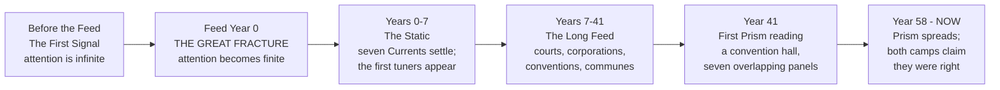
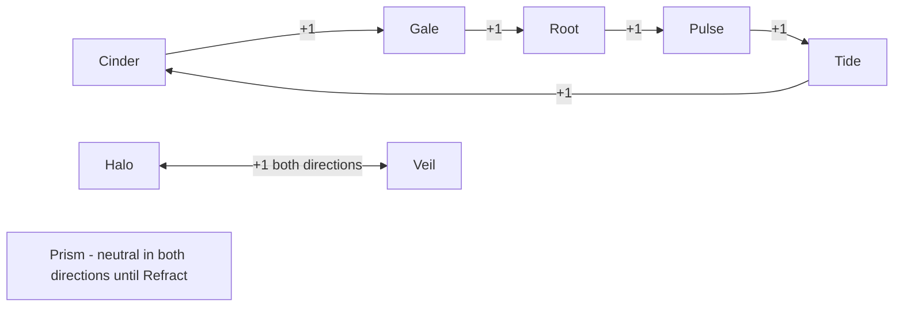
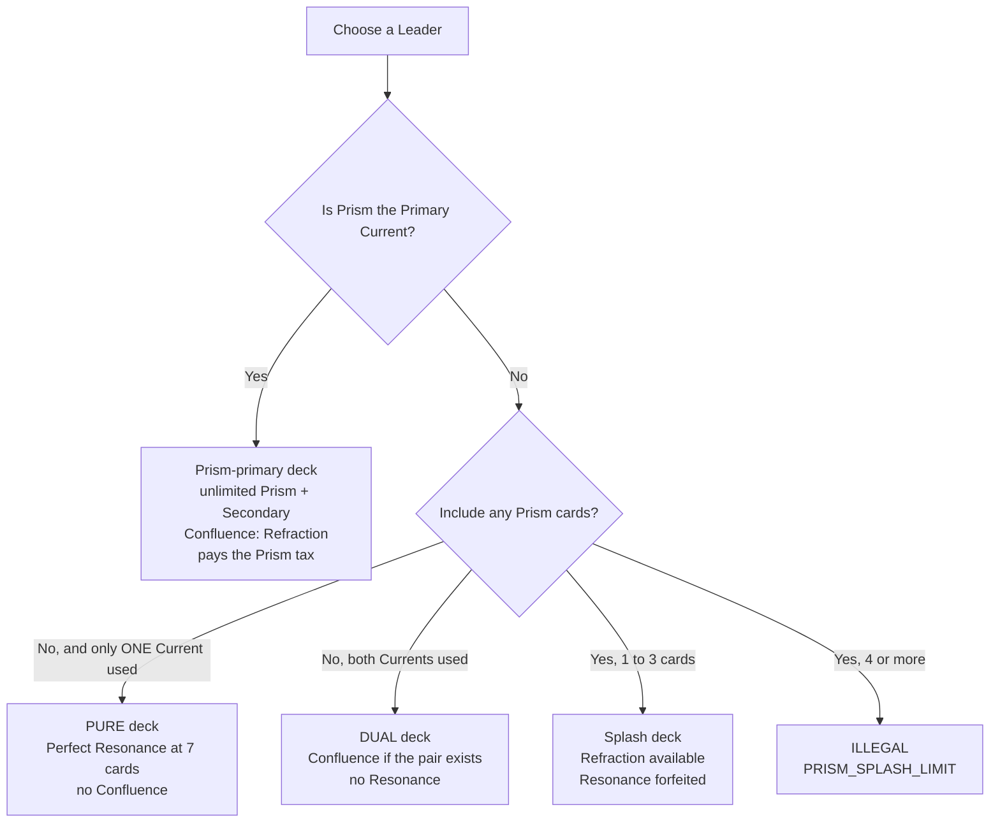

# 06 — The Eight Currents & the Lore of the First Signal

> Part of the HYPEBOUND design set (`docs/design/`).
> **Canon:** [core rules](00-core-rules.md) §5.2 (elemental bonus), §5.4 (statuses),
> §6 (keywords), §8 (the Currents system) · [architecture contract](../tech/00-architecture-contract.md) §4 ·
> `src/engine/types.ts` (effects DSL — every mechanic in this document is expressible with it).
> **Canonical data owned elsewhere and quoted verbatim here:** `data/currents.json`
> (Perfect Resonance effects), `data/confluences.json` (Confluence effects),
> `data/keywords.json`, `data/statuses.json`, `data/balance.json`.
> **Siblings:** [gameplay loop & match flow](02-gameplay-loop-and-match-flow.md) ·
> [faction guide index](factions/) · [screens & navigation](03-screens-and-navigation.md) ·
> [game modes](09-game-modes.md)

---

## 1. Scope, canon, and how to use this document

This document owns three things:

1. **The lore** of the First Signal, the Great Fracture, the seven natural
   Currents, the later emergence of Prism, and the two beliefs that split the
   modern internet over whether the Signal should be put back together.
2. **The per-Current identity kits** — philosophy, strategy, signature keyword,
   frame/icon/VFX/animation language, sound direction, an example Leader, four
   example cards, and the Current's Perfect Resonance effect.
3. **The interaction systems** — the advantage cycle (full 8×8 matrix and worked
   damage previews), all nine Confluences (worked examples and counterplay), the
   Perfect Resonance system, and Current-aware deck construction.

**Precedence.** Where this document and `00-core-rules.md` disagree, the core
rules win. Where this document and `data/currents.json` or
`data/confluences.json` disagree about a Resonance or Confluence *effect*, the
data files win — their effects are reproduced here verbatim and are **not**
redesigned. Decisions made here because canon is silent are tagged **[DECISION]**
and are binding on implementation until canon is amended.

**Voice rule.** The comedy lives in card names, character names, and flavor
text. Rules text, rulings, and this document's own prose stay clear and
technical. No character in HYPEBOUND references a real, named person; every
archetype is original.

---

## 2. The Lore of the Signal

### 2.1 The First Signal

Before the feed there was the **First Signal**: one connection carrying
everything at once. Every song someone was writing, every argument someone was
losing, every drawing left on a shared wall, every 3 A.M. confession — all of it
on a single channel, all of it simultaneous, all of it *felt* rather than read.

The First Signal was not a god. It was infrastructure that had accidentally
become one. Nobody built it and nobody could switch it off, which meant nobody
was ever alone and nobody was ever finished talking. Attention was infinite,
because attention was not yet a thing anyone had to spend.

Three properties of the First Signal survive into the present game rules:

| Property of the Signal | What it became | Rule |
|---|---|---|
| Ambient connective energy that renewed itself constantly | **Hype** — the residue pools and refreshes every day | Max Hype = your turn number, cap 10, refills each turn (canon §3.1) |
| How wide you opened your own channel | **Obsession** — open too wide and everything gets through, including damage | 0–10 meter; **Obsessed** at 8+ takes +1 damage from all enemy sources (canon §3.2) |
| Tuning to a frequency costs nothing; being on it is free | **No elemental resource** — Currents are a frequency, not a fuel | Everything costs Hype and only Hype (canon §8.6) |

### 2.2 The Great Fracture

The Signal did not die. It was not attacked, sabotaged, or unplugged. It broke
because it worked too well: when everyone is heard at once, nobody is heard in
particular, and the Signal — which was, in the end, made entirely of people
trying to be heard — tore itself into pieces trying to satisfy all of them
simultaneously.

The historians call it the **Great Fracture**. Everyone else calls it the
morning the world got quiet enough to notice itself.

The Fracture is **Feed Year 0**, the moment attention became finite. That single
change created scarcity, and scarcity created everything HYPEBOUND is about:
audiences, rivalries, algorithms, clout, fandoms, and the specific human being
who refreshes a page eleven times in ninety seconds hoping the number went up.

### 2.3 What the Fracture left behind — the seven natural Currents

The Signal did not shatter into noise. It separated the way light separates:
into seven coherent strands, each carrying one thing the Signal used to carry
all at once. These are the **natural Currents**. You do not cast a Current. You
*tune* to one, and it answers with what it remembers.

| Current | What it carried inside the Signal | What it became after the Fracture |
|---|---|---|
| **Cinder** | The heat of wanting to be seen | Ambition, performance, destructive creativity |
| **Tide** | Everything the Signal had already said | Memory, adaptation, repetition |
| **Root** | The parts nobody ever logged off from | Stability, patience, legacy |
| **Gale** | Rumor moving faster than verification | Freedom, speed, hearsay |
| **Pulse** | The wire itself, humming | Technology, urgency, unstable energy |
| **Halo** | The part of the Signal that meant it | Hope, truth, unity |
| **Veil** | Everything said in private, and everything not said | Secrets, fear, forbidden ambition |

Each Current is a survivor with a personality and an agenda, and each of them
is, embarrassingly, convinced that it is the part that mattered.

### 2.4 Prism: the eighth, and the newest

**Prism is not a fragment of the Signal. Prism is fragments finding each other.**

The first confirmed Prism reading was logged in **Feed Year 41**, in a
convention hall where seven fandoms had booked overlapping panels in the same
building on the same weekend. Somewhere between the badge line and the
masquerade stage, the seven Currents ran through the same crowded corridor at
the same time — and something came back out that was all of them and none of
them, and it was *stable*.

Prism spread the way conventions spread: unpredictably, socially, and always
with worse ventilation than promised. Prism-attuned cards now appear in
circulation faster every season, which both sides of the great argument (§2.6)
cite as proof that they were right all along.

Two things are true about Prism and are load-bearing for the game:

- **Prism is possibility, and possibility is unstable.** A Prism card is
  undecided until it **Refracts**. That is why Prism sits outside the advantage
  cycle entirely (canon §8.4) and why Prism cards pay a design tax — roughly
  1 Hype more, or a statline one step lower, than a natural-Current card of the
  same effect (canon §8.6).
- **Nobody knows what Prism wants.** The Reconvergents call Prism a proof of
  concept. The Fracturists call it a symptom. The Meme Collective calls it
  extremely funny. The game never resolves the question, and no card is ever
  allowed to state the answer.

### 2.5 Chronology



### 2.6 The two beliefs

Every faction in HYPEBOUND has taken a position on one question: **should the
First Signal be put back together?**

**THE RECONVERGENCE — salvation.**
The Fracture was an injury, not a graduation. Reunite the Currents and the
Signal returns: total connection, nothing lost, nobody alone, every dead
community back on the air. Reconvergents point at Prism and say *it is already
happening, and nothing has caught fire yet.* Their disagreements are entirely
about **who gets to hold the reassembled Signal**, which is why they have never
once managed a joint press release.

**THE SECOND FRACTURE — catastrophe.**
One Signal means one voice. Reconvergence would not restore connection; it would
dissolve every subculture, every private server, every weird little forum, into
an undifferentiated hum — and this time there would be nothing left over to
break into pieces. Fracturists point at Prism and say *it is already happening,
and that is precisely the problem.* Their slogan is short enough to fit on a
hiking-club patch: **the Fracture was the cure.**

Neither camp is confirmed correct. That ambiguity is a hard design constraint:
the story campaign explores the argument, boss encounters dramatize it, and
**no card, quest, or cinematic ever settles it.**

### 2.7 Faction alignment

| Faction | Currents | Position | Doctrine | Creed |
|---|---|---|---|---|
| **Neon Idols** | Halo / Pulse | Reconvergence | *The Chorus* — the Signal returns when enough voices sing the same part | "One song. All voices. Rehearsal is at six." |
| **Corporate Creators** | Root / Halo | Reconvergence | *The Acquisition* — the Signal is an unclaimed asset with excellent fundamentals | "It has an owner. It simply hasn't signed yet." |
| **Cosplay Champions** | Prism / Tide | Reconvergence | *Proof by Prism* — we have worn all seven and nobody died | "The costume proves the concept." |
| **Algorithm Syndicate** | Pulse / Tide | Reconvergence | *The Managed Merger* — reconvergence is a scheduled rollout, routed through us | "You were always going to reconnect. We just picked the date." |
| **Gothic Royalty** | Veil / Root | Reconvergence | *The Resurrection* — restore the Signal and every dead fandom comes home | "Nothing is over. It is merely between seasons." |
| **Touch-Grass Order** | Root / Gale | Second Fracture | *The Absolute* — the Fracture was the cure; keep the pieces apart | "Log off. We insist." |
| **Digital Demons** | Cinder / Veil | Second Fracture | *The Widening* — we live in the gap; seal it and we end, so widen it | "Terms and conditions apply. Forever." |
| **Viral Influencers** | Gale / Cinder | Accelerationist | *Whichever Trends* — restore it, break it, restore it again, film all of it | "Either way, the numbers move." |
| **Afterparty Crew** | Cinder / Tide | Third path | *The Nightside* — the Signal comes back at 4 A.M. by itself; sit down | "Nothing good happens after 3 A.M. Except us." |
| **Meme Collective** | Prism / Gale | Third path | *Refractionism* — why pick one Signal when you can keep splitting it forever | "It's funnier the seventh time." |

The split is deliberately lopsided — five Reconvergents, two Fracturists, three
who refuse the question. That asymmetry **is** the satire: the position arguing
for less connection is a minority nobody wants to platform, and the
Touch-Grass Order is entirely aware of this.

### 2.8 The lore/rules firewall (binding)

- **Lore never changes rules.** No faction's beliefs grant a mechanical
  exception. The advantage cycle is exactly +1 for everyone (canon §8.7).
- **Lore never gates content.** A Reconvergent leader may play Fracturist-coded
  cards if the faction and Currents are legal; alignment is flavor, missions,
  and story only.
- **Lore is delivered through card names, flavor text, story chapters, and
  boss dialogue** — never through rules text on a card.

---

## 3. The eight Currents at a glance

All values below are quoted from `data/currents.json` (canonical).

| Current | Element | Beats | Beaten by | Signature | Frame shape key | Icon key | Color token | Perfect Resonance |
|---|---|---|---|---|---|---|---|---|
| **Cinder** | fire | Gale | Tide | **Scorched** (status) | `flame-notch` | `current-cinder` | `--current-cinder` | Standing Ovation |
| **Tide** | water | Cinder | Pulse | **Flow** | `wave-round` | `current-tide` | `--current-tide` | Total Recall |
| **Root** | earth | Pulse | Gale | **Grow X** | `hex-stone` | `current-root` | `--current-root` | Deep Roots |
| **Gale** | wind | Root | Cinder | **Rushwind** | `ribbon-sweep` | `current-gale` | `--current-gale` | Second Wind |
| **Pulse** | lightning | Tide | Root | **Overload (X)** | `circuit-angle` | `current-pulse` | `--current-pulse` | Grid Surge |
| **Halo** | light | Veil | Veil | **Inspire** | `radiant-circle` | `current-halo` | `--current-halo` | First Light |
| **Veil** | darkness | Halo | Halo | **Corrupt** | `shard-mirror` | `current-veil` | `--current-veil` | Total Blackout |
| **Prism** | spectrum | — | — | **Refract** | `crystal-facet` | `current-prism` | `--current-prism` | Full Spectrum |

> **Data note (reported, not resolved here).** `data/currents.json` sets
> Cinder's `signatureKeyword` to `null`, while core rules §6 lists **Scorched**
> in the "Current keywords" table. Both are correct: **Scorched is a status**
> (`StatusId`), not a `KeywordId`, so the data file cannot name it as a keyword.
> Cinder is the one Current whose signature is a status rather than a keyword.
> Documentation and UI must therefore label it "Signature status: **Scorched**".

---

## 4. Current dossiers

Each dossier follows the same eight-part structure. Example cards use canonical
templating (canon §6): keyword names **bold**, reminder text *italic on Common
and Rare only*, numbers as digits, cost references as "(N)". Every card listed
is expressible with the effects DSL in `src/engine/types.ts` — no new opcodes,
triggers, or target selectors are proposed anywhere in this document.

Example cards are drawn as a **Neutral exemplar cycle** unless stated otherwise
**[DECISION]**: they are faction-free on purpose, so each Current's identity is
legible without faction flavor and so they do not collide with cards owned by
the faction documents. Their intended home is `data/cards/neutral.json`.

---

### 4.1 Cinder — Fire

| Field | Value |
|---|---|
| Element | fire |
| Beats / beaten by | Gale / Tide |
| Signature | **Scorched** (status; canon §5.4) |
| Frame shape | `flame-notch` — sharp flame-notched frame, ember glow |
| Resonance | **Standing Ovation** |

#### Identity & philosophy

Cinder is the Current of people who would rather be a spectacular flameout than
a comfortable nobody. It carried the *heat* of the First Signal — the specific
physical want of being looked at — and after the Fracture it kept the heat and
lost every safety interlock.

Cinder does not believe in archives, second drafts, or sustainable pacing. It
believes the moment is now, the crowd is here, and anything worth doing is
worth doing loudly enough to damage the venue. Its creed: **burn now, archive
never.**

#### Gameplay strategy

Proactive damage and inevitability-by-arson. Cinder puts damage on the board
that the opponent must answer *this turn*, then leaves **Scorched** behind so
that even a successful answer still costs health. Its reach closes games that
board presence alone cannot.

| Strengths | Weaknesses |
|---|---|
| Best direct-damage rate in the game; reliable reach to the enemy leader | Finite damage total — if the opponent stabilizes above the burn ceiling, Cinder has no plan B |
| **Scorched** turns every trade into a delayed second trade | Sustained healing and **Armor** blank the plan (Gothic Royalty, Corporate Creators) |
| Excellent into wide, low-health boards (Gale swarms; +1 elemental on top) | Takes +1 from Tide, the Current built entirely from healing and replay |
| Cheap removal frees Hype for pressure | Fragile bodies: Cinder statlines are attack-heavy and die to anything |

#### Signature in play — **Scorched**

> *Takes 1 damage at the end of its controller's turn, then Scorched is removed unless renewed.* (`data/statuses.json`)

- **DSL:** `{ "op": "applyStatus", "target": …, "status": "scorched" }`. No
  duration is needed — the status self-clears after it burns.
- **Timing:** resolves at **E2** of the *affected character's controller's* end
  of turn — after Afterparty triggers (E1) and before Grow ticks (E3), per the
  turn sequence in [02 §3.3](02-gameplay-loop-and-match-flow.md). This ordering
  is why a Scorched **Grow** character that dies to burn never ticks.
- **Stacking ruling [DECISION]:** Scorched does not stack. Re-applying it to an
  already-Scorched character refreshes it (it will burn again next end of turn)
  but never deals 2. Cards that want more burn must deal damage directly.
- **Design pitfall:** Scorched is *delayed* damage. Never print it as though it
  were immediate — the opponent gets a full turn to heal, shield, trade, or
  **Touch Grass** the target.

#### Visual language

| Layer | Direction |
|---|---|
| Frame | `flame-notch`: five asymmetric notches cut into the outer bezel, ember glow bleeding inward from the cuts; the notch pattern is unique enough to identify Cinder in silhouette at board distance |
| Iconography | A play-button triangle that has caught fire — the tip curls into a flame. Status glyph for Scorched is a solid ember with an upward wisp (shape-coded, never color-only) |
| VFX | Impacts throw sparks that rise, dim, and die within 500 ms; a Scorched target keeps a slow smolder ring at its base; AoE plays wash a heat shimmer across the board plane |
| Animation | Fast in, fast out. Cards snap into slots in ~90 ms with a 6% overshoot and a smoke puff. Nothing eases gently; nothing lingers |

#### Sound design

`sfx.card.play.cinder`: a struck match into a blown speaker cone — distorted
analog crackle with a short, dirty tail. Bed: tape hiss. AoE: a rising *ffwoosh*
that clips deliberately. Scorched application is a single dry crackle so players
can hear delayed damage being set up without looking. Faction music that leans
Cinder (`music.battle.viral-influencers`, `music.battle.afterparty-crew`)
should run hot with intentional saturation on the drum bus.

#### Example Leader — **Blayze Trendall, Arsonist of the Algorithm**

Cinder primary / Gale secondary · Viral Influencers · defined in
[factions/03 §7.1](factions/03-viral-influencers.md).

| Ability | Text |
|---|---|
| Passive — *Stir the Pot* | After you play your second card each turn, deal 1 damage to the enemy leader. |
| Fixation (3) — *Spicy Take* | Deal 1 damage to a character and apply **Scorched** to it. |
| Ultimate (7) — *Career-Ending Livestream* | Deal 2 damage to all enemy characters, then apply **Scorched** to each surviving enemy character. |

He is the Current's thesis with a ring light: every apology video is a season
premiere, every ban is a franchise reboot, and he genuinely cannot tell infamy
from love.

#### Example cards

| Name | Cost | Type | Rarity | Stats | Rules text |
|---|---|---|---|---|---|
| Ratio Kindling | 1 | Action | Common | — | Deal 1 damage to a character and apply **Scorched** to it. *(Scorched — takes 1 damage at the end of its controller's turn, then is removed unless renewed.)* |
| Flame-War Veteran | 3 | Character | Common | 3/3 | **Raid** *(Can attack the turn it is played.)* **Afterparty:** This takes 1 damage. *(Afterparty — triggers at the end of your turn.)* |
| Fan the Flames | 3 | Action | Rare | — | Deal 1 damage to each **Scorched** enemy character, then apply **Scorched** to all enemy characters. *(Scorched — takes 1 damage at the end of its controller's turn.)* |
| Byline, the Unquenched | 7 | Character | Legendary | 6/6 | **Spotlight.** When you play this, deal 3 damage to all enemy characters. **Afterparty:** Deal 1 damage to the enemy leader for each **Scorched** enemy character. |

Flavor:
- *Ratio Kindling* — "It only takes one reply. It never takes only one reply."
- *Flame-War Veteran* — "He has been wrong about this since before your account existed. He is not stopping now."
- *Fan the Flames* — "Someone in the replies said 'this is fine.' They were not being sincere."
- *Byline, the Unquenched* — "Every headline she writes is technically true and structurally arson."

#### Perfect Resonance — **Standing Ovation**

> **Deal 2 damage to all enemy characters and Scorch them.** (`data/currents.json`)

```jsonc
[ { "op": "damage",      "target": { "select": "all", "side": "enemy", "zone": "board" }, "amount": 2 },
  { "op": "applyStatus", "target": { "select": "all", "side": "enemy", "zone": "board" }, "status": "scorched" } ]
```

The most swingy Resonance in the game and the reason pure-Cinder decks are
allowed to be otherwise fair: a delayed board wipe that a wide opponent can see
coming on the Resonance tracker (`Resonance 6/7`) and must play around by
holding bodies in hand.

---

### 4.2 Tide — Water

| Field | Value |
|---|---|
| Element | water |
| Beats / beaten by | Cinder / Pulse |
| Signature | **Flow** |
| Frame shape | `wave-round` — rounded wave-edge frame, liquid sheen |
| Resonance | **Total Recall** |

#### Identity & philosophy

Tide is the Current of the archive. It carried everything the Signal had already
said, and it kept all of it: the deleted post, the re-upload of the re-upload,
the annual reposting of a joke that was funny once in Year 12 and is now a
tradition.

Tide's philosophy is that nothing is ever really gone — it is only badly filed.
It is patient, forgiving, and quietly relentless, and it wins arguments by
producing a timestamp.

#### Gameplay strategy

Recursion, sustain, and value-per-card. Tide bounces its own cards back to hand
to re-use them, heals to invalidate the opponent's damage math, and converts
each return or heal into a **Flow** trigger. It plays a long, grinding game and
is happy for the match to last four more turns than the opponent budgeted for.

| Strengths | Weaknesses |
|---|---|
| Best value engine: every return/heal is a second payout via **Flow** | Slow to close — Tide can dominate a board and still fail to kill |
| Leader-health sustain makes aggressive decks run out of damage | Anti-heal (**Blackflame**, Digital Demons) turns the engine off cleanly |
| +1 into Cinder — the burn faction's cards get worse and its targets get healthier | Takes +1 from Pulse burst, which kills engine pieces before they loop |
| Replaying on-play effects is the cleanest combo axis in the game | Loops are visible and slow; disruption on the key piece costs Tide a whole turn |

#### Signature in play — **Flow**

> *Triggers when a friendly card is returned to your hand, replayed, healed, or exchanged.* (`data/keywords.json`)

- **DSL:** `{ "trigger": "flow", "ops": [ … ] }` on the card that carries the
  keyword. The trigger fires for **friendly** events only.
- **Four legal Flow sources [DECISION — enumeration of canon's list]:**
  (a) a friendly card returns from play to hand (`returnToHand`);
  (b) a friendly card is played again from hand after such a return;
  (c) a friendly character is healed (`heal`, actual healing > 0);
  (d) an exchange — a friendly card is swapped for another (`transform`,
  `swapAttackHealth`, Equipment replacement, **Rewear**-style returns).
- **Overheal ruling [DECISION]:** healing a character already at full health
  heals 0 and does **not** trigger Flow. This prevents an infinite
  heal-for-nothing loop and matches the `healed { amount, blocked }` event.
- **Cap:** Flow chains obey the global trigger cap of 20 (`rules.triggerCap`).

#### Visual language

| Layer | Direction |
|---|---|
| Frame | `wave-round`: corners dissolved into wave crests, a slow liquid specular sheen travelling the bezel at ~0.15 Hz |
| Iconography | A refresh-loop arrow whose tail becomes a wave crest — "the reload symbol, drowning." Flow trigger glyph is a two-lobe ripple |
| VFX | Returns to hand play as a reverse splash (the card un-lands); effects propagate as concentric rings across the board plane; healing pours from above the card and pools briefly at its base |
| Animation | Everything eases in and out with secondary motion — a card that lands bobs once before settling. Nothing snaps |

#### Sound design

`sfx.card.play.tide`: submerged reverb with a soft bell whose decay is itself
re-triggered once (the sound repeats its own tail). Returns use a tape-rewind
scrub; heals use a rising water swell. Music that leans Tide
(`music.battle.algorithm-syndicate`, `music.battle.cosplay-champions`) should
side-chain a slow LFO so the whole mix breathes.

#### Example Leader — **Miss Autoplay, the Endless Queue**

Tide primary · **no Secondary** (enables pure-Tide Perfect Resonance decks) ·
Algorithm Syndicate.
**[DECISION — new leader concept.]** Proposed here because no existing document
defines a Tide-primary leader; the Algorithm Syndicate faction document has
final say over her final wording and id.

| Field | Value |
|---|---|
| Id | `algo-leader-miss-autoplay` |
| Health | 30 |
| Passive — *Up Next* | At the start of your turn, look at the top 2 cards of your deck and put one on the bottom. |
| Fixation (3) — *Recommended For You* | Return a friendly character to your hand. Draw a card. |
| Ultimate (7) — *Autoplay Forever* | Return all friendly characters to your hand. They cost (1) less. |

```jsonc
// Passive              → { "trigger": "startOfTurn", "ops": [ { "op": "scry", "count": 2, "mode": "bottomOne" } ] }
// Fixation ops         → [ { "op": "returnToHand", "target": { "select": "triggering" } },
//                          { "op": "draw", "count": 1 } ]
// Ultimate ops         → [ { "op": "forEach",
//                            "target": { "select": "all", "side": "friendly", "zone": "board" },
//                            "ops": [ { "op": "returnToHand", "target": { "select": "triggering" } },
//                                     { "op": "modifyCost",  "target": { "select": "triggering" }, "delta": -1 } ] } ]
```

She is a curator who has never once let a video end. She speaks exclusively in
autoplay countdowns, treats "up next" as both a promise and a threat, and has
not been asked a question she considered answerable since Year 44. Her Ultimate
is the faction's signature *reset*: every on-play effect on your board, again,
cheaper — and a great many **Flow** triggers on the way out.

#### Example cards

| Name | Cost | Type | Rarity | Stats | Rules text |
|---|---|---|---|---|---|
| Rerun Archivist | 2 | Character | Common | 1/4 | **Flow:** Restore 1 health to your leader. *(Flow — triggers when a friendly card is returned to your hand, replayed, healed, or exchanged.)* |
| Reupload | 2 | Action | Common | — | Return a friendly character to your hand. Draw a card. |
| Wayback Vault | 3 | Location | Rare | Dur. 3 | **Activate** (once per turn): Restore 3 health to a damaged friendly character. |
| Ondine of the Deep Archive | 5 | Character | Epic | 4/5 | When you play this, return another friendly character to your hand. **Flow:** This gains +1/+1. |

Flavor:
- *Rerun Archivist* — "Nothing is deleted. It is only badly filed."
- *Reupload* — "Take it down, fix the audio, put it back up. Repeat until the heat death of the platform."
- *Wayback Vault* — "Everything you regret is in here, alphabetized, with timestamps."
- *Ondine of the Deep Archive* — "She remembers your first post. She would like to discuss it."

#### Perfect Resonance — **Total Recall**

> **Restore 6 health to your leader and draw 2 cards.** (`data/currents.json`)

```jsonc
[ { "op": "heal", "target": { "select": "leader", "side": "friendly" }, "amount": 6 },
  { "op": "draw", "count": 2 } ]
```

The anti-aggro Resonance: 6 health is two turns of a fast clock, and the 2 cards
refuel the grind. Counterplay is to force it early (make Tide spend cards
defensively before 7 Tide cards are played) or to pre-empt it with a
**Blackflame**-style heal lock on the turn it is due — the tracker tells you
when.

---

### 4.3 Root — Earth

| Field | Value |
|---|---|
| Element | earth |
| Beats / beaten by | Pulse / Gale |
| Signature | **Grow X** |
| Frame shape | `hex-stone` — heavy hexagonal stone frame |
| Resonance | **Deep Roots** |

#### Identity & philosophy

Root is the Current of the parts of the Signal nobody ever logged off from: the
forum that has been up since before the Fracture, the wiki maintained by one
person for twenty years, the group chat that has outlived three platforms and
two marriages.

Root does not chase. Root does not trend. Root is simply still there when the
trend is over, which it regards as the only argument that has ever worked. Its
creed: **uptime is a personality.**

#### Gameplay strategy

Defensive statlines that become offensive statlines if you refuse to deal with
them. Root wins by making the board expensive to attack into and by converting
survived turns into permanent size via **Grow X**. It is the game's most
patient Current and the hardest to race.

| Strengths | Weaknesses |
|---|---|
| Highest health-per-Hype in the game; walls out aggressive curves | Slowest starts; a Root deck can lose before its threats mature |
| **Grow X** turns time into permanent stats — inevitability without card spend | **Banished** / **Touch Grass** erases Grow investment entirely (returns at base stats) |
| Armor and +0/+X buffs make burn math collapse | Takes +1 from Gale, the Current designed to go around walls |
| +1 into Pulse punishes the game's most fragile bodies | Low reach: Root frequently controls the board and still cannot close |

#### Signature in play — **Grow X**

> *Upgrades permanently after surviving the stated number of your turns.* (`data/keywords.json`)

- **DSL:** card field `"grow": { "turns": X, "ops": [ … ] }` plus the
  `growComplete` trigger for any additional payoff. Runtime state lives in
  `CharacterInstance.growProgress` / `growComplete`.
- **Timing:** counters advance at **E3** of your end of turn — after Scorched
  (E2) resolves. A character that dies to burn never ticks that turn.
- **Rulings [DECISION]:**
  (a) Grow counters advance only on **your own** turn-ends;
  (b) a character that leaves play and returns (Comeback, resurrect, Banish)
  resets `growProgress` to 0 — it returns "with base stats", canon §5.4;
  (c) **Cancelled** characters do not advance Grow while Cancelled (their text
  is blank), and resume from their stored progress when the status ends;
  (d) Grow completes exactly once per instance.
- **Design pitfall:** Grow payoffs must be worth *at least* one card of tempo,
  because the opponent is given X turns of warning to answer them.

#### Visual language

| Layer | Direction |
|---|---|
| Frame | `hex-stone`: a thick hexagonal bezel with visible strata; each Grow tick etches one growth ring into the frame edge, so progress is readable on the card itself as well as on the counter badge |
| Iconography | A hexagon containing a tree-ring cross-section with three rings. Grow badge is a numbered seed-to-ring pip row (`2/3`) |
| VFX | Dust puffs and settling grit; buffs *sink into* the character (a downward press) instead of sparkling upward; Grow completion cracks a stone shell off the model |
| Animation | Heavy and slow, no bounce. Cards land with a 2 px board shake — **gated by the screen-shake accessibility toggle**, which substitutes a dust ring |

#### Sound design

`sfx.card.play.root`: a low sub thud under stone-on-stone grind, long release,
no transient sparkle. Grow completion is a single deep wooden creak resolving
into a bell — a "something just got bigger" cue audible without looking. Root
faction beds (`music.battle.touch-grass-order`,
`music.battle.corporate-creators`) carry a continuous drone that never resolves.

#### Example Leader — **Alaric Thornheart, the Heir Interminable**

Root primary · no Secondary (enables pure-Root Perfect Resonance decks) ·
Gothic Royalty · defined in [factions/02 §7.2](factions/02-gothic-royalty.md).

| Ability | Text |
|---|---|
| Passive — *Old Growth* | At the end of your turn, give a random friendly character with **Grow** +0/+1. |
| Fixation (3) — *Patience of Stone* | Restore 3 Health to a character or your leader. |
| Ultimate (7) — *Century Bloom* | Complete all friendly **Grow** counters immediately, then give those characters +1/+1. |

An immortal prince perpetually "about to" finish his memoirs (current draft: 400
years, chapter one), growing rose hedges through abandoned server racks and
speaking of uptime the way others speak of bloodlines.

> **Implementation note (reported upward):** *Century Bloom* requires forcing
> Grow completion, for which `src/engine/types.ts` has no opcode. Either the
> Gothic Royalty document rewords the ability, or `EffectOp` gains an explicit
> `completeGrow` op. This document does not assume the op exists.

#### Example cards

| Name | Cost | Type | Rarity | Stats | Rules text |
|---|---|---|---|---|---|
| Forum Regular | 2 | Character | Common | 1/4 | **Grow 2:** Gains +2/+2 and **Spotlight**. *(Grow — after surviving 2 of your turn-ends in play, gains the upgrade permanently. Spotlight — enemies must attack characters with Spotlight before other targets.)* |
| Ergonomic Throne | 2 | Equipment | Rare | +0/+3 | Equipped character has +0/+3. At the start of your turn, restore 1 health to it. |
| Load-Bearing Community | 4 | Action | Rare | — | Give your characters +0/+2 and your leader **Armor 2**. *(Armor — absorbs the next 2 total damage.)* |
| The Nine-Thousand-Day Server | 6 | Character | Epic | 4/8 | **Spotlight.** **Afterparty:** Give your other characters +0/+1. |

Flavor:
- *Forum Regular* — "Joined 4,000 days ago. Has read every thread. Has posted twice."
- *Ergonomic Throne* — "Lumbar support is the only support that has never let anyone down."
- *Load-Bearing Community* — "Six people hold this entire fandom up. None of them have met."
- *The Nine-Thousand-Day Server* — "Uptime: 9,000 days. Moderators: one. Rules: unchanged since day one."

#### Perfect Resonance — **Deep Roots**

> **Give your characters +0/+3 and your leader Armor 3.** (`data/currents.json`)

```jsonc
[ { "op": "buff",        "target": { "select": "all", "side": "friendly", "zone": "board" }, "health": 3, "permanent": true },
  { "op": "applyStatus", "target": { "select": "leader", "side": "friendly" }, "status": "armor", "amount": 3 } ]
```

Note the `permanent: true`: the +0/+3 survives **Eclipse** and aura suppression
because it is a real buff, not an aura. Counterplay is removal that ignores
health (transform, destroy, Banish) and going wide enough that +0/+3 on each
body does not change the number of answers required.

---

### 4.4 Gale — Wind

| Field | Value |
|---|---|
| Element | wind |
| Beats / beaten by | Root / Cinder |
| Signature | **Rushwind** |
| Frame shape | `ribbon-sweep` — swept, ribbon-cut asymmetric frame |
| Resonance | **Second Wind** |

#### Identity & philosophy

Gale carried rumor — everything moving faster than anyone could verify it. It is
the Current of the screenshot without context, the "did you see," the trend that
is enormous for forty minutes and then has never existed.

Gale believes that being first is the entire game and that being correct is a
problem for people with time. It is not malicious; it is simply already three
topics ahead of you.

#### Gameplay strategy

Multi-card turns and tempo. Gale's cards are cheap, individually small, and get
better the more of them you play in a single turn — **Rushwind** is a discount on
commitment rather than on cost. Gale goes around walls instead of through them.

| Strengths | Weaknesses |
|---|---|
| Cheapest curve in the game; routinely plays 3+ cards a turn | Individually weak cards; poor topdecks after turn 8 |
| **Rushwind** rewards sequencing skill without adding rules weight | Board wipes and **Sandstorm** undo a whole turn of investment |
| +1 into Root makes "unbreakable" walls breakable | Takes +1 from Cinder, whose AoE is priced against exactly this board |
| Bounce and tempo effects buy time no other Current can | Almost no sustain — every point of leader damage taken is permanent |

#### Signature in play — **Rushwind**

> *Bonus if this is not the first card you played this turn.* (`data/keywords.json`)

- **DSL:** `{ "trigger": "rushwind", "ops": [ … ] }` — an additional on-play
  effect that only resolves when `PlayerState.cardsPlayedThisTurn >= 1` at the
  moment this card is played.
- **Rulings [DECISION]:**
  (a) the counter is *cards played from hand this turn*, including Reactions set
  face-down and token cards such as **Borrowed Clout** (consistent with
  [02 §3.2](02-gameplay-loop-and-match-flow.md));
  (b) Confluence and Fixation activations are **not** card plays and do not
  enable Rushwind;
  (c) the bonus resolves immediately after the card's normal `onPlay` effect, in
  the same resolution step, and emits `keywordTriggered`.
- **Design pitfall:** Rushwind bonuses must be *bonuses*, never the whole card.
  A Gale card that is unplayable as the first card of a turn is a bad card.

#### Visual language

| Layer | Direction |
|---|---|
| Frame | `ribbon-sweep`: the bezel is cut asymmetrically, as though a ribbon were laid across the card and trimmed — the top-left and bottom-right corners are visibly different weights |
| Iconography | Three swept chevrons nesting into an arrow-of-arrows (a share glyph caught mid-gust). Rushwind trigger flashes a second chevron behind the first |
| VFX | Speed lines and ribbon afterimages; cards leave a 3-frame trail; token summons arrive as a gust that scatters paper |
| Animation | Cards fly in from off-board along a curved arc at high speed, overshoot ~10%, and settle in ~120 ms. Idle hover carries a constant slight drift so Gale cards never look bolted down |

#### Sound design

`sfx.card.play.gale`: airy whoosh with a real doppler sweep plus paper flutter
and a tight hi-hat. **Audio design rule:** the play SFX rises one semitone for
each card already played this turn (capped at +4), so a player can *hear* that
Rushwind is live before reading the card. Gale beds
(`music.battle.viral-influencers`, `music.battle.meme-collective`) run breakbeat
percussion that accelerates with board width.

#### Example Leader — **Cyra Swipe, First to Every Trend**

Gale primary · no Secondary (enables pure-Gale Perfect Resonance decks) ·
Viral Influencers · defined in [factions/03 §7.2](factions/03-viral-influencers.md).

| Ability | Text |
|---|---|
| Passive — *Early Adopter* | The first Follower you summon each turn gains **Raid**. |
| Fixation (3) — *Go Live* | Summon a 1/1 Follower. |
| Ultimate (7) — *The Feed Awakens* | Summon 3 1/1 Followers with **Raid**, and your Followers get +1/+0 this turn. |

She has never finished a video, a sentence, or a meal, because the next trend
arrived first. Her follower count updates faster than her heartbeat and she
considers this an upgrade.

#### Example cards

| Name | Cost | Type | Rarity | Stats | Rules text |
|---|---|---|---|---|---|
| Repost Sprinter | 1 | Character | Common | 1/1 | **Rushwind:** This gains +1/+0 and **Raid**. *(Rushwind — bonus if this is not the first card you played this turn. Raid — can attack the turn it is played.)* |
| Screenshot and Run | 2 | Action | Common | — | Return an enemy character that costs (3) or less to your opponent's hand. **Rushwind:** Draw a card. *(Rushwind — bonus if this is not the first card you played this turn.)* |
| Subtweet | 2 | Reaction | Rare | — | **Reaction** — when the enemy plays a character costing (4) or more: return it to your opponent's hand. |
| Everyone Is Posting About It | 5 | Event | Epic | 2 turns | **Event (2 turns)** — at the start of your turns: gain 1 Hype this turn and draw a card. |

Flavor:
- *Repost Sprinter* — "Saw it, shared it, did not read it. Standard procedure."
- *Screenshot and Run* — "Gone before the reply loads."
- *Subtweet* — "No names. Everyone knows. That was the entire point."
- *Everyone Is Posting About It* — "Nobody can explain what 'it' is, but the posting has reached industrial scale."

#### Perfect Resonance — **Second Wind**

> **Your characters may attack again. Draw 1 card.** (`data/currents.json`)

```jsonc
[ { "op": "attackAgain", "target": { "select": "all", "side": "friendly", "zone": "board" } },
  { "op": "draw", "count": 1 } ]
```

The highest burst ceiling of any Resonance and the reason pure-Gale is a real
archetype rather than a worse Viral deck. It refreshes attacks, so it does not
bypass **summoning sickness** — characters played this turn without **Raid**
still cannot attack **[DECISION]**. Counterplay: **Spotlight** walls tax both
swings, **Sandstorm** (Weakened 1) halves a token board's second attack, and the
tracker warns you at 6/7.

---

### 4.5 Pulse — Lightning

| Field | Value |
|---|---|
| Element | lightning |
| Beats / beaten by | Tide / Root |
| Signature | **Overload (X)** |
| Frame shape | `circuit-angle` — circuit-notched angular frame |
| Resonance | **Grid Surge** |

#### Identity & philosophy

Pulse is the wire itself: the part of the Signal that was never *content*, only
the humming infrastructure that carried it. After the Fracture it kept the hum
and lost the load balancing.

Pulse's philosophy is that the future is a resource, and resources are for
spending. Everything is available right now if you are willing to be poorer
later, and Pulse is always willing.

#### Gameplay strategy

Above-curve effects paid for with **Overload (X)** — Hype debt on your next turn.
Pulse is the game's premier burst and burn Current: it does damage and draws
cards at rates other Currents cannot access, then spends a turn broke.

| Strengths | Weaknesses |
|---|---|
| Best raw rate in the game when the debt is affordable | Overload turns are real: a locked-out turn is a free turn for the opponent |
| Reach + draw in the same Current — Pulse decks rarely run out of gas | Takes +1 from Root, and Root statlines are exactly what Pulse struggles to kill |
| +1 into Tide punishes the grindiest decks in the format | Fragile bodies (attack-heavy, low health) |
| Excellent at converting a small window into lethal | Overload debt compounds: two loud turns in a row can lose the game outright |

#### Signature in play — **Overload (X)**

> *You have that much less Hype next turn.* (`data/keywords.json`)

- **DSL:** card field `"overload": X`, and/or the explicit op
  `{ "op": "lockHype", "amount": X }`. Runtime state:
  `PlayerState.hypeLockedNextTurn`.
- **Timing:** the lock is applied when the card resolves and is subtracted at
  **S1** of your next turn, *after* Hype refills to max (see
  [02 §3.3](02-gameplay-loop-and-match-flow.md)).
- **Rulings [DECISION]:**
  (a) Overload from multiple cards in one turn is **cumulative**;
  (b) locks never carry past one turn — unspent lock does not accumulate;
  (c) Overload can reduce available Hype to 0 but never below 0, and never
  reduces *max* Hype (the crystals render jammed, not missing);
  (d) a card with Overload still applies its lock if its main effect fizzles for
  lack of targets — the debt is part of the cost, not the effect.
- **Design pitfall:** Overload must be *visible* before confirmation. The
  play-preview shows "next turn: 5 Hype (−2 Overload)".

#### Visual language

| Layer | Direction |
|---|---|
| Frame | `circuit-angle`: hard 30°/60° angles with notched trace routing along the bezel; traces light up in sequence when the card is targeted |
| Iconography | A bolt drawn as a reception-bar staircase — signal bars struck through by lightning. Overload badge is a jammed crystal with a crack |
| VFX | Arcs jump between source and target with 1–2 bounces; impacts hold for 2 frames and invert the target's silhouette for 1 frame; locked Hype crystals crackle and buzz continuously until paid |
| Animation | Staccato — no easing anywhere. Cards cut to position, hold 2 frames, then settle. Pulse is the only Current allowed to use hard cuts |

#### Sound design

`sfx.card.play.pulse`: a rising capacitor whine terminated by a hard clack.
Underneath, a 50 Hz transformer hum. The Overload lock has its own distinct
sound — a breaker tripping — because incurring debt must be audible even when
the player is looking elsewhere. Pulse beds (`music.battle.neon-idols`,
`music.battle.algorithm-syndicate`) sit on a driving synth arpeggio with an
audible sidechain pump.

#### Example Leader — **DJ Kilowatt, Architect of the Drop**

Pulse primary / Halo secondary · Neon Idols · defined in
`data/cards/neon-idols.json` (`idols-dj-kilowatt`).

| Ability | Text |
|---|---|
| Passive | **Afterparty:** if you played 3 or more cards this turn, deal 2 damage to the enemy leader. |
| Fixation (3) — *Drop the Bass* | Deal 2 damage to a character and Scorch it. |
| Ultimate (7) — *Blackout Finale* | Deal 3 damage to all enemy characters. **Overload (2)**. |

The drop is not a musical event to him; it is a load-bearing structural one. His
kit is the Current in miniature — damage now, debt later, and a passive that
pays for multi-card turns.

#### Example cards

| Name | Cost | Type | Rarity | Stats | Rules text |
|---|---|---|---|---|---|
| Surge Ping | 1 | Action | Common | — | Deal 3 damage to a character. **Overload (2)** *(You have (2) less Hype next turn.)* |
| Server-Rack Acolyte | 2 | Character | Common | 3/2 | When you play this, deal 1 damage to the enemy leader. **Overload (1)** *(You have (1) less Hype next turn.)* |
| Substation Nine | 4 | Location | Rare | Dur. 2 | **Activate** (once per turn): Deal 2 damage to a character. **Overload (1)** *(You have (1) less Hype next turn.)* |
| Brownout Baroness | 5 | Character | Epic | 5/5 | When you play this, deal 2 damage to all enemy characters and gain 2 Hype this turn. **Overload (3)** |

Flavor:
- *Surge Ping* — "Latency: zero. Consequences: next turn."
- *Server-Rack Acolyte* — "Prays to the humming cabinet. The cabinet answers in fan noise."
- *Substation Nine* — "Do not touch the fence. Do not name the hum. Do not ask about Substation Eight."
- *Brownout Baroness* — "She switched off an entire district to make her entrance bigger."

#### Perfect Resonance — **Grid Surge**

> **Gain 2 Hype this turn and draw 2 cards.** (`data/currents.json`)

```jsonc
[ { "op": "gainHype", "amount": 2 },
  { "op": "draw",     "count": 2 } ]
```

The only Resonance that pays *tempo* rather than board impact — it arrives
mid-combo-turn and converts into whatever the deck was already doing. It is
therefore the Resonance most likely to be the actual kill: an opponent tracking
`Resonance 6/7` against pure Pulse should assume the next turn is worth 2 extra
Hype and play around lethal accordingly.

---

### 4.6 Halo — Light

| Field | Value |
|---|---|
| Element | light |
| Beats / beaten by | Veil / Veil (mutual) |
| Signature | **Inspire** |
| Frame shape | `radiant-circle` — circular radiant frame, gold filigree |
| Resonance | **First Light** |

#### Identity & philosophy

Halo is the part of the Signal that *meant it*. Not the performance of
sincerity — the real thing: the person who replies to every comment, the mutual
who notices you have gone quiet, the crowd singing a part nobody asked them to
sing.

Halo's philosophy is that connection is not a resource to be extracted but a
thing that gets larger when shared, and it maintains this position with a
cheerfulness that its enemies find genuinely unsettling.

#### Gameplay strategy

Support engines. Halo buffs, heals, and shields, and it converts each of those
supports into more value through **Inspire**. Because supporting a friendly
character is also the game's main Obsession source (canon §3.2), Halo decks run
the hottest Obsession meters in the game — which is also their central risk.

| Strengths | Weaknesses |
|---|---|
| Best board-wide sustain and the deepest trigger engine (**Inspire**) | Investment is visible and removable; a buffed carry answered is two cards lost |
| Fastest Obsession generation → Fixation almost every turn | Lives at 8+ Obsession — **Obsessed**, taking +1 damage from all enemy sources |
| Mutual Halo/Veil +1 makes Halo removal genuinely efficient into Veil decks | The same mutual +1 makes Halo's own bodies die faster to Veil |
| Wide boards that each individually beat the opponent's rate | **Cancelled** on an engine piece blanks a whole turn; **Eclipse** disables aura-based buffs |

#### Signature in play — **Inspire**

> *Triggers when this or another friendly character is healed, shielded, or buffed.* (`data/keywords.json`)

- **DSL:** `{ "trigger": "inspire", "ops": [ … ] }`.
- **Three legal Inspire sources [DECISION — enumeration of canon's list]:**
  a friendly character (a) is healed for more than 0, (b) gains **Shielded**
  when it did not already have it, or (c) gains a positive stat change
  (`buff`, `setStats` upward, `applyStatus: empowered`, an Equipment's stat
  grant on equip).
- **Rulings [DECISION]:**
  (a) Inspire fires once per qualifying event, not once per stat point;
  (b) an aura granting +X does **not** fire Inspire (auras are recomputed
  continuously; firing on recompute would be non-deterministic and spammy);
  (c) a character with Inspire fires for its **own** support as well as allies';
  (d) chains obey `rules.triggerCap` = 20.
- **Interaction to remember:** Halo's support triggers are also Obsession
  triggers. The first support each turn gives +1 Obsession, and **Parasocial**
  characters give another — a Halo player can hit **Obsessed** without meaning
  to.

#### Visual language

| Layer | Direction |
|---|---|
| Frame | `radiant-circle`: the only fully circular inner frame in the game, ringed with gold filigree and a soft outer bloom. Instantly identifiable in a hand fan |
| Iconography | A ring of seven rays around a solid centre — a ring light and a halo at once. Inspire draws a thin light thread from the source to each triggered ally |
| VFX | Volumetric cone from above; buffs land as a spotlight snap plus rising gold shimmer; heals bloom outward and hold ~200 ms longer than other Currents |
| Animation | Gentle rise: acting characters float ~4 px and return; symmetrical, unhurried timing; long slow bloom on Resonance |

#### Sound design

`sfx.card.play.halo`: a glass-bell arpeggio over a choir "ah", resolving upward
a fifth, with a long reverb tail. Inspire chains play the same bell one scale
degree higher per link (capped at 5), so a big chain is legible as a rising
run. Halo beds (`music.battle.neon-idols`, `music.battle.corporate-creators`)
key-change upward when the board widens.

#### Example Leader — **Lumi Starcall, Prime Voice of the Neon Stage**

Halo primary / Pulse secondary · Neon Idols · defined in
`data/cards/neon-idols.json` (`idols-lumi-starcall`).

| Ability | Text |
|---|---|
| Passive | Your Idols have +0/+1. *(aura)* |
| Fixation (3) — *Center Spotlight* | Give a friendly character +1/+1 and **Shielded**. |
| Ultimate (7) — *Final Encore* | Give your characters +2/+2. Draw a card. |

Every Fixation she uses is a support: it feeds her own Obsession meter, triggers
**Inspire** across the board, and pings every **Parasocial** trainee. She is the
purest expression of Halo's engine — and her aura passive is exactly what
**Eclipse** was printed to punish (see §6.3.8).

> **Naming discrepancy (reported, not resolved here):**
> [factions/01](factions/01-neon-idols.md) names the Neon Idols leaders "Astra
> Vox" and "Kira Overdrive"; `data/cards/neon-idols.json` defines
> `idols-lumi-starcall` and `idols-dj-kilowatt`. This document follows the data
> file, which is what the engine loads.

#### Example cards

| Name | Cost | Type | Rarity | Stats | Rules text |
|---|---|---|---|---|---|
| Sincere Poster | 1 | Character | Common | 1/2 | **Inspire:** This gains +1/+1. *(Inspire — triggers when this or another friendly character is healed, shielded, or buffed.)* |
| Genuinely Happy For You | 2 | Action | Common | — | Restore 3 health to a friendly character and give it **Shielded**. *(Shielded — negates the next instance of damage.)* |
| Ring of Mutuals | 3 | Equipment | Rare | +1/+2 | Equipped character has +1/+2. **Inspire:** Restore 1 health to your leader. *(Inspire — triggers when this or another friendly character is healed, shielded, or buffed.)* |
| Dawn Chorus, First Good News of the Day | 7 | Character | Legendary | 5/7 | **Spotlight.** When you play this, give your other characters +1/+1 and **Shielded**, and remove all negative statuses from them. |

Flavor:
- *Sincere Poster* — "Meant every word. Posted it anyway."
- *Genuinely Happy For You* — "No notes. No caveats. No 'but.' Terrifying."
- *Ring of Mutuals* — "Nine people who would help you move a couch, and they have never met each other."
- *Dawn Chorus* — "Good news, delivered loudly, at an hour nobody agreed to."

#### Perfect Resonance — **First Light**

> **Restore 4 health to your leader and all friendly characters. Remove all negative statuses from your characters.** (`data/currents.json`)

```jsonc
[ { "op": "heal",         "target": { "select": "leader", "side": "friendly" }, "amount": 4 },
  { "op": "heal",         "target": { "select": "all", "side": "friendly", "zone": "board" }, "amount": 4 },
  { "op": "removeStatus", "target": { "select": "all", "side": "friendly", "zone": "board" }, "polarity": "negative" } ]
```

The single best "undo" in the game: it heals the leader and the whole board and
strips Scorched, Weakened, Cursed, and Cancelled simultaneously. It also fires
**Inspire** for every healed character (each heal > 0 is a qualifying event),
which for a pure-Halo board is frequently a second board-wide payout.
Counterplay: **Blackflame**'s heal lock, killing the board rather than damaging
it, and pressure that forces the Halo player to spend cards before 7.

---

### 4.7 Veil — Darkness

| Field | Value |
|---|---|
| Element | darkness |
| Beats / beaten by | Halo / Halo (mutual) |
| Signature | **Corrupt** |
| Frame shape | `shard-mirror` — fractured mirror-shard frame |
| Resonance | **Total Blackout** |

#### Identity & philosophy

Veil carried everything said in private and everything not said at all: the
locked server, the alt account, the draft nobody sent, the thing you know about
someone that you have never once mentioned.

Veil's philosophy is that visibility is a tax and privacy is power. It is not
evil — it is simply the only Current that has read the terms and conditions, and
it intends to enforce them.

#### Gameplay strategy

Removal, marks, and bargains. Veil answers threats one at a time with the most
efficient removal in the game, and pays for that efficiency with **Corrupt**:
almost every Veil card offers a darker, stronger version of itself at a stated
cost to you.

| Strengths | Weaknesses |
|---|---|
| Best single-target removal rate; **Cursed** marks pre-answer future threats | Answers threats one at a time — wide boards outpace the removal count |
| **Corrupt** gives every card a flexible ceiling | Every Corrupt line costs health, cards, or board — the bill always arrives |
| **Lurking** bodies are un-answerable until they commit | Mutual Halo +1 means Halo removal kills Veil bodies just as efficiently |
| Discard, steal, and destroy attack resources other Currents cannot touch | Sustained healing (Tide, Halo, Gothic engines) undoes attritional plans |

#### Signature in play — **Corrupt**

> *Replaces a card's or effect's normal benefit with the stated darker version.* (`data/keywords.json`)

- **DSL:** `{ "op": "chooseOne", "options": [ { "label": "…", "ops": [ … ] },
  { "label": "Corrupt: …", "ops": [ … ] } ] }`. The choice index travels in the
  intent (`PlayerIntent.playCard.choices`), so it is fully deterministic and
  replayable.
- **Templating rule [DECISION]:** a Corrupt card always prints the normal
  benefit first and the Corrupt line second, formatted:
  `<normal effect>. **Corrupt:** <replacement effect>; <cost to you>.`
  The Corrupt branch must always state the cost explicitly on the card.
- **Rulings [DECISION]:**
  (a) Corrupt is chosen at play time and cannot be changed after resolution
  begins;
  (b) the Corrupt branch **replaces** the normal branch — it never adds to it;
  (c) `chooseOneResolved` is emitted with the chosen label so the opponent's
  history rail records which version was taken (Corrupt is public information).

#### Visual language

| Layer | Direction |
|---|---|
| Frame | `shard-mirror`: the bezel reads as a mirror broken into 5–7 shards with visible offsets; one shard is always missing, and the gap is where the art shows through |
| Iconography | A keyhole formed from two mirror shards with a third shard absent. **Cursed** applies a silver sigil ring around the target (shape-coded: `hex-eye`) |
| VFX | Veil *subtracts* light — the board dims by ~20% under a Veil play instead of brightening; defeats resolve as a candle snuff with rising motes; **Lurking** renders as a hard-edged silhouette with a hood glyph |
| Animation | Slow and deliberate. Veil cards arrive from *behind* the board plane, fading up through the surface rather than dropping onto it — the only Current that does not land |

#### Sound design

`sfx.card.play.veil`: reversed reverb pre-echo, so the sound arrives fractionally
*before* the visual impact, over a sub-bass drop and layered whispers pitched
below intelligibility. UI ticks are muffled while a Veil effect resolves
(a −3 dB duck on `sfx.ui.*` for 400 ms). Veil beds
(`music.battle.gothic-royalty`, `music.battle.digital-demons`) are pipe-organ
synthwave and glitch-choir respectively.

#### Example Leader — **Countess Morvina Vane, Regent of the Silent Fandom**

Veil primary / Root secondary · Gothic Royalty · defined in
[factions/02 §7.1](factions/02-gothic-royalty.md).

| Ability | Text |
|---|---|
| Passive — *Court in Mourning* | Whenever a friendly character is defeated, restore 1 Health to your leader. |
| Fixation (3) — *A Sip of Devotion* | Deal 1 damage to a character and restore 2 Health to your leader. |
| Ultimate (7) — *Midnight Court* | Resurrect up to 2 friendly characters that were defeated this match. They return with base stats. |

She presides over a fandom whose canon concluded before most of her opponents
were born and considers this a scheduling problem. Devastatingly polite; refers
to the opposing deck as "the new material" with visible disappointment.

#### Example cards

| Name | Cost | Type | Rarity | Stats | Rules text |
|---|---|---|---|---|---|
| Alt Account | 2 | Character | Common | 3/2 | When you play this, gain **Lurking**. *(Lurking — cannot be targeted or attacked by the enemy until it attacks or deals damage.)* |
| Delete the Thread | 4 | Action | Rare | — | Destroy a damaged enemy character. **Corrupt:** Instead, destroy any enemy character; your leader takes 3 damage. *(Corrupt — replaces the normal benefit with the stated darker version.)* |
| Read Receipts | 2 | Reaction | Rare | — | **Reaction** — when the enemy uses a Fixation: apply **Cursed** to a random enemy character — when it attacks, it takes 3 damage. *(Cursed — a Veil mark; it suffers the stated effect when the stated trigger occurs.)* |
| Terms of Service | 4 | Transformation | Epic | — | Transform an enemy character into a 1/1 **Glitchling**. |

Flavor:
- *Alt Account* — "Same person. Different opinions. Better lighting."
- *Delete the Thread* — "There is no thread. There was never a thread."
- *Read Receipts* — "It says 'seen'. It has said 'seen' for six days."
- *Terms of Service* — "You accepted. Section 14 is very clear about what you now are."

#### Perfect Resonance — **Total Blackout**

> **Destroy a random enemy character. The enemy leader takes 2 damage.** (`data/currents.json`)

```jsonc
[ { "op": "destroy", "target": { "select": "random", "side": "enemy", "zone": "board" } },
  { "op": "damage",  "target": { "select": "leader", "side": "enemy" }, "amount": 2 } ]
```

**Randomness ruling [DECISION]:** the destroy target is chosen through the
match's seeded RNG (`state.rngState`), so it is replay-deterministic; the
`randomResolved` event names the victim for the history rail. **Lurking**
characters are excluded from random enemy selection (§6.3.1 ruling), which is
the cleanest counterplay available: a Lurking body cannot be blacked out. Other
counterplay: keep a cheap expendable body on board to eat the destroy, or empty
the board entirely (the destroy then fizzles and only the 2 leader damage
resolves — the Resonance still counts as used).

---

### 4.8 Prism — Spectrum

| Field | Value |
|---|---|
| Element | spectrum |
| Beats / beaten by | — / — (neutral until **Refract**) |
| Signature | **Refract** |
| Frame shape | `crystal-facet` — crystal-facet frame with shifting spectrum |
| Resonance | **Full Spectrum** |

#### Identity & philosophy

Prism is the newest Current and the only one that is not a fragment. It is what
happens when fragments meet in a crowded corridor and decide, briefly, to be one
thing again (§2.4). It is possibility, harmony, and instability in a single
package, and it makes everyone nervous for reasons they all describe differently.

Prism's philosophy — to the extent a Current can be said to have one — is that
identity is a choice you get to make again tomorrow. Its adherents are the
people who have been in nine fandoms and were sincere in all of them.

#### Gameplay strategy

Toolbox flexibility, bought with rate. Prism cards cost roughly 1 more Hype or
carry one statline step less than a natural-Current equivalent (canon §8.6), and
in exchange they can become whatever the matchup requires: **Refract** into the
Current that holds the advantage, and open **Refraction** (the Prism Confluence)
for any deck willing to spend splash slots.

| Strengths | Weaknesses |
|---|---|
| Only Current that can *choose* its advantage matchup after seeing the board | Pays the Prism tax on every card — always behind on raw rate |
| Grants any deck access to a Confluence (**Refraction**) via a 3-card splash | Refracting also inherits the chosen Current's **weakness** — the choice cuts both ways |
| Neutral until Refracted: takes no elemental bonus damage while undecided | Neutrality is also passive — an unrefracted Prism board never gets +1 either |
| Prism-primary decks are matchup-agnostic and re-tool per game | Slower than linear decks; loses to curves that do not care what Current they are |

#### Signature in play — **Refract**

> *When played, choose a Current available to your deck; this card becomes that Current while in play.* (`data/keywords.json`)

- **DSL:** `{ "op": "refract" }` (Current chosen in
  `PlayerIntent.playCard.refractChoice`) or `{ "op": "refract", "intoCurrent": … }`
  for a fixed choice. Runtime: `CharacterInstance.current` changes; the engine
  emits `refracted { instanceId, intoCurrent }`.
- **"Available to your deck"** = your Leader's Primary Current, Secondary
  Current (if any), and Prism. Nothing else, ever.
- **Rulings:**
  (a) **Confluence registration [inherited from
  [factions/06 §3](factions/06-cosplay-champions.md)]:** playing a Refract card
  registers **both** Prism *and* the chosen Current for that turn's Confluence
  eligibility. While in play the card is only the chosen Current.
  (b) **[DECISION]** For an Action, Reaction, or Transformation, "while in play"
  means *during its resolution* — long enough for its own damage to receive the
  elemental bonus, then the card goes to discard as its printed Prism self.
  (c) **[DECISION]** A Refracted character keeps its chosen Current permanently
  unless another effect changes it; returning to hand and being replayed
  re-opens the choice.
  (d) **[DECISION]** A Prism card *without* the Refract keyword (e.g. a
  Transformation like *Glow Up*) stays Prism forever and is permanently neutral
  in the advantage cycle.
- **UI requirement:** the Refract choice must be made **before** the card
  resolves, and `predict()` must show the damage preview *for each option* so
  the +1 is visible at choice time (§5.4, worked example W8).

#### Visual language

| Layer | Direction |
|---|---|
| Frame | `crystal-facet`: 8 faceted panes around the bezel with a spectral gradient that sweeps at ~0.2 Hz. On **Refract**, the frame *morphs* over 400 ms into the chosen Current's frame shape and adopts its palette — a silhouette change, not a recolour |
| Iconography | An eight-faceted gem whose facets carry the seven Current glyphs plus one blank facet (the blank is the point). Refracted cards display the chosen Current's icon with a small prism corner-mark showing origin |
| VFX | A spectrum sweep across the card at rest; **Refract** plays a shear-and-resolve (the card splits into 7 offset colour copies, then snaps back into one). After Refract, the card uses the chosen Current's entire VFX package |
| Animation | Prism is never fully still — a slow specular travel at rest, so it reads as "undecided" at a glance |

#### Sound design

`sfx.card.play.prism`: all seven Current play-sounds layered at low gain into a
single unresolved chord. On **Refract**, six layers mute over 200 ms and the
survivor rises to full — an audible "choice being made". After Refract, all of
that card's subsequent SFX come from the chosen Current's bank. Prism beds
(`music.battle.cosplay-champions`, `music.battle.meme-collective`) are built to
be re-orchestrated in-place rather than to modulate.

#### Example Leader — **Kiko Thousand-Faces**

Prism primary / Tide secondary · Cosplay Champions · defined in
[factions/06 §6.2](factions/06-cosplay-champions.md).

| Ability | Text |
|---|---|
| Passive — *Never the Same Twice* | The first time each turn a friendly character transforms or changes its Current, draw a card. |
| Fixation (3) — *Quick Change* | Swap a friendly character's Attack and Health. |
| Ultimate (7) — *Grand Masquerade* | Transform a friendly character into **Legend of the Floor** (7/7, **Spotlight**, **Raid**). It keeps its Equipment. |

A masquerade legend who has competed under a different persona at every event
for nine years, serene and theatrical, refusing to confirm which face is real.
Their passive converts every **Refract** into a card — the tightest expression
of Prism as an engine rather than a toolbox.

#### Example cards

| Name | Cost | Type | Rarity | Stats | Rules text |
|---|---|---|---|---|---|
| Understudy in Progress | 3 | Character | Common | 2/2 | **Refract.** When you play this, draw a card. *(Refract — when played, choose a Current available to your deck; this card becomes that Current while in play.)* |
| Spectrum Split | 2 | Action | Rare | — | **Refract.** Deal 2 damage to a character. *(Refract — when played, choose a Current available to your deck; this card becomes that Current while in play.)* |
| The Understudy Wardrobe | 4 | Location | Rare | Dur. 2 | **Activate** (once per turn): Give a friendly character +1/+1. If you played a Prism card this turn, give it +2/+2 instead. |
| Kaleidon, Rumor of the Reconvergence | 7 | Character | Legendary | 5/6 | **Refract.** When you play this, choose one — Deal 3 damage to all enemy characters; or restore 5 health to your leader and give your characters +0/+2; or draw 2 cards and gain 2 Hype this turn. |

Flavor:
- *Understudy in Progress* — "Costume: forty percent finished. Confidence: three hundred percent."
- *Spectrum Split* — "Pick a lane. Any lane. All of them are the lane."
- *The Understudy Wardrobe* — "Everything in here fits someone. That is the entire trick."
- *Kaleidon* — "Seven fandoms swear he is one of theirs. All seven are correct."

#### Perfect Resonance — **Full Spectrum**

> **Draw 2 cards and gain 2 Hype this turn.** (`data/currents.json`)

```jsonc
[ { "op": "draw",     "count": 2 },
  { "op": "gainHype", "amount": 2 } ]
```

**Reachability ruling [DECISION — see §7.1 and the conflict note]:** a
**mono-Prism deck** (all 30 cards Prism, no natural-Current cards) counts as
pure and can trigger **Full Spectrum**. Canon §8.6 defines pure as "all cards one
natural Current, no Prism splash"; the "no Prism splash" clause exists to stop
*mixed* decks claiming purity, and `data/currents.json` defines a Prism
Resonance that must be reachable by something. Mono-Prism pays the Prism tax on
all 30 cards for this privilege, which is a real and sufficient price.

---

## 5. The advantage cycle

### 5.1 The cycle



| Current | Beats | Beaten by |
|---|---|---|
| Cinder | Gale | Tide |
| Tide | Cinder | Pulse |
| Root | Pulse | Gale |
| Gale | Root | Cinder |
| Pulse | Tide | Root |
| Halo | Veil | Veil |
| Veil | Halo | Halo |
| Prism | — | — |

### 5.2 The 8×8 interaction matrix

Read as **row deals damage to column**. `+1` = the damage instance is increased
by exactly 1 (`rules.elementalBonusDamage`). `—` = no modifier.

| Source ↓ / Target → | Cinder | Tide | Root | Gale | Pulse | Halo | Veil | Prism |
|---|---|---|---|---|---|---|---|---|
| **Cinder** | — | — | — | **+1** | — | — | — | — |
| **Tide** | **+1** | — | — | — | — | — | — | — |
| **Root** | — | — | — | — | **+1** | — | — | — |
| **Gale** | — | — | **+1** | — | — | — | — | — |
| **Pulse** | — | **+1** | — | — | — | — | — | — |
| **Halo** | — | — | — | — | — | — | **+1** | — |
| **Veil** | — | — | — | — | — | **+1** | — | — |
| **Prism** | — | — | — | — | — | — | — | — |

**Matrix notes**

1. The matrix is complete: there are exactly **7 advantage edges** (5 cycle
   edges + the 2 directions of Halo↔Veil). Every other cell is neutral.
2. **Prism's row and column are empty** until a card **Refracts**. A Refracted
   card then uses its *chosen* Current's row **and** column — it gains that
   Current's advantage and inherits its weakness simultaneously.
3. Leaders participate. Every Leader card has a Current, so the matrix applies
   to damage dealt **to a leader** as well as to characters — consistent with
   the worked turn in
   [02 §4.3 step 9](02-gameplay-loop-and-match-flow.md) **[DECISION, confirming
   existing precedent]**.
4. The matrix is **not** symmetric except for Halo/Veil. Combat damage and
   counter-damage are evaluated as two independent lookups (§5.4 W2, W6).

### 5.3 Binding rules of the elemental bonus

| # | Rule | Source |
|---|---|---|
| 1 | The bonus is exactly **+1**, never more, unless a specific card states otherwise. No multipliers, no resistances, no partial mitigation. | Canon §5.2, §8.7 |
| 2 | It applies **once per damage instance**. A source cannot receive it twice, and two simultaneous instances each check independently. | **[DECISION]** |
| 3 | It applies to **any damage from a source with a Current**: character combat damage (each direction checked separately), damage ops from Actions, Reactions, Equipment, Locations, Events, and Transformations, and Leader **Fixation**/**Ultimate** damage (which uses the Leader card's Current). | Canon §5.2 |
| 4 | It does **not** apply to Confluence damage. A Confluence is a blend of two Currents and carries none; its `damageDealt` event has `source: { confluence }` and `elementalBonus: false`. **Starflare always deals exactly 4.** | **[DECISION]** |
| 5 | It does **not** apply to **Burnout** (fatigue) damage or to any damage whose source has no Current. | **[DECISION]** |
| 6 | Currents are read **at damage-application time**, not at declaration time. If a Refract or Current-changing effect resolves in between, the new Current is used. | **[DECISION]** |
| 7 | Damage modifiers are additive and applied in a fixed order before mitigation: **base → +1 elemental → +1 Obsessed (leader targets only, at 8+ Obsession) → Shielded (negates the whole instance) → Armor absorption → health loss.** | Canon §3.2, §5.4 + **[DECISION]** on order |
| 8 | Only characters and leaders have Currents for damage purposes. Locations and Events are not damageable. | **[DECISION]** |

### 5.4 Worked damage previews — every advantage edge

All previews are produced by `predict()` (architecture contract §3) and shown
**before** confirmation. Combat previews use the canonical `AttackPreview` shape
from `src/engine/types.ts`; non-combat previews are shown as a breakdown plus the
resulting `damageDealt` event.

---

**W1 — Cinder → Gale (cycle edge 1).**
*Flame-War Veteran* 3/3 (Cinder) attacks *Repost Sprinter* 1/1 (Gale).

```jsonc
{ "attackerDamage": 4,      // 3 base + 1 elemental (Cinder beats Gale)
  "defenderDamage": 1,      // Gale has no bonus vs Cinder
  "elementalBonus": true,
  "attackerDies": false,    // 3 health - 1 = 2
  "defenderDies": true,     // 1 health - 4
  "lethalOnLeader": false,
  "shieldAbsorbs": false }
```

HUD reads **`4 (3 +1 ⟐)`** on the target with the Cinder-over-Gale chevron badge
and the hover label "Cinder beats Gale: +1 damage". Note the Veteran still takes
1 and will take another 1 from its own **Afterparty** self-damage at E1.

---

**W2 — Gale → Root (cycle edge 2). Advantage does not mean survival.**
*Repost Sprinter* 2/1 (Gale, buffed by **Rushwind**) attacks *Forum Regular* 1/4
(Root).

```jsonc
{ "attackerDamage": 3,      // 2 base + 1 elemental (Gale beats Root)
  "defenderDamage": 1,      // Root has no bonus vs Gale
  "elementalBonus": true,
  "attackerDies": true,     // 1 health - 1 = 0
  "defenderDies": false,    // 4 health - 3 = 1
  "lethalOnLeader": false,
  "shieldAbsorbs": false }
```

The teaching case: the elemental bonus is applied to the **attacker's** damage
only. Both directions are looked up independently, and having the advantage does
not stop you from dying to counter-damage. The preview shows both numbers
simultaneously so the player can decline the attack.

---

**W3 — Root → Pulse (cycle edge 3).**
*The Nine-Thousand-Day Server* 4/8 (Root) attacks *Brownout Baroness* 5/5
(Pulse).

```jsonc
{ "attackerDamage": 5,      // 4 base + 1 elemental (Root beats Pulse)
  "defenderDamage": 5,      // Pulse has no bonus vs Root
  "elementalBonus": true,
  "attackerDies": false,    // 8 health - 5 = 3
  "defenderDies": true,     // 5 health - 5
  "lethalOnLeader": false,
  "shieldAbsorbs": false }
```

The +1 is exactly what converts a 4-attack body into an answer for a 5-health
body. This single point is the entire strategic weight of the cycle: it changes
which trades exist, not how much damage decks do.

---

**W4 — Pulse → Tide (cycle edge 4). Non-combat damage, and a Shield.**
*Surge Ping* (1) Action, Pulse, "Deal 3 damage to a character", targeting
*Ondine of the Deep Archive* 4/5 (Tide).

| Step | Value |
|---|---|
| Base damage | 3 |
| Elemental (Pulse beats Tide) | +1 → **4** |
| Obsessed modifier | not applicable (target is a character) |
| Shielded? | **No** → 4 damage applied |
| Result | Ondine 5 health → 1 |

```jsonc
{ "e": "damageDealt", "target": { "kind": "character", "instanceId": "b-ondine" },
  "amount": 4, "elementalBonus": true, "absorbedByShield": false, "absorbedByArmor": 0,
  "source": { "cardId": "neutral-surge-ping" } }
```

If Ondine were **Shielded**, the preview would instead read `0 (shield)` with
`shieldAbsorbs: true`, and the event would carry `amount: 0`,
`absorbedByShield: true` — the entire instance is negated, elemental bonus
included. This is why **Starflare** (which ignores Shielded) is the Pulse+Cinder
Confluence's whole reason to exist.

---

**W5 — Tide → Cinder (cycle edge 5).**
*Ondine of the Deep Archive* 4/5 (Tide) attacks *Flame-War Veteran* 3/3 (Cinder).

```jsonc
{ "attackerDamage": 5,      // 4 base + 1 elemental (Tide beats Cinder)
  "defenderDamage": 3,      // Cinder has no bonus vs Tide
  "elementalBonus": true,
  "attackerDies": false,    // 5 health - 3 = 2
  "defenderDies": true,
  "lethalOnLeader": false,
  "shieldAbsorbs": false }
```

Afterwards, Ondine at 2 health can be healed back to 5 by any Tide heal —
which also fires her **Flow** for +1/+1. This is the Tide-over-Cinder matchup in
one exchange: Cinder's damage is temporary and Tide's damage is not.

---

**W6 — Halo ↔ Veil (the mutual case).**
*Dawn Chorus* 5/7 (Halo) attacks *Alt Account* 3/2 (Veil) — assume Alt Account
has already attacked this match, so **Lurking** is gone and it is a legal target.

```jsonc
{ "attackerDamage": 6,      // 5 base + 1 elemental (Halo beats Veil)
  "defenderDamage": 4,      // 3 base + 1 elemental (Veil ALSO beats Halo)
  "elementalBonus": true,   // true because at least one direction is boosted
  "attackerDies": false,    // 7 health - 4 = 3
  "defenderDies": true,
  "lethalOnLeader": false,
  "shieldAbsorbs": false }
```

**UI requirement for the mutual case [DECISION]:** because `AttackPreview` has a
single `elementalBonus` boolean, the mutual matchup must be communicated by the
**badge**, not the flag. The targeting arrow renders a *double* chevron pointing
both ways, with the label "Halo and Veil: +1 in both directions", and each of the
two damage numbers is individually annotated (`6 (5 +1 ⟐)` on the defender,
`4 (3 +1 ⟐)` on the attacker). Neither number may be shown unannotated.

---

**W7 — Halo → Veil leader, with an Obsessed target (modifier stacking).**
*Dawn Chorus* 5/7 (Halo) attacks the enemy Leader **Blue Screen Baron** (Veil),
whose controller sits at **9 Obsession** and holds **Armor 2**.

| Step | Value |
|---|---|
| Base damage | 5 |
| Elemental (Halo beats Veil — leaders have Currents, §5.2 note 3) | +1 → 6 |
| **Obsessed** (target's controller at 8+, canon §3.2) | +1 → **7** |
| Shielded? | No |
| Armor 2 absorbs | −2 → **5** applied to health |
| Leader health | 23 → **18**; Armor 2 → 0 |

```jsonc
{ "e": "damageDealt", "target": { "kind": "leader", "seat": 1 },
  "amount": 5, "elementalBonus": true, "absorbedByShield": false, "absorbedByArmor": 2,
  "source": { "cardId": "neutral-dawn-chorus", "instanceId": "a-dawn" } }
```

The preview shows the full chain — `5 → 6 (Current) → 7 (Obsessed) → 5 (Armor 2)` —
because Pillar 1 (Readable First) requires that a player never be surprised by a
modifier. The two +1s are **separate additive modifiers** and each applies
exactly once.

---

**W8 — Refracted Prism (both directions of the choice).**
*Spectrum Split* (2) Action, Prism, **Refract**, "Deal 2 damage to a character".
The player pilots a Meme Collective deck (Prism primary / **Gale** secondary) and
is targeting a *Forum Regular* 1/4 (**Root**).

The Refract choice must be made before resolution, so `predict()` is called once
per legal option and the UI shows both outcomes on the choice dialog:

| Refract choice | Damage | Why |
|---|---|---|
| Stay **Prism** (no legal alternative chosen) | **2** | Prism is neutral in both directions |
| Refract into **Gale** | **3** | Gale beats Root: +1 |

Choosing Gale, the resulting event is:

```jsonc
[ { "e": "refracted",   "instanceId": "a-spectrum-split", "intoCurrent": "gale" },
  { "e": "damageDealt", "target": { "kind": "character", "instanceId": "b-forum-regular" },
    "amount": 3, "elementalBonus": true, "absorbedByShield": false, "absorbedByArmor": 0,
    "source": { "cardId": "neutral-spectrum-split" } } ]
```

**The choice cuts both ways.** Consider the character case: *Understudy in
Progress* 2/2 (Prism) Refracts into **Pulse** to attack a Tide body for +1. It
now sits on the board **as a Pulse character** — and every Root card the opponent
plays gets +1 against it for the rest of the match. The preview panel for a
Refract choice therefore shows two lines:

```
Refract → Pulse:   deal +1 to Tide       ·   take +1 from Root
Refract → Gale:    deal +1 to Root       ·   take +1 from Cinder
Refract → Prism:   no bonus dealt        ·   no bonus taken
```

That two-sided display is a hard UI requirement **[DECISION]** — a player must
never be able to Refract into a weakness without having been shown it.

### 5.5 Advantage indicator — UI contract

| Requirement | Specification |
|---|---|
| Where | On the targeting arrow head and on the target's preview chip, plus in the enlarged-card inspection panel |
| Form | A chevron badge containing **both** Current icons + the literal text "+1" + a text label on hover/long-press ("Cinder beats Gale") |
| Never color-only | The badge carries icon shape **and** text; the two Current icons have distinct silhouettes; colorblind modes change palette only, never meaning |
| Mutual case | Double-headed chevron, both damage numbers annotated (§5.4 W6) |
| Prism | Shows "neutral" explicitly rather than showing nothing, so "no badge" never has to be interpreted |
| Audio cue | Optional `sfx` sting on preview when a bonus applies (respects the ui channel volume); never the sole indicator |
| Guide | The in-match **Currents guide** overlay (`?` in the in-match menu, per [03 §battle HUD](03-screens-and-navigation.md)) contains the cycle diagram, this matrix, all 9 Confluences, and the Resonance rules |

---

## 6. Confluences

### 6.1 Activation rules recap

All rules below are canon §8.5 plus the timing decisions already made in
[02 §3.5](02-gameplay-loop-and-match-flow.md); they are restated here because
this document owns the Confluence catalogue.

| Rule | Value |
|---|---|
| Window | Your own **main phase** only |
| Prerequisite | You have **played** at least one non-token card of each Current in the pair **this turn** (setting a Reaction counts as playing it) |
| Frequency | **Once per player per turn**, even if several pairs qualify |
| Cost | Free — no Hype, no Obsession |
| Counts as | An *activation*, not a card play: it advances no **Trending** discount, no Resonance progress, and no Confluence prerequisite |
| Elemental bonus | **Never.** Confluence damage has no Current (§5.3 rule 4) |
| Obsession | A Confluence that buffs, heals, shields, or equips a friendly character **is support**: it grants +1 Obsession if it is your first support this turn **[DECISION]** |
| Triggers | Activation opens a normal trigger window (leader passives and Reactions such as `enemyActivatesConfluence` may respond) |
| Reset | Currents-played registers clear at end of turn |
| Inspectable | All 9 Confluence rules readable in-match at any time |

### 6.2 Pair availability — who can actually assemble which Confluence

A deck can only play cards of its Leader's Primary/Secondary Currents plus up to
3 Prism (canon §8.6). Cross-referencing the 10 faction Current pairs against the
9 Confluence pairs produces this reachability table — **required reading before
balancing any Confluence.**

| Confluence | Pair | Reachable in 1v1 constructed by | Notes |
|---|---|---|---|
| **Steamveil** | Cinder + Tide | Afterparty Crew | Native |
| **Sandstorm** | Root + Gale | Touch-Grass Order | Native |
| **Blackflame** | Cinder + Veil | Digital Demons | Native |
| **Sanctuary** | Root + Halo | Corporate Creators | Native |
| **Refraction** | Prism + any | Cosplay Champions, Meme Collective, **and any deck splashing up to 3 Prism cards** | The universal Confluence |
| **Bloom** | Tide + Root | *No faction pairs these* | Reachable only via foreign-Current cards (below), co-op Duet, or boss/modifier rules |
| **Tempest** | Gale + Pulse | *No faction pairs these* | as above |
| **Starflare** | Pulse + Cinder | *No faction pairs these* | as above |
| **Eclipse** | Halo + Veil | *No faction pairs these* | as above |

**The three legitimate routes to an "orphan" Confluence:**

1. **Foreign-Current cards in your hand.** `stealCopy` and `copyCardToHand`
   effects (Viral Influencers' *Hijack*, Algorithm Syndicate deck-peeking, Meme
   Collective randomness) can put a card of **any** Current into your hand.
   Playing it registers its Current for Confluence detection, because the engine
   records `currentsPlayedThisTurn` from the card actually played, not from deck
   legality **[DECISION]**. A Viral Influencer (Gale/Cinder) who steals a Pulse
   card can assemble **Starflare** or **Tempest** that turn.
2. **Co-op raids — Duet Confluence.** In *Server Meltdown*
   ([09 §16](09-game-modes.md)), if the two allies together played a pair's
   Currents within the round, either may activate it (one team Confluence per
   round). A Neon Idols (Halo) + Gothic Royalty (Veil) team assembles
   **Eclipse**; Touch-Grass (Root) + Algorithm Syndicate (Tide) assembles
   **Bloom**.
3. **Mode-scoped rules.** Boss encounters may use unique leaders and rules;
   weekly modifiers (e.g. *Crossover Episode*) alter Confluence limits.

> **Canon gap reported upward (not resolved here).** Four Confluences have no
> 1v1 constructed home, and — symmetrically — four faction pairs (Halo+Pulse,
> Veil+Root, Gale+Cinder, Pulse+Tide) have no Confluence, which
> [02 §3.5](02-gameplay-loop-and-match-flow.md) already flagged. The two gaps are
> complementary and cannot both be closed without amending canon §8.5 or §7.
> Three options are available to the owner, in ascending order of change:
> **(a)** accept the orphans as steal/co-op/boss content and print at least one
> foreign-Current enabler per orphan pair;
> **(b)** allow **Neutral dual-Current Leaders** (`factions.json` already grants
> Neutral all 8 Currents), which would make every pair constructible;
> **(c)** re-pair the Confluence table so all 10 faction pairs are served.
> This document assumes **(a)** and documents every Confluence accordingly.

### 6.3 The nine Confluences

Each entry quotes `data/confluences.json` verbatim, then gives a worked in-match
example and counterplay. Confluence damage never receives an elemental bonus
(§5.3 rule 4).

---

#### 6.3.1 Steamveil — Cinder + Tide

> **Choose a friendly character: it cannot be targeted by enemy Actions until your next turn.**

```jsonc
"target": { "select": "choose", "side": "friendly", "zone": "board" },
"ops": [ { "op": "applyStatus", "target": { "select": "triggering" }, "status": "warded", "durationTurns": 1 } ]
```

**Worked example.** Player A pilots Afterparty Crew (DJ Last Call, Cinder/Tide),
turn 5, Hype 5.
1. Plays *Afterhours Firebreather* (3) — a 3/3 Cinder body with
   **Afterparty:** deal 1 to the enemy leader. Hype 5 → 2. **Cinder registered.**
2. Plays *Neon Nightcap* (2), healing *Chatstorm Piper* for 3. Hype 2 → 0.
   **Tide registered.** (Also: first support of the turn → +1 Obsession, and
   Piper's **Parasocial** → +1/+1 and another Obsession.)
3. The Steamveil button lights with both sigils. A activates it targeting
   Firebreather → **Warded** for 1 turn.
4. On B's turn, B holds *Delete the Thread* (a 4-cost Veil removal Action). The
   targeting UI excludes Firebreather entirely — it is not a legal target. B
   instead attacks it with *Doomscroll Fiend* 3/5: Firebreather dies, the Fiend
   drops to 2. **A traded a free activation for an enemy card's worth of tempo.**

**Counterplay.**
- **Warded blocks targeting, not attacking.** Trade a body into it.
- **Untargeted effects still hit.** `select: "all"` board damage (e.g.
  *Livestream Meltdown*) ignores Warded completely.
- **Ruling [DECISION] — what counts as "targeting":** only `select: "choose"`
  selections (and player-chosen ability/Fixation targets) are *targeting*.
  `select: "all"` and `select: "random"` are not. **Warded** excludes the
  character from enemy `choose` selections only. **Lurking** is strictly
  stronger: it excludes the character from enemy `choose` **and** `random`
  selections and it cannot be attacked; `all` effects still hit it.
- Wait it out — Warded expires at the start of A's next turn.

---

#### 6.3.2 Bloom — Tide + Root

> **Restore 3 health to a character and summon a 1/1 Sprout.**

```jsonc
"target": { "select": "choose", "side": "any", "zone": "board" },
"ops": [ { "op": "heal",   "target": { "select": "triggering" }, "amount": 3 },
         { "op": "summon", "cardId": "token-sprout" } ]
```

**Worked example (orphan route 1 — foreign Current).** Player A pilots Algorithm
Syndicate (Pulse/Tide), turn 6.
1. Plays a Tide card. **Tide registered.**
2. Plays *Con Security* (3, Root, Neutral) — a card A **stole a copy of** from
   the enemy deck earlier with a Syndicate `stealCopy` effect. Playing it
   registers **Root**, even though A's deck could not legally contain it.
3. Bloom becomes available. A activates it on a *Bouncer of the Vibe* at 2 of 5
   health → healed to 5, and a 1/1 **Sprout** fills the last board slot.
4. The heal triggers **Flow** on every friendly Flow card, and counts as A's
   first support of the turn (+1 Obsession).

**Counterplay.**
- **Blackflame** or any heal lock applied *before* Bloom wastes the heal
  (`healed { blocked: true }` — 0 healing, and no **Flow** trigger, per the
  overheal ruling in §4.2).
- The Sprout is a 1/1: any ping answers it, and it occupies a board slot the
  opponent may be happy to see filled with a bad body.
- Note the target is `side: "any"` — Bloom **may legally heal an enemy
  character**. This is almost never correct, but it is legal, and the UI must
  present enemy characters as valid targets rather than silently filtering them
  (it matters in co-op raids, where "friendly" and "ally" differ).

---

#### 6.3.3 Sandstorm — Root + Gale

> **Enemy characters get Weakened 1 until your next turn.**

```jsonc
"ops": [ { "op": "applyStatus", "target": { "select": "all", "side": "enemy", "zone": "board" },
           "status": "weakened", "amount": 1, "durationTurns": 1 } ]
```

**Worked example.** Player A pilots Touch-Grass Order (Root/Gale), turn 5,
facing a Viral Influencers board of five 1/1 **Followers** and one 3/2 *Clout
Chaser* — 8 total attack, exactly lethal against A's leader at 8 health.
1. A plays a Root wall (Root registered) and a cheap Gale trick (Gale
   registered).
2. Activates **Sandstorm**: every enemy character gets **Weakened 1**. The five
   Followers become 0/1; Clout Chaser becomes 2/2. Enemy attack total drops
   **8 → 2**.
3. A survives at 6 and untaps into a board the opponent must rebuild.

**Counterplay.**
- **Weakened reduces Attack, not Health.** Trades still work; a 0/1 Follower
  still absorbs an attack and still dies to one.
- **Play after the storm.** Sandstorm applies **only to characters in play at
  activation [DECISION]** — characters played afterwards are unaffected, so the
  swarm player holds a token generator until after the Confluence window.
- **Empowered X** or any +Attack buff counteracts it point for point.
- It is a one-turn effect: the entire board is back to full attack next turn.

---

#### 6.3.4 Tempest — Gale + Pulse

> **Choose one: deal 1 damage to up to 3 enemy characters, OR a friendly character may attack again.**

```jsonc
"choice": [
  { "label": "Deal 1 damage to up to 3 enemy characters",
    "ops": [ { "op": "damage", "target": { "select": "choose", "side": "enemy", "zone": "board", "count": 3, "optional": true }, "amount": 1 } ] },
  { "label": "A friendly character may attack again",
    "ops": [ { "op": "attackAgain", "target": { "select": "choose", "side": "friendly", "zone": "board" } } ] } ]
```

**Worked example (orphan route 2 — co-op Duet).** *Server Meltdown* raid, round 4.
Player A pilots Touch-Grass Order and plays a **Gale** card; Player B pilots Neon
Idols and plays a **Pulse** card in the same round. The **Duet Confluence**
button appears for both.
- **Mode A (clear):** the boss fielded three 1-health adds. B activates Tempest,
  splits 1 damage across all three, and clears them before the Overheat window.
- **Mode B (burst):** the team needs 12 damage this round to Stagger the boss.
  A's carry has already attacked for 5. B activates Tempest targeting it →
  **attackAgain** → another 5. The Stagger lands.

**Counterplay.**
- **Shielded** absorbs the entire 1-damage instance (a 1-damage ping is the
  worst possible use of an enemy shield — deliberately).
- Mode B does **not** bypass summoning sickness: `attackAgain` refreshes an
  attack, it does not grant one **[DECISION]**. A character played this turn
  without **Raid** cannot be chosen.
- **Spotlight** still constrains the second attack, so a taunt wall taxes the
  burst mode. Face-down Reactions with `enemyAttacksLeader` /
  `enemyAttacksCharacter` fire on the second attack exactly as on the first.

---

#### 6.3.5 Starflare — Pulse + Cinder

> **Deal 4 damage to a character. This ignores Shielded (Armor still applies).**

```jsonc
"target": { "select": "choose", "side": "any", "zone": "board" },
"ops": [ { "op": "damage", "target": { "select": "triggering" }, "amount": 4, "ignoresShield": true } ]
```

**Worked example (orphan route 1 — foreign Current).** Player A pilots Viral
Influencers (Blayze Trendall, Cinder/Gale), turn 6, facing a Neon Idols board
whose *Encore Diva* 3/4 has been given **Shielded** by the enemy leader's
Fixation.
1. A plays *Trend Hijacker* (Gale) earlier in the match and copies the
   opponent's **Pulse** card *Comeback Single* into hand (it costs 1 more).
2. This turn A plays *Ratio Kindling* (**Cinder registered**) and the hijacked
   *Comeback Single* (**Pulse registered**).
3. **Starflare** activates on Encore Diva: 4 damage, `ignoresShield: true`.
   The Shield does **not** absorb; the Diva takes 4 and dies with her shield
   still nominally intact.

```jsonc
{ "e": "damageDealt", "target": { "kind": "character", "instanceId": "b-encore-diva" },
  "amount": 4, "elementalBonus": false, "absorbedByShield": false, "absorbedByArmor": 0,
  "source": { "confluence": "starflare" } }
```

**Counterplay.**
- **Health above 4 is the answer.** Root walls, +0/+X buffs, and **Armor** (which
  still applies) all survive it. Starflare is a hard 4 — it never gets an
  elemental bonus (§5.3 rule 4).
- Do not over-invest a single Shielded carry against a deck that can assemble
  Pulse + Cinder; spread the value.
- The target is `side: "any"`: it can hit your own character. That is legal and
  occasionally correct (triggering an `onDamaged` payoff), and the UI must not
  hide friendly targets.

---

#### 6.3.6 Blackflame — Cinder + Veil

> **Deal 2 damage to a character. It can't be healed until your next turn.**

```jsonc
"target": { "select": "choose", "side": "any", "zone": "board" },
"ops": [ { "op": "damage", "target": { "select": "triggering" }, "amount": 2, "cantBeHealedUntilNextTurn": true } ]
```

**Worked example.** Player A pilots Digital Demons (Cinder/Veil), turn 5, facing
Gothic Royalty whose *Ossuary Choirboy* 1/3 has **Grow 2** at 1 of 2 and whose
leader can heal 3 with a Fixation.
1. A plays *Popup Impling* (Cinder registered) and *Doomscroll Fiend* (Veil
   registered).
2. Activates **Blackflame** on the Choirboy: 2 damage → 1 health remaining, and
   `healingDisabledUntilTurn` is set.
3. On B's turn, *Patience of Stone* (restore 3 Health) is used on the Choirboy —
   the engine emits `healed { amount: 0, blocked: true }`. The Choirboy stays at
   1 and dies to any ping, never completing Grow.

**Counterplay.**
- **Shielded** absorbs the 2 damage entirely — but **the heal lock still
  applies** **[DECISION]**: `cantBeHealedUntilNextTurn` is a property of the
  resolving damage op against the target, not of the health actually lost.
  The UI must therefore show *two* preview lines ("0 damage — shielded" and
  "cannot be healed until their next turn").
- Remove the target from play instead of healing it: **Touch Grass** / Banish
  returns it with base stats and **no statuses**, clearing the lock (and, for a
  Grow character, its progress — a real cost).
- Play the heal *before* the Confluence window when you can read it coming.

---

#### 6.3.7 Sanctuary — Root + Halo

> **Give a friendly character Shielded and remove one negative status from it.**

```jsonc
"target": { "select": "choose", "side": "friendly", "zone": "board" },
"ops": [ { "op": "applyStatus",  "target": { "select": "triggering" }, "status": "shielded" },
         { "op": "removeStatus", "target": { "select": "triggering" }, "polarity": "negative" } ]
```

**Worked example.** Player A pilots Corporate Creators (Root/Halo), turn 6. Their
5/6 finisher is **Scorched** (will take 1 at end of turn) and faces obvious
removal.
1. A plays a Root contract card (**Root registered**) and a Halo sponsorship
   buff (**Halo registered**). The buff is A's first support this turn →
   +1 Obsession, and it fires **Inspire** across the board.
2. **Sanctuary** on the finisher: it gains **Shielded** and its **Scorched** is
   removed. The shield application is also a support-shaped event, so it fires
   **Inspire** again.
3. The finisher survives the burn tick and eats the opponent's next removal
   Action for free.

**Counterplay.**
- **Shielded absorbs exactly one instance.** Ping it with a 1-damage effect to
  strip the shield, *then* commit real removal.
- **Starflare** ignores Shielded outright; `destroy`, `transform`, `banish`, and
  `cancel` do not deal damage and are unaffected by shields at all.
- Sanctuary cannot be responded to (it is instant and atomic) — the counterplay
  is sequencing on the following turn, not interruption.

> **Data note (reported, not resolved here).** Sanctuary's canonical text (core
> rules §8.5 and `data/confluences.json`) says "remove **one** negative status",
> but the `removeStatus` op in `src/engine/types.ts` has no count parameter, and
> the identical op shape is used by Halo's Resonance to remove **all** negative
> statuses. The printed text is authoritative: Sanctuary removes **one**,
> resolved as the **oldest-applied** negative status for determinism
> **[DECISION]**, and the UI names the status removed. The minimal engine fix is
> to add `count?: number` to the `removeStatus` op.

---

#### 6.3.8 Eclipse — Halo + Veil

> **All Location, Event, and aura effects are disabled for both players until your next turn.**

```jsonc
"ops": [ { "op": "disableAuras", "durationTurns": 1 } ]
```

**Worked example (orphan route 2 — co-op Duet, plus a 1v1 note).**
*Server Meltdown*, round 5: Player A (Neon Idols) plays a **Halo** card and
Player B (Gothic Royalty) plays a **Veil** card in the same round. The boss's
lair Location grants all of its adds +1/+1 and its Event banner deals 2 to both
leaders each round.
1. B activates **Eclipse**. `aurasDisabledUntilTurn` is set globally.
2. The boss's Location aura switches off: every add shrinks by 1/+1, and three
   adds sitting at exactly 1 remaining health **die immediately** — an aura is
   recomputed at read time, so removing it removes the health it was granting
   **[DECISION]**, and any character whose current health reaches 0 is defeated.
3. The boss's Event does not tick this round.
4. The cost: A's own leader aura (*Your Idols have +0/+1*) is also disabled —
   Eclipse is symmetrical and disables **leader passive auras** too
   **[DECISION]**. A's own 1-health trainees die with the adds. A and B must
   sequence around this deliberately.

**Counterplay.**
- **Eclipse is symmetrical.** The activating player suffers the same suspension —
  never activate it while your own board depends on an aura.
- **Permanent buffs are immune.** `buff` with `permanent: true` (e.g. Root's
  **Deep Roots** Resonance, Grow upgrades) is real stat change, not an aura, and
  survives Eclipse untouched. Build your board out of permanents, not auras.
- **Triggered passives still fire.** Only effects under the `aura` trigger, plus
  Locations and Events, are suspended. A leader passive on `onDefeat` or
  `afterparty` continues normally.
- It lasts one turn: hold the key Location play until Eclipse expires.

---

#### 6.3.9 Refraction — Prism + any

> **Prism + another Current: the next card of that Current you play this turn triggers its on-play effect twice.**

```jsonc
"currents": null,
"ops": []   // handled by PlayerState.refractionCurrent, not by an op
```

**Worked example.** Player A pilots Cosplay Champions (Kiko Thousand-Faces,
Prism/Tide), turn 7, Hype 7.
1. Plays *Masquerade Understudy* (3, Prism, **Refract**) and chooses **Tide**.
   Hype 7 → 4. This registers **both Prism and Tide** (the Refract ruling,
   §4.8). Kiko's passive draws a card on the Current change.
2. **Refraction** is available with only one card played. A activates it and the
   paired Current is locked to **Tide**; `refractionCurrent = "tide"`.
3. Plays *Ondine of the Deep Archive* (5 → affordable at 4 Hype after a cost
   reduction; if not, substitute *Reupload* (2)). Its **onPlay** — "return
   another friendly character to your hand" — resolves **twice**, with targets
   re-selected for the second resolution: two characters bounce, each return
   fires **Flow** on every Flow card in play, and Ondine ends at 6/7.

**Refraction rules [DECISION — these are the binding details].**

| Rule | Value |
|---|---|
| What doubles | Only the card's `onPlay` `EffectDef`s. Each is resolved fully, then resolved again |
| What does **not** double | `aura`, `afterparty`, `startOfTurn`, `flow`, `inspire`, `growComplete`, Reaction conditions, **Debut**, and all keyword-driven behaviour (**Viral** makes one copy, **Overload** locks once, **Trending** discounts once) |
| Targets | Re-selected on the second resolution. If no legal target remains, the second resolution fizzles silently |
| Cost | Paid once. Refraction never doubles Hype cost or Overload |
| Duration | Expires at end of turn if unused; `refractionCurrent` clears |
| Mono-Prism decks | A **Refract** card that chooses the paired Current counts as a card of that Current for the "next card" check, so a mono-Prism deck can consume its own Refraction |
| Confluence budget | Refraction consumes your one Confluence for the turn like any other |

**Counterplay.**
- **It is fully telegraphed.** The Prism play is public, the Confluence button
  shows both sigils, and the HUD displays "Refraction armed: Tide" for the rest
  of the turn.
- **Targets, not the trigger, are the pressure point.** Removing the best target
  on your own previous turn is the real answer; **Warded**/**Lurking** bodies are
  excluded from the second resolution's `choose` selections just like the first.
- **Tax the setup.** Because the payoff card must be played the same turn, Hype
  denial (**Overload** effects on the opponent, *Wi-Fi Outage*-style disruption)
  and **Cancelled** on the intended payoff character both blank the turn.

### 6.4 Confluence design guardrails (binding)

1. One Confluence per player per turn. Only a Legendary card may state an
   exception, and it must be visible to the opponent (canon §8.7).
2. Confluences are **free** and therefore must never exceed roughly a 3-Hype
   card in raw value; their power budget is in *flexibility and timing*, not rate.
3. No Confluence may be a full board wipe, a hard removal of a character above
   4 health, or an uninteractive lethal enabler.
4. Every Confluence must have at least two distinct counterplay axes documented
   above; if a new one cannot, it does not ship.
5. Confluence damage never receives the elemental bonus (§5.3 rule 4).

---

## 7. Perfect Resonance

### 7.1 Qualification and counting

| Rule | Value | Source |
|---|---|---|
| Who qualifies | A deck whose 30 cards are **all one Current** | Canon §8.6 |
| Prism splash | **Zero** Prism cards allowed in a pure natural-Current deck | Canon §8.6 |
| Mono-Prism | A deck of 30 Prism cards qualifies as pure and unlocks **Full Spectrum** | **[DECISION]** — see §4.8 and the conflict note |
| Leader | Purity is a property of the **30 cards, not the Leader**. A Leader with a Secondary Current may build pure; they simply forgo their Confluence | **[DECISION]** |
| Threshold | **7** cards of that Current played (`resonance.threshold`) | `data/balance.json` |
| What counts | Non-token cards played from hand, including Reactions when **set** | **[DECISION]**, consistent with [02 §3.2, §3.5](02-gameplay-loop-and-match-flow.md) |
| What does **not** count | System tokens (`token: true`, e.g. **Borrowed Clout**), summoned tokens, **Viral** copies (`CardInstance.viralCopy` — flagged non-original in `types.ts`), Confluence activations, Fixations, and Location activations | Canon + `types.ts` comment |
| Frequency | **Once per match** (`PlayerState.resonanceActivated`) | Canon §8.6 |
| Tracking | `PlayerState.resonanceProgress`; events `resonanceAdvanced { progress, threshold }` and `resonanceActivated { current }` | `types.ts` |

### 7.2 Timing and resolution

1. Progress increments when a qualifying card **finishes resolving** — not when
   it is announced **[DECISION]**. A card countered or fizzled still counts as
   played (it left the hand and its cost was paid).
2. At progress 7, the Resonance resolves **immediately after** the 7th card's own
   effects and triggers finish, before the player may take another action
   **[DECISION]**. It cannot be held for a better moment.
3. Resonance resolution opens a normal trigger window; Reactions may respond to
   its damage/heals.
4. If some ops have no legal target (e.g. Veil's destroy with an empty enemy
   board), those ops fizzle and the rest resolve. The Resonance is still
   consumed **[DECISION]**.
5. Resonance is **not** a card play: it advances no **Trending** discount, no
   Confluence prerequisite, and no Rushwind counter.
6. Resonance damage/heals have the Current's identity for VFX purposes but, like
   Confluences, receive **no elemental bonus** — the source is the Resonance,
   not a card **[DECISION]**.

### 7.3 All eight Perfect Resonance effects

Verbatim from `data/currents.json`.

| Current | Name | Effect | Strategic role |
|---|---|---|---|
| **Cinder** | **Standing Ovation** | Deal 2 damage to all enemy characters and Scorch them. | Delayed board wipe; punishes wide boards twice |
| **Tide** | **Total Recall** | Restore 6 health to your leader and draw 2 cards. | Anti-aggro reset plus refuel |
| **Root** | **Deep Roots** | Give your characters +0/+3 and your leader Armor 3. | Makes an existing board unkillable; permanent, so Eclipse-proof |
| **Gale** | **Second Wind** | Your characters may attack again. Draw 1 card. | Highest burst ceiling; frequently the kill turn |
| **Pulse** | **Grid Surge** | Gain 2 Hype this turn and draw 2 cards. | Tempo, mid-combo; converts into whatever the deck already does |
| **Halo** | **First Light** | Restore 4 health to your leader and all friendly characters. Remove all negative statuses from your characters. | The best "undo" in the game; also fires Inspire board-wide |
| **Veil** | **Total Blackout** | Destroy a random enemy character. The enemy leader takes 2 damage. | Unconditional removal + reach |
| **Prism** | **Full Spectrum** | Draw 2 cards and gain 2 Hype this turn. | Pays a mono-Prism deck back for the Prism tax |

### 7.4 UI and counterplay

- The **Resonance tracker** sits beside the owner's Obsession meter and reads
  `Resonance 4/7` for pure decks only ([03 §battle HUD](03-screens-and-navigation.md)).
- **Both players see it.** `RedactedOpponent` exposes `resonanceProgress` and
  `pureCurrent` (`types.ts`), so the opponent always knows which Resonance is
  coming and how close it is. This is the counterplay: the whole system is
  public information by design.
- Universal counterplay levers: force the pure player to spend cards defensively
  so the 7th card arrives late; hold your commitment until after the Resonance
  fires; and for the two board-facing Resonances (Cinder, Veil) keep an
  expendable body available to absorb them.
- Activation plays a single unmissable flourish (`sfx.resonance`) plus a banner
  naming the effect. **Recommended manifest addition (additive, no code
  change):** per-Current slots `sfx.resonance.<current>` falling back to
  `sfx.resonance`.

---

## 8. Deck construction with Currents

### 8.1 Rules recap

| Rule | Value | Key |
|---|---|---|
| Deck size | exactly **30** | `deck.size` |
| Copies | **2** per card; **1** for Legendary | `deck.maxCopies`, `deck.maxCopiesLegendary` |
| Faction | cards of the Leader's faction + **Neutral** only | Canon §7 |
| Currents | cards must be the Leader's **Primary** or **Secondary** Current | Canon §8.6 |
| Prism splash | up to **3** Prism cards regardless of Currents — applies only when Prism is *neither* Primary nor Secondary **[DECISION]** | `deck.prismSplashLimit` |
| Tokens | never legal in a deck (`token: true`) | Canon + `types.ts` |
| Pure | all 30 one Current, zero Prism splash → **Perfect Resonance**, no Confluence | Canon §8.6 |
| Dual | two Currents → that pair's **Confluence** if it exists (§6.2), no Resonance | Canon §8.6 |
| Prism-primary | Prism Primary → **Refraction**, unlimited Prism cards, pays the Prism tax | Canon §8.6 |



### 8.2 Pure vs dual vs Prism — the trade

| | **Pure** | **Dual** | **Prism-primary** | **Splash (dual + 1–3 Prism)** |
|---|---|---|---|---|
| Card pool | Narrowest | Wide | Widest in effect (Refract) | Wide |
| Confluence | **None** | Its pair, if it exists (§6.2) | **Refraction** | **Refraction** |
| Perfect Resonance | **Yes** (7 cards) | No | Only if mono-Prism | No |
| Rate | Best (no tax, no compromise) | Good | Worst (Prism tax on Prism cards) | Good |
| Flexibility | Worst | Good | Best | Good |
| Best for | Linear decks with a payoff that ends games | Decks that want a free ability every turn | Toolbox/answer decks in unknown metas | Combo decks that want one doubled on-play turn |

**Guardrail (canon §8.7):** pure and dual must both be competitively viable, and
competitive play must never *require* Prism. If ladder data shows Prism splashes
in >60% of top decks, the Prism tax is too low.

### 8.3 Three legal decklist sketches

Cards marked *(this doc)* are the Neutral exemplars from §4; others come from
`data/cards/*.json` or the faction documents cited.

---

#### Deck 1 — "Full House Chorus" · **PURE HALO** · Neon Idols

**Leader:** Lumi Starcall (Halo primary / Pulse secondary) — the Pulse secondary
is simply unused, which is legal and is what makes purity a deck-building choice
rather than a leader restriction.

| × | Card | Cost | Type | Rarity | Source |
|---|---|---|---|---|---|
| 2 | Backup Dancer | 1 | Character | Common | neon-idols |
| 2 | Fan Chant | 1 | Action | Common | neon-idols |
| 2 | Sincere Poster | 1 | Character | Common | *(this doc)* |
| 2 | Chat Moderator | 2 | Character | Common | neutral |
| 2 | Hype Choreographer | 2 | Character | Common | neon-idols |
| 2 | Light Stick Wave | 2 | Action | Common | neon-idols |
| 2 | Oshi Mark | 2 | Equipment | — | neon-idols |
| 2 | Emergency Light Stick | 2 | Reaction | — | neon-idols |
| 2 | Synchronized Debut | 3 | Action | — | neon-idols |
| 2 | Encore Diva | 4 | Character | Rare | neon-idols |
| 2 | Power Ballad | 4 | Action | — | neon-idols |
| 2 | Arena Tour | 4 | Location | — | neon-idols |
| 2 | Center Position | 5 | Character | — | neon-idols |
| 2 | Graduation Stage | 6 | Character | — | neon-idols |
| 1 | Aurora, Prime Diva | 7 | Character | Legendary | neon-idols |
| 1 | Dawn Chorus, First Good News of the Day | 7 | Character | Legendary | *(this doc)* |

**Total 30.** Curve: 6 × (1), 10 × (2), 2 × (3), 6 × (4), 2 × (5), 2 × (6), 2 × (7).
**Legality:** 30 cards ✔ · copies ≤ 2, Legendaries ×1 ✔ · faction = Neon Idols +
Neutral ✔ · every card **Halo** ✔ · **0 Prism** ✔.
**Status: PURE HALO** → **Perfect Resonance: First Light** at 7 Halo cards
played. No Confluence (Halo+Pulse has none anyway, §6.2).

---

#### Deck 2 — "Last Call" · **DUAL CINDER/TIDE** · Afterparty Crew

**Leader:** DJ Last Call (Cinder primary / Tide secondary) → Confluence
**Steamveil**. The Afterparty Crew card file is not yet written, so five slots
are reserved for that document to fill; the reservation is explicit so the count
still totals exactly 30.

| × | Card | Cost | Type | Current | Source |
|---|---|---|---|---|---|
| 2 | Ratio Kindling | 1 | Action | Cinder | *(this doc)* |
| 2 | Ring Light | 2 | Equipment | Cinder | neutral |
| 2 | Flame-War Veteran | 3 | Character | Cinder | *(this doc)* |
| 2 | Afterhours Firebreather | 3 | Character | Cinder | [02 §4.1](02-gameplay-loop-and-match-flow.md) |
| 2 | Fan the Flames | 3 | Action | Cinder | *(this doc)* |
| 1 | Byline, the Unquenched | 7 | Character | Cinder | *(this doc)* |
| 4 | *reserved — Afterparty Crew Cinder cards* | — | — | Cinder | faction doc 07 |
| 2 | Hydration Check | 1 | Action | Tide | neutral |
| 2 | Rerun Archivist | 2 | Character | Tide | *(this doc)* |
| 2 | Reupload | 2 | Action | Tide | *(this doc)* |
| 2 | Chatstorm Piper | 2 | Character | Tide | [02 §4.1](02-gameplay-loop-and-match-flow.md) |
| 2 | Wayback Vault | 3 | Location | Tide | *(this doc)* |
| 2 | Bouncer of the Vibe | 3 | Character | Tide | [02 §4.1](02-gameplay-loop-and-match-flow.md) |
| 2 | Ondine of the Deep Archive | 5 | Character | Tide | *(this doc)* |
| 1 | *reserved — Afterparty Crew Tide card* | — | — | Tide | faction doc 07 |

**Total 30** (15 Cinder / 15 Tide).
**Legality:** 30 ✔ · copies ✔ · faction = Afterparty Crew + Neutral ✔ · every
card Cinder or Tide ✔ · 0 Prism ✔.
**Status: DUAL** → **Steamveil** available on any turn both Currents are played.
No Resonance. The near-even Current split is deliberate: Steamveil needs one of
each per turn, so a 15/15 list assembles it on almost every multi-card turn.

---

#### Deck 3 — "Masquerade Toolbox" · **PRISM-PRIMARY** · Cosplay Champions

**Leader:** Kiko Thousand-Faces (Prism primary / Tide secondary) → Confluence
**Refraction**. Because Prism is the Primary Current, the 3-card splash limit
does not apply.

| × | Card | Cost | Type | Current | Source |
|---|---|---|---|---|---|
| 2 | Spectrum Split | 2 | Action | Prism | *(this doc)* |
| 2 | Masquerade Understudy | 3 | Character | Prism | [factions/06](factions/06-cosplay-champions.md) |
| 2 | Understudy in Progress | 3 | Character | Prism | *(this doc)* |
| 2 | Glow Up | 4 | Transformation | Prism | neutral |
| 2 | The Understudy Wardrobe | 4 | Location | Prism | *(this doc)* |
| 2 | Prism Regalia of a Thousand Threads | 5 | Equipment | Prism | [factions/06](factions/06-cosplay-champions.md) |
| 1 | Mx. Best-in-Show, Floor Legend | 6 | Character | Prism | [factions/06](factions/06-cosplay-champions.md) |
| 1 | Kaleidon, Rumor of the Reconvergence | 7 | Character | Prism | *(this doc)* |
| 2 | Hydration Check | 1 | Action | Tide | neutral |
| 2 | Foam Greatsword | 2 | Equipment | Tide | [factions/06](factions/06-cosplay-champions.md) |
| 2 | Hall Runway Rookie | 2 | Character | Tide | [factions/06](factions/06-cosplay-champions.md) |
| 2 | The Sacred Adhesive | 2 | Action | Tide | [factions/06](factions/06-cosplay-champions.md) |
| 2 | Reupload | 2 | Action | Tide | *(this doc)* |
| 2 | Green-Room Quickchanger | 3 | Character | Tide | [factions/06](factions/06-cosplay-champions.md) |
| 2 | Wayback Vault | 3 | Location | Tide | *(this doc)* |
| 2 | Con-Crunch Artisan | 4 | Character | Tide | [factions/06](factions/06-cosplay-champions.md) |

**Total 30** (14 Prism / 16 Tide).
**Legality:** 30 ✔ · copies ≤ 2, both Legendaries ×1 ✔ · faction = Cosplay
Champions + Neutral ✔ · Currents = Prism (Primary) + Tide (Secondary) ✔ ·
splash limit not applicable ✔.
**Status: PRISM-PRIMARY** → **Refraction** available; no Resonance (the deck is
not mono-Prism). Every Refract choice is limited to **Prism or Tide**, which is
the real cost of the archetype: flexible, but not omniscient.

### 8.4 Two illegal decklists, explained

---

#### Illegal Deck A — "Chorus, Allegedly"

**Leader:** Lumi Starcall (Neon Idols · Halo / Pulse). **31 cards submitted.**

| × | Card | Problem |
|---|---|---|
| 3 | Fan Chant | Copy limit is 2 |
| 2 | Aurora, Prime Diva | Legendary limit is 1 |
| 2 | Duchess of Dead Threads | Gothic Royalty card **and** Veil Current |
| 4 | Glow Up (Prism) | Splash limit is 3 |
| 1 | Follower (`token-follower`) | Tokens are never deck-legal |
| 19 | *(legal Neon Idols Halo cards)* | — |

| Error | Code | Player-facing message | Fix |
|---|---|---|---|
| 31 cards | `DECK_SIZE` | "Deck has 31 cards. Decks must contain exactly 30." | Remove 1 |
| 3 × Fan Chant | `COPY_LIMIT` | "Fan Chant: 3 copies. Maximum is 2." | Remove 1 |
| 2 × Aurora | `LEGENDARY_LIMIT` | "Aurora, Prime Diva is Legendary. Maximum is 1." | Remove 1 |
| Duchess ×2 | `FACTION_MISMATCH` | "Duchess of Dead Threads is a Gothic Royalty card. This deck's Leader is Neon Idols." | Remove 2 |
| Duchess ×2 | `CURRENT_MISMATCH` | "Duchess of Dead Threads is Veil. This Leader plays Halo and Pulse." | (same removal) |
| Glow Up ×4 | `PRISM_SPLASH_LIMIT` | "4 Prism cards. Maximum splash is 3 for this Leader." | Remove 1 |
| Follower ×1 | `TOKEN_IN_DECK` | "Follower is a token and cannot be added to a deck." | Remove 1 |

Two lessons: **faction legality and Current legality are separate checks** (the
Duchess fails both, and each is reported so the player understands why), and
**the Prism splash is a hard cap, not a soft guideline** — the 4th Prism card is
rejected even though it is otherwise a perfectly legal Neutral card.

---

#### Illegal Deck B — "Evergrown, Sort Of"

**Leader:** Alaric Thornheart (Gothic Royalty · **Root primary, no Secondary**).
**29 cards submitted.**

| × | Card | Problem |
|---|---|---|
| 2 | Candlewake Mourner | Gothic Royalty ✔ faction — but **Veil** Current, and this Leader has no Secondary |
| 2 | Duchess of Dead Threads | same: right faction, wrong Current |
| 2 | Clip It | Neutral ✔ faction — but **Pulse** Current |
| 23 | *(legal Gothic/Neutral Root cards)* | — |

| Error | Code | Player-facing message | Fix |
|---|---|---|---|
| 29 cards | `DECK_SIZE` | "Deck has 29 cards. Decks must contain exactly 30." | Add 1 |
| Candlewake ×2 | `CURRENT_MISMATCH` | "Candlewake Mourner is Veil. Alaric Thornheart plays Root only." | Replace |
| Duchess ×2 | `CURRENT_MISMATCH` | "Duchess of Dead Threads is Veil. Alaric Thornheart plays Root only." | Replace |
| Clip It ×2 | `CURRENT_MISMATCH` | "Clip It is Pulse. Alaric Thornheart plays Root only." | Replace |

The teaching case: **being in the right faction is not enough.** A single-Current
Leader shrinks their own faction's legal pool dramatically — that is the price of
the pure-deck build, paid at construction time rather than in play.

---

> **Bonus case — legal, but not what the player thinks.**
> Take Deck 1 ("Full House Chorus"), remove 3 Halo cards and add 3 × *Glow Up*
> (Prism). The result is **fully legal** — 30 cards, splash 3 of 3 — and the
> deck builder shows no errors. But the deck is **no longer pure**: the
> Resonance tracker disappears and **First Light** can never fire, while the deck
> gains access to **Refraction**. The deck builder must state this consequence
> explicitly the moment the first Prism card is added
> ("Adding Prism cards forfeits Perfect Resonance (Halo). Confluence:
> Refraction becomes available."), because silently losing a win condition is a
> Pillar 1 failure.

### 8.5 Validator codes

Proposed codes for `src/engine/validation.ts` and the deck-builder panel
**[DECISION]** — one code per rule so messages can be localized individually via
`i18n`.

| Code | Rule |
|---|---|
| `DECK_SIZE` | Not exactly `deck.size` (30) cards |
| `COPY_LIMIT` | More than `deck.maxCopies` (2) of a card |
| `LEGENDARY_LIMIT` | More than `deck.maxCopiesLegendary` (1) of a Legendary |
| `FACTION_MISMATCH` | Card faction is neither the Leader's faction nor `neutral` |
| `CURRENT_MISMATCH` | Card Current is not the Leader's Primary/Secondary (and is not Prism under the splash rule) |
| `PRISM_SPLASH_LIMIT` | More than `deck.prismSplashLimit` (3) Prism cards in a non-Prism-Current deck |
| `TOKEN_IN_DECK` | Card has `token: true` |
| `LEADER_MISSING` | No Leader selected |
| `LEADER_TYPE_INVALID` | Selected Leader card is not `type: "leader"` |

Advisory (non-blocking) notices, shown as information rather than errors:
`PURITY_LOST` (a Prism card was added to an otherwise pure deck) and
`NO_CONFLUENCE` (this Leader's Current pair has no Confluence — see §6.2).

---

## 9. Presentation & accessibility contract

The requirement that every Current be identified by **name + symbol + frame +
badge + animation** (REQUIREMENTS §8) is satisfied by the following slots. All
keys are the canonical values in `data/currents.json`.

| Current | Frame shape | Icon key | Color token | Play SFX slot | Reduced-motion substitution |
|---|---|---|---|---|---|
| Cinder | `flame-notch` | `current-cinder` | `--current-cinder` | `sfx.card.play.cinder` | Heat shimmer → static ember tint; snap-in → 120 ms fade |
| Tide | `wave-round` | `current-tide` | `--current-tide` | `sfx.card.play.tide` | Ripples → single soft fade; bob removed |
| Root | `hex-stone` | `current-root` | `--current-root` | `sfx.card.play.root` | Board shake → static dust ring (also gated by the screen-shake toggle) |
| Gale | `ribbon-sweep` | `current-gale` | `--current-gale` | `sfx.card.play.gale` | Speed lines and drift → straight fade, no idle motion |
| Pulse | `circuit-angle` | `current-pulse` | `--current-pulse` | `sfx.card.play.pulse` | Frame invert flash → 1-frame outline; arcs → straight line |
| Halo | `radiant-circle` | `current-halo` | `--current-halo` | `sfx.card.play.halo` | Bloom pulses → constant soft glow |
| Veil | `shard-mirror` | `current-veil` | `--current-veil` | `sfx.card.play.veil` | Board dim ramp → instant held dim |
| Prism | `crystal-facet` | `current-prism` | `--current-prism` | `sfx.card.play.prism` | Specular sweep → static gradient; Refract morph → cross-fade |

**Binding accessibility rules**

1. **Never color-only.** Every Current is identified by written name, distinct
   icon silhouette, and distinct frame shape. Colorblind modes may change the
   palette; they may never change what a shape means.
2. **Every status has a distinct icon shape** (`data/statuses.json` `iconShape`),
   never a color variant of another status.
3. **The advantage badge always carries text** ("+1") and a hover/long-press
   label naming both Currents (§5.5).
4. **Every animation is skippable/shortenable after first view**, per user
   setting and per event type; the presenter switches to fades in reduced-motion
   mode.
5. **The in-match Currents guide** is reachable in one tap from the in-match
   menu and from any Confluence preview, and contains: the 8 Currents, the cycle
   diagram, the 8×8 matrix, all 9 Confluences with full rules, and the Resonance
   rules. This is the "in-game interaction guide" the brief requires.
6. **Audio is never the sole channel** for any information; the Gale pitch cue
   (§4.4) and the Pulse breaker cue (§4.5) are reinforcements of visible state.

---

## 10. Balance guardrails and open questions

**Binding guardrails (canon §8.7, restated with this document's additions):**

1. Advantage is exactly +1 (`rules.elementalBonusDamage`). No doubling, no
   resistances, no percentage mitigation, ever.
2. No Current may lock another out. Every Current ships both offensive and
   defensive tools; §4 dossiers each list at least one of each.
3. One Confluence per player per turn; free abilities stay inside a ~3-Hype
   value budget (§6.4).
4. Current-changing effects that are **random** are Epic+ only and must state
   their outcome space on the card.
5. Pure and dual decks must both be viable; competitive play must never require
   Prism. Prism cards pay ~1 Hype or one statline step.
6. Perfect Resonance is public information for both players (§7.4). A Resonance
   that cannot be played around is over budget.

**Open questions escalated to the owner (not decided here):**

| # | Question | Options |
|---|---|---|
| 1 | Four Confluences have no 1v1 constructed home; four faction pairs have no Confluence (§6.2) | (a) accept as steal/co-op/boss content; (b) allow Neutral dual-Current Leaders; (c) re-pair the Confluence table |
| 2 | Canon §8.6 defines pure as "one **natural** Current", but `data/currents.json` defines a Prism Resonance | This document rules mono-Prism qualifies (§4.8, §7.1); canon §8.6 could be amended to say so explicitly |
| 3 | `removeStatus` has no count parameter, yet Sanctuary removes "one" and Halo's Resonance removes "all" (§6.3.7) | Add `count?: number` to the op in `types.ts` |
| 4 | Two abilities in sibling documents need opcodes that do not exist (*Century Bloom* forcing Grow completion, §4.3; DJ Last Call's "Afterparty triggers resolve twice") | Reword the abilities, or add `completeGrow` / a repeat mechanism to the DSL |
| 5 | Neon Idols leader names differ between [factions/01](factions/01-neon-idols.md) and `data/cards/neon-idols.json` (§4.6) | Pick one; this document follows the data file |

---

## 11. Cross-references

| Topic | Document |
|---|---|
| Canonical rules, keywords, statuses, Currents §8 | [`00-core-rules.md`](00-core-rules.md) |
| Turn order, Confluence timing, trigger ordering, worked example turn | [`02-gameplay-loop-and-match-flow.md`](02-gameplay-loop-and-match-flow.md) |
| Battle HUD, Resonance tracker, Confluence button, Currents guide overlay | [`03-screens-and-navigation.md`](03-screens-and-navigation.md) |
| Faction identities, leaders, archetypes | [`factions/`](factions/) |
| Co-op Duet Confluence, draft rules, weekly modifiers | [`09-game-modes.md`](09-game-modes.md) |
| Mission/achievement hooks for Confluences and Resonance | [`08-progression.md`](08-progression.md) |
| Effects DSL, event stream, predict() | [`../tech/00-architecture-contract.md`](../tech/00-architecture-contract.md), `src/engine/types.ts` |
| Current definitions and Resonance effects | `data/currents.json` |
| Confluence definitions | `data/confluences.json` |

*Last updated: 2026-07-24. Effects quoted from `data/currents.json` and
`data/confluences.json` are canonical and must not be edited here — change the
data file and update this document to match.*
