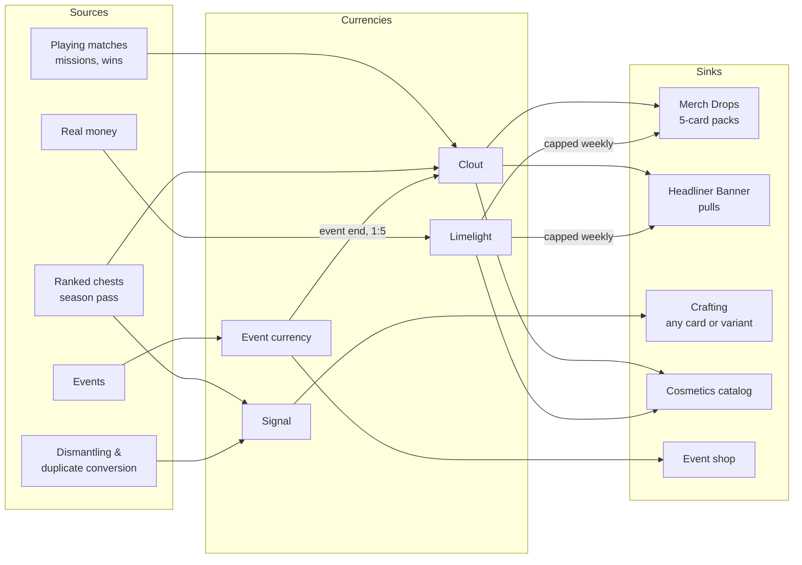
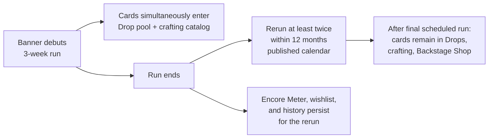

# HYPEBOUND — Economy & Monetization Model

> **Status: Design specification.** Conforms to `00-core-rules.md` (canonical), especially
> §9 (Rarity & Variants) and §10 (Non-negotiable product principles), and to the
> `../tech/00-architecture-contract.md` data-driven mandate. Every tunable number in this
> document lives in `data/balance.json` under the `economy.*` namespace (see Appendix A)
> and in `data/progression.json`. The engine and UI must read these values from data,
> never hardcode them.

The economy exists to serve one sentence from canon: **money buys cosmetics and
time-savers; play buys everything that affects gameplay.** Everything below is an
implementation of that sentence with exact numbers.

---

## 1. Design Pillars

1. **Zero competitive gap.** Every gameplay-affecting card is obtainable through play and
   direct crafting from the day it is released. Cosmetic variants never change rules
   (canon §9: `variantOf` cards share a rules identity).
2. **Cosmetics-first monetization.** The premium catalog is deep in cosmetics (§9 of this
   doc) and shallow in time-savers (capped weekly, §7.4).
3. **Honesty is a feature.** Exact odds, real timers, permanent prices, published pity.
   The forbidden list (§6) is binding policy, not guidance.
4. **Respect for time.** Missions bank, rewards bank, events rerun, nothing punishes
   missing a day. Reliable weekly income is a contract with the player (§3.5).
5. **Generosity compounds trust.** Duplicate protection, wishlists, and pity make every
   pull feel non-wasted. A generous card economy is affordable because cards are not the
   product — cosmetics are.

---

## 2. Currency System

| Currency | Type | Earned by | Spent on | Purchasable with money? |
|---|---|---|---|---|
| **Clout** | Soft currency | Missions, wins, ranked chests, login, season pass, events | Merch Drops (packs), Headliner Banner pulls, select Lo-Fi/HD cosmetics, draft entry | **No** — play only |
| **Limelight** | Premium cosmetic currency | Real-money bundles; small amounts on the free season-pass track (~150/season) | Cosmetics, premium season pass, capped time-savers (Drops/pulls, §7.4) | Yes — flat rate, 100 Limelight per USD $1.00, identical rate in every bundle size (no bulk-bonus spend escalation) |
| **Signal** | Crafting material | Dismantling cards, duplicate conversion, weekly chests, season pass, events | Crafting any card or variant directly (§3.3) | **No** |
| **Event currencies** | Rotating, one per event | Playing that event's content only | That event's shop (event card variants, cosmetics, Drops, Signal) | **No** |

**Naming notes.**
- *Clout* is a flavor wink at the canonical card **Borrowed Clout** (core rules §2); the
  card and the currency have no mechanical relationship.
- *Signal* is lore-tied: crafting material is presented as residual fragments of the
  **First Signal** (see `06-currents-and-lore.md`). Dismantling "releases a card's
  Signal"; crafting "condenses Signal into a card."
- Event currency examples (each event names its own): **Glowsticks** (virtual-concert
  events), **Con Badges** (convention events), **Pixel Pumpkins** (Glitchoween),
  **Marshmallow Reacts** (winter Cozy Stream event).
- **Event currency never expires into nothing:** when an event ends, leftover event
  currency auto-converts to Clout at **1 : 5** (1 token → 5 Clout), logged in the inbox.

---

## 3. Card Acquisition Paths

Five parallel paths; a player may ignore any of them and still complete a collection.

### 3.1 Merch Drops (standard packs)

| Property | Value | balance key |
|---|---|---|
| Price | 100 Clout (or 100 Limelight as a capped time-saver, §7.4) | `economy.pack.price` |
| Cards per Drop | 5, no duplicate card ids within one Drop | `economy.pack.cardsPerPack` |
| Per-card odds | Common 70.0% · Rare 23.5% · Epic 5.0% · Legendary 1.5% | `economy.pack.rates` |
| Floor guarantee | At least 1 Rare-or-better per Drop (slot 5 upgrades if needed) | `economy.pack.minRarePerPack` |
| Legendary pity | A Legendary within every 40 Drops (counter shown on the shop screen) | `economy.pack.legendaryPity` |
| New-set guarantee | A Legendary within your first 10 Drops of each new set | `economy.pack.newSetLegendaryWithin` |
| Animated upgrade | Each card has a 5.0% chance to arrive as its **Animated Premium** variant | `economy.pack.animatedUpgradeChance` |

All odds are printed on the Drop purchase panel itself and on the Probability
Disclosures screen. Per-set Drops exist (e.g., "Launch Set Drop"); odds are identical
across all Drop products.

### 3.2 Headliner Banners

Rotating featured banners with concentrated odds on new/featured cards. Full page
specification in §4. Banner pulls grant one card each; 1× and 10× options.

**No banner exclusivity:** every card that appears on a banner simultaneously enters the
general Drop pool and the crafting catalog on its release day. Banners concentrate odds
and add pity/targeting; they never gate.

### 3.3 Direct crafting (Signal)

Any card — including current banner cards — can be crafted at any time in the Crafting
Workshop. Dismantle value is always **25% of craft cost**, uniformly across rarities.

| Rarity | Craft cost (Signal) | Dismantle value (Signal) |
|---|---|---|
| Common | 40 | 10 |
| Rare | 100 | 25 |
| Epic | 400 | 100 |
| Legendary | 1,600 | 400 |

balance keys: `economy.craftCost.{common,rare,epic,legendary}`,
`economy.dustValue.{common,rare,epic,legendary}` (key names per core rules §9).

**Variant crafting** (cosmetic; same rules identity):

| Variant | Craft cost | Dismantle | balance key |
|---|---|---|---|
| Animated Premium | 4× base craft cost | 4× base dismantle | `economy.variantCraftMultiplier.animated = 4` |
| Alternate Art | 2× base craft cost | 2× base dismantle | `economy.variantCraftMultiplier.altArt = 2` |
| Event Variant | Event shop during event; Archive Shop (§8.3) afterwards; craftable at 2× base one full season after debut | `economy.variantCraftMultiplier.event = 2` |

**Dismantling rules:** any card above your playable cap (2 copies; 1 for Legendary —
core rules §2) can be mass-dismantled with one button ("Dismantle Extras"). Locked or
favorited cards are never auto-dismantled. A full-collection player converts all future
excess automatically at the duplicate-conversion bonus rate (§5, step 6).

### 3.4 Free starter decks (one per faction)

- **Tutorial completion:** choose any faction; receive its complete 30-card starter deck,
  its starter Leader, and 5 Merch Drops.
- **The Grand Tour:** win 1 match (AI Practice counts) with each remaining faction's
  loaner deck to permanently unlock that faction's starter deck. Completing all 10
  grants **1,000 Clout + 10 Merch Drops + 1 Legendary of your choice** from the launch
  set.
- Each starter deck is a fixed, tuned list: 17 Common, 9 Rare, 3 Epic, 1 Legendary,
  plus the faction's starter Leader (Leaders are outside the 30, per core rules §2).
  All 10 starter Leaders are free. Starter lists live in `data/progression.json`.
- Starter decks are legal in every constructed mode and are the baseline used for
  new-player matchmaking pools.

### 3.5 Reliable free weekly income (the contract)

Numbers below are the steady-state weekly income for a player who completes dailies and
weeklies (roughly 30–45 minutes/day). All mission rewards bank (§6, policy F6): dailies
hold up to 3 days of missions; unclaimed Weekly Restock Drops bank for 4 weeks.

| Source | Cadence | Clout | Signal | Merch Drops | Notes |
|---|---|---|---|---|---|
| Daily missions (3 × 50 Clout) | daily, bank 3 days | 1,050 | — | — | rerollable, 1 reroll/day |
| First win of the day | daily | 210 | — | — | 30/day; AI Practice counts at Casual+ difficulty |
| Weekly missions (3 × 200 Clout) | weekly | 600 | — | — | |
| Ranked Weekly Chest | weekly | 100–400 (model: 150) | 20–60 (model: 30) | — | scales with division |
| Login cycle (7-day) | weekly | 100 | 20 | 1 | no streak reset; cycle just continues |
| Weekly Restock | weekly | — | — | 3 | free Drops, claim any time that week |
| Season pass, free track (weekly avg) | seasonal | 190 | 40 | 2 | + ~19 Limelight/week (150/season) |
| **Weekly total (model)** | | **2,300** | **90** | **6** | ≈ 29 Drop-equivalents or ~15 pulls + 6 Drops |

balance keys: `economy.income.*`. Season = 8 weeks; the free pass track totals 1,500
Clout, 16 Drops, 320 Signal, 150 Limelight, plus cosmetics.

### 3.6 Other sources

- **Ranked season rewards:** end-of-season Clout/Signal by peak division + an exclusive
  seasonal cosmetic (returns to the Archive Shop after 2 seasons, §8.3).
- **Achievements:** one-time Clout/Signal/cosmetic grants.
- **Events:** event currency → event shop (includes Drops, Signal, Event Variants).
- **Draft mode:** entry 300 Clout **or** 1 free weekly draft ticket; rewards return at
  least entry value at 3+ wins. Draft entry is never real-money-only.

---

## 4. Headliner Banner — Page Specification

A **Headliner Banner** is a 3-week featured banner ("headliner" as in concert billing)
built around 1 featured Legendary and 2 featured Epics, plus the full standard pool.
Every banner reruns at least twice within 12 months of its debut (published rerun
calendar on the banner page). Pull price: **150 Clout** (`economy.banner.pullPrice`).

### 4.1 Required page elements (maps 1:1 to the REQUIREMENTS brief)

| Brief element | Specification |
|---|---|
| Featured art | Full-bleed banner key art with the featured Legendary; animated if user's motion settings allow |
| Banner name | e.g., "Headliner: The Encore That Never Ends" |
| Duration | Exact local-time end datetime + rerun calendar link. Timers are real (§6, F3) |
| Featured cards | Featured Legendary + 2 featured Epics + 4 spotlighted Rares, each with rate-up figures printed beside them |
| Interactive previews | Tap/click any featured card → full card inspector: rules text, keyword tooltips, Animated Premium preview, Current frame |
| 1-pack & 10-pack options | ×1 Pull (150 Clout) and ×10 Pull (1,500 Clout — exactly 10×, never discounted; §6, F2). The ×10 carries no odds advantage: the Epic-or-better 10-window (§4.2) is a rolling counter shared with ×1 pulls |
| Currency balances | Clout, Limelight, Signal, and Backstage Token balances always visible in the page header |
| Exact probability rates | Full per-rarity and per-card rates table one tap away; headline rates printed directly under the pull buttons (§4.2) |
| Guaranteed-card progress | The **Encore Meter**: "37 / 50 pulls until your Target Card is guaranteed," rendered as a labeled progress bar (never color-only) |
| Opening history | Every pull ever made on this banner (and account-wide): timestamp, result, rarity, conversion outcome. Exportable as JSON |
| Duplicate-conversion details | Panel stating the exact conversion rate (150% of dismantle value, §5) with a worked example |
| First-time rewards | First ×1 pull on each banner is free; first ×10 grants that banner's themed card back (one time, published on the page) |
| Banner rules | Full plain-language rules + link to the Probability Disclosures screen; identical text in-client and on the web |
| Animation skip | Skip / fast / full toggle on the opening sequence, remembered per account (canon: all animations skippable after first view) |
| Wishlist | Up to 10 cards from the banner's full pool; unowned wishlisted cards are selected **first** within their rolled rarity (§5, step 3a) |
| Targeted-card system | **Target Card** + **Backstage Tokens** (§4.3, §4.4) |

### 4.2 Published pull odds (per pull)

| Rarity | Rate | Of which featured |
|---|---|---|
| Legendary | 2.0% | 1.0% featured Legendary / 1.0% all other Legendaries |
| Epic | 8.0% | 4.0% split across the 2 featured Epics / 4.0% others |
| Rare | 30.0% | spotlighted Rares selected first if unowned & wishlisted |
| Common | 60.0% | — |

Rolling guarantees (all counters persist across sessions, ×1/×10, and reruns):
- **Epic-or-better within every 10 pulls** (`economy.banner.epicPityWindow = 10`).
- **Encore Meter hard pity:** your **Target Card** is granted automatically on the 50th
  pull since the meter last reset (`economy.banner.hardPity = 50`). Obtaining the Target
  Card by any means (roll, tokens, crafting) resets the meter and prompts you to pick a
  new Target.

### 4.3 Target Card

On first visit the player selects a **Target Card** — *any* card in the banner pool, not
just the featured Legendary (default: featured Legendary). The Encore Meter counts
toward that specific card. Changing the Target is allowed at any time and keeps the
meter's count (the guarantee applies to whichever Target is set when the meter fills).

### 4.4 Backstage Tokens (targeted-card system)

Every banner pull grants **1 Backstage Token** (account-wide currency, never expires).
The Backstage Shop, embedded in the banner page, sells **any card from any currently
active banner's pool** at fixed prices:

| Rarity | Backstage Tokens |
|---|---|
| Common | 2 |
| Rare | 5 |
| Epic | 15 |
| Legendary | 50 |

This means 50 pulls guarantees the Target Card via pity **and** banks enough tokens to
redeem a second Legendary of choice. This double guarantee is intentional: cards are not
the profit center (§1, pillar 5). balance key: `economy.banner.tokenPrices`.

### 4.5 Banner lifecycle

Nothing a banner offers ever becomes unobtainable: gameplay cards live in Drops and
crafting forever; banner-themed cosmetics enter the Archive Shop (§8.3).

---

## 5. Duplicate Protection Algorithm (binding)

Applies to **every** random card grant: Drop slots, banner pulls, event rewards, random
mission cards. Written here as the normative algorithm; implemented in the economy
module and unit-tested. All rolls use the seeded PRNG (mulberry32, per the architecture
contract); every roll and outcome is appended to the account's opening-history log.
Under the future authoritative server, these rolls execute server-side and the log is
server-signed.

**Definitions.** *Playable cap* = 2 copies (Legendary: 1), per core rules §2. A
collectible identity is the pair *(card id, variant)*; playable copies are counted
across variants of the same rules identity. "Unowned" below means: the player holds
fewer playable copies of the rules identity than the cap.

**Resolution of one random card grant:**

1. **Rarity roll.** Determine rarity from the published table, applying overrides in
   strict priority order: (a) Encore Meter hard pity (banner: grant Target Card,
   skip to step 6), (b) Epic-or-better 10-pull window (banner), (c) Legendary Drop pity
   / new-set guarantee, (d) Rare-or-better Drop floor, (e) base roll.
2. **Pool.** P = all eligible cards of the rolled rarity (the banner pool, or the Drop's
   set pool).
3. **Candidate tiers.** Build the first non-empty tier:
   - (a) *Banner only:* wishlisted ∩ unowned cards in P;
   - (b) unowned cards in P;
   - (c) all of P.
4. **Pick.** Uniform selection from that tier via the seeded PRNG.
5. **Variant roll** (Drops only): 5.0% chance to upgrade the picked card to Animated
   Premium. The upgrade is applied after selection and never worsens the outcome.
6. **Cap check.** If the player is at the playable cap for the picked identity *and*
   tier (b) was empty (i.e., the rarity pool is complete), the card auto-converts to
   Signal at **150% of its dismantle value** (`economy.dupeConversionBonus = 1.5`) —
   e.g., an excess Legendary converts to 600 Signal. Conversion is itemized in the
   opening history and the reveal UI ("Converted: +600 Signal").
7. **Transaction de-duplication.** Within a single ×10 pull or a single 5-card Drop, a
   card id already granted in this transaction is excluded from tiers (a)/(b) selection
   while those tiers still contain other candidates.
8. **Log.** Append `{timestamp, source, rarityRollPath, cardId, variant, converted?,
   signalGained?}` to the history log.

**Consequences (stated so QA can assert them):** a player can never open a useless
duplicate while any unowned card of that rarity exists in the pool; conversion only
occurs at rarity-pool completion and always at a bonus rate; wishlisting strictly
accelerates targeted collection and never reduces stated odds (it only orders the
within-rarity pick).

---

## 6. Forbidden Practices — Binding Policy

These six prohibitions from the owner brief are product law. Violating them is a
ship-blocker, equivalent to a rules-engine correctness bug.

| # | Policy (binding) | Rationale | Enforcement |
|---|---|---|---|
| **F1** | **No hidden probabilities.** Every random grant's exact odds are displayed adjacent to its purchase button and on the Probability Disclosures screen, to the same decimal precision used internally. | Informed consent is the baseline of ethical randomized goods; hidden odds convert play into deception. | Odds are data (`balance.json`); the disclosure UI renders from the same data the roller uses — they cannot diverge. Release checklist verifies parity; odds changes appear in patch notes automatically. |
| **F2** | **No fake discounts.** No strikethrough pricing, no "was/now," no per-player pricing, no limited "sale" framing. ×10 costs exactly 10× the ×1 price. Limelight has one flat exchange rate in every bundle. | Fabricated reference prices manufacture urgency and exploit anchoring; flat pricing makes value legible. | Shop UI has no discount components to render; price fields are single values in data. Any bundle must price at or below the sum of its published parts, permanently. |
| **F3** | **No misleading countdowns.** Timers show real end datetimes in local time. Anything that leaves rotation has a published return schedule (banner reruns, Archive Shop). | Artificial scarcity of digital goods is a pressure mechanic, not a feature. | Every timed offer must reference a rerun/archive entry to pass content validation; UI copy review checklist. |
| **F4** | **No changing odds.** Odds are fixed for a banner/product's lifetime. Any change requires a new, separately named product plus patch-note disclosure. No per-player dynamic odds, no engagement-reactive "luck." The only state-dependent modifiers are the published pity and duplicate-protection rules (§4.2, §5). | Silent odds manipulation is the single fastest way to destroy trust in a randomized economy. | Odds are versioned data; the client displays the data version; automated diff of `economy.*` between releases is posted to patch notes. |
| **F5** | **No real-money-exclusive cards.** Every gameplay-affecting card is obtainable with Clout and craftable with Signal from release day. Money can only buy cosmetics and capped time-savers. | Canon §10: no pay-to-win. A single money-only card invalidates the promise. | Card validator: every collectible card must resolve to a Clout/Signal acquisition path; a card lacking one fails `npm run validate`. |
| **F6** | **No unhealthy-playtime pressure.** No streak resets, no lose-it-if-you-miss-it daily grants, no "play within X hours" mechanics. Dailies bank 3 days; Weekly Restock banks 4 weeks; seasonal catch-up (§8.4) recovers missed progress. Optional session-length reminders in settings. | The game should reward returning, never punish leaving. Retention built on anxiety is a defect. | Mission/reward definitions in data must declare banking windows; a reward with a banking window of zero fails validation. UX review checklist item on every timed feature. |

---

## 7. Spending Controls

### 7.1 Purchase transparency
- Every real-money purchase confirmation shows: item, price in real currency, **running
  30-day spend total**, and current limits.
- Monthly spend receipts summarized in the inbox; email receipts on every transaction.

### 7.2 Limits and cool-downs (defaults; balance keys `economy.spendCaps.*`)
- **Default caps:** USD $25/day and $100/month (or regional equivalents). Purchases
  beyond a cap are blocked, not warned.
- **Raising a cap takes effect after 24 hours; lowering is immediate.** Caps can be set
  to $0 (self-exclusion), with an optional 30/60/90-day lock that cannot be undone
  early.
- **Velocity cool-down:** the third Limelight bundle purchase within any 24-hour window
  triggers a full-screen interstitial showing the 30-day total and requiring typed
  confirmation; there is no "don't show again."
- **No mid-flow top-ups:** if a player lacks Limelight for an item, the shop states the
  shortfall and links to the bundle page — it never auto-selects a bundle or steers to a
  larger one.

### 7.3 Parental controls
- Accounts age-gated at creation. **Minor accounts: real-money purchasing disabled by
  default.** A guardian PIN (separate from login) is required to enable it, set caps
  (guardian caps override account caps and cannot be raised from the child account), and
  view purchase/playtime reports (optional monthly email).
- Guardian receipt emails on every transaction on a minor account, non-optional.

### 7.4 Time-saver cap (pace, not power)
Limelight may buy Merch Drops (100 Limelight) and banner pulls (150 Limelight), capped
at **30 Drops + 30 pulls per account per week** (`economy.spendCaps.weeklyPaidDrops`,
`weeklyPaidPulls`). The cap is displayed in the shop. Rationale: canon permits
time-savers; the cap bounds the pace gap (§10.4 shows the ceiling this creates) and
doubles as a spending brake.

---

## 8. New-Player Catch-Up & Returning Players

### 8.1 New accounts (Week 0–4: "Rookie Road")
- **Welcome grant:** 500 Clout + 300 Signal on account creation.
- **Tutorial:** chosen faction starter deck + starter Leader + 5 Merch Drops.
- **Grand Tour (§3.4):** all 10 starter decks + 1,000 Clout + 10 Drops + 1 choice
  Legendary.
- **Rookie Road boost:** daily missions pay double (100 Clout each) for the account's
  first 28 days ⇒ roughly +4,200 Clout across the first four weeks.
- **New-set pack guarantee** (§3.1) applies per set, so a new player opening the current
  set is guaranteed a Legendary within 10 Drops.

### 8.2 Returning players ("Comeback Stream" — 60+ days absent)
- A 7-login reward chain (logins need not be consecutive; the chain never expires):
  totals **2,000 Clout + 10 Merch Drops + 400 Signal + 1 Front-Row Ticket** (a free
  targeted pull: one banner pull that also advances the Encore Meter by 5).
- **+100% season-pass XP for 14 days** after return.
- Missed seasonal cosmetics from their absence appear in their Archive Shop (§8.3)
  immediately rather than after the standard 2-season delay.

### 8.3 Archive Shop (anti-FOMO backstop)
Every time-limited cosmetic and Event Variant enters the **Archive Shop** 2 seasons
after its debut, purchasable for Clout and/or Limelight at its original tier price.
Ranked and achievement cosmetics arrive with a "Season X" stamp on the original earners'
versions, preserving prestige without permanent exclusivity of the item itself.

### 8.4 Seasonal catch-up
- Season-pass XP +50% during the final 14 days of each 8-week season.
- Missed weekly missions from earlier in the season are retroactively claimable (up to 6
  banked weeklies).
- Events rerun on a published calendar; rerun events restore the player's previous event
  shop progress and stock.

---

## 9. Cosmetics Catalog

Cosmetics are the product. Four cosmetic tiers (distinct from card rarity so shop and
collection filters never collide):

| Tier | Limelight price | Clout price | Notes |
|---|---|---|---|
| **Lo-Fi** | 300 | 2,000 | simple/static items; always also Clout-purchasable |
| **HD** | 800 | 6,000 (selected items) | animated or reactive items |
| **4K** | 1,500 | — | full animation suites, custom SFX |
| **Iconic** | 3,000 | — | flagship items; also earnable via ranked seasons, achievements, and events — never money-only as a class |

All cosmetics are strictly non-gameplay (canon §9) and must pass readability review
(holo effects and alt art may never obscure cost, stats, name, Current badge, or
status icons — core rules §8.2/§5.4).

| Category | Lo-Fi example | HD example | 4K example | Iconic example |
|---|---|---|---|---|
| Card backs | "Buffering…" (spinning throbber) | "Holo Ticket Stub" | "Server Room Rain" | "The First Signal" (lore-animated) |
| Leader skins | palette variant, e.g. "Stage Blacks" | outfit swap, e.g. "Con Crunch Hoodie" | full re-model + intro line, e.g. Gothic Royalty "Funeral Gala" | transformation skin with unique board entrance, e.g. Digital Demons "Kernel Panic" |
| Profile portraits | "Cat With Sunglasses" | "Vaporwave Bust" (parallax) | animated portrait, "Idol Wink Loop" | "Ascended Lurker" (reactive to rank) |
| Emotes | "GG (glitter text)" | "Ratio'd" (stamp animation) | "Crying With Sparkles" (particle burst) | "Touch Grass" (a lawn grows across your leader zone) |
| Battlefields | recolor, "Neon Alley Night" | "Convention Hall Sunday" | "Rooftop Afterparty" (dynamic skyline) | "Grass. Actual Grass." (Touch-Grass Order meadow, reactive weather) |
| Profile frames | "Verified-ish Checkmark" | "Chromed Subscriber Ring" | "Live Chat Cascade" (scrolling frame) | "Algorithm's Chosen" (season leaderboard reward) |
| Intro/victory animations | victory sticker splash | "Stage Dive" intro | "Confetti DDoS" victory | "Encore" (crowd-chant victory, per-faction audio) |
| Alternate art | — (alt art starts at HD) | any card's alt art (800 LL or craft at 2× base Signal) | premium alt art with new flavor text | event-storyline alt art |
| Holo effects | "Prism Foil" finish | "Static Shimmer" | "Chat Scroll" (live-chat holo layer) | "Fracture Glass" (Great Fracture lore finish) |
| Music packs | menu ambience pack "Elevator to the Afterparty" | "Lo-Fi Beats to Lose Ranked To" | "Eurobeat Finale" (dynamic battle set) | faction theme orchestral suite |
| UI themes | "Midnight OLED" | "Terminal Green" / "Bubblegum Pop" | "Golden Age Forum" (skeuomorphic) | "First Signal" (lore theme, reactive accents) |

Cosmetic sinks for Clout and play (ranked seasons, achievements, faction mastery,
events) guarantee free players a steady cosmetic drip too — monetization is
cosmetics-first, not cosmetics-only-for-payers.

---

## 10. Worked Model — 8 Weeks: Free Player vs. Cosmetics Buyer

### 10.1 Assumptions (expected-value model)
- Launch set: **500 collectible cards** — 200 Common / 150 Rare / 100 Epic /
  50 Legendary. Full playset = 200×2 + 150×2 + 100×2 + 50×1 = **950 copies**.
- New account at week 1; completes dailies/weeklies (§3.5) with Rookie Road boost weeks
  1–4 (income 3,350 Clout/wk weeks 1–4; 2,300 Clout/wk weeks 5–8; one-time grants
  +1,500 Clout, +15 Drops, 10 starter decks ≈ 290 unique copies, +11 Legendaries
  including the Grand Tour choice).
- Spending policy: 8 banner pulls/week (1,200 Clout), remainder on Merch Drops.
- Values are expectations from the published odds with pity floors applied; duplicate
  protection (§5) means copies fill the playset with near-zero waste until a rarity pool
  completes, after which conversions accelerate Signal.

### 10.2 Free player, weeks 1–8 (cumulative)

| Week | Clout earned | Drops opened | Banner pulls | Card copies acquired | Playset completion | Legendaries owned | Signal banked |
|---|---|---|---|---|---|---|---|
| 1 | 4,850 | 51 | 8 | 563 | ~52% | 15 | ~390 |
| 2 | 8,200 | 78 | 16 | 706 | ~60% | 17 | ~480 |
| 3 | 11,550 | 105 | 24 | 849 | ~67% | 19 | ~600 |
| 4 | 14,900 | 132 | 32 | 992 | ~73% | 21 | ~900 |
| 5 | 17,200 | 149 | 40 | 1,085 | ~77% | 22 | ~1,400 |
| 6 | 19,500 | 166 | 48 | 1,178 | ~80% | 23 | ~1,900 |
| 7 | 21,800 | 183 | 56 | 1,271 | ~83% | 25 | ~2,450 |
| 8 | 24,100 | 200 | 64 | 1,364 | ~86% | 27 | ~3,000 |

Milestones: commons complete ≈ week 4; rares complete ≈ week 6; week 7 banner hard pity
grants the Target Card (a guaranteed featured Legendary); week 8 Backstage Tokens
(64 banked) redeem a second Legendary of choice; banked Signal crafts 1–2 further
Legendaries (1,600 each) or 6+ Epics on demand. **From week 1 the player fields 2–3
tuned competitive decks (starters + Grand Tour Legendary); by week 8 they can assemble
nearly any meta deck, crafting the last gaps directly.**

### 10.3 Cosmetics buyer (same play pattern + USD $25/month)

$25/month ⇒ 2,500 Limelight in weeks 1 and 5 (+150 free-track Limelight/season).

| Week | Playset completion (buyer) | Playset completion (free) | Cosmetics acquired (cumulative) |
|---|---|---|---|
| 1 | ~52% | ~52% | Premium season pass (950 LL) |
| 2 | ~60% | ~60% | + "Funeral Gala" leader skin, 4K (1,500 LL) |
| 4 | ~73% | ~73% | + premium-track cosmetics as pass levels unlock |
| 5 | ~77% | ~77% | + "Rooftop Afterparty" battlefield, 4K (1,500 LL) |
| 6 | ~80% | ~80% | + "Ratio'd" emote, HD (800 LL) |
| 8 | ~86% | ~86% | + "Buffering…" card back, Lo-Fi (300 LL) — total spent ≈ 5,050 LL |

**The card columns are identical by construction.** Limelight spent on cosmetics touches
no acquisition system; cosmetic variants share rules identities (canon §9); matchmaking
never reads purchase data. The competitive gap is exactly zero.

### 10.4 The time-saver ceiling (worst case, for completeness)
A player who additionally buys the weekly time-saver cap (30 Drops + 30 pulls/week,
§7.4) completes the full playset around weeks 6–8 versus roughly weeks 14–16 for the
free player above. That is the entire purchasable advantage: **weeks of pace toward a
ceiling both players reach**, with every individual card craftable by the free player
on demand (§3.3) the moment it matters to them. No purchasable item exceeds the
ceiling, and ranked deck-legality is identical for both players on day one.

---

## Appendix A — `balance.json` economy keys (authoritative list)

| Key | Value |
|---|---|
| `economy.craftCost.{common,rare,epic,legendary}` | 40 / 100 / 400 / 1600 |
| `economy.dustValue.{common,rare,epic,legendary}` | 10 / 25 / 100 / 400 |
| `economy.variantCraftMultiplier.{animated,altArt,event}` | 4 / 2 / 2 |
| `economy.dupeConversionBonus` | 1.5 |
| `economy.pack.price` | 100 |
| `economy.pack.cardsPerPack` | 5 |
| `economy.pack.rates.{common,rare,epic,legendary}` | 0.70 / 0.235 / 0.05 / 0.015 |
| `economy.pack.minRarePerPack` | 1 |
| `economy.pack.legendaryPity` | 40 |
| `economy.pack.newSetLegendaryWithin` | 10 |
| `economy.pack.animatedUpgradeChance` | 0.05 |
| `economy.banner.pullPrice` | 150 |
| `economy.banner.rates.{common,rare,epic,legendary}` | 0.60 / 0.30 / 0.08 / 0.02 |
| `economy.banner.featuredLegendaryShare` | 0.5 |
| `economy.banner.epicPityWindow` | 10 |
| `economy.banner.hardPity` | 50 |
| `economy.banner.tokenPrices.{common,rare,epic,legendary}` | 2 / 5 / 15 / 50 |
| `economy.banner.wishlistSize` | 10 |
| `economy.banner.runWeeks` / `rerunsPerYearMin` | 3 / 2 |
| `economy.eventCurrencyClout` | 5 |
| `economy.income.dailyMission` / `dailyMissionRookie` | 50 / 100 |
| `economy.income.firstWin` | 30 |
| `economy.income.weeklyMission` | 200 |
| `economy.income.weeklyRestockDrops` | 3 |
| `economy.spendCaps.weeklyPaidDrops` / `weeklyPaidPulls` | 30 / 30 |
| `economy.spendCaps.defaultDailyUSD` / `defaultMonthlyUSD` | 25 / 100 |
| `economy.limelightPerUSD` | 100 |
| `economy.cosmetics.tierPricesLimelight.{lofi,hd,fourK,iconic}` | 300 / 800 / 1500 / 3000 |

Cross-references: rules & rarity — `00-core-rules.md` (§2, §9, §10); faction starter
themes — `04-faction-guide.md`; card templating for Event Variants —
`05-keyword-glossary.md`; Signal/First Signal lore — `06-currents-and-lore.md`;
data-driven + determinism requirements — `../tech/00-architecture-contract.md`; future
server-authoritative rolls — `../tech/03-multiplayer-architecture.md`; original brief —
`../REQUIREMENTS.md`.
