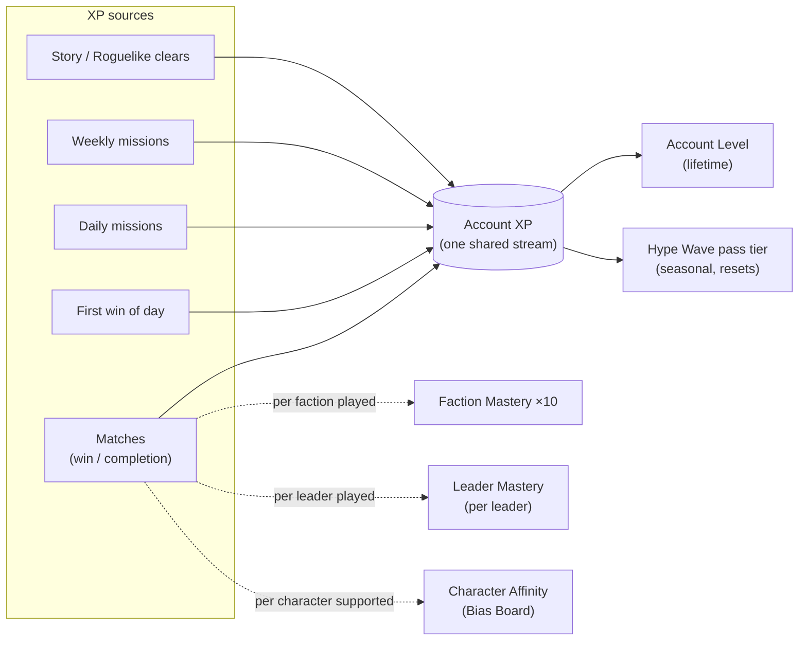

# HYPEBOUND — Progression Model

> Companion to the canonical rules in [`00-core-rules.md`](./00-core-rules.md) and the
> technical contract in [`../tech/00-architecture-contract.md`](../tech/00-architecture-contract.md).
> All tunable numbers in this document live in `data/progression.json` and
> `data/missions.json` — the client reads them from data, never hardcodes them.
> Currency definitions, pack pricing, and crafting rates are owned by the economy
> model ([`07-economy.md`](./07-economy.md)); this document assumes the currency
> names **Clout** (soft, earned by play), **Glimmer** (premium, cosmetics-first),
> and **Fragments** (crafting material), and a standard pack price of ~1,000 Clout.
> If the economy doc diverges, its values win and reward amounts here are re-scaled.

---

## 1. Overview & Principles

Progression in HYPEBOUND exists to do four things, in priority order:

1. **Reward variety.** The systems pay out most when you rotate factions, Currents,
   leaders, and modes — never for repeating one deck.
2. **Respect time.** All targets are reachable at ~40 minutes of play per day
   *averaged*, with zero requirement to play daily. Nothing resets, decays, or is
   permanently lost by taking a break.
3. **Feed the collection fairly.** Gameplay-affecting rewards (cards, packs,
   wildcards) sit exclusively on free, play-earned tracks, per the no-pay-to-win
   principle (core rules §10).
4. **Tell the joke.** Progression is where the Obsession theme becomes meta: the
   game tracks *your* parasocial attachment to its characters — and rewards it
   with cosmetics and lore, never power.

### System map

One XP stream feeds both the lifetime **Account Level** and the seasonal
**Hype Wave** battle pass simultaneously — there are never two competing XP
currencies to optimize. Faction Mastery, Leader Mastery, and Character Affinity
are parallel trackers fed automatically by normal play.

---

## 2. XP Model

### 2.1 XP sources (canonical amounts)

| Source | XP | Notes | `progression.json` key |
|---|---:|---|---|
| Match completion | 50 | Any mode; vs human or vs AI **Intermediate+** | `xp.matchComplete` |
| Match win bonus | +50 | Same conditions | `xp.matchWin` |
| Match vs Beginner/Casual AI | 60% of above (30 / +30) | Keeps easy-AI play rewarding without being farmable | `xp.easyAiMultiplier` |
| First win of the day | 200 | Any faction, any mode | `xp.firstWinOfDay` |
| Fresh Faction bonus | +100 each | First win of the day with a *2nd* and *3rd distinct faction* (max +200/day) | `xp.freshFactionBonus` |
| Daily mission | 300 | Plus 40 Clout | `missions.daily.xp` |
| Weekly mission | 1,000 | Plus 150 Clout | `missions.weekly.xp` |
| Roguelike node cleared | 40 / 60 / 100 | Normal / Elite / Boss | `xp.roguelike.*` |
| Roguelike run completed | 300 | Win or credited loss at final boss | `xp.roguelikeRun` |
| Story chapter, first clear | 150 | Replays: 30 | `xp.storyFirst`, `xp.storyReplay` |
| Draft/arena match | Standard match XP | Plus draft's own run rewards (economy doc) | — |

**Daily soft cap:** after your **10th completed match** of the day, match
completion + win XP are halved (25 / +25). Mission progress, mastery, and
affinity are unaffected. This deliberately makes hour three of a session worth
far less than hour one — sessions end because the game stops paying, not because
the player runs out of willpower. Resets at the daily reset.

**Resets:** daily reset **09:00 UTC**; weekly reset **Monday 09:00 UTC**;
seasons start on a Monday and run **10 weeks (70 days)**.

### 2.2 Reference session

Average match length is ~8 minutes (core rules target 5–12), so a 40-minute
session is ~5 matches; a 70-minute session is ~8. At a 50% winrate a match
averages **75 XP**. These constants are used for every calibration table below.

---

## 3. Account Level (lifetime)

Account Level is the permanent, never-resetting spine of progression. It gates
early feature onboarding, then becomes a steady drip of currency and prestige.

### 3.1 Curve

| Level range | XP per level | Cumulative at band end |
|---|---:|---:|
| 1 → 10 | 500 | 4,500 |
| 10 → 20 | 1,000 | 14,500 |
| 20 → 30 | 1,500 | 29,500 |
| 30 → 40 | 2,000 | 49,500 |
| 40 → 50 | 2,500 | 74,500 |
| 50 → 60 | 3,000 | 104,500 |
| 60+ (**Legacy Levels**) | 3,000 each, endless | — |

A player at the reference pace (~8,300 XP/week, §10.4) reaches level 60 in
roughly 13 weeks. Each Legacy Level grants 100 Clout + 20 Fragments; every 10th
Legacy Level upgrades the animated **Legacy Frame** (I → X) on the player profile.

### 3.2 Rewards by band

| Levels | Per-level rewards | Milestone rewards |
|---|---|---|
| 1–10 | 100 Clout per level; **starter decks**: 2 chosen at onboarding, remaining 8 granted at levels 3, 5, 7, 9, 11, 13, 15, 17 (all 10 factions playable by L17) | **L5:** Ranked unlock · **L8:** Draft unlock + deck slot · **L10:** 2 packs + 200 Glimmer |
| 11–20 | Alternating 150 Clout / 1 pack | **L16:** deck slot · **L20:** pick 1-of-3 Epic + "Rising Star" profile frame |
| 21–30 | Alternating 200 Clout / 1 pack | **L24:** deck slot · **L30:** **Legendary Wildcard** (craft any Legendary free) |
| 31–40 | Alternating 200 Clout / 1 pack | **L32:** deck slot · **L40:** Animated Premium variant of any owned card |
| 41–50 | Alternating 250 Clout / 1 pack | **L48:** deck slot · **L50:** Golden profile frame + 500 Glimmer |
| 51–60 | Alternating 300 Clout / 1 pack | **L60:** title **"Terminally Levelled"** + animated card back *First Signal* |

> **Starter decks: this table and `07-economy-and-monetization.md` §3.4 disagree,
> and §3.4 is what shipped.** The row above grants 2 decks at onboarding and the
> other 8 by level; §3.4 grants **1** at onboarding and the other 9 through **the
> Grand Tour** — win a match with each faction's loaner deck. They cannot both be
> true, and §3.4 is the more specific of the two: it fixes the list composition
> and names `data/progression.json`, which is the file the game reads. The
> level-band rewards in this table are otherwise unaffected. Resolve the two docs
> properly before building the account-level reward track.

Feature unlocks (deck slots: 4 base, +1 at L8/16/24/32/40/48 = 10 total; mode
gates: puzzles L4, ranked L5, roguelike L6, weekly modifier L7, draft L8,
tournaments L20) are the canonical gating list; mode behavior itself is defined
in [`03-game-modes.md`](./03-game-modes.md).

---

## 4. Faction Mastery

One track per faction (10 tracks). **Faction Mastery XP = the match XP
(completion + win) you earn while playing that faction's leader.** Missions and
bonuses do not count — mastery measures matches actually played.

### 4.1 Curve — 20 ranks per faction

| Ranks | XP per rank | Band total | ~Matches (75 XP avg) |
|---|---:|---:|---:|
| 1 → 5 | 400 | 1,600 | ~21 |
| 5 → 10 | 800 | 4,000 | ~53 |
| 10 → 15 | 1,200 | 6,000 | ~80 |
| 15 → 20 | 1,600 | 8,000 | ~107 |
| **Total** | | **19,600** | **~261** |

The curve is deliberately **front-loaded**: ranks 1–10 contain *all* card-value
rewards and cost only 29% of the track's XP. Sampling a new faction for a dozen
matches is reward-dense; ranks 11–20 are cosmetic prestige for people in love.

### 4.2 Rewards (identical structure per faction)

| Rank | Reward |
|---|---|
| 1 | Faction lore page I + 100 Clout |
| 2 | 1 Faction Pack (5 cards, all from this faction) |
| 3 | Pick 1 of 3 faction Commons (2 copies) |
| 4 | 150 Clout |
| 5 | **Faction card back** + 1 Faction Pack |
| 6 | Pick 1 of 3 faction Rares (2 copies) |
| 7 | 150 Clout + lore page II |
| 8 | 1 Faction Pack |
| 9 | Pick 1 of 3 faction Rares (2 copies) |
| 10 | **Leader alt portrait** + 1 Faction Pack + 100 Fragments |
| 11 | 200 Clout |
| 12 | Faction emote I |
| 13 | 200 Clout + lore page III |
| 14 | 1 Faction Pack |
| 15 | Faction emote set II + 150 Fragments |
| 16 | 250 Clout |
| 17 | 1 Faction Pack |
| 18 | **Golden faction crest** profile frame |
| 19 | 300 Clout + lore page IV |
| 20 | **Faction title** (§13) + Animated Premium variant voucher for one owned faction Legendary |

Faction visual identities and lore content per rank: [`04-faction-guide.md`](./04-faction-guide.md)
and [`06-currents-and-lore.md`](./06-currents-and-lore.md).

---

## 5. Leader Mastery

One track per **Leader** (leaders per faction defined in the faction guide).
Leader Mastery XP = match XP earned with that specific leader. Rewards are
**purely cosmetic and lore** — faction mastery already carries the card value,
so trying a new leader never feels like abandoning card progression.

### 5.1 Curve — 10 levels per leader

| Levels | XP per level | Band total | ~Matches |
|---|---:|---:|---:|
| 2–4 | 300 | 900 | ~12 |
| 5–7 | 600 | 1,800 | ~24 |
| 8–10 | 1,200 | 3,600 | ~48 |
| **Total** | | **6,300** | **~84** |

### 5.2 Rewards

| Level | Reward |
|---|---|
| 2 | Leader lore chapter 1 |
| 3 | Leader emote |
| 4 | Lore chapter 2 + alternate intro voice line |
| 5 | Alternate static portrait |
| 6 | Lore chapter 3 |
| 7 | Intro animation variant |
| 8 | Lore chapter 4 — the "origin file" |
| 9 | Animated portrait |
| 10 | Title **"Voice of ⟨Leader⟩"** + **Chromatic** leader skin (holo recolor) |

---

## 6. Character Affinity — the Bias Board

The meta-joke of the Obsession system: the game keeps a per-character record of
*your* devotion. Every Character card has an **Affinity** track visible in the
character gallery ("**Bias Board**"). Rewards are **strictly cosmetic + lore** —
affinity must never create a gameplay reason to warp deckbuilding.

### 6.1 Earning Affinity Points (AP)

| Action | AP |
|---|---:|
| Play the character | 2 |
| **Support** it — buff, heal, shield, or equip (same verbs as Obsession gain, core rules §3.2) | 1 |
| Its **Parasocial** keyword triggers | 1 |
| Win a match in which you played it | 3 |
| **Cap per character per match** | **15** |

The per-match cap makes affinity a long-term relationship, not a farm: spreading
love across a roster progresses many tracks at once.

### 6.2 Tiers & rewards (per character)

| Tier | Name | AP | Reward |
|---|---|---:|---|
| 1 | **Noticed** | 50 | Character lore page + designer flavor commentary |
| 2 | **Regular** | 150 | Voice-line playback unlocked in gallery |
| 3 | **Superfan** | 400 | Profile badge with the character's portrait |
| 4 | **Devoted** | 900 | Signature emote featuring the character |
| 5 | **Parasocial** | 1,800 | Animated Premium variant of the character + dynamic title **"⟨Character⟩'s #1 Fan"** + hidden lore file: *what they actually think of you* |

The tier-5 hidden lore file is the punchline of the whole system: a short,
in-character, gently devastating note about parasocial distance. Comedy with a
conscience — and a collection-wide meta-badge (**"Gallery of Devotion"**: reach
tier 3 with 30 characters) for completionists.

---

## 7. Daily Missions

- **3 active slots.** One new mission is issued at daily reset (09:00 UTC) if
  fewer than 3 are held. New accounts start with 3.
- **Missions bank — they never expire.** Skipping days loses nothing; you simply
  hold up to 3. This is the primary "no daily pressure" mechanism.
- **Reroll:** 1 free reroll per day; replaces a chosen mission with a different
  random pool entry. Rerolls do not accumulate.
- **Reward:** every daily = **300 XP + 40 Clout**, completable within 1–3
  matches of natural play, in any mode, vs humans or any AI difficulty.
- **Slot constraint:** at most one faction- or Current-specific mission held at
  a time; Current-specific dailies always name *two* acceptable Currents.

### 7.1 Daily pool (18 canonical entries in `missions.json`)

| # | Name | Objective |
|---|---|---|
| 1 | Go Live | Complete 2 matches |
| 2 | Feed the Algorithm | Play 20 cards |
| 3 | Ratio'd | Defeat 8 enemy characters |
| 4 | Reply Guy Duty | Support friendly characters 6 times (buff, heal, shield, or equip) |
| 5 | Main Character Moment | Deal 15 damage to enemy leaders |
| 6 | Touch Some Grass | Win 1 match with a deck whose Primary Current is Root or Gale |
| 7 | Channel Surfing | Complete matches with 2 different factions |
| 8 | Weather Report | Activate 2 Confluences |
| 9 | Type Advantage Discourse | Deal elemental bonus damage 5 times |
| 10 | Parasocial Hours | Gain 8 Obsession in total |
| 11 | Lore Drop | Use Leader Fixation abilities 3 times |
| 12 | Doomscroll | Draw 15 cards |
| 13 | On Brand | Play 6 cards of the same Current in a single match |
| 14 | Fit Check | Play 3 Equipment cards |
| 15 | Certified Banger | Play 3 cards that cost (6) or more |
| 16 | Clip Farming | Win 1 match in any mode |
| 17 | Group Chat Healer | Restore 10 Health to friendly characters or your leader |
| 18 | Scheduled Content | Trigger 4 Afterparty effects |

Roughly two-thirds of the pool is deck-agnostic; the rest nudges variety
(different factions, specific Currents, Equipment, Confluences) — see §14.

---

## 8. Weekly Missions

- **3 issued every Monday 09:00 UTC.** Unfinished weeklies persist **one extra
  week** (max 6 active) — a single missed week loses nothing.
- **Reroll:** 1 free weekly reroll.
- **Reward:** each weekly = **1,000 XP + 150 Clout**.
- **Weekly Wrap:** completing all 3 of a week's missions grants **1 standard
  card pack** (no extra XP, so pass math stays honest).

### 8.1 Weekly pool (10 canonical entries)

| # | Name | Objective |
|---|---|---|
| 1 | Variety Streamer | Win 4 matches using at least 2 different factions |
| 2 | Current Events | Win matches with decks of 3 different Primary Currents |
| 3 | Mode Hopper | Complete 5 matches across 2 different game modes |
| 4 | Deep Lore | Clear 3 story or roguelike encounters |
| 5 | Signal Boost | Activate 6 Confluences, **or** trigger Perfect Resonance twice |
| 6 | Damage Control | Apply Cancelled 5 times, **or** remove 6 negative statuses from friendly characters |
| 7 | Patch Notes | Win 2 matches with a deck you created or edited this week |
| 8 | Crowd Work | Defeat 25 enemy characters |
| 9 | Understudy Arc | Win 3 matches with a Leader below Leader Mastery level 5 |
| 10 | Second Bias | Win 3 matches with a faction below Faction Mastery rank 10 |

Weeklies are the heaviest single XP source (§10.4) and are *explicitly* variety
missions — 7 of 10 pool entries require touching more than one deck, mode,
faction, or Current.

---

## 9. Achievements

One-time objectives with points (10 / 25 / 50), Clout, and — for the memorable
ones — titles (§13). Achievement point milestones grant profile frames at
**250 / 500 / 1,000** points. Categories:

| Category | Internal name | Theme |
|---|---|---|
| Combat | *Highlight Reel* | In-match feats |
| Collection | *The Hoard* | Owning, crafting, variants |
| Mastery | *The Grindset* | Lifetime totals, levels, mastery |
| Currents & Confluences | *Weather* | Elemental system engagement |
| Modes | *Tourist* | Draft, roguelike, story, bosses |
| Social | *Community* | Friends, spectating, guilds |
| Hidden | *Deep Cuts* | Absurd discoveries; revealed on unlock |

### 9.1 Twenty canonical examples

| # | Name | Category | Requirement | Reward (pts) |
|---|---|---|---|---|
| 1 | We Did It, Chat! | Combat | Win your first match | 100 Clout (10) |
| 2 | Chronically Online | Mastery | Complete 500 matches | Title (25) |
| 3 | Down Catastrophically | Combat | Trigger Full Fixation (Obsession 10) | 150 Clout (25) |
| 4 | Log Off Speedrun | Combat | Banish 25 characters with Touch Grass effects | Title "Certified Grass Toucher" (25) |
| 5 | Untouched, Unbothered | Combat | Win a match with your leader at full health | 200 Clout (25) |
| 6 | Running on Vibes | Combat | Win a match while in Burnout (empty deck) | 150 Clout (25) |
| 7 | Sold-Out Show | Combat | Win with 6 friendly characters on board | 100 Clout (10) |
| 8 | Ratio'd Into Orbit | Combat | Deal 12+ damage to the enemy leader in one turn | 150 Clout (25) |
| 9 | Well, Actually— | Combat | Trigger 50 of your set Reactions | 150 Clout (25) |
| 10 | Weather Machine | Currents | Activate all 9 Confluences (lifetime) | Title "Stormfront" (25) |
| 11 | Pitch Perfect Signal | Currents | Trigger Perfect Resonance 10 times | 200 Clout (25) |
| 12 | Type Chart Understander | Currents | Deal 250 total elemental bonus damage | 150 Clout (25) |
| 13 | Multifandom Menace | Mastery | Win a match with all 10 factions | Title (50) |
| 14 | Whale-Free Since Day One | Collection | Craft your first Legendary | 100 Fragments (10) |
| 15 | Digital Dragon | Collection | Own 300 distinct cards | "Hoard" profile frame (50) |
| 16 | Closet Cosplayer | Collection | Own 20 cosmetic variants | Profile badge (25) |
| 17 | Speedran the Grindset | Modes | Complete a full roguelike run | 200 Clout (25) |
| 18 | Content Slayer | Modes | Defeat a Boss AI encounter | 150 Clout (25) |
| 19 | Front Row Seat | Social | Spectate a friend's full match | 50 Clout (10) |
| 20 | 404: Board Not Found | Hidden | Win a match having defeated zero enemy characters | 200 Clout (25) |

---

## 10. Seasonal Battle Pass — the Hype Wave

### 10.1 Structure

| Property | Value |
|---|---|
| Name | **Hype Wave** (season-themed; e.g., *Season 1: First Upload*) |
| Length | 10 weeks, aligned with the ranked season |
| Tiers | **50**, each costing **1,000 XP** (flat) → **50,000 XP** total |
| Tracks | **Free** (everyone) + **Backstage Pass** (premium, **cosmetic-only**) |
| Backstage Pass price | 1,000 Glimmer; purchasable at any time, rewards for already-earned tiers granted instantly (retro-claim) |
| Post-50 | **Encore tiers**: every additional 1,000 XP grants 50 Clout, endless |
| XP feed | The single account XP stream (§2). No separate pass currency. |

Because gameplay content must be free, **all cards, packs, wildcards, and
Glimmer sit on the free track.** The Backstage Pass contains only cosmetics.

### 10.2 Free track rewards

Every tier pays something (no dead tiers): non-milestone tiers grant **75 Clout**.

| Tier | Milestone reward |
|---|---|
| 1 | Seasonal card back (base version) |
| 5 | 1 pack |
| 10 | 1 pack + 100 Fragments |
| 15 | Seasonal emote |
| 20 | 1 pack + 100 Glimmer |
| 25 | Pick 1 of 3 Rares (2 copies) |
| 30 | 1 pack + 100 Glimmer |
| 35 | Seasonal Event Variant of a featured card (cosmetic, rules-identical) |
| 40 | 1 pack + 100 Glimmer |
| 45 | Pick 1 of 3 Epics |
| 50 | Seasonal title + animated upgrade of the tier-1 card back + 100 Glimmer |

Free-track totals per season: 5 packs, 400 Glimmer, ~3,000 Clout, 100 Fragments,
2 pick-vouchers, 3 cosmetics. With monthly login Glimmer (§11), a free player
banks ~500–650 Glimmer per season — a Backstage Pass roughly every other season
without spending, by design.

### 10.3 Backstage Pass rewards (cosmetic only)

| Tier | Reward |
|---|---|
| 1 | Seasonal leader skin (base) |
| 5, 15, 45 | 100 Glimmer each (300 total — pass partially self-funds the next one) |
| 10 | Seasonal battlefield |
| 20 | Seasonal emote set |
| 25 | Animated profile portrait |
| 30 | Seasonal music pack |
| 35 | Seasonal profile frame |
| 40 | Alternate-art variant of a featured Legendary |
| 50 | **Evolved leader skin** (animated) + 200 Glimmer |
| Other tiers | 30 Glimmer-equivalent cosmetic shards / minor cosmetics (poses, card-back tints) |

Seasonal cosmetics are **not permanently exclusive**: everything returns to the
shop at standard prices two seasons later (the "Rerun Vault"), satisfying the
event-rerun requirement and killing FOMO as a sales lever.

### 10.4 XP math — the pass completes at ~40 min/day average, no daily play required

Constants: 75 XP per match average (50% winrate), ~8-minute matches, dailies
bank to 3, weeklies persist a grace week.

| Player model | Schedule | Matches XP /wk | First-win /wk | Dailies /wk | Weeklies /wk | **Total /wk** | Tier 50 reached |
|---|---|---:|---:|---:|---:|---:|---|
| **The Regular** | 4 sessions × 70 min (**= 40 min/day avg**) | 32 × 75 = 2,400 | 4 × 200 = 800 | 7 × 300 = 2,100 | 3 × 1,000 = 3,000 | **8,300** | **Week 7 of 10** |
| The Casual | 3 sessions × 60 min (~26 min/day avg) | 21 × 75 = 1,575 | 600 | 2,100 | 2 × 1,000 = 2,000 | **6,275** | Week 8 of 10 |
| The Lurker | 2 sessions × 60 min (~17 min/day avg) | 14 × 75 = 1,050 | 400 | 6 × 300 = 1,800 | 1–2 × 1,000 = 1,500 | **4,750** | Week 10, via Wave Rebound (§10.5) |

Observations the design depends on:

- The Regular finishes **3 weeks early** playing 4 days a week — daily play is
  never required, and 40 min/day average carries ~40% slack.
- **Missions, not raw playtime, dominate**: for the Regular, 61% of weekly XP is
  bounded mission objectives. Doubling playtime does *not* double progress —
  binging is structurally unrewarding (reinforced by the §2.1 daily soft cap).
- Fresh Faction bonuses (up to +200 XP/day) are deliberately **excluded** from
  these baselines; they are pure upside for variety players.

### 10.5 Catch-up mechanics

1. **Wave Rebound (automatic):** the pass has a *pace line* = tier 5 × completed
   season weeks. While your tier is below the pace line, all pass progress is
   earned at **+50%**. Any player averaging ≥3,400 XP/week — roughly two relaxed
   evenings — mathematically finishes tier 50 by season end
   (3,400 × 1.5 × 10 = 51,000 ≥ 50,000).
2. **Mission banking:** dailies bank to 3 and never expire; weeklies persist one
   grace week (§7, §8).
3. **Archive Pass (no expiry, ever):** when a season ends, an unfinished Hype
   Wave converts to an **Archive Pass**: it keeps progressing at 50% of all XP
   you earn (the current season's pass gets 100%) until tier 50. The Backstage
   Pass can be bought — and retro-claimed — on an Archive Pass at any time.
4. **Welcome Back package:** after 14+ days away — 3 pre-banked dailies, one
   bonus weekly slot for 2 weeks, 300 Clout, and Wave Rebound forced on for one
   week regardless of pace.
5. **Tier skips** (100 Glimmer/tier) exist as a time-saver, consistent with core
   rules §10 — never surfaced with urgency messaging.

### 10.6 No-unhealthy-pressure rules (binding)

1. No login streaks anywhere in the game; skipping days never resets or forfeits anything.
2. Daily missions bank; weekly missions carry a grace week; the pass itself never expires (Archive Pass).
3. Match XP diminishes after 10 matches/day — long sessions are structurally de-incentivized.
4. Pass pacing UI shows a calm state ("ahead / on pace / Rebound active"), never countdown-panic framing, never "last chance!" copy. Countdown timers appear only as factual dates.
5. All seasonal cosmetics return via the Rerun Vault after 2 seasons; nothing is permanently missable.
6. No reward requires playing at a specific time of day or on specific days.
7. An optional session reminder ("you've been live for 3 hours — hydrate") is on by default, dismissible, configurable in settings.
8. The pass is completable comfortably below 40 min/day average (§10.4) and this calibration is a release-blocking test on `data/progression.json` values.

---

## 11. Login Rewards — Stream Check-In

Each calendar month has a **10-step check-in track**. Each day you log in claims
the next step. **No streaks, no resets, no consecutive-day requirements** — a
player who logs in 6 scattered days simply claims 6 steps. The track does not
carry between months (amounts are small; the monthly cosmetic returns via the
Rerun Vault).

| Step | Reward |
|---|---|
| 1 | 50 Clout |
| 2 | 20 Fragments |
| 3 | 100 Clout |
| 4 | 2 daily-mission reroll tokens |
| 5 | 1 standard pack |
| 6 | 100 Clout |
| 7 | 30 Fragments |
| 8 | 150 Clout |
| 9 | 50 Glimmer |
| 10 | Monthly rotating cosmetic (card back or emote) |

---

## 12. Ranked Season Rewards

Ranked divisions (ladder mechanics, MMR, placement, and rank floors are
specified in [`03-game-modes.md`](./03-game-modes.md)):
**Lurker → Poster → Trending → Viral → Icon → Main Character** (each with
sub-ranks IV–I; Main Character is the leaderboard tier). Rewards are granted at
season end based on the **highest division reached** — rank floors mean climbing
is never punished at reward time.

| Highest division | Clout | Packs | Cosmetics & titles |
|---|---:|---:|---|
| Lurker | 200 | 1 | — |
| Poster | 400 | 2 | — |
| Trending | 700 | 3 | Seasonal ranked card back |
| Viral | 1,000 | 4 | + Seasonal ranked emote |
| Icon | 1,400 | 5 | + Animated ranked card back + seasonal title **"Season ⟨N⟩ Icon"** |
| Main Character | 2,000 | 6 | + Animated leader portrait frame + title **"Main Character S⟨N⟩"** + permanent leaderboard archive entry |

Ranked rewards stack with (never replace) Hype Wave and mission income. Per core
rules §10, nothing here is purchasable.

---

## 13. Titles

One title may be equipped; it appears on the player profile, match intro, and
leaderboards. Titles are text-only, localized via `i18n`, and purely cosmetic.

| Title | Source |
|---|---|
| Terminally Levelled | Account level 60 |
| Chronically Online | Achievement: 500 matches |
| Multifandom Menace | Achievement: win with all 10 factions |
| Certified Grass Toucher | Achievement: Log Off Speedrun |
| Stormfront | Achievement: all 9 Confluences |
| Season ⟨N⟩ Icon / Main Character S⟨N⟩ | Ranked (§12) |
| Voice of ⟨Leader⟩ | Leader Mastery 10 (dynamic per leader) |
| ⟨Character⟩'s #1 Fan | Character Affinity tier 5 (dynamic per character) |
| Center Stage | Neon Idols mastery 20 |
| Eternal Mourner | Gothic Royalty mastery 20 |
| Certified Trendsetter | Viral Influencers mastery 20 |
| Chief Hype Officer | Corporate Creators mastery 20 |
| Cursed Hardware | Digital Demons mastery 20 |
| Best in Show | Cosplay Champions mastery 20 |
| Sees the Sunrise | Afterparty Crew mastery 20 |
| Actually Went Outside | Touch-Grass Order mastery 20 |
| The Recommendation | Algorithm Syndicate mastery 20 |
| Living Meme | Meme Collective mastery 20 |
| Hype Wave seasonal titles | Pass tier 50 (per season, e.g. "First Uploader") |
| Event titles | Limited-time events ([`03-game-modes.md`](./03-game-modes.md)); rerun with their events |

---

## 14. Designed for Experimentation, Not Grind

Every system above contains a specific anti-monodeck mechanism. Collected here
as binding design constraints:

| Mechanism | Where | Effect |
|---|---|---|
| Fresh Faction bonus (+100 XP × 2/day) | §2.1 | The single most XP-efficient act each day is winning with a *different* faction |
| Daily soft cap after 10 matches | §2.1 | Repetition yields diminishing returns; variety objectives don't |
| Mission pool weighting | §7, §8 | ≥1/3 of dailies and 7/10 weeklies require varied factions, Currents, modes, or fresh decks ("Understudy Arc", "Second Bias", "Patch Notes") |
| Front-loaded faction mastery | §4.1 | First 10 ranks = 29% of the XP but 100% of the card value — sampling factions is reward-dense, maining one is prestige-only |
| Leader mastery is cosmetic | §5 | Switching leaders never costs card progression |
| Affinity per-match cap (15 AP) | §6.1 | Devotion spreads across a roster instead of farming one character |
| Breadth achievements | §9 | "Multifandom Menace", "Weather Machine", mode achievements pay for touring the whole game |
| Missions > playtime in pass math | §10.4 | 61% of reference weekly XP is bounded objectives; hours grinded ≠ tiers gained |

The intended emergent behavior: the optimal player and the healthy player are
the same person — someone playing varied decks in medium sessions, several days
a week.

---

## 15. Data & Implementation Notes

- **`data/progression.json`** — account curve and band rewards (`accountCurve`),
  faction mastery (`factionMastery`), leader mastery (`leaderMastery`), affinity
  tiers and AP rules (`affinity`), pass definition (`pass.tiers[]`,
  `pass.xpPerTier`, `pass.catchUpMultiplier`, `pass.paceTiersPerWeek`,
  `pass.archiveRate`), login track (`login`), ranked rewards (`rankedRewards`),
  XP source values (`xp.*`), titles (`titles[]`).
- **`data/missions.json`** — `daily {slots: 3, issuePerDay: 1, rerollPerDay: 1,
  xp: 300, clout: 40, pool[]}`, `weekly {issued: 3, graceWeeks: 1, rerollPerWeek: 1,
  xp: 1000, clout: 150, wrapReward, pool[]}`, `achievements[]`. Mission
  objectives are declarative counters over **EngineEvent** types (e.g.
  `DamageDealt` with `elementalBonus > 0`, `ConfluenceActivated`,
  `StatusApplied: cancelled`) — adding a mission of an existing counter type
  requires zero engine changes, per the architecture contract.
- Progress state persists via `src/save/` (versioned envelope); mission counters
  update from the same redacted event stream the UI consumes — the progression
  module never re-derives rules outcomes.
- All player-facing strings (mission names, titles, tier names) route through
  `i18n.t()`.
- Tests: pass-completion calibration (§10.4 models asserted against
  `progression.json`), Wave Rebound math, mission counter mapping for every
  pool entry, affinity cap enforcement, and reward-table totals (e.g. free-track
  Glimmer = 400) are covered in `tests/`.
