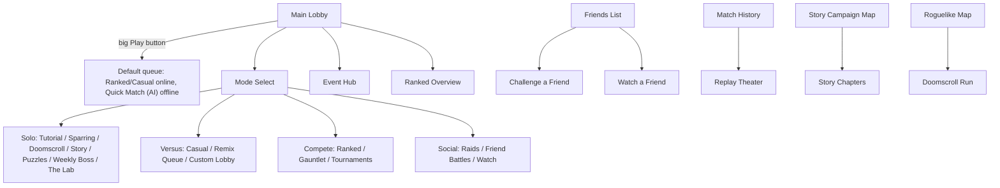
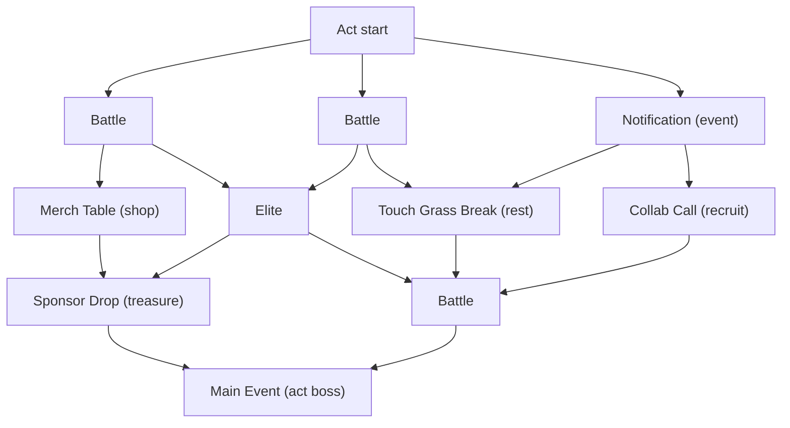

# HYPEBOUND — Game Modes

> Status: Design specification. Subordinate to `./00-core-rules.md` (rules canon)
> and `../tech/00-architecture-contract.md` (tech canon). Where this document
> gives numbers, they are initial defaults and live in data
> (`data/balance.json`, `data/missions.json`, `data/events.json`,
> `data/roguelike.json`) — never hardcoded.

This document specifies every game mode: its rules, rewards, entry points, and
whether it ships **offline-now** (playable against the local deterministic
engine + AI with no server) or **online-later** (requires the authoritative
server specced in `../tech/03-multiplayer-architecture.md`). Per the
architecture contract, online-later modes appear in the mode list labeled
**"Coming Online"** — they are never stubbed with fake lobbies.

---

## 1. Mode Directory

| # | Mode | Display name | Players | Ship status | Primary entry point |
|---|---|---|---|---|---|
| 2 | Interactive tutorial | **First Stream** | 1 (scripted) | Offline-now | Onboarding; Mode Select → Solo |
| 3 | AI practice | **Sparring** | 1 vs AI | Offline-now | Mode Select → Solo |
| 4 | Offline AI matches | **Quick Match (AI)** | 1 vs AI | Offline-now | Lobby Play button (default pre-server) |
| 5 | Training sandbox | **The Lab** | 1 (controls both) | Offline-now | Mode Select → Solo; Deck Builder "Test" |
| 6 | Casual constructed | **Casual** | 1v1 | Online-later | Lobby Play button; Mode Select → Versus |
| 7 | Ranked ladder | **Ranked: The Climb** | 1v1 | Online-later | Lobby Play button; Ranked Overview screen |
| 8 | Draft / arena | **The Gauntlet** | 1v1 (drafted) | Hybrid (practice offline-now; competitive online-later) | Mode Select → Compete |
| 9 | Roguelike campaign | **Doomscroll** | 1 (PvE) | Offline-now | Mode Select → Solo; Roguelike map screen |
| 10 | Story chapters | **Story: Terminally Online** | 1 (PvE) | Offline-now | Story campaign map screen |
| 11 | Daily challenges | **The Daily Grind** | 1 (PvE) | Offline-now (server-verified later) | Lobby daily widget; Daily Missions screen |
| 12 | Weekly rule modifiers | **Remix Queue** | 1v1 / 1 vs AI | Hybrid (vs AI now; PvP queue later) | Mode Select → Versus |
| 13 | Puzzle battles | **Puzzle Rush** | 1 (scripted) | Offline-now | Mode Select → Solo |
| 14 | Limited-time events | **Event Hub** | varies | Online-later (PvE reruns archived offline) | Event Hub screen; lobby carousel |
| 15 | Boss battles | **Weekly Boss** | 1 vs Boss AI | Offline-now (rotation server-synced later) | Mode Select → Solo; Event Hub |
| 16 | Co-op raids | **Raids: Server Meltdown** | 2 vs Boss AI | Online-later (AI-partner rehearsal ships with it) | Mode Select → Social |
| 17 | Custom matches | **Custom Lobby** | 1v1 / vs AI / hotseat | Hybrid (vs AI + hotseat now; online lobbies later) | Mode Select → Versus |
| 18 | Friend battles | **Challenge a Friend** | 1v1 | Online-later | Friends list; player profile |
| 19 | Tournament mode | **Tournaments** | 4–16 | Online-later | Mode Select → Compete; Guild screen |
| 20 | Spectator mode | **Watch** | observers | Online-later | Friends list; Tournament bracket |
| 21 | Match replays | **Replay Theater** | 1 (viewer) | Offline-now (sharing online-later) | Match History; Player Profile |

All mode display names are i18n keys (`modes.<id>.name`); the names above are
the `en` strings.

### 1.1 Navigation map



### 1.2 Mode-scoped rule overrides

The canonical match structure in `./00-core-rules.md` §2 governs all
constructed play (Casual, Ranked, Friend Battles, Tournaments). PvE and special
modes may override specific values via `createMatch(config)` — these are
**mode configurations, not rules changes**, and each override is listed in the
mode's section below. The engine reads every override from data; canonical
defaults are untouched. Overrides never appear in Ranked or Casual.

### 1.3 Reward currencies (defaults; economy model doc is authoritative)

| Currency | Name | Earned by | Spent on |
|---|---|---|---|
| Soft currency | **Clout** | All modes, missions | Packs, Gauntlet entry, cosmetics |
| Crafting material | **Static** | Dismantling, mode rewards | Direct crafting (`economy.craftCost`) |
| Draft token | **Gauntlet Ticket** | Gauntlet win rewards, events, battle pass | One Gauntlet entry |
| Account XP | **Fame XP** | All modes | Account level, battle pass |

No mode ever rewards gameplay power that cannot also be obtained by crafting —
per the non-negotiable no-pay-to-win principle, and its corollary: no
mode-exclusive uncraftable gameplay cards.

---

## 2. Interactive Tutorial — "First Stream"

A scripted seven-stage onboarding, playable in ~15 minutes total. Each stage is
a deterministic scripted encounter: fixed seed, fixed hands, fixed opponent
script, turn timer off, UI elements revealed progressively (the HUD literally
gains widgets stage by stage). The player's guide is **Nova Encore**, a retired
virtual idol turned mentor (an original archetype; her story continues in
`./11-story-campaign.md`).

### 2.1 Exact lesson sequence

| Stage | Title | Teaches | Unlocked HUD elements |
|---|---|---|---|
| 1 | **Log On** | Hype resource, playing cards, end turn | Hand, Hype crystals, End Turn |
| 2 | **Pick a Fight** | Attacking, summoning sickness, simultaneous combat, trading | Health orbs, targeting arrow, damage preview |
| 3 | **The Bodyguard** | Spotlight (forced attack targeting), protecting key characters | Status icons, board-slot highlights |
| 4 | **Know Your Currents** | Currents advantage cycle, +1 damage bonus, damage preview reading | Current badges, advantage indicator |
| 5 | **Crossover Episode** | Confluences: two-Current requirement, once per turn, rules preview | Confluence button |
| 6 | **Down Bad** | Obsession gain (support + Parasocial), Fixation, Obsessed danger at 8+, Full Fixation at 10 | Obsession meter, Fixation buttons |
| 7 | **Graduation Stream** | Mulligan, Reactions (setting face-down), full match vs Beginner AI | Full battle HUD, history rail, emotes |

### 2.2 Scripted beats per stage

**Stage 1 — Log On.** Opponent is "Practice Bot v0.9" (does nothing but pass).
Turn 1: player's hand contains exactly one playable 1-cost 2/1 Character; the
UI spotlights it and the board slot. Turn 2: Hype crystal grows to 2 —
Nova calls it out ("Hype climbs every turn — turn number equals your Max
Hype, capped at 10"). Player plays a 2-cost card. Turn 3: player has 3 Hype and
two 1-cost cards + one 3-cost card; the lesson is *spend it all or lose it*.
Stage ends when the board holds three friendly characters.

**Stage 2 — Pick a Fight.** Opponent leader at 8 health, plays one 2/3
Character on its first turn. Beats: (a) attack with a character into the enemy
leader — observe leaders deal no counter-damage; (b) freshly played character
cannot attack (summoning-sickness tooltip); (c) trade a 3/2 into the 2/3 —
both die, simultaneous combat explained; (d) finish the leader. Win = lesson
complete.

**Stage 3 — The Bodyguard.** The opponent plays a 1/4 with **Spotlight**; the
player's attack arrows visibly refuse the leader until the Spotlight character
dies. Then the mirror lesson: the player is given a Spotlight 0/5 wall and a
fragile 4/1 finisher, and survives one scripted enemy attack wave because the
wall soaks it. Win by protecting the 4/1 to turn 4.

**Stage 4 — Know Your Currents.** The advantage wheel (Cinder→Gale→Root→
Pulse→Tide→Cinder; Halo↔Veil; Prism neutral) is shown as an inspectable
overlay. Scripted board: the enemy has a 0/3 Root wall with Spotlight; the
player holds a Gale 2/1 (kills it only via the +1 bonus: 2+1=3) and a Cinder
3/2 (would kill it without teaching anything — if the player attacks with
Cinder first, Nova rewinds the turn once and explains why the order loses).
Damage previews with the elemental bonus called out ("2 +1 Current bonus")
are mandatory reading here. Finish: lethal on a Tide leader using a Pulse
damage Action (+1 shown in preview).

**Stage 5 — Crossover Episode.** Player's deck is dual-Current Gale/Pulse.
Beats: play a Gale card, then a Pulse card — the **Tempest** Confluence button
lights up with both symbols and its rules preview; activate it, choose "a
friendly character may attack again" for lethal. Nova states the constraint:
*one Confluence per player per turn* and points at the in-match Confluence
reference panel.

**Stage 6 — Down Bad.** Player leader is tutorial-only "Seraph Online" (Halo)
with Fixation *"Heal a character 2"* (3 Obsession) and Ultimate Fixation
*"Grand Finale: deal 5 damage to the enemy leader"* (7 Obsession). Beats:
(a) buff a friendly character → +1 Obsession (support), and it has
**Parasocial** → another +1 and +1/+1; (b) reach 3, use Fixation; (c) scripted
mid-stage pushes the player to 8 — the meter turns warning-red, the HUD shows
"+1 damage taken from all enemy sources," and a scripted enemy attack visibly
deals the bonus point; (d) reach 10 → **Full Fixation** banner, Ultimate is
free this turn; use it for the scripted win; meter resets to 5. The lesson
line: "the deeper you go, the harder you hit — and the harder you get hit."

**Stage 7 — Graduation Stream.** First real match: Beginner AI
(`ai-profiles.json`), a 30-card starter deck, full rules. New micro-lessons
embedded: the mulligan screen (Nova recommends tossing 4+ cost cards), and
setting one **Reaction** face-down with an explanation that it triggers by
itself. Losing is fine — the stage completes on match end either way, with an
encouraging loss line and an offered rematch.

### 2.3 Rules, rewards, entry, status

- **Rules:** scripted deterministic encounters; timer off; concede hidden in
  stages 1–6; rewind offered once per taught mistake.
- **Rewards:** stages 1–6: 100 Clout each. Stage 7: choice of 2 free starter
  decks (of 10 faction starters — all eventually free per the economy model),
  the "Day One" card back, 3 card packs, and the title **Fresh Poster**.
  Skipping the tutorial (allowed after account creation) grants all tutorial
  rewards immediately — skipping is never punished.
- **Entry points:** auto-launched from onboarding after account creation;
  replayable from Mode Select → Solo → First Stream.
- **Ship status:** Offline-now.

---

## 3. AI Practice — "Sparring"

Deliberate practice against a chosen AI difficulty with full control over the
matchup.

- **Rules:** canonical constructed rules. Player picks: their deck, the AI
  difficulty (Beginner / Casual / Intermediate / Advanced / Expert — Boss AI is
  reserved for boss modes), the AI's deck (any of the 10 faction stock decks, a
  copy of one of the player's decks, or "Surprise me" = seeded random stock
  deck). Optional toggles: turn timer off (default off), show AI's reasoning
  hints (Beginner–Casual only; the AI's chosen intent is annotated — a
  learning tool).
- **Rewards:** 20 Clout + 20 Fame XP per win vs Beginner/Casual, 30 vs
  Intermediate+, capped at 200 Clout/day from AI play (`missions.aiDailyCap`).
  Daily missions progress normally. First win vs each difficulty tier: 100
  Clout one-time.
- **Entry points:** Mode Select → Solo → Sparring; Deck Builder → "Test this
  deck" (jumps straight in with the open deck).
- **Ship status:** Offline-now.

## 4. Offline AI Matches — "Quick Match (AI)"

The zero-friction "just play" mode, and the lobby Play button's target until
the server exists (afterward it remains the offline fallback whenever no
connection is available — the game never dead-ends offline).

- **Rules:** canonical constructed rules, 75 s turn timer on (to mirror real
  match pacing), AI difficulty auto-scaled to the player's recent AI win rate
  (target ~55% player win rate; scaling state stored in the save profile).
- **Rewards:** same schedule and daily cap as Sparring (shared cap). Rewards
  earned offline accrue locally and reconcile with the server on next login
  once accounts go online (versioned save envelope per the architecture
  contract).
- **Entry points:** lobby Play button (pre-server / offline); Mode Select →
  Solo.
- **Ship status:** Offline-now.

## 5. Training Sandbox — "The Lab"

A free-form deterministic scenario editor for learning, content creation, and
combo verification.

- **Rules:** the player controls both seats. Editor powers: spawn any card to
  any zone, set Hype/Obsession/health/statuses on either side, set the RNG
  seed, toggle "reveal all hidden info," step backward/forward through the
  intent log (undo = re-simulation from seed, per the deterministic engine),
  and save/load scenarios as JSON (`{seedState, setupOps[]}`). Scenario files
  are shareable text — the puzzle team authors Puzzle Rush content with this
  exact format.
- **Rewards:** none (no economy hooks; prevents farming).
- **Entry points:** Mode Select → Solo → The Lab; Deck Builder → "Open in
  Lab"; Collection card detail → "Try in Lab."
- **Ship status:** Offline-now.

---

## 6. Casual Constructed — "Casual"

- **Rules:** canonical constructed rules, exactly as `./00-core-rules.md` §2.
  Matchmaking uses a hidden casual MMR (same Glicko-2 machinery as Ranked,
  separate rating). New accounts (<20 casual games) match within a newcomer
  pool when possible. Concede any time; no rank at stake.
- **Rewards:** 40 Clout + 40 Fame XP per win, 15 Clout per loss (participation
  floor requires ≥6 turns played — an anti-farming gate). Daily/weekly
  missions progress. First casual win of the day: +60 Clout.
- **Entry points:** lobby Play button (mode toggle Ranked/Casual persists);
  Mode Select → Versus.
- **Ship status:** Online-later. Until then the tile reads "Coming Online" and
  deep-links to Quick Match (AI).

---

## 7. Ranked Ladder — "The Climb"

The competitive seasonal ladder. Seasons last **8 weeks** and are named
(Season 1: *Season of the First Signal*). All ranked rewards are cosmetic or
currency — never gameplay power.

### 7.1 Division structure — internet fame tiers

Eight tiers themed as the arc of internet fame. Tiers 1–7 contain Divisions
IV → III → II → I (climbing order). Promotion requires filling the division's
**Fame Stars**; each win = +1 star, each loss = −1 star (where losable).

| Tier (low → high) | Divisions | Stars per division | Star loss on defeat? | Win-streak bonus (+1 star on 3+ streak) |
|---|---|---|---|---|
| 1. **Lurker** | IV–I | 3 | No | Yes |
| 2. **Poster** | IV–I | 3 | Yes | Yes |
| 3. **Streamer** | IV–I | 3 | Yes | Yes |
| 4. **Trending** | IV–I | 4 | Yes | Yes |
| 5. **Verified** | IV–I | 4 | Yes | Yes |
| 6. **Viral** | IV–I | 5 | Yes | No |
| 7. **Icon** | IV–I | 5 | Yes | No |
| 8. **Main Character** | — (open ladder) | — (MMR-ordered) | — | — |

**Main Character** is the apex: stars end and players are ranked purely by
MMR, displayed as "Main Character #N" globally and per region.

### 7.2 Placement matches

- Ranked unlocks at account level 10 (see anti-smurfing, §7.8).
- **10 placement matches** before a visible rank is assigned. During
  placements the player sees "Placement 4/10," not a division.
- Placement seeding: initial hidden MMR = casual MMR if ≥20 casual games exist,
  else 1500. Placements run at high rating-deviation (fast movement).
- After match 10, the visible rank is assigned from final MMR percentile,
  clamped between **Lurker IV** and **Verified IV** (nobody places above
  Verified IV; strong players climb fast via accelerated stars instead).

### 7.3 MMR model

- **Glicko-2** per queue (ranked, casual, gauntlet): initial rating 1500,
  rating deviation 350, volatility 0.06, τ = 0.5, floor 100. Ratings update
  per match (not batched) for responsiveness.
- Visible stars and hidden MMR are linked by an **accelerated climb** rule: if
  hidden MMR exceeds the midpoint MMR of the player's current division by
  more than 300, wins grant double stars (this is the primary smurf-drain and
  returning-player catch-up mechanism).
- Matchmaking: opponents within ±150 MMR, widening to ±400 after 90 seconds
  in queue. Tier is cosmetic to the matchmaker — MMR decides opponents, which
  prevents low-tier stomping by mis-ranked accounts.

### 7.4 Rank floors & protection

- **Tier floors:** the first time a player enters any tier in a season, that
  tier's Division IV becomes a floor — they cannot demote to the previous
  tier for the rest of the season.
- **Damage Control:** at 0 stars in a division, the first loss is absorbed
  (one shield per division per climb; the shield icon is visible on the rank
  widget).
- **Lurker** never loses stars at all (new-player protection).
- Main Character cannot demote to Icon within a season.

### 7.5 Seasonal soft reset

At season rollover:

- Hidden MMR compresses toward center: `new = 1500 + (old − 1500) × 0.5`.
- Visible rank resets by table (no re-placements after the first season; the
  10-match placement flow is first-season / new-account only):

| Peak tier last season | Season start rank |
|---|---|
| Lurker | Lurker IV |
| Poster | Lurker II |
| Streamer | Poster III |
| Trending | Streamer II |
| Verified | Trending IV |
| Viral | Trending II |
| Icon | Verified III |
| Main Character | Verified I |

- Because reset players carry high MMR, accelerated climb (double stars)
  returns them to their true tier quickly while seeding early-season ladder
  activity.

### 7.6 Seasonal cosmetic rewards

Granted at season end based on **peak** rank (never current — no end-of-season
anxiety grinding):

| Peak | Rewards |
|---|---|
| Poster | Seasonal card back |
| Streamer | + 300 Clout, seasonal emote |
| Trending | + 500 Clout, seasonal alternate-art card (cosmetic variant, `variantOf`) |
| Verified | + 800 Clout, animated seasonal card back, title **Verified (Season N)** |
| Viral | + 1,200 Clout, seasonal profile frame |
| Icon | + 1,600 Clout, seasonal leader-skin variant |
| Main Character | + 2,000 Clout, exclusive animated card back, title **Main Character (Season N)** |
| Top 100 finish | Unique profile frame + leaderboard title **Algorithm's Chosen (Season N)** |

Every reward is cosmetic or currency; nothing here grants gameplay advantage.

### 7.7 Leaderboards & per-deck statistics

- **Leaderboards:** global + regional Main Character top 500 (name, leader
  portrait, faction, win count), friends leaderboard (all tiers), guild
  leaderboard. Updated near-real-time; a "Streamer Mode" client setting hides
  the player's own name from opponents and boards (anti-sniping, streamer
  safety).
- **Per-deck statistics** (visible in Deck Builder and the Statistics
  Dashboard; stored locally now, server-synced later): games, wins, win rate;
  win rate by opponent faction and by opponent Current pair; play/draw win
  rates; average match length (turns and minutes); per-card stats (win rate
  when played, average turn played, mulligan rate); average peak Obsession;
  Confluence activation rate. The deck-compare view diffs these between deck
  versions.

### 7.8 Anti-smurfing

1. Ranked requires account level 10 **and** tutorial completion.
2. Placement seeds from casual MMR — an account that stomped casual starts
   ranked high.
3. High initial rating-deviation + accelerated climb move outliers to their
   true MMR within ~15 games.
4. Matchmaking is MMR-based, not tier-based — a smurf's *opponents* are strong
   even while its badge is low.
5. Anomaly flag: >80% win rate over the last 25 games while below Trending
   priority-matches the account against other flagged accounts.
6. Account clustering heuristics (shared device/payment/network fingerprints,
   per privacy policy) escalate repeat "fresh account" patterns to
   enforcement under the ToS. Detection details stay server-side and
   unpublished.

### 7.9 Anti-cheat (server-authoritative)

The engine's design is the anti-cheat foundation (see
`../tech/03-multiplayer-architecture.md`):

- **Server-authoritative simulation:** the server runs the deterministic
  engine; clients only send `PlayerIntent`s. A modified client cannot change
  rules outcomes — the server's reducer is the truth.
- **Redacted views:** clients receive only `redact(state, seat)` — the
  opponent's hand, deck order, and face-down Reactions are *never on the
  wire*. Information-revealing hacks have nothing to reveal.
- **Intent validation:** every intent passes the same legality checks
  (`intents.ts`) server-side; illegal intents are rejected and logged. Repeat
  illegal intents (impossible from an unmodified client) auto-flag the
  account.
- **Authoritative timing:** turn timers run on the server; clients cannot
  stall or fast-forward.
- **Replay audit:** every ranked match stores `MatchRecord {seed, decks,
  intents[]}`; any match can be re-simulated and reviewed. Reports attach the
  replay automatically to the moderation queue.
- **Behavioral detection:** bot cadence analysis (inhumanly uniform decision
  timing), win-trading/collusion graph analysis (repeat pairings with
  alternating outcomes, queue-time synchronization), and disconnect-abuse
  tracking.
- **Penalties:** escalating — warning → ranked suspension → season
  disqualification → account ban. Leavers/AFK: loss + escalating queue
  cooldowns (5 min → 30 min → 24 h within a rolling week).

### 7.10 Reconnection flow

```mermaid
sequenceDiagram
  participant C as Client
  participant S as Server
  C--xS: Connection lost
  S->>S: Mark seat disconnected; hold match 90 s
  S->>S: If it is that player's turn: pause rope once per player per match (45 s "Buffer Shield")
  C->>S: Reconnect (auth token + matchId)
  S->>C: Redacted state snapshot + EngineEvent backlog since last acked event
  C->>C: Presenter fast-forwards backlog in instant mode
  C->>S: Resume sending intents
  Note over S: No reconnect within 90 s OR 2 fully missed turns → auto-concede
```

- The Buffer Shield fires once per player per match; later disconnects let the
  timer run.
- The opponent sees a "Connection unstable" indicator on the enemy portrait —
  never the player's network details.
- Auto-concede counts as a loss with Damage Control still applicable; repeat
  disconnect-at-loss patterns feed the disconnect-abuse tracker.

### 7.11 Rules, rewards, entry, status summary

- **Rules:** canonical constructed rules; deck must pass validation; one deck
  change allowed between matches, not during.
- **Per-match rewards:** 50 Clout + 50 Fame XP per win, 20 Clout per loss
  (≥6-turn floor); missions progress; seasonal rewards per §7.6.
- **Entry points:** lobby Play button (Ranked toggle), Ranked Overview screen
  (shows division, stars, floor, shield, MMR-based "climb pace" hint, season
  timer, reward track).
- **Ship status:** Online-later.

---

## 8. Draft / Arena — "The Gauntlet"

Build a deck one pick at a time, then ride it until 12 wins or 3 losses.

### 8.1 Pick structure

1. **Leader pick:** choose 1 of 3 offered Leaders (seeded from different
   factions). The Leader fixes the run's faction and Primary/Secondary
   Currents exactly as in constructed (canon §8.6).
2. **Card picks:** 30 picks; each pick offers 3 cards. The drafted deck is
   exactly 30 cards.
3. **Offer constraints (canon-derived):**
   - Every offered card is legal for the Leader: its faction or Neutral, and
     its Current is the Leader's Primary or Secondary — except Prism cards,
     which may be offered until 3 have been picked (the canonical splash
     limit), after which Prism stops appearing.
   - Offer buckets by pick number: picks 1, 10, 20, 30 are **Spotlight
     Picks** (Rare 55% / Epic 35% / Legendary 10%); all other picks are
     Common 60% / Rare 30% / Epic 9% / Legendary 1%.
   - Each pick's 3 cards are distinct; curve assist softly weights offers
     toward cost gaps in the current draft (never overriding rarity buckets).
4. **Mode-scoped override:** the constructed copy limits (2 / 1 Legendary) do
   **not** apply in Gauntlet — you may draft duplicates if offers allow.
   Flagged in the mode rules panel.
5. Drafting pulls from the full card pool regardless of the player's
   collection — Gauntlet is collection-independent by design (new-player
   friendly, skill-forward).

### 8.2 Run structure

- Play until **12 wins or 3 losses**, then the run retires and pays out.
- Matchmaking: by current run record first (wins bracket), then Gauntlet MMR.
- One free full-deck re-draft ("Delete and Repost") before the first match.
- A run can be retired early for the current reward row.

### 8.3 Entry & reward curve

Entry: **150 Clout** or **1 Gauntlet Ticket**. Rewards are cumulative rows
(you receive the row matching your final win count):

| Wins | Clout | Packs | Static | Ticket | Extra |
|---|---|---|---|---|---|
| 0 | 20 | — | — | — | — |
| 1 | 40 | — | — | — | — |
| 2 | 70 | 1 | — | — | — |
| 3 | 110 | 1 | — | — | — |
| 4 | 150 | 1 | 20 | — | — |
| 5 | 175 | 1 | 40 | — | — |
| 6 | 200 | 2 | 40 | — | — |
| 7 | 225 | 2 | 60 | 1 | — |
| 8 | 250 | 2 | 80 | 1 | — |
| 9 | 275 | 3 | 100 | 1 | — |
| 10 | 300 | 3 | 150 | 1 | Gauntlet card-back progress +1 |
| 11 | 350 | 3 | 200 | 1 | Gauntlet card-back progress +1 |
| 12 | 400 | 4 | 250 | 1 | Title **Perfect Run**; animated Gauntlet card back (first time) |

Break-even sits near 3 wins (~50% win rate); the curve rewards skill without
gatekeeping — a 0-win run still pays something and all payouts are
currency/cosmetics.

### 8.4 Gauntlet Practice (offline)

The identical draft flow against escalating AI (Casual → Advanced as wins
accumulate). Free entry, reduced rewards (25% of the table, packs excluded,
shared with the AI daily cap). Ships now; retires nothing when competitive
Gauntlet arrives — it remains the rehearsal space.

- **Entry points:** Mode Select → Compete → The Gauntlet.
- **Ship status:** Hybrid — Gauntlet Practice offline-now; competitive
  Gauntlet online-later.

---

## 9. Roguelike Campaign — "Doomscroll"

A run-based single-player campaign: descend the infinite Feed with a small
temporary deck, grow it through branching choices, and unseat faction bosses
whose fights bend the rules. Content lives in `data/roguelike.json`
(nodes, events, artifacts, recruits, bosses, modifiers).

### 9.1 Run setup

- Pick a **Leader** from the Doomscroll roster (2 unlocked initially; the rest
  unlock via meta-progression — variety, not power).
- Receive that leader's **temporary starting deck: 15 cards** (10 faction
  staples + 5 leader-signature cards; 3 alternate starting decks per leader
  unlock later). Mode-scoped overrides: deck size floats (15 + everything you
  add, no cap), copy limits off, and recruits may break faction/Current deck
  rules (Doomscroll is explicitly "deck rules off the leash" PvE).
- Leader health 30, **persistent across battles**; defeat ends the run.
- A visible **run seed** (copyable/enterable). Same seed + same choices ⇒ same
  map, events, shops, offers, and battles — the deterministic engine
  guarantees it (`rng.ts`); seeded runs make runs plannable and shareable.

### 9.2 Map structure

Three acts ("Feeds"), each a branching node map of 7 floors with 2–4 nodes per
floor; choose one node per floor, edges limit reachable next nodes. Act ends
in a boss.

- **Act 1 — The Shallow End** (boss pool: Viral Influencers, Meme Collective,
  Neon Idols)
- **Act 2 — The Trending Depths** (boss pool: Cosplay Champions, Afterparty
  Crew, Algorithm Syndicate, Corporate Creators)
- **Act 3 — The Dead Internet** (boss pool: Gothic Royalty, Digital Demons,
  Touch-Grass Order)
- **Act 4 — The First Signal (optional true finale):** unlocked in a run by
  collecting 3 **Signal Fragments** (one from each act's Elite pool); a single
  Prism superboss fight tied to the Great Fracture lore
  (`./06-currents-and-lore.md`).



### 9.3 Node types

| Node | Name | Frequency (act 1/2/3) | Content |
|---|---|---|---|
| Battle | **Battle** | 45% / 40% / 40% | Normal fight vs themed AI deck; reward: pick 1 of 3 cards + 15–30 Clout |
| Elite | **Elite** | 10% / 15% / 18% | Harder fight (Advanced/Expert AI, +5 enemy leader health, pre-set enemy board); guaranteed **artifact** + card pick; may hold a Signal Fragment |
| Event | **Notification** | 20% / 20% / 15% | Narrative choice event (see §9.7) |
| Shop | **Merch Table** | 10% / 10% / 10% | Spend run-Clout: cards (40–80), card **removal** (50, +25 each reuse), one artifact (150), one upgrade (75) |
| Rest | **Touch Grass Break** | 10% / 10% / 12% | Choose one: heal 10; **upgrade** a card; remove a card |
| Recruit | **Collab Call** | 5% / 5% / 5% | Add 1 of 3 unique **recruit** characters (any faction, run-only, non-removable, pre-upgraded) |
| Treasure | **Sponsor Drop** | fixed 1/act | Free artifact or 100 Clout, plus a rare cosmetic drop chance |

Run-Clout earned inside a run converts 10:1 to account Clout at run end.

### 9.4 Temporary cards & upgrades

- All cards gained in a run are **temporary** — they exist only inside the
  run (the collection is untouched; Doomscroll never grants collection
  cards directly).
- Every card has exactly one **upgrade** ("Remastered," distinct frame trim),
  defined per card in data: one of cost −1 (min 0), +1/+1 (characters),
  effect-number +1, or an added keyword (e.g., a Gale character gains
  Rushwind). Upgrades apply at Rest nodes, shops, and some events.

### 9.5 Artifacts (passive run-wide relics) — 15 concrete examples

| Artifact | Effect |
|---|---|
| **Ring Light of Focus** | Your Fixation costs 2 Obsession instead of 3. |
| **Stolen Verified Checkmark** | The first Character you play each battle gains Spotlight. |
| **Ergonomic Throne** | +5 maximum leader health this run. |
| **Pocket Hotspot** | You have +1 Hype on your first turn of each battle. |
| **Ancient Meme Grimoire** | Your Viral copies cost (2) less instead of (1) less (minimum 0). |
| **Unskippable Ad** | The first card the enemy plays each battle costs (1) more. |
| **Merch Cannon** | At the end of your turn, deal 1 damage to a random enemy character. |
| **Collector's Sleeves** | Your opening hand each battle contains 1 additional card. |
| **Do Not Disturb Sigil** | Burnout (fatigue) damage against you is always 1. |
| **Sponsored Hydration Bot** | Heal your leader 4 after each battle victory. |
| **Golden Play Button** | Merch Table prices are reduced 25%. |
| **Clip of Your Lowest Moment** | The first time your leader would be defeated this run, survive at 1 health instead. Then this artifact breaks. |
| **The Algorithm's Favor** | At the start of each battle, look at the top 3 cards of your deck and put them back in any order. |
| **Foam Finger of the True Fan** | Your Parasocial triggers grant +2/+2 instead of +1/+1. |
| **Off-Brand Energy Drink** | Your Ultimate Fixation costs 6 Obsession instead of 7. |

Artifacts are visible on the run HUD with tooltips; stacking is additive and
deterministic; ~40 artifacts at launch, pool grows via meta-progression
unlocks (variety).

### 9.6 Recruits

Run-only Legendary-frame characters with a "Collab" tag, drawn from any
faction — e.g. **Moss, Off-Grid Oracle** (Touch-Grass Order, 3-cost 2/5,
"Afterparty: remove 1 Obsession from the enemy") joining a Digital Demons run.
Recruits cannot be removed or duplicated, and each recruit appears at most
once per run. 12 recruits at launch.

### 9.7 Notification events & narrative decisions

Choice-driven vignettes with mechanical consequences, written in the game's
comedic register; ~35 at launch. Examples:

- **"Reply Guy at the Gates"** — A devoted superfan wants to join your
  entourage. *Accept*: gain a 1-cost 1/1 with Parasocial and gain 2 Obsession.
  *Block*: remove a card from your deck. *Leave on read*: +40 run-Clout.
- **"Sponsorship Offer (Suspicious)"** — *Sign*: +150 run-Clout, but a cursed
  **Contractual Obligation** card (2-cost, does nothing) joins your deck.
  *Refuse*: nothing. *Negotiate* (requires Corporate leader): +150 with no
  downside.
- **"The Old Forum"** — a three-node chain across acts: preserve or delete a
  dying community; the act-3 payoff is an artifact or a recruit depending on
  earlier choices.

Some events check state (faction, Obsession, artifacts held), making run
stories react to builds.

### 9.8 Faction bosses & rule twists

Each boss is a Boss-tier AI with a unique leader, deck, and one visible **rule
twist** (shown on the boss node and in the mode rules panel before the fight):

| Faction | Boss | Rule twist |
|---|---|---|
| Neon Idols | **Prisma, the Final Encore** | *Standing Ovation:* while the boss controls 3+ characters, they all have Empowered 1. |
| Gothic Royalty | **The Widow of Dead Fandoms** | *The Vigil:* the first boss character defeated each turn resurrects at 1 health. |
| Viral Influencers | **King Ratio** | *Engagement Farming:* at the start of the boss turn, it summons a 1/1 Follower for each card you played last turn. |
| Corporate Creators | **The Executive Producer** | *Quarterly Targets:* the boss gains +1 max Hype every turn (still capped at 10). |
| Digital Demons | **GLITCHLORD_EXE** | *Corrupted Feed:* every third card you draw costs (1) more this battle. |
| Cosplay Champions | **The Grand Cosplayer** | *Quick Change:* the boss leader's Current rotates one step along the advantage cycle at the start of each boss turn. |
| Afterparty Crew | **DJ Last Call** | *Encore Set:* every Afterparty trigger **the boss** has fires twice. |
| Touch-Grass Order | **The Groundskeeper** | *Log Off:* at the start of the boss turn, your highest-cost character is Banished until your next turn. |
| Algorithm Syndicate | **The Recommendation** | *The Feed Decides:* at the start of your turn it reads your top 2 cards and buries the one you could cast this turn, so you draw the other; if you could cast neither, it buries the cheaper. |
| Meme Collective | **The Living Meme** | *Dead Meme Cycle:* a visible list of 5 minor board effects; one (seeded) applies each round. |

Twists are mode-scoped configs interpreted by the engine's data-driven effect
system — no boss hardcoding.

> **Two deliberate amendments to this table, made when the twists were built.**
>
> *Encore Set* used to read "all Afterparty triggers (both players')". Afterparty
> is defined everywhere else as an end-of-**your**-turn trigger, and the only
> reason a both-players reading looked plausible was a dispatch bug that fired it
> for both seats. The bug is fixed; the twist doubles the boss's Afterparty and
> not the player's.
>
> *The Feed Decides* used to say the boss "chooses" which card you draw. A real
> choice means suspending a turn mid-resolution to wait on the other seat, and
> against an AI it is a pause with no visible decision behind it. It is now a
> published rule applied identically every time — bury the card you could
> actually cast — which any player can check against the board. Same effect on
> play, no hidden decision.

### 9.9 Run modifiers & meta-progression (cosmetic-plus-variety, binding)

- **The Archive** (meta-progression track, fed by run score): unlocks are
  strictly *variety or cosmetic* — new Doomscroll leaders, alternate starting
  decks, new artifacts/events/recruits added to pools, map visual themes,
  titles, card backs. **Never** stat boosts, starting bonuses, or anything
  that makes the player stronger at the same difficulty.
- **Ratio Levels 1–10** (difficulty ascension, unlocked per leader by beating
  the previous level): stacking challenge modifiers (e.g., R1 elites +2
  health; R3 bosses cast their twist from turn 1; R5 rest heals 7; R10 act 4
  mandatory). Cosmetic rewards per level.
- **Remix toggles** (unlocked variety, chosen at run start): *Chaos Feed*
  (shops become events), *Hardcore* (no rest nodes, +50% run-Clout),
  *Mirror Feed* (all bosses share your faction), *Marathon* (acts have 9
  floors).
- **Daily Doomscroll:** one shared seed per day, fixed leader + modifiers,
  scored (see §9.10); local score board now, global leaderboard online-later.

### 9.10 Rewards & scoring

Run score = floors cleared ×10 + elites ×25 + bosses ×100 + act 4 ×250 +
unspent run-Clout ÷10 + Ratio level ×50. Payout: account Clout = score ÷ 5
(cap 400/run), Fame XP = score ÷ 4, Archive progress = score. First clear of
each act boss per leader: +100 Clout. Cosmetic drops (map themes, card backs)
from Sponsor Drops and boss first-clears.

- **Entry points:** Mode Select → Solo → Doomscroll; Roguelike campaign map
  screen (resumes the active run; one active run at a time, abandonable).
- **Ship status:** Offline-now (Daily Doomscroll global leaderboard
  online-later).

---

## 10. Story Chapters — "Terminally Online"

Structure only; all narrative content (scripts, characters, branch text,
choice consequences) lives in `./11-story-campaign.md`.

- **Structure:** 10 chapters, one per faction, each following that faction's
  major leader. A chapter = 5 episodes + a finale. An episode = dialogue
  sequence (animated portraits) → battle encounter (often with a scripted
  twist or preset deck) → resolution dialogue. Each chapter contains 2
  **branch points**; branches alter dialogue and unlock one optional episode
  per chapter (6th battle). Finales are Boss-AI fights reusing the Doomscroll
  boss tech at story tuning.
- **Battles:** mix of "your deck" episodes and "fixed deck" episodes (the
  latter teach faction identity with a curated list). Recommended-power hints,
  no hard gates.
- **Rules:** canonical, with per-episode scripted modifiers declared in the
  pre-battle screen. Timer off. Losing offers instant retry and an optional
  "Story Assist" (+5 starting leader health, marked on the episode, no reward
  change — accessibility over gatekeeping).
- **Rewards:** fixed and listed on the map: per episode 80 Clout + 60 Fame
  XP; per chapter completion: 1 pack + a faction cosmetic (portrait or card
  back) + 2 copies of a chapter-signature card (also normally craftable —
  no exclusive gameplay content). Branches never change reward value.
- **Entry points:** Story campaign map screen (from lobby / Mode Select →
  Solo). Chapter 1 of every faction is open from the start; later chapters
  require the previous chapter only.
- **Ship status:** Offline-now.

---

## 11. Daily Challenges — "The Daily Grind"

- **Rules:** three daily slots, generated from `data/missions.json`
  deterministically per date + account seed; one free reroll per day.
  Challenge types: play-pattern ("Play 12 Gale cards"), mode ("Win 2 Sparring
  matches at Intermediate+"), mechanical ("Activate 3 Confluences"),
  exploratory ("Win with a faction you haven't played this week" — the
  experimentation lever). All completable vs AI — dailies never force queue
  play. Additionally: the **Daily Puzzle** (one Puzzle Rush scenario) and the
  **Daily Doomscroll** (§9.9) count as bonus dailies.
- **Rewards:** 60 Clout + 40 Fame XP per daily; Daily Puzzle 30 Clout; 7-day
  completion streak: 1 pack (streak forgiveness: one missed day per week is
  auto-excused — no unhealthy-playtime pressure, per canon principles).
- **Entry points:** lobby daily-missions widget; Daily Missions screen.
- **Ship status:** Offline-now (generation is local and deterministic;
  server-side verification of completions comes with accounts-online).

---

## 12. Weekly Rule Modifiers — "Remix Queue"

A rotating queue where one global rule modifier applies to both players for
the week. Modifiers are data-driven event configs (`data/events.json`),
displayed on the queue tile and in the mulligan screen. Remix never touches
Ranked. Rotation repeats seasonally with new entries added.

### 12.1 Launch rotation — 10 modifiers

| Week | Modifier | Rule text |
|---|---|---|
| 1 | **Main Character Energy** | The first Character you play each turn gains Spotlight and +1/+1. |
| 2 | **Everything Is Content** | The first card you play each turn gains Viral. |
| 3 | **Speedrun Any%** | Turn timer is 35 seconds. Both players draw 2 cards at the start of their turn. |
| 4 | **Touch Some Grass** | At the start of each player's turn, the highest-Attack character on each side is Banished until that player's next turn. |
| 5 | **Crossover Episode** | You may activate two Confluences per turn (each pair still once). |
| 6 | **Budget Cuts** | Max Hype is capped at 7. Cards costing 8 or more cost 7. |
| 7 | **Echo Chamber** | The first Action you play each turn adds a copy costing (1) more to your hand. |
| 8 | **Feed Refresh** | Once per turn, you may discard your hand and draw that many cards. |
| 9 | **Down Bad** | Both players gain 1 Obsession at the start of their turn. Fixations cost 2 Obsession. |
| 10 | **Prism Party** | The Prism splash limit is removed this week; Refract may choose any Current. |

- **Rewards:** casual-tier per match, plus a weekly Remix quest ("Win 3 Remix
  matches": 150 Clout + weekly-exclusive emote rerun-eligible later).
- **Entry points:** Mode Select → Versus → Remix Queue; lobby event carousel.
- **Ship status:** Hybrid — "Remix vs AI" (same modifier against AI)
  offline-now; the PvP queue online-later.

---

## 13. Puzzle Battles — "Puzzle Rush"

Hand-authored deterministic scenarios (built in The Lab's scenario format)
with a single verifiable win condition, usually "win this turn" or "survive
this turn." Solutions are validated by re-simulation; every puzzle asserts its
solution in the test suite. ~40 puzzles at launch across categories: Lethal,
Survival, Combo, Currents, Economy. Weekly drops of 3 + the Daily Puzzle.

### 13.1 Five example puzzles (with solutions)

**P1 — "Ratio Required" (Lethal / Currents).**
Enemy: Tide leader at 6; a 0/3 Root character with Spotlight. You: Cinder 3/2
(ready), Gale 2/1 (ready); hand: *Static Shock* (Pulse Action, cost 2: deal 2
damage); 2 Hype. Win this turn.
*Solution:* Attack the Spotlight wall with the Gale 2/1 — Gale beats Root, so
it deals 2+1 = 3 and kills it. Attack the leader with the Cinder 3/2 (3; Tide
resists nothing here, but Cinder gets no bonus). Cast Static Shock at the
leader: Pulse beats Tide, 2+1 = 3. Total 6. Any other attack order leaves the
wall alive or wastes the big attacker on it and falls short.

**P2 — "Encore, Encore" (Lethal / Confluence).**
Enemy: leader at 8, empty board. You: 4/4 (ready); hand: 1-cost Gale 1/1,
2-cost Pulse 2/2; 4 Hype. Win this turn.
*Solution:* Play the Gale card, play the Pulse card — you've now played both
Currents of **Tempest**. Attack the leader with the 4/4 (4). Activate Tempest
and choose "a friendly character may attack again": the 4/4 attacks again
(4). Total 8. (The fresh 1/1 and 2/2 are summoning-sick and never attack.)

**P3 — "Terminally Devoted" (Lethal / Obsession).**
You are at 8 Obsession. Your leader's Ultimate Fixation: *deal 5 damage to the
enemy leader* (7 Obsession, unused). Enemy: Veil leader at 9. You: Halo 2/2
with Parasocial (ready); hand: 1-cost heal Action (heal 2); 1 Hype. Win this
turn.
*Solution:* Cast the heal on your Parasocial character: it's your first
support this turn (+1 Obsession) and it triggers Parasocial (+1 Obsession,
character becomes 3/3) → Obsession hits 10 → **Full Fixation**: your Ultimate
costs 0 this turn. Use it (5 damage). Attack with the 3/3: Halo↔Veil is a
mutual advantage, 3+1 = 4. Total 9.

**P4 — "Bait the Clip" (Lethal / Reactions).**
Enemy: leader at 4; one face-down Reaction, revealed in the puzzle brief:
*"When an enemy Character attacks, Cancel it."* You: 1/1 token (ready), 4/4
(ready); no hand, 0 Hype. Win this turn.
*Solution:* Attack with the 1/1 first — the Reaction triggers and Cancels it
(the attack fizzles), consuming the Reaction. Then the 4/4 attacks the leader
for exact lethal. Leading with the 4/4 gets it Cancelled and loses.

**P5 — "Hold the Line" (Survival / status timing).**
You: leader at 3; a 2/4 Spotlight wall currently at 1 health with **Scorched**.
Hand: 1-cost Root 1/2, 2-cost Halo Action (heal 2); 3 Hype. Enemy: 6/6
(ready), empty hand. Survive until your next turn.
*Solution:* Scorched deals its damage at the end of *your* turn — untreated,
your wall dies before the enemy even acts, and the 6/6 kills you through the
open board. Play the Root 1/2 and cast the heal on the wall (1→3 health) —
you've played Root + Halo, unlocking **Sanctuary**. Activate it on the wall:
it gains Shielded and Scorched is removed. Your end of turn is now safe; the
enemy 6/6 is forced by Spotlight to attack the wall, Shielded negates the 6
damage, and you survive at 3.

### 13.2 Rules, rewards, entry, status

- **Rules:** scripted start states; only listed resources exist; hints (3-tier:
  nudge → key card → full line) cost nothing but disable the first-clear
  bonus for that puzzle.
- **Rewards:** 40 Clout per first clear (20 if hinted); category completion:
  1 pack + puzzle-themed card back; Daily Puzzle per §11.
- **Entry points:** Mode Select → Solo → Puzzle Rush; Daily widget.
- **Ship status:** Offline-now.

---

## 14. Limited-Time Events — "Event Hub"

The live-ops container: seasonal celebrations, new-set previews, crossover
weeks between other modes (e.g., a Doomscroll event act, an all-Remix
weekend), each with an event currency, an event shop, and event missions.

- **Rules:** each event is a data bundle (`data/events.json`): duration,
  modifiers, featured mode(s), missions, currency id, shop stock. Honest-timer
  rules are binding: real end times, no fake countdowns, published rates for
  anything probabilistic, and **event reruns** are scheduled policy (every
  event returns within 2 seasons) with event variants craftable afterward —
  nothing gameplay-relevant is permanently missable (canon economy
  principles).
- **Rewards:** event currency → event shop (cosmetics, packs, tickets, event
  card variants); completion meta-reward (e.g., event profile frame).
- **Entry points:** Event Hub screen; lobby news carousel (promos never
  dominate navigation, per requirements).
- **Ship status:** Online-later (live scheduling requires the service).
  Concluded PvE event content is archived into the offline Event Hub as
  replayable "Rerun" entries with base rewards.

## 15. Boss Battles — "Weekly Boss"

- **Rules:** a standalone rotation of the 10 faction bosses (§9.8 roster and
  twists, retuned for constructed 30-card decks) at three difficulties:
  Normal (Advanced AI), Nightmare (Expert, twist amplified), Impossible
  (Boss AI, +10 boss health, second twist added). The active boss rotates
  weekly and is fightable with any legal constructed deck. Boss AI may use
  unique cards/rules, per the AI brief.
- **Rewards:** first clear per difficulty per week: 50 / 100 / 150 Clout;
  Impossible first-ever clear per boss: boss-themed emote. Repeat clears pay
  standard AI-match rewards (shared AI daily cap).
- **Entry points:** Mode Select → Solo → Weekly Boss; Event Hub tile.
- **Ship status:** Offline-now (local weekly rotation from the shared
  deterministic schedule; server-synced once online).

## 16. Co-op Raids — "Server Meltdown"

Two players versus one raid boss.

- **Structure:** Player A turn → Player B turn → Boss turn, repeating. Each
  player runs their own leader (30 health), deck, hand, Hype, and Obsession,
  on their own 6-slot row; the boss fields an 8-slot row and 60–90 health by
  encounter.
- **Co-op rules:** your Actions and supports may target your ally's characters
  (support Obsession rules apply to the caster). **Duet Confluence:** if the
  two players together played a Confluence pair's Currents within the current
  round, either may activate it — one team Confluence per round (mode-scoped
  tightening of the per-player canon rule). Emote wheel + a 6-slot tactical
  ping system ("Focus this," "Save resources," "Big turn next") — no
  unrestricted chat, per social-safety requirements.
- **Boss design:** bosses telegraph their next major mechanic one full round
  ahead ("GOING LIVE: 8 damage split across both leaders next turn") —
  counterplay windows are the genre contract. Raid bosses use raid-only
  mechanics (e.g., **Overheat** meter: deal 12+ team damage in one round to
  Stagger the boss, skipping its next attack).
- **Defeat rule:** the first time each player's leader falls, it revives at 8
  health at the start of their next turn; a second fall on either player ends
  the raid.
- **Rewards:** weekly per-encounter first-clear chest (Clout, Static, packs,
  raid-exclusive *cosmetics*); repeat clears pay standard match rewards. Any
  card appearing in raid rewards is also craftable.
- **Entry points:** Mode Select → Social → Raids; friend invite; guild board.
- **Ship status:** Online-later. Ships alongside a "Raid Rehearsal" option
  (AI partner using an Advanced profile) for solo practice of the same
  encounters.

---

## 17. Custom Matches — "Custom Lobby"

- **Rules:** a lobby with explicit knobs, all clearly displayed to both seats
  before start: starting health (20–40), starting hand sizes, turn timer
  (30–120 s or off), any Remix modifier from the catalog (§12), card/faction
  ban list, deck-size override (20–40, PvE/casual only), AI seat fill (any
  difficulty), and **Hotseat** pass-and-play (two humans, one device, with a
  hand-hiding handoff screen between turns — honest local multiplayer that
  ships before any server exists). Custom results never touch MMR, missions
  progress at casual rates only when no modifiers reduce match integrity
  (flagged combos pay zero to prevent farming).
- **Rewards:** vs AI: Sparring schedule (shared cap). Hotseat: none. Online
  customs: casual schedule, first 3 wins/day.
- **Entry points:** Mode Select → Versus → Custom Lobby; friend invite.
- **Ship status:** Hybrid — vs AI + Hotseat offline-now; online lobbies
  online-later.

## 18. Friend Battles — "Challenge a Friend"

- **Rules:** direct challenge from the friends list or a profile; standard
  canonical rules or a custom-lobby handoff; either player may enable
  spectators for mutual friends. No rank at stake.
- **Rewards:** first 3 friend-battle wins per day pay casual rewards; beyond
  that, missions only (anti-farm).
- **Entry points:** Friends list; player profile; post-match "rematch" chip.
- **Ship status:** Online-later. (Two-human play on one device is available
  today via Hotseat, §17.)

## 19. Tournament Mode — "Tournaments"

- **Rules:** player- and guild-created brackets of 4/8/16, single elimination
  (round-robin at 4). Formats: **Solo Queue** (1 deck, Bo1/Bo3), **Conquest**
  (3 decks of different factions, win with each, Bo5; 1 opponent-deck ban at
  8+ players), **Remix Cup** (a chosen modifier applies). Decklists lock at
  bracket start; organizer sets check-in window, spectating policy, and
  cosmetic-only prize splits from an organizer-funded Clout pool (caps
  enforced; no real-money stakes ever). Guilds get a free weekly auto-created
  8-bracket.
- **Rewards:** system-granted participation (25 Clout) + placement titles
  ("Bracket Demon" for a season's first guild-cup win); organizer pool splits.
- **Entry points:** Mode Select → Compete → Tournaments; Guild screen; invite
  links via friends list.
- **Ship status:** Online-later.

## 20. Spectator Mode — "Watch"

- **Rules:** spectate a consenting friend's live match (per-player privacy
  setting: friends / guild / off; default friends-only). The spectator client
  receives the spectated player's **redacted view** (their hand visible, the
  opponent's hidden — spectating reveals nothing the player can't see) on a
  **90-second delay** (host may reduce to 0 for coaching lobbies where both
  players consent). Tournament matches auto-enable spectating with the delay
  locked. Spectator count is visible to both players; Streamer Mode hides
  spectator identities.
- **Rewards:** none.
- **Entry points:** Friends list "Watch" button; tournament bracket; guild
  activity feed.
- **Ship status:** Online-later. (The spectator client is the replay viewer
  running on a live, delayed event stream — one codepath, per architecture.)

## 21. Match Replays — "Replay Theater"

Replays are pure data, exactly as the architecture contract defines:
`MatchRecord = { seed, deckLists, intents[] }`, re-simulated by the
deterministic engine (`replay.ts`) — a replay is bit-identical truth, not a
video.

- **Rules:** the last 50 matches auto-save locally; starring pins a replay
  permanently. Viewer controls: play/pause, 1×/2×/4×/instant, jump by turn,
  jump to key moments (lethal, Confluences, Ultimate Fixations — derived from
  the EngineEvent stream), and a perspective toggle: **As-Seen** (the redacted
  view a chosen player had) or **Omniscient** (full information; available
  because the match is over). Export/import as a compact text code
  (versioned, includes engine data-version so old replays re-simulate against
  the matching ruleset).
- **Rewards:** none.
- **Entry points:** Match History screen; player profile; post-match screen
  ("Save replay" / "Watch again"); puzzle and Doomscroll death screens offer
  "review this battle."
- **Ship status:** Offline-now for local matches. Online-later: cloud replay
  codes on profiles, replays attached to leaderboard entries and reports.

---

## 22. Ship-Status Summary

| Offline-now | Hybrid | Online-later |
|---|---|---|
| First Stream (tutorial) | The Gauntlet (practice now / competitive later) | Casual |
| Sparring (AI practice) | Remix Queue (vs AI now / PvP later) | Ranked: The Climb |
| Quick Match (AI) | Custom Lobby (AI + hotseat now / lobbies later) | Friend Battles |
| The Lab (sandbox) | Daily Grind (local now / verified later) | Tournaments |
| Doomscroll (roguelike) | Weekly Boss (local rotation / synced later) | Spectator |
| Story: Terminally Online | Replay Theater (local / shared later) | Co-op Raids |
| Puzzle Rush | | Event Hub (live; PvE reruns archived offline) |

Every online-later tile shows "Coming Online" with an honest one-line status —
never a fake queue (architecture contract §7).

## 23. Data & Engine Touchpoints

| Mode concern | Where it lives |
|---|---|
| Mode-scoped match overrides | `createMatch(config)` per-mode configs (data-driven) |
| AI difficulties | `data/ai-profiles.json` (Beginner…Boss) |
| Doomscroll content | `data/roguelike.json` (map gen tables, artifacts, recruits, events, bosses, Ratio levels) |
| Remix modifiers, events | `data/events.json` |
| Dailies | `data/missions.json` |
| Puzzle/Lab scenarios | Lab scenario JSON (`{seedState, setupOps[]}`), asserted in `tests/` |
| Replays / spectate / reconnection | `src/engine/replay.ts`, `redact()`, EngineEvent stream |
| Server-dependent modes | `../tech/03-multiplayer-architecture.md` |

All tunables named in this document (reward values, curves, caps, timers,
season length, MMR constants) are data entries, per the canon rule that every
tunable number lives in JSON.
