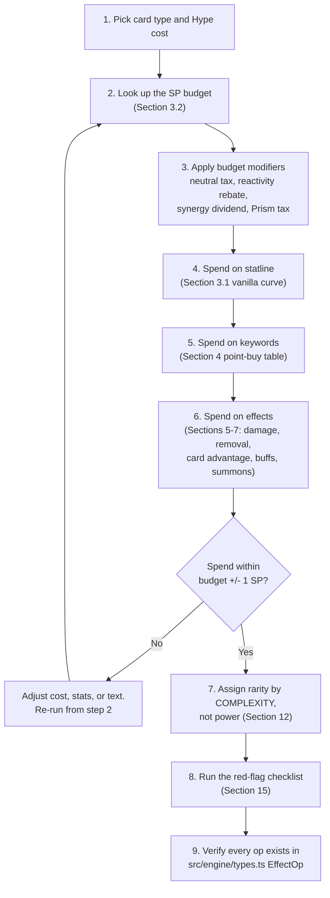

# HYPEBOUND — Balance Assumptions & Card Costing Model

> **Status: Derived design document.** Rules authority is
> [`00-core-rules.md`](00-core-rules.md) (canonical). Engine/DSL authority is
> [`../tech/00-architecture-contract.md`](../tech/00-architecture-contract.md)
> and `src/engine/types.ts`. Pacing authority is
> [`02-gameplay-loop-and-match-flow.md`](02-gameplay-loop-and-match-flow.md) §5.
> Where those are silent, this document makes the binding decision and marks it
> **[DECISION]**. Every number here is a *design assumption to be falsified by
> telemetry*, not a law of nature — but until telemetry says otherwise, it is
> the number a designer uses.
>
> **Purpose:** a designer who has never seen this project should be able to open
> this file, invent a brand-new card, and arrive at a defensible cost, statline,
> and rarity **without guessing and without asking anyone**.

---

## 1. How to use this document

The costing model is a **point-buy budget**. Every card has a budget derived
from its Hype cost and type; every statline, keyword, and effect spends from
that budget. A card is correctly costed when spend ≈ budget.



**Hard prerequisite (canon, architecture contract §4):** a mechanic that cannot
be expressed with the `TriggerId` / `EffectOp` / `TargetSpec` / `AmountExpr`
unions in `src/engine/types.ts` is not a design that needs costing — it is a
design that does not exist yet. Cost nothing until the DSL expression is
written.

---

## 2. The unit of account: the Stat Point (SP)

**[DECISION]** All power in HYPEBOUND is measured in **Stat Points (SP)**.

| Definition | Value |
|---|---|
| 1 SP | 1 point of Attack **or** 1 point of Health on a character |
| **1 Hype** | **2 SP** (the marginal exchange rate — see §3.1) |
| Smallest printable increment | 0.5 SP (half-points exist only inside the model; printed cards land on integers) |

Everything else — damage, draw, healing, Shielded, Obsession, a Confluence
activation, a Perfect Resonance — is quoted in SP so that unlike things can be
compared on one axis. When this document says "a card is 2 SP over budget," it
means "this card delivers one extra point of Attack and one extra point of
Health more than its cost buys."

**Why SP and not Hype?** Hype is quantized to integers 1–10, and the interesting
design decisions happen at half-Hype resolution (is **Raid** worth a point of
Attack, or two?). SP gives 2× the resolution and maps 1:1 onto the statline
designers actually type into JSON.

---

## 3. The vanilla stat curve

### 3.1 The formula

**[DECISION] The vanilla character curve is:**

```
SP_body(cost) = 2 × cost + 1
```

The slope (**2 SP per Hype**) is the exchange rate. The constant (**+1 SP**) is
the **body dividend**: the fixed value of occupying a board slot at all — being
a legal attacker, a legal blocker for **Spotlight** math, a **Collab** enabler,
a target for buffs, and a thing the opponent must spend a card on.

| Cost | SP budget | Canonical vanilla (balanced) | Aggro skew | Defensive skew |
|---:|---:|---|---|---|
| 1 | 3 | **2/1** | — | 1/2 |
| 2 | 5 | **3/2** | 4/1 | 2/3 |
| 3 | 7 | **3/4** | 4/3 | 2/5 |
| 4 | 9 | **4/5** | 5/4 | 3/6 |
| 5 | 11 | **5/6** | 6/5 | 4/7 |
| 6 | 13 | **6/7** | 7/6 | 5/8 |
| 7 | 15 | **7/8** | 8/7 | 6/9 |
| 8 | 17 | **8/9** | 9/8 | 7/10 |
| 9 | 19 | **9/10** | 10/9 | 8/11 |
| 10 | 21 | **10/11** | 11/10 | 9/12 |

This is the line the sibling faction documents already reference: the neutral
Common 2-drop is 3/2 or 2/3 (5 SP), the faction-neutral 3-drop benchmark is 3/4
(7 SP), and Digital Demons' Popup Impling at (2) 3/3 is described as "exactly
one stat point above the neutral Common line" — 6 SP against a 5 SP budget. All
consistent.

### 3.2 Budgets by card type

**[DECISION]**

| Card type | Budget formula | Rationale for the constant |
|---|---|---|
| **Character** | `2·cost + 1` | +1 body dividend (board slot, attacker, target) |
| **Action** / **Transformation** | `2·cost` | No body; compensated by flexibility (held until needed) |
| **Reaction** | `2·cost` | Blowout premium (+2) exactly cancels the pre-payment/telegraph/fizzle tax (−2) — see §8.3 |
| **Equipment** | `2·cost + 2` | +2 rebate for the 2-for-1 risk: kill the host and both cards are gone |
| **Location** | `2·cost + 1` | +1 for occupying the single Location slot and being replaceable |
| **Event** | `2·cost` | Telegraphed in a public banner zone; replaced by a new Event |
| **Leader passive** | ≤ **2 SP per turn**, averaged over turns 1–10 | Free, permanent, public |
| **Leader Fixation** (3 Obsession) | **4 SP ± 1** | ≈ a (2) Action, repeatable but Obsession-gated (§9) |
| **Leader Ultimate** (7 Obsession) | **12 SP ± 4** | ≈ a (6–8) card, once per match (§9) |
| **Confluence** | **5 SP**, ceiling 7 SP | Free, once per player per turn (§10) |
| **Perfect Resonance** | **11 SP ± 2** | One time per match (§11) |
| **Token (summoned body)** | value = `stats + 1` | The same body dividend a character's budget grants for free |

### 3.3 Budget modifiers

Applied **to the budget**, before spending. **[DECISION]**

| Modifier | Effect on budget | When it applies |
|---|---|---|
| **Neutral tax** | **−1 SP** | `faction: "neutral"`. Neutral cards are legal in all 10 factions; neutral staples flatten faction identity, so they must be slightly worse than the faction card that does the same job. |
| **Prism tax** | **−2 SP** (or +1 Hype) | `current: "prism"`. Binding: canon §8.6 requires Prism cards to be "costed ~1 higher or statted lower, enforced at design time." |
| **Reactivity rebate** | **+1 to +2 SP** | Cards that are structurally blank in some matchups (healing, Equipment destruction, anti-Obsessed **Intervention**, graveyard hate, Reactions with narrow conditions) are printed *above* the raw effect line so they are worth a deck slot at all. |
| **Synergy dividend** | **+2 SP** (Common/Rare), **+3 SP** (Epic/Legendary) | Text that is fully blank outside a committed archetype (tag-gated **Collab**, faction-tag auras, "if you control an Idol"). Requires the condition to be genuinely unsatisfiable in an unbuilt deck. |
| **Overload rebate** | **+1.5 SP per point of X** | `overload: X`. See §4. |
| **Zero-Attack rebate** | **+1 SP** | A 0-Attack character cannot trade or pressure; it is a wall or a Finale host. |
| **Legendary uniqueness** | **+0 SP** | Legendary means max 1 copy (canon §2), not more power (canon §9). It buys *variance*, not *rate*: a Legendary may be swingier at the same SP. |

### 3.4 Statline shaping rules

1. **Skew limit.** `|Attack − Health| ≤ 2` at costs 1–3, `≤ 3` at costs 4–6,
   `≤ 4` at costs 7+. Beyond the limit, each further point **toward Attack**
   costs **+1 SP** (glass cannons close games and dodge the trade math);
   each further point **toward Health** is refunded at **0 SP** (extreme walls
   are already weak — never discount them, just don't print them at cost).
2. **Attack ≥ 1 on any body priced for combat.** A 0-Attack body takes the
   Zero-Attack rebate and must justify itself with text.
3. **Health ≥ 2 above cost 1.** A body that dies to every ping (Scorched, a
   1-damage Confluence, a leader Fixation) delivers a fraction of its printed
   SP; if you print Health 1 above cost 1, refund 1 SP for it.
4. **The text expectation.** Above **cost (4)**, a pure vanilla body is
   unplayable regardless of rate — the opponent's answers cost less than your
   threat. **Do not print vanilla characters above (4)** except as tokens or
   `transform` results. Convert at least 2 SP into text at (5)–(6) and at least
   4 SP at (7)+.
5. **The cheap-card ceiling.** Because the curve's constant is positive, cheap
   bodies are *proportionally* more efficient (a (1) 2/1 is 3.0 SP/Hype; a (10)
   10/11 is 2.1 SP/Hype). That is correct and is bounded by the 6-slot board
   and the 1-card-per-turn draw rate — but it means **a (1) card with 3 SP of
   text on top of 3 SP of body is the single most dangerous shape in the game.**
   See §15 red flag R6.

---

## 4. Keyword point-buy table

**[DECISION]** All values in SP, spent from the card's budget. Keyword ids are
exactly those in `KeywordId` (`src/engine/types.ts`); canonical rules text is
canon §6.

| Keyword | SP cost | Scaling rule | Guardrail |
|---|---:|---|---|
| **Raid** | 2 / 3 / 5 / 7 | By the body's printed Attack: **1–2 → 2**, **3–4 → 3**, **5–6 → 5**, **7+ → 7** | Attack ≥ 5 with Raid is **Epic+ only** and must carry a printed drawback (Overload, self-damage, discard). Raid is the primary vector for uninteractable burst — it converts board damage into reach. |
| **Spotlight** | 1 / 2 / 3 | By the body's printed Health: **≤ 4 → 1**, **5–6 → 2**, **≥ 7 → 3** | Value is proportional to how many enemy attacks the body absorbs. **+1 SP** if the same card also grants Shielded or Armor. Spotlight on Health ≤ 2 is worth 1 SP but is *readability debt* — prefer not to print it. |
| **Viral** | 2.5 | Flat. The copy is a card at −1 Hype that has lost Viral, so it does not chain. | Never combine Viral with a cost-reduction engine on the same card (red flag R2). Viral copies are `viralCopy: true` and **do not advance Perfect Resonance** — that exclusion is load-bearing for §11's math. |
| **Comeback** | 3 (hand, 1 turn) / 5 (play, 1 turn) | `comeback.delayTurns` **> 1** refunds **1 SP per extra turn**. `mode: "play"` costs 2 SP more than `mode: "hand"` (it re-enters with summoning sickness but pays no Hype). | Comeback + a strong `onPlay` is a repeatable engine: price the `onPlay` at **full value a second time** if `mode: "play"`. Blanked entirely by **Banished** and by `destroy` effects that exile — that asymmetry is intended counterplay, not a discount. |
| **Parasocial** | 1.5 | Flat, but **+1 SP** in a faction whose Leader Fixation targets friendly characters (Neon Idols, Cosplay Champions, Corporate Creators) — there the trigger is reliably repeatable. | Parasocial converts *your own* card usage into stats + Obsession. It is the main engine that drives a deck into the 8+ danger zone; a Parasocial body that is also hard to remove undermines §9's risk math. |
| **Trending** | 2 | Flat at costs 1–4; **3 SP** at cost ≥ 5 (a bigger absolute discount). Expected realized discount is 1–2 Hype on a combo turn. | Trending on a card that *also* reduces costs is a red flag (R2). The minimum-1 clause in canon §6 is the only thing preventing free-cost loops — never print a Trending card whose text lowers that floor. |
| **Collab (X)** | **0.6 × the granted effect's SP** | Conditional multiplier. Granted effect capped at **4 SP** before the multiplier (so Collab never grants more than 2.4 SP). | `collab.kind` must be `current`, `faction`, or `tag`. If the condition is satisfiable by the card itself or by a token the same card summons, the multiplier is **1.0**, not 0.6 — it is not conditional. |
| **Grow X** | **multiplier × the upgrade's SP** | X=1 → **0.8**; X=2 → **0.65**; X=3 → **0.5**; X=4+ → **0.4** | The upgrade resolves at E3 (after Scorched at E2 — gameplay-loop §3.3), so the body must survive burn. **Grow upgrades are permanent**, so the raw upgrade SP may exceed the card's remaining budget before the multiplier; after it, it may not. |
| **Rushwind** | **0.75 × the granted effect's SP** | Flat multiplier. From turn 3 onward the condition is satisfied on most turns. | Never the *only* text on a card costing ≤ (2) — turn-1 and turn-2 Rushwind is nearly unsatisfiable, making the card a mulligan trap. |
| **Inspire** | **0.6 × granted SP**, with a **hard cap of 2 SP per trigger** | Repeatable within a turn. | **Binding:** any Inspire whose per-trigger value exceeds 2 SP must carry `once: true` (once per game) or a "once per turn" clause. Uncapped Inspire + a cheap repeatable buff is the game's most direct infinite-value engine (red flag R1). |
| **Flow** | **0.6 × granted SP**, **cap 2 SP per trigger** | Same shape as Inspire; the trigger set (returned to hand, replayed, healed, exchanged) is easier to self-satisfy. | Same binding cap. Flow + a self-bouncing card is a loop; the `rules.triggerCap` of 20 bounds the damage but not the value. |
| **Afterparty** | **0.8 × granted SP** per trigger, **cap 2 SP per trigger** | Once per turn by construction (end of your turn), so a lower discount than Inspire/Flow. | An Afterparty body that survives N turns delivers N × value. Price for **2 expected turns of survival** at costs 1–3 and **3 turns** at costs 4+. |
| **Refract** | 1 | Flat: the flexibility of choosing the in-play Current. | Always paired with the **Prism tax** (§3.3): a Prism card is 2 SP behind its natural-Current equivalent. Net, Refract makes a card −1 SP versus a natural card, which is the intended price of universal legality. |
| **Corrupt** | modal | Price as `max(branch SP) + 1` for the flexibility. The dark branch's self-cost is priced negatively (see §5.4). | Corrupt is `chooseOne` or a `condition` gate in the DSL — it is not a separate op. If the dark branch is *always* correct, it is not modal; price it as a single effect and delete the flexibility bonus. |
| **Touch Grass** | 4 (as an effect) | See §6.2. | — |
| **Overload (X)** | **refunds 1.5 × X SP** | Refund capped at **4.5 SP** (i.e. `overload: 3` is the maximum printable). | The 75% (not 100%) refund rate is what makes Overload a real drawback: you are borrowing 2 SP of next-turn Hype and receiving 1.5 SP today. **Never print Overload on a card that generates Hype** (red flag R14). |

### 4.1 Worked keyword examples against real cards

| Card | Cost | Budget | Spend | Verdict |
|---|---:|---:|---|---|
| `neutral-con-security` — (3) 2/4 **Spotlight**, Common, neutral | 3 | 7 − 1 (neutral tax) = **6** | 6 stats + 1 Spotlight (HP 4) = **7** | +1 over. Acceptable: it is the game's reference wall and the neutral tax makes it the *worst* Spotlight body any faction can play. |
| `idols-encore-diva` — (4) 3/4 **Spotlight**, **Inspire:** this gains +1/+0 | 4 | **9** | 7 stats + 1 Spotlight (HP 4) + Inspire (1 SP raw × 0.6 → capped at 2, so 1) = **9** | Exactly on curve. This is the architecture contract's sample card and the model's calibration anchor. |
| `idols-voltage-idol` — (3) 3/3, on play deal 2 to an enemy character, **Overload (1)** | 3 | 7 + 1.5 (Overload) = **8.5** | 6 stats + 3 (2 damage, enemy-only, §5.1) = **9** | +0.5 over. Rare, pushed — correct for a tempo faction's signature 3-drop. |
| `idols-center-position` — (5) 4/5 **Spotlight**, aura: other Idols +1/+0 | 5 | 11 + 2 (Epic synergy dividend, tag-gated) = **13** | 9 stats + 2 Spotlight (HP 5) + aura (1 SP × 2.0 effective targets = 2, ×0.6 tag-gated ≈ 1.2 → round 2) = **13** | On curve *only because* the aura is blank outside an Idol deck. |
| `idols-prime-diva-aurora` — (7) 5/6 Legendary **Spotlight**, on play others +2/+2, **Inspire:** heal leader 2 | 7 | 15 + 3 (Legendary dividend) = **18** | 11 stats + 2 Spotlight + 4 (board buff, §7.2) + 1 (Inspire, capped) = **18** | On curve. The top-end Idol payoff is exactly as strong as its deckbuilding commitment. |
| `idols-stan-account` — (1) 1/2 **Viral** | 1 | 3 | 3 stats + 2.5 Viral = **5.5** | **+2.5 over budget.** Flagged: see §14 benchmark audit. |

---

## 5. Damage costing

### 5.1 Single-target damage

**[DECISION]** The price of damage depends entirely on **what it is allowed to
hit**. This is the single most important table in the document.

| Legal target set | SP per point of damage | Hype per point | Example at 4 Hype (8 SP) |
|---|---:|---:|---|
| Random enemy character | 1.0 | 0.50 | Deal 8 (never print this — see guardrail) |
| **Enemy characters only** (chosen) | **1.5** | **0.75** | Deal 5 to an enemy character |
| Enemy characters, cost/Attack-capped | 1.25 | 0.63 | Deal 6 to an enemy character with cost (4) or less |
| **Any character** (either side, chosen) | **2.0** | **1.00** | Deal 4 to a character |
| **Enemy leader only** (reach) | **2.0** | **1.00** | Deal 4 to the enemy leader |
| **Any character or leader** | **2.5** | **1.25** | Deal 3 to any target |
| Your own leader / character (a **cost**) | −0.5 / −1.5 | — | Self-damage refunds budget |

Read the reach line carefully: **1 Hype buys 1 damage to a face.** That is
deliberately worse than a body — a (4) 4/5 deals 4 damage *every turn*. Reach
must be a finisher, never a plan; the moment burn beats bodies on rate, the
aggro clock in gameplay-loop §5.3 collapses below turn 6 and the 5-minute floor
is breached.

**Guardrails:**
- Random-target damage above **2** is forbidden below Epic, and above **2** it
  may never be the deciding effect (Meme Collective doc rule 6: randomness never
  picks the victim). The 1.0 SP/point rate exists to price *chip* effects
  (`{ "op": "damage", "target": { "select": "random", … }, "amount": 1 }`), not
  removal.
- "Any character or leader" at ≤ (2) Hype is a red flag (R6): it is removal and
  reach on one cheap card.

### 5.2 AoE damage

**[DECISION]**

| Scope | SP formula | Equivalent Hype | Notes |
|---|---|---|---|
| All **enemy** characters, X each | `2X + 4` | `X + 2` | The +4 is the **sweep premium**: a board answer is a 2-for-1 or better and wins games from behind |
| All characters (symmetric), X each | `2X + 4 − min(X, 4)` | `X/2 + 2` | The rebate assumes you cast it when behind on board; it is *not* a full refund because you choose the timing |
| Up to **N** chosen enemy characters, X each | `1.5·X·N + 1` | — | Split damage; the +1 is the choice premium |
| All enemy characters **and** the enemy leader | `2X + 4 + 2X` | — | Face AoE is priced as a separate reach effect stacked on top; **Epic+ only** |

Resulting canonical AoE band — **the 4–6 Hype window that gameplay-loop §5.3
requires every faction to have access to:**

| Effect | SP | Printed cost |
|---|---:|---|
| Deal 2 to all enemy characters | 8 | **(4)** |
| Deal 3 to all enemy characters | 10 | **(5)** |
| Deal 4 to all enemy characters | 12 | **(6)** |
| Deal 5 to all enemy characters | 14 | **(7)** — Epic/Legendary or a Leader Ultimate |
| Deal 3 to all characters (symmetric) | 7 | **(3.5)** → print at (4) with a rider, or (3) as a pushed Epic |

**Binding:** every faction must have at least one card in the 8–12 SP AoE band
at costs (4)–(6). Canon §8.7 ("every Current gets both offensive and defensive
tools") and the Viral Influencers' canon-listed weakness ("weak to AoE") are
both unenforceable if some faction lacks a sweeper.

### 5.3 Damage modifiers

| Rider | SP |
|---|---:|
| `ignoresShield: true` | +1 |
| `cantBeHealedUntilNextTurn: true` | +1 |
| Also applies **Scorched** | +1 per target (so +2.5 on a full board sweep) |
| Only hits **damaged** targets (`filter.isDamaged`) | −1 |
| Only hits a filtered Current/faction/tag | −1 (hosers are polarizing; see R10) |
| Damage equal to `{perTurnCardsPlayed}` / `{count: …}` / `{obsession}` | price at the **expected** value in the deck it is built for, **+1 SP variance premium** |

### 5.4 Self-cost pricing

Self-inflicted costs **refund** budget. Digital Demons' "Bargain (N)" and
Corrupt branches are built from these:

| Self-cost | Refund |
|---|---:|
| Your leader takes N damage | **0.5 × N** |
| Destroy/sacrifice a friendly character | its `stats + 1`, × **0.6** (you choose the worst one) |
| Discard a card at random | 2.5 |
| Discard a chosen card | 1.5 |
| `lockHype` X (Overload) | 1.5 × X, capped 4.5 |
| `gainObsession` on yourself, N | **0** below 6 Obsession; **−0.5 × N** at 6+ (it pushes you toward the 8+ danger zone — this is a cost, see §9.4) |
| Enemy draws a card | 2.5 |

---

## 6. Removal costing

Removal is damage's expensive cousin: it answers *anything*, including a (10)
threat, so it cannot be priced per point.

### 6.1 Hard removal

**[DECISION]**

| Effect | SP | Printed cost | Rarity floor |
|---|---:|---|---|
| `destroy` a chosen enemy character, unconditional | **12** | (6) | Epic |
| `destroy` a chosen enemy character, gated (cost ≤ N, Attack ≤ N, damaged, has a status) | **8** | (4) | Rare |
| `destroy` a **random** enemy character | **9** | (4.5) → print (4) or (5) | Rare |
| `transform` an enemy character into a 1/1 token | **10** | (5) | Epic |
| `transform` an enemy character into a 4/4 token (friendly-target upgrade) | see §7.4 | — | — |
| `cancel` — permanent (blank text, cannot attack) | **8** | (4) | Rare |
| `cancel` — 2 turns | 5 | (2.5) | Common |
| `cancel` — 1 turn | 3 | (1.5) | Common |
| `banish` with `returnAtStartOfYourNextTurn` (**Touch Grass**) | **4** | (2) | Common |
| `banish` permanently (no return) | **13** | (6.5) | Legendary |
| `returnToHand` an enemy character | **4** | (2) | Common |
| `returnToHand` + `modifyCost` +2 | 6 | (3) | Rare |
| `destroyEquipment` | **2** | (1) | Common |
| Destroy a Location or Event | **3** | (1.5) | Common |
| `removeStatus` with `polarity: "positive"` (strip buffs/statuses) | **3** | (1.5) | Common |

**Why the destroy/damage gap.** "Deal 5 to an enemy character" (7.5 SP) answers
most of the board; `destroy` (12 SP) answers *all* of it forever. The 4.5 SP gap
is the price of unconditionality. A card that closes that gap — unconditional
`destroy` at ≤ (4) with no drawback — is red flag **R5**, and it is the most
common way a control deck becomes unbeatable.

**Discount licence for faction identity.** Digital Demons print hard removal
**1 Hype under this line** (their faction doc), paid for with a **Bargain**
self-cost and a **Cursed** self-mark. That is legal *because the self-cost is
priced in §5.4* and lands the net spend back on the line. Any faction may buy
below-curve removal the same way; nobody may buy it for free.

### 6.2 Why Touch Grass is cheap

**Touch Grass** (4 SP / 2 Hype) looks under-priced for "answer any threat," so
the reasoning is recorded here:

1. It is **temporary** — the character returns at the start of your next turn.
2. It is **permanent** where it matters: the character returns *with base stats
   and no statuses or attachments* (canon §6). It deletes buffs, Equipment,
   Grow progress, and Empowered — a full turn of a Neon Idols or Cosplay
   Champions setup.
3. It **costs you tempo** when used defensively on your own character: per the
   Touch-Grass Order doc, `enteredOnTurn` resets, so the returned body has
   summoning sickness. Dodging removal with Touch Grass costs you an attack.
4. It **whiffs against Comeback and `onDefeat`** — it does not kill, so
   death-trigger factions (Gothic Royalty) ignore it entirely.

Net: 4 SP for a **tempo** answer, not a **card-advantage** answer. Anything that
converts Touch Grass into permanent removal (banishing for more than one turn,
or banishing on defeat) is priced at the 13 SP permanent-banish line.

### 6.3 The removal-density guardrail

**[DECISION]** A 30-card deck may profitably run about **8–10 answers**. If the
model prices a faction's removal so cheaply that 14+ answers fit on curve, the
control mirror stretches past turn 12 and the 12-minute ceiling in §13 breaks.

| Metric | Target |
|---|---|
| Efficient (on-curve) removal per faction card pool | 6–9 cards |
| Removal costing ≤ (2) per faction | ≤ 3 cards, none of them unconditional |
| Unconditional hard removal per faction | ≤ 2 distinct cards, Epic+ |

---

## 7. Card advantage, healing, buffs, and summons

### 7.1 Card advantage

**[DECISION] Draw a card = 3 SP.**

Derivation: the average constructed card sits at cost ≈ 3.3, delivering ≈ 7.6 SP
of effect for ≈ 6.6 SP of Hype — a surplus of ≈ 1 SP. On top of that sits the
**option value** of holding a card and the **consistency value** of reaching
your good cards sooner, which in a 30-card deck with a 1-card draw step is
worth roughly 2 SP. Total ≈ 3 SP. This also matches observed practice: a
conditional **Rushwind** draw (3 × 0.75 ≈ 2.25 SP) is what
`idols-comeback-single` spends its last budget point on and lands the card
exactly on curve.

| Effect | SP | Notes |
|---|---:|---|
| `draw` 1 | **3** | |
| `draw` 2 | **6.5** | +0.5 escalation premium (hand-size flexibility compounds) |
| `draw` 3 | **10.5** | +1.5; also approaches the hand limit of 10 |
| `draw` 1, but only if a condition holds | 3 × the condition multiplier (§4) | |
| `copyCardToHand` (specific / chosen) | **2.5** | No deck thinning, but a known quantity |
| `copyCardToHand` with `costDelta: -1` | **3.5** | This is exactly what **Viral** does (§4) |
| `stealCopy` from enemy hand/deck/discard | **3.5** | +0.5 for information gained |
| `discard` 1 at random from enemy hand | **2** | Weakest form of card advantage: no board impact |
| `discard` 1 chosen from enemy hand | **3** | Requires hand visibility; the redacted view forbids it below Epic |
| Enemy `draw` 1 (as a drawback) | **−2.5** | Slightly less than 3: they may be flooded |
| `mill` 1 (enemy) | **0.25** | Only becomes relevant via Burnout; see §13.4 |
| `scry` 3 `reorder` ("Recommend 3") | **1.5** | Quality, not quantity |
| `scry` 3 `bottomOne` | **2** | Removes a dead card as well |
| **Resurrect** a friendly character from discard | **0.9 × (its stats + 1)** | Conditional on something having died; add the resurrected body's own `onPlay` value only if it re-triggers |

**The card-advantage-on-a-body guardrail.** A character that draws a card is
paying 3 SP of its budget, which is 1.5 Hype of body. A (2) 2/2 that draws a
card spends 4 + 3 = 7 SP against a 5 SP budget — that is **+2 over**, which is
legal *only* under the synergy dividend (i.e. the draw must be gated on an
archetype condition). `idols-stage-tech` is exactly this card and is exactly at
the limit. **An ungated draw-on-a-body at (2) is red flag R4.**

### 7.2 Buffs and healing

| Effect | SP per point | Notes |
|---|---:|---|
| `buff` Attack, permanent | **1.0** | |
| `buff` Health, permanent | **1.0** | |
| `buff` on an **Equipment** (`equipAttack`) | **1.25** | Delivered to an already-summoned body: no summoning sickness, so the Attack converts to damage this turn |
| `buff` temporary (this turn only) | **0.5** | |
| `heal` a character | **0.75** | Capped at missing health; reactive |
| `heal` your leader | **0.5** | Does not affect the board; 30 HP is a big pool |
| `applyStatus: shielded` | **2** flat | Negates one instance — worth roughly the biggest hit on the board |
| `applyStatus: armor` N (leader) | **0.75 × N** | |
| `applyStatus: empowered` N, 1 turn | **0.5 × N** | |
| `applyStatus: weakened` N on an enemy, 1 turn | **1.0 × N** | Denies damage on the enemy's turn |
| `applyStatus: lurking` (self) | **1.5** | Untargetable until it acts — a protected engine, not evasion |
| `applyStatus: warded` (1 turn) | **2.5** | Blocks Actions/abilities but not attacks |
| `applyStatus: scorched` | **1** | 1 damage at the controller's end of turn |
| `applyStatus: cursed` | price the attached payload | Cursed is a marker; the SP lives in the payload |
| `removeStatus` `polarity: "negative"` (cleanse) | **1.5** | |
| `addKeyword` | the keyword's §4 price × **0.8** | Removable, and the host may die |
| `attackAgain` on one friendly character | **1.3 × its Attack** | Damage that also trades; on a 3-Attack body ≈ 4 SP |
| `swapAttackHealth` | **0.5 × \|Attack − Health\|** | Situational; price at the expected delta in its deck |
| `gainHype` this turn, N | **1.75 × N** | Slightly under 2 because it expires unspent |
| `gainHype` `permanent: true`, N | **3 × N** | Compounding; **Epic+ only**, and never above the cap of 10 |
| `modifyCost` −1 on a card in hand | **1.5** | |
| `disableAuras` 1 turn (Eclipse) | **3** expected, high variance | See §10 |

### 7.3 The multi-target rule

**[DECISION]** Multi-target effects are priced as
`per-target value × E`, where **E is the effective target count**, not the
maximum board width of 6:

| Scope | E | Why not 6? |
|---|---:|---|
| All friendly characters (buff/heal) | **2.5** | Includes the source's own board presence; discounted for sweeper risk and for being blank when behind |
| Your **other** characters (buff/heal) | **2.0** | Same, minus the source |
| All enemy characters (damage/debuff) | **2.0** (use the §5.2 AoE formula instead for damage) | The opponent will have traded down by the time you cast it |
| Adjacent (`select: "adjacent"`) | **1.4** | Slot-dependent; the player controls placement |
| Random N (`select: "random", count: N`) | **N × 0.8** | Misses matter |

The gap between real board width (often 3–4) and E (2.0–2.5) **is the discount
for fragility**: board-wide buffs are dead on an empty board, get blown out by
a sweeper, and are the losing player's worst card. Do not double-discount by
also applying a conditional multiplier for "you need a board."

### 7.4 Summons and transforms

| Effect | SP |
|---|---:|
| `summon` a token with stats A/H | **A + H + 1** per body |
| `summon` a token with a keyword | above, + the keyword's §4 price |
| `summon` `side: "enemy"` (a drawback) | −(A + H + 1) × 0.8 |
| `transform` a **friendly** character into a bigger form | `(new stats + 1) − (old stats + 1)`, ×0.8 (the old body is consumed and its buffs are lost) |
| `transform` an **enemy** character into a small form | see §6.1 (it is removal) |
| `refract` (choose a Current) | 1 (see §4) |

**Check:** `idols-synchronized-debut` — (3) Action, summon two 1/1 Backup Idols.
Budget 6. Spend `(1+1+1) × 2 = 6`. Exactly on curve.
**Check:** `neutral-glow-up` — (4) Transformation, transform a friendly
character into a 4/4 Main Character. Budget `8 − 1 (neutral) − 2 (Prism) = 5`.
Spend: against a typical (2) 3/2 target, `(9) − (6) = 3`, ×0.8 = 2.4; against a
1/1 token, `(9) − (3) = 6`, ×0.8 = 4.8. Expected ≈ **4** against a 5 SP budget —
on curve, and correctly *better* the smaller the target, which is exactly the
combo the card is printed for.

---

## 8. Non-character card types

### 8.1 Equipment (budget `2·cost + 2`)

The **+2** is the 2-for-1 rebate: removal aimed at the host kills the Equipment
too, and canon §4 caps Equipment at 1 per character with a new equip destroying
the old.

| Card | Cost | Budget | Spend |
|---|---:|---:|---|
| `idols-oshi-no-heart` — +1/+2, grants **Parasocial** | 2 | 6 | 1.25 + 2 + (1.5 × 0.8) = **4.45** — 1.5 under; a Rare enabler, acceptable |
| `neutral-ring-light` — +2/+0 | 2 | 6 − 1 (neutral) = 5 | 2.5 — **2.5 under**. Flagged in §14 |

**Guardrail:** Equipment that survives its host (`"destroyed with the character
unless stated"`, canon §4) loses the 2-for-1 rebate: budget becomes `2·cost`.

### 8.2 Locations (budget `2·cost + 1`)

An activated Location's total value is
`per-activation SP × durability × 0.7`. The 0.7 covers: one activation per
turn, the single Location slot, being replaced by any new Location, and the
turns you spend not activating it.

| Card | Cost | Budget | Spend |
|---|---:|---:|---|
| `neutral-convention-hall` — Dur 3, summon a 1/1 Follower | 3 | 7 − 1 = 6 | `3 × 3 × 0.7 = 6.3` — on curve |
| `idols-arena-tour` — Dur 3, give a friendly character +1/+1 | 4 | 9 | `2 × 3 × 0.7 = 4.2` — **4.8 under**. Flagged in §14 |

Aura-only Locations (no `durability`) are priced as a permanent effect:
`per-turn SP × 4 expected turns × 0.7`.

### 8.3 Reactions (budget `2·cost`)

**[DECISION]** Reactions are costed **identically to Actions**. Two opposing
adjustments are designed to cancel exactly:

| Direction | SP |
|---|---:|
| **+** Acts on the enemy's turn — answers an attack or a card *as it is played*, which no Action can do | +1 |
| **+** Blowout potential: a well-guessed Reaction is a 2-for-1 | +1 |
| **−** Paid in advance: Hype spent on set, tempo lost that turn | −1 |
| **−** Telegraphed: the opponent sees `reactionCount` and plays around it; may fizzle for no value | −1 |
| **Net** | **0** |

Occupying 1 of `board.maxSetReactions` (2) slots is the reason a deck cannot run
more than ~4–6 Reactions regardless of price.

| Card | Cost | Budget | Spend |
|---|---:|---:|---|
| `idols-emergency-lightstick` — on `enemyAttacksLeader`: heal leader 4, Armor 2 | 2 | 4 | `(4 × 0.5) + (2 × 0.75) = 3.5` — on curve |
| `neutral-block-button` — on `enemyPlaysCharacter`: Weakened 2 for 1 turn | 2 | 4 − 1 = 3 | `2 × 1.0 = 2` + 1 tempo denial = **3** — on curve |

### 8.4 Events (budget `2·cost`)

`per-tick SP × durationTurns × 0.75`. The 0.75 covers: public visibility in the
Event banner, the opponent's whole turn to react, and canon's 1-Event-per-player
replacement rule.

| Card | Cost | Budget | Spend |
|---|---:|---:|---|
| `idols-holo-concert` — 3 turns, all friendly +1/+1 per tick | 5 | 10 + 3 (Epic dividend, board-dependent) = 13 | `(2 × 2.5) × 3 × 0.75 = 11.25` — on curve |
| `neutral-wifi-outage` — 2 turns, 1 damage to a random enemy character | 4 | 8 − 1 = 7 | `1 × 2 × 0.75 = 1.5` — **5.5 under**. Flagged in §14 |

---

## 9. Obsession economy

Canon §3.2 fixes the machine: gain +1 the first time each turn you support a
friendly character, +1 per **Parasocial** trigger, plus explicit effects. Spend
3 for **Fixation** (once per turn), 7 for **Ultimate Fixation** (once per
match). At **8+** you are **Obsessed** (+1 damage taken from all enemy sources);
at **10**, **Full Fixation** makes the Ultimate free this turn and resets you
to 5.

### 9.1 Obsession generation rate by archetype

**[DECISION]** `g` = expected Obsession gained per your-turn, averaged over
turns 2–10.

| Archetype | Support turns (fraction) | Parasocial / effect gain | **g** | Representative factions |
|---|---:|---:|---:|---|
| **Support/buff** | 0.90 | 0.60 | **1.50** | Neon Idols, Cosplay Champions, Corporate Creators |
| **Midrange** | 0.60 | 0.30 | **0.90** | Meme Collective, Afterparty Crew, Gothic Royalty |
| **Aggro** | 0.50 | 0.20 | **0.70** | Viral Influencers, Digital Demons |
| **Control** | 0.35 | 0.15 | **0.50** | Touch-Grass Order, Algorithm Syndicate |

### 9.2 Expected Fixation and Ultimate use per match

Total Obsession generated by your turn *T* is `g × (T − 1)`. Spending is
`3·F + 7·U`. Because Fixation is once per turn, the sustainable Fixation rate is
`min(1, g/3)` per turn — but the Ultimate competes for the same pool, so a
player who wants the Ultimate must *skip* Fixations.

| Archetype | Obsession by T=6 | by T=8 | by T=10 | Fixations per match | First turn Ultimate is affordable (banking) | **P(Ultimate resolves)** |
|---|---:|---:|---:|---:|---:|---:|
| Support/buff | 7.5 | 10.5 | 13.5 | **3–4** | T6 | **80–90 %** |
| Midrange | 4.5 | 6.3 | 8.1 | **2–3** | T9 | **55–65 %** |
| Aggro | 3.5 | 4.9 | 6.3 | **1–2** | T11 (usually never — the match ends) | **20–30 %** |
| Control | 2.5 | 3.5 | 4.5 | **2–3** (via explicit `gainObsession` cards) | T13 without help, T9–10 with 2 gain cards | **50–60 %** |

**[DECISION] Design targets.**

| Target | Value | Corrective action if missed |
|---|---|---|
| Ultimate resolves in **50–70 %** of matches, field-wide | measured per leader | > 85 %: cut the Ultimate's SP budget, do **not** raise its Obsession cost (the cost is canon). < 30 %: give the faction an Obsession *source*, not a cheaper Ultimate. |
| Fixations per match, field-wide | **2–4** | < 1.5: the faction has no support outlet; print one. > 5: the faction is generating Obsession without paying the danger-zone tax. |
| Turns spent at 8+ Obsession, field-wide | **1.5–3** per match | 0: the risk dial is decorative — see §9.4. > 5: the Obsessed penalty is too weak. |

**Note (deliberate, canon-consistent):** a Fixation that targets a friendly
character *is itself an act of support*, so in a support deck it re-triggers the
once-per-turn +1 (and any **Parasocial**). Its effective Obsession cost there is
≈ 2, not 3. Lumi Starcall's *Center Spotlight* is exactly this engine. This is
why the support band's `g` is high enough to sustain a Fixation every other turn
*and* reach an Ultimate.

### 9.3 The 8+ danger zone: the risk math

**Obsessed tax.** At 8+ Obsession your leader takes +1 damage from **every**
enemy source (`obsession.obsessedExtraDamageTaken` = 1). Count the sources that
hit a leader in a typical turn 6–9 board state:

| Source | Instances per enemy turn | Extra damage |
|---|---:|---:|
| Character attacks going face | 2.0 | 2.0 |
| Reach effects (burn, Afterparty pings, Confluences) | 0.7 | 0.7 |
| Leader Fixation aimed at your leader | 0.3 | 0.3 |
| **Total** | | **≈ 3.0** |

**[DECISION] The Obsessed tax is ≈ 3 leader damage per full turn spent at 8+**
— 10 % of your starting health, per turn. Touch-Grass Order's **Intervention**
riders add on top of that, and are why the faction exists.

**The Full Fixation decision.** Riding from 8 to 10 costs, on average, **two
turns at 8+ ≈ 6 leader damage** (20 % of your life total). What you buy:

| Gain | SP value |
|---|---:|
| Ultimate costs 0 this turn (saves 7 Obsession) | 7 Obsession ÷ 3 per Fixation × 4 SP per Fixation = **9.3** |
| End-of-turn reset to 5 (you keep 5 for future Fixations, instead of dropping to 0–3) | ≈ **3** |
| Leaving the Obsessed band immediately after (reset to 5 < 8) | ≈ **2** (avoided tax) |
| **Total** | **≈ 14 SP** |

Cost: 6 leader damage ≈ `6 × 0.5 = 3 SP` of leader health by the §7.2 rate —
but that undervalues it badly, because leader health near lethal is worth far
more than leader health at 30. **[DECISION] Leader health is priced at
`0.5 SP/point above 20 HP`, `1.0 SP/point from 20 down to 11`, and
`2.0 SP/point at 10 or below`.** At the typical turn-7 life total of 18–22, the
6 damage costs ≈ **5 SP**.

**Break-even:** Full Fixation is correct when `14 SP > 5 SP` — i.e. **almost
always, provided you survive**. The risk is not expected value; it is
**variance**: the 6 extra damage is drawn from the exact life total your
opponent is racing. The rule of thumb the tutorial and AI evaluator both encode:

> **Ride to 10 when your leader is above 18 HP or you can close the match within
> 3 turns of the Ultimate. Otherwise spend at 7 and drop out of the band.**

This is the intended push-your-luck: the *expected* line is greedy, the *safe*
line is correct against aggro, and the opponent's board tells you which.

### 9.4 Obsession pricing rules for card design

| Rule | Value |
|---|---|
| `gainObsession` on yourself as a **benefit** | **+1 SP per point** below 6 Obsession |
| `gainObsession` on yourself as a **cost** (pushing into 8+) | **−0.5 SP per point** at 6 or above |
| `gainObsession` `side: "enemy"` (pushing *them* into the danger zone) | **+1.5 SP per point** — it is a damage amplifier and a Touch-Grass enabler |
| `removeObsession` from yourself | **−1 SP per point** (it defuses your own engine) but **+2 SP flat** if it is the *only* way to leave the band on demand — see red flag **R13** |
| `removeObsession` `side: "enemy"` | **+1.5 SP per point** (denies their Ultimate) |
| Any card gaining Obsession outside the canon sources | must be an explicit, per-turn-capped effect. Uncapped Obsession generation breaks every number in §9.2. |

---

## 10. Confluence power budget

Canon §8.5: a Confluence is **free**, activatable **once per player per turn**,
and requires having played cards of two compatible Currents that turn. It is
therefore a *repeatable* free effect with a deckbuilding and sequencing cost.

### 10.1 The budget

**[DECISION]**

| Bound | Value |
|---|---|
| Design target | **5 SP** |
| Acceptable band | **3–6.5 SP** |
| Hard ceiling | **7 SP** |
| Floor | **2.5 SP** (below this it is not worth the sequencing tax and players will ignore it) |

**Derivation of the ceiling.** A dual deck can realistically activate on ~65 %
of turns from turn 4 (you must draw and afford two Currents in one turn). Over a
10-turn match that is ≈ 4.5 activations. At the 5 SP target that is **≈ 22 SP
per match of free value** — roughly 1.5 extra cards' worth spread across the
game, which is the intended size of the "dual deck" bonus (§11). At a 7 SP
ceiling it is 31 SP, which already exceeds a Perfect Resonance twice over.
Anything above 7 makes Confluence access, rather than card quality, the deciding
factor in deckbuilding.

### 10.2 The nine canonical Confluences, priced

Effects are quoted from canon §8.5 / `data/confluences.json`.

| Confluence | Currents | Priced spend | SP | Verdict |
|---|---|---|---:|---|
| **Steamveil** | Cinder + Tide | Warded-equivalent on 1 friendly for a turn (2.5) | **2.5** | At the floor. A protection effect; fine, but the weakest of the nine. |
| **Bloom** | Tide + Root | heal 3 (2.25) + summon 1/1 Sprout (3) | **5.25** | On target. |
| **Sandstorm** | Root + Gale | Weakened 1 on all enemies for a turn (1.0 × E 2.0) + tempo denial 0.5 | **2.5** | At the floor. Its real value is matchup-dependent (huge vs. go-wide aggro, near-zero vs. control). |
| **Tempest** | Gale + Pulse | max(1 dmg to up to 3 enemies = `1.5×1×3+1` = 5.5; attackAgain ≈ 4) + 1 modal | **6.5** | Top of band. Correct for the Current pair that owns tempo. |
| **Starflare** | Pulse + Cinder | 4 damage to any character (8) + ignoresShield (1) | **9** | ⚠ **Over the ceiling by 2.** See §10.3. |
| **Blackflame** | Cinder + Veil | 2 damage to any character (4) + cantBeHealed (1) | **5** | Exactly on target. |
| **Sanctuary** | Root + Halo | Shielded (2) + removeStatus negative (1.5) | **3.5** | Below target; correct for a purely defensive effect. |
| **Eclipse** | Halo + Veil | `disableAuras` 1 turn: 0 SP vs. an aura-free deck, 6+ SP vs. an aura deck | **≈ 3 expected** | Highest variance of the nine. Never print a *card* at this rate — variance that swings 0→6 is only acceptable on a free, once-per-turn button. |
| **Refraction** | Prism + any | Next card of the paired Current triggers its `onPlay` twice | **≈ 5 expected, ceiling unbounded** | See guardrail below. |

### 10.3 Two binding guardrails

**Starflare.** At 9 SP it is the only Confluence that is a **removal spell**,
and it is 2 SP over ceiling. Recommended correction when it becomes reachable
(see §10.4): **"Deal 3 damage to a character; this ignores Shielded"** = 7 SP,
exactly at the ceiling. Do not remove the `ignoresShield` clause — that clause
is Pulse+Cinder's identity and only costs 1 SP.

**Refraction's uncapped ceiling.** Refraction doubles an `onPlay`. Its value is
therefore *your best `onPlay` in the deck*, which the model does not bound.
**[DECISION] Binding rule:** no printed card may have an `onPlay` effect worth
more than **10 SP** without a self-limiting clause (`once: true`, a resource
cost inside the effect, or a board-state requirement that a doubled trigger
cannot re-satisfy). Without this rule, Refraction is a combo enabler with no
ceiling, and Prism decks — which canon §8.6 already grants maximum flexibility —
become mandatory.

### 10.4 Reachability audit (flagged upward)

Mapping canon §7's faction Current pairs against canon §8.5's Confluence pairs:

| Confluence | Currents | Faction that can natively assemble it |
|---|---|---|
| Steamveil | Cinder + Tide | **Afterparty Crew** |
| Blackflame | Cinder + Veil | **Digital Demons** |
| Sandstorm | Root + Gale | **Touch-Grass Order** |
| Sanctuary | Root + Halo | **Corporate Creators** |
| Refraction | Prism + any | **Cosplay Champions**, **Meme Collective** |
| **Bloom** | Tide + Root | *none* |
| **Tempest** | Gale + Pulse | *none* |
| **Starflare** | Pulse + Cinder | *none* |
| **Eclipse** | Halo + Veil | *none* |

Four Confluences are currently unreachable by any faction, and — as the
gameplay-loop doc already flagged from the other direction — four factions
(Neon Idols Halo/Pulse, Gothic Royalty Veil/Root, Viral Influencers Gale/Cinder,
Algorithm Syndicate Pulse/Tide) have no native Confluence. This is a canon gap,
reported, not resolved here. **Balance consequence, which this document does
own:** for those four factions the dual-deck side of the §11 equation is
missing, so **their cross-Current cards must supply the missing ≈ 4.5 SP per
activation-turn themselves** (cards that reward having played both Currents),
or those factions will correctly default to pure single-Current builds.

---

## 11. Perfect Resonance versus Confluence — the pure-vs-dual math

Canon §8.6: a **pure** deck (all cards one natural Current, no Prism splash)
unlocks **Perfect Resonance** after playing 7 cards of that Current
(`resonance.threshold`); a **dual** deck trades Resonance for Confluence access.
Canon §8.7 makes both viability **binding**: "Pure and dual decks must both be
viable; competitive play must not require Prism."

### 11.1 The eight Resonances, priced

From `data/currents.json`, priced with §5–§7:

| Current | Resonance | Priced spend | SP |
|---|---|---|---:|
| Cinder | **Standing Ovation** — 2 damage to all enemy characters, Scorch them | AoE `2(2)+4` = 8 + Scorched (1 × E 2.5) = 2.5 | **10.5** |
| Tide | **Total Recall** — heal leader 6, draw 2 | `6 × 0.5` = 3 + 6.5 | **9.5** |
| Root | **Deep Roots** — friendly characters +0/+3, leader Armor 3 | `3 × E 2.5` = 7.5 + `3 × 0.75` = 2.25 | **9.75** |
| Gale | **Second Wind** — your characters may attack again, draw 1 | `1.3 × 3 Attack × E 2.5` = 9.75 + 3 | **12.75** |
| Pulse | **Grid Surge** — gain 2 Hype this turn, draw 2 | `1.75 × 2` = 3.5 + 6.5 | **10.0** |
| Halo | **First Light** — heal leader 4, heal all friendly 4, cleanse | 2 + `4 × 0.75 × E 2.5` = 7.5 + 1.5 | **11.0** |
| Veil | **Total Blackout** — destroy a random enemy character, 2 to the enemy leader | 9 + `2 × 2.0` = 4 | **13.0** |
| Prism | **Full Spectrum** — draw 2, gain 2 Hype this turn | 6.5 + 3.5 | **10.0** |

**Band: 9.5 – 13.0 SP; mean 10.8.** **[DECISION] Perfect Resonance budget =
11 SP ± 2.** Veil (13.0) and Gale (12.75) sit at the top because both are
*conversion* effects — they turn an existing advantage into a win — while Tide
(9.5) is the pure value floor. That spread is acceptable; anything outside
9–13 SP should be re-tuned in `data/currents.json`.

### 11.2 When each side pays out

| | Pure deck | Dual deck |
|---|---|---|
| Trigger | 7 cards of one Current played | 2 Currents played in one turn |
| Cards played by turn *T* (cumulative, typical) | T3 ≈ 4, T4 ≈ 6, T5 ≈ 8, T6 ≈ 10 | same |
| Cards of the *relevant* Current | **100 %** of non-token plays | ~50 % each |
| **First payout** | **turn 5** (aggro) to **turn 6–7** (control) | **turn 4** |
| Payout size | **11 SP, once** | **≈ 4.5 SP × activations** |
| Activation reliability | n/a — it is guaranteed once the count is reached | **≈ 65 %** of turns from turn 4 (must draw and afford both Currents) |

Note the engine rule that makes the pure count honest: **Viral copies
(`viralCopy: true`) and tokens (`token: true`) do not advance
`resonanceProgress`** (architecture contract §4; gameplay-loop §3.2). Without
that exclusion, a Viral or token-heavy pure deck would resonate on turn 3 and
this entire section would be wrong.

### 11.3 The break-even and the four compensating terms

Raw comparison at turn 10:

```
Dual   = 4.5 SP  ×  (turns 4-10) 7  ×  0.65 reliability   =  20.5 SP
Pure   = 11 SP once                                        =  11.0 SP
Raw gap                                                    =  -9.5 SP against pure
```

Naïvely, dual wins any game past turn 7 (break-even is
`11 ÷ 4.5 ≈ 2.4` activations ≈ turn 6–7). Four terms close the gap:

| # | Term | SP at turn 10 | Reasoning |
|---:|---|---:|---|
| 1 | **Card-quality delta** (pure) | **+7.2** | A pure deck draws only from the top of one Current's pool; a dual deck must average two pools and include filler from the weaker half. **[DECISION] +0.4 SP per card played**, × ≈ 18 cards played by turn 10. |
| 2 | **Sequencing tax** (dual) | **−2.3** | To assemble the pair, a dual deck sometimes plays the worse card first. **[DECISION] −0.5 SP per activation**, × 4.5 activations. |
| 3 | **Prism splash** | **≈ 0 net** | Dual may splash up to 3 Prism cards (≈ +1 SP each of flexibility = +3) but each pays the 2 SP Prism tax (−6 across three cards, partly recovered by the Refraction access those cards buy). Net ≈ 0 — which is exactly the outcome canon §8.7 demands ("competitive play must not require Prism"). |
| 4 | **Elemental polarization** | **≈ 0 across the ladder** | Pure decks have advantage against exactly one Current and weakness to exactly one (two for Halo/Veil). Field-wide this is a wash, but it makes pure a *tech* choice: strictly better in its favoured matchup, strictly worse in its bad one. |

```
Dual   = 20.5 - 2.3                 = 18.2 SP
Pure   = 11.0 + 7.2                 = 18.2 SP
```

**Balanced to within the model's resolution.** That result is the design thesis
of the Currents system, and it is the number to defend.

### 11.4 Sensitivity and the tuning knob

| Match length | Pure | Dual | Winner |
|---|---:|---:|---|
| Ends turn 6 | 11.0 + 4.3 = **15.3** | 5.9 − 0.7 = **5.2** | **Pure**, decisively — Resonance lands before Confluences accumulate |
| Ends turn 8 | 11.0 + 5.8 = **16.8** | 14.6 − 1.6 = **13.0** | Pure |
| Ends turn 10 | **18.2** | **18.2** | Even |
| Ends turn 13 | 11.0 + 9.6 = **20.6** | 29.3 − 3.3 = **26.0** | **Dual** |

So: **pure decks are the aggro/tempo choice, dual decks are the grind choice.**
That is a good, legible identity, and it is not an accident — it follows from a
one-shot payout versus a per-turn payout.

**The knob:** `resonance.threshold` (default **7**).

| Symptom | Change | Effect |
|---|---|---|
| Pure decks under-represented at all lengths | 7 → **6** | Resonance lands ~1 turn earlier; worth ≈ +2 SP to pure |
| Pure decks dominating short games | 7 → **8** | Resonance lands ~1.5 turns later; worth ≈ −3 SP to pure |
| Only one Current's pure deck is played | Re-tune that Current's `resonance.ops` toward the 11 SP band | Localized; no engine change |

Never fix a pure/dual imbalance by changing Confluence power — Confluences are
shared by six factions and one is already over-ceiling (§10.3).

---

## 12. Rarity: complexity budget, not power budget

Canon §9: rarity represents **complexity and collectability, not raw power**;
Legendaries are not automatically stronger. The SP budget in §3 is therefore
**identical at every rarity**. What rarity buys is *how complicated the card is
allowed to be*.

**[DECISION]**

| Rarity | Max distinct `EffectDef` entries | Max keywords | Reminder text (canon §6) | Max conditional gates | May use |
|---|---:|---:|---|---:|---|
| **Common** | 1 | 1 | required | 1 | `damage`, `heal`, `buff`, `summon`, `draw`, `applyStatus`, `removeStatus` |
| **Rare** | 2 | 2 | required | 1 | + `returnToHand`, `banish`, `cancel`, `modifyCost`, `attackAgain`, `equip`, `scry` |
| **Epic** | 3 | 3 | omitted | 2 | + `destroy`, `transform`, `chooseOne`, `randomOp`, `resurrect`, `disableAuras`, `gainHype permanent`, `stealCopy`, `scheduleDelayed` |
| **Legendary** | 3 | 3 | omitted | 2 | + `finale: true`, `once: true` match-unique effects, `forEach` over the whole board |

Additional binding gates:

- **Random Current-changing effects are Epic+** (canon §8.7).
- **Uncapped repeatable triggers are forbidden at every rarity** (§4, red flag R1).
- **Legendary = max 1 copy** (canon §2), which buys **variance, not rate**: a
  Legendary may have a swingier distribution at the same expected SP.
- **Synergy dividend** is +2 SP at Common/Rare, +3 SP at Epic/Legendary (§3.3) —
  the only place rarity touches the power budget, and it exists because
  higher-rarity cards are allowed deeper conditions.

---

## 13. Match-length arithmetic

### 13.1 Archetype speed targets (binding)

Consistent with, and refining, gameplay-loop §5.2. **"Lethal turn *L*"** = the
per-player turn on which the archetype reduces a goldfish opponent's 30 HP to 0.

| Band | L (per-player) | Total seat-turns (2L−1 … 2L) | Representative archetypes |
|---|---:|---:|---|
| **Aggro** | **6–8** | 11–16 | Viral Influencers follower flood; Digital Demons all-in burn; Neon Idols Overdrive Tempo; Afterparty burn engine |
| **Midrange** | **8–10** | 15–20 | Cosplay Champions equipment; Touch-Grass tempo; Meme Collective value |
| **Control** | **10–12** | 19–24 | Gothic Royalty attrition; Corporate Creators ramp; Algorithm Syndicate engine |
| **Out of spec** | **13+** | 25+ | Any archetype needing turn 13 is nerfed, not accommodated |

### 13.2 The wall-clock model

**[DECISION]** Median (not ceiling) per-seat-turn durations, derived from
gameplay-loop §5.1 by taking the lower half of each target band — the median
player is faster than the top of a target range, and animation speed drops to
"fast" after first view.

| Seat-turn | Median duration | Why |
|---|---:|---|
| 1–2 | **12 s** | Hype = turn number: 1–2 Hype buys one play |
| 3–5 | **26 s** | 2–3 actions |
| 6–9 | **36 s** | 3–5 actions, combat math, targeting |
| 10+ | **42 s** | 4–6 actions at full Hype |
| Setup (reveal + coin flip + mulligan) | **25 s** | 45 s mulligan cap; most confirm early |
| Outro (victory sequence + results transition) | **20 s** | 8–12 s, skippable after first view |

Cumulative decision time for **one seat** through turn *L*:

| L | Cumulative (one seat) |
|---:|---:|
| 6 | 138 s |
| 7 | 174 s |
| 8 | 210 s |
| 9 | 246 s |
| 10 | 288 s |
| 11 | 330 s |
| 12 | 372 s |

Match total ≈ `2 × cumulative(L) − ½·turn(L) + 45 s` (setup + outro):

| Lethal turn L | Band | Match length | Inside the 5–12 min window? |
|---:|---|---:|---|
| 6 | Aggro | **5.2 min** | ✅ at the floor |
| 7 | Aggro | **6.4 min** | ✅ |
| 8 | Aggro / Midrange | **7.6 min** | ✅ |
| 9 | Midrange | **8.8 min** | ✅ |
| 10 | Midrange / Control | **10.2 min** | ✅ |
| 11 | Control | **11.5 min** | ✅ at the ceiling |
| 12 | Control (tail) | **12.9 min** | ⚠ acknowledged tail — target ≤ 5 % of matches |

**[DECISION] The 5–12 minute window maps to lethal turns 6 through 11.5.** The
control band's design center is therefore **L = 11**, not 12; L = 12 is the
acceptable rare tail that gameplay-loop §5.2 already names. **No archetype may
have a design lethal turn above 12.**

### 13.3 What the 75 s timer actually does

The timer is **not** the pace control — the lethal-turn band is.

| | Number |
|---|---|
| Turn timer + rope (canon) | 75 s + 15 s = **90 s absolute ceiling per turn** |
| Median turn at the game's slowest stage | 42 s |
| **Headroom** | **≈ 55 %** |
| Worst-case 24-turn match if every turn ran the rope | 24 × 90 s = **36 min** |

Two conclusions follow, and both are binding:

1. **The timer is a griefing control, not a pacing control.** If median turn
   time creeps above ≈ **45 s**, matches exceed 12 minutes long before the timer
   ever fires. Rising median turn time — from too many triggers, too many
   simultaneous decisions, or slow animations — is therefore a *balance* problem
   even though no rule changed. Telemetry watches median turn duration per turn
   number as a first-class balance metric.
2. **The headroom is the readability budget.** Pillar 1 ("Readable First")
   requires damage previews, trigger-order display, and status inspection; those
   cost seconds. 55 % headroom at the slowest stage is what pays for them. Any
   mechanic that eats more than ~5 s of *mandatory* reading per turn spends the
   pacing budget and must be justified.

### 13.4 Hard backstops (unchanged from gameplay-loop §5.4, restated with the balance reading)

| Backstop | Math | Balance reading |
|---|---|---|
| **Burnout** (fatigue) | 30-card deck; first seat draws 4 + 1/turn → empty after the turn-26 draw; damage 1,2,3,… and `1+2+…+8 = 36 ≥ 30` | Any match is decided by seat-turn ≈ 33. Reaching Burnout at all is a **2.7× outlier** versus the L = 12 tail — mill/fatigue is a *joke archetype*, and `mill` is priced at 0.25 SP accordingly (§7.1). |
| **Turn timer** | 90 s ceiling | §13.3 |
| **AFK rule** | 3 zero-intent rope turns → auto-concede | Prevents hostage matches |
| **Trigger cap** | 20 per root action (`rules.triggerCap`) | Bounds combo turns in wall-clock time; it is **not** a value cap — a 19-trigger loop is still broken (red flag R1) |
| **Zone caps** | Hand 10, board 6, 1 Location, 1 Event, 2 Reactions | Bounded state ⇒ bounded decision time |

---

## 14. Benchmark audit of the current card data

Running the model over `data/cards/` as it stands. This is the calibration
evidence for the model *and* the first tuning list.

| Card | Cost | Budget | Model spend | Δ | Reading |
|---|---:|---:|---:|---:|---|
| `idols-encore-diva` | 4 | 9 | 9 | **0** | Calibration anchor |
| `idols-synchronized-debut` | 3 | 6 | 6 | **0** | Calibration anchor |
| `neutral-clip-it` | 2 | 4 | 4 | **0** | The game's reference removal card |
| `idols-emergency-lightstick` | 2 | 4 | 3.5 | −0.5 | On curve |
| `neutral-convention-hall` | 3 | 6 | 6.3 | +0.3 | On curve |
| `idols-prime-diva-aurora` | 7 | 18 | 18 | **0** | On curve with the Legendary dividend |
| `idols-center-position` | 5 | 13 | 13 | **0** | On curve *only* because the aura is tag-gated |
| `idols-voltage-idol` | 3 | 8.5 | 9 | +0.5 | Pushed Rare; acceptable |
| `neutral-con-security` | 3 | 6 | 7 | +1 | Slightly pushed; it is the reference wall |
| `idols-stage-tech` | 2 | 5 (+2 dividend = 7) | 6.8 | +1.8 | At the synergy-dividend limit |
| `idols-holo-concert` | 5 | 13 | 11.25 | −1.75 | Slightly soft for an Epic |
| `idols-power-ballad` | 4 | 8 | 6 | −2 | Correct: reactivity rebate (§3.3) — a healing card *should* read 1–2 SP under |
| **`idols-stan-account`** | **1** | **3** | **5.5** | **+2.5** | ⚠ **Over budget.** A (1) 1/2 **Viral** is red-flag shape R6 (cheap body + 2.5 SP of text). Recommended: **1/1** (4.5 vs 3), or keep 1/2 and print at **(2)** (4.5 vs 5). |
| **`neutral-ring-light`** | **2** | **5** | **2.5** | **−2.5** | ⚠ **Under budget.** Recommended: **+2/+1** (3.5) or **(1)** cost (budget 3). |
| **`idols-arena-tour`** | **4** | **9** | **4.2** | **−4.8** | ⚠ **Under budget.** Recommended: **Durability 4** and **(3)** cost → `2 × 4 × 0.7 = 5.6` vs budget 7 − still soft; or give the activation "+1/+1 and Shielded" → `4 × 3 × 0.7 = 8.4` vs 9. |
| **`neutral-wifi-outage`** | **4** | **7** | **1.5** | **−5.5** | ⚠ **Worst outlier in the data.** 1 random damage per tick for 2 turns is not a (4) Epic. Recommended: **2 damage to a random enemy character, 3 turns, (3)** → `2 × 3 × 0.75 = 4.5` vs budget 5. |

**Also flagged by the sibling docs and consistent with this model:**
Afterparty Crew's *Chatstorm Piper* at (2) 3/4 with **Parasocial** prices at
`7 + 1.5 = 8.5` against a 5 SP budget — **+3.5 over**, the largest overshoot in
the project. Its own faction doc already flags it and proposes 2/4; this model
says 2/4 is `6 + 1.5 = 7.5`, still +2.5. The costing-correct version is
**(3) 3/4 Parasocial** (8.5 vs 7 = +1.5, inside the Rare synergy dividend) or
**(2) 2/3 Parasocial** (6.5 vs 5 = +1.5).

---

## 15. Red flags — card patterns that indicate a broken design

A card matching any of these is presumed broken until proven otherwise, no
matter what the SP arithmetic says. Flags marked **[V]** are mechanically
checkable and belong in `npm run validate` as warnings.

| # | Pattern | Why it breaks | Fix |
|---|---|---|---|
| **R1** | **[V]** A trigger that can fire more than once per turn with a per-trigger value above **2 SP**, and no `once: true` and no "once per turn" clause | Uncapped `inspire` / `flow` / `onCardPlayed` engines produce unbounded value. `rules.triggerCap` bounds the *count* of a cascade, not the value across a turn. | Add a once-per-turn clause, or drop the per-trigger value to ≤ 2 SP |
| **R2** | A card that both **reduces costs** and **generates cards** (`modifyCost` + `draw`/`copyCardToHand`/**Viral**/**Trending**) | This is the free-cost loop. The `minimum 1` clauses on Viral and Trending are the only floor in the system; a card that touches both sides removes it. | Split across two cards |
| **R3** | **[V]** `modifyCost` with `delta` that can stack below the card's minimum, or any effect that lowers a printed minimum | Infinite plays; deterministic-engine hang risk even with the trigger cap | Hard-floor at cost 1 in the op, never in card text |
| **R4** | **[V]** An **ungated** `draw` on a character costing ≤ (3) | 3 SP of card advantage on a cheap body is the classic "no downside" card; it makes every deck play it | Gate on an archetype condition (then the synergy dividend covers it) |
| **R5** | **[V]** Unconditional `destroy` at cost ≤ (4) with no self-cost | 12 SP for 8 — control becomes unbeatable and the removal-density guardrail (§6.3) collapses | Gate it, or attach a §5.4 self-cost |
| **R6** | A card costing (1)–(2) carrying **3+ SP of text** on top of an on-curve body | Cheap cards are already super-efficient per §3.4.5; adding text makes them auto-includes and compresses the whole curve | Raise the cost or shrink the body |
| **R7** | Reach (damage to a leader) priced below **1 Hype per point**, or **Raid** on Attack ≥ 5 without a drawback | Breaks the aggro clock: the turn-6 lethal floor moves to turn 4–5 and matches drop under 5 minutes | Re-price to the §5.1 reach line |
| **R8** | **[V]** Any effect that grants elemental advantage, raises the bonus above +1, or changes a *target's* Current | Canon §8.7 makes +1 absolute. Converting a ~0.5 SP passive into a reliable 1.5–2 SP-per-attack effect breaks the reasoning in §16 | Only `refract` (self, on-play, chosen) is legal |
| **R9** | Board-wide `buff` at ≤ (3) Hype, or board-wide `applyStatus: shielded`/`armor` at ≤ (4) | Go-wide + cheap mass buff is the game's shortest OTK; mass Shielded blanks the (4)–(6) AoE band that §5.2 makes mandatory | Push to (4)+ / (5)+ |
| **R10** | A card that answers an entire archetype for ≤ (2) (a "hoser": `filter` by faction, by `hasKeyword`, by Current) | Polarizes matchups to 20/80 and violates Pillar 2's "every strong strategy has visible counterplay" — counterplay should be *play*, not a single card | Widen the filter or raise the cost |
| **R11** | **[V]** The same permanent carrying both `lurking` and `warded`, or any combination that is untargetable **and** unattackable | Uninteractable permanents violate canon §2's Finale rules by analogy and Pillar 2 outright | Never print |
| **R12** | **[V]** `gainObsession` on a friendly source without a per-turn cap | Breaks every number in §9.2 and lets a deck reach Full Fixation before turn 4 | Cap per turn, or gate on a once-per-turn trigger |
| **R13** | **[V]** Free, repeatable `removeObsession` on **yourself** | Defuses the 8+ danger zone entirely, converting Obsession from a risk dial into a pure resource — the exact thing canon §3.2 forbids | Price it (§9.4), gate it, or make it one-shot |
| **R14** | **[V]** `overload` with X ≥ 4, or `overload` on a card that also has `gainHype` | X ≥ 4 is unpayable (it deletes an entire turn); Overload + Hype gain is self-cancelling and prices as free power | Cap X at 3; never combine |
| **R15** | **[V]** `finale: true` without a visible counter, without ≥ 2 turns from reveal to trigger, or on a non-interactable permanent | Direct canon §2 violation | Fix the card or drop `finale` |
| **R16** | A **symmetric** effect that a single deck can trivially make asymmetric (e.g. mass damage in a deck of Shielded/Comeback bodies) | Symmetric effects are priced with a rebate (§5.2); breaking the symmetry claims a rebate that was never earned | Re-price at the enemy-only rate |
| **R17** | **[V]** `randomOp` or random targeting on an effect worth more than **2 SP** or dealing more than **2 damage** | Meme Collective doc rule 6 and Pillar 1: randomness may add texture, never decide a trade or lethal | Make it player-targeted |
| **R18** | A card that both **develops the board** and **removes a threat** at full rate for each half | A 2-for-1 with no cost; it invalidates every fair card at its cost | Discount one half by ≥ 40 %, or raise the cost |
| **R19** | A `comeback` body with `mode: "play"` and a strong `onPlay` and no delay | Repeatable `onPlay` value across removal — the opponent's answers stop working | Price the `onPlay` twice, or use `mode: "hand"` |
| **R20** | A card whose SP overshoot is justified by the **synergy dividend** but whose condition is satisfiable by **≤ 1 other card** | The dividend pays for deckbuilding *commitment*; a one-card condition is not a commitment | Tighten the condition or remove the dividend |

---

## 16. The elemental +1 and why it does not warp costing

Canon §8.4 and §8.7: elemental advantage is **exactly +1 damage, never more**,
unless a card explicitly states otherwise.

### 16.1 The expected value is below the printable increment

Each Current beats exactly one other (Cinder→Gale→Root→Pulse→Tide→Cinder;
Halo↔Veil mutual; Prism beats none until **Refract**).

| Quantity | Value |
|---|---:|
| Currents a given Current beats | 1 of 7 natural |
| P(advantage) against a uniformly random enemy card | **1 / 7 ≈ 0.143** |
| Expected bonus damage per attack | **+0.143** |
| Attacks per match (typical) | ≈ 15 |
| Expected bonus damage per match | **≈ 2.1** |
| Value at the §5.1 enemy-character rate (1.5 SP/pt) | ≈ 3.2 SP **per match** |
| Value **per card**, over a body's ~2 lifetime attacks | **≈ 0.43 SP** |

**0.43 SP is below the 0.5 SP model resolution and far below the 1 SP printable
increment.** It cannot be costed per card without rounding it to either 0 or 1,
both of which are more wrong than folding it into the curve. So it is folded in:
**the vanilla curve in §3.1 is the post-elemental curve, for both players.**

### 16.2 Four structural reasons it stays contained

1. **It is symmetric.** Both players draw from the same distribution; over a
   ladder season the expected transfer is zero.
2. **It is capped and non-stacking.** Canon §8.7 forbids double damage,
   resistances, and any multiplier. There is no ceiling to climb.
3. **It is not choosable.** A deck's Currents are its Leader's Primary/Secondary
   (canon §8.6). You cannot select Currents to farm the field the way you can
   select cards — so the +1 cannot be *built around*, only *drawn into*.
4. **It only applies to damage.** Never to healing, buffs, draw, or costs. It
   changes *trade outcomes*, not *card economy*.

### 16.3 What it is actually for

The +1 is an **anti-gridlock device**, exactly as gameplay-loop §5.3 states: on
the 2–4 Attack bodies that populate turns 3–7, one extra point converts a
non-lethal trade into a lethal one ~25–50 % of the time. Boards resolve instead
of stalling, which is what keeps the control band at L = 10–12 instead of
drifting to 14+. Its cost is not paid in SP; it is paid in **matchup variance**,
which is deliberate texture: your Cinder deck is genuinely better against Gale
decks and genuinely worse against Tide decks, at roughly ±3 % win rate.

### 16.4 The one thing that would warp it — red flag R8

The EV math above collapses the moment a card makes advantage *reliable*
instead of *incidental*. Concretely:

| Hypothetical card | Real value | Why it is banned below Epic |
|---|---:|---|
| "Your characters deal +1 damage to all enemy characters" (aura) | `1 × E 2.0 × 1.5 SP` ≈ **3 SP standing, ≈ 2 SP per turn** | Turns a 0.43 SP passive into a 5+ SP engine across a match |
| "Change an enemy character's Current to Gale" | ≈ **2 SP per attack you make into it** | Manufactures advantage on demand — the thing §16.2.3 says you cannot do |
| "Elemental advantage deals +3 instead of +1" | ≈ **1.3 SP per attack, ≈ 8 SP per match** | Direct canon §8.7 violation |

`refract` is legal because it is **self-targeted, chosen on play, and locked
in** — it selects which single Current you are advantaged/weak against, which is
a *sidegrade*, and it costs 1 SP plus the 2 SP Prism tax.

---

## 17. First-player advantage

### 17.1 The ledger

**[DECISION]** Priced with §7:

| Side | Item | SP |
|---|---|---:|
| **First player** | Acts first at every Hype tier through turn 10: first to a sticky board, first to lethal by half a turn, first access to every trade | **+4.0** |
| **Second player** | Extra opening card (`hand.second` 5 vs `hand.first` 4) — discounted from 3 SP because you would draw it eventually; the real gain is hand-size flexibility and a wider mulligan | **+2.5** |
| **Second player** | **Borrowed Clout**: +1 Hype on a turn of your choosing = 2 SP nominal, realized on the ~60 % of turns where the extra Hype crosses a cost threshold, plus timing option value | **+1.5** |
| **Net** | | **P1 +4.0 vs P2 +4.0 — designed parity** |

**Target: 50 ± 2 % seat win rate across the ladder; no single archetype above
54 % for either seat.**

### 17.2 Why Borrowed Clout is shaped exactly the way it is

`token-borrowed-clout` — (0) Action, Prism, `token: true`,
`{ "op": "gainHype", "amount": 1 }`, "Gain 1 Hype this turn only."

| Question | Answer |
|---|---|
| **Why temporary Hype, not permanent?** | Canon §3.1 fixes **Max Hype = your turn number**. A permanent +1 would break that invariant, and every cost calculation in §3 and every pacing number in §13 is built on it. A one-shot temporary grant preserves the invariant exactly. |
| **Why a card instead of an automatic +1 Hype on turn 1?** | The compensation *is the choice*. A card can be banked for the turn where +1 Hype crosses a real threshold — a 5-Hype turn with a (3) and a (2), or a **Trending** combo turn. Converting a static disadvantage into an agency-positive decision is worth more than the raw 2 SP and feels better than a handout. |
| **Why not simply give the second player 2 extra cards?** | 2 cards ≈ 5–6 SP — over-compensation, and a 6-card opener is a combo deck's dream: it warps mulligan strategy and makes going second *preferable* for half the field. |
| **Why 0 cost?** | So it never competes with a real play. At any cost above 0 it becomes a trap card in the hand of a new player. |
| **Why does it arrive after the mulligan?** | Per gameplay-loop §3.2. If it were mulliganable, a combo deck would ship it for a real card, converting a fixed 1.5 SP into a variable draw — undoing the parity in §17.1. |
| **Why is it `token: true`?** | So it never advances Confluence pair detection or Perfect Resonance (gameplay-loop §3.2). Without that, every Prism-leader second player would start turn 1 with half a Refraction. |
| **Why does it still count for `cardsPlayedThisTurn`?** | It is genuinely played from hand, so **Trending** and `{perTurnCardsPlayed}` see it. This is deliberate compensation: it lets the second player reach a Setlist/Trending threshold one card sooner. |
| **Why does it fade late?** | The Hype cap of 10 means it does nothing from turn 10. First-player advantage also fades once both players are at cap — the compensation is designed to decay on the same schedule as the problem. |

### 17.3 Binding guardrails

| Guardrail | Rule |
|---|---|
| **No card may reference seat order** | No "if you went first / second" text. It makes the coin flip feel like the loss condition and violates Pillar 1's readability contract (a hidden 50 % modifier on a card's value). |
| **No card may grant permanent max Hype above the cap** | Canon §3.1; `gainHype permanent` is capped at 10 and is Epic+ (§12). |
| **Odd/even cost clustering** | If a faction's 1–4 Hype cards cluster so that a single extra Hype on turn 2–3 is routinely a two-card turn, that faction's seat skew will exceed ±2 %. Watch it in telemetry; fix in card data, not balance.json. |
| **Turn-1 plays must exist for both seats** | Every faction needs at least two (1)-cost cards that are reasonable turn-1 plays; otherwise going first is a dead turn and the ledger inverts. |

### 17.4 Tuning ladder if telemetry shows a skew

Smallest blast radius first.

| Observed | Step 1 | Step 2 | Step 3 (last resort) |
|---|---|---|---|
| **P1 at 53–55 %** | Add a rider to Borrowed Clout in `data/cards/tokens.json` (e.g. *"Gain 1 Hype this turn only. If it is your turn 5 or later, draw a card."*) — ≈ +1.5 SP, self-decaying | `hand.second` 5 → **6** (+2.5 SP) | `hand.first` 4 → **3** (−2.5 SP to P1; changes mulligan feel for everyone) |
| **P1 above 55 %** | Both steps 1 and 2 at once | Re-examine whether cheap **Raid** bodies are compressing the early game (§15 R7) | — |
| **P2 at 53–55 %** | Reduce Borrowed Clout to *"Gain 1 Hype this turn only. You may only play this on your turns 1–5."* | `hand.second` 5 → **4** (Borrowed Clout retained) | — |

Keys: `hand.first`, `hand.second` in `data/balance.json`; Borrowed Clout's
`effects` in `data/cards/tokens.json`.

---

## 18. Which `balance.json` knob to turn first, by problem class

**[DECISION]** Ordered smallest-blast-radius first within each row. "Card data"
means `data/cards/*.json` and is *always* preferable to a global knob when the
problem is localized to a few cards.

| Problem class | Symptom in telemetry | 1st lever | 2nd lever | 3rd lever | Never |
|---|---|---|---|---|---|
| **Matches too short** | Median < 5 min; L < 6 common | Card data: raise the cost band of cheap **Raid** and reach cards (§15 R7) | `leader.startingHealth` 30 → **32** | `hand.first`/`hand.second` +1 each | Reduce `hype.cap` — it reshapes every archetype |
| **Matches too long** | Median > 12 min; control mirrors > 5 % of matches | Card data: cut AoE cost band by (1); shorten Finale clocks | `fatigue.start` 1 → **2** (Burnout bites sooner) | `fatigue.increment` 1 → **2** | Reduce `deck.size` — it changes every consistency calculation |
| **Aggro too strong** | Aggro win rate > 54 %; L = 5 appearing | Card data: statlines of (1)–(3) drops down 1 SP | `leader.startingHealth` 30 → **32** | `hand.first` 4 → 5 and `hand.second` 5 → 6 (both seats stabilize) | `board.characterSlots` — it changes go-wide identity globally |
| **Control too strong** | Control win rate > 54 %; L = 12+ common | Card data: removal-density guardrail (§6.3) — cut cheap answers | `resonance.threshold` if the offender is a pure control deck | `fatigue.start` → 2 | `draw.perTurn` — doubling draw doubles every engine |
| **Combo / OTK turns** | A single turn deals ≥ 20; turn duration spikes > 70 s | Card data: apply R1/R2/R9 to the enabling cards | `rules.triggerCap` 20 → **12** (bounds cascade length) | `hand.limit` 10 → 8 (bounds stored combo pieces) | Nothing — combo must be answered in card data, not by global caps |
| **Ultimates too frequent** | P(Ultimate) > 85 % field-wide | Card data: cut the Ultimate's SP (§9.2 target) | `obsession.supportPerTurn` 1 → **0** on alternate turns (requires an engine flag) — prefer card data | `obsession.ultimateCost` (canon-fixed at 7 — requires a canon amendment) | Changing `obsession.max` — it breaks Full Fixation |
| **Ultimates too rare** | P(Ultimate) < 30 % for a faction | Card data: print an `gainObsession` outlet for that faction | Re-tune that leader's Fixation to be a support effect (feeds its own meter) | — | Lowering `obsession.ultimateCost` globally |
| **Danger zone irrelevant** | Turns spent at 8+ ≈ 0, or players sit at 8+ with no consequence | Card data: more **Intervention**-style riders (Touch-Grass Order) | `obsession.obsessedThreshold` 8 → **7** (wider band) | `obsession.obsessedExtraDamageTaken` 1 → **2** (doubles the tax — very large; §9.3 becomes 6 damage/turn) | Both 2nd and 3rd at once |
| **Danger zone too punishing** | Ultimates never used because 8+ is lethal | `obsession.fullFixationResetTo` 5 → **6** | `obsession.obsessedThreshold` 8 → **9** | — | Removing the penalty |
| **Pure decks under/over-performing** | Pure representation outside 30–60 % | `resonance.threshold` 7 → 6 (help pure) or → 8 (help dual) | Re-tune the offending `resonance.ops` in `data/currents.json` toward the 11 SP band | — | Changing Confluence power (§11.4) |
| **One Confluence dominating** | One pair's decks > 55 % | `data/confluences.json` ops for that entry only (§10.2 band) | — | — | Changing `deck.prismSplashLimit` as a proxy |
| **Prism decks mandatory** | Prism splash in > 60 % of dual decks | Enforce the Prism tax (§3.3) in card data | `deck.prismSplashLimit` 3 → **2** | 3 → **1** | Removing Prism — canon §8.6 |
| **First-player skew** | Seat win rate outside 50 ± 2 % | Borrowed Clout text in `data/cards/tokens.json` | `hand.second` | `hand.first` | Any card that references seat order (§17.3) |
| **Board stalls** | Median board width > 5 for 3+ consecutive turns; turn duration climbing | Card data: more reach and more **Spotlight**-ignoring effects | Verify the (4)–(6) AoE band exists for every faction (§5.2) | `board.characterSlots` 6 → 5 | — |
| **Draft/Arena power skew** | Draft matches diverge from constructed L bands | Draft-specific `balanceOverrides` in the mode config | Draft pick-pool weighting (mode data) | — | Touching the constructed `balance.json` |
| **Boss battles trivial/impossible** | Boss win rate outside 25–45 % | `AiProfile.balanceOverrides` for that boss only | `bossCards` list | — | Global `balance.json` |
| **Performance / trigger storms** | Frame time spikes; `triggerCapReached` firing often | `rules.triggerCap` 20 → 12 | Card data: apply R1 | — | — |

### 18.1 Identity numbers — last-resort levers

These reshape every archetype simultaneously and invalidate every table in this
document. Changing one requires a **full re-cost of the entire card pool**.

| Key | Value | What it defines |
|---|---:|---|
| `leader.startingHealth` | 30 | The aggro clock in §13.1 and the damage tempo curve |
| `hype.cap` | 10 | The top of the cost curve; the turn at which threats and answers converge |
| `draw.perTurn` | 1 | Every card-advantage price in §7.1 |
| `deck.size` | 30 | Consistency, Burnout timing, removal density (§6.3) |
| `board.characterSlots` | 6 | The multi-target rule (§7.3) and go-wide identity |
| `obsession.max` / `fixationCost` / `ultimateCost` | 10 / 3 / 7 | Canon §3.2; all of §9 |
| `rules.elementalBonusDamage` | 1 | Canon §8.7; all of §16 |

---

## 19. Costing a brand-new card — worked end to end

**Brief:** "Gothic Royalty want a mid-cost Veil body that trades resources for
inevitability."

| Step | Work |
|---|---|
| **1. Type & cost** | Character, target cost **(4)** |
| **2. Budget** | `2(4) + 1` = **9 SP** |
| **3. Modifiers** | Faction card (no neutral tax), Veil (no Prism tax). No reactivity rebate. Rare → synergy dividend **+2** *if* the text is archetype-gated. Design decision: gate it → working budget **11 SP** |
| **4. Statline** | Defensive skew, cost 4: **3/6** = 9 SP. Skew is 3, at the cost-4 limit. Remaining: **2 SP** |
| **5. Keywords** | **Comeback** (`mode: "hand"`, `delayTurns: 1`) = 3 SP. That is 1 over. Push the delay: `delayTurns: 2` refunds 1 → **2 SP**. Remaining: **0 SP** |
| **6. Effects** | Budget exhausted. To add an `onDefeat` payoff, buy it back: drop to **3/5** (8 SP), freeing 1 SP → `{ "op": "gainObsession", "amount": 1 }` at 1 SP (under 6 Obsession) |
| **7. Total** | 8 (stats) + 2 (Comeback, 2-turn) + 1 (Obsession) = **11 SP** = budget ✅ |
| **8. Rarity** | 2 `EffectDef` entries (`onDefeat` Comeback config + the Obsession gain), 1 keyword, 1 conditional gate → **Rare** ✅ (§12) |
| **9. Red flags** | R1 no (not repeatable). R12 no (once, on defeat). R19 no (`mode: "hand"`). Clean ✅ |
| **10. DSL check** | `comeback: { mode: "hand", delayTurns: 2 }` ✅ (`CardDefBase`); `{ "op": "gainObsession", "amount": 1 }` ✅ (`EffectOp`); trigger `onDefeat` ✅ (`TriggerId`) |

**Result — Rehearsed Martyr** · (4) · Character · Veil · Gothic Royalty · Rare ·
**3/5** · **Comeback** *(When this character is defeated, return it to your hand
at the start of your second next turn.)* On defeat: gain 1 Obsession.
*Flavor: "She has announced three farewell tours. The court has attended all of them."*

The same procedure runs in reverse: given a finished card, compute spend, and if
it exceeds budget + dividend, the card is over-costed and the model tells you by
exactly how much.

---

## 20. Cross-references

| Topic | Document |
|---|---|
| Canonical rules — the authority for everything above | [`00-core-rules.md`](00-core-rules.md) |
| Pacing model, turn phases, backstops (§13 builds on it) | [`02-gameplay-loop-and-match-flow.md`](02-gameplay-loop-and-match-flow.md) §5 |
| Per-faction archetypes, leaders, expected win turns | [`factions/`](factions/) |
| Keyword templating and reminder-text rules | `05-keyword-glossary.md` |
| Currents, Confluence and Resonance definitions | `06-currents-and-lore.md`, `data/currents.json`, `data/confluences.json` |
| Effects DSL — the set of mechanics that can exist at all | [`../tech/00-architecture-contract.md`](../tech/00-architecture-contract.md) §4, `src/engine/types.ts` |
| Validator rules (the **[V]** red flags in §15) | `../tech/05-testing-plan.md`, `src/engine/validation.ts` |
| AI evaluator weights (should mirror §2's SP units) | `../tech/04-ai-design.md`, `src/ai/evaluator.ts` |

---

*Last updated: 2026-07-24. Every number in this document is an assumption with a
stated derivation; when telemetry contradicts one, change the number here first,
then `data/balance.json`, then the cards — in that order, so the reasoning never
silently drifts from the data.*
