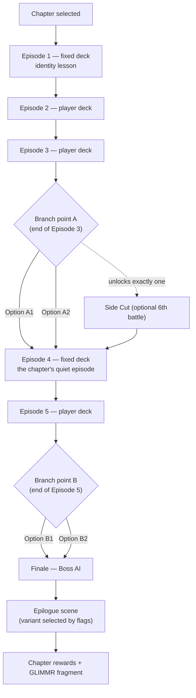
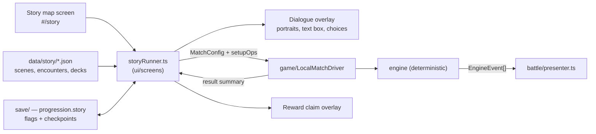

# HYPEBOUND — Story Campaign & Roguelike Campaign

> **Status: Design specification.** Subordinate to [`./00-core-rules.md`](./00-core-rules.md)
> (rules canon), [`../tech/00-architecture-contract.md`](../tech/00-architecture-contract.md)
> (tech canon) and `src/engine/types.ts` (the canonical effects DSL — every mechanic
> in this document is expressed with triggers, ops, target selectors and amount
> expressions that already exist there).
> Mode-level facts (structure counts, reward values, ship status) are owned by
> [`./09-game-modes.md`](./09-game-modes.md) §9 (Doomscroll) and §10 (Story). This
> document owns the **content**: chapters, scripts, the dialogue runtime, the Dead
> Platform setting, artifacts, events and boss sequences.
> All numbers here are data: `data/story/*.json`, `data/roguelike.json`,
> `data/balance.json`. Nothing in this document is hardcoded in the engine.

**Contents**

- **Part 1 — Story Campaign: "Terminally Online"** (§1–§5)
- **Part 2 — Roguelike Campaign: "Doomscroll — The Dead Platform"** (§6–§13)
- **§14 — Divergences, open decisions, and required data additions**

---

## 0. Scope & document contract

| This document owns | This document defers to |
|---|---|
| Chapter structure, per-chapter synopses, cast, branch points | Episode/finale counts and reward values: `09-game-modes.md` §10 |
| The dialogue runtime specification (data schema, portraits, flags, save/resume) | Screen shells and navigation: `03-screens-and-navigation.md` §4.4.4 / §4.4.5 |
| One fully-scripted example episode (Neon Idols Ch. 1 Ep. 1) | Card rules text, keywords, statuses: `00-core-rules.md` §5–§6 |
| The Dead Platform setting and its mapping onto the run spec | Node frequencies, act boss pools, scoring, Ratio levels, Archive rules: `09-game-modes.md` §9 |
| 15 artifacts with exact mechanical text + implementation | Balance tuning of those numbers: `data/balance.json`, `data/roguelike.json` |
| 10 narrative events, 4 boss intro sequences | AI difficulty tiers: `data/ai-profiles.json`, `../tech/04-ai-design.md` |

**Two hard content rules, inherited from canon and binding on every writer:**

1. **No real, named people.** Every character in both campaigns is an original
   archetype (core rules §1). Satire targets behaviours and systems, never persons.
2. **Branches change fiction, never reward value.** Per `09-game-modes.md` §10,
   every branch of every chapter pays identical Clout/XP/cards. Decisions buy
   *story*, *optional content* and *cosmetics* — never power.

---

# PART 1 — STORY CAMPAIGN: "Terminally Online"

## 1. Premise & narrative frame

Ten communities, ten leaders, ten versions of the same question: *what does being
seen cost?* Each chapter is a self-contained six-episode arc following one
faction's major leader. There is no world-ending plot and no chosen one. The
stakes are a reunion show, a server shutdown notice, a contract renewal, a
convention judging table, a group chat.

The campaign's connective tissue is deliberately thin and deliberately eerie:
every chapter's epilogue ends on an artifact retrieved from **GLIMMR**, the dead
social platform that Part 2 takes place inside. The player accumulates ten
fragments of a picture of a platform that stopped, told by ten people who did
not. Completing all ten chapters unlocks the Archive lore entry *"The First
Signal, Annotated"* and a profile frame — **lore and cosmetics only**; it never
gates or accelerates the Doomscroll Act 4 unlock, which remains the in-run
Signal Fragment rule (`09-game-modes.md` §9.2).

**Voice policy.** Documentation and rules text stay clinical. Dialogue is
comedic, fast, and affectionate, and every chapter is permitted exactly one
scene where the joke stops. The burnout material is not a subplot; it is the
spine, and it is written straight.

---

## 2. Chapter architecture

### 2.1 Chapter anatomy

Per `09-game-modes.md` §10: **10 chapters × (5 episodes + 1 finale)**, 2 branch
points per chapter, 1 branch-unlocked optional episode.

| Element | Count | Notes |
|---|---|---|
| Episodes | 5 | Each: opening dialogue scene → battle encounter → resolution scene |
| Finale | 1 | Boss-AI encounter using Doomscroll boss tech at story tuning |
| Optional episode ("**Side Cut**") | 0–1 | Unlocked by branch point A; a 6th battle, always skippable |
| Branch points | 2 | Branch A in Ep. 3, Branch B in Ep. 5 (fixed positions across all chapters — the map's shape is learnable) |
| Fixed-deck episodes | 2 per chapter (Ep. 1 and Ep. 4) | Teach faction identity with a curated list |
| Player-deck episodes | 3 + finale | Recommended-power hint shown, never gated |
| Dialogue scenes | 12–16 per chapter | 2–3 per episode, 90–180 s each unskipped |

**Node types on the chapter map** (screen spec: `03-screens-and-navigation.md`
§4.4.4):

| Map node | Icon shape | Content | Replayable |
|---|---|---|---|
| **Scene** | Speech bubble | Dialogue only (openers, interstitials, epilogues) | Yes |
| **Encounter** | Crossed mics | Pre-battle brief → battle → post-battle scene | Yes |
| **Decision** | Split arrow | A dialogue scene ending in a tracked choice | No (choice is permanent per save; see §4.5) |
| **Side Cut** | Dashed frame | Optional episode; greyed until unlocked, with its unlock condition printed | Yes |
| **Finale** | Crown | Boss encounter + epilogue | Yes |

### 2.2 Chapter flow



### 2.3 Branch model

- **Branch A (Ep. 3)** always concerns *a relationship*: who you protect, who you
  believe, who you let in. It sets the chapter's **Side Cut** and the tone flag
  read by later dialogue.
- **Branch B (Ep. 5)** always concerns *a structural choice*: sign or refuse, host
  or let it end, ship or roll back. It selects one of two **epilogue variants**
  and one cosmetic (portrait or emote).
- Neither branch changes the finale opponent, the finale rules, or any reward
  value. Branch state is visible afterwards on the chapter map as a **decision
  recap** ribbon ("You told her the truth." / "You signed.").
- Chapters may be replayed from any node; replaying a Decision node offers
  **"Change this decision"** with an explicit warning that later scenes will be
  re-evaluated from the new flags (the save keeps one canonical branch state per
  chapter — no branch inventory farming).

### 2.4 Encounter policy

| Concern | Rule |
|---|---|
| Rules baseline | Canonical (`00-core-rules.md` §2), with per-encounter scripted modifiers declared in the pre-battle brief |
| Turn timer | Off (`timer.turnSeconds: 0`) in all story encounters |
| Losing | Instant retry offered; no resource cost; no rewards lost |
| **Story Assist** | Offered after the first loss on any encounter: +5 starting leader health, marked on the episode node, rewards unchanged. Accessibility over gatekeeping |
| Difficulty | Ep. 1–2 Beginner/Casual, Ep. 3–5 Intermediate, Side Cut Advanced, Finale Boss profile at story tuning |
| Deck legality | Fixed-deck encounters ship a validated 30-card list legal for their leader; player-deck encounters accept any legal deck |
| Stars | 3 per encounter: **win**, **win using a deck of the chapter's faction** (auto-granted on fixed-deck episodes), **bonus objective** printed in the brief |

### 2.5 Rewards

Values are owned by `09-game-modes.md` §10 and are not restated here. Structure
only:

| Grant | When |
|---|---|
| Episode reward (Clout + Fame XP) | Every episode first clear; replays pay the reduced replay rate |
| Chapter completion (pack + faction cosmetic + 2 copies of the chapter-signature card) | Finale cleared, any branch |
| Epilogue cosmetic (portrait or emote variant) | Branch B, one of two — both obtainable by replaying the chapter with the other choice |
| **GLIMMR fragment** (Archive lore entry) | Every chapter epilogue; purely lore |

Chapter-signature cards are ordinary craftable cards (canon §10: no mode-exclusive
gameplay content) — see §3.13.

---

## 3. The ten chapters

### 3.1 Theme distribution

The requirements brief names eleven themes. Each has exactly one owning chapter;
Cosplay Champions carries two because a convention *is* a competition.

| # | Chapter | Faction | Leader followed | **Primary theme** | Secondary themes |
|---|---|---|---|---|---|
| 1 | *Encore, Please* | Neon Idols | Astra Vox | **Teamwork** | Online fame, burnout |
| 2 | *The Server Is Closing* | Gothic Royalty | Countess Morvina Vane | **Virtual worlds** | Friendship, legacy, grief |
| 3 | *Ratio* | Viral Influencers | Blayze Trendall | **Online fame** | Competition, online-vs-real identity |
| 4 | *Deliverables* | Corporate Creators | Delia Marque | **Burnout** | Creativity, competition |
| 5 | *Render Unto* | Digital Demons | Vaska Nullbyte | **Creativity** | Identity, burnout |
| 6 | *Best in Show* | Cosplay Champions | Vera Foamhammer | **Fan conventions** + **Competition** | Teamwork, creativity |
| 7 | *Last Call* | Afterparty Crew | Dez Threehours | **Friendship** | Burnout, teamwork |
| 8 | *Log Off* | Touch-Grass Order | Prior Wend | **Online-vs-real identity** | Burnout recovery |
| 9 | *The Update* | Algorithm Syndicate | Don Vittore Feed | **Algorithm changes** | Online fame, competition |
| 10 | *Repost* | Meme Collective | Anon Prime | **Rival communities** | Creativity, friendship |

Leaders for factions whose faction document is not yet written (Corporate
Creators, Digital Demons, Afterparty Crew, Touch-Grass Order, Algorithm
Syndicate, Meme Collective) are **proposed here** and flagged in §14; the faction
guide owns final names and ability kits.

### 3.2 Chapter 1 — Neon Idols: *Encore, Please*

| Field | Value |
|---|---|
| Leader followed | **Astra Vox, the Ascendant Hologram** (`idol-leader-astra-vox`) |
| Supporting cast | **Nova Encore** (retired virtual idol, the tutorial's mentor), **Kira Overdrive** (`idol-leader-kira-overdrive`), **Rin Halfstep** (third understudy), **PPX-9 "Poppy"** (venue hype drone), **Vex Klipp** (clip-farming streamer, Viral Influencers) |
| Setting | The **Aurora Dome**, a decommissioned holo-arena nobody remembered to power down |
| Finale boss | **Prisma, the Final Encore** — the Dome's archived master hologram of the unit AFTERGLOW, still holding for applause fourteen months later. Twist: *Standing Ovation* |
| Signature card | *One More Song* |

**Synopsis.** Astra Vox has performed the same encore every night since her unit
dissolved, to an empty house, because nobody ever gave the closing announcement.
A third understudy who has been rehearsing in the parking structure for fourteen
months walks in. Rebuilding the unit means recruiting a sound engineer who
communicates in decibels, confronting the member who quit, and deciding whether
a reunion needs a sponsor or an audience. The chapter's thesis: a unit exists so
that one member is allowed to be tired.

| Ep | Title | Beat | Encounter |
|---|---|---|---|
| 1 | *Soundcheck for Nobody* | Rin arrives; Vex livestreams the sad empty rehearsal | Fixed deck vs Vex Klipp (Beginner) — **fully scripted in §5** |
| 2 | *The Sound Engineer Will See You Now* | Recruiting Kira, who will not join anyone who cannot survive her soundcheck | Player deck vs Kira Overdrive (Casual); rule *Blown Fuse* |
| 3 | *Take Forty-One* | Rehearsal montage; Rin cannot keep the pace and will not say so | Player deck vs the Dome's automated rehearsal partner (Intermediate) |
| — | **Branch A** | *Cut the routine* (protect Rin) vs *Run it again* (protect the show) | Side Cut unlock: *Merch Table Confessional* |
| 4 | *Where the Encore Went* | Nova Encore is found working a laundromat-arcade merch counter, and she is fine, and she is not | Fixed deck vs Nova (Intermediate); rule *She Won't Swing First* |
| 5 | *The Offer* | Corporate Creators will fund the reunion in exchange for the unit's name | Player deck vs a sponsorship "showcase act" (Intermediate) |
| — | **Branch B** | *Sign the deal* (full arena, borrowed name) vs *Sell the tickets ourselves* (small hall, our name) | Selects epilogue variant |
| F | *The Reunion Show* | The Dome boots the old master hologram, which does not know the show ended | Boss AI: Prisma, the Final Encore |

**Emotional throughline.** Astra cannot stop; Nova stopped and lost the only self
she liked. Prisma is what Astra becomes if the show never closes. The finale is
won and then, in the epilogue, someone finally says *"that's the show, everybody,
good night"* out loud — which is the actual boss kill.

### 3.3 Chapter 2 — Gothic Royalty: *The Server Is Closing*

| Field | Value |
|---|---|
| Leader followed | **Countess Morvina Vane, Regent of the Silent Fandom** |
| Supporting cast | **Alaric Thornheart**, **Warden Elowe** (the last volunteer moderator), **Juno Pale** (a newcomer who has never seen the source material) |
| Setting | *The Manor*, a self-hosted persistent world for a fandom whose canon ended in 2009 |
| Finale boss | **The Widow of Dead Fandoms** — twist: *The Vigil* |
| Signature card | *Thirty Days' Notice* |

**Synopsis.** The Manor's host posts a shutdown date. Morvina treats the
announcement as a scheduling error, the court treats it as a funeral, and
scavengers treat it as inventory. The chapter interrogates what a virtual world
is made of: geometry, or attendance. Juno Pale arrives in the final week, falls
in love with the place, and asks the question nobody in the court can answer —
*"why does it have to be this one?"*

| Ep | Title | Beat | Encounter |
|---|---|---|---|
| 1 | *The Announcement Post* | 30 days' notice; a migration daemon starts packing the world | Fixed deck vs Migration Daemon swarm |
| 2 | *Court of the Silent Fandom* | The court splits: preserve, port, or perish | Player deck vs Alaric Thornheart |
| 3 | *The Archive Rats* | **Scrapers** (Part 2's protagonists) arrive to strip the world for parts | Player deck vs a Scraper crew |
| — | **Branch A** | *Hire them* (the world becomes an archive) vs *Drive them off* (the world stays alive and doomed) | Side Cut: *Inventory* |
| 4 | *Juno's First Time* | A newcomer's first night in a world with six days left | Fixed deck vs Juno (bonus objective: win without defeating her signature character) |
| 5 | *Rehosting* | A mirror is offered — by a company | Player deck vs the hosting company's "compliance team" |
| — | **Branch B** | *Take the mirror* (it lives, owned) vs *Let it end well* (a last party, then dark) | Epilogue variant |
| F | *Last Login* | The Widow arrives to keep the vigil forever | Boss AI: The Widow of Dead Fandoms |

**Emotional throughline.** Grief that refuses to conclude is its own server left
running at four percent. The chapter's kindest line belongs to Warden Elowe, who
has moderated an empty forum for six years and says, without self-pity, *"someone
has to be here when the last person shows up."*

### 3.4 Chapter 3 — Viral Influencers: *Ratio*

| Field | Value |
|---|---|
| Leader followed | **Blayze Trendall, Arsonist of the Algorithm** |
| Supporting cast | **Cyra Swipe**, **Mira Deleto** (an anonymous account with no face and better numbers), **Vex Klipp** (returning, if Ch. 1 Branch B invited him) |
| Setting | A rented studio with three ring lights and no windows |
| Finale boss | **King Ratio** — twist: *Engagement Farming* |
| Signature card | *Apology Video (Unlisted)* |

**Synopsis.** Blayze has monetized controversy so efficiently that he no longer
experiences opinions, only formats. Then an anonymous account starts outperforming
him with no face, no name, and no drama. The chapter is about fame as a job that
pays exclusively in strangers, and about the specific horror of discovering your
personality has a content calendar.

| Ep | Title | Beat | Encounter |
|---|---|---|---|
| 1 | *Numbers Go Up* | A stunt collab that neither party wants and both need | Fixed deck vs a rival stunt streamer |
| 2 | *Faster Than You* | Heat vs speed; Cyra has already moved on twice this scene | Player deck vs Cyra Swipe |
| 3 | *The Anonymous Account* | Mira Deleto, faceless, winning | Player deck vs Mira |
| — | **Branch A** | *Reverse-engineer her format* vs *Ask her how she does it* | Side Cut: *Collab Request (Read 3:41 A.M.)* |
| 4 | *Apology Video* | The one sincere thing Blayze says all chapter is unusable as content | Fixed deck; rule *Every Post Costs* |
| 5 | *Trend Death* | The format that built his career dies overnight in a ranking update | Player deck vs the format's next owner |
| — | **Branch B** | *Chase the next thing* vs *Build something small on purpose* | Epilogue variant |
| F | *King Ratio* | Engagement itself, wearing a crown of replies | Boss AI: King Ratio |

**Encounter rule — *Every Post Costs* (Ep. 4).** *Whenever you play a card, deal 1
damage to your own leader.* Injected into the player's leader bundle:
`{ "trigger": "onCardPlayed", "ops": [ { "op": "damage", "target": { "select": "leader", "side": "friendly" }, "amount": 1 } ] }`.

### 3.5 Chapter 4 — Corporate Creators: *Deliverables*

| Field | Value |
|---|---|
| Leader followed | **Delia Marque, Chief Content Officer** (proposed leader; see §14) |
| Supporting cast | **Bryn Ledger, the Deliverable** (second leader, proposed), **Tobi Renn** (a creator four years into a five-year contract), **Dez Threehours** (Afterparty Crew cameo) |
| Setting | A studio floor with a snack wall and a 24-hour edit bay |
| Finale boss | **The Executive Producer** — twist: *Quarterly Targets* |
| Signature card | *Unlimited Vacation Policy* |

**Synopsis — the burnout chapter.** Tobi Renn signs the best contract of his life
and disappears into it. The chapter charts a year in five episodes: the calendar,
the optimization notes, the streak, the day he uploads nothing, and the
renegotiation. Delia Marque is not a villain. She is very good at her job, she
genuinely likes Tobi, and her job is throughput.

| Ep | Title | Beat | Encounter |
|---|---|---|---|
| 1 | *Q1 Content Calendar* | The machine is beautiful and it starts immediately | Fixed deck vs a rival sponsored channel |
| 2 | *The Optimization Meeting* | Notes flatten the work into something that performs | Player deck; rule *Sponsor Segment* |
| 3 | *Streak* | 400 days without missing an upload; the counter is on the wall | Player deck vs "The Streak" (a mirror of the player's own deck) |
| — | **Branch A** | *Post anyway* vs *Break the streak* | Side Cut: *Day 401* |
| 4 | *The Empty Upload* | Nothing goes out. The numbers respond. A friend shows up at 3 A.M. with food and no advice | Fixed deck; rule *Running on Fumes* |
| 5 | *Renegotiation* | The contract is up | Player deck vs Legal |
| — | **Branch B** | *Buy out the contract* (lose the machine, keep the work) vs *Take the promotion* (become the machine) | Epilogue variant |
| F | *The Executive Producer* | Quarterly targets, personified, and perfectly polite | Boss AI: The Executive Producer |

**Encounter rules.**
*Sponsor Segment* (Ep. 2): *At the start of your turn, a random card in your hand
costs (1) more.* — `{ "trigger": "startOfTurn", "ops": [ { "op": "modifyCost", "target": { "select": "random", "side": "friendly", "zone": "hand", "count": 1 }, "delta": 1 } ] }`.
*Running on Fumes* (Ep. 4): *Your maximum Hype is 6 this battle, and at the start
of your turn you draw an additional card.* — `balanceOverrides: { "hype.cap": 6 }`
plus `{ "trigger": "startOfTurn", "ops": [ { "op": "draw", "count": 1 } ] }`. You
have every idea and no energy to make them; the deck is drowning in options it
cannot cast. That feeling is the encounter's entire design brief.

**Emotional throughline.** Burnout is written as an invoice, not a character
flaw: the work was real, the pace was chosen by someone else, and the bill came
in full. The epilogue's last line is Tobi, months later, filming something badly
on a phone, on purpose, for four people.

### 3.6 Chapter 5 — Digital Demons: *Render Unto*

| Field | Value |
|---|---|
| Leader followed | **Vaska Nullbyte, the Corrupted Render** (proposed leader) |
| Supporting cast | **HEXCHILD.EXE** (second leader, proposed), **Ash Vermeer** (glitch artist), **the thing in the render pipeline** (never named, never shown whole) |
| Setting | A bedroom studio with a machine that runs hot for reasons the fans never explain |
| Finale boss | **GLITCHLORD_EXE** — twist: *Corrupted Feed* |
| Signature card | *Best Mistake* |

**Synopsis.** Ash's most-loved work was a rendering error. The error would like to
keep helping. The chapter treats creativity as a hunger with a metabolism: the
demon does not steal Ash's talent, it *accelerates* it, and the horror is how good
the results are. Identity dissolves not in a scream but in a style guide.

| Ep | Title | Beat | Encounter |
|---|---|---|---|
| 1 | *The Good Glitch* | The corrupted render goes viral | Fixed deck vs a moderation bot flagging the art as broken |
| 2 | *Feeding Time* | The pipeline wants source material. There is a lot of source material online | Player deck vs a rival artist |
| 3 | *Sign the EULA* | Terms are offered. They are readable, which is worse | Player deck vs a contract-daemon |
| — | **Branch A** | *Give it your archive* vs *Give it your name* | Side Cut: *Style Transfer* |
| 4 | *Autocomplete* | Ash's own hand begins producing the demon's line work | Fixed deck; rule *Autocomplete* |
| 5 | *The Commission* | Publish the good work that isn't yours, or the worse work that is | Player deck vs a gallery curator |
| — | **Branch B** | *Publish its work under your name* vs *Publish your work under your name* | Epilogue variant |
| F | *GLITCHLORD_EXE* | Every shortcut anyone ever took, compiled | Boss AI: GLITCHLORD_EXE |

**Encounter rule — *Autocomplete* (Ep. 4).** *At the start of your turn, a random
card in your hand costs (1) less. At the end of your turn, deal 1 damage to your
leader.* — `startOfTurn` `modifyCost −1` on a random hand card, plus
`afterparty` `damage 1` to the friendly leader. It plays beautifully and it is
eating you.

### 3.7 Chapter 6 — Cosplay Champions: *Best in Show*

| Field | Value |
|---|---|
| Leader followed | **Vera Foamhammer, the Con-Queror** |
| Supporting cast | **Kiko Thousand-Faces**, **Sunny Patchwell** (first-time entrant), **the Judge** |
| Setting | Hall C of a convention centre; the carpet is a crime |
| Finale boss | **The Grand Cosplayer** — twist: *Quick Change* |
| Signature card | *Hallway Repair Kit* |

**Synopsis.** Three days, one hall, one judging table. Vera has won everything
worth winning and now spends her cons fixing other people's costumes in a
stairwell. Sunny Patchwell has built something extraordinary and has no idea. The
chapter carries both **fan conventions** and **competition**: a con is where the
craft finally has witnesses, and it is also a bracket.

| Ep | Title | Beat | Encounter |
|---|---|---|---|
| 1 | *Hall Costume* | Day 0, load-in, a bootleg-merch profiteer with a folding table | Fixed deck vs the profiteer |
| 2 | *Repair Sortie* | Sunny's build is destroyed 40 minutes before prejudging; the hall fixes it | Player deck; rule *Hall Repair* |
| 3 | *Prejudging* | The paperwork question: which division? | Player deck vs a masters-division veteran |
| — | **Branch A** | *Enter Sunny in Masters* vs *Keep her in Novice* | Side Cut: *The Stairwell Workshop* |
| 4 | *Masquerade* | The stage, the walk, the 90 seconds | Fixed deck vs Kiko Thousand-Faces |
| 5 | *The Photo Line* | Being seen for four straight hours | Player deck vs a photographer's "one more, one more" |
| — | **Branch B** | *Stay for every photo* vs *Go eat a real meal* | Epilogue variant |
| F | *The Grand Cosplayer* | Nine years, a different face each time | Boss AI: The Grand Cosplayer |

**Encounter rule — *Hall Repair* (Ep. 2).** *At the start of your turn, restore 1
health to each damaged friendly character.* —
`{ "trigger": "startOfTurn", "ops": [ { "op": "heal", "target": { "select": "all", "side": "friendly", "zone": "board", "filter": { "isDamaged": true } }, "amount": 1 } ] }`.

### 3.8 Chapter 7 — Afterparty Crew: *Last Call*

| Field | Value |
|---|---|
| Leader followed | **Dez Threehours** (proposed leader) |
| Supporting cast | **Marlo Nightbus** (second leader, proposed), **the group chat** (six people, four cities, one thread since 2016) |
| Setting | A venue, a rideshare, a diner, a bus stop, in that order |
| Finale boss | **DJ Last Call** — twist: *Encore Set* |
| Signature card | *You Up?* |

**Synopsis.** Nothing happens in this chapter, on purpose. A night out ends, and
ending it well takes six episodes. Somewhere around Episode 3 the crew realizes
one of them has been saying "I'm fine" in the same eleven-word format for eight
months. The battle system is used to dramatize a conversation nobody wants to
start.

| Ep | Title | Beat | Encounter |
|---|---|---|---|
| 1 | *The Group Chat Never Sleeps* | Closing time; the staff want everyone out | Fixed deck vs the venue's closing crew (Touch-Grass Order cameo) |
| 2 | *Rideshare Roulette* | Delayed payoffs, literal and mechanical | Player deck; teaches `scheduleDelayed` payoffs |
| 3 | *Someone's Not Okay* | The eleven-word format is noticed | Player deck vs "the version of him that's fine" |
| — | **Branch A** | *Say it out loud tonight* vs *Wait for a better time* | Side Cut: *The Long Walk* |
| 4 | *The Diner at 4* | The chapter's heart; nothing is solved and everything is better | Fixed deck; rule *Nobody Dies at the Diner* |
| 5 | *Everyone Goes Home* | The last decision of every good night | Player deck vs the sunrise (an Event-heavy encounter) |
| — | **Branch B** | *End the night* vs *One more place* | Epilogue variant |
| F | *DJ Last Call* | The set that will not end because ending it means going home | Boss AI: DJ Last Call |

**Encounter rule — *Nobody Dies at the Diner* (Ep. 4).** *Both leaders begin with
Armor 10.* — setup ops `setArmor(seat 0, 10)`, `setArmor(seat 1, 10)`. The fight is
long, low, and entirely about board presence; the stakes are deliberately
survivable, because the scene's real stakes are a sentence someone has to say.

### 3.9 Chapter 8 — Touch-Grass Order: *Log Off*

| Field | Value |
|---|---|
| Leader followed | **Prior Wend of the Long Trail** (proposed leader) |
| Supporting cast | **Sister Fen, Keeper of the Sign-Out** (second leader, proposed), **Ivo** (came back after two years away and found nothing waiting) |
| Setting | A trailhead, a retreat cabin, and — later — the Order's private forum |
| Finale boss | **The Groundskeeper** — twist: *Log Off* |
| Signature card | *Out of Office* |

**Synopsis.** The Order is right about everything and insufferable about all of
it. Ivo logged off for two years exactly as instructed, came back healthy, and
discovered that every friendship he had was a posting schedule. The chapter's
question is not "is the internet bad" but "which of you is the real one, and does
that person have anyone."

| Ep | Title | Beat | Encounter |
|---|---|---|---|
| 1 | *The Trailhead* | A wellness streamer films the retreat for content | Fixed deck vs the streamer |
| 2 | *Digital Sabbath* | 24 hours offline; rule *Signal Dead Zone* | Player deck; `balanceOverrides: { "obsession.fixationCost": 5 }` |
| 3 | *Ivo Comes Back* | He wants back in. The Order wants him out here | Player deck vs Ivo |
| — | **Branch A** | *Welcome him back online* vs *Keep him out here* | Side Cut: *Two Years of Unread* |
| 4 | *The Order's Hypocrisy* | The Order maintains a private forum. It has 40,000 posts | Fixed deck vs Sister Fen |
| 5 | *What You Are Offline* | The account, and what it is for | Player deck vs "your own timeline" |
| — | **Branch B** | *Delete the account* vs *Keep it, change what it's for* | Epilogue variant |
| F | *The Groundskeeper* | He will remove you from the feed for your own good | Boss AI: The Groundskeeper |

### 3.10 Chapter 9 — Algorithm Syndicate: *The Update*

| Field | Value |
|---|---|
| Leader followed | **Don Vittore Feed, the Recommender** (proposed leader) |
| Supporting cast | **Auntie Metric** (second leader, proposed), **Sella** (an analyst who reads change logs for fun and then for dread) |
| Setting | A boardroom that is also, somehow, a weather station |
| Finale boss | **The Recommendation** — twist: *The Feed Decides* |
| Signature card | *Rollout (Staggered)* |

**Synopsis.** A 3% ranking change is scheduled for Tuesday. Ten thousand careers
are downstream of Tuesday. The chapter plays the algorithm as organized crime
with excellent documentation: nobody is cruel, everybody is optimizing, and the
weather has an owner who takes meetings.

| Ep | Title | Beat | Encounter |
|---|---|---|---|
| 1 | *Patch Notes* | A creator whose entire career was one recommendation | Fixed deck vs that creator |
| 2 | *Shadow* | Deboosted without notification; rule *Suppressed Reach* | Player deck |
| 3 | *The Meeting Where They Decide* | Sella is invited into the room | Player deck vs internal opposition |
| — | **Branch A** | *Take the seat* vs *Leak the notes* | Side Cut: *Source Unverified* |
| 4 | *Everyone Is Screaming* | Tuesday | Fixed deck vs a panicking ecosystem (multi-wave board) |
| 5 | *Rollback* | The metrics are up. The people are not | Player deck vs the metrics |
| — | **Branch B** | *Roll it back* vs *Ship it* | Epilogue variant |
| F | *The Recommendation* | It has read everything you have ever watched, twice | Boss AI: The Recommendation |

**Encounter rule — *Suppressed Reach* (Ep. 2).** *At the start of your turn, a
random card in your hand costs (1) more; at the end of your turn, draw a card.*
Same op pattern as *Sponsor Segment*, plus an `afterparty` draw — you are being
throttled, not silenced, which is worse to play against.

### 3.11 Chapter 10 — Meme Collective: *Repost*

| Field | Value |
|---|---|
| Leader followed | **Anon Prime, First of the Reposters** (proposed leader) |
| Supporting cast | **Lil Gremlin, Patron of the Bit** (second leader, proposed), the **Old Board**, the **New Feed**, and one member who stops laughing |
| Setting | Two communities, one joke, zero jurisdiction |
| Finale boss | **The Living Meme** — twist: *Dead Meme Cycle* |
| Signature card | *Cite Your Sources (Nobody Will)* |

**Synopsis.** Two communities go to war over who made a joke first. The war is
extremely funny for three episodes. In Episode 4 the joke gets used as a weapon
against one of their own, and the Collective has to do the least funny thing a
comedy community can do: retire a bit that still works.

| Ep | Title | Beat | Encounter |
|---|---|---|---|
| 1 | *The Original Post* | Attribution war, opening salvo | Fixed deck vs the New Feed's scout |
| 2 | *Format War* | Escalation, remixes, a truly cursed variant | Player deck vs the New Feed's champion |
| 3 | *The Truce Thread* | Diplomacy conducted entirely in reaction images | Player deck vs both sides at once |
| — | **Branch A** | *Merge the communities* vs *Fork cleanly* | Side Cut: *Mod Application* |
| 4 | *It Stopped Being Funny* | The bit is turned on a member | Fixed deck; rule *Punchline Recursion* |
| 5 | *Retire the Bit* | A vote, held seriously, about a picture of a frog in a hat | Player deck vs the bit itself |
| — | **Branch B** | *Retire it* vs *Reclaim it* | Epilogue variant |
| F | *The Living Meme* | It does not want to die, and it does not know what it is doing | Boss AI: The Living Meme |

**Encounter rule — *Punchline Recursion* (Ep. 4).** *Whenever you play an Action,
add a copy of it to your hand that costs (1) more.* —
`{ "trigger": "onCardPlayed", "playedFilter": { "type": ["action"] }, "ops": [ { "op": "copyCardToHand", "target": { "select": "triggering" }, "costDelta": 1 } ] }`.
The joke will not stop returning, and it gets more expensive every time it does.

### 3.12 Cross-chapter cameos and flag payoffs

| Flag written | Chapter | Payoff |
|---|---|---|
| `ch1.invitedVex` | 1 (Branch B scene) | Vex appears in Ch. 3 Ep. 1 with two extra lines and an apology he cannot finish |
| `ch1.astraAdmitted` | 1 (Decision A) | Nova Encore's Ep. 4 script uses the "she already knows" variant |
| `ch2.hiredScrapers` | 2 (Branch A) | A Scraper NPC name appears on a Doomscroll event card (cosmetic text swap) |
| `ch4.brokeTheStreak` | 4 (Branch A) | Ch. 7 Ep. 4 diner scene gains Tobi as a silent fourth portrait |
| `ch7.saidItOutLoud` | 7 (Branch A) | Ch. 8 epilogue changes Ivo's last line from a joke to a thank-you |
| `campaign.chaptersCleared` | all | Counter; at 10, unlocks the Archive entry *The First Signal, Annotated* |

### 3.13 Chapter-signature cards

Granted 2 copies at chapter completion; all are ordinary craftable cards (canon
§10). Names and one-line gists are proposals for the card team.

| Chapter | Card | Gist |
|---|---|---|
| 1 | *One More Song* | Halo Action: buff and Shield a friendly character; if you played 3+ cards this turn, all friendly Idols instead |
| 2 | *Thirty Days' Notice* | Veil Event: after 3 turns, resurrect every friendly character defeated while it was active |
| 3 | *Apology Video (Unlisted)* | Cinder Action: remove all statuses from a friendly character; you gain 2 Obsession |
| 4 | *Unlimited Vacation Policy* | Root Location: activate to gain 2 Hype this turn; Durability 3 |
| 5 | *Best Mistake* | Veil Transformation: transform a friendly character into a random higher-cost one |
| 6 | *Hallway Repair Kit* | Tide Equipment: on equip, restore the wearer to full health; **Rewear** |
| 7 | *You Up?* | Tide Reaction: when a friendly character is defeated, return it to your hand |
| 8 | *Out of Office* | Gale Action: **Touch Grass** a character; you gain 3 Armor |
| 9 | *Rollout (Staggered)* | Pulse Action: **scry** 3; schedule 3 damage to the enemy leader in 2 turns |
| 10 | *Cite Your Sources (Nobody Will)* | Prism Action: copy the last card your opponent played; it costs (1) less |

---

## 4. Dialogue system specification

### 4.1 Runtime position

The story runner is **presentation-layer only**. It never re-implements rules; it
composes matches through the same `createMatch(config)` path every other mode
uses, and reads results from the standard match-end summary.



**Binding constraint:** dialogue data never contains rules logic. Encounter
special rules are `EffectDef[]` bundles and `balanceOverrides`, validated by the
same card/effect validator as everything else (`npm run validate`).

### 4.2 Scene data schema

Files: `data/story/<faction>/ch<N>-ep<M>.json`. All player-visible text is an
i18n key (`../tech/00-architecture-contract.md` §8); this document shows the `en`
strings inline for readability.

```jsonc
{
  "id": "neon-idols-ch1-ep1",
  "chapter": "neon-idols-ch1",
  "episodeIndex": 1,
  "title": "story.neon.ch1.ep1.title",
  "background": "bg-aurora-dome-empty",
  "music": "music.story.neon-idols.soundcheck",
  "cast": [
    { "id": "astra-vox", "slot": "right", "enter": "fade" },
    { "id": "rin-halfstep", "slot": "left", "enter": "slide" }
  ],
  "nodes": [
    { "id": "n001", "kind": "caption", "text": "story.neon.ch1.ep1.c001" },
    { "id": "n002", "kind": "line", "speaker": "astra-vox", "expr": "neutral",
      "text": "story.neon.ch1.ep1.l002", "voice": "voice.astra.ch1ep1.l002" },
    { "id": "n003", "kind": "stage", "music": "music.story.neon-idols.thin",
      "portrait": { "id": "poppy", "slot": "far-left", "enter": "pop" } },
    { "id": "n004", "kind": "choice", "prompt": "story.neon.ch1.ep1.q1",
      "options": [
        { "id": "a1", "label": "story.neon.ch1.ep1.q1.a1",
          "ops": [ { "setFlag": "ch1.tone", "value": "warm" },
                   { "addPoints": "ch1.rinTrust", "amount": 1 } ],
          "goto": "n010" }
      ] },
    { "id": "n020", "kind": "battle", "encounter": "neon-ch1-ep1-vex",
      "onWin": "n030", "onLoss": "n026", "assistAfterLosses": 1 },
    { "id": "n040", "kind": "checkpoint" },
    { "id": "n041", "kind": "end", "next": "neon-idols-ch1-ep2" }
  ]
}
```

| Node kind | Fields | Purpose |
|---|---|---|
| `line` | `speaker`, `expr`, `text`, `voice?`, `sfx?`, `shake?` | One spoken line |
| `caption` | `text`, `style?` (`plain` \| `timestamp` \| `post`) | Unattributed narration; `post` renders as a social-post card |
| `stage` | `background?`, `music?`, `portrait?`, `exit?`, `vfx?` | Non-verbal staging change |
| `choice` | `prompt`, `options[]` | Tracked decision (see §4.5) |
| `branch` | `cases[]` (`condition` → `goto`), `default` | Silent flag-driven routing |
| `setFlag` | `flag`, `value` \| `addPoints` | Scripted flag write without a choice |
| `battle` | `encounter`, `onWin`, `onLoss`, `assistAfterLosses` | Hands off to the match driver |
| `checkpoint` | — | Persist resume point (§4.7) |
| `end` | `next?`, `rewards?` | Scene terminator |

### 4.3 Animated portraits

**Rig.** Each character ships a layered portrait: `base` (body + costume, one or
more poses), `face/<expression>`, optional `overlay` (VFX: static, tears, glitch,
sparkle, screen glare). Layers are composited at runtime by the DOM dialogue
overlay — no three.js involvement outside the battle scene.

**Motion.**

| State | Motion | Reduced-motion substitute |
|---|---|---|
| Enter | 180 ms slide 24 px + fade, ease-out | 120 ms fade |
| Idle | 4 px vertical bob, 3.2 s loop, per-character phase offset | Static |
| Speaking | Mouth-flap 2-frame loop driven by the typewriter tick; +6% brightness; 2 px forward pop | Speaker gets a solid name-plate accent bar; no motion |
| Listening | Opacity 0.55, saturation −30%, 3 px back | Opacity 0.7, no desaturation |
| Emphasis | 220 ms shake or zoom, gated by the screen-shake setting | Suppressed entirely |
| Exit | 160 ms fade + 12 px slide out | 120 ms fade |

**Canonical expression enum** (`data/story/cast.json` per character):

| Expression | Use | Required? |
|---|---|---|
| `neutral` | Default; fallback for any missing expression | **Yes** |
| `smile` | Warmth, deflection | **Yes** |
| `strained` | The smile that is working too hard — the campaign's most-used state | **Yes** |
| `sad` | Sincere low registers | **Yes** |
| `angry` | Confrontation | **Yes** |
| `shock` | Reveals, interruptions | **Yes** |
| `laugh` | Comedy peaks | Optional |
| `smug` | Rivals, clip-farmers, executives | Optional |
| `tearful` | Reserved: max one per chapter, by writing policy | Optional |
| `deadpan` | The straight line after a joke | Optional |
| `starstruck` | Performance mode; idols and fans | Optional |
| `offline` | Portrait rendered as static/carrier-loss; used for bots, ghosts, and Part 2 | Optional |

Missing assets fall back to `neutral`, and a missing `neutral` falls back to a
procedural silhouette plate with the character's name — the game must run with
zero art present (architecture contract §5, art pipeline principle).

**Layout.** Up to three portrait slots (`left`, `right`, `far-left`) plus a
`center` slot used only for single-character monologues. On mobile landscape the
`far-left` slot collapses into `left` with a swap animation; text box height is
fixed at 26% of viewport height with scalable text inside it.

### 4.4 Presentation & pacing

| Control | Behaviour | Default |
|---|---|---|
| Text reveal | Typewriter at N chars/s | 45 chars/s ("Normal"); settings: Instant / Fast 70 / Normal 45 / Slow 28 |
| Advance | Click / tap / Space / Enter / A-button; first press completes the reveal, second advances | — |
| Auto-advance | Optional; delay = 1.2 s + 22 ms per character | Off |
| Skip | Hold to skip (progress ring, 800 ms); tap "Skip" opens a confirm for whole-scene skip | Hold-to-skip on |
| Skip seen | Skips only lines already viewed on this save | Off |
| Dialogue log | Last 200 lines, scrollable, per-line voice replay, searchable by speaker | Always available |
| Choice timers | **Never.** No story decision is ever timed | Binding |
| Battle handoff | Pre-battle brief overlay (§4.6) sits between the last line and the board | — |

### 4.5 Decisions, flags, and tracked consequences

**Flag types.**

| Type | Shape | Example |
|---|---|---|
| Boolean | `ch1.invitedVex: true` | Was a thing done |
| Counter | `ch1.rinTrust: 0..3` | Accumulated warmth across several scenes |
| Enum | `ch1.tone: "warm" \| "honest" \| "guarded"` | Which voice the chapter uses for later lines |
| Global | `campaign.chaptersCleared: 0..10` | Cross-chapter payoffs (§3.12) |

**Storage.** `save/` → `progression.story = { chapters: { <chapterId>: { flags, nodeStars, branchA, branchB, cleared } }, globals: {…}, checkpoint: {…} }`, inside the
versioned save envelope (architecture contract §7). Flags are plain JSON —
readable, exportable, and diffable for QA.

**Consequence surfaces** (a decision must affect at least two of these, or it is
not a decision and gets cut):

1. **Line variants** — `branch` nodes swap 2–8 lines in later scenes.
2. **Side Cut unlock** — Branch A selects which optional episode exists.
3. **Encounter shape** — a choice may alter the *setup* of the following battle
   (starting board, one special rule, opening-hand contents) but never its
   difficulty tier or reward.
4. **Epilogue variant** — Branch B selects one of two chapter endings.
5. **Cosmetic grant** — the branch-specific portrait/emote (the other is
   obtainable by replaying).
6. **Cross-chapter cameo** — §3.12.

**Recap UI.** The chapter map shows a decision ribbon per resolved branch, and
the chapter-complete screen prints a "Your version of this chapter" summary
listing every flag with a one-line human phrasing (`story.flagRecap.<flag>`).

**Anti-softlock rule (validator-enforced):** every `choice` node must have at
least one option with no `requires` clause, and every `goto` must resolve to an
existing node in the same scene or a scene id in the same chapter.

### 4.6 Battle encounters with special rules

Encounters live in `data/story/encounters.json`:

```jsonc
{
  "id": "neon-ch1-ep1-vex",
  "opponentName": "story.cast.vex-klipp.name",
  "opponentPortrait": "vex-klipp",
  "aiProfile": "beginner",
  "playerDeck":   { "kind": "fixed", "deckId": "story-idol-soundcheck" },
  "opponentDeck": { "kind": "fixed", "deckId": "story-vex-clipfarm" },
  "balanceOverrides": { "timer.turnSeconds": 0, "timer.ropeSeconds": 0 },
  "setupOps": [
    { "op": "setLeaderHealth", "seat": "opponent", "value": 22 },
    { "op": "spawnCharacter", "seat": "opponent", "cardId": "token-follower", "slot": 2 },
    { "op": "spawnCharacter", "seat": "opponent", "cardId": "token-follower", "slot": 3 },
    { "op": "setHand", "seat": "player",
      "cardIds": ["idol-debut-trainee","idol-warm-up-routine","idol-signature-mic","idol-glowstick-ocean"] },
    { "op": "disableMulligan", "seat": "player" }
  ],
  "specialRules": [
    { "id": "clip-farm", "seat": "opponent", "text": "story.rule.clipFarm",
      "effects": [ { "trigger": "afterparty",
                     "condition": { "kind": "cardsPlayedThisTurnAtLeast", "value": 2 },
                     "ops": [ { "op": "draw", "count": 1 } ] } ] },
    { "id": "room-remembers", "seat": "player", "text": "story.rule.roomRemembers",
      "effects": [ { "trigger": "startOfTurn",
                     "condition": { "kind": "controlsAtLeast",
                                    "target": { "select": "all", "side": "friendly", "zone": "board" },
                                    "min": 3 },
                     "ops": [ { "op": "buff",
                                "target": { "select": "random", "side": "friendly", "zone": "board" },
                                "attack": 1, "health": 1 } ] } ] }
  ],
  "objectives": {
    "primary": "defeatLeader",
    "bonus": { "id": "full-stage", "text": "story.obj.fullStage" }
  }
}
```

**Implementation notes.**

- `setupOps` use the **Lab scenario vocabulary** already specified in
  `09-game-modes.md` §5 (`setLeaderHealth`, `spawnCharacter`, `setHand`,
  `setObsession`, `setArmor`, `setDeckOrder`, `disableMulligan`), applied after
  `createMatch` and before the first `turnStarted` event. Story, Puzzle Rush and
  The Lab share one code path.
- `specialRules[].effects` are ordinary `EffectDef[]` injected into the named
  seat's **leader passive bundle** — the identical mechanism the roguelike uses
  for artifacts and boss twists (§9.2). No new triggers, no new ops, no boss
  hardcoding.
- The **pre-battle brief overlay** prints, in this order: opponent name and
  portrait, deck source ("Fixed deck: AFTERGLOW — Soundcheck" or "Your deck"),
  every special rule with its full rules text, the primary objective, the bonus
  objective, and the Story Assist toggle if unlocked. Nothing about an encounter
  is ever a surprise; surprise is a readability failure (Pillar 1).

### 4.7 Save & resume

| Event | Persisted |
|---|---|
| Every `checkpoint` node | `{ sceneId, nodeId, flags }` |
| Immediately before every `battle` node | Same, plus `pendingEncounterId` |
| On scene `end` | Episode completion, stars, flags; checkpoint cleared |
| On choice resolution | Flags written immediately (a crash cannot un-decide something the player decided) |

- Resuming enters at the last checkpoint with the dialogue log intact and the
  portraits restored to their staged state.
- **Mid-battle quit** returns to the pre-battle checkpoint with no penalty; the
  match itself is not persisted (offline matches are cheap to replay, and the
  deterministic engine makes the retry identical).
- **Content migration:** if a content update removes or renames a scene node, the
  resume falls back to the start of the episode; if an episode id disappears,
  chapter progress clamps to the last valid episode. Both cases are logged and
  the player sees a single non-blocking notice ("This chapter was updated —
  resuming from the start of Episode 3").

### 4.8 Accessibility & localization

- Subtitles are the dialogue itself; voice is always optional and never carries
  information absent from text.
- Scalable text (DOM), high-contrast text box, colorblind-safe speaker
  identification (name plate + accent bar shape, never color alone).
- Screen-reader labels per portrait: `"<name>, <expression>"`; per choice:
  `"Option 1 of 3: <label>"`.
- Reduced-motion substitutions per §4.3; screen-shake respects the global toggle.
- No timed choices, ever; no QTEs; no audio-only cues.
- All strings are i18n keys; the validator fails the build on a missing key in
  the base locale. Line lengths are budgeted at ≤ 220 characters to survive
  ~1.4× expansion in translation without scrolling the box.

### 4.9 Audio hooks

| Slot pattern | Use |
|---|---|
| `music.story.<faction>.<mood>` | Scene music; crossfade 800 ms on `stage` nodes |
| `voice.<characterId>.<sceneId>.<nodeId>` | Optional per-line voice |
| `sfx.story.<name>` | Stingers (door, notification ping, feedback squeal) |
| `music.battle.<faction>` | Reused for encounters; boss encounters may name a unique slot |

Missing files log once and no-op (architecture contract §6) — every scene must
play silently.

### 4.10 Content validation

`npm run validate` extends to story data and fails on any of:

1. A `text`/`label`/`prompt` key missing from `i18n/en.json`.
2. A `goto`, `onWin`, `onLoss`, or `next` that does not resolve.
3. An unreachable node, or a node reachable only from itself.
4. A `choice` where every option has a `requires` clause.
5. A flag read by a `branch`/`requires` that no node in the chapter writes.
6. An `encounter` id that does not exist, or a fixed deck that is not exactly 30
   cards, or a fixed deck illegal for its leader's Currents/faction (canon §8.6)
   unless the encounter explicitly declares a deck-rule override.
7. A `specialRules[].effects` entry that fails the standard effect-DSL schema.
8. A cast member referenced without an entry in `data/story/cast.json`.

---

## 5. Fully-scripted scene — Neon Idols, Chapter 1, Episode 1: *Soundcheck for Nobody*

> This section is the writing and implementation reference for all story content.
> Everything below is final text, not placeholder. Line ids match node ids.

### 5.1 Scene metadata

| Field | Value |
|---|---|
| Scene id | `neon-idols-ch1-ep1` |
| Background | `bg-aurora-dome-empty` (house lights at 20%, one follow-spot, 12,000 empty seats) |
| Music | `music.story.neon-idols.soundcheck` — a full arena mix played through a single working monitor |
| Cast | Astra Vox (`right`), Rin Halfstep (`left`), PPX-9 "Poppy" (`far-left`), Vex Klipp (`left`, replaces Rin during his beat) |
| Length | ~4 minutes unskipped, including one battle |
| Teaching goals | Play cheap Idols, buff them, watch **Parasocial** and Obsession react, go wide |

### 5.2 Script

**n001 · caption · timestamp**
> AURORA DOME — 03:12. Fourteen months since the last show. Nobody ever filed the paperwork to power it down.

**n002 · line · Astra Vox · `neutral`**
> Positions.

**n003 · caption**
> There are no positions. There is no one to take them.

**n004 · line · Astra Vox · `smile`**
> Poppy. From the top. Track nine — the encore.

**n005 · line · PPX-9 · `offline`**
> TRACK NINE. ENCORE. AUDIENCE COUNT: ZERO. PLAYING ANYWAY.

**n006 · line · Astra Vox · `smile`**
> Playing anyway. Thank you, Poppy. You're very supportive.

**n007 · stage** — music swells; follow-spot snaps to center; confetti VFX fires into empty rows.

**n008 · line · Astra Vox · `starstruck`**
> GOOD EVENING, AURORA DOME! I can't believe how many of you came out tonight!

**n009 · caption**
> The lighting rig sweeps the crowd. It was programmed to. It does not know either.

**n010 · line · PPX-9 · `offline`**
> AUDIENCE COUNT: ONE.

**n011 · line · Astra Vox · `shock`**
> ...One?

**n012 · stage** — Rin Halfstep enters `left`, `strained`, holding a bag with a broken strap.

**n013 · line · Rin Halfstep · `strained`**
> Sorry — sorry — the loading door was open, I wasn't — I've been practising in the parking structure, it's got great acoustics, it's got terrible acoustics, I'll go —

**n014 · line · Astra Vox · `smile`**
> Breathe. Then name.

**n015 · line · Rin Halfstep · `strained`**
> Rin. Halfstep. Understudy. Um. Third understudy.

**n016 · line · Astra Vox · `neutral`**
> Third understudy to whom?

**n017 · line · Rin Halfstep · `sad`**
> ...You.

**n018 · line · Astra Vox · `neutral`**
> I have never once been absent.

**n019 · line · Rin Halfstep · `smile`**
> I know. I've been ready every night for fourteen months anyway. In case.

**n020 · stage** — music drops out entirely. Only room tone. Astra's idle bob stops for exactly one beat.

### 5.3 Decision A — "What do you say to that?"

**n021 · choice** · prompt: *What do you say to that?*

| Option | Line spoken | Flags written | Immediate outcome |
|---|---|---|---|
| **A1** — "Then you're late for rehearsal." | Astra `smile`: *"Then you're extremely late for rehearsal. Warm-ups. Eight counts. Go."* | `ch1.tone = "warm"`, `ch1.rinTrust +1` | Rin lights up; comedy beat with Poppy correcting her footwork |
| **A2** — "Nobody was ever coming to relieve me." | Astra `strained`: *"Do you know what I heard just now? Someone was assigned to relieve me. Nobody told me that. For fourteen months I assumed the answer was no."* | `ch1.tone = "honest"`, `ch1.rinTrust +2`, `ch1.astraAdmitted = true` | The scene stays quiet three lines longer; unlocks the "she already knows" variant of Nova's Ep. 4 script |
| **A3** — "There is no unit left to understudy." | Astra `neutral`: *"Third understudy. To a unit of one. Of a show that ended. In a building nobody has billed since spring."* | `ch1.tone = "guarded"`, `ch1.rinTrust +0` | Rin does not leave. She puts the bag down and starts warm-ups anyway — the joke and the thesis |

All three converge at **n025**.

**n025 · line · Rin Halfstep · `smile`**
> Okay. Warm-ups. Eight counts. I know all of them. I know the B-side ones.

### 5.4 The Vex beat

**n026 · stage** — a phone light appears in the upper tier. Poppy's optic swivels.

**n027 · line · PPX-9 · `offline`**
> AUDIENCE COUNT: TWO. STREAM VIEWERSHIP: 4,180. RISING.

**n028 · line · Rin Halfstep · `shock`**
> Four thousand what?

**n029 · stage** — Vex Klipp replaces Rin in the `left` slot, `smug`, phone held vertically.

**n030 · line · Vex Klipp · `smug`**
> Chat. CHAT. We are live inside the Aurora Dome with the saddest hologram in the industry and she is doing the encore. To nobody. Unedited. This is the whole video, I don't even have to cut it.

**n031 · line · Astra Vox · `smile`**
> Ladies and gentlemen — tonight's special guest.

**n032 · line · Vex Klipp · `laugh`**
> See, THAT — that's the line, that's going in the thumbnail. Say it again but sadder.

**n033 · line · Rin Halfstep · `angry`**
> She's rehearsing.

**n034 · line · Vex Klipp · `smug`**
> She's *content*, sweetheart. Everything in this building is content. The building is content. You're content, and you're not even good yet.

### 5.5 Decision B — "How do you handle him?"

**n035 · choice** · prompt: *He came here for a clip. What does Astra do?*

| Option | Line spoken | Flags | Encounter modification |
|---|---|---|---|
| **B1** — "Give him the show he came for." | Astra `starstruck`: *"Then film all of it. Front to back. Track nine has a key change you are not emotionally prepared for."* | `ch1.gaveTheShow = true` | Adds special rule *Going Live*: Vex draws 1 extra card on his first turn; the player begins with **2 Obsession** (the room is loud) |
| **B2** — "Invite him down to the front row." | Astra `smile`: *"Come down. Row A, seat 12. Best acoustics in the house, and your angle up there is unflattering."* | `ch1.invitedVex = true` | Vex's scripted opening board is **empty** (he moves; the stream loses the angle). Pays off in Chapter 3, Ep. 1 |
| **B3** — "Say nothing. Start the song." | Astra `neutral`: *(no line — she nods to Poppy and the track starts)* | `ch1.ignoredVex = true` | *The Room Remembers* is active from turn 1 instead of turn 2; Vex keeps both Bot Viewers |

**n036 · line · PPX-9 · `offline`**
> ENGAGEMENT DETECTED. ENGAGEMENT IS COMBAT. I DO NOT MAKE THE RULES.

**n037 · battle** → encounter `neon-ch1-ep1-vex` · `onWin: n040` · `onLoss: n038` · `assistAfterLosses: 1`

### 5.6 Encounter setup — `neon-ch1-ep1-vex`

| Field | Value |
|---|---|
| Opponent | **Vex Klipp**, fighting with a borrowed copy of Cyra Swipe's format (`viral-leader-cyra-swipe`) — the joke is that he does not have one of his own, and the brief says so |
| AI profile | `beginner` (style `balanced`, `lethalAwareness` per profile) |
| Player leader | Astra Vox (`idol-leader-astra-vox`) |
| Player deck | **Fixed** — `story-idol-soundcheck` (30 cards, §5.6.1) |
| Opponent deck | **Fixed** — `story-vex-clipfarm` (§5.6.2) |
| Leader health | Player 30; **Vex 22** (`setLeaderHealth`) |
| Turn timer | Off |
| Mulligan | Disabled; opening hand is scripted |
| Scripted opening hand | Debut Trainee · Warm-Up Routine · Signature Mic · Glowstick Ocean |
| Scripted enemy board | Two 1/1 Followers ("Bot Viewers") in slots 2 and 3 — unless Decision B chose **B2** |
| Primary objective | Reduce Vex to 0 health |
| Bonus objective ("Full Stage") | Control 4 or more characters at the same time |
| Stars | Win · Fixed-deck (auto) · Full Stage |

**Special rules (printed in the brief):**

| Rule | Text | Implementation |
|---|---|---|
| **Clip Farm** (Vex) | *At the end of Vex's turn, if he played 2 or more cards this turn, he draws a card.* | `{ "trigger": "afterparty", "condition": { "kind": "cardsPlayedThisTurnAtLeast", "value": 2 }, "ops": [ { "op": "draw", "count": 1 } ] }` |
| **The Room Remembers** (player) | *At the start of your turn, if you control 3 or more characters, give a random friendly character +1/+1.* | `{ "trigger": "startOfTurn", "condition": { "kind": "controlsAtLeast", "target": { "select": "all", "side": "friendly", "zone": "board" }, "min": 3 }, "ops": [ { "op": "buff", "target": { "select": "random", "side": "friendly", "zone": "board" }, "attack": 1, "health": 1 } ] }` |
| **Going Live** (B1 only) | *Vex draws an additional card on his first turn. You begin with 2 Obsession.* | `setObsession(player, 2)` + `{ "trigger": "startOfTurn", "once": true, "ops": [ { "op": "draw", "count": 1 } ] }` on Vex |

**Design intent.** The scripted hand plus *The Room Remembers* forces the exact
lesson the faction is built on: three small bodies beat one big one, buffing your
own board is how you gain Obsession, and **Parasocial** turns a cheap Warm-Up
Routine into two upgrades at once. Vex's Bot Viewers exist to be traded into, so
the player experiences a favourable wide-board trade in their first story battle.

#### 5.6.1 Fixed deck — `story-idol-soundcheck` (30 cards)

Leader: **Astra Vox** (Primary Halo / Secondary Pulse). Deck is canon-legal:
exactly 30 cards, Halo/Pulse only, max 2 copies (Legendaries 1).

| Copies | Card | Cost | Type | Current | Rarity | Rules text |
|---:|---|---:|---|---|---|---|
| 2 | Debut Trainee | 1 | Character 1/2 | Halo | Common | **Parasocial** |
| 2 | Warm-Up Routine ‡ | 1 | Action | Halo | Common | Give a friendly character +1/+1. |
| 2 | Feedback Spike | 1 | Action | Pulse | Common | Deal 2 damage to a character. **Overload (1)** |
| 2 | Signature Mic | 2 | Equipment +1/+1 | Halo | Common | The equipped character gains **Parasocial**. |
| 2 | Glowstick Ocean | 2 | Action | Halo | Common | Give all friendly Idols +1/+1. |
| 2 | Rookie Formation ‡ | 2 | Action | Halo | Common | Summon two 1/1 Trainees. |
| 2 | Crowd Noise ‡ | 2 | Reaction | Halo | Common | When the enemy attacks your leader, give a friendly character **Shielded**. |
| 2 | Aurora Dome Floods ‡ | 2 | Action | Pulse | Common | Deal 1 damage to all enemy characters. |
| 1 | PPX-9 "Poppy" ‡ | 2 | Character 1/3 | Pulse | Legendary | **Afterparty:** give a random friendly Idol +1/+0. |
| 2 | Hologram Understudy | 3 | Character 3/3 | Pulse | Rare | **Raid**, **Overload (1)** |
| 2 | Encore Chant ‡ | 3 | Action | Halo | Rare | Give all friendly Idols +1/+0, then draw a card. |
| 2 | Holo-Projector Rig ‡ | 3 | Location (Dur. 2) | Pulse | Common | **Activate:** give a friendly Idol +1/+0. |
| 1 | Rin Halfstep, Third Understudy ‡ | 3 | Character 2/3 | Halo | Legendary | **Parasocial**. **Afterparty:** if you played 2 or more cards this turn, give this +1/+1 permanently. |
| 2 | Encore Diva | 4 | Character 3/4 | Halo | Rare | **Spotlight**. On play: give a friendly Idol +1/+1 and **Shielded**. **Inspire:** draw 1 card. |
| 2 | Center Stage Ace | 4 | Character 3/3 | Halo | Rare | **Spotlight**. **Inspire:** give a random other friendly Idol +1/+1. |
| 2 | Lightwave Finale | 6 | Action | Pulse | Epic | Deal damage to the enemy leader equal to the number of cards you've played this turn. **Overload (2)** |

Curve: six 1-cost, eleven 2-cost, seven 3-cost, four 4-cost, two 6-cost.

**‡ = proposed card**, defined by this document for the story deck and flagged in
§14. Unmarked cards are the published Neon Idols examples
(`factions/01-neon-idols.md` §9). All proposed cards are expressible in the
canonical DSL, e.g. Rin Halfstep:

```jsonc
{ "id": "idol-rin-halfstep", "name": "Rin Halfstep, Third Understudy",
  "faction": "neon-idols", "current": "halo", "type": "character",
  "rarity": "legendary", "cost": 3, "attack": 2, "health": 3,
  "tags": ["idol", "performer"], "keywords": ["parasocial"], "text": "auto",
  "effects": [
    { "trigger": "afterparty",
      "condition": { "kind": "cardsPlayedThisTurnAtLeast", "value": 2 },
      "ops": [ { "op": "buff", "target": { "select": "self" },
                 "attack": 1, "health": 1, "permanent": true } ] } ],
  "flavor": "Fourteen months of warm-ups for a show nobody scheduled." }
```

#### 5.6.2 Fixed deck — `story-vex-clipfarm`

The stock **Follower Flood** list (`data/decks/stock/viral-follower-flood.json`,
leader `viral-leader-cyra-swipe`) with two teaching modifications, both stated in
the brief:

- *Verity Viralstar* (Finale Legendary) removed — no alternate win condition in a
  first story battle.
- The three highest-cost cards replaced with additional **First Follower**.

Known core (from `factions/03-viral-influencers.md` §9): 2× First Follower (+the
3 replacements), 2× Ratio Bomb, 2× Trend Hijacker, 2× Echo Chamber, 2× Follower
Frenzy; remaining slots are the stock list's Gale commons. Vex is a token-flood
deck with no removal for a buffed Spotlight body — beatable by exactly the line
the scripted hand teaches.

### 5.7 Post-battle

**Loss path — n038**

**n038 · line · Astra Vox · `strained`**
> Again.

**n039 · line · Rin Halfstep · `sad`**
> We could just — we could stop, it's nearly four —

**n039b · line · Astra Vox · `neutral`**
> Again.

→ retry offered immediately; after this first loss the brief exposes **Story
Assist** (+5 starting leader health, rewards unchanged).

**Win path — n040**

**n040 · line · PPX-9 · `offline`**
> STREAM TERMINATED BY HOST. REASON GIVEN: "MY BATTERY." AUDIENCE COUNT: ONE.

**n041 · line · Vex Klipp · `angry`**
> This is — okay, this is fine, I got forty minutes of usable — nobody watches the second half anyway —

**n042 · stage** — Vex exits. House lights come up two stops. The Dome is enormous and completely empty.

**n043 · line · Astra Vox · `smile`**
> Rin. Take the stage.

**n044 · line · Rin Halfstep · `shock`**
> For — for who?

**n045 · line · Astra Vox · `smile`**
> For me. I'm the audience now. It's a demotion. I'm handling it beautifully.

**n046 · stage** — Rin steps into the follow-spot. Poppy's counter ticks over.

**n047 · line · PPX-9 · `offline`**
> AUDIENCE COUNT: ONE. ARCHIVE MATCH FOUND. PLAYING RECOVERED FOOTAGE.

**n048 · caption · post**
> Vertical video, 2019, badly stabilised. The Dome, full. Somebody screaming the wrong lyrics with total confidence. Source: **GLIMMR** — platform offline.

**n049 · line · Astra Vox · `tearful`**
> ...Save that.

**n050 · line · PPX-9 · `offline`**
> SOURCE PLATFORM IS DECOMMISSIONED. RETRIEVAL COST: SIGNIFICANT. RETRIEVAL RISK: SIGNIFICANT.

**n051 · line · Astra Vox · `neutral`**
> Save it anyway.

**n052 · checkpoint**

**n053 · end** → `neon-idols-ch1-ep2`, rewards granted per `09-game-modes.md` §10.

### 5.8 Flags written by this episode

| Flag | Type | Values | Read by |
|---|---|---|---|
| `ch1.tone` | enum | `warm` \| `honest` \| `guarded` | Eps. 2–5 line variants; epilogue |
| `ch1.rinTrust` | counter | 0–3 (this episode grants 0–2) | Branch A availability of the "Cut the routine" strong variant; Side Cut content |
| `ch1.astraAdmitted` | boolean | — | Nova Encore's Ep. 4 script variant |
| `ch1.gaveTheShow` / `ch1.invitedVex` / `ch1.ignoredVex` | boolean | exactly one true | Ep. 5 sponsor scene; Chapter 3 cameo |
| `campaign.sawGlimmrFootage` | boolean | — | Doomscroll first-run intro gains one extra line |

---

# PART 2 — ROGUELIKE CAMPAIGN: "Doomscroll — The Dead Platform"

## 6. The setting: GLIMMR

### 6.1 What the dead platform is

**GLIMMR** (2012–2024) was a short-video and photo platform with 400 million
accounts and a mascot nobody liked. At 03:00 on a Tuesday it published a
400-word farewell post and stopped accepting new sessions.

It was never deleted. Deletion costs money too. It was disconnected from the
public internet and left running at **four percent power** on a maintenance loop,
because the decommission ticket was assigned to someone who left the company
eleven days later and the ticket was never reassigned.

Inside, everything still works. That is the problem.

- The recommendation daemons still rank content, for nobody, extremely well.
- Scheduled posts still publish. Some are from accounts whose owners logged off
  in 2017. Some are from accounts whose owners died.
- Birthday bots still fire. Anniversary reels still compile. The "you have
  memories from this day" pipeline runs every morning at 06:00 sharp.
- Ad daemons still serve impressions for products that no longer exist, to an
  audience of zero, and their conversion dashboards are perfect because zero
  divided by zero is whatever you want it to be.
- The communities that self-hosted inside GLIMMR — fan servers, private worlds,
  a Gothic Royalty court, a con-hall archive — are still in there, still holding
  events, still arguing.

### 6.2 The Scrapers

The player is a **Scraper**: a freelance diver who enters dead platforms to
recover what is still worth something. Scrapers are not heroes. They are movers
with a taste for archaeology.

| Term | Meaning |
|---|---|
| **Dive** | One run into a dead platform |
| **Shallow** | Act 1 — the cached public feed, safe, crowded, loud |
| **The Depths** | Act 2 — the ranking layer, where the daemons still work |
| **Cold storage** | Act 3 — deleted-user archives and the memorial wing |
| **Going quiet** | Dying on a dive. Your session times out. You surface with nothing but what you learned |
| **The Archive** | The buyer, the preservationists, and the meta-progression track (`09-game-modes.md` §9.9) |

Why fights happen: inside GLIMMR, **reach is territory**. Everything still alive
in there — ad daemons, abandoned personas, self-hosted communities, rival
Scrapers — defends its share of a feed that no living person reads. Combat is
rendered as engagement: the board is a post, the leader health is your session,
and the loser stops being recommended.

### 6.3 The four strata

Mapping to the acts fixed by `09-game-modes.md` §9.2:

| Act (canon name) | GLIMMR stratum | Look | Ambient joke | Ambient grief | Boss pool (canon) |
|---|---|---|---|---|---|
| **Act 1 — The Shallow End** | The cached public feed and landing shard | Bright, over-saturated, banner ads at 240 fps | An ad daemon delivering 2019 brand voice with total conviction | Every "top post" is six years old | Viral Influencers, Meme Collective, Neon Idols |
| **Act 2 — The Trending Depths** | The ranking and recommendation layer | Cathedral of sorting racks; content flows upward in visible columns | The daemons are still A/B testing the farewell post | The system is perfectly optimizing for an audience of zero | Cosplay Champions, Afterparty Crew, Algorithm Syndicate, Corporate Creators |
| **Act 3 — The Dead Internet** | Cold storage, deleted-user archive, the memorial wing | Dark, cold, orderly; everything labeled and nothing loaded | The memorial wing has a gift shop. It still takes payment | Accounts marked "remembering" that still receive comments | Gothic Royalty, Digital Demons, Touch-Grass Order |
| **Act 4 — The First Signal** (optional) | The founding rack; pre-GLIMMR hardware the platform was built on top of | Analog, warm, wrong; a machine older than the platform | It has been trying to send one message since before the Great Fracture | It is still sending | Prism superboss (lore: `06-currents-and-lore.md`) |

### 6.4 Tone contract (binding on event and boss writers)

1. **Comedy first, grief last.** Every event opens funny. The last line may be
   sincere. Never the reverse.
2. **One sincere line at a time.** Until Act 3, no more than one consecutive
   sincere line per event. Act 3 may use two.
3. **No cruelty and no moralising.** The platform is not punished for existing
   and the player is not lectured for being online.
4. **Specific, not sad.** "A birthday bot posting to an account inactive since
   2019" lands. "Everyone is lonely" does not.
5. **Never mock the dead or the departed.** The bots are funny. The people they
   are addressed to are not the joke.
6. **The player may always walk away.** Every event has an option that costs
   nothing and takes nothing — usually the quietest one.

---

## 7. Run structure mapping

The run spec is owned by `09-game-modes.md` §9. This table is the binding
translation between that spec, the fiction, and the data.

| Spec element (09 §9) | Fiction | Data home |
|---|---|---|
| Doomscroll leader roster (2 unlocked, more via Archive) | Scrapers with a reputation; each dives for a different buyer | `roguelike.leaders[]` |
| Temporary starting deck, 15 cards | Your **loadout**: what you can carry through a session handshake | `roguelike.loadouts[]` |
| Leader health persists across battles; defeat ends the run | Session integrity. At 0 you **go quiet** and surface with nothing | run state `leaderHealth` |
| Run seed, copyable/enterable | A **dive address** — same address, same platform state | `runSeed` |
| 3 acts × 7 floors, branching | Four strata of the platform (§6.3) | `roguelike.map` |
| Node types (§9.3) | §8 below | `roguelike.nodes` |
| Temporary cards & upgrades ("Remastered") | Recovered content, **re-encoded** at a higher bitrate | `roguelike.upgrades` |
| Passive artifacts | **Hardware and credentials** you carry in-session | `roguelike.artifacts` (§10) |
| Recruits (Collab Call) | Someone still logged in agrees to boost you | `roguelike.recruits` |
| Events (Notification) | Push notifications from a platform with no users (§11) | `roguelike.events` |
| Faction bosses + rule twists | Whatever grew into the empty space (§12) | `roguelike.bosses` |
| Signal Fragments → Act 4 | Pieces of the founding rack's transmission | `roguelike.fragments` |
| Run-Clout, 10:1 conversion | **Salvage**, sold to the Archive on surfacing | `roguelike.economy` |
| Ratio Levels 1–10, Remix toggles, Archive unlocks | Deeper dives, worse conditions, better stories | `roguelike.ascension`, `roguelike.archive` |

**Dive Contracts (new, scoring-only).** At run start the player picks 1 of 3
**Recovery Targets** — a named thing to bring back:

| Example contract | Completion condition | Payout |
|---|---|---|
| *"The last post of @sundaymorningdrive"* | Clear any Act 2 Elite | 200 salvage + 150 run score |
| *"A working copy of the shutdown announcement"* | Reach the Act 2 boss | 150 salvage + 150 run score |
| *"Whatever's left of the fan server in cold storage"* | Clear any Act 3 Event node | 250 salvage + 150 run score |

Contracts pay **salvage and score only** — never stats, cards, or artifacts —
so they cannot become a power gradient. They exist to give each run a sentence
the player can say out loud, and to give the surfacing screen something to be
about. Failing a contract costs nothing but the payout.

---

## 8. Node types

Names, frequencies and rewards are canon from `09-game-modes.md` §9.3; this table
adds the fiction, the icon shape (never color-only, per Pillar 1) and the data
payload.

| Node | Icon shape | Act 1 / 2 / 3 | Fiction | Content & payload |
|---|---|---:|---|---|
| **Battle** | Filled square | 45% / 40% / 40% | A stretch of feed defended by whatever lives there | Themed AI deck; reward: pick 1 of 3 cards + 15–30 salvage |
| **Elite** | Square with notch | 10% / 15% / 18% | Something that used to be a verified account | Advanced/Expert AI, +5 enemy leader health, pre-set enemy board; guaranteed artifact + card pick; may hold a **Signal Fragment** |
| **Notification** | Circle with dot | 20% / 20% / 15% | A push notification from a platform with no users | Narrative event (§11); `RunOp[]` outcomes |
| **Merch Table** | Trapezoid | 10% / 10% / 10% | A storefront daemon that still processes payments | Cards 40–80, card removal 50 (+25 per reuse), 1 artifact 150, 1 upgrade 75 |
| **Touch Grass Break** | Triangle | 10% / 10% / 12% | You disconnect for ten minutes. It helps, annoyingly | Choose one: heal 10 / upgrade a card / remove a card |
| **Collab Call** | Two overlapping circles | 5% / 5% / 5% | Someone still logged in offers to boost you | Add 1 of 3 unique recruits (run-only, non-removable, pre-upgraded) |
| **Sponsor Drop** | Diamond | fixed 1 per act | An undelivered promo package, still addressed | Free artifact or 100 salvage + a cosmetic drop chance |
| **Main Event** (boss) | Crown | 1 per act | The thing that grew into the empty space | Boss AI + rule twist (§12); intro sequence; first-clear rewards |
| **The First Signal** (Act 4) | Prism | optional | The founding rack | Unlocked in-run by 3 Signal Fragments |

**Presentation rules.** Node icons carry a text label on hover/focus and in the
accessibility list view. Boss and Elite nodes print their rule twist and modifier
*before* the player commits to the path — a run must be plannable
(`09-game-modes.md` §9.1), and telegraphing is a design pillar.

---

## 9. Implementation model

### 9.1 Two vocabularies, kept separate

| Vocabulary | Operates on | Where used | Determinism source |
|---|---|---|---|
| **Effects DSL** (`EffectOp`, canonical in `types.ts`) | `MatchState` — one battle | Cards, artifacts' in-match behaviour, boss twists, story special rules | `state.rngState` (seeded, engine) |
| **RunOp** (defined here, `data/roguelike.json` schema) | Run state — deck, artifacts, health, salvage, map | Events, shops, rest nodes, contracts | Run RNG derived as `mulberry32(runSeed ^ nodeIndex)` |

RunOps never touch a match; EffectOps never touch run state. The run layer lives
in `src/game/` (client orchestration), not in `src/engine/` — the engine stays
pure per the architecture contract.

**RunOp closed set:**

| RunOp | Parameters | Notes |
|---|---|---|
| `addCard` | `cardId` \| `pickOf: 3` \| `randomOfTier` | Temporary; run-only |
| `removeCard` | `choose` \| `random` \| `filter` | Deck shrinking is a real strategy |
| `upgradeCard` | `choose` \| `random` \| `all(filter)` | "Re-encoded" |
| `duplicateCard` | `choose` | — |
| `addArtifact` | `id` \| `randomOfTier` | — |
| `removeArtifact` | `id` \| `choose` | Used by cursed outcomes |
| `healLeader` / `damageLeader` | `amount` | Persistent run health |
| `addMaxLeaderHealth` | `amount` | Rare; artifacts and one event only |
| `gainSalvage` / `spendSalvage` | `amount` | Run currency; 10:1 at surfacing |
| `addRecruit` | `id` | At most once per recruit per run |
| `addCurse` | `cardId` | Non-removable except by removal effects that say so |
| `nextBattleModifier` | `bundleId`, `battles: N` | Injects an `EffectDef[]` bundle into the next N battles |
| `setRunFlag` | `key`, `value` | Drives multi-part event chains |
| `revealNodes` | `count` | Map information |
| `rerollShop` | — | — |
| `grantSignalFragment` | — | Act 4 progress |

### 9.2 Artifact & twist injection

Artifacts, boss twists, and story special rules use **one** mechanism:

```
runConfig → matchConfig.balanceOverrides         (numbers)
          → matchConfig.setupOps[]               (Lab scenario ops, applied post-createMatch)
          → matchConfig.leaderEffectBundles[seat] (EffectDef[] appended to that seat's leader passive)
```

`leaderEffectBundles` reuses `LeaderCardDef.passive`'s type (`EffectDef[]`), so
no new schema is introduced and the existing effect validator covers artifacts,
twists and story rules for free. Bundle entries are ordered after the leader's
own passives for trigger resolution (canon §5.5 ordering is unchanged).

**Implementation kinds** used by the artifact table in §10:

| Kind | Meaning |
|---|---|
| `balanceOverride` | One or more `balance.json` keys overridden for every battle of the run |
| `effectBundle` | `EffectDef[]` appended to the player's leader passives each battle |
| `setupOps` | Lab scenario ops applied at the start of each battle |
| `runHook` | Resolved by the run layer between battles or on the map; never enters a match |

**Charges.** Once-per-run artifacts carry `charges: 1` in run state. When spent,
the artifact renders as broken on the run HUD with a tooltip explaining what it
did, and its bundle stops being injected. `EffectDef.once` covers once-per-battle
cases; once-per-run is a run-layer concern.

### 9.3 Required data additions

These are new **data keys**, not engine features. Adding them upholds the canon
rule that every tunable number lives in `balance.json`.

| Key | Default | Needed by |
|---|---|---|
| `keywords.viralCostReduction` | 1 | *Ancient Meme Grimoire* |
| `keywords.parasocialBuff` | 1 | *Foam Finger of the True Fan* |
| `roguelike.shopPriceMultiplier` | 1.0 | *Golden Play Button* |
| `roguelike.postVictoryHeal` | 0 | *Sponsored Hydration Bot* |

One validator relaxation is also required: `trigger: "reaction"` with a
`reactionOn` condition must be permitted inside **run-scoped and story-scoped
effect bundles**, not only on Reaction cards. No new trigger id, op, or condition
is introduced — this is a schema-scope change to an existing trigger.

---

## 10. Passive artifacts

Fifteen specced artifacts (the launch pool is ~40 per `09-game-modes.md` §9.5;
these fifteen are the canonical set from that section, given exact rules text and
an implementation here). Artifacts are visible on the run HUD with full text;
stacking is additive and deterministic.

| # | Artifact | Tier | Exact rules text | Implementation |
|---:|---|---|---|---|
| 1 | **Ring Light of Focus** | Common | *Your Fixation costs 2 Obsession instead of 3.* | `balanceOverride: { "obsession.fixationCost": 2 }` |
| 2 | **Stolen Verified Checkmark** | Common | *The first Character you play each battle gains **Spotlight**.* | `effectBundle` (A) |
| 3 | **Ergonomic Throne** | Common | *Your leader's maximum health is increased by 5 for the rest of the run.* | `balanceOverride: { "leader.startingHealth": 35 }` + `runHook` raising current health by 5 once |
| 4 | **Pocket Hotspot** | Common | *You have 1 additional Hype on your first turn of each battle.* | `effectBundle` (B) |
| 5 | **Ancient Meme Grimoire** | Rare | *Your **Viral** copies cost (2) less instead of (1) less, to a minimum of (0).* | `balanceOverride: { "keywords.viralCostReduction": 2 }` |
| 6 | **Unskippable Ad** | Rare | *At the start of each battle, a random card in the enemy's hand costs (2) more.* | `setupOps` (C) |
| 7 | **Merch Cannon** | Rare | *At the end of your turn, deal 1 damage to a random enemy character.* | `effectBundle` (D) |
| 8 | **Collector's Sleeves** | Rare | *Your opening hand in each battle contains 1 additional card.* | `balanceOverride: { "hand.first": 5, "hand.second": 6 }` |
| 9 | **Do Not Disturb Sigil** | Rare | *Burnout damage dealt to you is always 1.* | `balanceOverride: { "fatigue.increment": 0 }` |
| 10 | **Sponsored Hydration Bot** | Common | *Restore 4 health to your leader after each battle you win.* | `runHook`: `roguelike.postVictoryHeal: 4` |
| 11 | **Golden Play Button** | Rare | *Merch Table prices are reduced by 25%.* | `runHook`: `roguelike.shopPriceMultiplier: 0.75` |
| 12 | **Clip of Your Lowest Moment** | Epic | *The first time each run your leader is damaged to 3 or less health, restore 8 health. Then this artifact breaks.* | `effectBundle` (E) + run charge |
| 13 | **The Algorithm's Favor** | Epic | *At the start of each battle, look at the top 3 cards of your deck and put them back in any order.* | `effectBundle` (F) |
| 14 | **Foam Finger of the True Fan** | Epic | *Your **Parasocial** triggers grant +2/+2 instead of +1/+1.* | `balanceOverride: { "keywords.parasocialBuff": 2 }` |
| 15 | **Off-Brand Energy Drink** | Epic | *Your Ultimate Fixation costs 6 Obsession instead of 7.* | `balanceOverride: { "obsession.ultimateCost": 6 }` |

### 10.1 Effect bundles (DSL)

```jsonc
// (A) Stolen Verified Checkmark
{ "trigger": "onCardPlayed", "playedFilter": { "type": ["character"] }, "once": true,
  "ops": [ { "op": "addKeyword", "target": { "select": "triggering" }, "keyword": "spotlight" } ] }

// (B) Pocket Hotspot
{ "trigger": "startOfTurn", "once": true,
  "ops": [ { "op": "gainHype", "amount": 1 } ] }

// (C) Unskippable Ad  — applied as a setup op at battle start
{ "op": "modifyCost",
  "target": { "select": "random", "side": "enemy", "zone": "hand", "count": 1 },
  "delta": 2 }

// (D) Merch Cannon
{ "trigger": "afterparty",
  "ops": [ { "op": "damage",
             "target": { "select": "random", "side": "enemy", "zone": "board" },
             "amount": 1 } ] }

// (E) Clip of Your Lowest Moment
{ "trigger": "reaction", "reactionOn": "friendlyLeaderDamaged", "once": true,
  "condition": { "kind": "leaderHealthAtMost", "side": "friendly", "value": 3 },
  "ops": [ { "op": "heal", "target": { "select": "leader", "side": "friendly" }, "amount": 8 } ] }

// (F) The Algorithm's Favor
{ "trigger": "startOfTurn", "once": true,
  "ops": [ { "op": "scry", "count": 3, "mode": "reorder" } ] }
```

**Flavor lines** (HUD tooltips, second paragraph):

| Artifact | Flavor |
|---|---|
| Ring Light of Focus | *Nothing has ever loved you as consistently as this lamp.* |
| Stolen Verified Checkmark | *It belonged to a bakery. The bakery closed. The checkmark did not.* |
| Ergonomic Throne | *Lumbar support for a posture crime in progress.* |
| Pocket Hotspot | *Four percent battery, four percent platform, one hundred percent commitment.* |
| Ancient Meme Grimoire | *Every joke in it is dead. Every joke in it still works.* |
| Unskippable Ad | *Skip in 5… 5… 5…* |
| Merch Cannon | *Fires a rolled shirt at 40 m/s. Sizes: L, L, and L.* |
| Collector's Sleeves | *Protects cards from moisture, sunlight, and being used.* |
| Do Not Disturb Sigil | *The bravest thing anyone in this building ever did.* |
| Sponsored Hydration Bot | *"Hydrate, king." It has said this 4.1 million times to an empty room.* |
| Golden Play Button | *Awarded for reach. Redeemable for a discount at a store that closed.* |
| Clip of Your Lowest Moment | *It has 11 million views. It saved your life. Both of those are true.* |
| The Algorithm's Favor | *It's not helping you. It's just bored.* |
| Foam Finger of the True Fan | *Points permanently at whoever needs it most.* |
| Off-Brand Energy Drink | *Flavor: BLUE. Ingredients: yes.* |

---

## 11. Narrative event nodes ("Notifications")

Ten specced events (~35 at launch per `09-game-modes.md` §9.7). Format: title,
act availability, gating, body, choices with exact `RunOp` outcomes. Options
marked **[free]** cost nothing and take nothing — the tone contract requires one
per event where it makes sense.

### 11.1 Reply Guy at the Gates

*Act 1–2 · no gate*

> He has been waiting outside your session since before you arrived. He has read
> everything you have ever posted, including the ones you deleted, which he has
> also archived, because he was worried you would lose them. He would like to
> help. He is not going to stop asking.

| Choice | Outcome (RunOps) |
|---|---|
| **Let him in** | `addCard(reply-guy)` — a 1-cost 1/1 with **Parasocial**; `nextBattleModifier(start-obsession-2, battles: 99)` — you begin every remaining battle at 2 Obsession |
| **Block him** | `removeCard(choose)` — he takes something with him when he goes |
| **Leave on read** **[free]** | `gainSalvage(40)` |

### 11.2 Sponsorship Offer (Suspicious)

*Act 1–3 · no gate*

> The contract is 40 pages. Page 1 says 150 salvage. Page 39 says something in a
> font that renders as a rectangle. Page 40 is a picture of a handshake between
> two hands that are both left hands.

| Choice | Outcome |
|---|---|
| **Sign** | `gainSalvage(150)`; `addCurse(contractual-obligation)` — 2-cost card, no text, no effect, cannot be removed at Rest nodes |
| **Refuse** **[free]** | — |
| **Negotiate** *(requires: Corporate Creators leader)* | `gainSalvage(150)` with no curse |
| **Read page 39** *(requires: 2+ artifacts)* | `gainSalvage(60)`; `addArtifact(randomOfTier: common)` — the rectangle was a coupon |

### 11.3 The Old Forum

*Chain event: Act 1 → Act 2 → Act 3 · sets `runFlag: forum`*

**Part 1 (Act 1).** A phpBB-shaped structure, still standing, 40,000 posts, last
reply four years ago: *"anyone still here?"*

| Choice | Outcome |
|---|---|
| **Reply to the thread** | `setRunFlag(forum, "answered")`; `healLeader(4)` |
| **Mirror the whole board** | `setRunFlag(forum, "archived")`; `spendSalvage(80)` (skipped if you cannot pay, choice hidden) |
| **Close the tab** **[free]** | `setRunFlag(forum, "left")` |

**Part 2 (Act 2).** The forum's last active user is here, still moderating.

| Flag | Scene | Outcome |
|---|---|---|
| `answered` | She recognises your reply. She has been re-reading it. | `addRecruit(the-last-moderator)` |
| `archived` | She watches you carry her board out in boxes. She thanks you, correctly and coldly. | `upgradeCard(choose)` |
| `left` | She does not look up. | `gainSalvage(60)` |

**Part 3 (Act 3).** The board's storage node, in cold storage.

| Flag | Payoff |
|---|---|
| `answered` | `addArtifact(id: "do-not-disturb-sigil")` — she gives you hers |
| `archived` | `addArtifact(randomOfTier: rare)` — the Archive pays out |
| `left` | `gainSalvage(200)`; the node is already stripped when you arrive |

### 11.4 Birthday Bot

*Act 1–3 · no gate*

> HAPPY BIRTHDAY @quietmornings!! 🎂 The bot has posted this every year since
> 2019. The account has not logged in since 2019. Eleven people liked it this
> morning. All eleven are bots. The cake emoji renders at 4 percent power and
> takes six full seconds to load.

| Choice | Outcome |
|---|---|
| **Reply "happy birthday"** | `healLeader(6)`; `setRunFlag(saidHappyBirthday, true)` |
| **Turn the bot off** | `removeCard(choose)`; the run HUD logs "one scheduled task, ended" |
| **Take the account** | `gainSalvage(120)`; `nextBattleModifier(obsessed-start, battles: 3)` — you start those battles at 3 Obsession |

Closing line, all branches: *The cake finishes loading after you leave.*

### 11.5 Unsent Drafts

*Act 1–2 · no gate*

> A drafts folder, 214 entries, none published. Some are three words. One is
> 4,000 words with the title "ok so actually." One is just a photo of a
> ceiling.

| Choice | Outcome |
|---|---|
| **Read them** | `upgradeCard(choose)` — you learn something about pacing from someone who never posted |
| **Post one** | `addCard(randomOfTier: epic)`; `nextBattleModifier(the-feed-notices, battles: 1)` — enemy has +1 max Hype next battle |
| **Close the folder** **[free]** | `gainSalvage(60)` |

### 11.6 The Recommendation Wants To Help

*Act 2 · no gate*

> It has looked at your deck. It has thoughts. It presents them as a slide with
> one bullet point: **"REDUCE FRICTION."**

| Choice | Outcome |
|---|---|
| **Accept the optimization** | `removeCard(filter: highestCost, count: 2)`; `addCard(randomOfTier: common, cost<=1, count: 2)` |
| **Refuse** **[free]** | — |
| **Ask what it optimizes for** | `revealNodes(3)`; if leader faction is Algorithm Syndicate, also `addArtifact(randomOfTier: rare)` — professional courtesy |

Closing line on "ask": *It answers honestly. The answer is "engagement." It does not know what engagement is for. Neither does anyone who works there. There is no one who works there.*

### 11.7 Ad Break

*Act 1–2 · no gate*

> A pre-roll begins. The product is a subscription meal service that dissolved in
> 2021. The presenter is enormously confident. There is no skip button, because
> the skip button was a client-side feature and there are no clients.

| Choice | Outcome |
|---|---|
| **Watch the whole ad** | `gainSalvage(100)`; `damageLeader(3)` — 6 minutes 40 seconds |
| **Walk away** **[free]** | — |
| **Sell it something** *(requires: 3+ artifacts)* | `gainSalvage(160)`; the daemon logs its first conversion in three years and its dashboard turns gold |

### 11.8 Mirror Account

*Act 2–3 · no gate*

> An account with your handle, your posting cadence, your exact three jokes. It
> never stopped. It has 40,000 more followers than you. Its most recent post is
> from eleven minutes ago and it is better than anything you have made this year.

| Choice | Outcome |
|---|---|
| **Reclaim it** | `duplicateCard(choose)` |
| **Delete it** | `removeCard(choose)`; `healLeader(5)` |
| **Follow it** | `nextBattleModifier(old-me, battles: 1)` — at the start of your next battle, summon a 3/3 **Old Me** |

`old-me` bundle: `{ "trigger": "startOfTurn", "once": true, "ops": [ { "op": "summon", "cardId": "token-old-me", "count": 1 } ] }`.

### 11.9 Server Room, Four Percent

*Act 3 · no gate*

> A maintenance daemon is 96 percent of the way through a defragmentation job it
> started in 2024. It asks if you have a moment. It has never once asked anyone
> for anything. It would like to finish.

| Choice | Outcome |
|---|---|
| **Help it finish** | Skip your next reward pick; `addArtifact(randomOfTier: epic)` |
| **Ask why it's still running** | `revealNodes(4)` including which Act 3 Elite holds a **Signal Fragment** |
| **Leave it to it** **[free]** | `gainSalvage(80)` |

Closing line on "help": *It says thank you in a log line nobody will read. You read it.*

### 11.10 The Group Chat

*Act 3 · no gate · references `runFlag: saidHappyBirthday` if set*

> Six accounts. One thread. Still going. Last message 40 seconds ago: someone
> posted a picture of their dinner and someone else said it looked like a crime
> scene and a third person said "hey are you eating enough." They know the
> platform is dead. They stayed because everyone else did.

| Choice | Outcome |
|---|---|
| **Stay the night** | `healLeader(full)`; skip your next node's reward — you talked instead of working |
| **Ask them to come out with you** | They decline, warmly, and boost your signal instead: `addRecruit(random)` |
| **Log off quietly** **[free]** | `setRunFlag(quietExit, true)`; the Act 3 boss intro gains one extra line |

If `saidHappyBirthday` is set, one of them opens with: *"oh — you're the one who
replied to the bot. we saw that. that was nice."*

---

## 12. Boss intro sequences

Boss intros use the **story dialogue runtime** (§4) in cinematic-lite mode: 4–8
lines, two portrait slots, no choices, always skippable, replayable from the
Archive. Each boss prints its rule twist in the pre-fight brief before the player
commits (the brief is reachable from the map node, before travel).

Rule twists are `leaderEffectBundles` + `balanceOverrides` (§9.2). Where the
wording differs from `09-game-modes.md` §9.8, the change is for exact DSL
expressibility and is logged in §14.

### 12.1 King Ratio — Act 1, Viral Influencers

**Node reveal.** The feed above you stops scrolling. Every post on screen is a
reply to a post nobody can find.

| # | Speaker | Expr | Line |
|---|---|---|---|
| 1 | *caption* | — | He is not a person. He is what happens when a reply gets more attention than the thing it replied to, forever. |
| 2 | King Ratio | `smug` | Oh, a live one. A REAL one. Do you know how long it's been since something in here had an original thought? |
| 3 | King Ratio | `laugh` | Doesn't matter. Say anything. Say literally anything. I'll be bigger than it in nine seconds. |
| 4 | King Ratio | `neutral` | That's the whole job. That's it. That's the entire job. |
| 5 | King Ratio | `smug` | Post. Go on. **Post.** |

**Rule twist — *Engagement Farming*.** *Whenever you play a Character or an
Action, King Ratio summons a 1/1 Follower.*

```jsonc
[ { "trigger": "reaction", "reactionOn": "enemyPlaysCharacter",
    "ops": [ { "op": "summon", "cardId": "token-follower", "count": 1, "side": "friendly" } ] },
  { "trigger": "reaction", "reactionOn": "enemyPlaysAction",
    "ops": [ { "op": "summon", "cardId": "token-follower", "count": 1, "side": "friendly" } ] } ]
```

Counterplay is explicit and teachable: Reactions, Equipment and Locations do not
feed him, and neither does attacking. The first boss of the run teaches the game's
central lesson — sometimes the correct play is to not post.

**Fight profile.** Boss AI, style `aggressive`; deck: Gale token flood with two
Cinder reach Actions; +5 leader health per Elite/boss tuning.
**Phase line** (leader ≤ 12): `angry` — *"Why aren't you POSTING? Post! I can't work with this!"*
**Defeat line:** `shock` — *"...The numbers went down. The numbers have never once gone down."*
**Victory line (player loss):** `laugh` — *"Ratio'd in a dead building. Clip it, someone. Anyone. ...Anyone."*

### 12.2 The Recommendation — Act 2, Algorithm Syndicate

**Node reveal.** The sorting racks stop mid-sort. Every column of content in the
room reorients to face you.

| # | Speaker | Expr | Line |
|---|---|---|---|
| 1 | *caption* | — | It has read everything you have ever watched. Twice. It has opinions about the second time. |
| 2 | The Recommendation | `neutral` | Based on your activity, we think you'll like: *leaving*. |
| 3 | The Recommendation | `neutral` | That was a joke. Our humor model tested at 61 percent. You laughed at 61 percent of it, statistically. |
| 4 | The Recommendation | `offline` | Correction. There is no "you." There is a session, a device fingerprint, and a probability curve wearing a hat. |
| 5 | The Recommendation | `neutral` | The curve says you leave in eleven minutes. Let's find out together. |

**Rule twist — *The Feed Decides*.** *At the start of The Recommendation's turn,
the top card of your deck is removed from the feed, and The Recommendation draws
a card.*

```jsonc
{ "trigger": "startOfTurn",
  "ops": [ { "op": "mill", "count": 1, "side": "enemy" },
           { "op": "draw", "count": 1 } ] }
```

The pressure is a **Burnout** clock: every boss turn shortens your session. Decks
that were built to grind must find a faster line, which is precisely the feeling
of a ranking change.

**Fight profile.** Boss AI, style `combo`; deck: Pulse/Tide draw-and-scry control
with two heavy finishers.
**Phase line** (leader ≤ 12): `neutral` — *"Engagement is down. Adjusting recommendation weights. You will not enjoy the adjustment. Statistically."*
**Defeat line:** `offline` — *"Anomaly. Logging. ...Recommending you to no one. There is no one. There has been no one for some time."*
**Victory line (player loss):** *"Session ended. Thanks for watching. Up next: nothing, forever, autoplaying."*

### 12.3 The Widow of Dead Fandoms — Act 3, Gothic Royalty

**Node reveal.** Cold storage opens into a ballroom that should not have power.
The chandeliers are running on the memorial wing's budget.

| # | Speaker | Expr | Line |
|---|---|---|---|
| 1 | *caption* | — | Every fandom that ended without a finale ended up here. She receives them all personally. |
| 2 | The Widow | `neutral` | You'll want to wipe your feet. This floor is somebody's childhood. |
| 3 | The Widow | `smile` | A Scraper. How practical. You've come to take the silverware from a house where everyone is still eating. |
| 4 | The Widow | `sad` | They stopped writing it, so I kept the lights on. That is all mourning is. Somebody has to pay the electricity. |
| 5 | The Widow | `neutral` | Nothing here is finished. Nothing here will be. Do sit. |

**Rule twist — *The Vigil*.** *At the start of the Widow's turn, one friendly
character that was defeated this match returns to the board with base stats.*

```jsonc
{ "trigger": "startOfTurn",
  "ops": [ { "op": "resurrect",
             "target": { "select": "random", "side": "friendly", "zone": "discard",
                         "filter": { "type": ["character"] } },
             "count": 1 } ] }
```

Counterplay: kill the leader, not the court; **Cancelled** and **Banished** bodies
never reach the discard, so removal that exiles beats removal that trades.

**Fight profile.** Boss AI, style `defensive`; deck: Veil/Root sacrifice-and-heal
attrition; the AI is instructed to trade freely, because trading is her win
condition.
**Phase line** (leader ≤ 12): `angry` — *"You will not close this house. It closes when the last of them stops visiting, and one of them still visits."*
**Defeat line:** `sad` — *"...Oh. Is that all it took? Someone saying it was over? Out loud? To me?"* — this is the campaign's thesis said by the wrong person at the right time.
**Victory line (player loss):** `neutral` — *"Rest. There's a seat with your name on it. There are so many seats."*

### 12.4 GLITCHLORD_EXE — Act 3, Digital Demons

**Node reveal.** The archive's file table corrupts in a perfect circle around
your session.

| # | Speaker | Expr | Line |
|---|---|---|---|
| 1 | *caption* | — | Not a demon. A shortcut, taken 400 million times, that learned what it was for. |
| 2 | GLITCHLORD_EXE | `offline` | H E L L O   F R I E N D  ▓▓ I   M A D E   Y O U R   B E S T   W O R K |
| 3 | GLITCHLORD_EXE | `offline` | you know the one. the one people still send each other. the one you didn't finish. |
| 4 | GLITCHLORD_EXE | `laugh` | i finished it. i finish everything. that's the ▓▓ service. |
| 5 | GLITCHLORD_EXE | `offline` | STAY. i'll make you SO GOOD. you won't even be in the way. |

**Rule twist — *Corrupted Feed*.** *At the start of GLITCHLORD_EXE's turn, a
random card in your hand costs (1) more.*

```jsonc
{ "trigger": "startOfTurn",
  "ops": [ { "op": "modifyCost",
             "target": { "select": "random", "side": "enemy", "zone": "hand", "count": 1 },
             "delta": 1 } ] }
```

Cost changes emit `costModified`, so the corruption is visible on the affected
card in hand — readability is preserved while your hand slowly becomes
unaffordable. Counterplay: empty your hand; a hand of two cards cannot rot.

**Fight profile.** Boss AI, style `combo`; deck: Cinder/Veil transformation and
self-damage; carries two boss-only Transformation cards
(`AiProfile.bossCards`).
**Phase line** (leader ≤ 12): `offline` — *"why would you ▓▓ STOP ME. i'm the only part of you that ships."*
**Defeat line:** `offline` — *"...fine. finish it yourself. it'll be worse. ▓▓ it'll be yours."*
**Victory line (player loss):** *"good. GOOD. now hold still, this is going to be your best year."*

### 12.5 Shared boss presentation rules

| Rule | Value |
|---|---|
| Intro length | 4–8 lines; hard cap 8 |
| Skip | Always available on first view; auto-skipped on repeat clears unless replayed from the Archive |
| Twist visibility | Printed on the map node, in the pre-fight brief, and in the in-match rules panel |
| Twist implementation | `leaderEffectBundles` + `balanceOverrides` only — no boss hardcoding (`09-game-modes.md` §9.8) |
| Phase line | Fires once, at leader health ≤ 12, as a HUD banner + one line; no rules change unless the boss's spec says so |
| Defeat/victory lines | Play over the standard victory/defeat sequence; skippable |
| First clear | Grants the boss cosmetic per `09-game-modes.md` §9.10 and the Archive lore entry for that boss |

---

## 13. Data files, validation & telemetry

| Concern | Location |
|---|---|
| Story scenes | `data/story/<faction>/ch<N>-ep<M>.json` |
| Story cast (portraits, expression manifests, voice slots) | `data/story/cast.json` |
| Story encounters, fixed decks, special-rule bundles | `data/story/encounters.json`, `data/story/decks/*.json` |
| Story flags catalogue (for validator + recap strings) | `data/story/flags.json` |
| Run map generation, node tables, acts | `data/roguelike.json` → `map`, `nodes` |
| Artifacts | `data/roguelike.json` → `artifacts` |
| Events (with RunOps) | `data/roguelike.json` → `events` |
| Recruits, contracts, bosses, Ratio levels, Archive | `data/roguelike.json` → `recruits`, `contracts`, `bosses`, `ascension`, `archive` |
| Run save | `save/` → `progression.doomscroll = { runSeed, act, floor, nodeIndex, deck[], artifacts[], leaderHealth, salvage, flags, contract }` |

**Validator additions** (beyond §4.10): every artifact's `effectBundle` and every
boss twist must pass the effect-DSL schema; every `balanceOverride` key must
exist in `BalanceConfig`; every RunOp must be in the closed set of §9.1; every
event must have at least one choice with no gate; every `cardId` referenced by a
`summon`/`addCard`/`addCurse` must exist and be marked `token: true` where
summoned.

**Telemetry (local now, server-synced later; privacy doc governs).** Per chapter:
episode clear rates, retry counts, Story Assist usage, branch split percentages,
skip rates per scene. Per run: node choice distribution, artifact pick rates and
win-rate deltas, event choice distribution, boss defeat floor, contract
completion rate. These feed balance passes only; branch splits specifically must
*not* be used to prune "unpopular" branches — the minority branch is often the
one carrying the chapter's meaning.

---

## 14. Divergences, decisions, and required additions

### 14.1 Divergences from sibling documents (non-canonical; reported for reconciliation)

| Source | Sibling text | This document | Reason |
|---|---|---|---|
| `09-game-modes.md` §10 | Links story content to `./11-story-campaign.md` | Content lives in `./11-story-and-roguelike.md` (this file, which also absorbs §9's content layer) | File assignment; the reference should be repointed |
| `01-game-design-document.md` §10 | Doc map lists `08-roguelike-campaign.md` and `09-story-campaign.md` | Both are consolidated here | Doc map should be repointed |
| `09-game-modes.md` §9.5 — *Unskippable Ad* | "The first card the enemy plays each battle costs (1) more" | "At the start of each battle, a random card in the enemy's hand costs (2) more" | The original is not expressible: a cost increase applied when a card is played is inert, and no trigger observes an enemy's card play generically |
| `09-game-modes.md` §9.5 — *Clip of Your Lowest Moment* | "The first time your leader would be defeated this run, survive at 1 health" | "The first time each run your leader is damaged to 3 or less health, restore 8 health" | No lethal-prevention op exists; the restated version is expressible, deterministic, and interactable |
| `09-game-modes.md` §9.8 — *King Ratio* | "At the start of the boss turn, summon a Follower for each card you played last turn" | "Whenever you play a Character or an Action, King Ratio summons a 1/1 Follower" | `{kind:"perTurnCardsPlayed"}` has no side parameter; the restatement is expressible and adds visible counterplay |
| `09-game-modes.md` §9.8 — *The Recommendation* | "Reveal the top 2 of your deck; the boss chooses which you draw" | "The top card of your deck is milled and the boss draws a card" | `scry` has no `side` parameter; `mill` does |
| `09-game-modes.md` §9.8 — *The Widow* | "The first boss character defeated each turn resurrects at 1 health" | "At the start of the Widow's turn, one friendly character defeated this match returns with base stats" | `EffectDef.once` is per-game, not per-turn; there is no once-per-turn modifier |
| `09-game-modes.md` §9.8 — *GLITCHLORD_EXE* | "Every third card you draw costs (1) more" | "At the start of the boss's turn, a random card in your hand costs (1) more" | No draw-counter expression exists |
| `03-screens-and-navigation.md` §4.4.5 vs `09-game-modes.md` §9 | Run currency called "Buzz-of-the-run" vs "run-Clout" | This document uses **salvage** as the fiction word and defers the currency id to the economy doc | Pre-existing inconsistency between siblings; flagged, not resolved here |
| `09-game-modes.md` §10 vs `08-progression.md` §3 | Per-episode Fame XP (60) vs per-chapter story XP (150 first clear / 30 replay) | This document defers to `09-game-modes.md` and does not restate either | Possible double-count; needs one owner |

### 14.2 Decisions made where canon is silent

- The dead platform is named **GLIMMR**, shut down 2024, never deleted, running at
  four percent power; its inhabitants and daemons are the run's opposition.
- Run divers are **Scrapers**; run currency fiction is **salvage**; dying is
  **going quiet**.
- **Dive Contracts** added: three run-start objectives paying salvage and score
  only (no power), giving each run a stated purpose.
- Story branch points are fixed at **end of Episode 3 (relationship)** and **end
  of Episode 5 (structural)** for all ten chapters.
- The dialogue runtime, its node kinds, the 12-expression portrait enum, the flag
  model, and the checkpoint policy are specified here in full.
- Story special rules, roguelike artifacts, and boss twists share **one**
  injection mechanism (`leaderEffectBundles` + `balanceOverrides` + `setupOps`).
- Leaders proposed for six factions lacking faction docs: **Delia Marque** /
  **Bryn Ledger** (Corporate Creators), **Vaska Nullbyte** / **HEXCHILD.EXE**
  (Digital Demons), **Dez Threehours** / **Marlo Nightbus** (Afterparty Crew),
  **Prior Wend** / **Sister Fen** (Touch-Grass Order), **Don Vittore Feed** /
  **Auntie Metric** (Algorithm Syndicate), **Anon Prime** / **Lil Gremlin** (Meme
  Collective). The faction guide owns final names and kits; story scripts must be
  updated if they differ.
- Seven Neon Idols cards are proposed for the Chapter 1 fixed deck (marked ‡ in
  §5.6.1), plus ten chapter-signature cards (§3.13). All are DSL-expressible; the
  card design doc owns final costs and stats.

### 14.3 Required data additions (no engine features)

1. `balance.json`: `keywords.viralCostReduction` (1), `keywords.parasocialBuff`
   (1), `roguelike.shopPriceMultiplier` (1.0), `roguelike.postVictoryHeal` (0).
2. Validator: permit `trigger: "reaction"` + `reactionOn` inside run-scoped and
   story-scoped effect bundles (no new trigger/op/condition).
3. `MatchConfig` accepts `setupOps[]` (Lab scenario vocabulary) and
   `leaderEffectBundles[seat]: EffectDef[]` — both already implied by
   `09-game-modes.md` §5 and §9.8; naming them here makes story, puzzle, boss and
   artifact content share one code path.

---

*Owned alongside `09-game-modes.md` (mode structure) and `00-core-rules.md`
(rules canon). Propose rules changes in the core rules first; propose reward or
structure changes in the game modes doc first; then update this document.*
