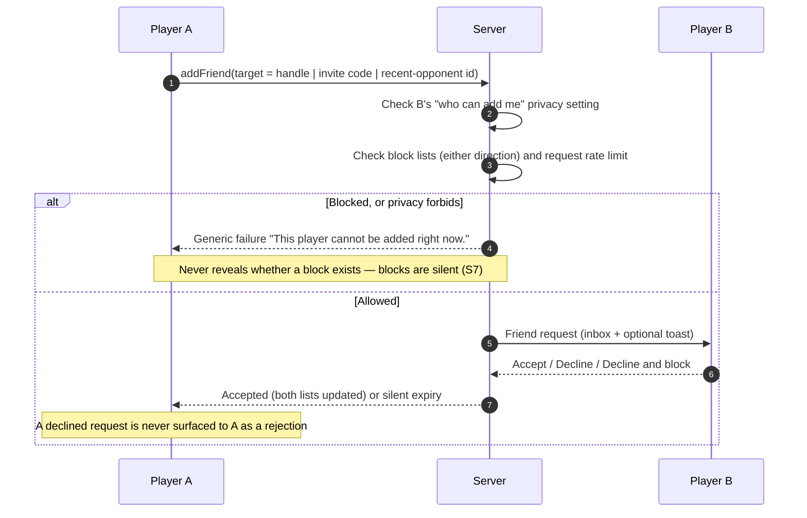
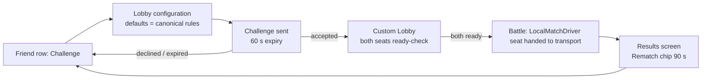
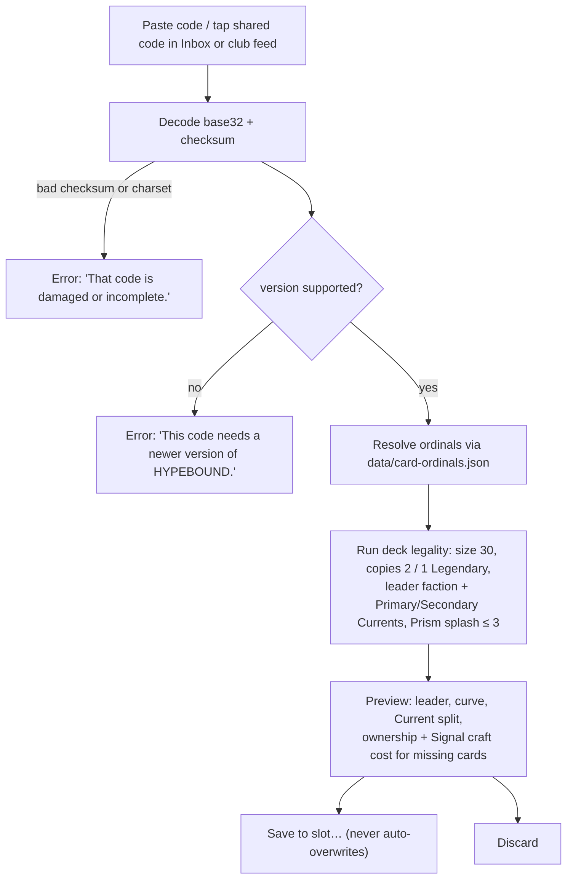
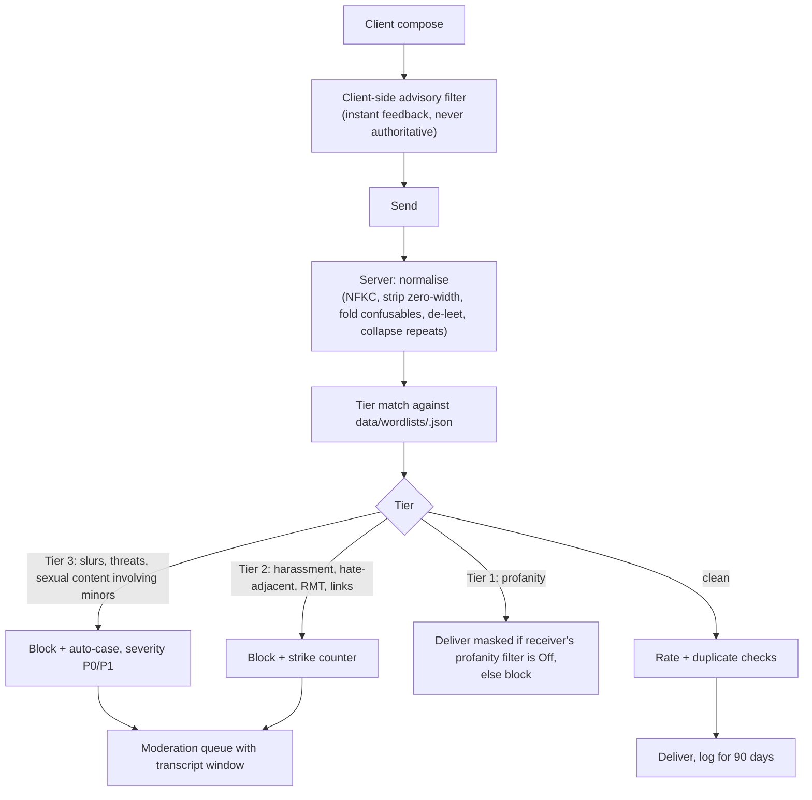
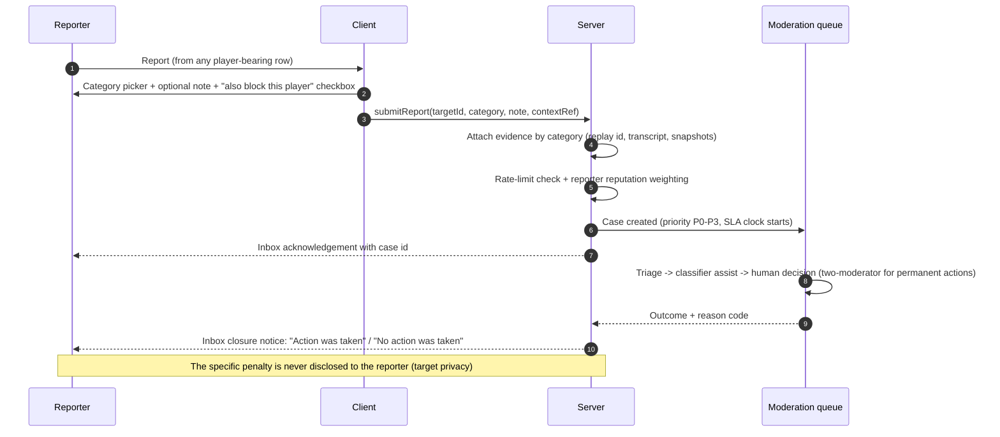

# HYPEBOUND — Social Systems & Player Safety

> **Status:** Design specification. Subordinate to `./00-core-rules.md` (rules canon),
> `../tech/00-architecture-contract.md` (tech canon) and `../../src/engine/types.ts`
> (shape canon — it wins over prose). Screen surfaces are specified in
> `./03-screens-and-navigation.md`; mode rules for challenges, spectating, raids and
> tournaments live in `./09-game-modes.md`; currencies and cosmetic emote pricing live in
> `./07-economy-and-monetization.md`. Every tunable number named here is a data value
> (`data/social.json`, `data/emotes.json`, `data/report-categories.json`,
> `data/wordlists/<lang>.json`), never a hardcoded constant.

| At a glance | |
|---|---|
| Scope | Friends, presence, challenges, deck sharing, spectating, Fan Clubs, friendly tournaments, emotes, moderated communication, reporting, blocking, privacy, minor safety, moderation tooling |
| Governing principle | **Safety by default, expression by opt-in** |
| Communication model | Preset emotes + preset phrases everywhere; filtered text chat only in specific opt-in surfaces; **no voice chat of any kind** |
| Guild name | **Fan Clubs** (max 30 members, one club per account) |
| Ship status | Online-later for everything networked; deck codes, emote loadout, block/mute storage and privacy settings ship offline-now |
| Engine boundary | Social traffic **never** enters `MatchState` or `MatchRecord` — determinism and replay integrity are untouched |

---

## 1. Binding Safety Principles

These are product-level commitments in the same class as the economy doc's fairness rules.
Each is testable and each has a named owner surface.

| # | Principle | Consequence |
|---|---|---|
| **S1** | **No unrestricted public voice chat — no voice chat at all in v1.** | The product ships with zero live-audio capture. There is no push-to-talk, no party voice, no proximity audio, no third-party voice bridge embedded in the client. The only human voice in HYPEBOUND is prerecorded, reviewed card/leader/story lines (`../art/03-audio-direction.md`). Adding live voice later would require a full re-review of this document. |
| **S2** | **Default-closed communication.** | A brand-new adult account can, out of the box, send preset emotes to friends and read club feeds it has joined. Everything richer (text chat, taunt emotes from strangers, profile visibility to everyone) is an explicit opt-in. |
| **S3** | **Safe defaults scale with age.** | Minor accounts start stricter than adult accounts (§14) and cannot be loosened from the child account alone. |
| **S4** | **Every social action is attributable, reportable, and evidenced.** | Any surface that can carry a message or a match can produce a moderation case with server-side evidence (replay id, transcript window) — never a player-supplied screenshot. |
| **S5** | **Irreversible penalties require a human.** | Automation may apply reversible actions only (mute, chat hold, feature suspension). Permanent bans, name resets on real identities, and club deletions require two-moderator review (§16). |
| **S6** | **Social systems never sell power or gate gameplay.** | Fan Club rewards, tournament prizes and friend bonuses are cosmetics, currency, or titles. No club perk changes a card, a rule, or a match outcome (canon §10). |
| **S7** | **Blocking is honored everywhere it can be honored, and the exceptions are stated to the player.** | See §12 — the single exception (competitive matchmaking pool integrity) is disclosed in the block confirmation dialog rather than silently ignored. |
| **S8** | **No dark-pattern social pressure.** | No "your club needs you" push loops, no streak-shaming, no notifications engineered to make absence feel costly. Club missions have per-member contribution caps precisely so no member can be pressured into carrying (§7.6). |

---

## 2. Identity & Presence

### 2.1 Player identity

| Element | Rule |
|---|---|
| **Display name** | 3–16 characters, Unicode letters/digits/`_`, must contain ≥1 letter. Passed through the name filter (§10.5) and an impersonation check (staff/brand-lookalike list). Changeable once per 30 days; the previous name is retained server-side for 90 days for moderation continuity. |
| **Handle** | `DisplayName#1234` — a permanent 4-digit discriminator assigned at creation. The handle is the only stable identifier shown to other players; it is never re-issued. |
| **Invite Code** | An 8-character Crockford-base32 code (e.g. `K7QM-3XZ9`) used to add friends without disclosing the handle. **Rotatable at any time** from the friends screen; rotation instantly invalidates the old code. This is the privacy-preserving default way to be added. |
| **Account ID** | Internal, never displayed. Used in moderation cases and report evidence. |
| **Title / frame / portrait** | Cosmetics (`./07-economy-and-monetization.md`); all title strings are authored content, not player text, so they need no filtering. |
| **Streamer Mode** | Client setting (`./09-game-modes.md` §7.7): hides your handle from opponents and from spectator lists, replaces it with `Player #NNNN` for the session, and suppresses incoming friend requests for the session. Does **not** hide you from moderation. |

### 2.2 Presence states

Presence is a server-published enum; the client never infers it.

| State | Shown as | Notes |
|---|---|---|
| `offline` | "Offline · last seen 2 h ago" | Last-seen granularity respects privacy setting (§13): exact / rounded to hours / hidden |
| `online` | "In the lobby" | Any non-match screen |
| `in-queue` | "Queueing — Ranked" | Suppressed entirely when Activity detail is set to "Online only" |
| `in-match` | "In battle — Neon Idols vs Digital Demons" + `Spectate` affordance when permitted | Mode name shown only if the player's spectating permission allows it |
| `in-solo` | "Playing solo content" | Never names the specific PvE mode (avoids progress-shaming) |
| `away` | "Away" | Auto after 10 minutes without input; cleared on any input |
| `dnd` | "Do not disturb" | Suppresses challenge and club invites; friend requests still queue silently |
| `invisible` | Appears `offline` to everyone | The player still sees others' true presence. Explicitly listed in the privacy screen so it is not a hidden trick |

**Presence detail setting** (per §13): `full` (state + activity line), `basic` (online/offline only), `off` (always appears offline). Default: `basic` for adults, `off` for minors.

---

## 3. Friends

### 3.1 Structure and limits

| Rule | Value | Data key |
|---|---|---|
| Friend cap | 200 | `social.friends.max` |
| Pending outgoing requests | 30 | `social.friends.maxOutgoing` |
| Pending incoming requests retained | 100, expiring after 30 days | `social.friends.incomingTtlDays` |
| Recent-opponents list | last 20 opponents, retained 24 h | `social.recentOpponents.*` |
| Favourites | 10 friends pinned to the top of the list and to the lobby strip | `social.friends.maxFavourites` |
| Requests per day | 20 sent (rate limit; abusive request spam is reportable) | `social.friends.dailyRequestCap` |

### 3.2 Friends list surface

Route `#/friends` (screens doc §4.5.1). Row anatomy, left to right:

`[portrait+frame] Handle · equipped title · [presence chip] · activity line · [Challenge] [Watch] [Share deck] [⋯]`

The `⋯` overflow contains: View profile, Add to favourites, Mute emotes, Remove friend, **Block**, **Report**. Block and Report are always exactly two taps from any player-bearing row anywhere in the product (binding UI rule, mirrored in club rosters, profiles, post-match screens and spectator lists).

Sections in fixed order: **Favourites → Online → In battle → Away → Offline → Requests (n) → Recent opponents → Add friend**.

### 3.3 Add-friend flows



A **declined** request is indistinguishable from an ignored one on the sender's side; this
removes the retaliation incentive that decline-notifications create.

### 3.4 Deck-share and challenge entry points

Every friend row exposes exactly three primary actions — **Challenge** (§4), **Watch**
(§6), **Share deck** (§5). These are the three friend interactions the requirements brief
names, and they are never buried in overflow menus.

---

## 4. Direct Challenges

### 4.1 Rules

- A challenge creates a **Custom Lobby** (`./09-game-modes.md` §17) with the challenger as
  host. Default configuration is canonical constructed rules (canon §2); the host may
  change any custom-lobby knob **before** sending, and the invited player sees the full
  configuration diff versus canonical rules before accepting.
- No rank at stake; rewards follow Friend Battles (`./09-game-modes.md` §18): first 3
  wins/day pay casual rewards, then missions only.
- Both players may enable spectating for mutual friends (§6).

### 4.2 Flow and rate limits

| Rule | Value |
|---|---|
| Challenge expiry | 60 s, visible countdown for both sides |
| Concurrent outgoing challenges | 3 |
| Re-challenge cooldown after a decline | 10 minutes to that specific player |
| Auto-decline | If the target is `dnd`, in a match, or has "Challenges: friends only" and the sender is not a friend |
| Cancel | Sender may cancel until acceptance |
| Post-match | A "Rematch" chip re-issues the same lobby configuration for 90 s after the results screen |



Challenges are also issuable from: player profile, post-match opponent line (subject to the
opponent's privacy setting), club roster, and tournament bracket rows.

---

## 5. Deck Sharing via Export Codes

Deck sharing is the one social feature that ships **offline-now**, because a deck code is
pure text produced and consumed by the client. It is specified here rather than in the deck
builder doc because it is a *sharing* surface with safety implications.

### 5.1 Code format — `HB1`

A deck code is a single case-insensitive token with no spaces, safe to paste into any chat
client, read aloud, or type on a phone. Encoding is **Crockford base32** (no `I`, `L`, `O`,
`U`; hyphens are decorative and ignored on input).

```
HB1-<base32 payload>
```

Binary payload layout (little-endian; `varint` = LEB128):

| Offset | Field | Size | Meaning |
|---|---|---|---|
| 0 | `version` | 1 byte | `0x01` for `HB1` |
| 1 | `flags` | 1 byte | bit0 `hasName`, bit1 `hasAuthor`, bit2 `hasCosmetics`, bits3–7 reserved (must be 0) |
| 2 | `contentEpoch` | 2 bytes | Epoch of `data/card-ordinals.json` the code was produced against |
| 4 | `leaderOrdinal` | varint | Leader card ordinal |
| — | `entryCount` | 1 byte | Number of distinct cards (≤ 30) |
| — | `entries[]` | varint + 1 byte each | `cardOrdinal`, `count` — **sorted ascending by ordinal** |
| — | `name` | 1 byte length + UTF-8 | Present iff `hasName`; ≤ 24 code points after sanitisation |
| — | `author` | 1 byte length + UTF-8 | Present iff `hasAuthor`; the sharer's handle, **opt-in only** |
| — | `cosmetics` | 2 varints | Present iff `hasCosmetics`; card-back and cover ordinals (ignored if unowned) |
| — | `checksum` | 4 bytes | FNV-1a 32 over every preceding byte |

A 30-card deck with a name encodes to roughly **95–130 characters**.

### 5.2 Ordinals and version resilience

- `data/card-ordinals.json` maps every card id to a permanent integer. It is **append-only**:
  ordinals are never changed and never reused, even for removed cards. `npm run validate`
  fails if an ordinal changes, is reused, or is missing for any collectible card.
- Because ordinals are stable, an old code decodes on a newer build. `contentEpoch` is
  advisory: if the code's epoch is newer than the client's, the importer warns
  *"This deck was built on a newer version — some cards may be missing."*
- Unresolvable ordinals render as a greyed **Unknown Card** slot; the deck imports as an
  invalid draft that the player can still inspect and repair.
- **Canonical ordering** (ascending ordinal, RLE counts) means two identical decks always
  produce byte-identical codes. Deck-code equality is therefore usable for duplicate
  detection and for the deck-builder "compare versions" view.

### 5.3 Import flow and validation



Exact error strings live in `i18n/en.json` under `deckcode.error.*`. The importer reports
**every** failure reason at once (a list, not the first error) so a broken code is fixable in
one pass.

### 5.4 Sharing surfaces and safety

| Surface | Ship status | Notes |
|---|---|---|
| Copy to clipboard (deck builder, profile favourite deck, replay details) | Offline-now | Always available; no account required |
| Friend share → Inbox attachment | Online-later | Rendered as a deck preview card, not raw text; "Save to slot…" routes to the deck builder |
| Club feed post | Online-later | Posting a code is a first-class post type; the code is stored structured, not as free text |
| Profile "favourite deck" | Online-later | Visible per profile-visibility setting; author attribution is on by default *here* because the profile already identifies the player |
| Tournament decklist lock | Online-later | Organiser-visible only, per `./09-game-modes.md` §19 |

**Safety rules (binding):**

1. A deck code carries **no** free text other than the deck name and the optional author
   handle. Both are sanitised (§10.5), length-capped, and rendered as text nodes — never as
   HTML, never as a link, never as a filename.
2. Author attribution is **opt-in per share** and off by default; sharing a deck must not
   silently disclose your handle to strangers.
3. Deck names in imported codes are re-filtered on **import** as well as on export, because
   a code may have been produced by a modified client. A name that fails the filter is
   replaced with `Imported Deck` and the import continues.
4. Codes are data-only. The importer builds a `DeckList` (`types.ts`) and nothing else; there
   is no code path from a deck code to script, storage, or network beyond the deck slot.

---

## 6. Spectating

Rules of the mode itself are canon-adjacent and live in `./09-game-modes.md` §20 (redacted
view, 90-second delay, tournament auto-enable). This section specifies the *social* layer.

| Concern | Specification |
|---|---|
| Permission setting | `Who can watch my matches`: **Friends** (default) / Fan Club / Off. Never "Everyone" for a non-tournament match |
| Consent visibility | Both players see the live spectator count on their leader frame; opening the count lists spectator handles unless Streamer Mode hides them |
| What a spectator sees | `redact(state, seat)` of the **spectated player only** — a spectator learns nothing the spectated player does not already know |
| Delay | 90 s default; a coaching lobby may set 0 s **only** when both players explicitly consent in the pre-match dialog |
| Spectator communication | **Emote-only**, rate-limited to 1 emote / 15 s per spectator, aggregated into a single "reactions" ribbon so 40 spectators cannot spam a player's board. Players may hide the ribbon entirely (default: shown for friends, hidden for tournaments) |
| Player controls | `Lock spectators` (no new joiners), `Remove spectator` (also mutes their reactions for that match), `End spectating` — all available mid-match from the in-match menu |
| Reporting | Every spectator row and the reactions ribbon carry Report; a spectator report attaches the live match id, which resolves to the finished `MatchRecord` |
| Rewards | None (canon: no farming vector) |

---

## 7. Fan Clubs (Guilds)

### 7.1 Shape

| Rule | Value | Data key |
|---|---|---|
| Max members | 30 | `social.club.maxMembers` |
| Clubs per account | 1 | — |
| Creation requirement | Account level 10 + tutorial complete | `social.club.createLevel` |
| Creation cost | 2,000 Clout (soft currency, `./07-economy-and-monetization.md`) | `social.club.createCost` |
| Club name | 3–20 chars, filtered, uniqueness not required | — |
| Club tag | 2–4 chars `[A-Z0-9]`, filtered, **unique**, shown beside member handles | — |
| Motto | ≤ 80 chars, filtered, editable by Leader/Mod | — |
| Leave cooldown | 24 h before joining another club (blocks club-mission farming) | `social.club.rejoinCooldownHours` |
| Inactivity | Members inactive 45 days are flagged for the roster (never auto-kicked) | `social.club.inactiveDays` |

Join modes: **Open** (instant), **Apply** (application with a 100-char filtered note; Leader/Mod approves), **Invite-only**.

### 7.2 Roles and permission matrix

| Permission | Leader | Mod | Member | Applicant |
|---|---|---|---|---|
| Read club feed | ✔ | ✔ | ✔ | — |
| Post to club feed | ✔ | ✔ | ✔ (subject to slow mode) | — |
| Pin / delete any post | ✔ | ✔ | own posts only | — |
| Mute a member in the feed (≤ 7 days) | ✔ | ✔ | — | — |
| Invite | ✔ | ✔ | ✔ (if join mode is Open) | — |
| Accept / reject applications | ✔ | ✔ | — | — |
| Kick member | ✔ | ✔ (not Mods) | — | — |
| Promote / demote Mods | ✔ | — | — | — |
| Edit name / tag / motto / banner | ✔ | ✔ (motto + banner only) | — | — |
| Schedule friendly tournaments | ✔ | ✔ | — | — |
| Disband club | ✔ (typed confirmation, 24 h delay, announced in feed) | — | — | — |
| Transfer leadership | ✔ | — | — | — |

**Succession:** if the Leader is inactive 30 days, the longest-tenured Mod may claim
leadership after a 72 h notice posted to the feed; if there are no Mods, the longest-tenured
member may.

### 7.3 Club page layout

Route `#/clubs` (screens doc §4.5.2). Regions: banner + name/tag/motto header · roster with
roles, presence and per-row Challenge/Watch/Profile/Report · **weekly club missions** panel
with shared progress bars · tournament scheduler card · club feed · club level/chest track ·
settings (Leader/Mod only).

### 7.4 Club level

Club XP comes only from completed club missions and tournament participation. Levels 1–10
unlock **capacity and cosmetics only**:

| Level | Unlock |
|---|---|
| 1 | 15 member slots, 1 weekly mission |
| 3 | 20 slots, 2 weekly missions, club banner shapes |
| 5 | 25 slots, 3 weekly missions, club emblem colour sets |
| 7 | 30 slots, auto-scheduled weekly 8-player bracket |
| 10 | Animated club banner, club title for all members (**"⟨TAG⟩ Regular"**) |

No club level ever grants currency multipliers, card power, or matchmaking effects (S6).

### 7.5 Club feed

- Post types: **text** (subject to §10), **deck code**, **replay code**, **tournament
  announcement**, **auto-events** (mission completed, tournament result, member joined).
- Text posts: ≤ 300 characters, slow mode **30 s default** (Leader may set 0/10/30/60 s),
  20 posts/member/day, edit window 2 minutes, no links (§10.5).
- Every post carries per-post **Report** and **Hide**; every member row carries **Mute**.
- Feed retention: 30 days visible to members; 90 days retained server-side for moderation
  (§16.7).
- Members whose account class forbids text chat (§14) see the feed with text posts collapsed
  behind a "Text posts are hidden on your account" notice, while structured posts (deck
  codes, results, announcements) remain fully usable. Clubs stay usable for minors.

### 7.6 Club missions

Three shared weekly goals (fewer at low club level), reset Monday 00:00 UTC, defined in
`data/missions.json` under `club.*`. **Progress is derived exclusively from `EngineEvent`
streams** (`types.ts`) so tracking is deterministic and server-verifiable:

| Mission | Goal (level 5 club) | Tracked from | Per-member cap |
|---|---|---|---|
| **Ratio the Feed** | Deal 1,200 damage to enemy leaders | `damageDealt` where `target.kind === "leader"` and target is the opponent | 15% |
| **Crossover Season** | Activate 150 Confluences | `confluenceActivated` | 15% |
| **Pure Signal** | Complete 40 Perfect Resonances | `resonanceActivated` | 15% |
| **Sold-Out Show** | Summon 900 characters | `characterSummoned` where `fromCardPlay === true` | 15% |
| **Down Bad Together** | Trigger Full Fixation 60 times | `fullFixation` | 15% |
| **Log Off** | Banish 120 characters | `characterBanished` | 15% |
| **Encore** | Win 120 matches | `matchEnded` with `winner === seat` | 15% |
| **Support Group** | Restore 2,000 Health | `healed` with `blocked === false` | 15% |

**Per-member contribution cap (binding, S8):** no member may contribute more than 15% of any
single goal. A goal therefore needs ≥7 contributing members and *cannot* be soloed — which
removes both the "carry" expectation and the pressure to grind. Progress bars show
`contributed / cap` for the viewing member and total for the club, never a per-member
leaderboard (no shaming ladder).

**Rewards** (all members who contributed ≥1 to any goal, claimed via Reward claim):

| Goals completed | Reward |
|---|---|
| 1 | 200 Clout + 50 Signal |
| 2 | 400 Clout + 100 Signal + club XP |
| 3 | 700 Clout + 150 Signal + 1 Merch Drop + rotating club cosmetic shard |

### 7.7 Club conduct

A club is accountable for its public surface. Name, tag, motto, banner and feed are all
reportable (§11). Enforcement escalates: forced name/motto reset → feed lock (7 days) →
leadership transfer → disband. Members of a disbanded club are not penalised individually
unless individually actioned, and the club-leave cooldown is waived for them.

---

## 8. Friendly Tournaments

Format rules live in `./09-game-modes.md` §19. This section specifies the social and safety
layer clubs and friends need.

| Concern | Specification |
|---|---|
| Who can create | Any Fan Club Leader/Mod; any player may create a friends-only bracket of 4 or 8 |
| Sizes | 4 (round robin), 8, 16 (single elimination) |
| Formats | Solo Queue (Bo1/Bo3), Conquest (3 decks, Bo5), Remix Cup (one modifier from `data/events.json`) |
| Scheduler | Organiser sets start time (shown in the viewer's local timezone with the UTC time beside it), check-in window (15/30/60 min), and spectating policy |
| Auto-bracket | Level 7+ clubs get one auto-created 8-player bracket per week; opting out is one toggle |
| Decklists | Lock at bracket start; organiser sees lists, opponents do not (until Conquest bans, where only the banned deck's leader is revealed) |
| No-shows | Auto-forfeit after the check-in window; three no-shows in 30 days blocks a player from joining brackets for 7 days |
| Prizes | Organiser-funded Clout pool with a hard cap (`social.tournament.maxPool`), plus system participation rewards. **Never real money, never gameplay items, never external prizes** — an organiser advertising external prizes is a reportable ToS violation (§11 category *Real-money trading*) |
| Conduct | Every bracket row carries Report; match results attach the `MatchRecord` id automatically, so collusion and stalling reports arrive with evidence |
| Spectating | Auto-enabled for bracket matches with the 90 s delay locked; participants may not disable it (it is the integrity mechanism), but Streamer Mode still hides identities |

---

## 9. Emotes

### 9.1 Model

An **emote** is a preset expression sent during a match, in a spectator ribbon, or on a
post-match screen. Two kinds share one system (`data/emotes.json`):

- **Sticker** — an animated visual with an SFX, no words.
- **Phrase** — a short authored line with a voice clip, a subtitle (accessibility doc §10),
  and a localized text string. Phrases are the "preset phrases" the requirements brief
  mandates; there is no free-text alternative in a match, ever.

```jsonc
// data/emotes.json entry
{
  "id": "emote-gg-subbed",
  "kind": "phrase",
  "category": "farewell",
  "textKey": "emote.gg-subbed",       // "gg, subbed"
  "voiceSlot": "voice.emote.gg-subbed",
  "animation": "confetti-ribbon",
  "taunt": false,
  "rarity": "common",
  "source": "default"
}
```

### 9.2 The wheel

Per screens doc §6.2: **6 equipped emotes**, opened from your leader portrait, **5 s
cooldown**. Slots are category-locked so an opponent always knows what class of message is
arriving:

| Slot | Category | Default emote (free on every account) |
|---|---|---|
| 1 | Greeting | **"hi chat"** |
| 2 | Praise | **"okay that was actually insane"** |
| 3 | Reaction | **"no way"** |
| 4 | Status | **"one sec, reading"** |
| 5 | Apology | **"my bad, misclick"** |
| 6 | Farewell | **"gg, subbed"** |

Cosmetic emotes from the shop, battle pass, mastery tracks and events (see
`./07-economy-and-monetization.md` and `./08-progression.md`) slot into their declared
category. **Taunt-class** emotes (`taunt: true` — e.g. *"Ratio'd"*, *"Touch Grass"*) may
occupy any slot but carry the taunt flag through to the receiver's filter (§9.4).

Co-op raids use a parallel **6-slot ping wheel** (`./09-game-modes.md` §16) with tactical
pings only — no emotes, no text.

### 9.3 Spam control

| Rule | Value | Data key |
|---|---|---|
| Global cooldown | 5 s | `social.emote.cooldownSeconds` |
| Per your own turn | max 3 | `social.emote.perOwnTurn` |
| During opponent's turn | max 2 | `social.emote.perEnemyTurn` |
| Hard per-match cap | 12 | `social.emote.perMatch` |
| Auto-squelch | Exceeding any cap mutes you to that opponent for the rest of the match, with a client notice; repeated auto-squelches feed the harassment classifier (§16.5) | `social.emote.squelch` |
| Spectator reactions | 1 / 15 s, aggregated (§6) | `social.emote.spectatorCooldown` |

### 9.4 Per-opponent mutability (required behaviour)

Emotes are **mutable per opponent, per match, in both directions**, with safe defaults:

| Setting | Adult default | Minor default | Effect |
|---|---|---|---|
| `Emotes from friends` | Shown | Shown | — |
| `Emotes from non-friends` | **Muted** | **Muted** | Screens doc §6.2 safe default; a "muted" indicator on the enemy portrait shows the option to unmute exists |
| `Taunt-class emotes` | Hidden from non-friends | **Hidden from everyone** | Independent of the above; a hidden taunt is not queued or replayed later |
| `Mute this opponent` | Per match, one tap on their portrait | same | Persists for the match; "Mute permanently" promotes it to a persistent per-player mute (§12) |
| `Mute all emotes` | Off | Off | Global switch in Settings → Gameplay and in the in-match menu |

Muting is **local and silent**: the sender receives no indication, so muting carries no
social cost.

### 9.5 Engine boundary (important)

`types.ts` `PlayerIntent` does **not** include an emote intent (see §17 conflict note).
Therefore:

- An emote is a transport-level social message handled in `src/net/` and rendered by
  `ui/battle/hud.ts`. It never enters `MatchState`, never produces an `EngineEvent`, and is
  never written into `MatchRecord`.
- Consequence: replays are emote-free and bit-identical; a modified client cannot use the
  emote channel to influence rules state; and emote moderation is a pure transport concern.
- Emotes sent during a match are logged server-side with the match id for 90 days so that a
  post-match report can be evidenced (§11.3).

---

## 10. Moderated Communication

### 10.1 Communication matrix

Rows are surfaces; columns are what is possible there. "Opt-in" means off until the player
turns it on in Settings → Social.

| Surface | Preset emotes | Preset phrases | Structured posts (deck/replay codes, results) | Filtered text | Voice |
|---|---|---|---|---|---|
| Match vs stranger (Casual/Ranked/Gauntlet/Remix) | ✔ (muted by default) | ✔ (muted by default) | — | **Never** | **Never** |
| Match vs friend / custom lobby | ✔ | ✔ | — | Opt-in, both sides must have it on | **Never** |
| Co-op raid | Pings only | Pings only | — | Opt-in, party-scoped | **Never** |
| Spectator ribbon | ✔ (aggregated) | — | — | **Never** | **Never** |
| Friend direct messages (Inbox) | ✔ | ✔ | ✔ | Opt-in | **Never** |
| Fan Club feed | ✔ | ✔ | ✔ | Opt-in (member) | **Never** |
| Tournament lobby | ✔ | ✔ | ✔ | Opt-in, organiser may disable | **Never** |
| Public/global channel | — | — | — | **Does not exist** | **Does not exist** |

There is no global chat, no cross-region shout channel, and no public lobby chat. If a
message can reach a stranger who did not opt in, the surface does not exist.

### 10.2 Preset phrase catalogue

The starting phrase library (localized; `data/emotes.json` entries with `kind: "phrase"`).
Phrases are deliberately incapable of expressing hostility beyond mild, in-universe swagger,
and taunt-class entries are flagged.

| Category | Phrase | Taunt? |
|---|---|---|
| Greeting | "hi chat" · "first time seeing this deck, be gentle" · "let him cook" | no |
| Praise | "okay that was actually insane" · "clip that" · "big brain, respected" | no |
| Reaction | "no way" · "the algorithm hates me" · "buffering…" | no |
| Status | "one sec, reading" · "counting lethal, sorry" · "thinking about my life choices" | no |
| Apology | "my bad, misclick" · "sorry, hand was dead" | no |
| Farewell | "gg, subbed" · "gg, follow for more" · "touch grass together sometime" | no |
| Taunt (unlockable) | "ratio'd" · "L + no Hype" · "have you tried going outside" | **yes** |

New phrases require a design + moderation review pass before shipping; the review criterion
is *"could this be weaponised by repetition?"*. Any phrase that fails is either cut or
shipped taunt-flagged.

### 10.3 Opt-in filtered text chat

**Where:** friend DMs, club feed, custom/tournament lobbies, raid parties. Never in
matchmade matches with strangers, never publicly.

**Gate to enable:** account is adult class (§14) **or** teen class with guardian PIN;
account level ≥ 5; tutorial complete; no active chat penalty. Enabling shows a plain-language
notice of the rules and the fact that messages are retained for moderation.

| Limit | Value |
|---|---|
| Message length | 300 characters |
| Rate | 5 messages / 10 s, then 30 s cooldown |
| Duplicate messages | 3 identical messages in 60 s are dropped silently |
| Links / contact info | Blocked by default: URLs, email addresses, phone numbers, and known-platform invite patterns are stripped and the message is held for review if the pattern count is ≥2 |
| Attachments | None. Structured objects (deck code, replay code) are separate post types, not text |
| History | Client shows the last 200 messages per surface; server retains 90 days (§16.7) |

### 10.4 Message pipeline



The **client filter is advisory only** — a modified client that skips it changes nothing,
because the server filter is authoritative (mirrors the anti-cheat philosophy in
`./09-game-modes.md` §7.9).

### 10.5 Name, motto and free-text-field filter

The same normaliser and word lists apply to: display names, club names/tags/mottos, deck
names shared in codes, application notes, and report free-text. Additional name rules:
no staff impersonation patterns, no reserved prefixes (`GM_`, `Mod`, `Official`, `HYPEBOUND`),
no confusable-homoglyph copies of existing high-visibility handles. A name that clears the
filter but is later reported is subject to a **forced name reset** (§15).

### 10.6 Receiver-side controls

| Control | Default |
|---|---|
| Profanity filter (masks Tier 1 words) | **On** |
| Show text posts in club feed | On for adults; off (collapsed) for minors |
| Accept DMs from | Friends only |
| Emotes from non-friends | Muted |
| Taunt emotes | Hidden from non-friends |
| Hide spectator reactions | Off (shown) for friends, on for tournaments |

---

## 11. Reporting

### 11.1 Where reporting exists

Two taps from any of: friend row, club roster row, club post, DM, player profile, post-match
opponent line, spectator list, replay viewer, leaderboard row, tournament bracket row. The
control is always labelled **Report** and never hidden behind an icon-only affordance
(accessibility doc §18).

### 11.2 Categories

Category ids live in `data/report-categories.json`; each carries a priority, an evidence
requirement, and a routing queue.

| Id | Category | Priority | Auto-attached evidence | Queue |
|---|---|---|---|---|
| `cheating` | Cheating, botting, or third-party tools | P2 | `MatchRecord` id + intent-cadence report | Integrity |
| `match-abuse` | Stalling, disconnect abuse, win trading, throwing | P2 | `MatchRecord` id + timing summary | Integrity |
| `harassment` | Harassment, hate speech, or discrimination | **P1** | Transcript window + emote log + match id | Conduct |
| `threats` | Threats of violence, or a player in crisis / self-harm | **P0** | Transcript window + match id | Crisis (specialist) |
| `sexual-content` | Sexual content, or any sexual content involving a minor | **P0** | Transcript window + profile snapshot | Crisis (specialist) |
| `name` | Inappropriate name, title, or deck name | P3 | Offending string + rendering context | Content |
| `club` | Inappropriate club name, tag, motto, banner, or feed | P3 | Club snapshot + feed window | Content |
| `profile` | Inappropriate profile content or showcase | P3 | Profile snapshot | Content |
| `spam` | Spam, advertising, or link farming | P3 | Transcript window | Conduct |
| `rmt` | Account selling, real-money trading, or external prize offers | P2 | Transcript window + related listings | Integrity |

`threats` opens with a support panel first (crisis resources for the *reporter's* wellbeing,
localized), then the report form — safety information precedes the mechanical flow.

### 11.3 Evidence model

- **Replay id.** Any report originating from a match, replay, spectate session, or post-match
  screen attaches the server's `MatchRecord` id automatically. Moderators re-simulate it
  through `replay.ts` in **omniscient** mode — deterministic truth, not a video file, and no
  storage cost beyond `{seed, decks, intents[]}`.
- **Transcript window.** Chat reports attach the server's own copy of the surrounding 50
  messages (±25) with per-message filter decisions annotated.
- **Emote log.** Match emote traffic (§9.5) is attached for harassment reports even when no
  text existed — emote spam is a real harassment vector and must be evidenced.
- **Snapshots.** Name/profile/club reports attach a server-rendered snapshot of the offending
  fields as they existed at report time, so a rushed edit does not erase the case.
- **Reporter note.** Optional, ≤ 500 characters, filtered but never blocked (a report about
  a slur must be able to quote the slur).
- **Never collected:** client screenshots, client-side chat logs, device contact data, or any
  third-party platform content. Client-supplied evidence is unverifiable and is therefore not
  part of the case model.

### 11.4 Flow



### 11.5 Anti-abuse of the report system

| Rule | Value |
|---|---|
| Reports per day | 10 (`social.report.dailyCap`) |
| Reports per target | 1 per target per 24 h per category |
| Reporter reputation | Weighted by historical accuracy; low-accuracy reporters are deprioritised, never silently discarded |
| Mass/brigade detection | Multiple reports on one target from one club or one narrow time window are collapsed into a single case with a brigade flag |
| False reporting | Deliberate false reporting is itself actionable under the conduct ladder (§15) |

### 11.6 Feedback to the reporter

Reporters receive: (1) an immediate acknowledgement with a case id, (2) a closure notice with
a binary outcome, (3) nothing else. This is deliberate — outcome detail is a privacy leak and
a harassment vector, and "did something happen?" is the only question a reporter needs
answered to keep reporting.

---

## 12. Blocking & Muting

### 12.1 Effects

| Effect | Mute (per-player) | Block |
|---|---|---|
| Their emotes | Hidden | Hidden |
| Their text messages | Hidden | Not deliverable |
| Their DMs | Delivered but silent | Rejected |
| Friend request from them | Allowed | Rejected silently |
| Challenge from them | Allowed | Rejected silently |
| Spectate your match | Allowed | Blocked |
| Existing friendship | Kept | **Removed** |
| Club: can they join yours? | Yes | Their application is auto-rejected; if already co-members, both are notified only that "a member has restricted interactions" without naming who |
| Matchmaking avoidance | No | Yes in Casual / Custom / Friend / Club / Tournament queues |
| Their view of you | Unchanged | You disappear from their friends list, search, and leaderboards-with-friend-filter |
| Notification to them | None | **None — blocks are silent** |

### 12.2 The disclosed exception (S7)

In **Ranked** and other rating-constrained queues, a blocked player may still be matched with
you when the pool is thin, because avoidance lists are exploitable for queue manipulation at
high ratings. When it happens: all social surfaces are suppressed, emotes are force-muted in
both directions, and the post-match screen shows no opponent link. The block confirmation
dialog states this exception verbatim rather than implying an absolute guarantee.

### 12.3 Limits and management

| Rule | Value |
|---|---|
| Block list size | 300 (`social.block.max`) |
| Mute list size | 500 |
| Storage | Server-authoritative; mirrored into `save/` settings so the offline build honours mutes in local/hotseat contexts |
| Management UI | Settings → Social → Blocked players (search, added-date, unblock), and Support → Safety centre (screens doc §4.6.6) |
| Unblock | Immediate; does not restore the removed friendship |

---

## 13. Privacy Controls

All settings live in Settings → Social (with a shortcut from the friends screen and the
Privacy info screen). Defaults are chosen to be safe first; the "Minor default" column is
enforced server-side, not merely preselected.

| Setting | Options | Adult default | Teen default (13–17) | Child default (<13) |
|---|---|---|---|---|
| Who can send friend requests | Everyone / Recent opponents + club / Invite code only / No one | Recent opponents + club | Invite code only | **No one** (guardian PIN to change) |
| Profile visibility | Everyone / Friends / Private | Friends | Friends | Private |
| Presence detail | Full / Basic / Off | Basic | Basic | **Off** |
| Last-seen precision | Exact / Rounded / Hidden | Rounded | Hidden | Hidden |
| Who can watch my matches | Friends / Fan Club / Off | Friends | Friends | **Off** |
| Who can challenge me | Everyone / Friends / Club / No one | Friends | Friends | Friends |
| Searchable by handle | On / Off | On | **Off** | **Off** |
| Match history visibility | Everyone / Friends / Private | Friends | Private | Private |
| Club membership shown on profile | On / Off | On | On | Off |
| Text chat | On / Off (gated, §10.3) | **Off** | **Off** (guardian PIN) | **Off, locked** |
| Emotes from non-friends | Shown / Muted | **Muted** | Muted | Muted |
| Taunt emotes | Shown / Hidden | Hidden from non-friends | Hidden | **Hidden, locked** |
| Leaderboard display | Handle / Anonymous | Handle | Handle | **Anonymous** (`Player #NNNN`) |
| Streamer Mode | On / Off | Off | Off | Off |
| Analytics / personalised content | On / Off | Per Privacy info screen | Off | Off |

Changing a setting to a **more open** value shows a one-line plain-language consequence
("Anyone will be able to see the decks you play"). Changing to a stricter value applies
instantly with no friction.

---

## 14. Minors: Account Classes & Guardian Controls

### 14.1 Age assurance

- Date of birth is collected once at account creation (screens doc §4.1.4) and is **not**
  self-editable afterwards; corrections go through support with review.
- The effective threshold is the **higher** of 13 and the local digital-consent age, resolved
  from the account's registered region (e.g. 16 in regions that set it there). Region changes
  re-evaluate class.
- No age assurance exists in the offline build because no online social surface exists there;
  the boot flow simply never presents them (architecture contract §7 — no fake online UI).

### 14.2 Account classes

| Class | Age | Text chat | Emotes | Friends | Clubs | Spectating | Tournaments | Purchases |
|---|---|---|---|---|---|---|---|---|
| **Child** | under the local threshold | **None, locked** | Preset only, non-taunt, friends only | Invite code only, guardian PIN to add | May join; text posts collapsed | Off | Club/friend brackets only | Disabled (economy doc §7.3) |
| **Teen** | threshold–17 | Off; guardian PIN enables **friends-only** chat | Preset; taunt hidden | Invite code default | Full, text collapsible | Friends | Yes | Disabled by default; guardian PIN + caps |
| **Adult** | 18+ | Opt-in | Full | Full | Full | Friends default | Yes | Per economy doc §7 |

### 14.3 Guardian controls

Extends the guardian PIN already defined for spending (economy doc §7.3) to social:

| Control | Effect |
|---|---|
| Enable/disable text chat | Per-surface (DMs, club feed) |
| Restrict friend adds | To invite code only, or disable entirely |
| Review friend list | Read-only list with add-dates; guardians may remove entries |
| Disable spectating of the child's matches | Hard off |
| Weekly activity summary | Optional email: playtime, purchases, friend adds, any moderation notices |
| Moderation notice mirroring | Any warning/mute on a minor account is also delivered to the guardian contact |

Guardian settings **override** account settings and cannot be raised from the child account.
All guardian toggles are also listed on the Privacy info screen so nothing is hidden.

### 14.4 Additional minor protections

- Minors are never surfaced in "suggested players", recent-opponent add prompts, or club
  recruitment browse lists.
- Minor handles are never shown on public leaderboards (anonymised display).
- P0 categories involving a minor account bypass the normal queue into the Crisis queue
  regardless of reporter reputation or rate limits.

---

## 15. Enforcement Ladder

Penalties are per-account, cumulative within a rolling 12-month window, and always paired
with a reason code and an inbox notice explaining what happened and how to appeal.

| Step | Action | Typical trigger | Auto-applicable? |
|---|---|---|---|
| 1 | **Notice** — inbox warning, no restriction | First Tier-1 filter strike; minor conduct report upheld | Yes |
| 2 | **Chat hold** — 24 h text-chat suspension | Repeated filter strikes, spam | Yes |
| 3 | **Mute** — 7 / 30 days, all comms except structured posts | Harassment upheld, emote-spam squelch pattern | Yes (7 d), human (30 d) |
| 4 | **Forced reset** — name / club name / motto / deck name reset + 30-day rename lock | Content violations | Human |
| 5 | **Social suspension** — friends, clubs, DMs, spectating, tournaments disabled 14/30 days | Repeat conduct, brigading, report abuse | Human |
| 6 | **Ranked suspension** — ladder locked for the remainder of the season | Cheating, win trading, disconnect abuse | Human |
| 7 | **Account suspension** — 3 / 7 / 30 days | Severe or repeat violations | Human |
| 8 | **Permanent ban** | Tier-3 content, credible threats, confirmed cheating tooling, RMT operation | **Two-moderator review required (S5)** |

Adjacent, non-punitive automation (unchanged by this ladder): leaver cooldowns and MMR
penalties defined in `./09-game-modes.md` §7.9.

**Appeals:** a single appeal per action via the Customer support screen with the case id;
30-day window; reviewed by a moderator who did not issue the action; outcome delivered to
the inbox. Overturn rate is a tracked quality metric (§16.6).

---

## 16. Moderation Tooling Requirements

Requirements for the internal tools that make the above enforceable. Each is a build
requirement with an id, so the plan doc can schedule and the QA plan can verify them.

### 16.1 Case queue

| Id | Requirement |
|---|---|
| **MOD-1** | A case object contains: id, category, priority, reporter(s) (weighted), target, evidence refs (replay ids, transcript windows, snapshots, emote logs), classifier scores, action history, and an immutable audit trail |
| **MOD-2** | Queues are split by routing (Integrity / Conduct / Content / Crisis) with per-queue SLA clocks and a visible ageing view |
| **MOD-3** | Priority SLAs: **P0 ≤ 1 h**, **P1 ≤ 12 h**, **P2 ≤ 48 h**, **P3 ≤ 5 days** to first human decision |
| **MOD-4** | Duplicate/brigade collapse: multiple reports on the same target+context merge into one case with all reporters attached |
| **MOD-5** | Every action requires a reason code from a controlled vocabulary; free-text notes are additional, never a substitute |

### 16.2 Evidence tooling

| Id | Requirement |
|---|---|
| **MOD-6** | **Replay viewer** built on the shipped `replay.ts` re-simulation in omniscient mode, with jump-to-event (uses the same `EngineEvent`-derived key-moment index as Replay Theater) and a determinism assertion badge (`verify()` passed) |
| **MOD-7** | **Transcript viewer** showing the surrounding message window with normalisation output, matched word-list entries, tier, and delivery decision per message |
| **MOD-8** | **Emote timeline** for a match: sender, emote id, taunt flag, timestamp relative to turn boundaries |
| **MOD-9** | Snapshot viewer for names/profiles/clubs with an edit history diff (so post-report edits are visible) |
| **MOD-10** | No moderator tool may accept player-uploaded media as case evidence |

### 16.3 Action tooling

| Id | Requirement |
|---|---|
| **MOD-11** | One-click ladder actions (§15) with pre-filled durations; the tool refuses to skip steps without a written justification |
| **MOD-12** | **Two-moderator rule** enforced in software for permanent bans, club disbands, and any action on an account flagged as a minor |
| **MOD-13** | Full reversal support: every action can be lifted, and lifting restores prior state where state was removed (name, club membership, friend edges are restorable for 30 days) |
| **MOD-14** | Bulk actions limited to ≤ 50 accounts per operation and require a second approver |
| **MOD-15** | Immutable audit log: actor, timestamp, case, action, reason code, before/after — append-only, retained 3 years, queryable |

### 16.4 Filter management

| Id | Requirement |
|---|---|
| **MOD-16** | Word lists are versioned data (`data/wordlists/<lang>.json`) with staged rollout and instant rollback |
| **MOD-17** | A **filter regression suite** runs in CI: a curated corpus of must-block, must-pass, and known-tricky strings per language. Target: **0 must-block misses**, **< 1% false-positive rate** on the must-pass corpus. Changes failing the suite cannot ship |
| **MOD-18** | New languages require native-speaker list authoring and review; machine-translated word lists are never shipped as the sole filter for a language |

### 16.5 Classifiers

| Id | Requirement |
|---|---|
| **MOD-19** | Automated severity scoring may **only** trigger reversible actions (S5). Everything above a 7-day mute requires human confirmation |
| **MOD-20** | Behavioural detectors required at launch: emote-spam pattern, message-repetition, brigade pattern, bot cadence (shared with anti-cheat, `./09-game-modes.md` §7.9), and disconnect-abuse |
| **MOD-21** | Every classifier decision stores its score and version on the case, so decisions remain auditable after a model update |

### 16.6 Metrics

| Id | Requirement |
|---|---|
| **MOD-22** | Dashboard: reports per 1,000 matches; action rate by category; median and p95 time-to-action against SLA; appeal volume and **overturn rate (target < 5%)**; repeat-offender rate; false-positive rate from the filter suite |
| **MOD-23** | Player-facing transparency: a quarterly enforcement summary published on the News screen (volumes and action types only, never individuals) |

### 16.7 Retention & privacy

| Data | Retention | Note |
|---|---|---|
| Chat messages | 90 days | Then deleted, except messages attached to an open or closed case |
| Emote logs | 90 days | Same exception |
| `MatchRecord`s for reported matches | 180 days | Ordinary replays follow the local/last-50 rule (`./09-game-modes.md` §21) |
| Cases and audit log | 2 years (audit log 3 years) | Required for appeals and repeat-offence context |
| Previous display names | 90 days | Moderation continuity |
| Deleted accounts | Case references pseudonymised; personal data removed per the Privacy info screen | |

All retention windows are restated in plain language on the Privacy info screen (`#/privacy`)
— nothing in this section may exist without a matching player-facing disclosure.

---

## 17. Ship Status, Data & Engine Touchpoints

### 17.1 Ship status

| Feature | Status |
|---|---|
| Deck export/import codes (`HB1`) | **Offline-now** |
| Emote loadout, wheel, mute-all, taunt filter (vs AI + hotseat) | **Offline-now** |
| Block/mute lists and privacy settings storage | **Offline-now** (server-authoritative later) |
| Replay-based evidence pipeline (technically ready via `replay.ts`) | Offline-now capability, used online-later |
| Friends, presence, challenges, spectating, Fan Clubs, tournaments, DMs, club feed, reporting, moderation | **Online-later** — surfaces show the honest "Coming online" explainer (screens doc §1.5) and are never faked |

### 17.2 Touchpoints

| Concern | Location |
|---|---|
| Emote definitions | `data/emotes.json` |
| Report categories, priorities, routing | `data/report-categories.json` |
| Social limits, cooldowns, caps | `data/social.json` |
| Word lists | `data/wordlists/<lang>.json` |
| Card ordinal table for deck codes | `data/card-ordinals.json` (append-only, validated by `npm run validate`) |
| Deck code encode/decode | `src/save/` (pure, unit-tested; no engine dependency) |
| Social message transport | `src/net/` — `MatchTransport` sibling channel; never touches `reducer.ts` |
| Friends / Clubs / Inbox / Profile screens | `src/ui/screens/` |
| Emote rendering, spectator ribbon, mute controls | `src/ui/battle/hud.ts` |
| Club mission tracking | Aggregated from `EngineEvent` streams (`types.ts`), server-verified |
| Server design, transport, reconnection | `../tech/03-multiplayer-architecture.md` |

### 17.3 Conflicts and notes for canon owners

1. **`emote` intent.** The architecture contract §3 lists `emote` in the `PlayerIntent`
   union; `types.ts` does not define it. Per the contract's own tie-break rule, **types.ts
   wins**, so this document specifies emotes as a transport-level channel outside the engine
   (§9.5). This is also the better design: it keeps `MatchRecord` replay-identical.
2. **Currency naming.** This document uses the economy doc's names (**Clout** soft,
   **Limelight** premium, **Signal** crafting). `./03-screens-and-navigation.md` uses
   Buzz/Clout/Static for the same three roles. One naming set must win project-wide;
   `./07-economy-and-monetization.md` is the currency owner.
3. **New data files** (`social.json`, `emotes.json`, `report-categories.json`,
   `card-ordinals.json`, `wordlists/`) are additive JSON under the existing `data/` directory;
   no change to the fixed directory layout (architecture contract §2) is required.

---

*Related documents: rules — `./00-core-rules.md`; screens — `./03-screens-and-navigation.md`;
modes (challenges, spectating, raids, tournaments) — `./09-game-modes.md`; economy and
cosmetic emotes — `./07-economy-and-monetization.md`; progression and mastery emote unlocks —
`./08-progression.md`; accessibility of every surface named here — `./13-accessibility.md`;
server, transport and anti-cheat — `../tech/03-multiplayer-architecture.md`.*
