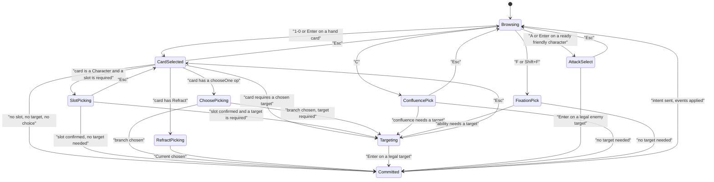

# HYPEBOUND — Accessibility Specification

> **Status:** Design specification, **binding on implementation**. Subordinate to
> `./00-core-rules.md` (rules canon — notably §10 "Readable first" and §8.2 "colour must
> never be the only differentiator"), `../tech/00-architecture-contract.md` (tech canon §5
> "Accessibility (binding)") and `../../src/engine/types.ts` (shape canon). Screen surfaces
> and the Accessibility settings screen are inventoried in
> `./03-screens-and-navigation.md` §4.6.2; social surfaces are in `./12-social-and-safety.md`.
> Every value here is a settings key persisted through `src/save/` or a token in
> `src/ui/theme/`; nothing is hardcoded in screen code.

| At a glance | |
|---|---|
| Conformance target | **WCAG 2.2 Level AA** for all DOM surfaces; equivalent behaviour, verified by the QA checklist in §22, for the three.js battle board |
| Architectural advantage | Everything except the battle board is DOM/CSS (architecture contract §5), so text scaling, focus, semantics and high contrast are native |
| Battle board strategy | A parallel semantic DOM layer — the **Board Mirror** (§16) — rendered by `ui/battle/hud.ts`, kept in sync from the same `EngineEvent` stream the presenter consumes |
| Non-negotiable | No information is ever conveyed by colour alone, by motion alone, by sound alone, or by position alone |
| Competitive integrity rule | No accessibility option may alter rules, timers in live PvP, or information availability. Accessibility changes *presentation*, never *state* |
| Settings home | `#/settings/accessibility`, also reachable from the in-battle menu without leaving the match |

---

## 1. Principles

1. **Readable first (canon §10).** If a change makes the game prettier and less readable, the
   change loses.
2. **Redundant encoding, always.** Every meaningful state carries at least two of: shape,
   glyph, text label, numeral, position. Colour is the third channel, never the first.
3. **Presentation-only.** Accessibility settings live entirely on the presentation side of
   the engine/presentation split. The engine cannot observe them; `MatchState`, `EngineEvent`
   ordering and `MatchRecord` replays are byte-identical regardless of settings.
4. **Default-on where it costs nothing.** Damage previews, numerals on meters, status
   tooltips, fixed status ordering, subtitles for story dialogue, and audio cues for turn
   start / rope / lethal are **on by default for everyone**. They are good design, not
   accommodations.
5. **Discoverable.** The accessibility screen is reachable from the settings gear on every
   screen, from the in-battle menu, and from a first-boot prompt after onboarding.
6. **No accessibility tax.** No option is behind an account level, a purchase, or a mode.
7. **Honest limits.** Where an accommodation cannot be offered without breaking competitive
   fairness (§19), the game says so plainly and offers the nearest legitimate alternative.

---

## 2. Accessibility Settings Inventory

Route `#/settings/accessibility`. Every control below is live-preview (changes apply
immediately, no confirm step), persisted under `settings.a11y.*` in the versioned save
envelope, and included in Settings → Export/import.

| Group | Control | Options | Default | Save key |
|---|---|---|---|---|
| **Text** | UI text size | 7 steps, 80–160% (§3) | 100% | `textScale` |
| | Text labels under icons | Off / On | **On** | `iconLabels` |
| | Card reminder text | Rarity-standard / **Always show** (Rules Lens, §17) | Rarity-standard | `rulesLens` |
| | Dyslexia-friendly font | Off / On (bundled fallback stack, wider letter spacing) | Off | `dyslexiaFont` |
| **Motion** | Reduced motion | Off / **On** | Follows `prefers-reduced-motion` on first run | `reducedMotion` |
| | Animation speed | Full / Fast / Instant | Full | `animationSpeed` |
| | Screen shake | Off / On | On | `screenShake` |
| | Camera motion | Off / Subtle / Full | Full | `cameraMotion` |
| | Flash reduction | Off / On (§6.3) | Off (On forced when Reduced motion is On) | `flashReduction` |
| | Background/parallax motion | Off / On | On | `backgroundMotion` |
| **Colour** | Colour-blind mode | Off / Deuteranopia / Protanopia / Tritanopia | Off | `colorblindMode` |
| | High-contrast theme | Off / On | Off | `highContrast` |
| | Current pattern fills | Off / On (hatch patterns on Current badges, §8.1) | Off (On automatically in any colour-blind mode) | `currentPatterns` |
| | Focus ring size | Thin / Medium / Thick | Medium | `focusRing` |
| **Audio** | Subtitles | Off / On | **On** | `subtitles` |
| | Subtitle size | S / M / L / XL | M | `subtitleSize` |
| | Subtitle background | 0% / 40% / 70% / 100% | 70% | `subtitleBg` |
| | Sound captions (non-speech cues as text) | Off / On | Off | `soundCaptions` |
| | Accessibility audio cues | Off / On, with independent gain | **On**, gain 100% | `audioCues`, `audioCueGain` |
| | Mono audio | Off / On | Off | `monoAudio` |
| | Left/right balance | −100…+100 | 0 | `audioBalance` |
| | Duck music under cues | Off / On | On | `duckUnderCues` |
| **Input** | Keyboard navigation | Off / **On** | On | `keyboardNav` |
| | Controller support | Off / Auto / Force on | Auto (on gamepad connect) | `gamepad` |
| | Remap keyboard / controller | Editor (§15) | Default profile | `bindings` |
| | Touch: play style | Drag / **Tap-tap** / Both | Both | `touchPlayStyle` |
| | Long-press duration | 300 / 400 / 600 ms | 400 ms | `longPressMs` |
| | Hold-to-confirm destructive actions | Off / On | Off | `holdToConfirm` |
| | Pointer/stick sensitivity | 0.5×–2.0× | 1.0× | `pointerSpeed` |
| | Sticky targeting (no drag required) | Off / On | On when Tap-tap | `stickyTargeting` |
| **Assist** | Screen-reader support | Off / Key events / **Full** | Full when an AT is detected, else Key events | `srVerbosity` |
| | Always show damage previews | On drag / **Always** | Always | `previewMode` |
| | Confirm End Turn with unspent Hype | Off / On | On | `confirmEndTurn` |
| | Turn-timer warnings | Off / On | On | `timerWarnings` |
| | Explain-this-card overlay hint | Off / On | On for the first 20 matches | `explainHint` |

---

## 3. Scalable Text

### 3.1 The rem system

- `html { font-size: calc(16px * var(--ui-scale)); }` — the **only** place the scale is
  applied. Every DOM dimension that should scale (type, padding, gaps, control heights,
  border radii, icon boxes) is expressed in `rem`. Hairlines, focus-ring widths and 1-device-pixel
  separators are the only permitted `px` values.
- `src/ui/theme/` owns the type scale as tokens; screens never set raw font sizes.
- The three.js board does **not** scale with `--ui-scale` (world geometry is fixed), but the
  HUD is DOM and does. `board.ts` reserves **safe margins** — a 12% inset on each edge at
  100% growing to 20% at 160% — so scaled HUD panels never occlude a board slot, a leader
  portrait, or the End Turn button (architecture contract §5).

### 3.2 Exact steps

| Step | `--ui-scale` | Root font size | Body text | Min supported viewport (CSS px) | Layout notes |
|---|---|---|---|---|---|
| 1 | 0.80 | 12.8 px | 12.8 px | 1024 × 576 | Densest; all information visible without reflow |
| 2 | 0.90 | 14.4 px | 14.4 px | 1152 × 648 | |
| 3 | **1.00** | **16 px** | 16 px | **1280 × 720** (reference) | Reference layout of `./03-screens-and-navigation.md` |
| 4 | 1.10 | 17.6 px | 17.6 px | 1280 × 720 | |
| 5 | 1.25 | 20 px | 20 px | 1280 × 720 | Sidebar widgets switch to compact mode; filter rails collapse to a drawer |
| 6 | 1.40 | 22.4 px | 22.4 px | 1280 × 720 | Two-column screens become single-column + tab strip; collection grid drops to 3 columns |
| 7 | 1.60 | 25.6 px | 25.6 px | 1280 × 720 | Maximum; battle HUD side panels become overlays summoned by key/button rather than always-on |

**Binding rules.**
- No layout may horizontally scroll the page body at any step (individual wide tables and the
  card grid scroll inside their own container).
- No text is clipped or ellipsised without an accessible full-text path (tooltip on
  hover **and** focus, plus the value in the Board Mirror / `title` where applicable).
- Minimum body line-height 1.4; measure capped at 80 characters.
- Minimum rendered text size at step 1 is 12.8 px — never below 12 px, which is why the
  scale floor is 80% and not lower.
- Text scale is independent of browser zoom; both are supported and compose.

### 3.3 Card text

Card faces are canvas-rendered by `ui/cardRenderer/` (architecture contract §5), so DOM text
scaling does not apply inside a card frame. Three mitigations, all required:

1. The renderer takes a **glyph-scale parameter** derived from `--ui-scale`; at ≥125% it
   re-renders card textures at a larger internal type size and reduces flavor-text lines
   before it reduces rules-text size. Flavor text is dropped entirely before rules text
   shrinks below its floor (10 px equivalent at 100%).
2. **Card enlargement** (right-click / long-press / `I` / controller `X`) always renders the
   card at ≥ 1.8× the board size with DOM text overlaid on the art — this path is fully
   text-scalable.
3. The **card-text explanation overlay** (§17) is pure DOM and therefore always fully
   scalable, screen-readable, and selectable. It is the guaranteed-readable path to any
   card's rules.

---

## 4. Reduced Motion

`presenter.ts` owns every battle animation; DOM screens use a single motion utility. Reduced
motion is a presenter mode, not a per-animation opt-out: when on, the presenter substitutes
**cross-fades and instant state changes** and never moves an element along a path.

### 4.1 Global reduced-motion behaviour

| Category | Normal | Reduced motion |
|---|---|---|
| Positional motion (translate, arcs, lunges) | Yes | **Never.** Elements appear/disappear in place with a 120 ms opacity cross-fade |
| Scale/rotation | Yes | Only uniform opacity; no scale bounce, no rotation |
| Camera | Push-ins, tilts, shakes | Hard cuts between fixed camera framings; no shake, no dolly |
| Particles | Full VFX budget | Capped at 10% budget; particles become a single static burst sprite that fades |
| Screen flashes | Yes | Replaced by a 150 ms edge vignette at ≤ 20% opacity |
| Looping ambient motion (lobby leader idle, carousel autoplay, holo shimmer, board light sweeps) | Yes | **Stopped.** Static pose, manual carousel, static holo |
| Trigger-order chips | Slide + enlarge | Appear in place; the resolving chip is marked with a solid border + "▶ resolving" label |
| Targeting arrow | Animated bezier with flowing gradient | Static straight line with a solid arrowhead |
| Toasts / dialogs | Slide + fade | Fade only, 120 ms |

Reduced motion is **auto-enabled on first run** when the OS reports
`prefers-reduced-motion: reduce`; the first-boot accessibility prompt states that it was
detected and how to change it. It also forces **Flash reduction** on (§6.3).

### 4.2 Per-animation table

Every presenter animation, its source `EngineEvent` (`types.ts`), its duration at each
animation-speed setting, and its reduced-motion substitute. Durations are data
(`data/animation-timings.json`) and are the values the QA checklist measures.

| Animation id | Source event | Full | Fast | Instant | Reduced-motion substitute |
|---|---|---|---|---|---|
| `drawCard` | `cardDrawn` | 320 ms | 190 ms | 0 | Card appears in the hand fan; deck counter ticks; no arc |
| `burnCard` | `cardBurned` | 420 ms | 250 ms | 0 | Card icon fades out over the hand with the "Lost in the Feed" label |
| `playFromHand` | `cardPlayed` | 450 ms | 270 ms | 0 | Card vanishes from hand, appears in its zone; cost gem dims |
| `summonImpact` | `characterSummoned` | 380 ms | 230 ms | 0 | Character appears at full size in its slot; slot outline flashes once (opacity only) |
| `attackLunge` | `attackDeclared` | 400 ms | 240 ms | 0 | Attacker outline pulses once; a static line connects attacker and target for 200 ms |
| `damageNumber` | `damageDealt` | 700 ms | 420 ms | 220 ms | Numeral appears above the target and fades in place (never rises) |
| `damageShake` | `damageDealt` (leader) | 260 ms | 160 ms | 0 | **Removed.** Leader frame border flashes to the damage colour + numeral |
| `elementalBonusFlare` | `damageDealt.elementalBonus` | 300 ms | 180 ms | 0 | Static "+1" chip with both Current glyphs, held 600 ms |
| `shieldBreak` | `damageDealt.absorbedByShield` | 300 ms | 180 ms | 0 | Shield icon swaps to a broken silhouette; strikethrough on the absorbed numeral |
| `armorAbsorb` | `damageDealt.absorbedByArmor` | 260 ms | 160 ms | 0 | Armor numeral decrements with a 120 ms fade |
| `healBloom` | `healed` | 380 ms | 230 ms | 0 | Green numeral appears; health chip updates; no particles |
| `buffPulse` | `buffApplied` / `statsSet` | 300 ms | 180 ms | 0 | Stat chips cross-fade to the new numbers |
| `statusApply` | `statusApplied` | 300 ms | 180 ms | 0 | Status icon fades into its fixed slot on the status rail |
| `statusTrigger` | `statusTriggered` | 350 ms | 210 ms | 0 | Status icon border flashes once; effect numeral appears |
| `statusExpire` | `statusRemoved` | 220 ms | 140 ms | 0 | Icon fades out; rail re-flows without sliding |
| `keywordFlare` | `keywordTriggered` | 340 ms | 200 ms | 0 | Keyword name chip appears above the source for 800 ms |
| `defeatDissolve` | `characterDefeated` | 520 ms | 310 ms | 0 | Character fades out; slot outline returns |
| `banishWarp` | `characterBanished` | 480 ms | 290 ms | 0 | Character fades to a dashed outline placeholder showing the return turn |
| `returnFromBanish` | `characterReturnedFromBanish` | 420 ms | 250 ms | 0 | Placeholder cross-fades to the character |
| `transformMorph` | `characterTransformed` | 560 ms | 340 ms | 0 | Cross-fade old → new card face; "Transformed" chip |
| `resurrectRise` | `characterResurrected` | 520 ms | 310 ms | 0 | Character fades in; "Resurrected" chip |
| `comebackEcho` | `comebackScheduled` / `comebackReturned` | 400 ms | 240 ms | 0 | Timer badge appears on the discard/hand icon; no travel |
| `equipSnap` | `equipped` | 340 ms | 200 ms | 0 | Equipment chip fades onto the character; silhouette swap is instant |
| `locationPlace` | `locationPlayed` | 400 ms | 240 ms | 0 | Location card fades into the slot; durability pips render |
| `eventBanner` | `eventStarted` / `eventEnded` | 600 ms | 360 ms | 0 | Banner appears in the Event zone; countdown numeral only |
| `confluenceFlourish` | `confluenceActivated` | 900 ms | 540 ms | 0 | Both Current glyphs and the Confluence name appear centred for 900 ms, static, then fade |
| `resonanceActivation` | `resonanceActivated` | 1,000 ms | 600 ms | 0 | Static "PERFECT RESONANCE — ⟨Current⟩" banner, 1,000 ms hold |
| `obsessionSurge` | `obsessionChanged` | 260 ms | 160 ms | 0 | Meter segments update instantly; numeral updates |
| `obsessedWarning` | `obsessedThresholdCrossed` | 700 ms | 420 ms | 200 ms | Static "OBSESSED · +1 damage taken" label appears beside the meter; no pulsing |
| `fullFixationBanner` | `fullFixation` | 1,100 ms | 660 ms | 0 | Static banner "FULL FIXATION — Ultimate costs 0 this turn" for 1,100 ms |
| `fixationCast` | `fixationUsed` | 700 ms | 420 ms | 0 | Leader portrait border flashes once; ability name chip |
| `hypeRefill` | `turnStarted` / `hypeChanged` | 400 ms | 240 ms | 0 | Crystal pips fill instantly; numeral updates |
| `hypeLock` | `hypeLocked` | 320 ms | 190 ms | 0 | Locked pips render with the lock glyph immediately |
| `turnBanner` | `turnStarted` / `turnEnded` | 800 ms | 480 ms | 200 ms | Static "YOUR TURN — Turn 5" band, 800 ms hold, opacity only |
| `ropeStrand` | timer entering the 15 s rope | continuous | continuous | continuous | Animated glitch strand replaced by a **static bar that steps in 1-second decrements** plus the numeral; audio cue unchanged |
| `fatigueJolt` | `fatigueDamage` | 500 ms | 300 ms | 0 | Numeral + "Burnout ⟨N⟩" label; no shake |
| `triggerQueueChips` | `triggerQueued` / resolution | 260 ms/chip | 160 ms | 60 ms | Chips render in place in resolution order; resolving chip gets a solid border + label |
| `scryFan` | `deckScryed` | 500 ms | 300 ms | 0 | Cards appear in a static row for reordering |
| `emoteBubble` | (transport, not an engine event) | 1,800 ms | 1,200 ms | 900 ms | Static bubble with text/subtitle, no bounce |
| `victoryPushIn` | `matchEnded` | 2,400 ms | 1,400 ms | 400 ms | Hard cut to the results framing; static leader pose; result banner fades in |
| `defeatFade` | `matchEnded` | 2,000 ms | 1,200 ms | 400 ms | Cross-fade to the results panel |
| DOM: `screenTransition` | — | 220 ms | 140 ms | 0 | Cross-fade only |
| DOM: `carouselAdvance` | — | 400 ms auto/6 s | 240 ms | 0 | **Autoplay off**; manual arrows/dots only |
| DOM: `packTear` | — | 1,600 ms | 900 ms | 0 | Instant result grid (already specified in screens doc §4.3.6) |
| DOM: `rewardBurst` | — | 900 ms | 540 ms | 0 | Items fade into the list |
| DOM: `lobbyLeaderIdle` | — | loop | loop | loop | **Static pose** |
| DOM: `meterFill` | — | 500 ms | 300 ms | 0 | Instant fill + numeral |
| DOM: `toastSlide` | — | 220 ms | 140 ms | 0 | Fade only |

**Invariant:** the engine never waits on the presenter (architecture contract §5). Reduced
motion, Instant speed and skipping change only how long the *visuals* take; identical intents
produce identical state and identical replays.

---

## 5. Animation Speed & Skipping

| Setting | Multiplier | Behaviour |
|---|---|---|
| **Full** | 1.0× | Table values in §4.2 |
| **Fast** | ~0.6× | Table values in §4.2; the presenter also collapses queued same-type animations (e.g. six simultaneous Scorched ticks resolve as one grouped beat) |
| **Instant** | 0× (except the minimums in §4.2) | State snaps; only readability holds remain (damage numerals 220 ms, turn banner 200 ms, Obsessed warning 200 ms) so information is never unreadable |

Additional, always-on behaviours (canon §10 "skippable/shortenable after first view"):

- **Per-event-type memory.** The first time a player sees a given animation id, it plays at
  the chosen speed. Subsequent occurrences within the same match play at 0.7× that duration;
  after the third occurrence, at 0.5×. Stored per profile so the tenth Confluence of your
  career is brisk.
- **Skip.** Any pointer press, `Space`, `Enter`, or controller `A` during a non-interactive
  sequence fast-forwards the current animation queue to its end state. This never skips an
  input prompt.
- **Opponent-turn speed** follows the same setting; there is no separate slider (one control,
  fewer traps).

---

## 6. Screen Shake, Camera & Flash

### 6.1 Screen shake

Toggle `screenShake`. When off, every `damageShake`, `fatigueJolt`, impact rumble and board
tilt is removed and replaced by the border-flash + numeral substitutes listed in §4.2. Shake
is never the sole indicator of anything.

### 6.2 Camera motion

| Setting | Behaviour |
|---|---|
| **Full** | Push-ins on lethal and victory, subtle idle drift, tilt on Confluence activation |
| **Subtle** | Idle drift removed; push-ins reduced to 40% travel; tilt removed |
| **Off** | Fixed camera at the canonical ~38° pitch; all framing changes are hard cuts |

### 6.3 Flash reduction & photosensitivity (binding)

Regardless of settings, the game must never present:

- more than **3 flashes per second** anywhere on screen (WCAG 2.3.1);
- a luminance change greater than 10% of the viewport area at a rate above 2 Hz;
- red-dominant flashing at any rate above 1 Hz.

The at-risk effects are **Pulse/Overload** VFX, `starflare` and `blackflame` Confluence
flourishes, the Full Fixation banner, and the rope glitch strand. These are capped at
**2 Hz and < 25% viewport area** by default. With **Flash reduction** on: 1 Hz, < 5% area,
strobes replaced by a single fade. Reduced motion forces Flash reduction on.

---

## 7. Colour-Blind Modes

Three modes plus the default palette: **Deuteranopia**, **Protanopia**, **Tritanopia**. A
mode changes only the values of theme colour tokens (`--current-*`, `--status-*`,
`--state-*`); it never changes layout, iconography, or labels — because those already carry
the information (§8).

### 7.1 Current colour tokens

Values are the initial defaults in `src/ui/theme/` and `data/currents.json`
(`CurrentDef.colorToken`, per `types.ts` — data stores the *token name*, never a raw colour).

| Current | Token | Default | Deuteranopia | Protanopia | Tritanopia | High-contrast (on `#05060A`) |
|---|---|---|---|---|---|---|
| Cinder | `--current-cinder` | `#FF6B3D` | `#FF8A34` | `#FF9E3D` | `#FF5A5A` | `#FF8A54` |
| Tide | `--current-tide` | `#22A8D6` | `#2E9BE0` | `#2E9BE0` | `#2FC3C3` | `#4FC9F7` |
| Root | `--current-root` | `#4E9E4A` | `#7E8C1E` | `#8A8A1C` | `#3FA36B` | `#8ECF74` |
| Gale | `--current-gale` | `#B7D9E8` | `#C9DCE8` | `#C9DCE8` | `#CFE0D8` | `#DCEAF2` |
| Pulse | `--current-pulse` | `#F2C233` | `#F0D14A` | `#EFD65A` | `#F2E24A` | `#FFD84D` |
| Halo | `--current-halo` | `#FFE9A8` | `#FFF0C2` | `#FFF0C2` | `#FFF2D0` | `#FFF6D6` |
| Veil | `--current-veil` | `#7B3FA0` | `#7B5BC0` | `#7B5BC0` | `#A03F8F` | `#B879E8` |
| Prism | `--current-prism` | `#D06BFF` | `#B98BFF` | `#B98BFF` | `#E06BC8` | `#E39BFF` |

### 7.2 Validation rule (testable, no new dependencies)

`tests/a11y/palette.test.ts` — a pure-TypeScript test that, for each mode:

1. Converts every Current/status/state token to CIELAB.
2. Applies a Brettel–Viénot dichromacy simulation for the mode (implemented in the test
   utility; ~60 lines of matrix maths, no library).
3. Asserts that **every pair** of tokens in the same visual family satisfies
   **ΔE\*ab ≥ 20 in simulated space**, *or* differs in relative luminance by a ratio ≥ 1.6:1.
4. Asserts every token used for text or icons against its background meets the contrast
   ratios in §9.1.

A failing palette change fails CI. This is why the palette can be tuned freely later: the
guardrail is mechanical, not editorial.

### 7.3 What colour is allowed to do

Colour may reinforce identity (faction/Current mood, damage vs heal), set atmosphere, and
speed up recognition for players who see it. Colour may **never** be the sole carrier of:
Current identity, status identity, target legality, damage vs healing, ownership (friendly
vs enemy), Obsessed state, lethal indication, rarity, availability/affordability, validity
errors, or presence state.

---

## 8. Redundancy System — 8 Currents and 10 Statuses

### 8.1 Currents

Per canon §8.2, every Current already owns a frame shape language. The full redundancy kit —
all of which renders on every card, in every mode:

| Current | Glyph (icon silhouette) | Frame shape (canon §8.2) | Short label | Hatch pattern (patterns mode) | Badge position | VFX motion signature | SFX motif |
|---|---|---|---|---|---|---|---|
| **Cinder** | Upward flame with a notched base | Sharp flame-notched, ember glow | `CIN` | Diagonal ↗ 45° | Top-left of frame | Rising, flickering | Crackle + low roar |
| **Tide** | Double wave crest | Rounded wave-edge, liquid sheen | `TID` | Horizontal wave lines | Top-left | Lateral swell | Wash + droplet |
| **Root** | Hexagon with three descending roots | Heavy hexagonal stone | `ROO` | Cross-hatch grid | Top-left | Slow, settling downward | Stone grind + wood creak |
| **Gale** | Three swept parallel arcs | Swept, ribbon-cut asymmetric | `GAL` | Diagonal ↘ 45° | Top-left | Fast horizontal sweep | Airy whoosh |
| **Pulse** | Angular bolt inside a circuit bracket | Circuit-notched angular | `PUL` | Vertical dashes | Top-left | Sharp staccato snap | Electric tick + hum |
| **Halo** | Concentric ring with a gap at the top | Circular radiant, gold filigree | `HAL` | Concentric dots | Top-left | Outward expanding bloom | Chime + choral swell |
| **Veil** | Cracked crescent over a shard | Fractured mirror-shard | `VEI` | Dense stipple | Top-left | Inward collapse | Reverse-reverb whisper |
| **Prism** | Faceted triangle splitting into three rays | Crystal-facet, shifting spectrum | `PRI` | Chevron ▲ rows | Top-left | Refracting fan-out | Glassy bell arpeggio |

**Binding rules.**
- The Current **name** is written in text on every card frame (canon §8.2: "a written label
  on every card"), and the short label appears on board minis where the full name will not fit.
- The frame *shape* is the primary at-a-glance differentiator on the board, because it
  survives every colour mode, every colour-vision type, and greyscale screenshots.
- The advantage indicator on damage previews shows **both** Current glyphs plus a `+1` chip
  plus the text "Current bonus" in the preview tooltip — three channels for canon §5.2.
- The in-match **Currents guide** (screens doc §6.2) renders the advantage cycle as a labelled
  directed graph with text arrows ("Cinder beats Gale"), not a colour wheel.

### 8.2 Statuses

Canon §5.4 defines exactly **10** statuses; `types.ts` `StatusId` matches. Each has a distinct
silhouette (`StatusDef.iconShape`), a fixed rail position, and a numeral where the status has
a magnitude or duration.

| Status | `iconShape` | Silhouette | Numeral shown | Rail order | Text label (icon-labels on) | Polarity |
|---|---|---|---|---|---|---|
| **Shielded** | `bubble` | Circle with a highlight arc, solid outline | — | 1 | `Shield` | positive |
| **Armor X** | `plate` | Three stacked chevron plates | `X` (remaining) | 2 | `Armor X` | positive |
| **Empowered X** | `upwedge` | Upward triangle with a bar beneath | `+X` | 3 | `+X ATK` | positive |
| **Warded** | `hexlock` | Hexagon enclosing a keyhole | turns remaining | 4 | `Warded` | positive |
| **Lurking** | `mask` | Diamond with its lower half dashed | — | 5 | `Lurking` | positive |
| **Grow (progress)** | `sprout` | Sprout over a segmented bar | `n/N` | 6 | `Grow n/N` | neutral |
| **Weakened X** | `downwedge` | Downward triangle with a bar above | `−X` | 7 | `−X ATK` | negative |
| **Scorched** | `flame` | Teardrop flame with a notched base | — | 8 | `Scorched` | negative |
| **Cursed** | `sigil` | Five-point star with a fracture line | — | 9 | `Cursed` | negative |
| **Cancelled** | `strikeband` | Square with a diagonal strike band | turns remaining | 10 | `Cancelled` | negative |
| **Banished** | `portal` | Broken ring with a gap at 3 o'clock | return turn | (off-board) | `Banished — returns T7` | negative |

*(Grow progress is a keyword counter rather than a canonical status, but it renders on the
same rail and follows the same rules; Banished characters render in the banish tray, not on
the board.)*

**Binding rules.**
- **Fixed order.** Positives left, negatives right, always in the order above. A status is
  always in the same place, so position itself becomes a learnable cue.
- Icons render at 24 px visual size with a **44 × 44 px hit area** (§14).
- Every icon has a tooltip on hover **and** on keyboard focus, containing the canonical text
  from `data/statuses.json` plus the exact remaining duration.
- More than 5 statuses on one character collapse into `+n` with a fixed-order expansion panel;
  the collapse never hides a negative status while showing a positive one.
- Statuses are announced by the Board Mirror (§16) as `"Foam Knight: Shielded, Scorched, 2 turns"`.

### 8.3 Other states that must never be colour-only

| State | Redundant encoding |
|---|---|
| Friendly vs enemy | Board half + frame direction + explicit `You` / `Opponent` labels in the Board Mirror; enemy cards render with an inverted frame bevel |
| Playable / unaffordable card | Cost gem shows the number; unaffordable cards are dimmed **and** carry a small lock glyph, and are skipped by keyboard selection unless `Shift` is held |
| Legal / illegal target | Legal: solid 2 px outline + cursor change + audible tick; illegal: dashed dim outline, non-snapping, no cursor change |
| Lethal available | Skull-glyph badge + `LETHAL` text on the preview + audio cue (§11) |
| Obsessed (8+) | Distinct meter cap glyph + `OBSESSED · +1 damage taken` text label |
| Full Fixation (10) | Banner text + Ultimate button label changes to `ULTIMATE — FREE THIS TURN` |
| Elemental advantage | Both Current glyphs + `+1` chip + tooltip text |
| Rarity | Gem shape differs per rarity (circle / square / diamond / faceted star), not only colour |
| Deck validity | `30/30 OK` or `INVALID — 2 reasons` text, never a bare red border |
| Presence (social) | Chip glyph (● filled, ◐ half, ○ hollow, ▢ square for DND) + text |
| Turn ownership | Turn banner text + End Turn button label state + board seam indicator glyph |

---

## 9. High-Contrast Theme

A full token override set (`src/ui/theme/high-contrast.css`), composable with any colour-blind
mode.

### 9.1 Contrast requirements

| Element | Minimum ratio |
|---|---|
| Body text | **7:1** (AAA — we exceed AA deliberately for a game read at speed) |
| Large text (≥ 24 px or ≥ 19 px bold) | 4.5:1 |
| Icons, meters, borders, focus rings, chart strokes | **3:1** against every adjacent colour |
| Disabled controls | 3:1 (disabled must still be readable — it is information) |
| Focus ring | 3:1 against **both** the focused element and the surrounding background |

### 9.2 What changes

| Aspect | Standard theme | High-contrast |
|---|---|---|
| Surfaces | Glass panels, blur, gradients, 60–85% opacity | Solid `#05060A` / `#101420`; **all backdrop blur and translucency removed** |
| Borders | Subtle 1 px hairlines | 2 px solid, `#E8EDF5` |
| Text | Tinted greys | `#FFFFFF` primary, `#C7D2E0` secondary |
| Card frames | Ornamented, gradient fills | Solid fills, thick frame outline, Current glyph enlarged 1.25× |
| Board | Bloom, rim lighting, reflective floor | Flat unlit shading, no bloom, no reflections; slot outlines drawn 2 px solid |
| VFX | Full particle language | Silhouette-forward: high-alpha shapes, no additive haze |
| Meters | Gradient fills | Solid fills, segment separators, numerals mandatory |
| Shadows | Soft ambient | Removed (they reduce edge contrast) |
| Selection | Glow | 2 px dashed inner outline + solid outer ring |

High contrast never removes information and never changes layout — it is a repaint, so muscle
memory transfers between themes.

---

## 10. Subtitles & Captions

### 10.1 Coverage (required)

Every recorded human voice line has a subtitle: leader intro lines, in-match card voice
lines, emote phrase voice clips (§ social doc §9), story-campaign dialogue, tutorial mentor
lines (Nova Encore), Doomscroll event narration, boss taunts, victory/defeat lines, and
pack-opening flourish lines. **A voice asset without a subtitle string fails
`npm run validate`** — the audio manifest entry and the i18n key are validated as a pair.

### 10.2 Presentation

| Property | Value |
|---|---|
| Position | Bottom-centre, above the hand fan in battle; bottom-centre with 6% safe margin elsewhere. Never overlaps the End Turn button or the hand |
| Lines | Max 2 lines × 42 characters, then queue |
| Minimum duration | 1.2 s, or 60 ms per character, whichever is greater |
| Speaker attribution | `⟨Speaker Name⟩: ⟨line⟩`, speaker name in the faction accent colour **and** bold — never colour alone |
| Sizes | S 0.875 rem · M 1 rem · L 1.25 rem · XL 1.5 rem (composes with §3 text scale) |
| Background | 0% / 40% / 70% (default) / 100% opacity black plate with 0.25 rem padding |
| Overlap rule | A new line replaces the current one; simultaneous speakers stack with a max of 2 visible |
| Dialogue log | Story and tutorial scenes keep a scrollable transcript (screens doc §4.4.4) with the full history, copyable |

### 10.3 Sound captions (non-speech)

Setting `soundCaptions`. When on, important non-speech audio is captioned in the same bar in
square brackets, at most one at a time, deduplicated within 2 s:

`[Turn timer rope]` · `[Lethal available]` · `[Confluence ready]` · `[Your turn]` ·
`[Burnout damage]` · `[Card burned — hand full]` · `[Perfect Resonance]` ·
`[Opponent emote]` · `[Connection unstable]` · `[Reaction triggered]`

Every entry in the audio-cue table (§11) that is marked "captioned" appears here.

---

## 11. Audio Cues

Cues route to the `ui` channel of `AudioManager` (architecture contract §6) through a
dedicated **accessibility-cue sub-gain** so they can be raised without raising interface
sound generally. When `duckUnderCues` is on, music and ambient duck by 6 dB for the cue's
duration.

**Binding rule:** every cue has a visual twin. No cue is the only notification of anything.

| # | Event | Trigger (`EngineEvent` or client state) | Cue character | Default | Captioned | Visual twin |
|---|---|---|---|---|---|---|
| 1 | Your turn starts | `turnStarted` (your seat) | Two-note rising chime | On | ✔ | Turn banner + End Turn enables |
| 2 | Opponent turn starts | `turnStarted` (enemy) | Single low tone | On | — | Turn banner |
| 3 | Turn rope begins (15 s) | Client timer | Pulsing heartbeat, 1 Hz | On | ✔ | Rope strand + numeral |
| 4 | Rope final 5-4-3-2-1 | Client timer | Discrete ticks, rising pitch | On | ✔ | Numeral countdown |
| 5 | Lethal available on enemy leader | `predict()` | Bright three-note sting | On | ✔ | Skull badge + `LETHAL` text |
| 6 | Confluence became available | `predict()` / `ConfluenceAvailability` | Two-tone interval matching the pair | On | ✔ | Confluence button appears |
| 7 | Confluence activated | `confluenceActivated` | Chord resolve, per-pair timbre | On | ✔ | Flourish + name banner |
| 8 | Perfect Resonance activated | `resonanceActivated` | Long harmonic swell | On | ✔ | Resonance banner |
| 9 | Obsession reached 8 (Obsessed) | `obsessedThresholdCrossed` | Detuned warning drone | On | ✔ | `OBSESSED` label |
| 10 | Full Fixation (10) | `fullFixation` | Rising arpeggio + impact | On | ✔ | Full Fixation banner |
| 11 | Fixation / Ultimate ready | Client state | Soft ready-ping (once per availability) | On | — | Button enables |
| 12 | Your leader damaged | `damageDealt` (your leader) | Deep impact thud | On | — | Health orb + numeral |
| 13 | Enemy leader damaged | `damageDealt` (enemy leader) | Brighter impact | On | — | Health orb + numeral |
| 14 | Elemental bonus applied | `damageDealt.elementalBonus` | Extra high grace note layered on the impact | On | — | `+1` chip |
| 15 | Friendly character defeated | `characterDefeated` (yours) | Descending two-note | On | — | Dissolve + log entry |
| 16 | Enemy character defeated | `characterDefeated` (enemy) | Bright break | On | — | Dissolve + log entry |
| 17 | Shield absorbed damage | `damageDealt.absorbedByShield` | Glass tap | On | — | Broken shield icon |
| 18 | Status applied to a friendly | `statusApplied` (yours, negative) | Short dissonant tick | On | — | Status icon appears |
| 19 | Reaction triggered | `reactionTriggered` | Card-flip whoosh + sting | On | ✔ | Reaction reveals + log entry |
| 20 | Trigger cascade resolving | `triggerQueued` | Soft per-chip tick (max 6, then silence) | On | — | Trigger chips |
| 21 | Trigger cap reached | `triggerCapReached` | Muted "fizzle" | On | ✔ | "Feed overloaded" chip |
| 22 | Card drawn | `cardDrawn` | Paper slide | On | — | Card enters hand |
| 23 | Card burned (hand full) | `cardBurned` | Short crumple | On | ✔ | "Lost in the Feed" toast |
| 24 | Burnout (fatigue) damage | `fatigueDamage` | Hollow descending tone, pitch drops per stack | On | ✔ | Numeral + Burnout label |
| 25 | Invalid action attempted | Client (rejected input) | Short muted buzz (never harsh) | On | — | Shake-free red outline + reason toast |
| 26 | Match ended — victory | `matchEnded` (you win) | Victory sting | On | ✔ | Victory sequence |
| 27 | Match ended — defeat | `matchEnded` (you lose) | Soft resolve (never mocking) | On | ✔ | Defeat sequence |
| 28 | Opponent emote received | Transport | Emote's own SFX, muted per §12 of the social doc | On | ✔ | Emote bubble + subtitle |
| 29 | Connection lost / restored | Transport | Two-tone down / two-tone up | On | ✔ | Connection banner |
| 30 | Menu focus moved | Client | Soft tick | On | — | Focus ring |
| 31 | Menu activate / back | Client | Confirm blip / back blip | On | — | Screen change |
| 32 | Reward claimed | Client | Sparkle | On | — | Reward animation |
| 33 | Pack rarity reveal (Epic/Legendary) | Client | Escalating sting per rarity | On | — | Reveal VFX + rarity gem |
| 34 | Mission/achievement completed | Client | Two-note complete | On | ✔ | Toast + badge |

### 11.1 Hearing accommodations

- **Mono audio** sums both channels; required for single-sided hearing loss.
- **Balance** shifts the master mix −100…+100.
- All five channels (music, voice, interface, battle, ambient) have independent volumes
  (architecture contract §6) plus the accessibility-cue sub-gain, so a player can run
  music at 0 and cues at 100.
- **Streamer-safe mode** never removes an accessibility cue; it only swaps licensed music
  tracks.

---

## 12. Keyboard Navigation — Global Model

Keyboard navigation is a first-class input path, not a fallback: **every action in the game is
reachable by keyboard alone**, including every battle action.

### 12.1 Global conventions

| Key | Action |
|---|---|
| `Tab` / `Shift+Tab` | Move between focus *groups* (landmarks, panels, zones) |
| `Arrow keys` | Move within a group (roving `tabindex`; grids move in 2D) |
| `Enter` / `Space` | Activate the focused item |
| `Esc` | Cancel current mode → close overlay → Back |
| `Home` / `End` | First / last item in a group |
| `PageUp` / `PageDown` | Page through long lists (collection, history, patch notes) |
| `F1` or `?` | Context help for the current screen |
| `Shift+?` | Keyboard shortcut sheet (searchable, lists live bindings, printable) |
| `Alt+1…9` | Bottom nav: PLAY, COLLECTION, DECK BUILDER, MODES, EVENTS, SHOP, SOCIAL, INBOX, NEWS |
| `Alt+S` | Settings · `Alt+A` Accessibility settings |
| `/` | Focus the primary search field on screens that have one |
| `Ctrl+Enter` | Confirm the primary action of a dialog from anywhere inside it |

### 12.2 Focus rules (binding)

1. A visible focus indicator is **always** present; `:focus-visible` styling is never removed.
   Ring thickness follows `focusRing` (2 / 3 / 4 px), always ≥ 3:1 contrast against both sides.
2. Modals trap focus, receive focus on their primary control, and **restore focus to the
   invoking element** on close.
3. Every screen begins with a "Skip to main content" link and exposes landmarks
   (`banner`, `navigation`, `main`, `complementary`, `contentinfo`).
4. Focus never moves without user action, except: entering a screen (→ main), opening a modal
   (→ primary control), and turn start in battle (→ hand, announced politely).
5. No timed-only interaction outside the canonical turn timer; no hover-only affordance —
   everything reachable by hover is reachable by focus.
6. No keyboard trap anywhere, including the three.js canvas (the canvas is `tabindex="-1"`
   and never receives focus; the Board Mirror does).

### 12.3 Per-screen focus order and screen-specific keys

| Screen | Group order (Tab) | Screen keys |
|---|---|---|
| Splash / Loading | — | Any key skips Splash |
| Onboarding | Content → primary action | `Enter` advance, `Esc` skip (confirm) |
| **Main lobby** | Top bar → PLAY → active deck → centre column → sidebar widgets → bottom nav | `P` PLAY, `D` deck builder, `C` collection, `M` modes, `Left/Right` cycle carousel |
| Mode selection | Band tabs → mode grid → deck picker → difficulty | `1–4` jump to band, `Enter` launch |
| **Collection** | Search → filter rail → grid → detail pane | `/` search, `F` filters, `Arrows` grid 2D, `Enter` detail, `+`/`-` craft/dismantle, `L` lock, `S` favourite |
| **Deck builder** | Slot list → leader picker → pool → deck list → validation → actions | `Arrows` navigate, `Enter`/`+` add, `Delete`/`-` remove, `V` validation panel, `T` test vs AI, `E` export code, `I` import code, `N` rename |
| Character gallery | Faction filter → grid → character page tabs | `Arrows`, `Enter`, `V` voice-line jukebox |
| Crafting workshop | Balance → search → results → craft/dismantle | `/` search, `Enter` craft, `Shift+Enter` dismantle |
| Banner page | Featured → cards strip → pull buttons → rates | `R` rates, `1` single pull, `0` ten-pull, `W` wishlist |
| Pack opening | Reveal area → actions | `Space` reveal next, `A` reveal all, `S` skip |
| Shop | Tabs → grid → item detail | `Arrows`, `Enter`, `Esc` |
| Missions / Achievements | Tabs → list → claim | `Tab` switch tabs, `Enter` claim, `Shift+C` claim all |
| Battle pass | Tier rail → free/premium rows → claim | `Left/Right` scroll rail, `Home` current tier |
| Story / Doomscroll map | Node graph → node detail → run sidebar | `Arrows` traverse edges, `Enter` enter node, `I` node preview, `S` sidebar |
| **Battle** | See §13 | See §13 |
| Friends / Fan Clubs | Sections → rows → row actions | `/` search, `Enter` profile, `C` challenge, `W` watch, `Shift+B` block, `Shift+R` report |
| Inbox | List → message → attachments | `Enter` open, `Delete` delete, `A` claim attachment |
| Profile / History / Stats | Header → tabs → table → row actions | `Enter` open, `R` watch replay, `E` export CSV |
| Replay viewer | Playback bar → timeline → perspective toggle | `Space` play/pause, `Left/Right` step event, `Shift+Left/Right` jump turn, `1/2/3/4` speed, `O` omniscient/as-seen |
| Settings / Accessibility | Section list → controls | `Arrows` adjust sliders/steps, `Enter` toggle, `Alt+A` jump here |
| Legal / Privacy / Fairness / Support | Document nav → body | `PageUp/PageDown`, `/` search |

---

## 13. Keyboard Navigation — The Battle Board

The board is three.js, so keyboard interaction runs on an explicit **selection model** owned
by `ui/battle/hud.ts` (never on the canvas). Selection state is mirrored 1:1 in the Board
Mirror (§16), so keyboard and screen-reader users share one model.

### 13.1 Zones

`Tab` cycles zones in this fixed order; `Shift+Tab` reverses. The current zone is named in the
focus banner and announced.

`Hand → Your board (slots 1-6) → Your location → Your leader (Fixation bar) → Confluence bar → Enemy board (slots 1-6) → Enemy location → Enemy leader → Reaction zone → Event zone → History rail → End Turn`

Within a zone, `Left`/`Right` move along slots and `Up`/`Down` jump between rows (a
convenience shortcut across zones).

### 13.2 Key map

| Key | Action |
|---|---|
| `1`–`9`, `0` | Select hand card by position (`0` = 10th) |
| `Left` / `Right` | Move selection within the current zone |
| `Up` / `Down` | Move between your row, the seam controls, and the enemy row |
| `Enter` / `Space` | Context confirm: select a hand card → enter placement/targeting; on a ready friendly character → enter attack mode; on a button → activate |
| `A` | Attack mode with the selected friendly character |
| `P` | Play the selected hand card (explicit alias for `Enter`) |
| `F` | Leader **Fixation** (3 Obsession) |
| `Shift+F` | **Ultimate Fixation** (7 Obsession) |
| `C` | **Confluence**: opens the chooser if more than one pair is available |
| `L` | Activate your **Location** |
| `R` | Inspect your set **Reactions** |
| `V` | Inspect the active **Events** |
| `D` | Deck / discard counters and pile inspection |
| `I` | **Inspect** the focused card (enlarged overlay); `Shift+I` opens the card-text explanation overlay (§17) |
| `X` | **End turn** (confirmation if you have unspent Hype and `confirmEndTurn` is on) |
| `H` | Focus the **history rail**; `Enter` expands the full action log |
| `T` | Cycle **legal targets** while in targeting mode (same as `Left`/`Right`) |
| `Esc` | Cancel the current mode (placement → targeting → selection → open the in-match menu) |
| `Tab` | Next zone · `Shift+Tab` previous zone |
| `` ` `` | Focus the **Board Mirror** list (full state as text) |
| `M` | Emote wheel (`1`–`6` to send, `Esc` to close) |
| `Shift+M` | Mute opponent emotes for this match |
| `?` | Battle shortcut sheet |
| `Space` (during animation) | Fast-forward the animation queue |

Every key above is remappable (§15); the table is the default profile.

### 13.3 Interaction state machine



**Rules that make this usable without a mouse:**

- In `SlotPicking`, only **empty legal slots** are reachable; the announcement is
  `"Slot 3 of 6, empty. 2 legal slots remain."`
- In `Targeting` and `AttackSelect`, only **legal targets** are reachable
  (`intents.legalTargets`), so Spotlight enforcement, Warded, Lurking and "if able"
  restrictions are handled by the model, not by the player's memory. Cycling wraps and
  announces the count: `"Target 2 of 3: Foam Knight, 3/4, Root."`
- Moving to a target immediately announces the `predict()` preview:
  `"Deal 4 damage, including +1 Current bonus. Foam Knight dies. You take 3."`
- `Enter` on the last legal target confirms; there is never a hidden second confirm step
  except the destructive ones (End Turn with unspent Hype, Concede), which use a dialog.
- Confluence selection (`C`) lists availability from `ConfluenceAvailability`, including the
  `reasonUnavailable` when it cannot be used — `"Steamveil: unavailable, already used this turn."`
- Every mode change plays a distinct audio cue and updates a persistent **mode banner**
  ("SELECTING TARGET — Esc to cancel") so the player is never in an unlabeled state.

---

## 14. Controller Support

Gamepad API, standard mapping, hot-plug detected. Controller and keyboard/mouse are live
simultaneously; the on-screen prompt glyph set switches to whichever device was used last.

### 14.1 Layout diagram

```
                        ┌───────────── STANDARD LAYOUT ─────────────┐

        [ LT / L2 ]                                         [ RT / R2 ]
      Fixation menu                                        Confluence
        [ LB / L1 ]                                         [ RB / R1 ]
      Previous zone                                          Next zone

          ┌───┐                                                ( Y )
      ┌───┤ ↑ ├───┐                                     Attack mode /
      │ ← │   │ → │      [View/Select]   [Menu/Start]  ( X )      ( B )
      └───┤ ↓ ├───┘      History rail     In-match     Inspect     Back /
          └───┘          + action log      menu        card        Cancel
        D-PAD                                                ( A )
      Navigate                                          Confirm / Select

     ( Left stick )                                    ( Right stick )
  Navigate / virtual cursor                         Camera nudge / scroll
   L3: toggle virtual cursor                        R3: recentre camera
```

### 14.2 Battle mapping

| Control | Action |
|---|---|
| **D-pad / Left stick** | Move selection within the current zone (same model as §13) |
| **A** | Confirm — select card, confirm slot, confirm target, activate button |
| **B** | Cancel one level (Targeting → SlotPicking → CardSelected → Browsing → in-match menu) |
| **X** | Inspect focused card; **hold X** opens the card-text explanation overlay (§17) |
| **Y** | Attack mode with the selected friendly character |
| **LB / RB** | Previous / next zone (mirrors `Shift+Tab` / `Tab`) |
| **LT** | Fixation menu (`A` = Fixation, `Y` = Ultimate) |
| **RT** | Confluence — opens the chooser when more than one pair is available |
| **LT + RT** | End Turn (deliberate two-trigger gesture; a single-button alias is assignable) |
| **View/Select** | History rail → full action log |
| **Menu/Start** | In-match menu (settings, accessibility, currents guide, concede) |
| **Right stick** | Camera nudge within safe limits; **R3** recentres |
| **L3** | Toggle **virtual cursor** mode (free pointer for players who prefer it) |
| **D-pad ↓ hold** | Emote wheel; face buttons + bumpers select the six slots |

### 14.3 Menu mapping

| Control | Action |
|---|---|
| D-pad / Left stick | Navigate |
| A | Activate · B | Back |
| X | Context action (craft, favourite, add to deck — labelled on screen) |
| Y | Secondary action (dismantle, remove from deck) |
| LB / RB | Switch hub tab or filter category |
| LT / RT | Page through long lists |
| Menu/Start | Settings · View/Select | Search |
| L3 | Virtual cursor (required for the collection grid at high text scales and for the deck-builder curve chart) |

### 14.4 Controller accessibility rules

- **No simultaneous-button requirement** without a single-button alias (`LT + RT` End Turn has
  the assignable `EndTurn` alias — see §15's no-chord rule).
- **No stick-flick or rapid-repeat** requirement; no button mashing anywhere in the product.
- **Hold-to-confirm** (`holdToConfirm`) converts destructive confirmations to a 600 ms hold
  with a visible radial fill, or leaves them as dialogs — the player's choice.
- Dead zone (0–40%), sensitivity (0.5–2.0×) and acceleration curve (linear/eased) are settings.
- Virtual cursor speed follows `pointerSpeed`; the cursor snaps to interactive elements when
  `stickyTargeting` is on.
- Full remapping per §15, including swapping A/B for regional expectations.

---

## 15. Touch, Pointer & Remapping

### 15.1 Touch targets and gestures

| Rule | Value |
|---|---|
| Minimum interactive target | **44 × 44 CSS px** at 100% text scale, scaling with `--ui-scale` (never shrinking below 44 px) |
| Minimum spacing between adjacent targets | 8 px |
| Small visuals with expanded hit areas | Status icons (24 px visual → 44 px hit), Current badges, Durability pips, curve-chart bars, carousel dots |
| Hand cards | Full card face is the target; overlapping fanned cards use a 44 px-wide exclusive strip per card, with the focused card lifted to the top |
| Long-press | 300/400/600 ms (setting); every long-press action has a non-timed alternative (overflow menu item or key) |
| Double-tap | Never the only path to any action |
| Drag | Always has a **tap-tap** equivalent (canon: drag-to-play with tap-tap fallback); `touchPlayStyle` may disable drag entirely for players with tremor |
| Multi-touch | Never required. Pinch-zoom on the board is an optional convenience with a `+`/`−` button equivalent |
| Safe areas | Layout respects `env(safe-area-inset-*)`; no control sits within 16 px of a display cutout |
| Landscape lock | Portrait shows the rotate overlay (screens doc §1.2); the overlay itself is accessible and announces the requirement |
| Mis-tap protection | Destructive actions (concede, dismantle, disband, delete) are never edge-adjacent and always confirm |

### 15.2 Remappable controls

| Rule | Detail |
|---|---|
| Scope | **Every** keyboard binding and every controller button, including battle actions, menu shortcuts, and emote wheel slots |
| Reserved | Browser/OS keys (`F5`, `Ctrl+W`, `Alt+Tab`…) cannot be bound; the editor states why |
| Conflict handling | Live conflict detection; assigning a bound key offers "Replace" or "Cancel"; unbound-but-required actions block saving the profile with a named list |
| **No-chord rule** | Every action must have at least one **single-key / single-button** binding available. Chords may exist as extra conveniences, never as the only path |
| Profiles | `Default`, `Left-handed` (WASD → IJKL mirrored), `One-handed (left)`, `One-handed (right)`, `Minimal` (10 keys total, mode-driven), plus unlimited custom profiles |
| Storage | `settings.a11y.bindings`; exportable/importable as JSON text with the rest of settings |
| Reset | Per-binding and per-profile reset; the shortcut sheet (`Shift+?`) always shows *live* bindings, not the defaults |
| Repeat/sticky | Key repeat delay is configurable; a **sticky-modifier** option lets `Shift`/`Ctrl` be pressed sequentially instead of held |

---

## 16. Screen Reader Support & the Board Mirror

### 16.1 DOM screens

Standard, non-negotiable practice: semantic elements first, ARIA only to fill gaps; every
control has an accessible name; every image has `alt` (decorative art `alt=""`); every form
control has a `<label>`; error messages are associated via `aria-describedby`; live regions
announce toasts (`polite`) and errors (`assertive`); tables use proper headers with `scope`;
the card grid is a `grid` role with `aria-rowcount`/`aria-colcount` for virtualised scrolling.

### 16.2 The Board Mirror

The three.js canvas is opaque to assistive technology, so `ui/battle/hud.ts` renders a
visually-hidden, always-current DOM tree describing the entire visible match state. It is
built from the same `EngineEvent` stream and redacted `PlayerView` the presenter consumes —
so it can never drift from the board.

Structure (landmark `region`, `aria-label="Board state"`), reachable with `` ` `` or `Tab`:

```
Board state
├── Turn 5, your turn. 58 seconds remaining.
├── You: Nova Encore, 27 health, 2 armor, Hype 5 of 5, Obsession 5 of 10, Resonance 4 of 7.
├── Opponent: Blue Screen Baron, 23 health, Hype 5 of 5, Obsession 8 of 10, OBSESSED.
├── Your board (3 of 6)
│   ├── Slot 1: Chatstorm Piper, 4/5, Tide, Parasocial. Ready.
│   ├── Slot 2: Foam Knight, 3/4, Root, Shielded, Spotlight. Summoning sick.
│   └── Slot 4: Sprout, 1/1, Root. Ready.
├── Opponent board (2 of 6)
│   ├── Slot 1: Popup Impling, 3/3, Veil. 
│   └── Slot 3: Doomscroll Fiend, 2/5, Veil, Scorched 1 turn.
├── Your hand (5 cards) — card 1 of 5: Neon Nightcap, 2 Hype, Tide Action. Playable.
├── Your location: Backstage Corridor, durability 2.
├── Reactions: 1 set. Events: none.
└── Confluence available: Steamveil (Cinder + Tide).
```

### 16.3 Announcements

Three verbosity levels: **Full** (all rows below), **Key events** (rows marked ★), **Off**.
Announcements are queued and coalesced — never more than one utterance per 400 ms, and
identical repeated events are batched (`"Three characters took 1 damage from Scorched."`).

| Event | Politeness | Template |
|---|---|---|
| ★ `turnStarted` | assertive | `"Your turn. Turn {turn}. Hype {hype} of {hypeMax}{, locked N}."` |
| ★ `cardPlayed` | polite | `"{Player} played {card}, {cost} Hype{, targeting {target}}."` |
| `characterSummoned` | polite | `"{Card} summoned to slot {n}, {atk}/{hp}, {Current}{, keywords}."` |
| ★ `damageDealt` | polite | `"{Source} dealt {amount} to {target}{, including Current bonus}{, {n} absorbed by armor}{, shield broken}."` |
| `healed` | polite | `"{Target} healed {amount}{ — healing blocked}."` |
| `statusApplied` | polite | `"{Target} is now {status}{ for {n} turns}."` |
| `statusTriggered` | polite | `"{Status} triggered on {target}."` |
| ★ `characterDefeated` | polite | `"{Card} was defeated."` |
| ★ `confluenceActivated` | assertive | `"{Confluence} activated: {Current A} plus {Current B}."` |
| ★ `resonanceActivated` | assertive | `"Perfect Resonance: {Current}."` |
| ★ `obsessedThresholdCrossed` | assertive | `"{Player} is Obsessed. Their leader takes 1 extra damage from all sources."` |
| ★ `fullFixation` | assertive | `"Full Fixation. Your Ultimate costs zero this turn."` |
| `fixationUsed` | polite | `"{Player} used {ability}."` |
| `cardDrawn` (yours) | polite | `"Drew {card}."` |
| ★ `cardBurned` | assertive | `"Hand full. {Card} was destroyed — Lost in the Feed."` |
| ★ `fatigueDamage` | assertive | `"Burnout: {amount} damage to your leader."` |
| `reactionTriggered` | assertive | `"Reaction: {card} triggered on {condition}."` |
| `triggerCapReached` | polite | `"Feed overloaded. {n} remaining triggers fizzled."` |
| `characterBanished` | polite | `"{Card} banished, returns on turn {n}."` |
| `comebackScheduled` | polite | `"{Card} will return {to your hand} on turn {n}."` |
| ★ timer rope | assertive | `"15 seconds remaining."` then `"5. 4. 3. 2. 1."` |
| ★ `matchEnded` | assertive | `"Victory."` / `"Defeat."` / `"Draw."` + reason |

All strings are i18n keys (`a11y.announce.*`), never concatenated in code, so translations
can reorder clauses.

---

## 17. Card-Text Explanation Overlay ("Rules Lens")

The requirements brief mandates *detailed card-text explanations*. This is the single most
important cognitive-accessibility feature in the product and it is specified in full.

### 17.1 Invocation and surfaces

| Input | Action |
|---|---|
| Right-click (desktop) | Card enlargement; the overlay's **Explain** tab is one click away |
| Long-press (touch, `longPressMs`) | Same |
| `Shift+I` (keyboard) | Opens the overlay directly on the focused card |
| Controller **hold X** | Opens the overlay directly |
| "Explain this card" button | Present on every card detail view in Collection, Deck Builder, Patch notes diffs, Reward claim, Pack opening, Replay viewer, and in-match card enlargement |

The overlay is **pure DOM**, fully text-scalable, screen-readable, and selectable; it works
identically in and out of a match. In a match it is non-blocking: the match clock keeps
running (fairness), and the overlay shows the remaining time in its header so no one is
surprised.

### 17.2 Contents, top to bottom

1. **Card at readable size** — 1.8× board size, with the Current name, faction, type, rarity
   and cost spelled out as text beside the frame.
2. **Rules text, expanded.** Every keyword is rendered with its canonical reminder text from
   `data/keywords.json` inline, **even on Epic and Legendary cards** where the templating rules
   omit reminder text (canon §6). This is a display-only override; card data is untouched.
3. **Step-by-step breakdown.** Each `EffectDef` in `effects[]` becomes a numbered, plain-language
   step generated from the DSL (§17.3): trigger → target selection → each op in order.
4. **Right now** (in-match only). The live evaluation from `predict()` and
   `intents.legalTargets`: which targets are legal this instant, what each would take, whether
   anything dies, whether it is lethal, and why the card is unplayable if it is
   (`notEnoughHype`, `invalidTarget`, `boardFull`, `spotlightEnforced` — the `RulesErrorShape`
   codes rendered as sentences).
5. **Glossary chips** — every keyword and status named on the card, each expanding to its
   canonical definition without leaving the overlay.
6. **Current panel** — the advantage mini-wheel *as text*: "Cinder beats Gale. Tide beats
   Cinder." plus the Confluences this card can contribute to.
7. **Interactions** — authored notes for the tricky cases ("Cancelled blanks this card's text,
   so its Afterparty will not fire"), keyed per card in the card's `interactionNotes` content
   field.
8. **Related cards** — tokens it summons, cards it transforms into, its Comeback form, its
   variants.

### 17.3 Op → sentence templates

The breakdown is generated, not hand-written, so it can never disagree with the card data.
Each `EffectOp` (`types.ts`) has one template; targets and amounts have their own phrase
generators. Templates live in `i18n/en.json` under `explain.op.*`.

| Op | Generated sentence |
|---|---|
| `damage` | "Deal {amount} damage to {target}{, ignoring Shielded}{. It cannot be healed until your next turn}." |
| `heal` | "Restore {amount} Health to {target}." |
| `buff` | "Give {target} {+atk} Attack and {+hp} Health{, permanently}." |
| `setStats` | "Set {target}'s Attack and Health to {attack}/{health}." |
| `summon` | "Summon {count} {cardName} ({atk}/{hp}) to {side} board." |
| `draw` | "{Side} draws {count} card(s)." |
| `discard` | "{Side} discards {count} card(s) from {target}." |
| `returnToHand` | "Return {target} to its owner's hand." |
| `applyStatus` | "Apply {status} to {target}{ for {n} turns}. {canonical status text}" |
| `removeStatus` | "Remove {status / all negative statuses / all positive statuses} from {target}." |
| `destroy` | "Destroy {target}." |
| `transform` | "Transform {target} into {cardName}." |
| `copyCardToHand` | "Add a copy of {target} to your hand{, costing {delta} less}." |
| `stealCopy` | "Add a copy of a random card from the opponent's {zone} to your hand." |
| `banish` | "Banish {target}{; it returns at the start of your next turn with base stats and no statuses or attachments}." |
| `cancel` | "Apply Cancelled to {target}{ for {n} turns}: its text is blank and it cannot attack or use abilities." |
| `destroyEquipment` | "Destroy the Equipment attached to {target}." |
| `gainHype` | "Gain {amount} Hype{ this turn only / permanently, up to the cap of 10}." |
| `lockHype` | "Overload: you have {amount} less Hype next turn." |
| `gainObsession` / `removeObsession` | "{Gain / Remove} {amount} Obsession{ from the opponent}." |
| `addKeyword` / `removeKeyword` | "{Give / Remove} {Keyword} {to / from} {target}. {reminder text}" |
| `modifyCost` | "{Target} costs {delta} {less / more} while in hand." |
| `chooseOne` | "Choose one — {option A label}; or {option B label}." (each branch expanded beneath) |
| `randomOp` | "Randomly do one of: {list}{, weighted}." — weights are always displayed |
| `forEach` | "For each {target}: {nested steps}." |
| `if` | "If {condition in words}, then {steps}{; otherwise {steps}}." |
| `scheduleDelayed` | "In {delayTurns} turn(s): {label} — {nested steps}." |
| `disableAuras` | "All Location, Event and aura effects are disabled for both players for {n} turn(s)." |
| `resurrect` | "Return {count} {target} from your discard pile to the board." |
| `mill` | "{Side} sends the top {count} card(s) of their deck to the discard pile." |
| `scry` | "Look at the top {count} cards of your deck and {reorder them / put one on the bottom}." |
| `swapAttackHealth` | "Swap {target}'s Attack and Health." |
| `refract` | "Choose a Current available to your deck; this becomes that Current while in play." |
| `attackAgain` | "{Target} may attack again this turn." |
| `aura` | "While this is in play: {target} {gets {+atk}/{+hp}}{, costs {delta} less}{, has {Keyword}}." |

Target phrases: `choose` → "a {filter} you choose"; `all` → "every {filter}"; `random` → "a
random {filter}"; `self` → "this character"; `adjacent` → "the characters beside it";
`leader` → "the {friendly/enemy} leader"; `triggering` → "the target you chose" (or "the
character that triggered this"). Amount phrases: `count` → "1 for each {filter}";
`perTurnCardsPlayed` → "the number of cards you have played this turn"; `obsession` → "your
(or the opponent's) Obsession"; `hypeSpentThisTurn`; `fatigueCounter`.

### 17.4 Worked example

Card data:

```jsonc
{ "id": "idol-encore-diva", "name": "Encore Diva", "current": "halo", "type": "character",
  "cost": 4, "attack": 3, "health": 4, "keywords": ["spotlight"],
  "effects": [
    { "trigger": "onPlay",
      "target": { "select": "choose", "side": "friendly", "zone": "board", "filter": { "tag": ["idol"] } },
      "ops": [ { "op": "buff", "attack": 1, "health": 1 },
               { "op": "applyStatus", "status": "shielded" } ] },
    { "trigger": "inspire", "ops": [ { "op": "draw", "count": 1 } ] } ] }
```

Overlay output:

> **Encore Diva** — 4 Hype · Character · Halo · Neon Idols · Rare · 3 Attack / 4 Health
> **Spotlight** — *Enemies must attack characters with Spotlight before other targets.*
>
> **What happens, step by step**
> 1. **When you play this card:** choose a friendly Idol character on the board.
>    1. Give it +1 Attack and +1 Health.
>    2. Apply **Shielded** to it — *Negates the next instance of damage.*
> 2. **Inspire** — *Triggers when this or another friendly character is healed, shielded, or
>    buffed.* When that happens: you draw 1 card.
>
> **Note:** step 1 buffs and shields a friendly character, which is itself an Inspire trigger —
> so playing this card with another Inspire character in play will draw you a card.
>
> **Right now:** 2 legal targets. *Chatstorm Piper* (would become 5/6, Shielded) · *Sprout*
> (would become 2/2, Shielded). Playing this also gives you 1 Obsession — your first support
> this turn.
>
> **Currents:** Halo. Halo and Veil have mutual advantage (+1 damage in both directions).
> With a Veil card played this turn you could activate **Eclipse**; with a Root card, **Sanctuary**.

### 17.5 Persistent Rules Lens mode

`rulesLens` on: reminder text is always shown on every card everywhere (collection, hand,
board enlargement), previews are always on, and status tooltips open on hover with no delay.
The mode is display-only and has **zero** competitive impact — the information is already
public.

---

## 18. Icon Labels & Text Density

- `iconLabels` (**on by default**) renders a text label beneath or beside every icon-only
  control: nav bar entries, filter chips, currency icons, status icons on inspection,
  emote wheel slots, controller prompts, deck-builder tools, and the battle HUD's
  Menu / History / Emote / Confluence controls.
- With labels off, every icon still exposes an accessible name and a tooltip on hover **and**
  focus. Labels change density, never availability.
- Icon-only affordances are forbidden for: Report, Block, Concede, Claim, Purchase, Craft,
  Dismantle, Delete — these always carry a word.
- Numerals are mandatory on every meter (health, Hype, Obsession, Resonance, Durability,
  Armor, timers, pity progress), at every text scale.

---

## 19. Cognitive Load, Pacing & Honest Limits

| Accommodation | Availability |
|---|---|
| Turn timer off | **All solo and PvE modes** (tutorial, Sparring, Story, Puzzles, The Lab, Doomscroll) and any Custom Lobby whose host allows it (timer 30–120 s or off) |
| Extended timer in live PvP | **Not offered.** The 75 s + 15 s rope is canonical and symmetric; a one-sided extension would be a competitive advantage. The honest alternative is offered in-product: Custom Lobby / friend battles with a longer timer, and the Rules Lens + previews to make decisions faster |
| Rope warnings | Audio cue + numeral + optional sound caption; `timerWarnings` may add a 30 s advance chime |
| Undo | Not available in live matches (intents are authoritative). Fully available in **The Lab** via re-simulation from seed |
| Confirm steps | `confirmEndTurn` (unspent Hype), `holdToConfirm` (destructive), double-confirm on Concede |
| Information recall | Action history rail with plain-language entries, deck-remaining-by-type reminder in the in-match menu, discard-pile inspection, Currents guide, and the Board Mirror — all available at any time without a clock penalty beyond the running turn timer |
| Reading time | Card enlargement and the explanation overlay never expire on their own |
| Failure framing | Defeat sequences are brief and non-humiliating (screens doc §6.3); Story mode offers "Story Assist" (+5 leader health) with unchanged rewards |
| Session pressure | No streak punishment, no daily-loss mechanics, no timed FOMO loops (canon §10; economy doc) |

---

## 20. Localization Interaction

- All user-facing strings pass through `i18n.t()` (architecture contract §8) — including
  every announcement, explanation, error and caption defined in this document.
- Layouts are tested at **+40% string length** (German/Finnish worst case) at text scale 125%
  simultaneously; no clipping, no overlap, no horizontal body scroll.
- No sentence is assembled from concatenated fragments; templates carry full sentences with
  named placeholders so word order can change per language.
- Number, date and duration formatting uses the locale; the UTC time is always shown beside
  local times for scheduled content (tournaments, resets, event ends).
- Filter word lists (social doc §10.5) and subtitle line-break rules are per language; CJK
  wrapping and line-length rules differ from the 42-character Latin default and are set per
  locale in the i18n bundle.

---

## 21. Implementation & Test Hooks

| Concern | Location |
|---|---|
| Settings model + persistence | `src/save/` (`settings.a11y.*`, versioned envelope) |
| Tokens, type scale, themes (default / high-contrast / 3 colour-blind palettes) | `src/ui/theme/` |
| Focus management, roving tabindex, skip links, landmarks | `src/ui/shell.ts` + `src/ui/components/` |
| Board Mirror, announcements, keyboard selection model, emote wheel, mute controls | `src/ui/battle/hud.ts` |
| Reduced motion, animation speed, per-event memory, skip | `src/ui/battle/presenter.ts` + `data/animation-timings.json` |
| Flash/particle caps, high-contrast board mode | `src/ui/battle/vfx.ts`, `scene.ts` |
| Card glyph scaling, high-contrast frames | `src/ui/cardRenderer/` |
| Explanation overlay generator (DSL → sentences) | `src/ui/components/` reading `ContentIndex` + `predict()` |
| Audio cues, mono, balance, cue sub-gain, ducking | `src/audio/` + `data/audio-manifest.json` |
| Bindings, profiles, gamepad | `src/ui/` input layer + `settings.a11y.bindings` |
| Palette/contrast validation | `tests/a11y/palette.test.ts` (pure TS, no new dependencies — §7.2) |
| Announcement/template coverage | `tests/a11y/announcements.test.ts` — asserts every `EngineEvent` variant in `types.ts` maps to a template or an explicit "silent" entry |
| Explanation coverage | `tests/a11y/explain.test.ts` — asserts every `EffectOp` variant has a template and that every shipped card generates a complete explanation with no placeholder leakage |
| Subtitle coverage | `npm run validate` — every voice manifest slot must have a subtitle i18n key |

No new runtime dependency is introduced by anything in this document (architecture contract
§1: runtime deps are exactly `three` and `zod`). Contrast maths, dichromacy simulation and
the announcement/explanation generators are small pure-TypeScript utilities.

---

## 22. Accessibility Acceptance Checklist (QA)

Release-blocking. Each item is objectively verifiable; "pass" means verified on desktop
(mouse, keyboard, controller) **and** mobile landscape (touch), at text scales 80% / 100% /
160%, in default, high-contrast, and all three colour-blind modes unless stated otherwise.

### Text & layout
- [ ] **A11Y-01** All seven text-scale steps apply instantly with no reload; every screen is usable at each step.
- [ ] **A11Y-02** No page-level horizontal scrolling at any step; wide tables/grids scroll inside their own containers.
- [ ] **A11Y-03** No clipped or ellipsised text without a hover **and** focus-reachable full-text path.
- [ ] **A11Y-04** Rendered body text is never below 12.8 px; line-height ≥ 1.4; measure ≤ 80 characters.
- [ ] **A11Y-05** At 160% the battle HUD never occludes a board slot, leader portrait, Hype crystals, or End Turn.
- [ ] **A11Y-06** Layouts survive +40% string length at 125% scale with no overlap.

### Motion
- [ ] **A11Y-07** `prefers-reduced-motion: reduce` auto-enables Reduced motion on first run and says so.
- [ ] **A11Y-08** With Reduced motion on, **no element translates, scales, or rotates**; every animation in §4.2 uses its listed substitute.
- [ ] **A11Y-09** Animation speed Full/Fast/Instant produce the durations in §4.2 (measured), and Instant preserves the readability minimums.
- [ ] **A11Y-10** Screen shake off removes every shake; camera Off produces hard cuts only.
- [ ] **A11Y-11** No sequence exceeds 3 flashes/second; measured worst cases (Overload, Starflare, Blackflame, Full Fixation, rope) are ≤ 2 Hz and < 25% area, and ≤ 1 Hz / < 5% with Flash reduction.
- [ ] **A11Y-12** Reduced motion stops all looping ambient motion (lobby idle, carousel autoplay, holo shimmer).

### Colour & redundancy
- [ ] **A11Y-13** `tests/a11y/palette.test.ts` passes for all four palettes at the §7.2 thresholds.
- [ ] **A11Y-14** Greyscale screenshot test: all 8 Currents and all 10 statuses remain distinguishable on the board and in hand.
- [ ] **A11Y-15** Every Current shows glyph + frame shape + written name (short label on minis) on every card in every mode.
- [ ] **A11Y-16** Every status shows a distinct silhouette, occupies its fixed rail position, and carries its numeral where applicable.
- [ ] **A11Y-17** Every state in §8.3 is verified non-colour-only, individually.
- [ ] **A11Y-18** High-contrast meets the §9.1 ratios on every screen (automated token check + spot render check); no blur or translucency remains.

### Audio
- [ ] **A11Y-19** Every voice line in the manifest has a subtitle; `npm run validate` fails if one is missing.
- [ ] **A11Y-20** Subtitles honour size/background settings, never overlap the hand or End Turn, and never exceed 2×42 characters.
- [ ] **A11Y-21** All 34 audio cues fire on their listed triggers, respect the cue sub-gain, and each has its listed visual twin.
- [ ] **A11Y-22** Sound captions render for every cue marked "captioned"; mono audio and balance behave correctly.
- [ ] **A11Y-23** The full game is completable — tutorial through a ranked-rules match — with all audio muted.

### Keyboard
- [ ] **A11Y-24** Every action in the product is reachable by keyboard alone, including mulligan, play with slot + targets + chooseOne + Refract, attack, Fixation, Ultimate, Confluence, Location, Reaction inspection, emotes, and End Turn.
- [ ] **A11Y-25** A complete match is won from mulligan to victory using only the keyboard (scripted QA run).
- [ ] **A11Y-26** Focus is always visible, never trapped (including on the canvas), and is restored after every modal.
- [ ] **A11Y-27** Targeting cycles legal targets only, announces the `predict()` preview, and honours Spotlight/Warded/Lurking without player memory.
- [ ] **A11Y-28** `Shift+?` shows live bindings; every per-screen key in §12.3 works as documented.

### Controller
- [ ] **A11Y-29** A complete match is won using only a controller; menus are fully navigable including the collection grid at 160% scale.
- [ ] **A11Y-30** No action requires simultaneous inputs without a single-button alias; no action requires mashing or flicking.
- [ ] **A11Y-31** Hot-plug switches prompt glyphs; dead zone, sensitivity and virtual cursor settings apply live.

### Touch
- [ ] **A11Y-32** Every interactive target measures ≥ 44 × 44 CSS px at 100% and grows with scale; spacing ≥ 8 px (automated DOM audit + manual board check).
- [ ] **A11Y-33** Every drag has a tap-tap equivalent; no double-tap-only or multi-touch-only action exists.
- [ ] **A11Y-34** Safe-area insets respected; portrait shows an accessible rotate overlay.

### Remapping
- [ ] **A11Y-35** All keyboard and controller bindings are remappable, conflicts are detected, and all five stock profiles are playable end-to-end.
- [ ] **A11Y-36** Sticky modifiers and configurable key-repeat work; bindings export/import round-trips.

### Screen reader
- [ ] **A11Y-37** The Board Mirror reflects full visible state and never drifts from the board (fuzz test: 200 random matches, mirror diffed against redacted `PlayerView` after every event batch).
- [ ] **A11Y-38** `tests/a11y/announcements.test.ts` passes: every `EngineEvent` variant maps to a template or an explicit silent entry.
- [ ] **A11Y-39** Manual pass with a screen reader on Windows and one on mobile: complete onboarding, build a deck, play a match to completion.
- [ ] **A11Y-40** Announcement coalescing holds: never more than one utterance per 400 ms; batched repeats read correctly.

### Explanation & comprehension
- [ ] **A11Y-41** `tests/a11y/explain.test.ts` passes: every `EffectOp` has a template and **every shipped card** produces a complete explanation with no placeholder leakage.
- [ ] **A11Y-42** The overlay opens from all five input paths on all listed surfaces, is fully text-scalable and screen-readable, and shows live `predict()` results in-match.
- [ ] **A11Y-43** Rules Lens shows reminder text on Epic and Legendary cards without altering card data (validator still passes).
- [ ] **A11Y-44** Every keyword, status and Confluence named on a card is reachable from that card in ≤ 2 interactions.

### Settings & integrity
- [ ] **A11Y-45** Every setting in §2 persists across sessions and survives a save-version migration.
- [ ] **A11Y-46** The accessibility screen is reachable from every screen's gear and from the in-battle menu without leaving the match.
- [ ] **A11Y-47** No accessibility setting alters `MatchState`, `EngineEvent` ordering, timers in live PvP, or information availability; a replay recorded with all settings maximal re-simulates identically to one recorded with all settings default (`verify()` assertion).
- [ ] **A11Y-48** No accessibility feature is gated behind level, purchase, mode, or online connectivity.

---

*Related documents: rules — `./00-core-rules.md` (§5.4 statuses, §8 Currents, §10 principles);
screens and the accessibility settings surface — `./03-screens-and-navigation.md`;
social surfaces this document also governs — `./12-social-and-safety.md`;
engine shapes (events, ops, previews) — `../../src/engine/types.ts`;
presenter, renderer and input architecture — `../tech/00-architecture-contract.md` §5 and
`../tech/02-ui-and-rendering.md`; animation timing catalogue —
`../art/02-animation-vfx-requirements.md`; audio manifest and channels —
`../art/03-audio-direction.md`; QA integration — `../tech/05-testing-plan.md`.*
