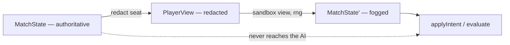
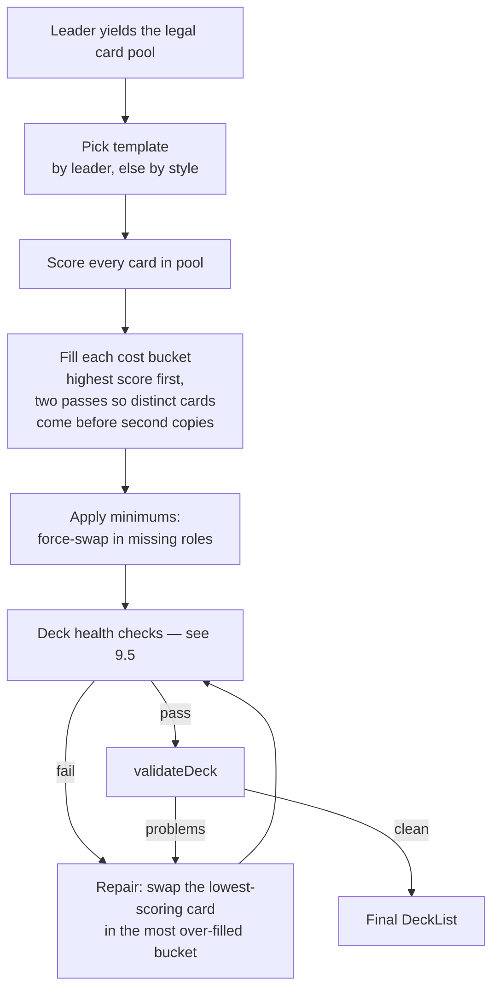

# HYPEBOUND — AI Design

> Status: Design specification. Subordinate to [`./00-core-rules.md`](./00-core-rules.md)
> (rules canon) and [`../tech/00-architecture-contract.md`](../tech/00-architecture-contract.md)
> (tech canon). Where those two disagree with each other, `src/engine/types.ts`
> wins. Every number in this document is an initial default and lives in data
> (`data/ai-profiles.json`, `data/ai-plans.json`, `data/balance.json`) or in the
> explicitly-named tunable constants of `src/ai/evaluator.ts` — nothing here is
> hardcoded gameplay.
>
> Related: [gameplay loop & match flow](./02-gameplay-loop-and-match-flow.md) ·
> [game modes](./09-game-modes.md) · [faction guides](./factions/)

This document specifies the HYPEBOUND AI opponent: how it decides, how it is
made worse on purpose, how it recognises combos and win conditions, what a Boss
is allowed to do that a normal AI is not, how it builds its own decks, and the
acceptance tests that prove all of the above.

**The one-line summary:** the AI enumerates the same legal intents a human is
offered, simulates each one through the real engine, scores the result with an
explicit heuristic evaluator, and picks the best — from a reconstruction of the
**redacted** view only. It never reads a card it is not allowed to see.

---

## 1. Design Goals

| # | Goal | Why |
|---|---|---|
| G1 | **Never cheat.** The AI's information is exactly the human's information at the same seat. | The owner brief demands a genuinely strategic game; an AI that peeks teaches nothing and feels bad the moment a player notices. |
| G2 | **Deterministic.** Same seed + same profile + same state ⇒ same intent, always. | Canon §10: replays, server authority, and the whole test suite depend on it. |
| G3 | **Legible.** Every difficulty's mistakes look like *human* mistakes, not like a random-number generator. | Beginner should feel like a new player, not like a broken program. |
| G4 | **Explainable.** Every decision can be printed as a ranked list of scored alternatives with the dominant evaluator terms. | Powers the Beginner/Casual "reasoning hints" teaching mode and all AI debugging. |
| G5 | **Cheap.** ≤ 250 ms of compute per decision on a mid-tier mobile browser. | The AI runs in the player's tab; the presenter owns pacing and must never wait on it. |
| G6 | **Content-agnostic.** New cards require zero AI code changes. | Mirrors the data-driven engine rule. The AI reads effects through the same DSL the engine does, plus optional `plan:` tags. |

**Non-goals.** No neural nets, no learned weights, no opponent-hand inference
by card counting (see §7.5 for what the AI *is* allowed to infer), no
tree search across the opponent's turn (§3.5 explains why), and no
difficulty that comes from resource cheating in non-Boss modes.

---

## 2. Module Map & Responsibilities

Per the architecture contract, `src/ai/` may import `src/engine/` and nothing
else. It never imports `three`, DOM, `Math.random`, or `Date`.

| File | Owns |
|---|---|
| `src/ai/ai.ts` | `chooseIntent()`, `planTurn()`, mulligan policy, profile gates, noise application |
| `src/ai/evaluator.ts` | `evaluate()`, `EvalWeights`, `BASE_WEIGHTS`, `weightsFor(profile)`, `detectLethal()` |
| `src/ai/profiles.ts` | Loads and validates `data/ai-profiles.json`; difficulty order, labels, blurbs |
| `src/ai/sandbox.ts` *(new)* | `sandbox(view, rng)` — builds a simulatable state from a redacted `PlayerView` (§3.2) |
| `src/ai/plans.ts` *(new)* | Loads `data/ai-plans.json`; `planReadiness()`, `threatModel()` (§7) |
| `src/ai/deckbuilder.ts` *(new)* | Synergy-aware auto-deck generation on top of `engine/deck.ts` (§9) |
| `src/ai/boss.ts` *(new)* | Boss scripts, phase profiles, telegraph scheduling (§8) |
| `data/ai-profiles.json` | **Canonical** difficulty tuning: the six `AiProfile` records |
| `data/ai-plans.json` *(new)* | Plan recipes and deck templates referenced by `plan:` tags |
| `data/ai-bosses.json` *(new)* | Boss encounter configs: openings, phases, telegraphs, `bossCards` |
| `tests/ai/` | Simulation harness, acceptance matrix, no-peek tests (§10) |

Existing engine functions the AI consumes verbatim — it adds no rules logic of
its own:

`enumerateLegalIntents` · `checkPlayable` · `canAttack` · `legalAttackTargets` ·
`previewAttack` · `availableConfluences` · `canUseFixation` ·
`canActivateLocation` · `applyIntent` · `redact` · `stateHash` · `validateDeck` ·
`legalCardPool` · `hasAdvantage` · `seedRng`/`nextInt`

---

## 3. Architecture

### 3.1 The decision pipeline

```mermaid
flowchart TD
  VIEW["PlayerView from redact&#40;state, seat&#41;"] --> SB["sandbox&#40;view, rng&#41;<br/>fog-fills hidden zones"]
  SB --> ENUM["enumerateLegalIntents&#40;&#41;<br/>engine legality, capped expansion"]
  ENUM --> GATE["Profile gates<br/>confluence / lethal / banned tactics"]
  GATE --> LOOP["For each candidate:<br/>applyIntent on a clone"]
  LOOP --> EV["evaluate&#40;next, seat, weights&#41;"]
  EV --> DEEP{"searchDepth &gt; 1<br/>and turn continues?"}
  DEEP -->|yes| FOLLOW["Beam: best follow-up intents<br/>recurse, depth - 1"]
  DEEP -->|no| NOISE
  FOLLOW --> NOISE["+ seeded noise&#40;profile.noise&#41;"]
  NOISE --> PICK["argmax score"]
  PICK --> OUT["AiDecision: intent, score,<br/>consideredCount, rationale"]
  OUT --> DRIVER["LocalMatch driver applies it,<br/>presenter animates, loop repeats"]
```



The AI decides **one intent at a time**. `LocalMatch.maybeRunAi()` calls
`chooseIntent()` in a loop (guarded at 40 actions) so every step produces its
own `EngineEvent` batch and animates individually. `planTurn()` is the batch
variant used by the simulation harness and by puzzle validation, where no
presentation is needed.

### 3.2 The information boundary — `sandbox(view, rng)`

**Binding rule: the AI is constructed from a `PlayerView`, never from the
authoritative `MatchState`.** Because the engine's reducer needs a full
`MatchState`, the AI layer reconstructs one whose hidden regions are filled
with *fog*.



`sandbox()` construction rules:

| Region | Reconstruction |
|---|---|
| `players[seat]` (own) | Copied from `view.you` **except** `deck`, which is re-shuffled with the AI's private rng. The AI knows its decklist; it must not know its draw order. |
| Opponent scalar state | `leaderHealth`, `leaderMaxHealth`, `armor`, `hype`, `hypeMax`, `obsession`, `resonanceProgress`, `pureCurrent` copied from `view.opponent`. |
| Opponent `board`, `location`, `activeEvent`, `discard` | Copied verbatim — all public. |
| Opponent `hand` | `handCount` instances of the synthetic card **`ai-fog`**. |
| Opponent `deck` | `deckCount` instances of `ai-fog`. |
| Opponent `reactions` | `reactionCount` instances of **`ai-fog-reaction`**. |
| Opponent `banished` | `banishedCount` anonymous placeholders (count only; contents are not in the redacted view). |
| Opponent private counters (`fatigueCounter`, `hypeLockedNextTurn`, `cardsPlayedThisTurn`, `hypeSpentThisTurn`, `currentsPlayedThisTurn`, `confluenceUsedThisTurn`, `fixationUsedThisTurn`, `ultimateUsed`, `supportObsessionGainedThisTurn`, `refractionCurrent`, `mulliganDone`) | Set to neutral defaults. **The evaluator is forbidden from reading them** (§4.7 whitelist). |

The two synthetic cards live in an **in-memory content overlay** created by
`src/ai/sandbox.ts`. They are never written to `data/` and never appear in the
collection, packs, validator output, or a real match:

| Synthetic card | Definition |
|---|---|
| `ai-fog` | Neutral / Prism / Action / Common / cost 0 / no effects / `token: true` / name "Unknown Card" |
| `ai-fog-reaction` | Neutral / Prism / Reaction / Common / cost 0 / no `reactionOn` / `token: true` / name "Face-down Reaction" |

**Fog resolution rule.** Any op that would reveal opponent-private information
during simulation (`stealCopy` from `enemyHand`/`enemyDeck`, `discard` targeting
the enemy hand, `mill` on the enemy deck, `scry` after a deck-shuffling
opponent effect) resolves against fog cards and returns nothing informative.
The AI values each fog card at the constant `UNKNOWN_CARD_VALUE = 1.8` — the
same number as the `cardAdvantage` weight, so "steal a card" and "draw a card"
are valued identically, which is the correct first-order approximation.

**Why this is safe and testable.** `sandbox()` output is a pure function of the
`PlayerView`. Therefore permuting the true hidden state cannot change the AI's
decision — asserted directly in §10.5.

### 3.3 Intent enumeration

The AI does not build its own legality logic. `enumerateLegalIntents(state,
content, seat, {maxPerCard})` returns exactly the moves the UI would offer:

| Intent | Expansion | Cap |
|---|---|---|
| `playCard` | one per (empty slot × legal choose-target × `chooseOne` branch × Refract current) | `maxPerCard` targets; branches limited to indexes 0 and 1 |
| `attack` | one per (ready attacker × legal target), Spotlight already enforced by `legalAttackTargets` | uncapped (bounded by 6 attackers × 7 targets) |
| `useFixation` | `kind: "fixation"` and `kind: "ultimate"` × legal targets; `canUseFixation` already applies Full Fixation | `maxPerCard` |
| `activateLocation` | one, if the location has an `activate` effect, unused this turn, durability remaining | 1 |
| `activateConfluence` | one per (available confluence × choice branch × legal target) | `maxPerCard` |
| `endTurn` | always last | 1 |
| `mulligan` | handled separately by the mulligan policy (§5.6), not enumerated | — |

Characters are placed in `firstEmptySlot(player)` only. Slot choice matters
only for `adjacent` targeting; enumerating all six slots would multiply the
branching factor by six for a marginal gain. **Decision:** slot selection stays
first-fit at all difficulties; if `adjacent`-relevant cards ever become
competitively meaningful, Expert and Boss gain a second candidate slot (the one
adjacent to the highest-value friendly character) before anything else changes.

`endTurn` carries a flat **−1.5 penalty** so that the AI prefers to convert
resources rather than pass with a playable hand. This is the single most
important anti-durdle constant in the system; it is why the AI does not sit on
7 Hype doing nothing.

### 3.4 Scoring and bounded lookahead

```
score(intent) = evaluate(applyIntent(state, intent), seat, weights)
              + (intent is endTurn ? -1.5 : 0)
              + (depth > 1 ? max over follow-up intents of score(...) - score : 0)
              + noise(profile.noise)
```

- **Depth 1** (Beginner, Casual): pure greedy — the value of the state right
  after this one intent.
- **Depth 2** (Intermediate, Advanced): the intent plus its best follow-up.
  This is what makes an AI able to "play the buff *then* attack" and to see a
  two-card removal line.
- **Depth 3** (Expert, Boss): three-intent sequences — enough to find
  "cheap card → Confluence unlocked → Confluence for lethal", the
  characteristic HYPEBOUND combo shape.

Lookahead only ever extends **within the AI's own turn** (`next.activeSeat ===
seat`) and never expands `endTurn`. Follow-up enumeration uses a tighter
`maxPerCard: 4` and a **beam width of 14**, ordered by a fast static
pre-score (immediate damage/removal first, then card plays by cost descending,
then everything else) so the beam keeps the lines that matter.

**Transposition guard.** Play order frequently produces identical states
(playing A then B vs B then A). Before recursing, the AI hashes the candidate
state with `stateHash()` and skips states already visited at this depth.
Measured on stock decks this removes 25–40% of depth-3 nodes at zero behavioural
cost.

**Node budget.** Each difficulty has a hard cap on simulated intents per
decision (§5.5). When the budget is exhausted the search returns best-so-far.
The budget is checked, not estimated — this is what keeps G5 true on a phone.

### 3.5 Why there is no opponent ply

A minimax ply across the opponent's turn would require sampling their hidden
hand, which is (a) expensive, (b) a determinism hazard, and (c) the exact place
where "AI feels like it cheats" bugs are born. Instead the AI uses a static
**danger term** in the evaluator (§4.6): an estimate of incoming damage derived
only from public information. Expert and Boss additionally use the
**threat model** in §7.5. This is cheaper, deterministic, and demonstrably
un-cheatable.

### 3.6 Determinism rules (binding)

1. All AI randomness flows through one `RngState` seeded from the match seed
   (`seed ^ 0x9e3779b9` in `LocalMatch`). No `Math.random`, no `Date`.
2. Noise is drawn from the sum of three uniforms scaled to `[-noise, +noise]`
   (triangular, no `Math` transcendentals) — see `noise()` in `ai.ts`.
3. Candidate ordering is stable: enumeration order is deterministic, and ties
   are broken by first-seen (strictly `>` comparison against `bestScore`).
4. `Map`/`Set` iteration is never used for ordering decisions; only arrays.
5. Floating-point evaluation is fine because it is *identical* floating point on
   every machine running the same build — the AI is replayed as an intent log,
   never as a re-derived decision, so even a future FP divergence cannot break a
   replay.

---

## 4. The Board Evaluator

`evaluate(state, content, seat, weights) → number`. Positive is good for
`seat`. Pure, allocation-light, called tens of thousands of times per match.

### 4.1 Calibration unit

Every weight is anchored to **one point of enemy leader health = 2.8 points**.
That makes the whole table readable at a glance:

| Asset | Eval points | ≈ enemy leader HP |
|---|---|---|
| 1 enemy leader HP removed | 2.8 | 1.00 |
| 1 own leader HP | 2.4 | 0.86 |
| A vanilla 3/3 on board | 3(1.35) + 3(0.9) + 0.7 = **7.45** | 2.66 |
| A vanilla 2/2 on board | 2(1.35) + 2(0.9) + 0.7 = **5.20** | 1.86 |
| A card in hand | 1.8 | 0.64 |
| 1 unspent Hype at end of turn | −1.1 | −0.39 |
| 1 point of Obsession (below 8) | 0.55 | 0.20 |
| 1 point of Obsession (at 8+) | −1.6 net | −0.57 |

These ratios are the standard, well-understood TCG heuristic shape: a body is
worth about two and a half face-damage points, a card is worth about half a
body's face value, and tempo is real but cheap. They exist to be tuned by the
acceptance matrix in §10, not to be philosophically correct.

### 4.2 Weight table (`BASE_WEIGHTS`, v1.1)

Weights marked **shipped** are the values already in `src/ai/evaluator.ts` and
must not be changed by this document. Weights marked **v1.1** are the additions
this specification introduces; all default to a no-op when their data is absent.

| Key | Value | Status | Models |
|---|---|---|---|
| `leaderHealth` | 2.4 | shipped | Own leader HP + armor |
| `enemyLeaderHealth` | 2.8 | shipped | Enemy leader HP + armor (asymmetric: killing is worth more than surviving) |
| `boardAttack` | 1.35 | shipped | Per point of Attack on board (attack is the clock) |
| `boardHealth` | 0.9 | shipped | Per point of Health on board |
| `characterCount` | 0.7 | shipped | Per body — bodies have option value beyond stats |
| `cardAdvantage` | 1.8 | shipped | Per card of hand-size differential |
| `hypeEfficiency` | 1.1 | shipped | Per unspent Hype (negative) and per point of Overload debt ×0.8 |
| `obsession` | 0.55 | shipped | Per Obsession below the danger threshold |
| `obsessionRisk` | 1.6 | shipped | Per Obsession at or above 8 (negative); enemy's counts at ×0.7 |
| `currentAdvantage` | 0.8 | shipped | Per favourable board matchup pair |
| `spotlight` | 0.5 | shipped | Per Spotlight body |
| `shielded` | 0.6 | shipped | Per Shielded body |
| `lethalBonus` | 1000 | shipped | Terminal win; loss is −1000; draw is −500 |
| `resonance` | 0.4 | shipped (inline) | Per point of Perfect Resonance progress, pure decks only |
| `fatigueProximity` | 1.2 | shipped (inline) | Per card below 5 remaining in own deck (negative) |
| `finaleProgress` | 6.0 | v1.1 | Per unit of own Finale-card progress ratio (§7.6) |
| `enemyFinaleProgress` | 7.0 | v1.1 | Per unit of enemy Finale progress ratio (negative) |
| `planReadiness` | 3.5 | v1.1 | Per unit of best-plan readiness 0–1 (§7.4) |
| `handBurnRisk` | 1.5 | v1.1 | Per card above 9 in hand (negative) — "Lost in the Feed" is real loss |
| `reactionThreat` | 0.9 | v1.1 | Per enemy face-down Reaction (negative), Intermediate+ only |
| `equipmentValue` | 0.5 | v1.1 | Per equipped friendly character (equipment is a 2-for-1 risk *and* a stat pack) |
| `locationValue` | 1.2 | v1.1 | Own location present (+), enemy location present (−) |
| `handCurrentFit` | 0.15 | v1.1 | Per hand card whose Current beats a Current on the enemy board |
| `dangerPenalty` | 18.0 | v1.1 | Flat penalty when estimated enemy next-turn damage ≥ own leader HP (§4.6) |
| `cancelledPenalty` | 1.4 | shipped (inline, `characterCount × 2`) | Per own Cancelled body |

### 4.3 Term-by-term specification

**Terminal.** `winner === seat → +1000`; `winner === foe → −1000`;
`"draw" → −500`. A draw is bad but strictly better than a loss, which
correctly makes a simultaneous-lethal line preferable to certain death.

**Leader health differential.**
`+(me.leaderHealth + me.armor) × 2.4 − (them.leaderHealth + them.armor) × 2.8`.
Armor is summed with health because `Armor X` absorbs the next X damage from any
source, making it functionally effective HP. The asymmetry (2.8 vs 2.4) encodes
"racing is slightly better than durdling", which is what keeps AI matches inside
the 5–12 minute pacing band.

**Board stats.** For every friendly character: `+attack × 1.35 + health × 0.9 +
0.7`, plus `0.5` for Spotlight, `0.6` for Shielded, `0.5` if equipped, minus
`1.4` if Cancelled. Mirrored (negated) for enemy characters, except that
Cancelled enemies are not credited (the AI should not fall in love with its own
`cancel` effects; the stat loss already shows up because a Cancelled body cannot
attack). `totalAttack()` is used rather than raw `attack` so auras, equipment
and `Empowered`/`Weakened` are all included exactly as the engine sees them.

**Card advantage.** `(me.hand.length − them.handCount) × 1.8`, plus
`handBurnRisk`: `−(handSize − 9) × 1.5` when `handSize ≥ 10`. Cards above the
hand limit are destroyed ("Lost in the Feed"), so an eleventh card is worth
strictly negative value and the AI must learn to dump before drawing.

**Hype efficiency.** `−me.hype × 1.1 − me.hypeLockedNextTurn × 1.1 × 0.8`.
Unspent Hype is wasted tempo; Overload debt is *pre-wasted* tempo, discounted
because it is one turn away. This term is what makes the AI curve out: at any
given moment, converting 3 Hype into a 3/3 is worth `7.45 + 3.3 = 10.75`, and no
comparable amount of caution beats it.

**Obsession position.** Canon §3.2 makes Obsession a push-your-luck dial, and
the evaluator models it exactly:

```
+ min(obsession, 7) × 0.55                       // fuel for Fixations
− (obsession − 7) × 1.6        if obsession ≥ 8   // Obsessed: +1 damage taken from all enemy sources
+ (enemyObsession − 7) × 1.12  if enemy ≥ 8       // their fragility is our asset, discounted 0.7×
```

At 7 Obsession the position is worth `+3.85`. At 8 it is `+3.85 − 1.6 = +2.25`.
At 10 it is `+3.85 − 4.8 = −0.95`. So the AI naturally parks at 7 (Ultimate
online, not yet Obsessed) and only climbs to 10 when a concrete payoff — a Full
Fixation line worth more than 4.8 points — is visible in the search. That is
precisely the intended human decision, produced by two numbers instead of a
special case. Riding to 10 deliberately is a gated tactic (`obsessionBrinkmanship`,
§5.4) because the payoff only shows up at `searchDepth ≥ 2`.

**Current-advantage positioning.** For every (friendly, enemy) character pair:
`+0.8` if the friendly Current beats the enemy Current, `−0.8` if the reverse
(`hasAdvantage()` — Cinder→Gale→Root→Pulse→Tide→Cinder, Halo↔Veil both ways,
Prism neutral until Refracted). This is a *positional* term, not a damage term:
the actual +1 is already inside `applyIntent`'s combat resolution, so the AI
sees the real damage in the resulting state. The positional term is what makes
it prefer *keeping* the favourable board and prefer trading away characters that
are elementally outclassed. `handCurrentFit` (+0.15 per hand card whose Current
beats something on the enemy board) is the same idea one step earlier and is
deliberately tiny — it should nudge, never dominate.

**Win-condition progress.** Three separate clocks:

| Clock | Formula | Notes |
|---|---|---|
| Perfect Resonance | `+resonanceProgress × 0.4` while `pureCurrent && !resonanceActivated` | Max `7 × 0.4 = 2.8` — one leader HP. Enough to break ties in favour of the on-Current play, not enough to distort a deck's game plan. |
| Finale cards | `+ownFinaleRatio × 6.0 − enemyFinaleRatio × 7.0` | Ratio = counters ÷ threshold, read from the Finale card's `grow`/delayed progress (§7.6). Asymmetric so removing an enemy Finale outbids protecting its own. |
| Burnout (fatigue) | `−(5 − deckCount) × 1.2` when `deckCount < 5` | Deliberately steep: at 0 cards left this is −6, more than two leader HP, so the AI stops durdling and commits. |

**Reaction threat.** `−0.9 × enemy face-down Reaction count`, applied only when
the `playAroundEnemyReaction` tactic is unlocked (§5.4). Below that gate the
term is zero — a Beginner genuinely does not think about face-down cards, and
that is the correct beginner behaviour.

### 4.4 Worked example

State (AI is seat 1, `balanced` style, `BASE_WEIGHTS`):

- AI leader 22 HP, 0 armor. Enemy leader 14 HP, 2 armor.
- AI board: Halo 3/4 with Spotlight; Pulse 2/2.
- Enemy board: Veil 4/3; Tide 1/5.
- AI hand 5 cards, enemy hand 3. AI Hype remaining 2, Overload debt 1.
- AI Obsession 7, enemy Obsession 9. AI deck 14 cards, pure Halo, resonance 4/7.

| Term | Computation | Value |
|---|---|---|
| Own leader | 22 × 2.4 | +52.80 |
| Enemy leader | −(14 + 2) × 2.8 | −44.80 |
| Own board | (3+2)×1.35 + (4+2)×0.9 + 2×0.7 + 0.5 Spotlight | +14.05 |
| Enemy board | −[(4+1)×1.35 + (3+5)×0.9 + 2×0.7] | −15.35 |
| Current positioning | Halo beats Veil (+0.8); Pulse beats Tide (+0.8); Veil beats Halo (−0.8) | +0.80 |
| Card advantage | (5 − 3) × 1.8 | +3.60 |
| Hype efficiency | −2 × 1.1 − 1 × 0.88 | −3.08 |
| Obsession | min(7,7) × 0.55 | +3.85 |
| Enemy Obsession risk | (9 − 7) × 1.12 | +2.24 |
| Resonance | 4 × 0.4 | +1.60 |
| **Total** | | **+15.71** |

The AI is ahead by about 5.6 enemy leader HP. Now compare two candidate intents
(the enemy leader card is Veil, so our Halo 3/4 gets the mutual Halo↔Veil +1
either way):

- **Attack the enemy leader with the 3/4.** 3 + 1 elemental = 4, of which 2 is
  eaten by Armor. Enemy leader → 12 HP, 0 armor.
  Δ = `(16 × 2.8) − (12 × 2.8)` = **+11.20**.
- **Trade the 3/4 into the enemy Veil 4/3.** 3 + 1 kills it; the 4 back kills
  our 3/4. We lose `3(1.35) + 4(0.9) + 0.7 + 0.5 = 8.85`; they lose
  `4(1.35) + 3(0.9) + 0.7 = 8.80`. The two Current-pair terms cancel (we lose a
  +0.8 and a −0.8). Δ = **−0.05**.

The AI attacks face — correct, because it is ahead on board, the enemy is
Obsessed (taking +1 from all sources), and the trade is stat-neutral.

Now reverse the leaders (AI at 9, enemy at 24) and leave everything else alone.
The enemy's 4/3 and 1/5 can attack next turn for 5, plus `expectedReach` 2 for a
Gothic Royalty leader, plus 3 because their Obsession is ≥ 7 — an estimated 10
incoming against our 9 HP, so `dangerPenalty` applies. Attacking face leaves the
4/3 alive and still triggers the penalty: `11.20 − 18.0 = −6.80`. Trading
removes 4 of the incoming damage, dropping the estimate to 6 and clearing the
penalty: **−0.05 wins**. The AI blocks. Same weights, opposite decision, no
special-case rule anywhere.

### 4.5 Lethal detection

`detectLethal(state, content, seat)` is a cheap, conservative pre-check:

1. If any enemy character has **Spotlight** and is not **Lurking**, return
   `false` — face damage is blocked, so no attack-only lethal exists.
2. Sum `totalAttack()` over friendly characters that are neither summoning-sick
   (`enteredOnTurn >= globalTurnCounter` without **Raid**) nor out of attacks.
3. Return `sum ≥ enemyLeaderHealth + enemyArmor`.

It is deliberately conservative: it ignores burn from hand, Fixations,
Confluences and the elemental +1. Those lines are found by the ordinary search
(a lethal state scores +1000 and wins every comparison); `detectLethal` exists
solely to drive the `lethalAwareness` gate, i.e. to decide whether a weak AI is
*allowed to notice the obvious one*. Under-reporting therefore fails safe: a
Beginner that misses a clever lethal is fine, a Beginner that finds one is not.

When the gate passes, the AI immediately returns the first face attack with
score `Infinity` and stops searching — this also saves the node budget on the
turn where it matters least.

### 4.6 The danger term

Available at `searchDepth ≥ 2`. Estimates incoming damage from public
information only:

```
incoming = Σ totalAttack(enemy characters that can attack next turn)
         + expectedReach(enemyFactionOfLeader)
         + (enemyObsession >= 7 ? 3 : 0)          // an Ultimate is online
         + (myObsession >= 8 ? countOfEnemyDamageSources : 0)   // Obsessed: +1 per source
```

`expectedReach` — the burn a faction typically holds in hand, by leader faction:

| Faction | Reach | Faction | Reach |
|---|---|---|---|
| Digital Demons | 4 | Corporate Creators | 2 |
| Neon Idols | 3 | Gothic Royalty | 2 |
| Viral Influencers | 3 | Algorithm Syndicate | 2 |
| Afterparty Crew | 3 | Meme Collective | 2 |
| Touch-Grass Order | 1 | Cosplay Champions | 1 |
| Neutral / unknown | 2 | | |

If `incoming ≥ myLeaderHealth + myArmor`, apply `−dangerPenalty` (18.0 ≈ 6.4
leader HP). This single term is what makes Advanced and Expert stop racing and
start blocking at the correct moment, and it is why they hold a Spotlight body
back instead of attacking with everything.

### 4.7 Opponent-field whitelist (binding)

`evaluate()` may read exactly these fields of the opponent, and no others:

`leaderHealth`, `leaderMaxHealth`, `armor`, `statuses` (leader), `hype`,
`hypeMax`, `obsession`, `handCount`, `deckCount`, `discard`, `board`,
`banishedCount`, `location`, `reactionCount`, `activeEvent`,
`resonanceProgress`, `pureCurrent`, plus the opponent's leader card id (public
from match start).

This list is exactly `RedactedOpponent` in `types.ts`. It is enforced twice: by
`sandbox()` (the other fields are neutral defaults, so reading them yields
nothing) and by the permutation test in §10.5 (which fails loudly if a future
term ever starts reading real hidden data).

---

## 5. The Difficulty Ladder

### 5.1 Canonical profile values

These six records are `data/ai-profiles.json` verbatim. **They are canonical
input to this design, not output of it.**

| Difficulty | `noise` | `lethalAwareness` | `confluenceAwareness` | `searchDepth` | `style` |
|---|---|---|---|---|---|
| **Beginner** | 3.0 | 0.50 | 0.20 | 1 | balanced |
| **Casual** | 2.0 | 0.70 | 0.50 | 1 | balanced |
| **Intermediate** | 1.2 | 0.85 | 0.70 | 2 | balanced |
| **Advanced** | 0.6 | 0.95 | 0.90 | 2 | balanced |
| **Expert** | 0.2 | 1.00 | 1.00 | 3 | balanced |
| **Boss** | 0.1 | 1.00 | 1.00 | 3 | aggressive (+ `bossCards`, `balanceOverrides`) |

**Every behavioural difference between tiers is derived from these five fields.**
No new `AiProfile` field is introduced by this document. That constraint is
deliberate: it keeps the difficulty surface small enough to tune, and it means a
designer can invent a new difficulty by writing one JSON object.

### 5.2 Derived dials

| Dial | Formula | Beg | Cas | Int | Adv | Exp | Boss |
|---|---|---|---|---|---|---|---|
| `sloppiness` | `clamp(noise / 3, 0, 1)` | 1.000 | 0.667 | 0.400 | 0.200 | 0.067 | 0.033 |
| `discipline` | `1 − sloppiness` | 0.000 | 0.333 | 0.600 | 0.800 | 0.933 | 0.967 |
| `systemsAwareness` | `confluenceAwareness` | 0.20 | 0.50 | 0.70 | 0.90 | 1.00 | 1.00 |
| `foresight` | `searchDepth` | 1 | 1 | 2 | 2 | 3 | 3 |
| `p(random attack target)` | `0.35 × sloppiness` | 0.350 | 0.233 | 0.140 | 0.070 | 0.023 | 0.012 |
| `p(random card choice)` | `0.20 × sloppiness` | 0.200 | 0.133 | 0.080 | 0.040 | 0.013 | 0.007 |
| `p(skip available Fixation)` | `0.5 × (1 − systemsAwareness)` | 0.400 | 0.250 | 0.150 | 0.050 | 0.000 | 0.000 |
| `p(mulligan error)` | `0.15 × sloppiness` | 0.150 | 0.100 | 0.060 | 0.030 | 0.010 | 0.005 |
| `mulligan keep-curve` | `noise ≥ 3 → 6; ≥ 2 → 5; else 4` | 6 | 5 | 4 | 4 | 4 | 4 |
| `hold Ultimate until turn` | `sloppiness ≥ 0.6 → 8; ≥ 0.35 → 6; else none` | 8 | 8 | 6 | — | — | — |
| `maxPerCard` (enumeration) | `searchDepth > 2 ? 8 : 5` | 5 | 5 | 5 | 5 | 8 | 8 |

**How much does `noise` actually do?** Noise is uniform-ish in
`[−noise, +noise]`, so Beginner's ±3.0 is ±1.07 leader HP — enough to scramble
near-equivalent lines, nowhere near enough to throw away a 7.45-point body.
**Noise is a tie-breaker, not the difficulty lever.** The tactic gates below do
the heavy lifting, and that is intentional: an AI made bad purely by noise plays
*randomly*, which reads as broken rather than as inexperienced.

### 5.3 Tactic gates — what each tier is banned from doing

A tactic is *banned* when its gate fails, even when the evaluator would love it.
Bans are implemented as candidate filters and as zeroed weights, never as
post-hoc score fudging.

| Tactic | Unlock rule | Beg | Cas | Int | Adv | Exp | Boss |
|---|---|---|---|---|---|---|---|
| `lethalPush` — take the obvious lethal | `p = lethalAwareness` | 0.50 | 0.70 | 0.85 | 0.95 | ✓ | ✓ |
| `confluence` — use an available Confluence | `p = confluenceAwareness` | 0.20 | 0.50 | 0.70 | 0.90 | ✓ | ✓ |
| `elementalTargeting` — value the +1 when choosing targets | `noise ≤ 2.0` (else `currentAdvantage` = 0) | ✗ | ✓ | ✓ | ✓ | ✓ | ✓ |
| `equipmentTargeting` — equip the best carrier, not the first | `noise ≤ 2.0` | ✗ | ✓ | ✓ | ✓ | ✓ | ✓ |
| `reactionSet` — set face-down Reactions at all | `searchDepth ≥ 2` | ✗ | ✗ | ✓ | ✓ | ✓ | ✓ |
| `curveHold` — skip a play to enable a better next turn | `searchDepth ≥ 2` | ✗ | ✗ | ✓ | ✓ | ✓ | ✓ |
| `handLimitCare` — avoid burning cards at 10 | `noise ≤ 1.2` | ✗ | ✗ | ✓ | ✓ | ✓ | ✓ |
| `playAroundSweeper` — cap board commitment vs AoE factions | `noise ≤ 1.2` | ✗ | ✗ | ✓ | ✓ | ✓ | ✓ |
| `comboHold` — hold `plan:` combo pieces (§7.4) | `searchDepth ≥ 2` | ✗ | ✗ | ✓ | ✓ | ✓ | ✓ |
| `finaleRace` — prioritise enemy Finale removal / own protection | `searchDepth ≥ 2` | ✗ | ✗ | ✓ | ✓ | ✓ | ✓ |
| `obsessionBrinkmanship` — ride to 10 for Full Fixation | `confluenceAwareness ≥ 0.7` | ✗ | ✗ | ✓ | ✓ | ✓ | ✓ |
| `refractSmart` — choose the Refract Current for a Confluence or an advantage | `confluenceAwareness ≥ 0.7` | ✗ | ✗ | ✓ | ✓ | ✓ | ✓ |
| `playAroundEnemyReaction` — apply `reactionThreat` | `searchDepth ≥ 2` and `confluenceAwareness ≥ 0.7` | ✗ | ✗ | ✓ | ✓ | ✓ | ✓ |
| `dangerTerm` — model incoming lethal (§4.6) | `searchDepth ≥ 2` | ✗ | ✗ | ✓ | ✓ | ✓ | ✓ |
| `obsessionDeescalation` — refuse to cross 8 while facing reach | `noise ≤ 0.6` | ✗ | ✗ | ✗ | ✓ | ✓ | ✓ |
| `locationTiming` — hold a Location until the current one is spent | `noise ≤ 0.6` | ✗ | ✗ | ✗ | ✓ | ✓ | ✓ |
| `resonanceLine` — order plays to reach Perfect Resonance sooner | `confluenceAwareness ≥ 0.9` | ✗ | ✗ | ✗ | ✓ | ✓ | ✓ |
| `reactionBait` — attack with the worst body first to eat a Reaction | `searchDepth ≥ 3` | ✗ | ✗ | ✗ | ✗ | ✓ | ✓ |
| `deepPlan` — multi-turn `scheduleDelayed` / **Grow** sequencing | `searchDepth ≥ 3` | ✗ | ✗ | ✗ | ✗ | ✓ | ✓ |
| `fatigueClock` — deliberately grind to Burnout | `searchDepth ≥ 3` and `style ≠ aggressive` | ✗ | ✗ | ✗ | ✗ | ✓ | ✗ |
| `bossScript` — scripted openings, phases, telegraphs (§8) | `difficulty === "boss"` | ✗ | ✗ | ✗ | ✗ | ✗ | ✓ |

Note the deliberate asymmetry on the last two rows: the Boss profile is
`aggressive`, so it cannot fatigue-grind — a Boss that stalls out a co-op raid
would be miserable. Expert can, because Expert is the mirror of a strong human.

### 5.4 Deliberate-mistake rules, per tier

Each tier's characteristic errors, all produced by the dials above:

**Beginner** — *the friend who just installed the game.*
Misses half of all obvious lethals. Effectively never uses a Confluence (1 in 5).
Ignores the elemental +1 entirely when choosing attack targets. Picks a random
legal attack target 35% of the time, which reads as "attacked into the wrong
thing" rather than as randomness because the other 65% is competent. Never sets
Reactions. Mulligans to a 6-cost curve and throws back a perfectly good card 15%
of the time. Sits on the Ultimate until turn 8. Skips an available Fixation 40%
of the time. Depth-1 greedy, so it buffs *after* attacking about as often as
before.

**Casual** — *plays a few games a week.*
Takes lethal 70% of the time. Uses a Confluence when it happens to be the best
scoring option (50%). Understands the elemental bonus and equipment targeting.
Still never sets Reactions and still cannot see a two-card line. Holds the
Ultimate to turn 8. Skips a Fixation 25% of the time. Curve-mulligans to 5.

**Intermediate** — *the ladder regular.* The tier where the AI stops being a
tutorial and starts being an opponent. Two-ply search unlocks trading lines,
buff-then-attack sequencing, Reaction setting, hand-limit care, combo-piece
holding, Finale racing and Obsession brinkmanship. Still mis-targets 14% of
attacks and skips 15% of Fixations, still over-commits into an unseen board wipe
sometimes (it caps commitment but has no memory of what the opponent has already
shown).

**Advanced** — *plans two steps ahead and closes games.* 95% lethal, 90%
Confluence, near-clean targeting. Adds Obsession de-escalation (will refuse to
cross 8 when facing a reach faction), Location timing, and Resonance-aware
sequencing. Characteristic remaining flaw: two plies cannot see a three-card
combo turn, so it loses to a rehearsed Setlist or Full Kit turn it could have
disrupted.

**Expert** — *no mercy.* Three plies, effectively no noise, perfect lethal and
Confluence usage, Reaction baiting, multi-turn delayed-effect planning, and the
fatigue clock in grindy matchups. Its remaining weakness is structural and
intentional: no opponent ply, so it can still be surprised by a card it has
never seen. That is the correct ceiling for a heuristic AI in a game with hidden
information — an AI that could not be surprised would necessarily be cheating.

**Boss** — Expert plus `aggressive` style plus the boss kit in §8. Its
difficulty comes from cards, rules and scripts, **not** from better decisions.
That separation is a binding design rule and is measured in §10.3.

### 5.5 Think time and performance budget

"Think time" is *presented* delay. Real compute is far smaller; the delay exists
so the AI does not feel like a robot slamming intents.

| Difficulty | Node budget (simulated intents / decision) | Compute ceiling | Presented delay per intent | Whole-turn cap |
|---|---|---|---|---|
| Beginner | 40 | 60 ms | 350–800 ms | 8 s |
| Casual | 60 | 80 ms | 450–1000 ms | 9 s |
| Intermediate | 150 | 120 ms | 600–1300 ms | 11 s |
| Advanced | 300 | 180 ms | 800–1700 ms | 13 s |
| Expert | 600 | 250 ms | 1000–2200 ms | 15 s |
| Boss | 600 | 250 ms | 1000–2400 ms | 16 s |

```
presentedDelay = clamp(min + (max − min) × complexity + jitter, min, max)
complexity     = clamp(consideredCount / 40, 0, 1)
jitter         = seeded uniform in [−0.12, +0.12] × (max − min)
```

Complexity scaling means the AI visibly "thinks longer" on a busy board, which
players read as competence. Jitter is seeded (determinism) and exists to defeat
the inhuman-cadence pattern that the anti-cheat bot detector in
[game modes §7.9](./09-game-modes.md) looks for — our own AI should not look
like a bot either.

**Binding rules.** (a) The compute ceiling is enforced by the node budget, not
by a wall clock — a clock would break determinism. (b) The presented delay is
additive to animation time, respects the player's animation-speed setting, and
collapses to ~120 ms in "instant" mode. (c) The whole-turn cap is a UX
guarantee: if the AI would exceed it, remaining delays are set to the minimum.
(d) The AI never blocks the render loop; decisions are computed between animation
frames and the presenter never waits on `chooseIntent`.

### 5.6 Mulligan policy

Canon §2: during setup, select any subset of the opening hand once; selected
cards are shuffled back and replaced with the same count. The AI's policy:

1. **Never** throw back `token-borrowed-clout` (the second-player compensation
   card is free tempo).
2. Throw back any card whose cost exceeds the tier's **keep-curve** (6 / 5 / 4).
3. Additionally throw back with probability `p(mulligan error)` — the
   characteristic "I panicked and tossed my two-drop" beginner move.
4. At `searchDepth ≥ 2`, two refinements: keep at most one card costing exactly
   the keep-curve value, and keep a card below the curve only if it is
   playable on curve given the deck's Currents (no dead Prism splash in the
   opener when the deck has three Prism cards).
5. At `searchDepth ≥ 3`, one more: if the deck's primary plan (§7) has a
   `:key` piece, keep it regardless of cost when its cost ≤ 5 — Expert
   mulligans for its combo the way a human does.

Style modifies step 2: `aggressive` lowers the keep-curve by 1 (minimum 3),
`defensive` raises it by 1 (maximum 6), `combo` leaves it alone but applies
step 5 from `searchDepth ≥ 2`.

### 5.7 Difficulty auto-scaling (Quick Match)

[Game modes §4](./09-game-modes.md) specifies that Quick Match (AI) auto-scales
to a ~55% player win rate. The scaler:

- Tracks the last 10 AI matches in the save profile as a rolling record.
- **Promote** one tier after 3 consecutive player wins, or when the rolling win
  rate ≥ 70% over ≥ 6 games.
- **Demote** one tier after 3 consecutive player losses, or when the rolling win
  rate ≤ 35% over ≥ 6 games.
- Range is Beginner → Expert; **Boss is never selected by the scaler** (it is
  reserved for boss modes, per game modes §3).
- New accounts start at Beginner and are promoted after tutorial completion to
  Casual.
- The current tier is always displayed on the pre-match screen. Silent
  difficulty manipulation is forbidden — the player must always be able to see
  and override what they are playing against.

### 5.8 Reasoning hints (Beginner/Casual teaching mode)

`AiDecision` gains an optional `rationale`, populated only when the mode
requests it (Sparring's "show AI's reasoning hints" toggle, Beginner–Casual
only):

```ts
interface AiRationale {
  chosen: { label: string; score: number };          // i18n key + params
  alternatives: { label: string; score: number }[];  // top 3 rejected
  topTerms: { term: keyof EvalWeights; delta: number }[]; // top 3 contributors
}
```

Rendered as a small side panel: *"Attacked the 2/3 with the 3/2 (+8.8). Also
considered: face for 3 (+8.4), Fixation (+5.1). Biggest factors: board stats,
Current advantage."* All strings go through `i18n.t()` (`ai.rationale.*`). This
is a teaching feature and is unavailable at Intermediate and above, where it
would function as a strategy oracle.

---

## 6. Play-Style Profiles

`style` is orthogonal to difficulty: it changes *what the AI wants*, not *how
well it gets it*. A Beginner aggressive AI is bad at being aggressive; an Expert
aggressive AI is lethal.

### 6.1 Weight modifiers (exact multipliers)

Applied by `weightsFor(profile)` on top of `BASE_WEIGHTS`. Multipliers marked
**shipped** already exist in `src/ai/evaluator.ts`.

| Weight | aggressive | defensive | combo | balanced |
|---|---|---|---|---|
| `enemyLeaderHealth` | **×1.6** | **×0.75** | — | — |
| `leaderHealth` | **×0.65** | **×1.5** | — | — |
| `boardAttack` | **×1.25** | — | — | — |
| `boardHealth` | — | **×1.35** | — | — |
| `spotlight` | — | **×1.6** | — | — |
| `obsessionRisk` | **×0.6** | ×1.2 | — | — |
| `cardAdvantage` | ×0.8 | ×1.15 | **×1.7** | — |
| `hypeEfficiency` | ×1.15 | — | **×1.3** | — |
| `obsession` | — | — | **×1.4** | — |
| `planReadiness` | ×0.7 | ×0.9 | ×1.8 | — |
| `dangerPenalty` | ×0.7 | ×1.4 | ×1.1 | — |
| `finaleProgress` | ×0.8 | ×1.3 | ×1.5 | — |
| `handBurnRisk` | ×0.8 | ×1.2 | ×1.3 | — |

Reading the table as design intent:

- **Aggressive** values the enemy's remaining health at 4.48/point against its
  own at 1.56 — it will happily take 4 to deal 3, and it discounts the Obsessed
  penalty because it does not expect to be alive long enough to care.
- **Defensive** inverts that, and triples down on Spotlight bodies and board
  health; its `dangerPenalty ×1.4` makes it block a turn earlier than anyone
  else.
- **Combo** hoards: card advantage at 3.06/card, Obsession at 0.77/point, and
  the strongest `planReadiness` multiplier in the game. Its
  `hypeEfficiency ×1.3` looks paradoxical (it punishes unspent Hype *more*) and
  is deliberate: HYPEBOUND combo turns are chains of cheap cards, so leftover
  Hype means the chain was not found, and the AI should keep looking.
- **Balanced** is the untouched baseline and is what every non-Boss profile
  ships with.

### 6.2 Behavioural modifiers (beyond weights)

| Behaviour | aggressive | defensive | combo | balanced |
|---|---|---|---|---|
| `endTurn` penalty | −2.5 | −1.0 | −1.5 | −1.5 |
| Mulligan keep-curve delta | −1 | +1 | 0 | 0 |
| Combo-piece hold penalty (§7.4) | −1.5 | −3.0 | **−4.0** | −3.0 |
| Face-vs-trade tiebreak | face | trade | trade | evaluator only |
| Sets Reactions when unlocked | rarely (only 0–1 cost) | always | when a piece is uncastable | always |
| Ultimate Fixation timing | as soon as legal | only with a defensive payoff | only inside a plan | evaluator only |

### 6.3 Default style per deck

The AI's style is chosen from the deck it was handed, not from the difficulty.
`data/ai-plans.json` deck templates carry a `style`; when a deck matches no
template (a copied player deck, a drafted Gauntlet deck), the style is inferred:

```
aggressive  if avgCost <= 2.9 and characters >= 18
defensive   if avgCost >= 4.1 or (removal + sweepers) >= 8
combo       if plan tags resolve a plan with readinessBonus >= 3.0
balanced    otherwise
```

Default styles for the ten stock faction decks:

| Faction | Stock deck | Style | Faction | Stock deck | Style |
|---|---|---|---|---|---|
| Neon Idols | Setlist Encore | combo | Digital Demons | All-in Burn | aggressive |
| Neon Idols | Overdrive Tempo | aggressive | Cosplay Champions | Full Kit | balanced |
| Gothic Royalty | Vigil Attrition | defensive | Afterparty Crew | Last Call Engine | combo |
| Viral Influencers | Follower Flood | aggressive | Touch-Grass Order | Detox Control | defensive |
| Corporate Creators | Sponsorship Ramp | defensive | Algorithm Syndicate | Recommendation Engine | combo |
| Meme Collective | Repeated Joke | balanced | — | — | — |

Ranked-equivalent practice (Sparring, Quick Match) uses the deck's default
style. Boss encounters override it per phase (§8.5).

---

## 7. Plans: How the AI Recognises Combos and Win Conditions

A heuristic evaluator is blind to intent: it can see that a 0/8 body is worth
7.9 points, but not that it wins the game in four turns. **Plan tags** are the
bridge.

### 7.1 Plan tags live on cards, in the existing `tags` array

`CardDefBase.tags: string[]` already exists in `types.ts`. Plan annotations use
a reserved **`plan:`** prefix and require **zero schema change**:

```jsonc
{
  "id": "idol-lightwave-finale",
  "name": "Lightwave Finale",
  "tags": ["performance", "tech", "plan:reach", "plan:payoff", "plan:combo:idol-setlist:key"],
  ...
}
```

**Validator rules (binding):**

1. `plan:` is a reserved tag prefix. Only the AI layer and the deck builder may
   read it.
2. **No effect's `TargetFilter.tag` may reference a `plan:`-prefixed tag.** The
   validator rejects any card that tries. This guarantees plan tags can never
   affect rules outcomes, so retagging a card for AI purposes is always a
   zero-risk change.
3. Every `plan:combo:<id>` tag must resolve to a plan with that `id` in
   `data/ai-plans.json`; orphans are rejected by `npm run validate`.
4. Plan tags are stripped from auto-generated card text and hidden from the
   collection's tag filter UI. Players never see them.
5. `plan:wincon` is auto-derived: any card with `finale: true` is treated as
   carrying it, tagged or not.

### 7.2 Tag catalogue

| Tag | Meaning | Used by |
|---|---|---|
| `plan:threat` | Proactive body that pressures the opponent | Deck builder curve, aggressive style |
| `plan:removal` | Single-target removal (destroy, big damage, `cancel`, `banish`, `transform`) | Deck health checks, threat response |
| `plan:sweeper` | Multi-target damage or board answer | `playAroundSweeper`, threat model |
| `plan:reach` | Damage to the enemy leader from hand/ability | Lethal search seeding |
| `plan:draw` | Net card advantage | Deck health checks |
| `plan:ramp` | Hype generation or cost reduction | Deck health checks, combo plans |
| `plan:protect` | Heal, Shielded, Armor, Warded, Spotlight walls | Defensive style, Finale protection |
| `plan:disrupt` | `cancel`, `banish`, `discard`, `stealCopy`, aura disable | Enemy-plan interference |
| `plan:enabler` | Makes another card cheaper, bigger, or repeatable | Combo detection |
| `plan:payoff` | Scales with a condition (Harmony, Setlist, Grow, Resonance) | Combo detection |
| `plan:finisher` | The card the deck wins with | Plan readiness |
| `plan:wincon` | Finale / alternate win condition | §7.6, auto-derived from `finale` |
| `plan:combo:<id>` | Member of combo `<id>` | Plan matcher |
| `plan:combo:<id>:key` | **Mandatory** member of combo `<id>` | Plan matcher, hold penalty, mulligan |

Role tags are not mutually exclusive; a card commonly carries two or three.

### 7.3 `data/ai-plans.json`

```jsonc
{
  "plans": [
    {
      "id": "idol-setlist",
      "name": "Setlist Detonation",
      "kind": "combo",
      "faction": "neon-idols",
      "style": "combo",
      "pieces": [
        { "tag": "plan:combo:idol-setlist:key", "min": 1, "zone": "hand" },
        { "tag": "plan:combo:idol-setlist",     "min": 2, "zone": "hand" }
      ],
      "requires": {
        "hype": 8,
        "board": { "filter": { "tag": ["idol"] }, "min": 2 },
        "condition": { "kind": "cardsPlayedThisTurnAtLeast", "value": 0 }
      },
      "payoffTurn": 7,
      "readinessBonus": 3.5,
      "holdPieces": true
    },
    {
      "id": "cosplay-full-kit",
      "name": "Full Kit",
      "kind": "engine",
      "faction": "cosplay-champions",
      "style": "balanced",
      "pieces": [
        { "tag": "plan:combo:cosplay-full-kit:key", "min": 1, "zone": "board" },
        { "tag": "plan:enabler", "min": 2, "zone": "hand", "filter": { "type": ["equipment"] } }
      ],
      "requires": { "hype": 5, "board": { "filter": { "tag": ["cosplayer"] }, "min": 1 } },
      "payoffTurn": 6,
      "readinessBonus": 2.5,
      "holdPieces": false
    },
    {
      "id": "idol-eternelle",
      "name": "The Endless Encore",
      "kind": "finale",
      "faction": "neon-idols",
      "style": "combo",
      "pieces": [{ "tag": "plan:wincon", "min": 1, "zone": "any" }],
      "requires": { "hype": 6 },
      "counterThreshold": 4,
      "payoffTurn": 10,
      "readinessBonus": 5.0,
      "holdPieces": true,
      "protect": true
    }
  ],
  "deckTemplates": [ /* see §9.2 */ ]
}
```

`kind` is one of `combo` (a single explosive turn), `engine` (an incremental
value loop), `finale` (an alternate win condition), or `race` (a pure clock).
Ten to fifteen plans ship at launch — one or two per faction, matching the
archetypes named in the faction guides.

### 7.4 Readiness and how it feeds the search

```
readiness(plan) = 0.45 × pieceSatisfaction      // fraction of required pieces present
                + 0.30 × resourceSatisfaction    // min(1, availableHype / requires.hype)
                + 0.25 × boardSatisfaction       // fraction of required board conditions met
```

Evaluated for every plan whose faction matches the AI's leader. The best plan's
readiness feeds the evaluator as `readiness × planReadiness (3.5)`, scaled by
the plan's `readinessBonus / 3.5`. A fully assembled Setlist Detonation is
therefore worth `1.0 × 3.5 = +3.5` before the combo even resolves — 1.25 leader
HP of "I am about to do something" — which is enough to make the AI prefer the
setup turn over an equal-value tempo turn, and not enough to make it durdle
forever.

**Hold penalty.** When `holdPieces` is true and `readiness ≥ 0.6` and the
`comboHold` tactic is unlocked, spending a `:key` piece outside its plan costs
the style's combo-piece hold penalty (−1.5 to −4.0). Three exemptions override
the hold, because a combo you die holding is worth nothing:

1. The play produces lethal (score ≥ +1000 dominates anyway).
2. The `dangerPenalty` is active — the AI is facing lethal next turn.
3. The plan's `payoffTurn` has passed by 3 or more turns (the combo is dead;
   cash the pieces in).

**Mulligan and deck building** read the same tags: §5.6 step 5 keeps `:key`
pieces, and §9.3 weights them into deck generation.

### 7.5 Threat model — reading the opponent's plan

Built from **public information only**: the opponent's leader card (faction,
Currents — public from `matchStarted`), their board, their discard pile, their
active Event and Location, and their `pureCurrent`/`resonanceProgress` (both in
`RedactedOpponent`).

```mermaid
flowchart LR
  PUB["Public info:<br/>leader, board, discard,<br/>location, event, resonance"] --> MATCH["Match against plans<br/>of that faction"]
  MATCH --> ARCH["Inferred archetype<br/>+ confidence 0..1"]
  ARCH --> DANGER["expectedReach&#40;faction&#41;<br/>sweeper probability<br/>dangerTurn estimate"]
  DANGER --> EVAL["dangerPenalty,<br/>playAroundSweeper cap,<br/>finaleRace priority"]
```



Three concrete outputs, all gated behind `searchDepth ≥ 2`:

| Output | Use |
|---|---|
| `expectedReach` | Feeds the danger term (§4.6). |
| `sweeperRisk` (0–1) | Caps board commitment: the AI keeps `ceil(4 × sweeperRisk)` characters' worth of value in hand when `playAroundSweeper` is unlocked. Rises when the opponent's faction has `plan:sweeper` cards at or below their current Hype, and falls once a sweeper has been seen in their discard. |
| `dangerTurn` | The turn by which the inferred archetype expects to win. Drives whether the AI races or stabilises. |

**Explicitly banned inference:** card counting the opponent's deck contents
beyond what the discard pile publicly shows, and any use of `deckCount` to
deduce specific remaining cards. `deckCount` may be used only for the fatigue
clock. This is enforced by the whitelist in §4.7.

### 7.6 Finale cards (alternate win conditions)

Canon §2 requires every Finale card to be visible while progressing, to take at
least 2 turns from reveal, and to be interactable. That makes them fully
AI-legible: progress is public.

- **Own Finale.** Value `+ (counters / threshold) × 6.0`. When
  `plan.protect` is true and the Finale is on board, protective plays targeting
  it gain a `+2.0` bonus and the AI will not attack with it (it is usually a
  0/8-style body anyway).
- **Enemy Finale.** Value `− (counters / threshold) × 7.0`. Because the enemy
  term is larger, an intent that removes an enemy Finale at 3/4 counters is
  worth `+5.25` before any stat trade — enough to make the AI spend premium
  removal on a 0/8 body, which is exactly the counterplay the canon rule
  promises the player.
- **Cancelled / Banished Finales.** The AI knows from the faction guides'
  binding ruling that Banish clears counters, so `banish`/`touch-grass` on an
  enemy Finale is valued at the full removal amount, while `cancel` is valued at
  60% of it (it stops progress but the counters survive).
- Finale progress is read from the public board state (counter badges are part
  of the character instance's `growProgress` or a `scheduleDelayed` label), never
  from a hidden field.

---

## 8. Boss AI

### 8.1 What a Boss actually is

A Boss is **not a smarter AI**. Its decision quality is Expert-equivalent
(`noise` 0.1 vs 0.2 is inside the tie-break band). Its difficulty comes from
four levers, in this order of importance:

1. **Unique cards** (`AiProfile.bossCards`) — a kit the player cannot have.
2. **Rule twists** (`AiProfile.balanceOverrides` merged into
   `MatchConfig.balanceOverrides`) — symmetric by construction, see §8.3.
3. **Scripted openings** — the fight opens the same dramatic way every time.
4. **Phase behaviour** — the Boss changes style as its health drops.

Every one of those is data. `src/ai/boss.ts` contains no per-boss code.

### 8.2 Boss-only cards

`bossCards: string[]` on the profile lists card ids that are inserted into the
boss's deck (or opening hand, per the encounter config) at match creation.

- They live in **`data/cards/bosses.json`**, auto-discovered by the same
  `import.meta.glob` as every other card file — no code change to add a boss.
- Each carries the tag **`boss-only`**. `collectibleCards()` filters it exactly
  as it filters `token: true`, so boss cards never appear in the collection,
  packs, crafting, deck builder, or Gauntlet offers.
- They are **enemy** cards only. The no-pay-to-win and
  no-mode-exclusive-gameplay-cards principles concern cards the *player* can
  obtain; a card the player can only ever be hit by is a monster ability, and
  every game mode's rules panel discloses the boss's full kit before the fight.
- They obey every rule the DSL enforces: a boss card is a normal `CardDef` with
  normal ops, validated by the same schema. Bosses cannot break rules the engine
  does not support — a deliberate constraint that keeps determinism and replays
  intact.

Example (the raid-boss Stagger mechanic from §8.6):

```jsonc
{
  "id": "boss-cooling-rig",
  "name": "Emergency Cooling Rig",
  "faction": "neutral", "current": "pulse", "type": "character",
  "rarity": "legendary", "cost": 0, "attack": 0, "health": 12,
  "tags": ["boss-only", "hardware"], "keywords": ["spotlight"], "token": true,
  "text": "**Spotlight** When this is defeated, the boss's characters are **Cancelled** until the start of its next turn.",
  "effects": [
    { "trigger": "onDefeat",
      "ops": [ { "op": "cancel",
                 "target": { "select": "all", "side": "friendly", "zone": "board" },
                 "durationTurns": 1 } ] }
  ]
}
```

### 8.3 What `balanceOverrides` can and cannot do

`MatchConfig.balanceOverrides: Record<string, number>` is applied to the whole
match. Keys are dot-paths into `BalanceConfig`, e.g. `"hype.cap": 12`,
`"timer.turnSeconds": 45`, `"obsession.fixationCost": 2`.

**Binding consequence: `balanceOverrides` is symmetric. It cannot give the boss
alone more health, more slots, or cheaper Fixations.** Any asymmetric boss
strength must come from one of:

| Asymmetric need | Correct mechanism |
|---|---|
| Boss has 45 leader health | The boss's `LeaderCardDef.health` field (per-leader, already in `types.ts`) |
| Boss has a passive rule twist | The boss leader's `passive: EffectDef[]` (an `aura` or triggered effect) |
| Boss starts with a board | Scripted opening (§8.4) or leader `passive` with `startOfTurn` + `once` |
| Boss draws extra | Leader passive with `startOfTurn` → `draw` |
| Boss's cards are unique | `bossCards` (§8.2) |
| Both players play under a twist | `balanceOverrides` — this is what it is for |

Symmetric twists that read well as boss identity: `"hype.cap": 12` (*"the
Executive Producer's quarterly targets"*), `"timer.turnSeconds": 45` (*"DJ Last
Call is closing the venue"*), `"obsession.obsessedThreshold": 6` (*"everyone here
is Down Bad"*), `"draw.perTurn": 2` (*"The Feed never stops"*). Every active
override is listed in the pre-fight rules panel and in the in-match rules
inspector — hidden rule changes are forbidden.

### 8.4 Scripted openings

```jsonc
// data/ai-bosses.json (excerpt)
{
  "id": "boss-glitchlord",
  "name": "GLITCHLORD_EXE",
  "leaderCardId": "demon-leader-glitchlord-exe",
  "deck": "boss-glitchlord-deck",
  "bossCards": ["boss-corrupted-feed", "boss-fatal-exception"],
  "balanceOverrides": { "obsession.obsessedThreshold": 6 },
  "opening": [
    { "onTurn": 1, "intents": [
        { "type": "playCard", "cardId": "boss-corrupted-feed" },
        { "type": "endTurn" } ] },
    { "onTurn": 2, "intents": [
        { "type": "playCard", "cardId": "demon-glitch-familiar", "slot": 2 } ] }
  ],
  "phases": [
    { "belowHealthPct": 100, "profile": "boss" },
    { "belowHealthPct": 55,  "profile": "boss-desperate", "announce": "ai.boss.glitchlord.phase2" },
    { "belowHealthPct": 20,  "profile": "boss-cornered",  "announce": "ai.boss.glitchlord.phase3" }
  ],
  "telegraphs": [
    { "everyTurns": 3, "label": "ai.boss.glitchlord.telegraph.fatalException", "delayTurns": 1 }
  ]
}
```

Rules for openings:

- A scripted intent is submitted through the **normal reducer**. If it is
  illegal (the slot is taken, the card was countered), it is skipped and the
  ordinary AI takes over for that intent. Scripts never bypass legality — that
  would break replay and determinism.
- Scripts cover at most the first **3** boss turns. Beyond that the fight must be
  a real game, not a cutscene.
- `cardId` in a script resolves to the first matching instance in the boss's
  hand; if absent, the step is skipped.
- Scripted turns still emit ordinary `EngineEvent`s, so replays of boss fights
  are identical in kind to any other replay.

### 8.5 Phase profiles

Phases swap in a *different named profile* at health thresholds. This needs no
new type: `data/ai-profiles.json` accepts additional named records beyond the six
canonical difficulty keys, all with `difficulty: "boss"`.

| Phase profile | `noise` | `lethalAwareness` | `confluenceAwareness` | `searchDepth` | `style` | Feel |
|---|---|---|---|---|---|---|
| `boss` (canonical) | 0.1 | 1.0 | 1.0 | 3 | aggressive | Opening pressure |
| `boss-desperate` | 0.1 | 1.0 | 1.0 | 3 | combo | Assembles its signature turn |
| `boss-cornered` | 0.0 | 1.0 | 1.0 | 3 | aggressive | All-in race |
| `boss-warden` | 0.1 | 1.0 | 1.0 | 3 | defensive | Raid bosses that must survive rounds |

Phase transitions fire at the **start of the boss's turn** (never mid-turn, which
would look arbitrary) and emit an announcement the HUD renders as a banner with
the phase's i18n label. Only the six canonical difficulty keys are selectable by
players; phase profiles are addressable by id only, from boss configs.

**Implementation note:** `profiles.ts` currently exposes `getAiProfile(difficulty)`.
Phase profiles need a sibling `getAiProfileById(id)`; the loader already iterates
every non-`_` key, so no data-format change is required.

### 8.6 Telegraphed mechanics and the co-op raid contract

Co-op raids ([game modes §16](./09-game-modes.md)) promise that bosses telegraph
their next major mechanic one full round ahead. That is expressible entirely in
the canonical DSL:

```jsonc
{ "trigger": "afterparty",
  "condition": { "kind": "not", "c": { "kind": "leaderHealthAtMost", "side": "friendly", "value": 0 } },
  "ops": [
    { "op": "scheduleDelayed", "delayTurns": 1,
      "label": "GOING LIVE: 8 damage split across both leaders",
      "ops": [ { "op": "damage", "target": { "select": "leader", "side": "enemy" }, "amount": 4 } ] }
  ] }
```

The `delayedScheduled { seat, label, triggersOnTurn }` event carries the label
straight to the HUD's Event banner. **Binding raid rules:**

1. Every raid boss mechanic dealing ≥ 6 damage or removing ≥ 2 characters must
   be scheduled with `scheduleDelayed` at least 1 turn ahead, with a label.
2. The label is player-facing text and goes through i18n.
3. Counterplay must exist and must be visible: the **Stagger** loop is the
   canonical example. The boss summons `boss-cooling-rig` (0/12, **Spotlight**)
   at the start of each of its turns; destroying it in one round applies
   `cancelled` to every boss character for a turn, which is the "deal 12+ team
   damage in one round to Stagger" mechanic from the game-modes spec expressed
   with nothing but `summon`, `onDefeat` and `cancel`.
4. Boss AI targeting in raids alternates its focus between the two players'
   seats when scores are within 10% — a boss that tunnels one player deletes
   them and ends the raid, which is not fun. Ties break toward the player with
   more board presence, not the one closer to death.

### 8.7 Boss authoring checklist

A new boss ships when all of the following are true:

- [ ] Leader card in `data/cards/bosses.json` with `health`, `passive`,
      `fixation`, `ultimate`, `title`.
- [ ] A legal 30-card boss deck (or the encounter's declared deck-size override).
- [ ] `bossCards` all tagged `boss-only`, all passing `npm run validate`.
- [ ] Rule twist expressed either as a symmetric `balanceOverrides` entry or as a
      leader passive — never as engine code.
- [ ] Every twist and every boss-only card is disclosed in the pre-fight rules
      panel.
- [ ] Opening script ≤ 3 turns, every step legal from the boss's starting hand.
- [ ] Phase thresholds and announcement strings defined.
- [ ] Raid bosses only: every heavy mechanic telegraphed per §8.6, with a
      documented counterplay window.
- [ ] Harness result: the boss beats Expert with a stock counter-deck between
      **60% and 85%** (below 60% it is not a boss; above 85% it is not a fight).

---

## 9. The Deck-Building AI

Used for: AI opponents in every offline mode, the deck builder's "Auto-generate"
and "Suggest replacements" features, the tutorial's stock decks, Doomscroll
enemy decks, and test fixtures.

### 9.1 Inputs and hard legality

Input: a `leaderCardId`, an optional style, an optional plan id, and a seed.

Legality is delegated entirely to `src/engine/deck.ts` — the builder never
reimplements a rule:

| Constraint | Source |
|---|---|
| Exactly 30 cards | `balance.deck.size` |
| ≤ 2 copies, ≤ 1 Legendary copy | `balance.deck.maxCopies`, `maxCopiesLegendary` |
| Leader's faction + Neutral only | `isCardLegalFor()` |
| Leader's Primary/Secondary Current only | `legalCurrentsFor()` |
| ≤ 3 Prism splash (unlimited for Prism-primary leaders) | `balance.deck.prismSplashLimit` |
| No tokens, no leaders, no cosmetic variants | `collectibleCards()` / `isCardLegalFor()` |
| No `boss-only` cards | tag filter (§8.2) |
| Final gate | `validateDeck()` must return zero problems |

### 9.2 Curve targets by style

| Cost | aggressive | balanced | defensive | combo |
|---|---|---|---|---|
| 1 | 6 | 5 | 3 | 4 |
| 2 | 7 | 6 | 5 | 6 |
| 3 | 7 | 6 | 6 | 6 |
| 4 | 5 | 5 | 5 | 5 |
| 5 | 3 | 4 | 5 | 4 |
| 6 | 1 | 2 | 3 | 3 |
| 7+ | 1 | 2 | 3 | 2 |
| **Total** | **30** | **30** | **30** | **30** |

The `balanced` column is exactly the curve already implemented in
`autoBuildDeck()` — the shipped builder is the balanced case of this
specification, and this section is its synergy-aware generalisation. Counting
the "7+" bucket as cost 7, average costs land at **2.97** (aggressive), **3.37**
(balanced), **3.53** (combo), **3.83** (defensive) — the correct spread for the
speed bands in the [gameplay loop doc](./02-gameplay-loop-and-match-flow.md)
§5.2, where aggro must be able to kill by turn 7 and control must survive to
turn 10+.

Deck templates in `data/ai-plans.json` may override any bucket:

```jsonc
{
  "id": "neon-idols-setlist",
  "leaders": ["idol-leader-astra-vox"],
  "style": "combo",
  "plan": "idol-setlist",
  "curve": { "1": 4, "2": 7, "3": 6, "4": 5, "5": 4, "6": 2, "7+": 2 },
  "tagWeights": { "idol": 2.0, "performer": 1.2, "plan:enabler": 1.5, "plan:payoff": 2.0, "plan:reach": 1.0 },
  "minimums": { "plan:removal": 2, "plan:draw": 2, "plan:combo:idol-setlist:key": 2 },
  "maximums": { "plan:wincon": 1 },
  "prismSplash": 2
}
```

### 9.3 Card scoring

For each card in the legal pool:

```
score = 1.0                                         // baseline
      + 1.4 × Σ tagWeights[t] for each tag t on the card
      + 1.2  if the card is a piece of the template's plan
      + 2.0  if it is a  ":key" piece of that plan
      + 0.8  if its Current matches the leader's Primary  (Confluence + Resonance density)
      + 0.5  if its Current matches the leader's Secondary
      + 0.6 × (rarityRank)                          // common 0, rare 1, epic 2, legendary 3 — complexity, not power
      + 0.7  if it has a keyword the deck already leans on (Collab / Inspire / Afterparty / Grow …)
      − 1.5 × (copiesAlreadyChosen)                 // redundancy: the 2nd copy is worth less than the 1st
      − 2.0  if it needs a board state the deck cannot reliably produce
             (Collab tag absent from the deck, Inspire with < 4 support cards, …)
      − 3.0  if it is Prism and the deck is single-Current (protects Perfect Resonance)
```

Ties break on card id (deterministic). All coefficients live in
`data/ai-plans.json` under `builderWeights` so they are tunable without code.

### 9.4 Fill algorithm



The repair loop is capped at **30 iterations**; if it cannot converge it falls
back to `autoBuildDeck()` (which always produces a legal deck) and logs the
failure to the test harness. Deterministic throughout: no rng is used at all
unless a `seed` is supplied for variety, in which case it only perturbs
tie-breaking among cards within 0.5 score of each other.

### 9.5 Deck health checks

| Check | Requirement | Rationale |
|---|---|---|
| Removal | ≥ 2 `plan:removal` | A deck with no answers loses to any sticky threat |
| Sweeper | ≥ 1 `plan:sweeper` if the pool has one | Canon §8.7: every Current gets defensive tools |
| Draw | ≥ 2 `plan:draw` | Prevents flooding out |
| Characters | ≥ 14 | A deck that cannot contest the board cannot win |
| Win conditions | ≤ 1 `plan:wincon` | Finales are Legendary, max 1 copy anyway; two competing Finales is never a real deck |
| Top-end | aggressive ≤ 2, balanced ≤ 4, combo ≤ 4, defensive ≤ 6 cards at cost 7+ | Curve integrity |
| Confluence density (dual-Current leaders) | ≥ 8 cards of each Current | Guarantees the deck's Confluence is live most turns (canon §8.5) |
| Resonance purity (single-Current leaders) | 0 Prism cards | Preserves Perfect Resonance (canon §8.6) |
| Plan viability | if a plan is targeted, all `:key` pieces present at max copies | A combo deck missing its combo is a trap |
| Legality | `validateDeck()` returns `[]` | Hard gate |

### 9.6 Worked example — Astra Vox, combo template

Pool: Neon Idols + Neutral, Currents Halo and Pulse, minus Prism beyond the
2-card template splash. Template `neon-idols-setlist`, style `combo`.

| Bucket | Picks (illustrative) |
|---|---|
| 1 (×4) | Debut Trainee ×2 (`idol`, `plan:combo:idol-setlist`), Feedback Spike ×2 (`plan:removal`, `plan:reach`) |
| 2 (×7) | Signature Mic ×2 (`plan:enabler`), Glowstick Ocean ×2 (`plan:payoff`), + 3 neutral 2-drops incl. 1 `plan:draw` |
| 3 (×6) | Hologram Understudy ×2 (`plan:threat`), + 4 Halo/Pulse 3-drops incl. 1 `plan:draw` |
| 4 (×5) | Encore Diva ×2 (`plan:protect`,`plan:draw`), Center Stage Ace ×2, + 1 removal |
| 5 (×4) | 2 payoffs, 2 removal/sweeper |
| 6 (×2) | Lightwave Finale ×2 (`plan:combo:idol-setlist:key`, `plan:reach`) |
| 7+ (×2) | Eternelle ×1 (`plan:wincon`), 1 finisher |

Health checks: removal 4 ✓, sweeper 1 ✓, draw 3 ✓, characters 15 ✓, wincon 1 ✓,
7+ count 2 ✓, Halo 16 / Pulse 12 ✓ (both ≥ 8 — though note the faction guide's
observation that Halo+Pulse has no native Confluence, so this check simply
guarantees Current density for Refraction and elemental positioning), Prism 2 ≤ 3
✓, plan keys at max copies ✓, `validateDeck()` clean ✓.

### 9.7 Where the builder is used

| Consumer | Behaviour |
|---|---|
| AI stock decks | One template per faction archetype named in the faction guides; generated once at build time and snapshotted into `data/decks/stock/*.json` so AI opponents are stable across patches |
| Deck builder "Auto-generate" | Runs live from the player's **collection** (pool restricted to owned cards), then reports which suggested cards the player is missing |
| "Suggest replacements" | Scores the player's deck, proposes the highest-scoring legal owned substitute for the lowest-scoring card, one at a time |
| Doomscroll enemies | Template + the encounter's node modifiers; run-seeded for variety |
| Tests | Deterministic fixtures for the acceptance matrix |

---

## 10. Testing Hooks

### 10.1 The simulation harness

Lives in `tests/ai/harness.ts` (test-only code; nothing in `src/` depends on it).
It drives the engine directly with `planTurn()`, with no UI, no timers, no
animation.

```ts
export interface SimConfig {
  content: ContentIndex;
  a: { profile: AiProfile; deck: DeckList };
  b: { profile: AiProfile; deck: DeckList };
  seeds: number[];
  /** each seed is played twice, once with each side going first */
  bothSeatOrders?: boolean;   // default true
  maxTurns?: number;          // default 60 seat-turns; exceeded => recorded as a draw + flagged
}

export interface SimResult {
  games: number;
  winsA: number; winsB: number; draws: number;
  winRateA: number;
  turns: { min: number; median: number; max: number; mean: number };
  decisions: { count: number; maxNodes: number; maxMs: number };
  rulesErrors: { seed: number; message: string }[];
  cardsPlayed: Record<string, number>;
  unusedMechanics: string[];  // keywords/confluences never triggered in the corpus
}

export function simulate(config: SimConfig): SimResult;
```

Optional CLI wrapper for designers:

```
npm run sim -- --a expert --b advanced --decks stock --games 200 --seed 20260724
npm run sim -- --matrix --games 200        # the full acceptance matrix
```

*(This adds a `sim` script to the architecture contract's list of npm scripts.)*

### 10.2 The seed corpus

Because the engine is deterministic and the AI's rng derives from the match
seed, **the harness has zero flakiness**: a fixed seed corpus produces a fixed
number, forever, for a given build. That lets acceptance gates be exact rather
than statistical.

The standard corpus for one cell of the matrix is **200 matches**:

```
10 stock decks (one per faction) × 10 seeds × 2 seat orders = 200
```

Both sides play the *same* deck list in the ladder tests (mirror-deck), so the
only variable is decision quality. The seed list is versioned in
`tests/ai/seeds.ts`; changing it is a reviewed change, and the previous numbers
are recorded in the commit so a regression is always attributable to code, never
to reseeding.

### 10.3 Win-rate acceptance matrix

**Gate: each difficulty must beat the one below it in at least 60% of 200
mirror-deck matches.** Full expected matrix (row's win rate against column):

| ↓ beats → | Beginner | Casual | Intermediate | Advanced | Expert |
|---|---|---|---|---|---|
| **Beginner** | 47–53% | ≤ 40% | ≤ 30% | ≤ 22% | ≤ 14% |
| **Casual** | **≥ 60%** | 47–53% | ≤ 40% | ≤ 32% | ≤ 24% |
| **Intermediate** | ≥ 72% | **≥ 60%** | 47–53% | ≤ 40% | ≤ 34% |
| **Advanced** | ≥ 80% | ≥ 70% | **≥ 60%** | 47–53% | ≤ 40% |
| **Expert** | ≥ 88% | ≥ 78% | ≥ 68% | **≥ 60%** | 47–53% |

Bold cells are the primary gate; the rest are consistency requirements (a ladder
where Expert beats Beginner only 65% of the time is a broken ladder even if
every adjacent pair passes). The mirror cells verify that seat order has been
correctly neutralised: `bothSeatOrders` guarantees each side plays first exactly
100 times, so a self-mirror outside 47–53% means the harness, not the AI, is
wrong.

**Ceiling gate:** no profile may exceed **95%** against Beginner. A 100% wall
means Beginner has stopped making *human* mistakes and started being unable to
play, which fails design goal G3.

**Boss is gated separately**, because by profile fields alone Boss ≈ Expert:

| Test | Configuration | Gate |
|---|---|---|
| Boss vs Expert, **mirror deck, no boss kit** | Same deck, no `bossCards`, no overrides, no script | **50–58%** — proves boss difficulty does *not* come from hidden decision advantages |
| Boss vs Expert, **full encounter kit** | Boss deck + `bossCards` + `balanceOverrides` + opening + phases; Expert on a stock counter-deck | **60–85%** — below 60 it is not a boss, above 85 it is not a fight |

Each of the 10 launch bosses is measured individually against this second row.

### 10.4 Additional acceptance gates

| Gate | Threshold | Why |
|---|---|---|
| Rules errors | **0** across the entire corpus | The AI must never submit an illegal intent |
| Decision compute | ≤ 250 ms worst case, ≤ 40 ms median (desktop reference build) | Design goal G5 |
| Node budget respected | max nodes ≤ profile budget, always | Prevents a pathological board from freezing a phone |
| Match length | median **13–23** total seat-turns | Matches the 5–12 minute pacing targets in the gameplay loop doc §5.2 |
| Timeout draws | ≤ 0.5% of matches hit `maxTurns` | A stalling AI is a broken AI |
| Wasted Hype | AI ends its turn with ≥ 3 unspent Hype **and** a playable card in < 8% of turns (Intermediate+) | The `endTurn` penalty is doing its job |
| Confluence usage | Expert activates an available Confluence in ≥ 90% of turns where one is available and beneficial | `confluenceAwareness: 1.0` must be observable |
| Lethal conversion | Expert converts 100% of `detectLethal` positives into a win that turn (absent a Reaction) | `lethalAwareness: 1.0` must be observable |
| Obsession behaviour | Expert's mean peak Obsession is 6.5–8.5; it spends ≥ 80% of matches' Ultimate charges | Proves §4.3's Obsession curve produces the intended brinkmanship |
| Card coverage | ≥ 95% of collectible cards played at least once across the corpus | A card the AI never plays is a card that is never tested |
| Mechanic coverage | Every keyword, every status, and all 9 Confluences trigger at least once | Feeds the [testing plan](../tech/00-architecture-contract.md) §8 test matrix |

### 10.5 No-peek (anti-cheat) tests

The tests that make design goal G1 verifiable rather than aspirational:

1. **Permutation invariance.** Build a match state. Record `chooseIntent()`'s
   decision. Now shuffle the opponent's hand and deck arbitrarily (without
   changing counts) and replace their contents with entirely different card ids.
   Re-run with the same AI rng state. **The decision must be byte-identical.**
   Any evaluator term that starts reading hidden data fails this immediately.
2. **Face-down Reaction blindness.** Same state, two variants: the opponent's
   face-down Reaction is a devastating counter in one and a blank in the other.
   The AI's decision must be identical (it may fear *that* a Reaction exists —
   `reactionThreat` reads `reactionCount`, which is public — but never *which*).
3. **Own draw-order blindness.** Two variants differing only in the AI's own
   deck order. Decisions must be identical, proving `sandbox()`'s re-shuffle
   works and that lookahead is not "drawing" known cards.
4. **Sandbox purity.** `sandbox(view)` called twice with the same view and rng
   state produces structurally equal states (`stateHash` equality).
5. **Redaction round-trip.** For every state in a recorded corpus,
   `sandbox(redact(state, seat))` must contain no card id that
   `redact(state, seat)` did not contain, other than `ai-fog*`.

### 10.6 Regression on content additions

Adding cards must not silently break the AI. On every content change, CI runs:

- `npm run validate` — schema, plus the `plan:` tag rules from §7.1.
- A 20-seed smoke matrix over the adjacent difficulty pairs (gate: ≥ 55%, a
  loosened threshold appropriate to the smaller sample).
- Card coverage: every **new** card must appear in `cardsPlayed` at least once,
  or it is flagged as "AI-unreachable" — usually meaning it needs a `plan:` tag,
  a cost the curve reaches, or a legality fix.
- Deck-builder health checks across all 10 stock templates.

### 10.7 CI budget

A single match averages ~30 seat-turns × ~8 decisions × ~1.5 ms ≈ **360 ms**.

| Job | Matches | Wall time (single-threaded) | Cadence |
|---|---|---|---|
| Smoke matrix (5 adjacent pairs × 20 seeds × 2 orders) | 200 | ~1.2 min | every commit |
| Full acceptance matrix (15 pairs × 200) | 3,000 | ~18 min | nightly + release |
| Boss suite (10 bosses × 2 configs × 200) | 4,000 | ~24 min | nightly + release |
| Coverage corpus | 1,000 | ~6 min | nightly |

---

## 11. Data & Engine Touchpoints

| Concern | Where it lives |
|---|---|
| Difficulty tuning (the six canonical profiles) | `data/ai-profiles.json` |
| Boss phase profiles | `data/ai-profiles.json` (extra named records, `difficulty: "boss"`) |
| Plans, plan tags catalogue, deck templates, builder weights | `data/ai-plans.json` + `plan:` tags in `data/cards/*.json` |
| Boss encounters (openings, phases, telegraphs, `bossCards`) | `data/ai-bosses.json` |
| Boss-only cards | `data/cards/bosses.json` (tag `boss-only`) |
| Evaluator weights | `src/ai/evaluator.ts` `BASE_WEIGHTS` (named constants, one table) |
| Legality, targeting, combat, confluences | `src/engine/**` — the AI adds none of it |
| Redaction boundary | `src/engine/state.ts` `redact()` + `src/ai/sandbox.ts` |
| Deck legality | `src/engine/deck.ts` `validateDeck()` / `legalCardPool()` |
| Simulation harness, acceptance matrix, no-peek tests | `tests/ai/` |
| Difficulty selection UI, blurbs, labels | `src/ai/profiles.ts` + i18n `ai.difficulty.*` |

---

## 12. Open Questions & Future Work

| # | Question | Current decision | Revisit when |
|---|---|---|---|
| Q1 | Should slot choice be enumerated for `adjacent`-relevant cards? | No — first-fit at all tiers | `adjacent` targeting appears on 5+ competitive cards |
| Q2 | Does the AI need an opponent ply? | No — static danger term + threat model instead (§3.5) | Expert loses the acceptance matrix to human testers by a wide margin |
| Q3 | Should evaluator weights be auto-tuned (hill climbing over the harness)? | Not at launch — hand-tuned weights stay explainable, which G4 requires | Post-launch, as an offline tool whose *output* is reviewed by a designer before it ships |
| Q4 | Should `AiProfile` gain explicit mistake/think-time fields? | No — everything derives from the five canonical fields (§5.2) | A designer needs a behaviour that provably cannot be derived |
| Q5 | Co-op raid AI **partner** (Raid Rehearsal) | Advanced profile with `defensive` style and a ping-aware target bias | Raids enter production |
| Q6 | Gauntlet draft AI (pick-order heuristics) | Reuse §9.3 card scoring against the current partial deck's curve gaps | Gauntlet Practice enters production |
