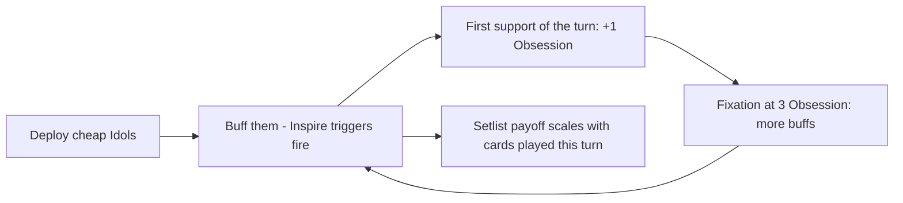

# Faction 01 — Neon Idols

> Part of the HYPEBOUND faction identity series (`docs/design/factions/`).
> Canon: [core rules](../00-core-rules.md) §6 (keywords), §7 (factions), §8 (Currents).
> Overview table: [faction guide](../04-faction-guide.md). Card data home: `data/cards/neon-idols.json`.
> Siblings: [Gothic Royalty](./02-gothic-royalty.md) · [Viral Influencers](./03-viral-influencers.md) · [Corporate Creators](./04-corporate-creators.md) · [Digital Demons](./05-digital-demons.md)

**Currents: Halo (primary identity) / Pulse** · **Playstyle: wide boards, buffs, performance combo chains**

---

## 1. Fantasy & Tone

The Neon Idols are a constellation of virtual idol units, holographic divas, and
chronically rehearsing trainees who treat every match like opening night of a
world tour that never ends. Their satire target is idol-fandom culture itself:
synchronized lightstick oceans, seven-member units where every member is "the
main one," comeback announcements announced by teaser announcements, and fans
who have cried at a concert performed by a projector.

The comedy is affectionate, never cruel. Idols are dramatic, sincere, and
completely unhinged about stagecraft: a trainee will apologize for only
practicing fourteen hours today. Every character is an original archetype (the
ascended hologram, the soundboard gremlin, the eternal understudy) — never a
riff on a real performer or real group.

Mechanically the fantasy is **the unit is stronger than the member**: individual
Idols are unimpressive, but a full stage of them buffing each other becomes a
choreographed avalanche.

---

## 2. Visual Identity & Color Language

The Idols own the "virtual concert stage" corner of the game's digital-nightlife
palette: glossy black stage floors, glass runways, drone spotlights, and a
lightstick ocean that doubles as a crowd-noise meter.

| Role | Color | Hex | Usage |
|---|---|---|---|
| Primary | Stagelight Pink | `#FF3DAE` | Faction emblem, card back accents, board trim |
| Secondary | Holo Cyan | `#4DE1FF` | Hologram shaders, Pulse-side VFX, UI highlights |
| Accent | Encore Gold | `#FFD86B` | Buff VFX, Inspire triggers, rarity glints |
| Base | Backstage Black | `#0B0714` | Backgrounds, stage floor, negative space |

- **Motifs:** spotlight cones, chat-confetti bursts, penlight waves, mirrored
  dance-practice floors, hovering camera drones, setlist teleprompters.
- **VFX language:** buffs land as a spotlight snap plus a rising gold shimmer;
  Overload plays blow a speaker-cone shockwave with visible voltage arcing.
- **Card frames** follow the Current, per canon §8.2: Halo cards use the
  circular radiant gold-filigree frame; Pulse cards use the circuit-notched
  angular frame. Faction identity lives in art, emblem, and board skin — never
  in frame shape, and never in color alone (the faction badge is a five-point
  stage-star glyph with a text label).
- **Audio:** synthpop faction theme with a key change when 3+ Idols are in
  play (`music.battle.neon-idols` slot in `data/audio-manifest.json`).

---

## 3. Currents: Halo / Pulse

| Current | Why it fits |
|---|---|
| **Halo** (light — hope, truth, unity) | The unit fantasy: heals, shields, and buffs that ripple through **Inspire** triggers. An idol group is a machine that converts sincerity into stat lines. |
| **Pulse** (lightning — technology, urgency, unstable energy) | The production rig: pyrotechnics, soundboards, holograms. **Overload (X)** is the encore you can't actually afford — power now, blown fuses next turn. |

**Advantage cycle notes (canon §8.4):** Pulse cards hit Tide targets for +1
(good into Cosplay Champions, Afterparty Crew, Algorithm Syndicate) but take +1
from Root (Touch-Grass Order, Corporate Creators, Gothic Royalty splash). Halo
and Veil deal +1 to each other, so games against Gothic Royalty and Digital
Demons are mutually bloody.

**Confluence note:** the canonical Confluence table (canon §8.5) defines no
Halo + Pulse pair. Dual Idol decks therefore play for raw card synergy rather
than a native Confluence; they may splash up to 3 Prism cards (canon §8.6) to
access **Refraction** on a key on-play card. Pure Halo or pure Pulse lists
instead pursue **Perfect Resonance** (bonus defined per Current in
`data/currents.json`; see [Currents & lore](../06-currents-and-lore.md)).

---

## 4. Gameplay Strategy

The Idols are a **go-wide synergy tempo** faction. Their cards are individually
under-statted and over-connected: every Idol makes the others better, and the
faction's reach damage comes from a single rehearsed combo turn rather than
steady attrition.



| Strengths | Weaknesses |
|---|---|
| Fastest stat accumulation in the game when the board sticks | Individually fragile; every Idol dies to cheap removal |
| Deep **Inspire**/**Parasocial** engine: buffs draw cards and feed Obsession | Combo pieces are visible on board and removable (canon-listed weakness) |
| Flexible reach: Pulse burn closes games buffs can't | No native Confluence for the dual build |
| Excellent Obsession economy → frequent Fixations | Board wipes and **Sandstorm** (Weakened 1) undo a turn of setup |
| Strong into Tide factions via Pulse +1 | Takes +1 from Root; **Touch Grass** deletes a buffed carry outright |

---

## 5. Obsession Profile

Idols gain Obsession faster than any other faction: they support (buff, heal,
shield, equip) a friendly character almost every turn (+1, canon §3.2), and
**Parasocial** trainees add more. Expect Fixation usage every second turn and an
Ultimate by mid-game. The cost: Idol players spend long stretches at 8+
Obsession — **Obsessed**, taking +1 damage from all enemy sources — exactly when
their leader is the only thing the enemy can attack through a **Spotlight**
wall. Riding the meter to 10 for a free **Full Fixation** ultimate is the
faction's signature all-in.

---

## 6. Signature Mechanics

**Canonical keywords used heavily:** **Inspire**, **Overload (X)**,
**Parasocial**, **Spotlight**, **Collab (X)**, **Raid** (sparingly).

### 6.1 Faction mechanic — Setlist

*Effects that scale with the number of cards you have played this turn.* The
Idols' combo payoffs read "…equal to the number of cards you've played this
turn." No new engine machinery: this composes from the canonical closed amount
expression `{perTurnCardsPlayed}` (architecture contract §4).

```jsonc
// Lightwave Finale (excerpt)
{ "trigger": "onPlay",
  "target": { "select": "leader", "side": "enemy" },
  "ops": [ { "op": "damage", "amount": { "perTurnCardsPlayed": true } },
           { "op": "lockHype", "amount": 2 } ] }
```

### 6.2 Faction mechanic — Harmony

*Effects that scale with the number of friendly Idols in play.* Composes from
the canonical `{count: <selector>}` amount expression with
`filter: { "tag": "idol" }`. Harmony is the faction's board-width reward and the
reason opponents must answer every trainee, not just the diva.

```jsonc
"amount": { "count": { "side": "friendly", "zone": "board", "filter": { "tag": "idol" } } }
```

Both mechanics are templated phrases, not new keywords — the validator treats
them as ordinary effects, and no engine change is needed to print more of them.

---

## 7. Leaders

### 7.1 Astra Vox, the Ascendant Hologram

| Field | Value |
|---|---|
| Id | `idol-leader-astra-vox` (`data/cards/leaders.json`) |
| Currents | **Primary: Halo · Secondary: Pulse** (leader card is Halo) |
| Health | 30 (canon default) |
| Passive — *Center of Attention* | The first time you buff a friendly character each turn, it gains an additional +0/+1. |
| Fixation (3 Obsession, once per turn) — *Encore!* | Give a friendly character +1/+1. |
| Ultimate Fixation (7 Obsession, once per match) — *Grand Finale Live* | Give all friendly characters +2/+2 and **Shielded**. |

**Personality:** a synthetic idol who achieved sentience mid-concert and has
simply refused to acknowledge that the show ended. Relentlessly gracious,
passive-aggressively perfect, addresses the opposing leader as "tonight's
special guest." Her Fixation counts as support, so it feeds her own Obsession
engine and triggers **Parasocial** on trainees — the intended loop.

### 7.2 Kira Overdrive, Stagewire Prodigy

| Field | Value |
|---|---|
| Id | `idol-leader-kira-overdrive` |
| Currents | **Primary: Pulse · no Secondary** (enables pure-Pulse Perfect Resonance decks) |
| Health | 30 |
| Passive — *Hot Signal* | The first **Overload** card you play each turn costs (1) less. |
| Fixation (3 Obsession, once per turn) — *Feedback Loop* | Deal 2 damage to a character. **Overload (1)**. |
| Ultimate Fixation (7 Obsession, once per match) — *Drop the Amp* | Deal 3 damage to all enemy characters. **Overload (2)**. |

**Personality:** the unit's pyrotechnic sound engineer who got promoted to
member after a fuse-box incident the label legally cannot discuss. Mixes tracks
live on a soundboard held together by tape and hubris; communicates primarily in
decibels. Her kit is the faction's aggressive face: damage now, Hype debt later.

---

## 8. Deck Archetypes

### 8.1 Full House Chorus (pure Halo · Astra Vox)

- **Game plan:** flood the board with cheap Idols by turn 3, then stack
  team-wide buffs so every trade is unfavorable for the opponent. Pure-Halo
  construction unlocks **Perfect Resonance (Halo)** after 7 Halo cards played.
  Close with *Grand Finale Live* or the Finale card *Eternelle* (below).
- **Key cards:** Debut Trainee, Signature Mic, Glowstick Ocean, Center Stage
  Ace, Encore Diva, Eternelle the Endless Encore.
- **Matchups:** favored against slow value decks with little AoE (Corporate
  Creators pre-turn-6, Algorithm Syndicate). Struggles against Touch-Grass
  Order (**Touch Grass** and buff-stripping undo the whole plan, and Root hits
  nothing of ours but their Gale side outpaces us) and any Meltdown-style board
  clear from Digital Demons.

### 8.2 Overdrive Tempo (pure Pulse · Kira Overdrive)

- **Game plan:** aggressive curve of **Raid** performers and **Overload** burn.
  Spend next turn's Hype today, every day, and win before the debt is called
  in. Resonance (Pulse) is the mid-game spike.
- **Key cards:** Feedback Spike, Hologram Understudy, Lightwave Finale, plus
  neutral Pulse burn.
- **Matchups:** preys on Tide decks (+1 elemental on everything) and greedy
  ramp (Corporate Creators). Weak to Root decks (+1 taken, high-health walls)
  and to Armor stacking — Corporate's *Positive Press* shell specifically
  blanks the burn plan.

### 8.3 Setlist Encore (dual Halo/Pulse · Astra Vox)

- **Game plan:** a combo-tempo hybrid that banks cheap cards and cost
  reductions, then detonates one rehearsed turn: 4–6 cards, Harmony buffs, and
  a `{perTurnCardsPlayed}` Lightwave Finale for 5+ to the face. Optionally
  splashes up to 3 Prism cards to enable **Refraction** on the combo turn.
- **Key cards:** Encore Diva, Lightwave Finale, Glowstick Ocean, Feedback
  Spike, 1–3 Prism enablers.
- **Matchups:** beats midrange decks that can't interact on the combo turn.
  Loses to **Cancelled** effects on key pieces and to Afterparty Crew, whose
  end-of-turn disruption lands after our buffs but before our attack.

---

## 9. Example Cards

Tags in play: `idol`, `performer`, `crew`. Reminder text appears on Common/Rare
only, per canon §6 templating. Encore Diva is the canonical sample card from the
[architecture contract](../../tech/00-architecture-contract.md) §4, reproduced
unchanged.

| Name | Cost | Type | Current | Rarity | Stats | Rules text |
|---|---|---|---|---|---|---|
| Debut Trainee | 1 | Character | Halo | Common | 1/2 | **Parasocial** *(When you target this friendly character with a card or ability, it gains +1/+1 and you gain 1 Obsession.)* |
| Signature Mic | 2 | Equipment | Halo | Common | +1/+1 | The equipped character gains **Parasocial**. *(When you target it with a card or ability, it gains +1/+1 and you gain 1 Obsession.)* |
| Glowstick Ocean | 2 | Action | Halo | Common | — | Give all friendly Idols +1/+1. |
| Feedback Spike | 1 | Action | Pulse | Common | — | Deal 2 damage to a character. **Overload (1)** *(You have (1) less Hype next turn.)* |
| Hologram Understudy | 3 | Character | Pulse | Rare | 3/3 | **Raid** *(Can attack the turn it is played.)* **Overload (1)** *(You have (1) less Hype next turn.)* |
| Encore Diva | 4 | Character | Halo | Rare | 3/4 | **Spotlight** *(Enemies must attack characters with Spotlight before other targets.)* When you play this, give a friendly Idol +1/+1 and **Shielded**. **Inspire:** Draw 1 card. |
| Center Stage Ace | 4 | Character | Halo | Rare | 3/3 | **Spotlight** *(Enemies must attack characters with Spotlight before other targets.)* **Inspire:** Give a random other friendly Idol +1/+1. |
| Lightwave Finale | 6 | Action | Pulse | Epic | — | Deal damage to the enemy leader equal to the number of cards you've played this turn. **Overload (2)** |

---

## 10. Finale Legendary — Eternelle, the Endless Encore

The Idols' alternate win condition: a concert that literally never ends.

| Field | Value |
|---|---|
| Name / Id | Eternelle, the Endless Encore · `idol-eternelle-endless-encore` |
| Cost / Type / Current / Rarity | 6 · Character · Halo · Legendary (max 1 copy) |
| Stats | 0/8 |
| Rules text | **Finale:** At the end of your turn, if you played 3 or more cards this turn, this gains a Chorus counter. At 4 Chorus counters, you win the match. |
| Flavor | *"One more song" is not a request. It is the terms of surrender.* |

**Canon compliance (core rules §2, victory):**

- **(a) Visible progression:** Chorus counters render on the card with a
  numbered badge; the opponent's HUD shows "Finale: 2/4" whenever it gains one.
- **(b) At least 2 turns from reveal to trigger:** counters are gained only at
  end of turn, 1 per turn maximum — the fastest possible win is 4 turns after
  the reveal.
- **(c) Interactable:** Eternelle is an attackable 0/8 character. **Cancelled**
  blanks her text and stops counter gain; **Touch Grass**/**Banished** removes
  her and (design ruling, consistent across all Finale cards) clears her
  counters, since Banished characters return with base stats and no
  buffs/statuses; killing her ends the concert permanently.

She deliberately competes with the buff plan — every card spent protecting her
is a card not spent going wide — which keeps the archetype a real choice rather
than a free inevitability rider.
