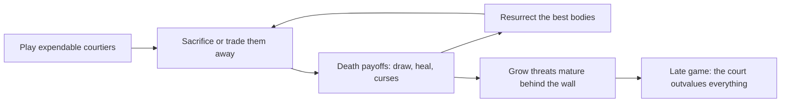

# Faction 02 — Gothic Royalty

> Part of the HYPEBOUND faction identity series (`docs/design/factions/`).
> Canon: [core rules](../00-core-rules.md) §6 (keywords), §7 (factions), §8 (Currents).
> Overview table: [faction guide](../04-faction-guide.md). Card data home: `data/cards/gothic-royalty.json`.
> Siblings: [Neon Idols](./01-neon-idols.md) · [Viral Influencers](./03-viral-influencers.md) · [Corporate Creators](./04-corporate-creators.md) · [Digital Demons](./05-digital-demons.md)

**Currents: Veil (primary identity) / Root** · **Playstyle: curses, sacrifice, healing, resurrection — inevitability over time**

---

## 1. Fantasy & Tone

Gothic Royalty are the vampire courts of **dead fandoms**: aristocrats of
franchises that ended, forums that 404'd, and ships that never sailed. They
hold candlelit season finales for shows cancelled twenty years ago, maintain
immaculate wikis for canons no one else remembers, and consider "the author has
moved on" a temporary inconvenience. Their satire target is fandom necromancy —
the communities that keep something alive long past its funeral, beautifully
and slightly menacingly.

The tone is elegant doom with impeccable manners. A countess will thank you for
attending before she drains your Hype. Grief is a renewable resource here;
every loss is a ceremony, and every ceremony pays out. All characters are
original archetypes: the regent of a silent fandom, the heir who never finishes
his memoirs, choirboys made of ossuary dust. No real people, ever.

Mechanically the fantasy is **death is a phase**: your characters are worth
more defeated than alive, and the court always reconvenes.

---

## 2. Visual Identity & Color Language

Gothic Royalty own the "neon cathedral" corner of the digital-nightlife
palette: stained glass rendered in LED, candelabras with dead-channel static
for flames, rose hedges grown through server racks.

| Role | Color | Hex | Usage |
|---|---|---|---|
| Primary | Requiem Violet | `#6B2FA0` | Faction emblem, frames' inner glow, board trim |
| Secondary | Oxblood | `#7A1024` | Curse VFX, sacrifice ceremonies, health motifs |
| Accent | Candle Gold | `#D9A441` | Resurrection light, reliquary details |
| Support | Tarnished Silver | `#B8B4C4` | Filigree, text plates, ghost shaders |
| Base | Crypt Plum | `#120814` | Backgrounds, shadow mass |

- **Motifs:** neon stained glass, wilting-then-reblooming roses, coffin-shaped
  chat windows, black-lace loading spinners, portrait galleries whose eyes
  follow the cursor, candle smoke that forms follower counts.
- **VFX language:** deaths on this side of the board resolve as a slow candle
  snuff with rising violet motes; resurrections replay the snuff in reverse
  with gold light. **Cursed** applies a visible silver sigil ring (shape-coded,
  never color-only).
- **Card frames** follow the Current (canon §8.2): Veil cards use the fractured
  mirror-shard frame, Root cards the heavy hexagonal stone frame. The faction
  badge is a thorned-crown glyph with text label.
- **Audio:** pipe-organ synthwave; a choir swell on each resurrection
  (`music.battle.gothic-royalty`).

---

## 3. Currents: Veil / Root

| Current | Why it fits |
|---|---|
| **Veil** (darkness — secrets, fear, forbidden ambition) | Curses, **Corrupt**, and bargains with the dead. The court's power is contractual and always costs someone something. |
| **Root** (earth — stability, patience, legacy) | The estate itself: hedges, crypts, centuries. **Grow X** is inheritance as a mechanic — things left undisturbed become monstrous. |

**Advantage cycle notes (canon §8.4):** Veil and Halo deal +1 to each other, so
Neon Idols and Corporate Creators' Halo halves are mutual bloodbaths. Root
cards hit Pulse targets for +1 (Algorithm Syndicate, Neon Idols' Pulse side)
but take +1 from Gale (Viral Influencers, Touch-Grass Order, Meme Collective).

**Confluence note:** the canonical Confluence table (canon §8.5) defines no
Veil + Root pair, so dual Gothic decks have no native Confluence. They
compensate with the game's best long-game engines, and may splash up to 3 Prism
cards (canon §8.6) for situational **Refraction**. Pure Veil or pure Root
lists pursue **Perfect Resonance** instead (per-Current bonus in
`data/currents.json`; see [Currents & lore](../06-currents-and-lore.md)).

---

## 4. Gameplay Strategy

Gothic Royalty is the **attrition-inevitability** faction. It converts its own
characters' deaths into cards, healing, and recursion, and its survivors into
compounding **Grow** threats. It is happy to lose the first six turns of every
game, provided it wins all the rest.



| Strengths | Weaknesses |
|---|---|
| Best sustained healing and leader-health recovery in the game | Slow starts; can be dead before the engine turns on (canon-listed weakness) |
| Death-trigger economy makes removal feel bad for the opponent | Graveyard hate and **Banished** effects bypass death triggers entirely (canon-listed weakness) |
| **Grow** threats demand answers on a timer | Low burst; almost no reach to the enemy leader from hand |
| Resurrection rebuys the opponent's removal spent earlier | **Blackflame** and other anti-heal effects turn off the sustain plan |
| Mutual Halo/Veil +1 makes their removal efficient vs light decks | Wide, fast boards (Viral Influencers) race the setup |

---

## 5. Obsession Profile

The court gains Obsession steadily: healing a friendly character is support
(+1 first time each turn, canon §3.2), and several courtiers carry
**Parasocial**. Gothic decks bank Obsession rather than spending it — *Midnight
Court* at 7 is the single biggest swing in their arsenal, and reaching 10 for a
free **Full Fixation** cast is a legitimate line in long games. The danger
zone matters less here than for other factions: an Obsessed (8+) Gothic player
takes +1 damage from all sources, but this faction out-heals chip damage —
though it makes them notably softer to Digital Demons burst turns.

---

## 6. Signature Mechanics

**Canonical keywords used heavily:** **Corrupt**, **Grow X**, **Comeback**,
plus the **Cursed** status (canon §5.4) as the house specialty.

### 6.1 Faction mechanic — Last Rites (sacrifice)

*"Defeat a friendly character:" as a cost line.* Composes from the canonical
`damage` op with a lethal literal aimed at a chosen friendly character — this
is deliberate, because a sacrifice **must** count as a defeat and fire
`onDefeat` triggers (**Comeback**, the Countess's passive, death payoffs).

```jsonc
// Widow's Bargain (excerpt)
{ "trigger": "onPlay",
  "target": { "select": "choose", "side": "friendly", "zone": "board", "filter": { "type": "character" } },
  "ops": [ { "op": "damage", "amount": 99 },
           { "op": "draw", "count": 2 },
           { "op": "heal", "target": { "select": "leader", "side": "friendly" }, "amount": 2 } ] }
```

### 6.2 Faction mechanic — Mourners

*Effects that scale with friendly characters in your discard.* Composes from
the canonical `{count: <selector>}` amount expression over the discard zone.
This is the court's long-game payoff dial: the longer the match, the larger the
funeral.

```jsonc
"amount": { "count": { "side": "friendly", "zone": "discard", "filter": { "type": "character" } } }
```

Curses themselves need no new machinery: each curse card applies the canonical
**Cursed** status with an explicit trigger and effect stated on the card
(canon §5.4: "takes stated effect when the stated trigger occurs").

---

## 7. Leaders

### 7.1 Countess Morvina Vane, Regent of the Silent Fandom

| Field | Value |
|---|---|
| Id | `goth-leader-morvina-vane` (`data/cards/leaders.json`) |
| Currents | **Primary: Veil · Secondary: Root** (leader card is Veil) |
| Health | 30 (canon default) |
| Passive — *Court in Mourning* | Whenever a friendly character is defeated, restore 1 Health to your leader. |
| Fixation (3 Obsession, once per turn) — *A Sip of Devotion* | Deal 1 damage to a character and restore 2 Health to your leader. |
| Ultimate Fixation (7 Obsession, once per match) — *Midnight Court* | Resurrect up to 2 friendly characters that were defeated this match. They return with base stats. |

**Personality:** presides over a fandom whose canon concluded before most of
her opponents were born, and considers this a scheduling problem. Devastatingly
polite; treats every visitor as both guest and entrée; refers to the opposing
deck as "the new material" with visible disappointment.

### 7.2 Alaric Thornheart, the Heir Interminable

| Field | Value |
|---|---|
| Id | `goth-leader-alaric-thornheart` |
| Currents | **Primary: Root · no Secondary** (enables pure-Root Perfect Resonance decks) |
| Health | 30 |
| Passive — *Old Growth* | At the end of your turn, give a random friendly character with **Grow** +0/+1. |
| Fixation (3 Obsession, once per turn) — *Patience of Stone* | Restore 3 Health to a character or your leader. |
| Ultimate Fixation (7 Obsession, once per match) — *Century Bloom* | Complete all friendly **Grow** counters immediately, then give those characters +1/+1. |

**Personality:** an immortal prince perpetually "about to" finish his memoirs
(current draft: 400 years, chapter one). Grows rose hedges through abandoned
server racks and speaks of uptime the way others speak of bloodlines. Sighs in
what court stenographers insist is iambic pentameter.

---

## 8. Deck Archetypes

### 8.1 The Grave Court (dual Veil/Root · Morvina Vane)

- **Game plan:** the classic sacrifice engine. Deploy expendable courtiers with
  death payoffs, cash them in with Last Rites effects, out-heal the damage, and
  rebuy the best bodies with *Vigil Everlasting* and *Midnight Court*. Wins on
  card advantage around turn 8+.
- **Key cards:** Candlewake Mourner, Widow's Bargain, Vigil Everlasting, Court
  of Second Funerals, Vespertine the Final Requiem.
- **Matchups:** favored against midrange and removal-heavy control (their
  removal is our ritual dagger). Struggles against Touch-Grass Order
  (**Banished** characters are not defeated — no triggers, no graveyard) and
  against Viral Influencers' racing starts.

### 8.2 Curse Attrition (pure Veil · Morvina Vane)

- **Game plan:** a control list that never wins a fair trade because it never
  offers one. Stack **Cursed** marks and **Corrupt** replacements until the
  opponent's cards do the wrong thing, drain with *A Sip of Devotion*, and
  grind to fatigue ("Burnout") with a taller life total. Pure-Veil construction
  unlocks **Perfect Resonance (Veil)**.
- **Key cards:** Duchess of Dead Threads, Heirloom Fang, Widow's Bargain,
  neutral Veil removal.
- **Matchups:** excellent into slow value decks and Corporate Creators (their
  contracts are already half-cursed). Weak to wide token boards that curse
  math can't keep up with, and mutual Halo +1 makes Neon Idols games violent
  in both directions.

### 8.3 Evergrown Regency (pure Root · Alaric Thornheart)

- **Game plan:** a midrange wall that gets physically larger every turn.
  **Grow** bodies mature behind heals; *Century Bloom* is the alpha-strike
  button that turns three saplings into a forest at once. Resonance (Root)
  supplements the late game.
- **Key cards:** Ossuary Choirboy, Sepulchre Rose Garden, Vigil Everlasting,
  large neutral Root finishers.
- **Matchups:** grinds down aggro that can't break through 3-health walls.
  Loses hard to **Touch Grass** (a Banished Grow threat returns at base
  stats with its investment erased) and takes +1 across the board from Gale
  decks (Viral Influencers, Meme Collective).

---

## 9. Example Cards

Tags in play: `royal`, `courtier`, `ghost`. Reminder text on Common/Rare only,
per canon §6 templating.

| Name | Cost | Type | Current | Rarity | Stats | Rules text |
|---|---|---|---|---|---|---|
| Candlewake Mourner | 1 | Character | Veil | Common | 1/2 | When this is defeated, restore 2 Health to your leader. |
| Ossuary Choirboy | 2 | Character | Root | Common | 1/3 | **Grow 2:** +2/+2. *(After surviving 2 of your turn-ends in play, gains the upgrade permanently.)* |
| Widow's Bargain | 2 | Action | Veil | Rare | — | Defeat a friendly character. Draw 2 cards and restore 2 Health to your leader. |
| Sepulchre Rose Garden | 3 | Location | Root | Rare | Dur. 3 | Activate (once per turn): Restore 2 Health to a character. If it's a Royal, it also gains +0/+1 permanently. |
| Heirloom Fang | 3 | Equipment | Veil | Rare | +2/+0 | When the equipped character deals combat damage, restore that much Health to your leader. |
| Duchess of Dead Threads | 4 | Character | Veil | Epic | 3/4 | When you play this, apply **Cursed** to an enemy character: when it attacks, it takes 2 damage first. |
| Vigil Everlasting | 5 | Action | Root | Rare | — | Resurrect a friendly character defeated this match. It returns with base stats and **Grow 1:** +1/+1. *(After surviving 1 of your turn-ends in play, gains the upgrade permanently.)* |
| Court of Second Funerals | 6 | Event | Veil | Epic | 3 turns | For the next 3 turns, your characters have **Comeback**. |

---

## 10. Finale Legendary — Vespertine, the Final Requiem

The court's alternate win: a funeral so complete the world attends.

| Field | Value |
|---|---|
| Name / Id | Vespertine, the Final Requiem · `goth-vespertine-final-requiem` |
| Cost / Type / Current / Rarity | 6 · Character · Veil · Legendary (max 1 copy) |
| Stats | 0/8 |
| Rules text | **Finale:** At the end of your turn, if a friendly character was defeated this turn, this gains a Requiem counter. At 4 Requiem counters, you win the match. |
| Flavor | *Everyone she has ever mourned will be in attendance. So will you.* |

**Canon compliance (core rules §2, victory):**

- **(a) Visible progression:** Requiem counters render as candle pips on the
  card; the opponent's HUD announces "Finale: 3/4" on each gain.
- **(b) At least 2 turns from reveal to trigger:** at most 1 counter per turn,
  earned only at end of turn — minimum 4 turns from reveal to victory.
- **(c) Interactable:** an attackable 0/8 body. **Cancelled** blanks the text
  and freezes progression; **Touch Grass**/**Banished** removes her and clears
  her counters (shared Finale ruling: Banished characters return with base
  stats and no statuses); the opponent can also simply decline to kill our
  characters, forcing us to pay sacrifice costs ourselves — every Requiem then
  costs us a card.

Vespertine rewards exactly what the faction already does (things dying on
schedule) while giving the opponent two distinct counterplay axes: kill the
requiem, or starve it.
