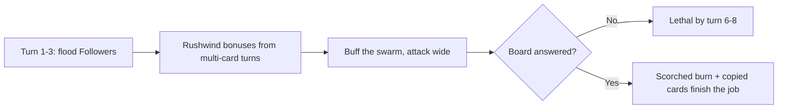

# Faction 03 — Viral Influencers

> Part of the HYPEBOUND faction identity series (`docs/design/factions/`).
> Canon: [core rules](../00-core-rules.md) §6 (keywords), §7 (factions), §8 (Currents).
> Overview table: [faction guide](../04-faction-guide.md). Card data home: `data/cards/viral-influencers.json`; Follower token in `data/cards/tokens.json`.
> Siblings: [Neon Idols](./01-neon-idols.md) · [Gothic Royalty](./02-gothic-royalty.md) · [Corporate Creators](./04-corporate-creators.md) · [Digital Demons](./05-digital-demons.md)

**Currents: Gale (primary identity) / Cinder** · **Playstyle: follower tokens, copied effects, going wide fast**

---

## 1. Fantasy & Tone

The Viral Influencers are clout chasers, trend hijackers, and full-time
main characters. They have never had an original thought and have never needed
one: virality is a renewable resource if you're shameless enough to harvest it.
Their satire targets engagement culture — the apology-video industrial complex,
"controversy" as a content category, follower counts treated as vital signs,
and creators who would livestream their own house fire if the lighting was
good.

The tone is fast, loud, and gloriously shameless. Every character is winning,
according to themselves, at all times. All archetypes are original inventions —
the arsonist of the algorithm, the trend-surfer who has never finished a
thought — never parodies of real creators.

Mechanically the fantasy is **the swarm and the spark**: a flood of identical
1/1 Followers, effects that copy whatever worked for someone else, and fires
(literal, **Scorched**) started purely for the engagement.

---

## 2. Visual Identity & Color Language

The Influencers own the "trending panel" corner of the digital-nightlife
palette: everything urgent, everything climbing, everything slightly on fire.

| Role | Color | Hex | Usage |
|---|---|---|---|
| Primary | Ember Orange | `#FF6A2B` | Faction emblem, Cinder VFX, board trim |
| Secondary | Alert Red | `#FF2E4D` | Notification badges, damage motifs |
| Accent | Streak Yellow | `#FFC93D` | Follower tokens, trend arrows, speed lines |
| Support | Flash White | `#FFF3E9` | Camera flashes, ring lights, text plates |
| Base | Scorch Brown-Black | `#160B08` | Backgrounds, burnt-edge vignette |

- **Motifs:** up-and-to-the-right graphs, notification badge swarms, ring
  lights, follower-counter odometers spinning, ticker tape that is actively
  burning, speedrun-timer overlays.
- **VFX language:** Followers pop in with a camera-flash and a "+1" counter
  tick; **Scorched** applications leave a smolder ring with an ember-glyph
  icon (shape-coded, never color-only); copy effects show a screenshot-shutter
  frame grab.
- **Card frames** follow the Current (canon §8.2): Gale cards use the swept
  ribbon-cut asymmetric frame, Cinder the sharp flame-notched frame. Faction
  badge: an upward-arrow-with-flame glyph plus text label.
- **Audio:** breakbeat with notification-chime percussion that accelerates as
  your board widens (`music.battle.viral-influencers`).

---

## 3. Currents: Gale / Cinder

| Current | Why it fits |
|---|---|
| **Gale** (wind — freedom, speed, rumor) | Trends move like weather. **Rushwind** rewards playing many cards fast; tokens spread like rumor because they *are* rumor. |
| **Cinder** (fire — ambition, performance, destructive creativity) | Engagement farming as arson. **Scorched** is the drama that keeps burning after the stream ends. |

**Advantage cycle notes (canon §8.4):** Gale hits Root for +1 (Touch-Grass
Order, Corporate Creators, Gothic Royalty's Root side) and takes +1 from
Cinder; Cinder hits Gale for +1 (mirror matches are fireworks) and takes +1
from Tide (Cosplay Champions, Afterparty Crew, Algorithm Syndicate).

**Confluence note:** the canonical Confluence table (canon §8.5) defines no
Gale + Cinder pair, so dual Influencer decks have no native Confluence. The
faction's compensation is raw speed; dual lists may also splash up to 3 Prism
cards (canon §8.6) for **Refraction** on a token generator. Pure Gale or pure
Cinder lists pursue **Perfect Resonance** (per-Current bonus in
`data/currents.json`; see [Currents & lore](../06-currents-and-lore.md)).

---

## 4. Gameplay Strategy

The Influencers are the **fastest board-flood faction** in the game. They win
turns 5–8 by presenting more bodies than the opponent has answers, then
converting leftover swarm into burn. They are also the premier *copy* faction:
if the opponent's card was good, it's ours now.



| Strengths | Weaknesses |
|---|---|
| Fastest clock in the game; punishes any slow start | Board wipes are catastrophic (canon-listed weakness) |
| Follower scaling: every payoff counts the swarm | Runs out of steam — little native card draw (canon-listed weakness) |
| Copy effects steal answers the deck doesn't run | Individual cards are weak; topdecks late are poor |
| **Rushwind** makes every card cheap-feel and flexible | Tide decks get +1 vs our Cinder half; **Sandstorm** blanks a token turn |
| Gale +1 vs Root makes walls less safe than they look | Healing-stacked decks (Gothic, Corporate) can out-sustain the burn plan |

---

## 5. Obsession Profile

The Influencers gain Obsession opportunistically — swarm buffs count as support
(+1 first time each turn, canon §3.2) — but they *spend* it faster than anyone:
both leaders' Fixations are cheap tempo (a Follower, a ping) that converts
Obsession straight into board pressure. Influencer players rarely sit at 8+;
if you see one deliberately climbing toward **Full Fixation**, the free
Ultimate is the planned kill turn.

---

## 6. Signature Mechanics

**Canonical keywords used heavily:** **Rushwind**, **Viral**, **Trending**,
**Raid**, plus the **Scorched** status as the burn engine.

### 6.1 Faction mechanic — Followers

*The faction's token tribe.* **Follower** is a 1/1 Gale character token
(`token-follower` in `data/cards/tokens.json`, `token: true`, tag
`follower`). Every summon composes from the canonical `summon` op; every
payoff composes from `{count: <selector>}` over friendly Followers.

```jsonc
// Follower Frenzy (excerpt)
{ "trigger": "onPlay",
  "ops": [ { "op": "summon", "card": "token-follower", "count": 3 } ] }

// payoff amount, anywhere it is needed
"amount": { "count": { "side": "friendly", "zone": "board", "filter": { "tag": "follower" } } }
```

### 6.2 Faction mechanic — Hijack

*Stealing copies of the opponent's content.* Composes from the canonical
`stealCopy` / `copyCardToHand` ops with a "last card played" filter. Hijacked
copies cost (1) more — you're always slightly late to the trend — enforced with
`modifyCost` on the created copy.

```jsonc
// Trend Hijacker (excerpt)
{ "trigger": "onPlay",
  "ops": [ { "op": "stealCopy", "source": "lastCardPlayed", "side": "enemy" },
           { "op": "modifyCost", "delta": 1, "target": "createdCard" } ] }
```

Both mechanics are compositions over existing opcodes; printing new Follower
payoffs or Hijack variants requires zero engine changes.

---

## 7. Leaders

### 7.1 Blayze Trendall, Arsonist of the Algorithm

| Field | Value |
|---|---|
| Id | `viral-leader-blayze-trendall` (`data/cards/leaders.json`) |
| Currents | **Primary: Cinder · Secondary: Gale** (leader card is Cinder) |
| Health | 30 (canon default) |
| Passive — *Stir the Pot* | After you play your second card each turn, deal 1 damage to the enemy leader. |
| Fixation (3 Obsession, once per turn) — *Spicy Take* | Deal 1 damage to a character and apply **Scorched** to it. |
| Ultimate Fixation (7 Obsession, once per match) — *Career-Ending Livestream* | Deal 2 damage to all enemy characters, then apply **Scorched** to each surviving enemy character. |

**Personality:** a streamer who discovered that controversy burns brighter than
content and has been legally on fire ever since. Every apology video is a
season premiere; every ban is a franchise reboot. Genuinely cannot tell the
difference between infamy and love, and genuinely does not care.

### 7.2 Cyra Swipe, First to Every Trend

| Field | Value |
|---|---|
| Id | `viral-leader-cyra-swipe` |
| Currents | **Primary: Gale · no Secondary** (enables pure-Gale Perfect Resonance decks) |
| Health | 30 |
| Passive — *Early Adopter* | The first Follower you summon each turn gains **Raid**. |
| Fixation (3 Obsession, once per turn) — *Go Live* | Summon a 1/1 Follower. |
| Ultimate Fixation (7 Obsession, once per match) — *The Feed Awakens* | Summon 3 1/1 Followers with **Raid**, and your Followers get +1/+0 this turn. |

**Personality:** has never finished a video, a sentence, or a meal — the next
trend arrived first. Her follower count updates faster than her heartbeat and
she considers this an upgrade. Speed-runs sincerity in under nine seconds.

---

## 8. Deck Archetypes

### 8.1 Follower Flood (pure Gale · Cyra Swipe)

- **Game plan:** maximum bodies by turn 4, Follower payoffs turn width into
  stats, *The Feed Awakens* (or **Full Fixation** for a free cast) is the
  crescendo. Pure-Gale construction unlocks **Perfect Resonance (Gale)**.
  Runs *Verity Viralstar* as an inevitability backup when the swarm gets
  walled.
- **Key cards:** First Follower, Follower Frenzy, Echo Chamber, Verity
  Viralstar Face of the Feed.
- **Matchups:** overruns slow control and ramp before they stabilize; Gale +1
  chews through Root walls. Folds to dedicated AoE — Digital Demons'
  *Meltdown*, Blayze mirrors' *Career-Ending Livestream* — and to
  **Sandstorm** turns from Touch-Grass Order.

### 8.2 Burnfluencer (pure Cinder · Blayze Trendall)

- **Game plan:** face-first burn aggro. Cheap **Raid** attackers, **Scorched**
  stacking for delayed damage the opponent must respect, **Viral** burn spells
  that replay themselves, *Stir the Pot* ticking every multi-card turn. Aims
  to win by turn 7.
- **Key cards:** Clout Chaser, Livestream Meltdown, Sponsored Wildfire,
  Feedback-style neutral Cinder burn.
- **Matchups:** excellent versus greedy decks and versus Gale mirrors (+1
  elemental). Struggles against Gothic Royalty and Corporate Creators, whose
  healing and Armor outlast a finite burn total, and takes +1 from Tide
  removal.

### 8.3 Hijack Tempo (dual Gale/Cinder · Blayze Trendall)

- **Game plan:** a midrange tempo list that plays the opponent's best cards
  back at them. **Trending** discounts and **Rushwind** bonuses make 3-card
  turns routine; Hijack effects patch the deck's answer gaps with whatever the
  matchup demands. Optional 3-card Prism splash for **Refraction** on a token
  generator.
- **Key cards:** Trend Hijacker, Ratio Bomb, Follower Frenzy, Echo Chamber.
- **Matchups:** strong into decks with powerful proactive cards worth
  stealing (Corporate finishers, Demon transformations). Weakest into token
  mirrors where stolen copies are low-impact, and into Touch-Grass Order,
  which strips the buffs that make tempo swings stick.

---

## 9. Example Cards

Tags in play: `influencer`, `follower`, `trend`. Reminder text on Common/Rare
only, per canon §6 templating.

| Name | Cost | Type | Current | Rarity | Stats | Rules text |
|---|---|---|---|---|---|---|
| First Follower | 1 | Character | Gale | Common | 1/1 | When you play this, summon a 1/1 Follower. |
| Clout Chaser | 2 | Character | Cinder | Common | 2/1 | **Raid** *(Can attack the turn it is played.)* When this attacks, apply **Scorched** to the defender. *(Scorched: takes 1 damage at end of its controller's turn.)* |
| Ratio Bomb | 2 | Action | Gale | Common | — | Deal 2 damage to a character. **Rushwind:** Deal 3 instead. *(Rushwind: bonus if this is not the first card you played this turn.)* |
| Trend Hijacker | 3 | Character | Gale | Rare | 2/3 | When you play this, add a copy of the last card your opponent played to your hand. It costs (1) more. |
| Livestream Meltdown | 3 | Action | Cinder | Rare | — | Deal 1 damage to all enemy characters and apply **Scorched** to each character damaged this way. *(Scorched: takes 1 damage at end of its controller's turn.)* |
| Echo Chamber | 3 | Location | Gale | Epic | Dur. 3 | Activate (once per turn): Choose a friendly Follower; summon a copy of it. |
| Sponsored Wildfire | 4 | Action | Cinder | Epic | — | Deal 2 damage to a character. **Viral** |
| Follower Frenzy | 5 | Action | Gale | Rare | — | **Trending** *(While in your hand, this costs (1) less for each other card you've played this turn, minimum 1. Resets each turn.)* Summon 3 1/1 Followers. **Rushwind:** They gain **Raid**. |

---

## 10. Finale Legendary — Verity Viralstar, Face of the Feed

The Influencers' alternate win: the follower milestone to end all milestones.

| Field | Value |
|---|---|
| Name / Id | Verity Viralstar, Face of the Feed · `viral-verity-viralstar` |
| Cost / Type / Current / Rarity | 5 · Character · Gale · Legendary (max 1 copy) |
| Stats | 2/6 |
| Rules text | **Finale:** At the end of your turn, this gains a Subscriber counter for each friendly Follower, up to 3 per turn. At 9 Subscriber counters, you win the match. |
| Flavor | *She hit every milestone. Then she hit yours.* |

**Canon compliance (core rules §2, victory):**

- **(a) Visible progression:** Subscriber counters display as an odometer on
  the card; the opponent's HUD shows "Finale: 6/9" on every gain.
- **(b) At least 2 turns from reveal to trigger:** maximum 3 counters per
  turn, gained only at end of turn — minimum 3 turns from reveal to victory.
- **(c) Interactable:** Verity is an attackable 2/6; killing her Followers
  slows the count even if she survives; **Cancelled** blanks her text and
  stops accumulation; **Touch Grass**/**Banished** removes her and clears her
  counters (shared Finale ruling — Banished characters return with base stats
  and no statuses). AoE, the faction's canonical weakness, counters her and
  the swarm feeding her simultaneously.

Verity converts the faction's existing output (Followers) into a second win
axis, but she demands the player keep bodies back instead of attacking with
them — a real cost for a swarm deck.
