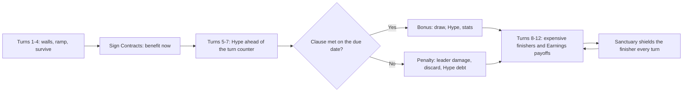

# Faction 04 — Corporate Creators

> Part of the HYPEBOUND faction identity series (`docs/design/factions/`).
> Canon: [core rules](../00-core-rules.md) §6 (keywords), §7 (factions), §8 (Currents).
> Overview table: [faction guide](../04-faction-guide.md). Card data home: `data/cards/corporate-creators.json`
> (per [architecture contract](../../tech/00-architecture-contract.md) §2, this file also holds the faction's
> leaders and its faction-specific token `token-intern`).
> Siblings: [Neon Idols](./01-neon-idols.md) · [Gothic Royalty](./02-gothic-royalty.md) · [Viral Influencers](./03-viral-influencers.md) · [Digital Demons](./05-digital-demons.md) · [Cosplay Champions](./06-cosplay-champions.md)

**Currents: Root (primary identity) / Halo** · **Playstyle: Hype ramp, contracts, expensive finishers**

---

## 1. Fantasy & Tone

The Corporate Creators are what happens when a media conglomerate notices that
being a person online is a market. They do not make content; they *acquire*
creators, *onboard* fandoms, and *monetize* sincerity at scale. Every character
on this side of the board is wearing a lanyard, every location has a lobby
plant, and every act of kindness is a line item with a due date.

Their satire target is the brand layer of the internet: sponsorship reads
delivered with a hostage's cadence, "we're all family here" printed on a mug in
the breakroom of a company that has restructured twice this quarter, apology
statements written in the passive voice, and the specific dead-eyed serenity of
a person who has said "circling back" out loud and meant it. The humor is dry
and procedural — the Corporate Creators are never *angry*, they are
*disappointed on brand*.

Every character is an original archetype: the unpaid intern who is somehow the
entire defensive line, the VP whose smile has been legally reviewed, the
majority shareholder who has never watched a single video he owns. No real
companies, no real executives, no real creators — ever.

Mechanically the fantasy is **spend tomorrow's budget today**: Corporate cards
hand you resources up front and bill you later, and the whole faction is a bet
that you will be too big to fail by the time the invoice clears.

---

## 2. Visual Identity & Color Language

The Corporate Creators own the "flagship studio lobby" corner of the game's
digital-nightlife palette: glass elevators, chrome reception desks, evergreen
planters lit like exhibits, and a revenue chart projected on a wall that only
ever goes up.

| Role | Color | Hex | Usage |
|---|---|---|---|
| Primary | Boardroom Green | `#1E7A5A` | Faction emblem, Root VFX, board trim, contract seals |
| Secondary | Brand-Safe White | `#F2F6F3` | Text plates, lobby light, Halo shielding, UI panels |
| Accent | Sponsor Gold | `#E8B23A` | Hype-gain VFX, seal stamps, rarity glints, sponsor banners |
| Support | Chrome Grey | `#9AA5AD` | Glass panels, badge lanyards, legal fine print |
| Base | Executive Black | `#090E0C` | Backgrounds, negative space, boardroom shadow |

- **Motifs:** unfurling sponsor banners behind characters, holographic contract
  scrolls with an infinite fine-print scrollbar, badge lanyards, stock tickers
  reading fandom names, lower-third "this segment is sponsored by" bars,
  evergreen lobby planters (the Root half's living infrastructure), quarterly
  charts drawn in laser light.
- **VFX language:** signing a Contract plays a gold wax-seal stamp with a
  paper-shuffle SFX; permanent Hype gain plays a coin-cascade and bumps the
  Hype crystal rail with a chart-tick; **Armor** gains plate the leader
  portrait with a chrome brand shield; an obligation coming due flashes its
  ledger row with a numbered countdown badge (numeral + icon — never color
  alone).
- **Card frames** follow the Current, per canon §8.2: Root cards use the heavy
  hexagonal stone frame; Halo cards use the circular radiant gold-filigree
  frame. Faction identity lives in art, emblem, and board skin — never in frame
  shape and never in color alone (the faction badge is a hexagonal corporate
  seal glyph containing an upward chart arrow, always with a text label).
- **Audio:** lobby-jazz ambience over a low server-room hum, modulating into a
  triumphant four-note brand sting whenever you gain permanent Hype; obligations
  come due on a polite notification chime with an unpleasant undertone
  (`music.battle.corporate-creators` in `data/audio-manifest.json`).

---

## 3. Currents: Root / Halo

| Current | Why it fits |
|---|---|
| **Root** (earth — stability, patience, legacy) | The infrastructure play: studios, campuses, multi-year deals. **Grow X** is capital expenditure — an asset left alone appreciates until it is unanswerable. Root is also why the faction survives its own clunky opening: high-health bodies buy quarters. |
| **Halo** (light — hope, truth, unity) | The brand voice: relentlessly positive, shielded, on-message, corporate-wellness bright. **Inspire** turns every act of "supporting our people" into an actual mechanical payoff, and Halo supplies the Armor/heal stack that lets an expensive finisher survive to resolve. |

**Advantage cycle notes (canon §8.4):** Root deals +1 to Pulse (Algorithm
Syndicate, Neon Idols' Pulse half) and takes +1 from Gale — Viral Influencers,
Meme Collective, and Touch-Grass Order all hit the faction's Root bodies for a
bonus, which is precisely the matchup the faction is designed to be bad at.
Halo and Veil deal +1 to each other, so Gothic Royalty and Digital Demons games
are mutually violent on the Halo half.

**Confluence note:** Corporate Creators are one of the factions with a **native
Confluence** — Root + Halo is **Sanctuary** (canon §8.5): *give a friendly
character **Shielded** and remove one negative status from it*, free, once per
turn. This is a defining structural advantage over the Idols, the Gothic court,
and the Influencers, none of whom have a native pair: a dual Corporate deck can
protect its single expensive finisher every single turn without spending a card.

**Ruling (design decision):** granting **Shielded** via Sanctuary *is* supporting
a friendly character, so it triggers the canonical once-per-turn Obsession gain
(canon §3.2 lists "buff, heal, shield, or equip") and fires **Inspire**. This is
the faction's free Obsession tap and is deliberate — it is also the reason
Corporate leaders reach their Ultimate on schedule despite playing very few
support spells.

Pure Root or pure Halo lists forgo Sanctuary and pursue **Perfect Resonance**
instead (per-Current bonus in `data/currents.json`; see
[Currents & lore](../06-currents-and-lore.md)). Dual lists may splash up to 3
Prism cards (canon §8.6) for situational **Refraction** on a finisher.

---

## 4. Gameplay Strategy

The Corporate Creators are the game's **ramp-control** faction. They convert
early turns into permanent Hype and contractual card advantage, then deploy
7–10 cost threats two to three turns before any other deck can answer them.
Nothing they do in the first four turns is impressive; everything they do after
turn seven is.



| Strengths | Weaknesses |
|---|---|
| Only faction with reliable **permanent** Hype ramp — finishers land 2–3 turns early | Clunky early game: turns 1–3 statlines are defensive and unimpressive (canon-listed weakness) |
| Contracts play above curve: a 3-cost that draws 2, a 2-cost that ramps | Contract downsides are public and exploitable — the enemy can flip your bonus into your penalty (canon-listed weakness) |
| Native **Sanctuary** Confluence protects the single carry for free, every turn | Obligations survive the card that signed them; there is no take-back, ever |
| Best combined defensive stack in the game: **Armor** + heals + **Shielded** | Gale decks get +1 on our Root bodies and go under the ramp entirely |
| **Earnings** payoffs scale with the Hype the deck already has more of than anyone | **Eclipse** blanks Locations, Events, and auras — one Confluence deletes a *Positive Press* turn |
| Root +1 punishes Pulse engines (Algorithm Syndicate, Idol Pulse builds) | Answer-dependent finishers: one **Cancelled**, one Hijack steal, and eight Hype evaporates |

**How the opponent attacks this faction (intended counterplay):** kill the
Sponsor before the due date so the clause fails; race the ramp so the finisher
arrives one turn too late; hold single-target removal for the payoff instead of
trading it into the walls; and use **Touch Grass**, which removes a Root
investment *and* its accumulated **Grow** progress at the worst possible moment.

---

## 5. Obsession Profile

Corporate decks gain Obsession at a moderate, extremely reliable rate: shielding
or healing a friendly character is support (+1 the first time each turn, canon
§3.2), and dual lists get that gain for free from **Sanctuary** most turns.
Almost no Corporate card carries **Parasocial** — the faction does not do
personal attachment, it does headcount — so the meter climbs on a schedule
rather than in spikes. Expect the first Fixation around turn 4 and the Ultimate
Fixation around turns 7–9, which is exactly when the ramp plan wants a second
finisher.

Corporate players spend rather than bank: sitting at 8+ (**Obsessed**, +1 damage
taken from all enemy sources) is genuinely dangerous for a deck whose plan is to
still be alive on turn 11, and Touch-Grass Order's anti-Obsessed cards punish it
hard. Riding to 10 for a free **Full Fixation** is reserved for the
*Company-Wide Rebrand* stabilization turn, where the Armor gained usually
outpaces the Obsessed penalty.

---

## 6. Signature Mechanics

**Canonical keywords used heavily:** **Grow X**, **Inspire**, **Collab (X)**,
**Spotlight**, plus the **Armor X** and **Shielded** statuses (canon §5.4) as
the house defensive package and **Cancelled** as the legal department's tool.

Neither faction mechanic below is a new keyword: both are *templated phrases*
composed from ops that already exist in `src/engine/types.ts`, so the
`KeywordId` union is untouched and printing more of them requires zero engine
changes.

### 6.1 Faction mechanic — Contracts

*A benefit now, an obligation later.* Every Contract card prints two labelled
lines and nothing else:

> **Sign:** *immediate benefit.* **Due (N):** *if clause, bonus; otherwise penalty.*

Reminder text on Common/Rare: *(Due — this obligation resolves at the start of
your turn N turns from now and is visible to both players.)*

Contracts compose from the canonical `scheduleDelayed` op wrapping a single `if`
op with a `ConditionExpr` clause:

```jsonc
// Sponsored Segment (excerpt)
{ "trigger": "onPlay",
  "ops": [
    { "op": "draw", "count": 2 },
    { "op": "scheduleDelayed",
      "delayTurns": 2,
      "label": "Sponsored Segment — deliverables due",
      "ops": [
        { "op": "if",
          "condition": { "kind": "controlsAtLeast",
                         "target": { "select": "all", "side": "friendly", "zone": "board",
                                     "filter": { "tag": ["sponsor"] } },
                         "min": 1 },
          "then": [ { "op": "gainHype", "amount": 2 } ],
          "else": [ { "op": "discard",
                      "target": { "select": "random", "side": "friendly", "zone": "hand" },
                      "count": 2 } ] } ] } ] }
```

**Rulings (binding for every Contract card):**

| Question | Ruling |
|---|---|
| When does an obligation resolve? | During the start-of-turn step of the signer's turn (canon §2 step 1), after Hype refill and the draw, before the main phase. |
| Does `delayTurns` count both players' turns? | No — it counts the signer's own turns. "Due (2)" resolves at the start of the signer's second turn from now. |
| Multiple obligations on the same turn? | Resolve in signing order (the `MatchState.delayed` array order). Deterministic, replay-safe. |
| Does killing the source card cancel the obligation? | **No.** `DelayedEffect` lives on match state, not on the card. This is the faction's defining risk. |
| Can any card delete an obligation? | **No card in the set removes a scheduled obligation.** The only outs are meeting the clause or surviving the penalty. (There is no DSL op to mutate `state.delayed`, and none will be added for this.) |
| Is the obligation hidden? | No. It is public from the moment it is signed. |

**UI requirement (visibility, binding):** the `delayedScheduled` engine event
puts a row in an **Obligations ledger** rail beside the Event banner zone,
showing the label, the clause in plain text, and a turns-remaining numeral, for
**both** players. Both the signer and the opponent must be able to plan around
the due date — that public information is what makes "contract downsides are
exploitable" (canon §7) a real weakness rather than a flavor note.

**Clause catalog** (the closed set Contract cards draw from — each maps to one
canonical `ConditionExpr`):

| Printed clause wording | ConditionExpr |
|---|---|
| "If you control a Sponsor…" | `controlsAtLeast` · filter `tag: ["sponsor"]` · min 1 |
| "If you control a character that costs (5) or more…" | `controlsAtLeast` · filter `costMin: 5` · min 1 |
| "If you control 3 or more characters…" | `controlsAtLeast` · min 3 |
| "If you have 4 or more cards in hand…" | `handSizeAtLeast` · friendly · 4 |
| "If you played 3 or more cards this turn…" | `cardsPlayedThisTurnAtLeast` · 3 |
| "If your Obsession is 5 or more…" | `obsessionAtLeast` · friendly · 5 |
| "If your leader has 15 or less Health…" | `leaderHealthAtMost` · friendly · 15 |

**Penalty catalog** (ops used on the `else` branch):

| Printed penalty wording | Op |
|---|---|
| "…your leader takes N damage." | `damage` → `{ select: "leader", side: "friendly" }` |
| "…discard N random cards." | `discard` → random, zone `hand` |
| "…lose 2 Obsession." | `removeObsession` |
| "…apply **Cancelled** to a random friendly character for 1 turn." | `cancel` · `durationTurns: 1` |
| "…you have (2) less Hype next turn." | `lockHype` |

**Restraint ruling:** the `lockHype` penalty is reserved for at most two Epic+
Contracts in the set, and those cards do **not** print the **Overload (X)**
keyword or badge — Overload is Pulse's signature (canon §6) and Corporate cards
are Root/Halo. They print the plain sentence "You have (2) less Hype next turn."

### 6.2 Faction mechanic — Earnings

*Effects that scale with the Hype you have spent this turn.* Corporate payoffs
read "…equal to the Hype you've spent this turn," composing from the canonical
closed amount expression `{ kind: "hypeSpentThisTurn" }` (tracked on
`PlayerState.hypeSpentThisTurn`). It is the faction's reward for being the deck
with the most Hype: the same card is a 4 on turn 5 and a 10 on turn 10.

```jsonc
// Earnings Call (excerpt)
{ "trigger": "onPlay",
  "target": { "select": "leader", "side": "enemy" },
  "ops": [ { "op": "damage",
             "target": { "select": "triggering" },
             "amount": { "kind": "hypeSpentThisTurn" } } ] }
```

**Ramp discipline (binding):** canon §3.1 keeps permanent max-Hype gain *rare*
and capped at 10. The faction therefore prints permanent ramp on **Rare or
higher cards only**, at most 6 such cards across the set, never more than +2 max
Hype from a single card, and never below cost 2. Temporary "this turn only" Hype
(`gainHype` without `permanent`) carries the rest of the resource identity and
is where the Commons live.

**Earnings rulings:** the resolving card's own cost **is** included (Hype is paid on play,
before effects resolve — so an 8-cost Earnings card is always worth at least 8);
temporary Hype spent counts; cost reductions reduce the number, because only
Hype actually paid is counted. All of this is deterministic and readable in
`predict()` output, so the damage preview is exact before confirmation.

---

## 7. Leaders

### 7.1 Cressida Vale, Chief Executive of Engagement

| Field | Value |
|---|---|
| Id | `corp-leader-cressida-vale` (`data/cards/corporate-creators.json`) |
| Currents | **Primary: Root · Secondary: Halo** (leader card is Root) |
| Health | 30 (canon default) |
| Passive — *Quarterly Guidance* | The first card you play each turn that costs (5) or more costs (1) less. |
| Fixation (3 Obsession, once per turn) — *Budget Reallocation* | Gain 1 Hype this turn only and give a friendly character +0/+2. |
| Ultimate Fixation (7 Obsession, once per match) — *Annual Shareholder Meeting* | Gain 2 max Hype permanently, up to 10. Gain 2 Hype this turn only and draw 2 cards. |

**Personality:** built the network by acquiring the fandoms it now serves, and
refers to that as "meeting the community where they are." Speaks exclusively in
growth metrics, calls her own feelings "sentiment," and ends condolences with
"circling back." Has never been rude to anyone in her life and has ended eleven
careers. Her Fixation buffs a friendly character, which counts as support — so
her Obsession engine funds itself while her passive quietly discounts the
finisher she is ramping toward.

### 7.2 Sterling Bright, Vice President of Brand Safety

| Field | Value |
|---|---|
| Id | `corp-leader-sterling-bright` |
| Currents | **Primary: Halo · no Secondary** (enables pure-Halo Perfect Resonance decks) |
| Health | 30 |
| Passive — *Brand Safety* | At the start of your turn, give your leader **Armor 1**. |
| Fixation (3 Obsession, once per turn) — *Press Release* | Give a friendly character **Shielded** and give your leader **Armor 2**. |
| Ultimate Fixation (7 Obsession, once per match) — *Company-Wide Rebrand* | Remove all negative statuses from friendly characters, give them all **Shielded**, and give your leader **Armor 5**. |

**Personality:** smiles the way a compliance training video smiles. Apologizes
entirely in the passive voice ("mistakes were made, by no one in particular"),
has not spoken an unreviewed sentence since the incident that is legally not an
incident, and is — genuinely, disarmingly — kind, which somehow makes it worse.
His kit is the faction's defensive face: Armor accrues every turn whether or not
he does anything, which is the only reason the pure-Halo shell survives to
turn 11.

---

## 8. Deck Archetypes

Expected win turns follow the binding balance targets in
[gameplay loop §5.2](../02-gameplay-loop-and-match-flow.md): Corporate Creators
ramp is a **Control** archetype (lethal turn 10–12).

### 8.1 Sponsorship Ramp (dual Root/Halo · Cressida Vale)

- **Game plan:** the flagship list. Survive turns 1–4 behind **Spotlight** walls
  and cheap Armor, sign Contracts that convert those dead turns into permanent
  Hype and cards, then run max Hype ahead of the turn counter and deploy 7–8
  cost threats from turn 6. **Sanctuary** shields the carry every turn for free;
  *Earnings Call* or *Ambrose Kell* closes.
- **Key cards:** Brand Partnership, Title Sponsor, Sponsored Segment, Corporate
  Campus, Earnings Call, Ambrose Kell Majority Shareholder.
- **Expected win turn:** 10–12 (control band).
- **Matchups:** favored into midrange and other control — it simply has more
  resources and a bigger top end. Struggles against Gale aggro (Viral
  Influencers, Meme Collective: +1 on our Root bodies plus a turn-6 clock) and
  against Touch-Grass Order, which Banishes the ramp body, strips the buffs, and
  punishes an Obsessed leader. Digital Demons burst turns can end the game
  before the invoices even come due.

### 8.2 Positive Press (pure Halo · Sterling Bright)

- **Game plan:** the fortress. Every turn converts into **Armor**, healing, and
  **Shielded**, with *Cease and Desist* holding the door for whatever the walls
  cannot handle. This is the shell that mathematically blanks burn decks: the
  *Positive Press* Event alone is 12 points of mitigation across three turns.
  Pure-Halo construction unlocks **Perfect Resonance (Halo)**; the kill comes
  from *Network Special* bodies and *Company-Wide Rebrand*, or from simply
  having a taller life total when Burnout starts.
- **Key cards:** Positive Press, Approved Messaging, Cease and Desist,
  Compliance Officer, Network Special.
- **Expected win turn:** 11–13 — the slow edge of the control band; the deck
  knowingly accepts the 13–15 attrition-mirror tail against other control decks.
- **Matchups:** excellent against every aggro deck in the game and against
  Cinder burn in particular (Viral Burnfluencer, Demon all-in). Poor against
  Gothic Royalty (Halo↔Veil mutual +1, and their attrition out-values a deck
  with no ramp) and against **Eclipse**, which switches the Event and aura layer
  off on the exact turn it mattered.

### 8.3 Leveraged Buyout (pure Root · Cressida Vale)

- **Game plan:** contracts as pure tempo. Sign for the front half and treat the
  bills as someone else's problem: a 2-cost that ramps, a 3-cost that draws 2,
  **Grow** investments maturing behind them, and a curve that is genuinely
  aggressive from turn 5. Leader damage from failed clauses is an acceptable
  cost when you are the one on the clock. Pure-Root construction unlocks
  **Perfect Resonance (Root)**.
- **Key cards:** Brand Partnership, Regional Ad Partner, Title Sponsor,
  Corporate Campus, Earnings Call.
- **Expected win turn:** 8–10 (midrange band) — the fastest Corporate build,
  bought with the fact that every unmet clause hits our own leader.
- **Matchups:** strong into slow control that cannot punish an exposed clause,
  and into Pulse engines (Root +1 on every trade). Weak into precise removal
  decks that kill the Sponsor on the turn before the due date — Touch-Grass
  Order and Algorithm Syndicate both do this on purpose — and into Gothic
  Royalty, whose healing simply outlasts a deck that is also damaging itself.

---

## 9. Example Cards

Tags in play: `sponsor`, `exec`, `intern`, `legal`. Tags print on the card's type
line (e.g. "Character — Sponsor"), which is how Contract clauses that reference
Sponsors stay readable at board distance. Reminder text appears on Common/Rare
only, per canon §6 templating. `token-intern` (1/1 Root character, tag `intern`)
is the faction's only token.

| Name | Cost | Type | Current | Rarity | Stats | Rules text |
|---|---|---|---|---|---|---|
| Unpaid Intern | 1 | Character | Root | Common | 0/3 | **Spotlight** *(Enemies must attack characters with Spotlight before other targets.)* |
| Brand Partnership | 2 | Action | Root | Rare | — | **Sign:** Gain 1 max Hype permanently, up to 10. **Due (3):** If you control a character that costs (5) or more, draw a card; otherwise your leader takes 3 damage. *(Due — this obligation resolves at the start of your turn 3 turns from now and is visible to both players.)* |
| Approved Messaging | 2 | Action | Halo | Common | — | Give a friendly character **Shielded** and restore 2 Health to your leader. *(Shielded — negates the next instance of damage.)* |
| Sponsored Segment | 3 | Action | Halo | Rare | — | **Sign:** Draw 2 cards. **Due (2):** If you control a Sponsor, gain 2 Hype this turn only; otherwise discard 2 random cards. *(Due — this obligation resolves at the start of your turn 2 turns from now and is visible to both players.)* |
| Cease and Desist | 3 | Reaction | Halo | Rare | — | **Reaction — when your opponent plays a character:** Apply **Cancelled** to it for 2 turns. *(Cancelled — text blank, cannot attack or use abilities.)* |
| Title Sponsor | 4 | Character — Sponsor | Root | Rare | 2/5 | At the start of your turn, gain 1 Hype this turn only. |
| Positive Press | 4 | Event | Halo | Epic | 3 turns | At the start of each of your turns, give your leader **Armor 2** and restore 2 Health to your leader. |
| Earnings Call | 8 | Action | Root | Epic | — | Deal damage to the enemy leader equal to the Hype you've spent this turn. |

Supporting cards named in §8 and defined in `data/cards/corporate-creators.json`:
**Regional Ad Partner** (3 · Character — Sponsor · Root · Common · 2/4 ·
**Grow 2:** +2/+2), **Corporate Campus** (5 · Location · Root · Epic ·
Durability 3 · *Activate, once per turn:* summon a 1/1 Intern; if you control a
Sponsor, gain 1 Hype this turn only), **Compliance Officer** (3 · Character —
Legal · Halo · Rare · 2/4 · **Inspire:** give your leader **Armor 1**), and
**Network Special** (8 · Action · Halo · Epic · summon two 4/4 Brand
Ambassadors with **Shielded**).

---

## 10. Finale Legendary — Ambrose Kell, Majority Shareholder

The Corporate alternate win: he does not beat you, he acquires you.

| Field | Value |
|---|---|
| Name / Id | Ambrose Kell, Majority Shareholder · `corp-ambrose-kell-majority-shareholder` |
| Cost / Type / Current / Rarity | 7 · Character — Exec · Root · Legendary (max 1 copy) |
| Stats | 1/9 |
| Rules text | **Finale:** At the end of your turn, if you control another character that costs (5) or more, this gains a Market Share counter. At 4 Market Share counters, you win the match. |
| Flavor | *He has never watched a single second of anything he owns.* |

**Canon compliance (core rules §2, victory):**

- **(a) Visible progression:** Market Share counters render as a numbered
  stock-ticker badge on the card, and the opponent's HUD announces
  "Finale: 2/4" on every gain. Progress is evaluated in the end-of-turn state
  check, after **Afterparty** triggers, **Scorched** damage, and Grow ticks
  (canon §2 turn sequence).
- **(b) At least 2 turns from reveal to trigger:** at most 1 counter per turn,
  earned only at end of turn — minimum 4 turns from reveal to victory, and in
  practice longer, because the clause requires a *second* expensive body on
  board alongside a 7-cost legendary.
- **(c) Interactable:** Ambrose is an attackable 1/9 with no evasion. Three
  independent counterplay axes exist: kill Ambrose; kill the 5+ cost character
  feeding the clause (the counter simply does not tick that turn); or apply
  **Cancelled**, which blanks his text and freezes progression.
  **Touch Grass**/**Banished** removes him and clears his counters — the shared
  Finale ruling across all factions, consistent with Banished characters
  returning at base stats with no statuses or attachments.

Ambrose is deliberately the *opposite* of a free inevitability rider: he costs
7, contributes almost nothing to the board (1 Attack), and demands the deck keep
a second expensive character alive every turn. For a faction whose whole plan is
deploying one protected finisher, dedicating the Sanctuary shield to Ambrose
instead of the actual threat is a real, recurring choice.
