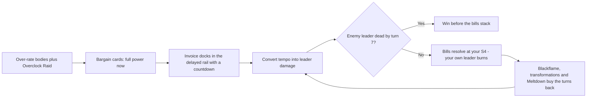

# Faction 05 — Digital Demons

> Part of the HYPEBOUND faction identity series (`docs/design/factions/`).
> Canon: [core rules](../00-core-rules.md) §6 (keywords), §7 (factions), §8 (Currents).
> Overview table: [faction guide](../04-faction-guide.md). Card data home:
> `data/cards/digital-demons.json` — leaders and faction tokens live in the same
> file, per the [architecture contract](../../tech/00-architecture-contract.md) §2.
> Siblings: [Neon Idols](./01-neon-idols.md) · [Gothic Royalty](./02-gothic-royalty.md) · [Viral Influencers](./03-viral-influencers.md) · [Corporate Creators](./04-corporate-creators.md) · [Cosplay Champions](./06-cosplay-champions.md)

**Currents: Cinder (primary identity) / Veil** · **Playstyle: front-loaded power bought on credit — corruption, transformation, self-damage for tempo**

---

## 1. Fantasy & Tone

The Digital Demons are what crawls out of hardware that was pushed too far. They
are the entity in the render farm, the thing that answers when a stream key is
typed backwards, the presence that has been living rent-free in a second-hand
capture card since 2013. Their satire target is the paperwork of being online:
the End User License Agreement as a literal blood pact, the update you did not
consent to, the "free trial" that quietly renews, the file that is corrupted but
still, somehow, opens.

The comedy is bureaucratic horror. A demon does not tempt you — it *onboards*
you. Every catastrophe arrives with a confirmation dialog and an OK button, and
the OK button is the only button. Nothing here is ever stolen; everything is
agreed to, in a font size that does not technically exist. Characters are
original archetypes only — the impling that spawns from a popup, the fiend that
feeds on infinite scroll, the demon duke bound into a gaming PC with an
unconfigured fan curve — never a parody of a real person, company, or product.

Mechanically the fantasy is **buy now, pay later, and the bill is not
negotiable**: Demon cards are the best rate in the game at the moment you play
them, and the invoice arrives on a visible countdown two turns later.

---

## 2. Visual Identity & Color Language

The Demons own the "cursed hardware" corner of the digital-nightlife palette:
crash panels, thermal warnings, and glossy black machines with something moving
under the glass.

| Role | Color | Hex | Usage |
|---|---|---|---|
| Primary | Bluescreen Cobalt | `#2B4BFF` | Faction emblem, Veil-side glow, crash panels, board trim |
| Secondary | Hellfire Crimson | `#C41425` | Cinder VFX, thermal warnings, self-damage and invoice motifs |
| Accent | Datarot Green | `#5CFFA8` | Corrupted-file glyphs, transformation smear, glitch artifacts |
| Support | Melted Chrome | `#8A8FA3` | Case panels, fan grilles, ribbon-cable entrails |
| Base | Dead-Pixel Black | `#050409` | Backgrounds, void space between error dialogs |

- **Motifs:** infinitely scrolling EULA scrolls, "I AGREE" checkboxes branded in
  fire, stacked error dialogs receding to a vanishing point, glowing fan grilles,
  thermal-paste sigils, progress bars frozen at 99%, cursors that twitch when
  nobody is holding the mouse.
- **VFX language:** playing a **Bargain** card stamps a crimson invoice tab into
  the delayed-effects rail with a visible turn countdown; when it comes due the
  tab slams flat with a contract-stamp impact and the leader portrait cracks.
  Transformations play a datamosh smear — the old body's pixels drag into the
  new one. **Cursed** shows a fractured checkbox sigil (shape-coded, never
  color-only), matching Gothic Royalty's status iconography.
- **Card frames** follow the Current, per canon §8.2: Cinder cards use the sharp
  flame-notched frame with ember glow; Veil cards use the fractured mirror-shard
  frame. Faction identity lives in art, emblem, and board skin — never in frame
  shape and never in color alone. The faction badge is a horned power-symbol
  glyph with a text label.
- **Board skin:** an open PC case the size of a cathedral, fans turning slowly,
  liquid-cooling loops running something that is not coolant.
- **Audio:** industrial synth over sampled fan whine and hard-drive seek clicks;
  the theme pitch-bends a semitone down every time your own leader takes
  self-inflicted damage (`music.battle.digital-demons` in
  `data/audio-manifest.json`).

---

## 3. Currents: Cinder / Veil

| Current | Why it fits |
|---|---|
| **Cinder** (fire — ambition, performance, destructive creativity) | Thermals. The rig runs hot because it is being ridden past its rating, and **Scorched** is the fan curve nobody configured. Cinder is the faction's *speed*: burn now, cool down never. |
| **Veil** (darkness — secrets, fear, forbidden ambition) | The contract. **Corrupt** is a demon rewriting the terms of your own card in front of you, and the **Cursed** status is a clause that has not been invoked *yet*. Veil is the faction's *price*. |

**Advantage cycle notes (canon §8.4):** Cinder deals +1 to Gale (Viral
Influencers, Meme Collective, Touch-Grass Order's Gale half) and takes +1 from
Tide (Cosplay Champions, Afterparty Crew, Algorithm Syndicate). Halo and Veil
deal +1 to each other, so Neon Idols and Corporate Creators' Halo half are
mutually bloody — our removal is efficient against them and their damage is
efficient against a leader who is already burning itself.

**Confluence note:** Digital Demons are the **only** faction whose Current pair
is Cinder + Veil, which makes **Blackflame** — *"Deal 2 damage to a character;
it can't be healed until your next turn"* (canon §8.5) — a faction-exclusive
tool. It is the game's premier anti-sustain effect, and it is free, once per
turn, whenever a dual deck has played one card of each Current. Pure Cinder or
pure Veil builds give it up in exchange for **Perfect Resonance** (per-Current
bonus in `data/currents.json`; see [Currents & lore](../06-currents-and-lore.md)).

**Deck-construction note [DECISION]:** unlike Neon Idols, Gothic Royalty, and
Viral Influencers, *both* Demon leaders carry a Secondary Current (canon §8.6
permits, never requires, a Secondary). Pure decks remain fully available under
either leader by simply not including the secondary Current's cards — the
faction's build choice is therefore **Blackflame vs. Resonance**, not
**leader A vs. leader B**. Up to 3 Prism cards may be splashed as usual, at the
cost of Resonance eligibility.

---

## 4. Gameplay Strategy

The Demons are the **risk-tempo** faction. Every card is printed roughly one
Hype above its stated cost in raw effect, and the difference is levied later:
scheduled self-damage, a **Cursed** mark on your own body, a transformation you
cannot undo. The whole deck is a bet that the match ends before the invoices do.



| Strengths | Weaknesses |
|---|---|
| Best raw rate in the game at the moment of play — Demon cards read like cards costing (1) more | Self-inflicted damage is the canon-listed weakness: **Bargain** debts cannot be cancelled, prevented, or paid early |
| Faction-exclusive **Blackflame** shuts off enemy healing — the cleanest answer to Gothic Royalty and Corporate Creators sustain | Almost no healing of its own; the faction's own life total is a spent resource by turn 8 |
| Transformations answer *anything* — buffs, **Grow** progress, Equipment and `onDefeat` payoffs all vanish without a defeat trigger | Unpredictable downsides (canon-listed): a minority of cards randomize *which* price you pay |
| True reach: leader damage from Bargains, **Scorched**, and Ashvyre's Ultimate closes games from 10+ HP | Enemy anti-heal, **Scorched**, and burn are lethal earlier against us than against anyone else |
| Cinder +1 into every Gale deck; Veil +1 into every Halo deck | Takes +1 from Tide (Cosplay Champions, Afterparty Crew, Algorithm Syndicate) and +1 from Halo |
| Cheap hard removal (transform) at Epic rarity, priced under the neutral curve | Past turn 10 the accumulated debt curve outruns the clock; Touch-Grass Order punishes the Obsessed meter we are forced to run hot |

**The core decision the faction asks every turn:** *how much of my remaining
health is this turn worth?* A Demon pilot who never signs loses on rate; a pilot
who signs everything loses at S4 three turns later, to their own deck.

---

## 5. Obsession Profile

Demons are structurally bad at the canonical support trigger (+1 the first time
each turn you buff, heal, shield, or equip a friendly character, canon §3.2) —
they buff and heal rarely, and prefer to *damage* their own board. The faction
compensates by **selling** Obsession outright: bargain cards print "gain 1
Obsession" or "gain 2 Obsession" as part of the deal, and Ashvyre's Ultimate
scales directly with the size of a turn, not with the meter.

The consequence is the faction's signature double jeopardy. Demon players reach
7 Obsession as fast as anyone, then keep climbing — and at **8+** they are
**Obsessed**: their leader takes +1 damage from all enemy sources *while their
own bargains are already billing them*, and Touch-Grass Order's anti-Obsession
cards switch on. Digital Demons are the only faction that can plausibly lose a
match to its own resource curve with an empty enemy board. Riding to 10 for a
free **Full Fixation** cast (Obsession resets to 5 at end of turn) is the
faction's planned kill turn, and it is routinely executed from single-digit
leader health.

---

## 6. Signature Mechanics

**Canonical keywords used heavily:** **Corrupt**, **Raid**, **Collab (X)**, the
**Scorched** and **Cursed** statuses (canon §5.4), and the **Transformation**
card type — which canon §4 explicitly permits Demons to point at *enemy*
characters via Corrupt.

**Corrupt templating [DECISION]:** on Digital Demons cards, **Corrupt** is
always printed as a two-branch choice — the plain effect, or the darker version
with a price attached. It composes from the canonical `chooseOne` op with
exactly two options, the second labelled `corrupt`:

```jsonc
// Meltdown (excerpt)
{ "trigger": "onPlay",
  "ops": [ { "op": "chooseOne", "options": [
      { "label": "plain", "ops": [
        { "op": "damage", "target": { "select": "all", "side": "any", "zone": "board" }, "amount": 3 } ] },
      { "label": "corrupt", "ops": [
        { "op": "damage", "target": { "select": "all", "side": "any", "zone": "board" }, "amount": 5 },
        { "op": "damage", "target": { "select": "leader", "side": "friendly" }, "amount": 5 } ] } ] } ] }
```

### 6.1 Faction mechanic — Bargain (N)

*The signature. Full power immediately; the stated cost resolves on a visible
countdown.*

> **Bargain (N)** — *templated phrase.* Card text form:
> `[Immediate effect]. **Bargain (N):** [Cost].`
> Reminder text (Common/Rare only, per canon §6):
> *(Bargain — the stated cost resolves at the start of your turn, N turns from
> now. It cannot be cancelled, prevented, or paid early, and it resolves even if
> this card has left play.)*

No new engine machinery: this is an `onPlay` effect whose ops end in the
canonical `scheduleDelayed` op (architecture contract §4, `EffectOp`).

```jsonc
// Sign Here (excerpt)
{ "trigger": "onPlay",
  "ops": [
    { "op": "draw", "count": 2 },
    { "op": "gainObsession", "amount": 1 },
    { "op": "scheduleDelayed", "delayTurns": 2, "label": "Sign Here — 4 damage",
      "ops": [ { "op": "damage", "target": { "select": "leader", "side": "friendly" }, "amount": 4 } ] } ] }
```

| Rule | Ruling |
|---|---|
| When does it resolve? | Step **S4** of the owner's turn (timed statuses / Comeback / Banish / `scheduleDelayed` tick), per the [gameplay-loop doc](../02-gameplay-loop-and-match-flow.md) §S4 — *after* Hype refill and draw, *before* the main phase. You always see the bill before you act. |
| Is it visible to the opponent? | **Yes, always.** Bargain debts are public. The HUD's delayed-effects rail shows both players' pending invoices with label and turn countdown, driven by the `delayedScheduled` / `delayedTriggered` engine events. |
| Can it be removed? | **No.** Killing the card, bouncing it, **Cancelled**, and **Banished** all do nothing to a scheduled debt. This is deliberate: it is the faction's canon-listed weakness, not a drawback the pilot can weasel out of. |
| Can it kill you? | **Yes.** Bargain damage is ordinary leader damage and can be lethal to its own controller. `predict()` must include pending Bargain totals in the leader's projected health, and the leader orb shows a crimson "pending" arc. |
| Maximum delay | 3 turns. Longer clocks stop being a decision and start being a lottery. |
| Alternate prices | Instead of leader damage, a Bargain may schedule a discard, a **Cursed** self-mark, or Obsession loss. It may never schedule a *benefit*. |

### 6.2 Faction mechanic — Glitchform

*A one-way transformation triggered by taking damage: the body you were
protecting becomes something worse and better.*

> **Glitchform** — *templated phrase, Characters only.* Card text form:
> `**Glitchform:** Transform this into **[Form]** ([A]/[H]).`
> Reminder text (Common/Rare only):
> *(Glitchform — the first time this survives damage, it transforms
> permanently.)*

Composes from the canonical `onDamaged` trigger ("this character survives
damage") with `once: true` and the `transform` op pointing at a token defined in
`data/cards/digital-demons.json`.

```jsonc
// Fan-Curve Gremlin (excerpt)
{ "trigger": "onDamaged", "once": true,
  "ops": [ { "op": "transform", "target": { "select": "self" },
             "intoCardId": "demon-token-redline-gremlin" } ] }
```

| Rule | Ruling |
|---|---|
| What carries over? | The transformed character enters with the form's printed stats, keeps its Equipment (matching the transform ruling in [Cosplay Champions](./06-cosplay-champions.md) §10), and loses all buffs and statuses. |
| Summoning sickness | The instance retains `enteredOnTurn` and `attacksUsedThisTurn`, so Glitchform neither refreshes an attack nor sickens a ready body. **[DECISION]** |
| Reversible? | Never. Glitchform is permanent and the demonic form always carries a downside (typically an **Afterparty** self-damage clause). |
| Does the damage still apply? | Yes — the trigger fires *after* the damage resolves and the character survives, then the new form's printed Health applies at full. Surviving one hit is the cost of admission. |

### 6.3 Rate & risk guardrails (binding for card design)

Digital Demons cards are deliberately over-rate. These are the prices, and the
card validator's design review enforces them:

| Uplift over the neutral rate | Standard price |
|---|---|
| +1 stat point, or ~1 Hype of effect | 1–2 immediate self-damage, or **Scorched** on the new body |
| ~2 Hype of effect | **Bargain (2):** your leader takes 3–4 |
| ~3 Hype of effect (Epic band) | **Bargain (2):** your leader takes 5, or **Bargain (1):** your leader takes 3 |
| Hard removal printed 1 Hype under the neutral curve | **Bargain (2)** plus a **Cursed** self-mark |

- **Deck-level ceiling:** an average Demon curve should schedule **≤ 12 total
  self-damage** through per-player turn 6 — 40% of a leader's 30 health. The
  faction should only die to its own deck when the pilot over-signs.
- **Randomness rule [DECISION]:** Demons may randomize *which price you pay* but
  never *which benefit you get*. Bounded randomness on upside belongs to the
  Meme Collective; the Demons' unpredictability is always on the invoice. All
  randomness flows through the seeded rng (`src/engine/rng.ts`), so replays are
  exact.

```jsonc
// Small Print (excerpt) — the benefit is known, the price is not
{ "trigger": "onPlay",
  "ops": [
    { "op": "draw", "count": 2 },
    { "op": "scheduleDelayed", "delayTurns": 2, "label": "Small Print",
      "ops": [ { "op": "randomOp", "options": [
        { "ops": [ { "op": "damage", "target": { "select": "leader", "side": "friendly" }, "amount": 4 } ] },
        { "ops": [ { "op": "discard", "target": { "select": "random", "side": "friendly", "zone": "hand" }, "count": 2 } ] },
        { "ops": [ { "op": "applyStatus", "target": { "select": "random", "side": "friendly", "zone": "board" }, "status": "cursed" } ] } ] } ] } ] }
```

### 6.4 Implementation notes (DSL mapping)

| Feature | Mapping |
|---|---|
| **Bargain (N)** | `scheduleDelayed { delayTurns: N, label, ops }`; resolves at S4; surfaced by `delayedScheduled` / `delayedTriggered` events |
| Delayed-rail visibility | `PlayerView` in `types.ts` carries no delayed-effect list; the presenter builds both players' rails from the event stream. No canonical type change is required. **[DECISION]** |
| **Glitchform** | `onDamaged` + `once: true` + `transform { intoCardId }` |
| **Corrupt** | `chooseOne` with exactly two options, second labelled `corrupt` |
| **Cursed** self-marks | `applyStatus { status: "cursed" }`; the curse's trigger and effect are stated in the applying card's text, matching [Gothic Royalty](./02-gothic-royalty.md) §6.2 |
| Equipment self-damage clauses | On Equipment cards, `{ select: "self" }` resolves to the equipped character **[DECISION]** |
| Reaction cost filters | `reaction` effects reuse `playedFilter` (e.g. `{ costMin: 3 }`) to constrain the triggering card **[DECISION]** |
| Finale counters | The `finale: true` flag on `CardDefBase`; counter tracking is engine-side, the trigger and condition are ordinary DSL |

---

## 7. Leaders

### 7.1 Ashvyre, Duke of Dropped Frames

| Field | Value |
|---|---|
| Id | `demon-leader-ashvyre-dropped-frames` (`data/cards/digital-demons.json`) |
| Currents | **Primary: Cinder · Secondary: Veil** (leader card is Cinder) |
| Health | 30 (canon default) |
| Passive — *Overclock* | The first Character you play each turn gains **Raid** and **Scorched**. |
| Fixation (3 Obsession, once per turn) — *Redline* | A friendly character may attack again this turn. Your leader takes 2 damage. |
| Ultimate Fixation (7 Obsession, once per match) — *Terms Accepted* | Deal damage to the enemy leader equal to the Hype you have spent this turn. Then your leader takes 2 damage. |

**Personality:** a demon duke bound into a mid-tower gaming PC whose fan curve
was never configured, and who considers this the greatest gift a mortal has ever
given him. Measures devotion in degrees Celsius, refers to thermal throttling as
"censorship," and insists his contract is voided only by adequate cooling.
Boisterous, generous, permanently on fire.

**Play pattern:** *Overclock* converts the faction's over-rate bodies into
immediate damage — a 2-cost 3/3 with **Raid** on turn 2 is the fastest honest
start in the game, and the **Scorched** tick is a rounding error on an aggro
plan. *Redline* is 3 Obsession for a second swing from your biggest body, paid
for in health. *Terms Accepted* is fired **after** the turn's Hype is fully
spent — the sequencing matters, and the HUD shows the live damage figure on the
button. Ops resolve in printed order, so if the enemy leader hits 0 first the
match ends immediately (victory is evaluated continuously) and the self-damage
never happens.

### 7.2 The Blue Screen Baron, Sovereign of the Fatal Exception

| Field | Value |
|---|---|
| Id | `demon-leader-blue-screen-baron` |
| Currents | **Primary: Veil · Secondary: Cinder** (leader card is Veil) |
| Health | 30 |
| Passive — *Fatal Exception* | The first time a friendly character is defeated each turn, deal 1 damage to the enemy leader. |
| Fixation (3 Obsession, once per turn) — *Force Quit* | **Choose one —** Deal 2 damage to an enemy character; or deal 2 damage to a friendly character and draw a card. |
| Ultimate Fixation (7 Obsession, once per match) — *Kernel Panic* | Deal damage to the enemy leader equal to the number of enemy characters. Then deal 4 damage to all characters. |

**Personality:** a demon who lives in a crash dump and communicates exclusively
in modal dialogs. Every sentence has an OK button and no cancel. Impeccably
formal, faintly apologetic, and utterly implacable — considers *"have you tried
restarting?"* a credible threat of violence. Reproduced from the annotated
example match in the [gameplay-loop doc](../02-gameplay-loop-and-match-flow.md)
§4, passive text unchanged.

**Play pattern:** the Baron makes your own board a resource. *Force Quit*
converts a doomed body into a card and a **Fatal Exception** ping, and pairs
with defeat-payoff characters like Doomscroll Fiend. *Kernel Panic* is the
faction's reset button: it prices the enemy board as face damage *before* the
sweep lands, then clears everything — including your own side, which fires
*Fatal Exception* one more time. Note the ordering carefully in the tooltip: the
reach is calculated on the pre-sweep board, so wide enemy boards are punished
twice.

---

## 8. Deck Archetypes

Expected win turns follow the binding balance targets in the
[gameplay-loop doc](../02-gameplay-loop-and-match-flow.md) §5.2.

### 8.1 Free Trial (dual Cinder/Veil · Ashvyre)

- **Game plan:** the faction's headline build and the archetype the balance
  targets name for Digital Demons — **hyper-aggro, lethal on per-player turn
  6–7**. Curve out with over-rate bodies, hand every one of them **Raid** on the
  turn it lands via *Overclock*, and buy the missing damage on credit. Every
  Bargain is signed on the assumption the game ends before turn 8. Blackflame
  clears the one blocker that matters and stops the opponent healing out of
  range. *Terms Accepted* is the closer, fired after a fully spent turn.
- **Key cards:** Popup Impling, Sign Here, Cursed Ring Light *(2 · Equipment ·
  Cinder · Common · +3/+0: "Equipped character has +3/+0. At the end of your
  turn, it takes 1 damage.")*, Fan-Curve Gremlin, The Rig That Screams, Meltdown
  as a catch-up sweep.
- **Pure variant:** an all-Cinder list drops Sign Here and Forced Reformat for
  burn and unlocks **Perfect Resonance (Cinder)**, trading Blackflame for a
  slightly faster and much more linear clock.
- **Matchups:** preys on Gale decks (+1 on everything: Viral Influencers, Meme
  Collective) and on any deck that stumbles before turn 4. Struggles against
  Corporate Creators' Armor stacking, against Tide decks that get +1 back on our
  Cinder bodies (Afterparty Crew, Algorithm Syndicate), and against Touch-Grass
  Order, whose anti-Obsessed package lands exactly when we are at 8+ and already
  bleeding.

### 8.2 Corrupted Save (pure Veil · Blue Screen Baron)

- **Game plan:** a **midrange transformation-control** deck, **winning on turn
  8–10**. It answers threats rather than racing them: Forced Reformat and
  friends delete the opponent's best card outright — no `onDefeat` trigger, no
  **Grow** progress, no Equipment, no **Comeback** — while **Cursed** marks tax
  everything they keep. Pure-Veil construction unlocks **Perfect Resonance
  (Veil)**; the deck's few Bargains are the price of holding the door until
  Clause Thirteen arrives.
- **Key cards:** Forced Reformat, Doomscroll Fiend, Forced Update, Terms of
  Service Update *(4 · Event · Veil · Rare · 3 turns: "At the start of each of
  your turns, deal 2 damage to the enemy leader and 1 damage to your leader.")*,
  Clause Thirteen the Fine Print.
- **Matchups:** excellent into single-threat decks — Cosplay Champions carries
  and Gothic Royalty **Grow** walls both evaporate to a transform, and Blackflame
  turns off the court's healing. Weak into wide token boards (one transform per
  card is a bad rate against Viral Influencers) and into Neon Idols, whose Halo
  half trades +1 with our Veil half while they rebuild faster than we can
  reformat.

### 8.3 Crash Dump (dual Veil/Cinder · Blue Screen Baron)

- **Game plan:** the faction's attrition build, **winning on turn 9–11** — the
  fast edge of the Control band, because this deck's own life total is a
  spendable resource and cannot be defended forever. Trade everything, ping with
  *Fatal Exception*, sweep with Meltdown and *Kernel Panic*, and convert every
  defeat on either side into damage. Face-down Reactions punish the opponent's
  rebuild turns.
- **Key cards:** Forced Update, Doomscroll Fiend, The Rig That Screams, Meltdown,
  Small Print *(2 · Action · Veil · Rare: "Draw 2 cards. **Bargain (2):** Pay a
  random price — your leader takes 4 damage, or discard 2 cards at random, or a
  random friendly character becomes **Cursed**: when it attacks, it is
  defeated.")*, Clause Thirteen as the inevitability backup.
- **Matchups:** beats midrange decks that commit bodies into sweepers and any
  deck relying on healing to stabilize (Blackflame plus **Cursed** marks makes
  their heals cost a card for nothing). Loses to decks that go over the top on
  the top end — Corporate Creators' expensive finishers arrive while we are at 12
  health of our own making — and to Touch-Grass Order control, which removes the
  Location, Banishes the Fiend without a defeat trigger, and punishes our meter.

---

## 9. Example Cards

Tags in play: `demon`, `hardware`, `glitch`. Reminder text appears on
Common/Rare only, per canon §6 templating. Popup Impling, Forced Update, and
Doomscroll Fiend are reproduced unchanged from the annotated example match in
the [gameplay-loop doc](../02-gameplay-loop-and-match-flow.md) §4.1.

| Name | Cost | Type | Current | Rarity | Stats | Rules text |
|---|---|---|---|---|---|---|
| Sign Here | 1 | Action | Veil | Common | — | Draw 2 cards and gain 1 Obsession. **Bargain (2):** Your leader takes 4 damage. *(Bargain — the stated cost resolves at the start of your turn, 2 turns from now. It cannot be cancelled, prevented, or paid early.)* |
| Forced Update | 1 | Reaction | Veil | Common | — | When the enemy plays a Character costing (3) or more, deal 1 damage to it. |
| Popup Impling | 2 | Character | Cinder | Common | 3/3 | — |
| Doomscroll Fiend | 3 | Character | Veil | Rare | 2/5 | When another friendly character is defeated, this gains +1 Attack. |
| Fan-Curve Gremlin | 3 | Character | Cinder | Rare | 4/3 | **Glitchform:** Transform this into **Redline Gremlin** (6/3). *(Glitchform — the first time this survives damage, it transforms permanently.)* |
| The Rig That Screams | 3 | Location | Cinder | Rare | Dur. 3 | Activate (once per turn): Deal 2 damage to a character; your leader takes 1 damage. |
| Forced Reformat | 3 | Transformation | Veil | Epic | — | **Choose one —** Transform a friendly character into **Overclocked Wretch** (4/4); or **Corrupt:** transform an enemy character into **Corrupted File** (1/1, no abilities). **Bargain (2):** Your leader takes 3 damage. |
| Meltdown | 5 | Action | Cinder | Epic | — | Deal 3 damage to all characters. **Corrupt:** Deal 5 damage to all characters instead, and your leader takes 5 damage. |

**Design note on Popup Impling.** A 2-cost 3/3 vanilla sits exactly one stat
point above the neutral Common line (2-cost = 3/2 or 2/3). It is intentionally
the faction's thesis statement and its only *free* efficiency: the Demons pay
for their rate in card text everywhere else, so one honest curve card keeps the
deck playable when the pilot has already over-signed. It is flagged in
`data/cards/digital-demons.json` as a tuning benchmark — if the faction's win
rate drifts high, the Impling is the first dial, not the Bargains.

**Tokens** (summon/transform targets, `token: true`, never in decks or packs):

| Name | Id | Current | Stats | Rules text |
|---|---|---|---|---|
| Corrupted File | `demon-token-corrupted-file` | Veil | 1/1 | — |
| Overclocked Wretch | `demon-token-overclocked-wretch` | Veil | 4/4 | **Afterparty:** This takes 1 damage. |
| Redline Gremlin | `demon-token-redline-gremlin` | Cinder | 6/3 | **Afterparty:** Your leader takes 1 damage. |

**Enemy-targeted Transformations require Corrupt** (canon §4: a Transformation
transforms "a target — yours, or with **Corrupt**, the enemy's"). Every Demon
Transformation is therefore printed as the standard two-branch `chooseOne`: the
plain branch points at your own board, the `corrupt` branch points at theirs.

---

## 10. Finale Legendary — Clause Thirteen, the Fine Print

The Demons' alternate win: the agreement matures. Where other Finale cards ask
you to build something, this one asks you to *bleed on schedule* — the faction's
weakness rebuilt into a win condition.

| Field | Value |
|---|---|
| Name / Id | Clause Thirteen, the Fine Print · `demon-clause-thirteen` |
| Cost / Type / Current / Rarity | 6 · Character · Veil · Legendary (max 1 copy) |
| Stats | 3/7 |
| Rules text | **Finale:** At the end of your turn, your leader takes 1 damage; then, if your leader has 15 or less Health, this gains a Signature counter. At 4 Signature counters, you win the match. |
| Flavor | *You agreed to this. Section 9, subsection 4, in a font that does not exist.* |

**Canon compliance (core rules §2, victory):**

- **(a) Visible progression:** Signature counters render as wax-seal pips on the
  card, and the opponent's HUD announces "Finale: 3/4" on every gain. The
  self-damage clause resolves in the E1 (**Afterparty**) step, so both players
  watch the clock tick before the turn ends.
- **(b) At least 2 turns from reveal to trigger:** at most 1 counter per turn,
  gained only at end of turn — a minimum of **4 turns** from reveal to victory,
  and only while the controller sits at 15 health or less.
- **(c) Interactable, on three independent axes:**
  1. **Kill it.** Clause Thirteen is an attackable 3/7 with no protection — and
     unlike a 0/8 wall, it is a real attacker, so leaving it alive is not free
     either. **Cancelled** blanks the text and freezes progression;
     **Touch Grass**/**Banished** removes it and clears its counters (shared
     Finale ruling — Banished characters return with base stats and no
     statuses).
  2. **Stop hitting them.** Progression requires the Demon leader at ≤ 15
     health. An opponent who holds off can force the Demon to burn its own
     health down — 1 per turn from the Clause itself, plus whatever else it
     signs. Racing a Clause deck *powers it*; this is the intended inversion.
  3. **Outlive it.** The Clause kills its own controller in fifteen turns
     unaided and much sooner in practice. Every turn spent protecting it is a
     turn not spent stabilizing, and the deck must survive four end-steps at
     15 health or less against a live board.

Clause Thirteen deliberately competes with the faction's aggro plan: the health
it spends is the health that pays for the Bargains, so no Demon deck can run the
Finale and the Free Trial curve at full strength simultaneously. That choice —
sign for tempo, or sign for the win condition — is the archetype, and the
opponent gets a legible, two-sided counterplay window either way.
