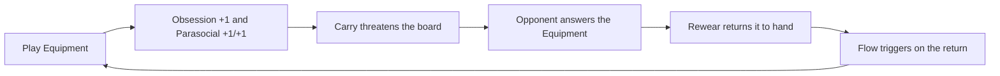

# Faction 06 — Cosplay Champions

> Part of the HYPEBOUND faction guide (`../04-faction-guide.md`). All rules here
> conform to `../00-core-rules.md`; keyword wording follows
> `../05-keyword-glossary.md`. Card data lives in `data/cards/cosplay-champions.json`.

| At a glance | |
|---|---|
| Faction id | `cosplay-champions` |
| Currents | **Prism** (primary) / **Tide** (secondary) |
| Signature Current keywords | **Refract**, **Flow** |
| Native Confluence | **Refraction** (Prism + Tide) |
| Faction mechanics | **Rewear**, **Debut** |
| Playstyle | Equipment-centric midrange; single-carry adaptation |
| Pilot difficulty | 3 / 5 |
| Sibling factions | `./05-digital-demons.md`, `./07-afterparty-crew.md` |

---

## 1. Fantasy & Tone

The Cosplay Champions are the heroes of the convention floor: armorsmiths who
treat hot glue as a sacrament, seamstresses who can re-hem a cape in a badge
line, and masquerade performers who have never once appeared as the same person
twice. In HYPEBOUND's satire of online life, they are the people who *make*
things while everyone else posts about them — and they will absolutely corner
you to explain the build log.

The comedy is affectionate craft obsession: thirty-hour paint jobs, foam dust
in every meal, hallway repairs performed with the gravity of battlefield
surgery, and the sacred masquerade rule that *the costume is not finished until
the con has already started*. Their villains-of-choice are hot-glue shortages
and juried competitions. Even with every joke removed, the faction reads
clearly: **champions who become stronger by building, wearing, and swapping
gear.**

Characters are original archetypes only — the Foam Knight, the Quick-Change
Understudy, the Judge With The Clipboard — never parodies of real cosplayers.

## 2. Visual Identity & Color Language

| Element | Direction |
|---|---|
| Environments | Convention halls, workshop benches, masquerade stages, green rooms, badge-line queues |
| Base palette | Iridescent spectrum highlights over white and silver (Prism), with sea-glass teal accents (Tide) |
| Materials | Foam board, thermoplastic sheen, LED strips, satin, worn toolboxes, glitter that never fully leaves |
| Card frames | Prism crystal-facet frame with shifting spectrum; Tide rounded wave-edge frame with liquid sheen (per core rules §8.2) |
| Motifs | Con badges, glue guns, sewing patterns, trophy ribbons, mannequins, "STAFF ONLY" doors |
| VFX language | Costume-swap shimmer (a spectrum sweep across the character), stitch-line sparkles on equip, trophy-flash on Debut triggers |
| Silhouette rule | Every Champion silhouette changes visibly when equipped; the equipped state must be readable at board distance |

Where the digital factions glow with screens, the Champions glow with **stage
lights on handmade things** — still nightlife, but backstage.

## 3. Currents: Why Prism / Tide

- **Prism** (possibility, harmony, instability) is the costume itself: the
  power to become anything. **Refract** *is* the costume swap — a Prism card
  choosing its Current is a Champion choosing today's character. Cosplay
  Champions are one of the two Prism-primary factions (core rules §8.6): their
  leaders build Prism-primary decks, and their Prism cards pay the canonical
  Prism tax (~1 Hype more expensive or statted lower).
- **Tide** (memory, adaptation, repetition) is the craft: repairing, re-wearing,
  re-fitting. **Flow** triggers when cards return to hand or are replayed —
  which is exactly what the faction's equipment loop does.

**Confluence access:** As a Prism-paired faction, their native Confluence is
**Refraction** (Prism + any): after playing a Prism card and a Tide card in the
same turn, the next Tide card played that turn triggers its on-play effect
twice. Pure-Tide builds instead chase **Perfect Resonance**.

**Ruling (design decision, applies engine-wide):** when a card with **Refract**
is played, the play counts as **both** Prism and the chosen Current for that
turn's Confluence eligibility; while in play the card is only the chosen
Current. This makes Refraction reliably reachable for Prism-primary decks and
is deterministic to track.

## 4. Strategy Profile

The Champions are a **midrange faction that concentrates power** instead of
spreading it. They build one or two heavily supported carries, then use
equipment swaps, Refract, and stat tricks to stay one answer ahead of the
opponent. Because equipping is *support*, the faction generates **Obsession**
faster than almost anyone (+1 the first time each turn you equip/buff/heal, plus
**Parasocial** triggers), so their Leader Fixations come online early and often.

| Strengths | Weaknesses |
|---|---|
| Extremely flexible answers via **Refract** and equipment choice | Answer-dependent: the right removal at the right time blanks the plan |
| Strong single units that win fair trades | Equipment removal and **Touch Grass** (returns targets with *no attachments*) are disastrous |
| Fastest reliable Obsession engine → frequent Fixations | High Obsession means living at 8+ (**Obsessed**: +1 damage taken; Touch-Grass Order bonuses apply) |
| Recursion (Rewear + Flow) grinds out slow removal decks | Max 1 Equipment per character (canon) caps how tall one turn can go |
| | Board width is poor; wide aggro can go under them |

## 5. Signature Mechanics

**Canonical keywords leaned on:** **Refract**, **Flow**, **Parasocial**,
**Spotlight**, **Collab (tag)**, plus the Transformation card type for
alternate forms.

### 5.1 Rewear (faction keyword — Equipment only)

> **Rewear** — *When this Equipment would be destroyed, return it to your hand instead.*

Covers both destruction effects and replacement (canon: a new Equipment
replaces the old, destroying it) and wearer death. Every Rewear return is a
**Flow** trigger. Composes from existing DSL: destruction-replacement hook →
`returnToHand` (no new ops required).

### 5.2 Debut (faction keyword — Character only)

> **Debut** — *Triggers the first time this character gains an Equipment.*

The masquerade entrance. Implemented as a filtered `onTargeted` trigger
(Equipment plays target their wearer) with a once-per-character flag.

**Ruling:** Debut checks *gaining* an Equipment from any source (played,
tokens, moved), and never re-triggers, even if the Equipment is replaced.

## 6. Leaders

Both leaders are Prism-primary (core rules §8.6). Leader health 30; Fixation
costs 3 Obsession (once per turn); Ultimate Fixation costs 7 Obsession (once
per match).

### 6.1 Vera Foamhammer, the Con-Queror

The undisputed master of armor builds. Booming voice, safety goggles pushed up
into her hair, refers to hot glue exclusively as "the sacred adhesive." Treats
every hallway repair as a knighting ceremony.

| Field | Value |
|---|---|
| Currents | Primary **Prism** / Secondary **Tide** |
| Passive — *Workshop Discipline* | The first Equipment you play each turn costs (1) less. |
| Fixation (3) — *Hot-Glue Triage* | Give a friendly character +1/+1. If it has an Equipment, also give it **Shielded**. |
| Ultimate Fixation (7) — *Masterwork Reveal* | Equip a friendly character with **The Masterwork** (Equipment token: +3/+3, **Rewear**). That character gains **Armor 3**. |

Play pattern: curve out, discount gear, and make one character functionally
unkillable for a turn. If the target already wore a Rewear Equipment, the
replacement bounces it to hand for a later Flow turn.

### 6.2 Kiko Thousand-Faces

A masquerade legend who has competed under a different persona at every event
for nine years. Serene, theatrical, refuses to confirm which face is the real
one. Their toolbox contains only mirrors.

| Field | Value |
|---|---|
| Currents | Primary **Prism** / Secondary **Tide** |
| Passive — *Never the Same Twice* | The first time each turn a friendly character transforms or changes its Current, draw a card. |
| Fixation (3) — *Quick Change* | Swap a friendly character's Attack and Health. |
| Ultimate Fixation (7) — *Grand Masquerade* | Transform a friendly character into **Legend of the Floor** (7/7, **Spotlight**, **Raid**). It keeps its Equipment. |

Play pattern: stat-swap tricks turn defensive statlines into surprise lethal;
the passive converts every Refract and Transformation into card flow; the
Ultimate turns any spare body (plus its gear) into a finisher.

## 7. Deck Archetypes

### 7.1 Full Regalia (midrange carry)

- **Game plan:** Deploy a durable carry (turns 2–3), stack the best Equipment
  on it, protect it with Shielded/Steamveil-style effects and Vera's Fixation,
  and win through repeated favorable trades. Rewear guarantees the gear
  outlives the wearer.
- **Key cards:** Foam Greatsword, Hall Runway Rookie, The Sacred Adhesive,
  Con-Crunch Artisan, Prism Regalia of a Thousand Threads.
- **Matchups:** Favored vs. removal-light midrange and vs. Gothic Royalty
  attrition (Rewear out-grinds single removal). Unfavored vs. Touch-Grass
  Order (Banish strips attachments; Obsessed punishes) and vs. wide Viral
  Influencer boards if the carry can't trade twice.

### 7.2 Quick-Change Tempo (Flow tempo)

- **Game plan:** Cheap Equipment cycled on and off the board turns every turn
  into 2–3 Flow triggers. Green-Room Quickchanger and friends snowball small
  permanent buffs while Kiko's stat-swap converts tempo into burst.
- **Key cards:** Green-Room Quickchanger, Foam Greatsword, Hall Repair Sortie
  (cheap heal/return package), Refraction Confluence turns.
- **Matchups:** Favored vs. slow setup decks (Algorithm Syndicate, Corporate
  Creators) that concede early tempo. Unfavored vs. aggressive Cinder decks
  that ignore the value loop and race the leader.

### 7.3 Masquerade Toolbox (Refract control)

- **Game plan:** Prism-heavy list that answers whatever the opponent is doing:
  Refract into the Current that holds the advantage (+1 damage cycle, core
  rules §8.4), swap Currents mid-game with Prism Regalia, and finish with
  Grand Masquerade.
- **Key cards:** Masquerade Understudy, Prism Regalia of a Thousand Threads,
  Mx. Best-in-Show (Finale route), Kiko Thousand-Faces as leader.
- **Matchups:** Favored in open/unknown metas — the deck re-tools per game.
  Unfavored vs. hyper-linear aggro (the toolbox is slower than a curve) and
  pays the Prism cost tax when forced to play fair.

## 8. Example Cards

Stats column: Characters are Attack/Health; Equipment shows the wearer bonus;
Locations show Durability. Reminder text appears on Common/Rare only (core
rules §6 templating).

| Name | Cost | Type | Current | Rarity | Stats | Rules text |
|---|---|---|---|---|---|---|
| Foam Greatsword | 2 | Equipment | Tide | Common | +2/+1 | Equipped character has +2/+1. **Rewear** *(When this Equipment would be destroyed, return it to your hand instead.)* |
| Hall Runway Rookie | 2 | Character | Tide | Common | 2/2 | **Debut:** Gains +1/+1 and **Shielded**. *(Debut — triggers the first time this character gains an Equipment. Shielded — negates the next instance of damage.)* |
| The Sacred Adhesive | 2 | Action | Tide | Rare | — | Give a friendly character +1/+1 and **Shielded**. If it has an Equipment, that Equipment gains **Rewear**. *(Rewear — when this Equipment would be destroyed, return it to your hand instead.)* |
| Green-Room Quickchanger | 3 | Character | Tide | Rare | 2/3 | **Flow:** This gains +1/+1. *(Triggers when a friendly card is returned to your hand, replayed, healed, or exchanged.)* |
| Masquerade Understudy | 3 | Character | Prism | Rare | 2/3 | **Refract.** **Parasocial** *(Refract — when played, choose a Current available to your deck; this card becomes that Current while in play. Parasocial — when you target this friendly character with a card or ability, it gains +1/+1 and you gain 1 Obsession.)* |
| Con-Crunch Artisan | 4 | Character | Tide | Common | 3/4 | After you play an Equipment, draw a card. |
| Prism Regalia of a Thousand Threads | 5 | Equipment | Prism | Epic | +2/+2 | Equipped character has +2/+2. At the start of your turn, you may change the equipped character's Current to any Current available to your deck. |
| Mx. Best-in-Show, Floor Legend | 6 | Character | Prism | Legendary | 3/6 | **Finale:** At the end of your turn, if Mx. Best-in-Show has an Equipment, add a Judge's Vote. At 4 Judge's Votes, you win the match. Votes are lost if this leaves play. |

## 9. Finale Card: Mx. Best-in-Show, Floor Legend

The masquerade judged at last. This alternate win condition satisfies all three
canonical Finale requirements (core rules §2):

- **Visible:** the character sits on the board with a Judge's Vote counter
  badge; both players see every vote added.
- **Minimum 2 turns:** 4 end-of-turn checks means at least 4 turns from reveal
  to victory.
- **Interactable:** the opponent can kill the 3/6, destroy or steal the
  Equipment to stop votes for a turn, **Touch Grass** it (returns with no
  attachments, votes reset on leaving play), or apply **Cancelled** to blank
  the Finale text.

Finale progress is evaluated in the end-of-turn state-check step, after
Afterparty triggers, Scorched damage, and Grow ticks (turn sequence, core rules
§2).

## 10. Implementation Notes

- Rewear: destruction-replacement hook → `returnToHand`; emits a `flow`
  trigger via existing rules for hand returns.
- Debut: `onTargeted` filtered to `type: equipment` + once-per-entity flag.
- Quick Change: `swapAttackHealth` op (already canonical).
- Grand Masquerade / Legend of the Floor: `transform` op with a token target
  in `data/cards/tokens.json`; equipment retention is the default `transform`
  behavior unless the op states otherwise.
- Prism Regalia Current change: `refract` op invoked from a `startOfTurn`
  trigger with a `chooseOne` wrapper.
