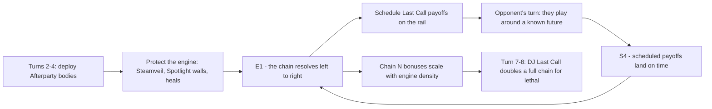

# Faction 07 — Afterparty Crew

> Part of the HYPEBOUND faction identity series (`docs/design/factions/`).
> Canon: [core rules](../00-core-rules.md) §6 (keywords), §7 (factions), §8 (Currents).
> Turn-step canon: [gameplay loop & match flow](../02-gameplay-loop-and-match-flow.md) §3.3 (S1–S4, E1–E4) and §5.2 (binding speed bands).
> Overview table: [faction guide](../04-faction-guide.md). Card data home: `data/cards/afterparty-crew.json`.
> Siblings: [Neon Idols](./01-neon-idols.md) · [Gothic Royalty](./02-gothic-royalty.md) · [Viral Influencers](./03-viral-influencers.md) · [Digital Demons](./05-digital-demons.md) · [Cosplay Champions](./06-cosplay-champions.md) · [Touch-Grass Order](./08-touch-grass-order.md)

**Currents: Cinder (primary identity) / Tide** · **Playstyle: Afterparty end-of-turn engines, delayed payoffs, planned futures**

---

## 1. Fantasy & Tone

The Afterparty Crew is what is left after the convention closes: six people,
one hotel room, a karaoke machine somebody definitely was not supposed to
remove from the vendor hall, and a group chat that has not stopped since
Thursday. They are the friend group at 3 A.M. — the hour when the day's
performances are over, everyone is out of character, and the conversation
swings from a screaming argument about tier lists to a genuinely moving
confession and back within ninety seconds.

Their satire target is the *social afterimage* of online life: the plans made
at 3 A.M. that were never going to survive contact with 9 A.M., the
"we should do this every year" said with total sincerity by people who will
not see each other for eleven months, the friend who orders food for the whole
room and refuses reimbursement, and the specific horror of a group photo taken
under convenience-store fluorescents. The comedy is warm. Nobody here is a
villain; they are just extremely tired and extremely committed.

Every character is an original archetype — the one who never sleeps, the one
who holds everyone's badge, the one who starts fires (thematically and
literally) — never a riff on a real person or real friend group.

Mechanically the fantasy is **the night pays you back later**: almost nothing
this faction does resolves on the turn you pay for it. You commit now, the
board changes hands, and *then* the plan lands — exactly as scheduled, exactly
where you said it would.

---

## 2. Visual Identity & Color Language

The Crew owns the "after hours" corner of the digital-nightlife palette: the
game's other factions perform under stage lights, and this one walks home
under streetlights. Wet asphalt, convenience-store fluorescents, a karaoke
screen glowing in a room where nobody has turned on the main light, and — at
the very edge of every board skin — a sunrise gradient that has not arrived
yet.

| Role | Color | Hex | Usage |
|---|---|---|---|
| Primary | Last-Call Amber | `#FF9E3D` | Faction emblem, Cinder VFX, board trim, Last Call rail chits |
| Secondary | Rainwet Teal | `#2FA7B0` | Tide VFX, puddle reflections, healing motifs |
| Accent | Karaoke Magenta | `#FF4FA3` | Lyric highlights, screen glow, scheduled-effect countdown numerals |
| Support | Streetlight Sodium | `#FFE7B0` | Text plates, lamp bloom, warm haze over dark plates |
| Base | Four A.M. Navy | `#0A1018` | Backgrounds, wet asphalt, pre-dawn sky |

- **Motifs:** karaoke lyric bars with a bouncing marker, convenience-store
  fluorescent tubes with one dying element, a whiteboard labelled "THE PLAN"
  covered in arrows, group-chat notification stacks timestamped 03:47, hotel
  hallway carpet, cold fries, taxi meters, string lights taped to a wall.
- **VFX language:** end-of-turn **Afterparty** resolution plays as a string of
  hanging lights igniting **left→right across your board**, one bulb per
  trigger, matching the canonical trigger order (loop doc §3.4) — the animation
  *is* the trigger-order display. A **Last Call** schedule drops a glowing
  paper chit onto the Last Call rail with a countdown numeral stamped on it.
  **Steamveil** activation vents a slow curtain of steam from a manhole.
- **Card frames** follow the Current, per canon §8.2: Cinder cards use the
  sharp flame-notched frame with ember glow; Tide cards use the rounded
  wave-edge frame with liquid sheen. Faction identity lives in art, emblem, and
  board skin — never in frame shape and never in color alone. The faction badge
  is a crescent moon crossed by a handheld microphone, always paired with a
  text label.
- **Audio:** slow city-pop over a constant room-tone hum (fridge, air
  conditioner, distant traffic). Each queued Afterparty trigger adds one
  instrument layer to the end-of-turn sting; a resolving Last Call plays a
  single warm sunrise chord (`music.battle.afterparty-crew` in
  `data/audio-manifest.json`).

---

## 3. Currents: Cinder / Tide

| Current | Why it fits |
|---|---|
| **Cinder** (fire — ambition, performance, destructive creativity) | The bad decisions. Karaoke is a performance; so is the argument about the tier list; so is whatever happened to the hotel smoke detector. **Scorched** is the hangover made mechanical — damage that arrives after the fun is over, which is this faction's entire thesis. |
| **Tide** (water — memory, adaptation, repetition) | The deep talk. Tide is remembering everything anyone said, having the same conversation every year, and looping back for one more round. **Flow** triggers on healing, replaying, and returning — the crew looking after each other until sunrise. |

**Advantage cycle notes (canon §8.4):** Cinder deals +1 to Gale, so our Cinder
half punishes Viral Influencers, Meme Collective, and Touch-Grass Order's Gale
side. Tide deals +1 to Cinder, so our Tide half punishes Digital Demons and
the Cinder halves of Viral Influencers — *and our own Cinder cards*, which is
why Afterparty mirrors are decided by whoever built more Tide. We take +1 from
Pulse (Neon Idols' Pulse side, Algorithm Syndicate) on every Tide body, which
is the faction's worst structural matchup axis.

**Confluence note — the faction's biggest structural asset.** Cinder + Tide is
a *defined* pair: **Steamveil** (canon §8.5) — *"Choose a friendly character:
it cannot be targeted by enemy Actions until your next turn."* The Afterparty
Crew is the only faction whose native Confluence directly answers its own
canon-listed weakness: it shields exactly one telegraphed engine piece for
exactly the window between paying and collecting. Note the precise scope —
Steamveil blocks enemy **Actions** only; attacks, Fixations, and other
abilities still get through. That gap is deliberate and is the reason the
weakness survives.

Pure Cinder or pure Tide lists trade Steamveil away for **Perfect Resonance**
(per-Current bonus in `data/currents.json`; see
[Currents & lore](../06-currents-and-lore.md)). Dual lists may still splash up
to 3 Prism cards (canon §8.6) for situational **Refraction**, though the Crew
rarely wants them: Prism cards pay a cost tax, and this faction is already
paying a tempo tax on every card it plays.

---

## 4. Gameplay Strategy

The Afterparty Crew is the game's **deferred-tempo engine** faction. Every card
is priced as though its effect happened immediately, but the effect happens
one trigger window — or several turns — later. The whole faction is a bet that
you can survive the gap you just opened.

Two engines run in parallel:

1. **The chain** — a board of characters with **Afterparty** triggers that all
   resolve at step **E1**, in board order left→right, before Scorched and
   before Grow. Each body is individually unimpressive; four of them resolving
   in sequence is 4–8 damage and healing that the opponent cannot respond to,
   because there is no priority window they can hold.
2. **The schedule** — **Last Call (N)** effects parked on the Last Call rail,
   resolving at step **S4** of your turn N turns from now. Once scheduled they
   are off-board and cannot be removed, only played around.



| Strengths | Weaknesses |
|---|---|
| Highest uninterruptible per-turn reach once 3+ engine pieces stick | Every plan is public: the Last Call rail shows label, owner, and exact turn |
| Scheduled payoffs survive removal, **Cancelled**, and board wipes entirely | Pays full price now for value later — always behind on raw tempo |
| Native **Steamveil** Confluence protects the one piece that matters | Steamveil stops Actions only; attacks and Fixations still kill the engine |
| Deterministic math: skilled pilots compute lethal two turns out | The opponent's *entire turn* sits between our investment and our payoff |
| Cinder reach + Tide sustain = both a clock and a life total | **Cancelled** on an engine body before end of turn deletes that turn's payoff |
| Cinder +1 into Gale decks; Tide +1 into Cinder decks | Takes +1 from Pulse on every Tide body |

### 4.1 Strengths in detail

- **The chain cannot be responded to.** HYPEBOUND has no manual interrupts
  (loop doc §3.4); the non-active player only interacts through pre-set
  Reactions. Afterparty damage at E1 therefore arrives with certainty, which
  makes the faction the most reliable *reach* in the game — 1 damage per body
  per turn, forever, with no card spent.
- **Scheduling launders value past removal.** A **Last Call** effect lives in
  the delayed queue, not on the board. Killing the source, **Cancelled**,
  **Touch Grass**, board wipes, and Location destruction all do nothing to it.
  This is the intended compensation for the faction's telegraph weakness:
  slow, public, and *inevitable*.
- **Density scaling.** **Chain (N)** riders mean the fourth Afterparty body is
  worth more than the first, so opponents cannot triage — ignoring the small
  bodies is how the small bodies kill them.
- **Best-in-class information game.** Because both engines resolve at fixed,
  visible steps, an Afterparty pilot can state the exact board state two turns
  out and build toward it. The faction rewards planning rather than reading.
- **Steamveil on demand.** Playing one Cinder card and one Tide card is the
  faction's natural curve, so the Confluence is available nearly every turn
  from turn 3 onward.

### 4.2 Weaknesses in detail

- **Telegraphed by construction.** Canon requires the delayed queue to be
  visible (`delayedScheduled` / `delayedTriggered` engine events are public).
  An opponent facing "Sunrise 2/3 — 3 damage, your turn 9" simply plays around
  the number: they hold a heal, add Armor, or set lethal a turn earlier.
- **Timing disruption is a full refund.** Every removal spell the opponent
  casts on *their* turn is worth more against us than against anyone else,
  because it deletes a payoff we already paid for. **Cancelled** is the single
  worst status this faction can face — a Cancelled body still occupies a slot,
  still cost Hype, and contributes nothing at E1.
- **Banish beats us on timing, not on stats.** **Touch Grass** removes a body
  "until the start of your next turn" — precisely spanning our E1. The
  character comes back fine; the trigger is simply gone.
- **Under-statted bodies.** Afterparty triggers are priced into statlines, so
  the Crew loses fair trades on curve to Cosplay Champions carries, Corporate
  Creators walls, and anything Empowered.
- **Vulnerable to speed.** Against the 6–7 turn kill bands (Viral Influencers
  flood, Digital Demons all-in burn) a turn-9 payoff is an obituary. The Crew
  must spend Tide cards on survival, which slows its own clock.
- **AoE lands in the gap.** A board wipe on the opponent's turn removes the
  chain after we built it and before it fires. The chain is rebuilt from
  scratch; the opponent spent one card.

---

## 5. Obsession Profile

The Crew gains Obsession at a steady, unremarkable rate: healing and buffing a
friendly character is *support* (+1 the first time each turn, canon §3.2) and
the faction heals constantly on its Tide side, plus **Parasocial** bodies like
Chatstorm Piper. Expect a Fixation roughly every second turn from turn 4.

What is unusual is the **risk curve**. Both Ultimate Fixations pay out in the
future, so the Crew banks Obsession rather than dumping it — and banking means
sitting at 8+ **Obsessed** (+1 damage taken from all enemy sources) during
precisely the turns when the plan requires us to survive two more turns.
Touch-Grass Order punishes this harder than anyone.

One deliberate upside: because Last Call effects are **already scheduled**,
riding the meter to 10 for a free **Full Fixation** cast is unusually safe for
this faction. The end-of-turn reset to 5 (canon §3.2) does not touch anything
on the Last Call rail — the payoff is locked in before the meter drops.

---

## 6. Signature Mechanics

**Canonical keywords used heavily:** **Afterparty** (the faction's defining
keyword — *triggers at the end of your turn while this is in play*), **Flow**,
**Scorched**, **Parasocial**, **Spotlight**, **Grow X** (defensively, on
walls), plus set **Reaction** cards, which are the faction's only way to act
during the opponent's turn.

Two faction-specific mechanics are added. Both are templated phrases composed
from existing DSL opcodes — the validator treats them as ordinary effects and
printing more of them requires zero engine changes.

### 6.1 Faction mechanic — Last Call (N)

> **Last Call (N)** — *This effect resolves at the start of your turn, N turns
> from now. Both players can see it.*

Composes from the canonical `scheduleDelayed` op (`delayTurns`, `label`,
`ops`). Resolution happens in start-of-turn step **S4**, alongside timed
statuses, Comeback timers, and Banish returns (loop doc §3.3).

```jsonc
// One More Song (excerpt)
{ "trigger": "onPlay",
  "ops": [ { "op": "scheduleDelayed", "delayTurns": 1, "label": "One More Song: 2 to enemy leader",
             "ops": [ { "op": "damage",
                        "target": { "select": "leader", "side": "enemy" },
                        "amount": 2 } ] } ] }
```

**Binding rulings (design decisions; consistent across every Last Call card):**

| # | Ruling | Reason |
|---|---|---|
| 1 | **No player-chosen targets inside a Last Call.** Legal selectors are `self`, `leader`, `all`, `random`, and count-based selection. | The engine must resolve S4 without opening an input prompt; keeps replays deterministic and stops "surprise" targeting. |
| 2 | **Source-independent.** A scheduled effect resolves even if its source has left play, been **Cancelled**, **Banished**, or destroyed. | Matches `DelayedEffect` in `types.ts`, which stores `ops` + `sourceCardId` with no live link. This is the faction's compensation for being telegraphed. |
| 3 | **Fully visible.** The Last Call rail shows every pending effect for **both** players: owner, label, and the absolute turn it fires. | Canon readability principle; `delayedScheduled` / `delayedTriggered` are public engine events. |
| 4 | **Resolution order is FIFO by scheduling time**, then by seat (active player first) if two land on the same step. | Determinism requirement (architecture contract §3). |
| 5 | **Design cap: N ≤ 3.** Most cards use 1; Epics and Ultimates use 2–3. | Readability, and it keeps the Finale clock the slowest thing in the deck. |

### 6.2 Faction mechanic — Chain (N)

> **Chain (N)** — *Bonus effect if you control N or more other characters with
> **Afterparty**.*

Composes from the canonical `if` op with a `controlsAtLeast` condition over a
keyword-filtered selector. This is the engine-density dial: it is what makes
the fourth cheap body matter and forces the opponent to answer the whole
board, not just the biggest threat.

```jsonc
// Bad Idea Committee (excerpt)
{ "trigger": "afterparty",
  "ops": [
    { "op": "damage",
      "target": { "select": "random", "side": "enemy", "zone": "board" },
      "amount": 2 },
    { "op": "if",
      "condition": { "kind": "controlsAtLeast",
                     "target": { "select": "all", "side": "friendly", "zone": "board",
                                 "filter": { "hasKeyword": "afterparty", "excludeSelf": true } },
                     "min": 2 },
      "then": [ { "op": "damage",
                  "target": { "select": "leader", "side": "enemy" },
                  "amount": 2 } ] } ] }
```

**Chain is not Collab.** **Collab (X)** (canon §6) checks whether you control
another character sharing a *Current, faction, or tag* — a tribal check.
**Chain (N)** counts *engine density* by keyword and requires a threshold. The
two never appear on the same card. Design cap: **N ≤ 3**.

---

## 7. Leaders

Both leaders have 30 Health (canon default). Fixation costs 3 Obsession, once
per turn; Ultimate Fixation costs 7 Obsession, once per match.

### 7.1 DJ Last Call

| Field | Value |
|---|---|
| Id | `after-leader-dj-last-call` (`data/cards/leaders.json`) |
| Title | *The One Who Decides When It's Over* |
| Currents | **Primary: Cinder · Secondary: Tide** (leader card is Cinder) — enables **Steamveil** |
| Health | 30 |
| Passive — *Set List* | When you activate a Confluence, your leader gains **Armor 1**. |
| Fixation (3 Obsession, once per turn) — *One Last Request* | Deal 1 damage to a character. |
| Ultimate Fixation (7 Obsession, once per match) — *Encore Set* | This turn, your **Afterparty** triggers resolve twice. |

**Personality:** owns the aux cord and considers this a form of governance.
Has ended four consecutive years of the same afterparty by playing the same
closing song, and has never once been asked to. Speaks entirely in set-list
metaphors; refers to the opposing leader as "our next act." Sincerely believes
the night ends when the last person leaves, and has therefore not slept since
Thursday.

**Play pattern:** *Set List* rewards the faction's natural Cinder-then-Tide
curve with a point of Armor almost every turn, which is exactly the chip
mitigation a deferred-tempo deck needs to survive the gap. *One Last Request*
is deliberately plain — it is the faction's only repeatable removal ping, and
it exists to finish off a body the chain left at 1 Health. *Encore Set* is the
faction's designated kill turn: with four Afterparty bodies on board it
converts a 4-damage end step into 8, and it is the reason opponents must
answer the chain instead of racing it.

**Text is reproduced verbatim** from the worked example in
[gameplay loop & match flow](../02-gameplay-loop-and-match-flow.md) §4.1, which
computes exact numbers against this leader. See §11 for the two engine
capabilities his passive and ultimate require.

### 7.2 Half-Four Mari

| Field | Value |
|---|---|
| Id | `after-leader-half-four-mari` |
| Title | *The Last One Awake* |
| Currents | **Primary: Tide · Secondary: Cinder** (leader card is Tide) — the mirror of DJ Last Call's priority; keeps **Steamveil** available, and pure-Tide lists built under her still qualify for Perfect Resonance |
| Health | 30 |
| Passive — *Hold My Drink* | The first time each turn a friendly character is healed, it gains **Warded** until your next turn. |
| Fixation (3 Obsession, once per turn) — *Keep The Tab Open* | **Last Call (1):** Deal 2 damage to the enemy leader. |
| Ultimate Fixation (7 Obsession, once per match) — *The Sun Is Coming Up* | At the start of each of your next 3 turns, if you control a character with **Afterparty**, deal 3 damage to the enemy leader and restore 2 Health to your leader. |

**Personality:** named for the hour she is most reliably found awake. Holds
everyone's badges, phones, and secrets; has never lost any of the three.
Conducts the 3 A.M. deep talk with the calm of a night-shift dispatcher and
remembers, verbatim, something you said at a convention four years ago that
you were hoping had gone unnoticed. Does not drink, does not sleep, does not
leave.

**Play pattern:** *Hold My Drink* patches the faction's timing weakness on a
strict once-per-turn budget — **Warded** blocks enemy Actions *and* abilities
(strictly better than Steamveil's Actions-only scope), but it never stops an
attack, so the engine can still be traded off in combat. Because healing is
also *support*, the passive fires on the same card that pays +1 Obsession,
making her the faction's Obsession accelerator. Her Fixation is a recurring
2-damage clock that cannot be removed once paid; her Ultimate is 9 damage and
6 healing spread over three turns, gated on keeping at least one Afterparty
body alive — the opponent's counterplay is written into the ability itself.

---

## 8. Deck Archetypes

Expected win turns follow the binding speed bands in
[gameplay loop & match flow](../02-gameplay-loop-and-match-flow.md) §5.2
("lethal turn" = per-player turn against a non-interacting opponent; real
matches add 1–2 turns).

### 8.1 Closing Time (dual Cinder/Tide · DJ Last Call)

- **Speed band:** Aggro-tempo. **Expected lethal turn 7–8** (13–16 total turns,
  6–8 minutes) — the canonical "Afterparty Crew burn engine" entry in §5.2.
- **Game plan:** curve out Afterparty bodies on turns 2–4 (Chatstorm Piper,
  Afterhours Firebreather), never trade them off, and let E1 supply 2–4
  unavoidable damage every turn while attacks contest the board. Steamveil
  protects whichever body the opponent's removal is aimed at. Schedule *One
  More Song* on the turns you have a spare (1) Hype, so the final two turns
  arrive pre-loaded. *Encore Set* on turn 7–8 doubles a 4-trigger chain for the
  kill.
- **Key cards:** Afterhours Firebreather, Chatstorm Piper, One More Song, Who
  Invited You?, Bad Idea Committee, Neon Nightcap.
- **Matchups:** favored into Gale decks (Cinder +1 versus Viral Influencers,
  Meme Collective, Touch-Grass Order's Gale half) and into slow value decks
  that cannot remove four bodies before an end step — Corporate Creators before
  turn 6 and Algorithm Syndicate are both too slow to interrupt the chain.
  Unfavored into Neon Idols (Pulse +1 on every Tide body, plus *Drop the Amp*
  clearing the chain wholesale), into Digital Demons board wipes, and into any
  deck with repeatable **Cancelled**.

### 8.2 Running a Tab (pure Tide · Half-Four Mari)

- **Speed band:** Midrange. **Expected lethal turn 9–10** (15–19 total turns,
  7–9.5 minutes).
- **Game plan:** a pure-Tide list — legal under a dual-Current leader, canon
  §8.6 — that gives up Steamveil for **Perfect Resonance (Tide)** after 7 Tide
  cards. Durable, healing-backed bodies
  (Bouncer of the Vibe walls, Spotlight blockers) buy time while two or three
  Last Call effects stack on the rail simultaneously; Mari's Fixation adds a
  fresh 2-damage schedule almost every turn. The deck does not kill you — it
  informs you, several turns in advance, exactly how you die, and then does
  that. *Hold My Drink* makes the healing double as protection.
- **Key cards:** Chatstorm Piper, Bouncer of the Vibe, Neon Nightcap, The
  3 A.M. Diner, neutral Tide sustain.
- **Matchups:** favored into Digital Demons and Viral Influencers' Cinder half
  (Tide +1 across the board) and into midrange decks that must commit bodies to
  win. Unfavored into Algorithm Syndicate and Neon Idols (Pulse +1 into us,
  and Syndicate's foresight blunts the information advantage that is our whole
  edge), and into Touch-Grass Order, whose Banish is a hard answer to E1
  presence and whose punish cards key off our banked Obsession.

### 8.3 The Long Night (dual Cinder/Tide · Half-Four Mari)

- **Speed band:** Control / Finale. **Expected win turn 11–13** (19–23 total
  turns, 8.5–11.5 minutes); Dawnrise typically reveals on turn 6–8 and
  completes four turns later.
- **Game plan:** survive to sunrise. A wide, cheap, individually irrelevant
  board of Afterparty bodies is kept alive by heals, Spotlight walls, set
  Reactions, and Steamveil; **Dawnrise, the Uninvited Guest** converts that
  persistence into an alternate win. Mari's Ultimate is the backup clock if
  Dawnrise is answered — the deck deliberately runs two win conditions that
  need the same board, so removal spent on one advances the other.
- **Key cards:** Dawnrise the Uninvited Guest, The 3 A.M. Diner, Bouncer of the
  Vibe, Neon Nightcap, Who Invited You?, Afterhours Firebreather.
- **Matchups:** favored into decks that must commit to the board and lack a
  sweeper (Cosplay Champions single-carry lists, Corporate Creators ramp).
  Unfavored into Gothic Royalty attrition (they out-value a durdle plan and
  their removal is a resource for them), into hard sweepers, and into
  Touch-Grass Order, which answers Dawnrise with Banish and answers the crew
  with everything else.

---

## 9. Example Cards

Tags in play: `crew`, `nightlife`, `last-call`. Reminder text appears on
Common/Rare only, per canon §6 templating. Character stats are Attack/Health;
Locations show Durability.

Chatstorm Piper, Bouncer of the Vibe, Afterhours Firebreather, and Neon
Nightcap are the faction's sample cards from
[gameplay loop & match flow](../02-gameplay-loop-and-match-flow.md) §4.1 and
are reproduced with identical cost, Current, rarity, stats, and effect.

| Name | Cost | Type | Current | Rarity | Stats | Rules text |
|---|---|---|---|---|---|---|
| One More Song | 1 | Action | Cinder | Common | — | **Last Call (1):** Deal 2 damage to the enemy leader. *(Last Call (1) — this effect resolves at the start of your next turn. Both players can see it.)* |
| Chatstorm Piper | 2 | Character | Tide | Rare | 3/4 | **Parasocial** *(When you target this friendly character with a card or ability, it gains +1/+1 and you gain 1 Obsession.)* |
| Neon Nightcap | 2 | Action | Tide | Common | — | Restore 3 Health to a friendly character. |
| Who Invited You? | 2 | Reaction | Cinder | Rare | — | When the enemy plays a Character costing (4) or more, deal 3 damage to it and apply **Scorched** to it. *(Scorched — takes 1 damage at end of its controller's turn.)* |
| Afterhours Firebreather | 3 | Character | Cinder | Common | 3/3 | **Afterparty:** Deal 1 damage to the enemy leader. *(Afterparty — triggers at the end of your turn while this is in play.)* |
| Bouncer of the Vibe | 3 | Character | Tide | Common | 2/5 | **Grow 3:** +2/+2. *(After surviving 3 of your turn-ends in play, gains the upgrade permanently.)* |
| The 3 A.M. Diner | 4 | Location | Tide | Epic | Dur. 3 | **Afterparty:** Restore 1 Health to all friendly characters. Activate (once per turn): **Last Call (1):** Draw a card. |
| Bad Idea Committee | 5 | Character | Cinder | Epic | 4/4 | **Afterparty:** Deal 2 damage to a random enemy character. **Chain (2):** Also deal 2 damage to the enemy leader. |

**Flavor lines (excerpt):**

- *One More Song* — "It is 4:12 A.M. and somebody has queued a nine-minute ballad."
- *Who Invited You?* — "Nobody knows him. Everybody has a photo with him."
- *The 3 A.M. Diner* — "Six people. One booth. Eleven refills. Zero decisions."
- *Bad Idea Committee* — "Motion carried, unanimously, by people who will deny it tomorrow."

**Balance watch — Chatstorm Piper.** At (2) for 3/4 with **Parasocial**, Piper
sits above the 2-drop curve used by the sibling factions (Cosplay Champions'
Hall Runway Rookie is 2/2; Gothic Royalty's Ossuary Choirboy is 1/3). The
statline is printed unchanged because the annotated turn in the gameplay-loop
doc computes exact damage from it. Flagged for the first tuning pass; the
likely correction is **2/4**, which does not disturb that example's lethality
math on the defending Popup Impling.

---

## 10. Finale Legendary — Dawnrise, the Uninvited Guest

The Crew's alternate win: the night does not end because you won an argument.
It ends because the sun comes up, and the sun was not invited.

| Field | Value |
|---|---|
| Name / Id | Dawnrise, the Uninvited Guest · `after-dawnrise-uninvited-guest` |
| Cost / Type / Current / Rarity | 6 · Character · Cinder · Legendary (max 1 copy) |
| Stats | 2/7 |
| Rules text | **Finale:** At the end of your turn, if you control 3 or more other characters with **Afterparty**, this gains a Sunrise counter. At 4 Sunrise counters, you win the match. |
| Flavor | *Nobody asked her to come up. She comes up anyway.* |

**Canon compliance (core rules §2, victory):**

- **(a) Visible progression:** Sunrise counters render as a filling horizon bar
  along the card's lower frame; the opponent's HUD announces "Finale: 3/4" on
  every gain, and the Last Call rail shows Dawnrise's next check.
- **(b) At least 2 turns from reveal to trigger:** at most 1 counter per turn,
  gained only at end of turn — a minimum of **4 turns** from reveal to victory,
  and only on turns where the board condition is already met.
- **(c) Interactable, on three independent axes:**
  1. **Kill the sun.** Dawnrise is an attackable 2/7 with no evasion, no
     Spotlight of her own, and no protection built in.
  2. **Break up the party.** The condition needs **3 other** Afterparty
     characters at end of turn. Any removal, sweeper, **Touch Grass**, or
     **Cancelled** applied to the *supporting cast* stops the counter that
     turn without touching Dawnrise at all — this is the primary counterplay
     and it uses cards the opponent already runs.
  3. **Blank the text.** **Cancelled** on Dawnrise freezes progression;
     **Touch Grass** / **Banished** removes her and clears her counters (shared
     Finale ruling across all factions: Banished characters return with base
     stats and no statuses).

Finale progress is evaluated in the end-of-turn state-check step **E4**, after
Afterparty triggers (E1), Scorched damage (E2), and Grow ticks (E3) — so a
supporting body that dies to its own Scorched at E2 does **not** count toward
that turn's check, and an Afterparty heal at E1 that saves one **does**.

Dawnrise is deliberately in tension with the faction's own aggro plan: holding
four bodies back to satisfy her condition is four bodies not attacking. She
turns board persistence — something the Crew already wants — into a second win
axis, without ever letting the player stop caring about the board.

---

## 11. Implementation Notes

Data home: `data/cards/afterparty-crew.json` (cards + both leaders + any
faction tokens). Everything below composes from `src/engine/types.ts` unless
marked as a required capability.

| Item | Implementation |
|---|---|
| **Last Call (N)** | `scheduleDelayed` with `delayTurns: N` and a human-readable `label`; resolves at S4. Validator rule: reject any `scheduleDelayed` whose nested ops contain `select: "choose"` (ruling 6.1 #1). |
| **Chain (N)** | `if` + `controlsAtLeast` over `{ side: "friendly", zone: "board", filter: { hasKeyword: "afterparty", excludeSelf: true } }`. |
| **Afterparty chain order** | Existing canonical trigger order (loop doc §3.4): leader passive → characters left→right → Location → Reactions → Event → hand. The Diner's Afterparty therefore resolves *after* every character's. |
| **Dawnrise counters** | `finale: true` on the card def; counter storage and the win check use the same Finale mechanism as the sibling factions' Finale legendaries. |
| **Who Invited You?** | `trigger: "reaction"`, `reactionOn: "enemyPlaysCharacter"`, plus a cost filter — see the capability note below. |
| **Steamveil** | Already canonical (`data/confluences.json`); no faction-specific work. |
| **Mari — *Hold My Drink*** | `trigger: "flow"` on the leader passive, ops applied to `{ select: "triggering" }` restricted to `zone: "board"` (so a card *returned to hand* by Flow is skipped), `applyStatus` → `warded`, `durationTurns: 1`. |
| **Mari — *Keep The Tab Open* / *The Sun Is Coming Up*** | `LeaderAbility.ops` = one `scheduleDelayed` (Fixation) / three `scheduleDelayed` ops at `delayTurns` 1, 2, 3, each wrapping an `if` + `controlsAtLeast` gate (Ultimate). Fully expressible today. |

**Engine capabilities required by DJ Last Call (reported, not assumed):**

1. **A confluence-activation trigger.** *Set List* needs "when you activate a
   Confluence". `TriggerId` has no such member; the mirrored
   `ReactionConditionId` `"enemyActivatesConfluence"` exists, so the trigger
   side is a gap. Suggested addition: `onConfluenceActivated`.
   *Expressible fallback if declined:* "**Afterparty:** if you played both a
   Cinder card and a Tide card this turn, your leader gains **Armor 1**"
   (`trigger: "afterparty"` + `and[currentPlayedThisTurn cinder,
   currentPlayedThisTurn tide]` + `applyStatus armor 1` on the friendly
   leader).
2. **An Afterparty-repeat flag.** *Encore Set* needs "this turn, your
   Afterparty triggers resolve twice". There is no op and no `PlayerState`
   field for it; the closest precedent is `PlayerState.refractionCurrent`,
   which the engine handles as state rather than as an op. This capability is
   **already required elsewhere**: the roguelike boss *DJ Last Call*
   (`09-game-modes.md`, "*Encore Set:* all Afterparty triggers trigger twice")
   and the weekly rule modifier in `03-screens-and-navigation.md` ("all
   Afterparty triggers fire twice"). Suggested addition: a per-seat
   `afterpartyRepeatThisTurn: number` on `PlayerState` plus a matching
   `balanceOverrides` key for the global modifier.
   *Expressible fallback if declined:* "Deal 1 damage to the enemy leader for
   each friendly character with **Afterparty**, then restore that much Health
   to your leader" (`damage` / `heal` with `amount: { kind: "count", … }`).
3. **Per-turn effect gating.** "The first time each turn …" is used by
   *Hold My Drink* here and by leader passives in factions 01, 03, and 06.
   `EffectDef.once` is per *game*, per instance. Suggested addition:
   `oncePerTurn?: boolean` on `EffectDef`.
4. **Cost-filtered Reactions.** *Who Invited You?* (and the pre-existing
   Digital Demons Reaction *Forced Update* in the gameplay-loop doc) filter on
   the played card's cost. `EffectDef.playedFilter` is documented as
   `onCardPlayed`-only. Suggested clarification: allow `playedFilter` on
   `trigger: "reaction"` for the `enemyPlaysCharacter` / `enemyPlaysAction`
   conditions.

**UI requirement — the Last Call rail.** The battle HUD needs a persistent,
public queue widget listing every pending delayed effect for both seats:
owner, label, and firing turn, sorted by firing turn. It is fed entirely by
`delayedScheduled` / `delayedTriggered` engine events and sits alongside the
existing trigger-order display. Without it the faction's canon-mandated
"telegraphed" weakness does not exist, and its counterplay is unreadable.
