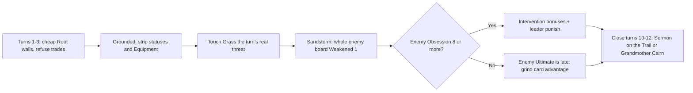

# Faction 08 — Touch-Grass Order

> Part of the HYPEBOUND faction identity series (`docs/design/factions/`).
> Canon: [core rules](../00-core-rules.md) §6 (keywords), §7 (factions), §8 (Currents).
> Overview table: [faction guide](../04-faction-guide.md). Card data home: `data/cards/touch-grass-order.json`.
> Siblings: [Cosplay Champions](./06-cosplay-champions.md) · [Afterparty Crew](./07-afterparty-crew.md) · [Algorithm Syndicate](./09-algorithm-syndicate.md) · [Meme Collective](./10-meme-collective.md)

**Currents: Root (primary identity) / Gale** · **Playstyle: answers, Banish, anti-combo, punishing the Obsessed**

---

## 1. Fantasy & Tone

The Touch-Grass Order are hiking-club paladins and digital-detox monks: a
volunteer trail association that became a knightly order somewhere around the
third consecutive weekend of scheduled group activity. They maintain the paths,
line the pitches, refill the water station, and — with enormous, unbearable
patience — remove your phone from your hands. Their satire target is the
*wellness intervention*: the friend who suggests a walk, the retreat that
confiscates your devices at the door, the relative who says "in my day we went
outside" and is, infuriatingly, correct.

The tone is sincere, sunlit, and completely humourless about fresh air. Nobody
in the Order is angry with you. They are *concerned*, which is worse. A monk
will apologise while banishing your virtual idol into a meadow. A rec-league
coach will treat your seven-piece combo as a symptom. Every character is an
original archetype — the prioress of the long weekend, the whistle, the ranger
who has walked the same ridge for forty years — never a riff on a real person.

Mechanically the fantasy is **nothing you built is permanent**: the Order does
not kill your board, it *undoes* your board, and then asks whether you have
eaten today.

---

## 2. Visual Identity & Color Language

The Order is the game's deliberate visual contrast. Every other faction lives in
the digital-nightlife palette — glossy black, chrome, glass, emissive neon. The
Order lives in **2 p.m. on a Saturday**: parks, mountains, chalked sports
fields, real weather, and fabric that has been rained on.

| Role | Color | Hex | Usage |
|---|---|---|---|
| Primary | Meadow Green | `#4C8B3A` | Faction emblem, board turf, card-back accents |
| Secondary | Clear-Noon Blue | `#7FB8E0` | Sky, Gale VFX, weather layers, UI highlights |
| Accent | Trail Clay | `#B4623A` | Trail blazes, signage, path gravel, clay courts |
| Support | Canvas Cream | `#EFE6D2` | Tent canvas, text plates, laminated maps, chalk lines |
| Base | Loam Brown | `#2C2419` | Soil, backgrounds, negative space, routed-wood text |

- **Motifs:** painted trail blazes on rock, routed-wood park signage,
  orienteering compasses, chalk pitch lines, whistle lanyards, dented steel
  thermoses, folded camp chairs, laminated maps, pinecones, a plastic basket
  labelled PHONES.
- **VFX language (binding contrast rule):** the Order is the only faction whose
  effects use **no emissive glow**. Its visual vocabulary is *sunlight and
  particulate* — pollen, chalk dust, drifting seed, leaf litter, rain, gusting
  grass. **Touch Grass** plays as a shaft of daylight and a gust walking the
  character off the board; **Grounded** plays as buffs physically falling off
  the target (LEDs, glitter, foam, sponsor decals hitting the ground and
  dissolving into soil).
- **Lighting rule (binding):** the Touch-Grass battlefield is lit by a single
  **directional daylight key** with soft ambient bounce, not by emissive board
  props. No screen in Touch-Grass art is ever on: screens appear switched off,
  cracked, taped over, or being carried in a bucket.
- **Card frames** follow the Current, per canon §8.2: Root cards use the heavy
  hexagonal stone frame; Gale cards use the swept ribbon-cut asymmetric frame.
  Faction identity lives in art, emblem, and board skin — never in frame shape,
  and never in color alone. The faction badge is a two-rectangle **trail blaze**
  glyph with a text label.
- **Accessibility note:** because this palette is light where the rest of the
  game is dark, Touch-Grass text plates use **Loam Brown on Canvas Cream** (not
  cream on green) to hold the global contrast requirement, and the board skin
  ships with a high-contrast variant that darkens the turf value without
  changing hue.
- **Audio:** the only faction theme with no synthesizer — acoustic guitar, hand
  percussion, and field recordings (birdsong, wind across grass, a distant
  five-a-side game, one whistle). Slot `music.battle.touch-grass-order` in
  `data/audio-manifest.json`.

---

## 3. Currents: Root / Gale

| Current | Why it fits |
|---|---|
| **Root** (earth — stability, patience, legacy) | The trail itself. The Order is older than the platform and expects to outlast it. **Grow X** is what happens to anything left alone outdoors: it gets bigger and harder to move. |
| **Gale** (wind — freedom, speed, rumor) | Fresh air and weather. Gale is the Current that *carries things away* — the thematic home of Banish. **Rushwind** is the Order's discipline of doing more than one thing with a day. |

**Advantage cycle notes (canon §8.4):** Root deals +1 to Pulse (Algorithm
Syndicate, the Neon Idols' Pulse half) and takes +1 from Gale (Viral
Influencers, Meme Collective, and Touch-Grass mirrors). Gale deals +1 to Root
(Corporate Creators, Gothic Royalty's Root half) and takes +1 from Cinder (Viral
Influencers, Digital Demons, Afterparty Crew). The faction is therefore
elementally comfortable against engine/technology decks and elementally soft
against fire and speed — which is the same shape as its strategic profile.

**Mirror texture:** the Order's two Currents are *adjacent on the cycle* (Gale
beats Root), so in Touch-Grass mirrors the Gale-side aggressor holds a real
elemental edge over the Root-side wall. Mirror games are decided by who is
willing to be the one moving.

**Confluence note:** Root + Gale is a canonical pair — **Sandstorm**: *Enemy
characters get Weakened 1 until your next turn* (canon §8.5). The Order is one
of **six** factions whose two Currents form a native Confluence (with Corporate
Creators, Digital Demons, Afterparty Crew, Cosplay Champions, and Meme
Collective), and Sandstorm is the single best-fitting Confluence in the game for
its owner's plan: a free, once-per-turn, board-wide attack debuff for a faction
that wins by making combat unprofitable. Pure-Root and pure-Gale lists trade
Sandstorm for **Perfect Resonance** (per-Current bonus in `data/currents.json`;
see [Currents & lore](../06-currents-and-lore.md)).

---

## 4. Gameplay Strategy

The Order is the game's **pure control faction**. It has the deepest answer
suite and the shallowest threat suite: it does not out-tempo you, it makes your
tempo not count, and then it wins with two or three modest bodies and one late
payoff. Its cards are reactive by construction — which means its worst draws are
dead cards and its best draws are the exact card for the exact turn.



| Strengths | Weaknesses |
|---|---|
| The deepest answer suite in the game: buff removal, Equipment destruction, Banish, aura shutdown, Reaction-based combo denial | Lowest proactive pressure in the game (canon-listed): almost no reach, few **Raid** bodies, low Attack per Hype |
| **Touch Grass** erases investment *without a death* — it dodges `onDefeat` triggers, **Comeback**, resurrection, and death-payoff economies entirely | Banish is temporary; everything answered comes back, so a list that never builds a clock loses to Burnout |
| Native **Sandstorm** Confluence: a free board-wide Weakened 1 every single turn | Answer density means dead cards: **Grounded** is blank vs. decks with no buffs or Equipment; **Intervention** is blank vs. disciplined low-Obsession opponents |
| Highest average Health per Hype; Root walls survive the turn 5–7 aggro window | Slowest Obsession accrual in the game → Fixations arrive late and the Ultimate lands around turn 9–10 |
| The only faction that taxes the game's own risk dial — every **Intervention** card is live against decks that must push Obsession | Root takes +1 from Gale and Gale takes +1 from Cinder: soft to Viral Influencers, Meme Collective, Digital Demons, Afterparty Crew |
| Root +1 into Pulse blanks Algorithm Syndicate and Neon Idols' Pulse half | Must *earn* every win: no combo kill, no free inevitability outside a slow, interactable Finale |

---

## 5. Obsession Profile

The Order gains Obsession more slowly than any other faction, and this is a
deliberate joke with teeth. Their cards point at the *enemy* board — banishing,
stripping, debuffing — and none of that is **support** under canon §3.2, which
requires buffing, healing, shielding, or equipping a **friendly** character.
They carry almost no **Parasocial**. Both Leader Fixations also target enemies,
so they generate no Obsession either.

Expected cadence: 3 Obsession (first Fixation) around **turn 5–6**; 7 Obsession
(Ultimate) around **turn 9–10**, versus turn 5–8 for support-heavy factions.
The faction compensates with a small number of cards that grant Obsession
explicitly as a rider on detox effects — *Digital Detox* and *Trail Journal*
both read "…and gain 1 Obsession," which is the Order's running gag: you cannot
run an intervention without getting a little invested yourself.

**The Order is not immune to its own sermon.** At 8+ Obsession a Touch-Grass
player is **Obsessed** too, taking +1 damage from all enemy sources — on a
faction whose leader is often the last thing standing. Touch-Grass players
should treat 7 as a ceiling, spend the Ultimate, and stay in the safe band.
Deliberately riding to 10 for a free **Full Fixation** is a legitimate but
genuinely dangerous line, and unlike every other faction the Order gets nothing
extra for the risk.

---

## 6. Signature Mechanics

**Canonical keywords used heavily:** **Touch Grass** (the faction pillar),
**Grow X**, **Rushwind**, **Spotlight**, **Collab (X)**, plus the **Weakened X**,
**Banished**, and **Cancelled** statuses (canon §5.4) and the Reaction card type
as the anti-combo layer.

### 6.1 The pillar — Touch Grass

> **Touch Grass** — *Banish a character until the start of your next turn; it
> returns with base stats and no statuses or attachments.* (canon §6)

Touch Grass is the Order's identity and its most-printed effect. It composes
directly from the canonical `banish` op — no new machinery:

```jsonc
{ "trigger": "onPlay",
  "target": { "select": "choose", "side": "enemy", "zone": "board" },
  "ops": [ { "op": "banish", "target": { "select": "triggering" },
             "returnAtStartOfYourNextTurn": true } ] }
```

**Design rulings (decisions; canon is silent, nothing here contradicts it):**

| Question | Ruling |
|---|---|
| Is Banish a defeat? | **No.** No `onDefeat` fires, no **Comeback** is scheduled, the card never reaches the discard pile, and it does not count for death-payoff economies (Gothic Royalty's Mourners, Digital Demons' sacrifice payoffs). This is why the Order is the designated answer to recursion factions. |
| What is lost on return? | All statuses (positive and negative), all stat buffs (the character returns at `baseAttack`/`baseHealth`), its Equipment, added keywords, `growProgress`/`growComplete`, and Finale counters (shared Finale ruling across all faction docs). |
| Where does the Equipment go? | It is **destroyed** and goes to its owner's discard. Cosplay Champions' **Rewear** replaces destruction with a return to hand, so Rewear gear survives a Banish — a deliberate, documented counterplay line. |
| Summoning sickness on return? | **Yes.** The returning character's `enteredOnTurn` is set to the return turn, so it cannot attack that turn unless it has **Raid**. Banishing your *own* character to dodge removal therefore costs you its attack — the cost that keeps Touch Grass from being a free protection spell. |
| What if the owner's board is full when it returns? | It takes its original slot if free; otherwise the lowest-numbered free slot; if there is no free slot it goes to its owner's discard pile **without being defeated** (no `onDefeat`, no Comeback). Overextending into your own returning characters is a real decision. |
| Can it be targeted while Banished? | No. A Banished character is off-board (`PlayerState.banished`) and is not a legal target for anything. Enemy AoE, Cancelled, and buffs all miss it. |
| Does the enemy see it? | Yes — the redacted view exposes `banishedCount`, and the HUD shows a returning-character tray with the return turn. Banish is never hidden information. |

### 6.2 Faction mechanic — Grounded

> **Grounded** — *Remove all positive statuses from a character and destroy its
> Equipment.*

Grounded is the Order's cheap, partial answer: it takes away everything that was
*attached* without taking away what was *grown into* the statline.

```jsonc
{ "trigger": "onPlay",
  "target": { "select": "choose", "side": "enemy", "zone": "board" },
  "ops": [ { "op": "removeStatus", "target": { "select": "triggering" }, "polarity": "positive" },
           { "op": "destroyEquipment", "target": { "select": "triggering" } } ] }
```

**Ruling — the deliberate gap:** Grounded does **not** remove permanent +X/+X
buffs (those live in the character's `attack`/`health`, not in `statuses`) and
does **not** remove keywords (`removeKeyword` requires a named keyword, so "all
keywords" is not expressible and is intentionally not printed). Stripping a
character all the way back to base is **Touch Grass's** job, at a higher cost.
This layering is the faction's core cost curve: a 1-Hype partial answer and a
2-Hype total answer that only lasts a turn.

### 6.3 Faction mechanic — Intervention

> **Intervention** — *Bonus effect while your opponent is **Obsessed** (8 or
> more Obsession).*

Canon §3.2 states outright that "certain enemy cards (notably Touch-Grass Order)
gain bonus effects" against an Obsessed player. Intervention is the templated
form of that promise, and it composes from the canonical `if` op with the
canonical `obsessionAtLeast` condition:

```jsonc
{ "op": "if",
  "condition": { "kind": "obsessionAtLeast", "side": "enemy", "value": 8 },
  "then": [ { "op": "applyStatus", "target": { "select": "triggering" },
              "status": "weakened", "amount": 2, "durationTurns": 1 } ] }
```

The threshold is read from `balance.obsession.obsessedThreshold`, never
hardcoded. Intervention is printed as a *rider*, never as a card's whole
function, so an Intervention card is always castable — the bonus is the reward
for the opponent's own choices, not a requirement for the card to work.

### 6.4 The answer suite (what the Order answers, and with what)

| Enemy resource | The Order's answer | Canonical DSL |
|---|---|---|
| Permanent +X/+X buffs, **Grow** progress, Finale counters | **Touch Grass** | `banish` |
| Positive statuses (Shielded, Armor, Empowered, Warded, Lurking) | **Grounded** | `removeStatus` with `polarity: "positive"` |
| Equipment | **Grounded** | `destroyEquipment` |
| Locations, Events, and aura effects | *Signal Dead Zone* | `disableAuras` |
| **Trending** discounts and cheap combo chains | *No Phones at the Table* (Leader passive) | `aura` with `costDelta: 1` |
| Confluence and Fixation power spikes | *Lights Out at Ten* (Reaction) | `reaction` + `banish` + `removeObsession` |
| Engine characters mid-combo | *Cancelled* effects | `cancel` |
| Obsession ramp toward an Ultimate | Detox effects | `removeObsession` |
| Enemy attack math generally | **Sandstorm** Confluence | canonical `applyStatus` weakened |

**Ruling — cost resolution order (decision; fills a canon gap, required for the
Trending tax to function).** A card's playable cost is computed as:
(1) printed cost → (2) persistent `modifyCost` deltas on the instance →
(3) keyword discounts (**Trending**, **Viral** copy discount) with their own
stated minimums → (4) `aura` `costDelta` modifiers → (5) global floor of 0.
Aura taxes therefore apply *after* Trending's minimum-1 floor, which is exactly
the intent of an anti-trend faction. Cost **filters** (`costMax`/`costMin`) are
evaluated at stage (3), never against aura output, which makes cost-filtered
auras loop-free and deterministic. This ruling belongs in
`docs/design/05-keyword-glossary.md` when that document is written.

---

## 7. Leaders

### 7.1 Prioress Juniper Vale, Warden of the Long Weekend

| Field | Value |
|---|---|
| Id | `grass-leader-juniper-vale` (`data/cards/touch-grass-order.json`) |
| Currents | **Primary: Root · Secondary: Gale** (leader card is Root) |
| Health | 30 (canon default) |
| Passive — *Mandatory Rest Day* | At the start of your turn, if your opponent is **Obsessed**, deal 2 damage to the enemy leader and remove 2 Obsession from them. |
| Fixation (3 Obsession, once per turn) — *Confiscate the Phone* | Remove all positive statuses from an enemy character, destroy its Equipment, and apply **Weakened 1** to it until your next turn. |
| Ultimate Fixation (7 Obsession, once per match) — *Silent Retreat* | **Touch Grass** all enemy characters. Remove 3 Obsession from your opponent. |

**Personality:** runs a phone-free retreat that people arrive at voluntarily and
leave at a sprint. Speaks exclusively in the register of a laminated trailhead
sign: calm, imperative, faintly ominous. Has never raised her voice and has
never had to. Refers to the opposing leader's entire deck as "the situation."

**Play pattern.** *Mandatory Rest Day* is the faction's only source of
unprompted damage to the enemy leader, and the opponent grants it themselves:
it fires only while they sit at 8+, where the **Obsessed** rule already adds +1
from all enemy sources, so it lands for **3**. It then removes 2 Obsession,
usually dropping them out of the danger band — so it is self-limiting, not a
lock, and it punishes hoarding rather than punishing existing.

*Confiscate the Phone* is repeatable **Grounded** with a guaranteed rider so it
is never fully dead. *Silent Retreat* is a board *reset*, not a board *wipe*:
it kills nothing and draws nothing, but it clears the opponent's entire side for
their whole turn and returns every character stripped to base with no gear. It
is the single best answer in the game to Neon Idols buff stacks, Cosplay carries,
and any Finale counter — and because the Order reaches 7 Obsession around turn
9–10, it is a stabilising button, not a tempo play.

### 7.2 Coach Rhett Halloran, the Whistle

| Field | Value |
|---|---|
| Id | `grass-leader-rhett-halloran` |
| Currents | **Primary: Gale · no Secondary** (enables pure-Gale Perfect Resonance decks) |
| Health | 30 |
| Passive — *No Phones at the Table* | Enemy cards that cost (1) or less cost (1) more. |
| Fixation (3 Obsession, once per turn) — *Lap Around the Field* | **Touch Grass** a character that costs (4) or less. |
| Ultimate Fixation (7 Obsession, once per match) — *Mandatory Field Day* | Return all enemy characters that cost (4) or less to their owner's hand, then apply **Weakened 2** to all enemy characters until your next turn. |

**Personality:** a rec-league coach who was handed a sword by a passing monk and
treated it as new equipment to inventory. Whistle permanently around the neck,
clipboard permanently in hand, addresses everyone as "champ" including
opposing gods of the algorithm. Diagnoses every strategy in the game as a
hydration problem.

**Play pattern.** *No Phones at the Table* is the game's designated anti-combo
tax: it hits 0- and 1-cost cards, token payoffs, cheap **Viral** copies,
**Borrowed Clout**, and — via the §6.4 cost-order ruling — every **Trending**
card that has floored itself to (1). It does not stop anything; it makes every
long chain one card shorter.

*Lap Around the Field* is a repeatable Touch Grass with a cost ceiling, so it
freezes the enemy's engine pieces and early carries but cannot lock down their
6- and 7-drops. It may target friendly characters, which is a real line: banish
your own damaged wall to bring it back at full base Health, or dodge a Cancel.
*Mandatory Field Day* is a bounce, not a kill — it generates no card advantage,
buys one enormous turn against wide cheap boards, and is followed by a Weakened
2 that makes the rebuilt board useless for a turn on top.

---

## 8. Deck Archetypes

Expected win turns follow the binding balance targets in
[gameplay loop §5.2](../02-gameplay-loop-and-match-flow.md).

### 8.1 The Long Weekend (pure Root · Juniper Vale) — control

- **Game plan:** refuse everything. Cheap Root walls and **Grow** bodies hold
  turns 1–6, **Grounded** answers and heals hold turns 6–9, and the game is
  closed by *Sermon on the Trail* or a resolved *Grandmother Cairn*. Pure-Root
  construction unlocks **Perfect Resonance (Root)**. The deck runs no reach
  besides the Sermon and Juniper's passive, so the Obsession meter of the
  opponent is a resource this deck actively farms.
- **Key cards:** Trailhead Novice, Phone Basket, The Overlook, Mountain Warden,
  Digital Detox, Broken-In Boots, Sermon on the Trail, Grandmother Cairn.
- **Expected win turn:** **10–12** (control band; 19–23 total turns, 8.5–11.5
  min).
- **Matchups:** strongly favoured into anything that invests into single bodies
  — Cosplay Champions carries, Neon Idols buff stacks, Corporate Creators
  contract payoffs — and into Gothic Royalty, whose death-payoff economy is
  bypassed entirely by Banish. Unfavoured into Viral Influencers and Meme
  Collective (Gale +1 into our Root, and swarms present more targets than we
  have answers) and into Digital Demons burn, which never puts a buff on a body
  for us to strip and simply goes to the face.

### 8.2 Guided Hike (dual Root/Gale · Juniper Vale) — midrange tempo

- **Game plan:** the faction's flagship and the only Touch-Grass list with a
  real curve. Gale disruption on the play, Root bodies on the back foot, and
  **Sandstorm** activated on essentially every turn from turn 4 — a permanent
  board-wide Weakened 1 that turns every enemy attack into a bad trade. Banish
  the one threat that matters each turn and win the resulting combat math.
- **Key cards:** Brisk 5K, Ranger of the Long Trail, Broken-In Boots, Lights Out
  at Ten, Mountain Warden, Weather Front, The Overlook.
- **Expected win turn:** **8–10** (midrange band; this is the list the balance
  targets refer to as "Touch-Grass tempo (Root/Gale)").
- **Matchups:** the best deck in the faction against setup and combo decks —
  Afterparty Crew's telegraphed end-of-turn engines, Algorithm Syndicate's
  fragile draw engines, Neon Idols' Setlist combo turns — because Sandstorm plus
  a Banish blanks the payoff turn. Unfavoured into Viral Influencers' Follower
  Flood, where six cheap bodies outnumber our answer count, and into Cinder burn,
  which takes +1 against our Gale half and ignores the board entirely.

### 8.3 Airplane Mode (pure Gale · Coach Rhett Halloran) — disruption prison

- **Game plan:** tax, deny, repeat. *No Phones at the Table* makes every cheap
  chain worse, two set Reactions punish Confluences and Fixations, *Signal Dead
  Zone* blanks Locations, Events, and auras for a turn, and *Lap Around the
  Field* removes the best enemy engine piece from play every single turn. Wins
  with unglamorous 3/3 and 4/4 Gale bodies over many turns. Pure-Gale
  construction unlocks **Perfect Resonance (Gale)**.
- **Key cards:** Lights Out at Ten, Signal Dead Zone, Brisk 5K, Ranger of the
  Long Trail, Weather Front, Crosswind Sprinter.
- **Expected win turn:** **9–11** (straddles the midrange and control bands;
  18–22 total turns).
- **Matchups:** the hardest matchup in the game for dedicated combo — Neon Idols
  Setlist Encore, Cosplay Champions Masquerade Toolbox, Meme Collective escalation
  — and for any Location/Event/aura build. It is also the Touch-Grass mirror
  breaker, since Gale deals +1 into the Root walls of §8.1. Unfavoured into
  decks with no auras, no Confluence, no Fixation reliance and resilient
  mid-cost bodies (Gothic Royalty's Evergrown Regency simply ignores half our
  deck), and into Digital Demons and Viral Influencers, whose Cinder cards take
  +1 against everything we play.

---

## 9. Example Cards

Tags in play: `ranger`, `monk`, `trail`. Reminder text appears on Common/Rare
only, per canon §6 templating; Epic and Legendary omit it. Stats column:
Characters show Attack/Health; Locations show Durability.

| Name | Cost | Type | Current | Rarity | Stats | Rules text |
|---|---|---|---|---|---|---|
| Trailhead Novice | 1 | Character | Root | Common | 1/3 | **Grow 2:** +1/+2. *(After surviving 2 of your turn-ends in play, gains the upgrade permanently.)* |
| Phone Basket | 1 | Action | Root | Common | — | Remove all positive statuses from an enemy character and destroy its Equipment. **Intervention:** Also apply **Weakened 2** to it until your next turn. *(Intervention — bonus effect while your opponent is Obsessed: 8 or more Obsession. Weakened 2 — −2 Attack.)* |
| Brisk 5K | 2 | Action | Gale | Common | — | **Touch Grass** a character. *(Banish it until the start of your next turn; it returns with base stats and no statuses or attachments.)* |
| Lights Out at Ten | 2 | Reaction | Gale | Rare | — | **Reaction:** When your opponent activates a Confluence or uses a Fixation ability, **Touch Grass** a random enemy character and remove 2 Obsession from your opponent. *(Touch Grass — banish it until the start of your next turn; it returns with base stats and no statuses or attachments.)* |
| Ranger of the Long Trail | 3 | Character | Gale | Rare | 3/3 | **Rushwind: Touch Grass** an enemy character that costs (3) or less. *(Rushwind — bonus effect if this is not the first card you played this turn. Touch Grass — banish it until the start of your next turn; it returns with base stats and no statuses or attachments.)* |
| The Overlook | 3 | Location | Root | Rare | Dur. 3 | Activate (once per turn): Give a friendly character **Shielded**. **Intervention:** Also restore 2 Health to your leader. *(Shielded — negates the next instance of damage. Intervention — bonus effect while your opponent is Obsessed: 8 or more Obsession.)* |
| Mountain Warden | 4 | Character | Root | Epic | 2/6 | **Spotlight.** While this is in play, enemy characters have −1 Attack. |
| Sermon on the Trail | 6 | Action | Root | Epic | — | Deal damage to the enemy leader equal to your opponent's Obsession, then remove all of your opponent's Obsession. |

**Notes on the two load-bearing cards.**

- **Mountain Warden** is the faction's defensive keystone: a 2/6 **Spotlight**
  wall that must be attacked, attached to a −1 Attack aura that makes attacking
  it worse. Its aura stacks with **Sandstorm** for an effective −2 on the enemy
  board on any turn the Confluence is used. It is Epic because the aura + forced
  targeting interaction is the most complex reading in the faction's common
  pool.
- **Sermon on the Trail** is the Order's only true reach and its entire finisher
  package. It scales with the opponent's own choices: at 8 Obsession the
  **Obsessed** rule adds +1, so it deals **9** to a leader who has been charging
  their Ultimate; against a disciplined opponent sitting at 2 it deals 2 and is
  a near-blank card. It also removes all of their Obsession, so it is a one-shot
  swing rather than a repeatable engine. This is the clearest expression of the
  faction's thesis: **the Order's damage is entirely supplied by the opponent's
  refusal to log off.**

Further cards referenced by the archetypes above and defined in
`data/cards/touch-grass-order.json`: **Broken-In Boots** (2, Equipment, Root,
Common, +1/+2 — "When the equipped character is defeated, **Touch Grass** the
character that defeated it."), **Digital Detox** (3, Action, Root, Rare —
"Remove 3 Obsession from your opponent, restore 3 Health to your leader, and
gain 1 Obsession."), **Weather Front** (4, Action, Gale, Rare — "Apply
**Weakened 2** to all enemy characters until your next turn. **Rushwind:** Also
remove all positive statuses from them."), **Signal Dead Zone** (3, Action, Gale,
Epic — "All Location, Event, and aura effects are disabled for both players
until your next turn. **Rushwind:** Also apply **Weakened 1** to all enemy
characters until your next turn."), **Trail Journal** (2, Action, Root, Common —
"Draw a card and gain 1 Obsession."), **Crosswind Sprinter** (4, Character, Gale,
Common, 4/3 — "**Rushwind:** This gains **Raid**.").

**Ruling — Signal Dead Zone and itself:** because it is an Action, it resolves
and is discarded before its own `disableAuras` window exists, so it never
disables itself. Effects of this type are never printed on Locations or Events
for exactly this reason.

---

## 10. Finale Legendary — Grandmother Cairn, Who Waits at the Summit

The Order's alternate win: the opponent, eventually, goes outside.

| Field | Value |
|---|---|
| Name / Id | Grandmother Cairn, Who Waits at the Summit · `grass-grandmother-cairn` |
| Cost / Type / Current / Rarity | 6 · Character · Root · Legendary (max 1 copy) |
| Stats | 0/8 |
| Rules text | **Finale:** At the end of your turn, if your opponent's Obsession is 2 or less, this gains a Serenity counter. At 3 Serenity counters, you win the match. |
| Flavor | *She has been up there since before the servers. She is not waiting for you. She is just sitting.* |

**Canon compliance (core rules §2, victory):**

- **(a) Visible progression:** Serenity counters render as stacked stones on the
  card with a numbered badge, and the opponent's HUD announces "Finale: 2/3" on
  every gain. Uniquely among Finale cards, the *gating condition* is also
  permanently visible: it is the opponent's own Obsession meter, already
  rendered beside their leader at all times. Both players can read the race
  without inspecting anything.
- **(b) At least 2 turns from reveal to trigger:** at most 1 counter per turn,
  checked only in the end-of-turn state-check step (after Afterparty triggers,
  **Scorched** damage, and Grow ticks, per canon §2) — minimum **3 turns** from
  reveal to victory.
- **(c) Interactable — three independent axes:**
  1. **Kill it.** Cairn is an attackable 0/8 with no **Spotlight** and no
     protection: she has 0 Attack, so she never threatens, and she never
     redirects an attack away from anything else on the board.
  2. **Blank it.** **Cancelled** blanks her text and freezes progression;
     **Touch Grass**/**Banished** removes her and clears her counters (shared
     Finale ruling across all faction docs: Banished characters return with base
     stats and no statuses).
  3. **Refuse to be serene.** Gaining a single point of Obsession stops the
     counter for that turn — and canon §3.2 gives every deck a free way to do it
     (support a friendly character once: buff, heal, shield, or equip).

Axis 3 is the point of the card. The Touch-Grass player spends real cards
(*Digital Detox*, *Lights Out at Ten*, *Silent Retreat*, *Sermon on the Trail*)
pushing the opponent's meter down, while the opponent must keep spending
actions pushing it back up — and every point they push it back up walks them
toward 8, where **Intervention** riders, *Mandatory Rest Day*, and *Sermon on
the Trail* are waiting. Cairn does not win games on her own; she converts the
faction's detox effects into a second axis and forces the opponent to choose
which of the Order's two punishments they would prefer.

She also costs the Order everything it is short of: 6 Hype and a board slot for
a 0/8 that generates no pressure, in the faction with the least pressure in the
game. Running her is a genuine trade-off, not a free inevitability rider.
