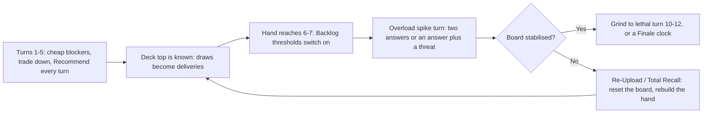

# Faction 09 — Algorithm Syndicate

> Part of the HYPEBOUND faction identity series (`docs/design/factions/`).
> Canon: [core rules](../00-core-rules.md) §6 (keywords), §7 (factions), §8 (Currents).
> Overview table: [faction guide](../04-faction-guide.md). Card data home: `data/cards/algorithm-syndicate.json`.
> Siblings: [Neon Idols](./01-neon-idols.md) · [Gothic Royalty](./02-gothic-royalty.md) · [Viral Influencers](./03-viral-influencers.md) · [Cosplay Champions](./06-cosplay-champions.md) · [Afterparty Crew](./07-afterparty-crew.md)

**Currents: Pulse (primary identity) / Tide** · **Playstyle: draw, deck manipulation, foresight, "next card" control**

---

## 1. Fantasy & Tone

The Algorithm Syndicate is the recommendation engine reimagined as an
impeccably polite crime family. They wear pinstripes in a server room. They
never threaten anyone — they simply *suggest*, and the suggestion is honoured,
because everything you have ever watched was already on the table when you sat
down. Their satire target is recommendation culture: the autoplay countdown you
never once beat, the "Because you watched…" row that knows something about you
that you don't, the sixty-hour Watch Later queue you maintain like a mortgage.

The tone is quiet menace and immaculate manners. Syndicate characters speak in
soft, hospitable euphemism — *"we've taken the liberty of putting something at
the top of your feed"* — and treat information as territory. Nothing is ever
random here; randomness is what happens to other people. Every character is an
original archetype (the Consigliera who remembers every deleted upload, the
mid-roll enforcer, the broker who sells impressions by the thousand) and never
a caricature of a real company or a real person.

Mechanically the fantasy is **the draw step stops being a dice roll**: the
Syndicate does not gamble on the top of the deck, it *arranges* the top of the
deck, then gets paid for having known.

---

## 2. Visual Identity & Color Language

The Syndicate own the "back room of the data centre" corner of the
digital-nightlife palette: velvet rope in front of a cold aisle, brass fittings
on black glass, a wall of monitors hung like family portraits.

| Role | Color | Hex | Usage |
|---|---|---|---|
| Primary | Syndicate Indigo | `#2B37C9` | Faction emblem, board trim, Pulse-side VFX |
| Secondary | Watchlist Teal | `#25C2C7` | Tide VFX, queue rails, Recommend fan glow |
| Accent | Brass Kickback | `#C9A227` | Filigree, Obsession riders, rarity glints |
| Support | Signal White | `#E8F0FF` | Data lines, sort arrows, text plates |
| Base | Cold-Aisle Black | `#070A16` | Backgrounds, negative space |

- **Motifs:** autoplay countdown rings, conveyor belts of cards feeding a
  velvet-roped door, "Because you watched…" placards in brass frames, sorting
  arrows, surveillance monitors stacked into a portrait wall, watch-later
  clocks with no hands, ledgers written in impressions rather than money.
- **VFX language:** **Recommend** fans the top cards face-up above the deck on
  a brass rail with drag handles and a card-riffle SFX, then slots them back
  with a soft mechanical click; **Overload** arcs indigo voltage along the
  circuit-notched frame; **Flow** returns ripple teal across the card as it
  slides back to hand.
- **Card frames** follow the Current (canon §8.2): Pulse cards use the
  circuit-notched angular frame, Tide cards the rounded wave-edge frame with
  liquid sheen. Faction identity lives in art, emblem, and board skin — never
  in frame shape and never in color alone. The faction badge is a three-card
  fan pierced by a rightward chevron, always with a text label.
- **Readability rule:** the Recommend overlay is the faction's signature UI
  moment and must never block the board read. It occupies the deck-side third
  of the screen, dims nothing, and is dismissible by confirm; on mobile
  landscape the fan collapses to a vertical list with up/down reorder buttons
  (no drag precision required).
- **Audio:** downtempo crime-lounge jazz over modem-handshake percussion; a
  brass card-riffle stinger on every Recommend
  (`music.battle.algorithm-syndicate` in `data/audio-manifest.json`).

---

## 3. Currents: Pulse / Tide

| Current | Why it fits |
|---|---|
| **Pulse** (lightning — technology, urgency, unstable energy) | The machine itself: ranking passes, model retrains, mid-roll interruptions. **Overload (X)** is the Syndicate spending next quarter's compute today — the engine can always serve you one more thing, it just costs the future. |
| **Tide** (water — memory, adaptation, repetition) | The archive: watch history, the re-upload, the thing you saw once and will be shown forever. **Flow** triggers on returns and replays, which is exactly how the Syndicate recycles its own cheap bodies for repeat value. |

**Advantage cycle notes (canon §8.4):** Pulse hits Tide for +1, so Syndicate
removal is efficient into Cosplay Champions, Afterparty Crew, and the Tide half
of Syndicate mirrors. Pulse takes +1 from Root — Touch-Grass Order, Corporate
Creators, and Gothic Royalty's Root side all punch through this faction's
already-thin bodies. The Tide half hits Cinder for +1 (Viral Influencers,
Digital Demons, Afterparty Crew's Cinder side), which is the faction's main
tool against the aggressive decks that otherwise prey on its setup turns.

**Confluence note:** the canonical Confluence table (canon §8.5) defines no
Pulse + Tide pair, so dual Syndicate decks have no native Confluence — the same
situation as Neon Idols, Gothic Royalty, and Viral Influencers, and flagged as
a canon gap in [gameplay loop §3.5](../02-gameplay-loop-and-match-flow.md).
Their compensation is the best card selection in the game. Dual lists may
splash up to 3 Prism cards (canon §8.6) to unlock **Refraction** — unusually
strong here, because a Syndicate player can *guarantee* the doubled card is the
one they stacked. Pure Pulse or pure Tide lists instead pursue **Perfect
Resonance** (per-Current bonus in `data/currents.json`; see
[Currents & lore](../06-currents-and-lore.md)).

---

## 4. Gameplay Strategy

The Syndicate are the game's **information-control faction**. They do not win
the early board and they do not intend to: turns 1–5 are spent trading
one-for-one, stacking the deck, and filling a hand. From turn 6 the deck stops
producing draws and starts producing *deliveries* — every topdeck is the card
they chose two turns ago — and the game converts into an attrition they cannot
lose on cards.

Per the binding balance targets ([gameplay loop §5.2](../02-gameplay-loop-and-match-flow.md)),
the faction's default speed band is **Control: lethal turn 10–12**.



| Strengths | Weaknesses |
|---|---|
| Best card selection and card advantage in the game; almost never floods or blanks | Thin bodies — statlines sit ~1 point under curve to pay for the text (canon-listed weakness) |
| **Recommend** converts variance into planning: combo pieces arrive on schedule | Needs 3–5 setup turns before any payoff (canon-listed weakness) |
| Reactions and foresight punish telegraphed enemy turns before they resolve | Almost no proactive pressure; a Syndicate board rarely threatens lethal on its own |
| Tide +1 into Cinder gives real answers to the aggro decks that prey on setup | Root decks hit the Pulse half for +1 and out-body them at every stage |
| Recursion (**Flow** + return-to-hand) re-buys enemy removal and re-fires on-play effects | Worst Obsession economy in the game (§5): Fixations come online late |
| Hand size is a resource they can spend on demand | Hand limit 10 — over-drawing destroys cards ("**Lost in the Feed**"); enemy discard effects hit harder here than anywhere |

**Matchup shape in one line:** the Syndicate beats anything that wants to play
a long game and loses to anything that refuses to.

---

## 5. Obsession Profile

The Syndicate has the **slowest Obsession curve of any faction**, and this is
deliberate. Canonical Obsession gain (canon §3.2) rewards *supporting* a
friendly character — buff, heal, shield, or equip — and the Syndicate does
almost none of those things. Drawing, arranging, returning to hand, and
reducing costs are all outside the support definition, so the once-per-turn +1
frequently does not fire at all, and neither leader's Fixation counts as
support.

**Design decision:** the faction pays for Obsession explicitly instead. Roughly
4–6 cards in a typical Syndicate list carry a *"Gain N Obsession"* rider
(the `gainObsession` op) attached to an effect they already wanted to play —
*Preroll Runner*, *Loyalty Program*, *Watchlist Muscle*. Expect:

| Milestone | Syndicate | Support-heavy faction (Idols, Champions) |
|---|---|---|
| First Fixation (3) | Turn 4–6 | Turn 3–4 |
| Fixation cadence | Every 2nd–3rd turn | Every turn or every other turn |
| Ultimate Fixation (7) | Turn 9–11 | Turn 5–8 |
| Time spent at 8+ (**Obsessed**) | Rare, and usually only en route to the Ultimate | Frequent |

The upside is that Syndicate players are rarely **Obsessed** and therefore
rarely eat the +1-damage penalty or Touch-Grass Order's anti-Obsessed bonuses.
The downside is that their Fixations — which are pure card advantage, the best
possible currency for this deck — are rationed. Climbing to 10 for a free
**Full Fixation** cast is a real line in grindy matchups, but a Syndicate
player at 8+ is a Syndicate player who has stopped answering the board.

---

## 6. Signature Mechanics

**Canonical keywords used heavily:** **Overload (X)**, **Flow**,
**Collab (syndicate)**, **Spotlight** (on their few defensive bodies), plus the
**Cancelled** status as their preferred non-lethal removal — the Syndicate does
not kill people, it de-monetises them.

Two faction-specific mechanics, both compositions over existing opcodes in
`src/engine/types.ts`. Neither is a new engine feature; printing more of either
requires zero engine changes.

### 6.1 Faction mechanic — Recommend X

> **Recommend X** — *Look at the top X cards of your deck and put them back in any order.*

The faction's identity keyword and the only place in HYPEBOUND where a player
edits the future directly. It maps one-to-one onto the canonical `scry` op
(`{ op: "scry"; count: number; mode: "reorder" | "bottomOne" }`).

```jsonc
// Sorted For You (excerpt)
{ "trigger": "onPlay",
  "ops": [ { "op": "scry", "count": 3, "mode": "reorder" },
           { "op": "draw", "count": 1 } ] }
```

The `bottomOne` mode prints as a second templated phrase in the same family:

> **Bury X** — *Look at the top X cards of your deck and put one of them on the bottom.*

```jsonc
{ "op": "scry", "count": 2, "mode": "bottomOne" }
```

**Rulings (binding):**

| Question | Ruling |
|---|---|
| Fewer than X cards left in deck? | Look at as many as remain. Recommend never draws and never causes **Burnout**. |
| Does Recommend trigger **Flow**? | No. Nothing leaves or enters a zone; the deck is only reordered. |
| Is Recommend a "support" action for Obsession? | No (canon §3.2 lists buff/heal/shield/equip only). |
| **Recommend 1** in reorder mode | Never printed — it is a no-op. Single-card manipulation always prints as **Bury 1**. |
| What does the opponent see? | The canonical `deckScryed { seat, count }` event fires: the opponent learns *that* you looked and *how many*, never *which* cards. Redaction rules (architecture contract §3) are unchanged. |
| Determinism | Reordering is a player choice carried in the `playCard` intent's `choices` array, so replays reproduce it exactly. No RNG is consumed. |

### 6.2 Faction mechanic — Backlog (X)

> **Backlog (X)** — *Bonus effect if you have X or more cards in hand.*

The foresight payoff. A Syndicate player who has done their job is holding
options; Backlog is the faction getting paid for it, and it composes from the
canonical `if` op with the `handSizeAtLeast` condition.

```jsonc
// Mid-Roll Enforcer (excerpt)
{ "trigger": "onPlay",
  "target": { "select": "choose", "side": "any", "zone": "board" },
  "ops": [
    { "op": "if",
      "condition": { "kind": "handSizeAtLeast", "side": "friendly", "value": 6 },
      "then": [ { "op": "damage", "target": { "select": "triggering" }, "amount": 3 } ],
      "else": [ { "op": "damage", "target": { "select": "triggering" }, "amount": 1 } ] } ] }
```

**Rulings (binding):**

| Question | Ruling |
|---|---|
| When is hand size counted? | Once, at effect resolution — *after* the card itself has left your hand, and *before* any draws in the same effect. A card printed **Backlog (6)** needs 6 other cards in hand. |
| Printed thresholds | Only **Backlog (5)**, **(6)**, and **(7)** are printed, so the checks stay memorable and the hand-limit tension (10) stays live. |
| Interaction with the hand limit | Intentional. Backlog decks hover at 7–9 cards, one bad draw away from destroying a card to "**Lost in the Feed**". Playing a card to make room is a real cost. |
| Counterplay | Public information: `RedactedOpponent.handCount` is visible to both players, so the opponent always knows whether a Backlog will switch on. Discard effects (Digital Demons, Touch-Grass Order) turn a Syndicate hand off. |

### 6.3 Design ruling — why the payoff is not "if the top card is…"

The obvious Syndicate design is *"…then, if the top card of your deck is a
Character, do X."* **That is not expressible in the canonical effects DSL:**
`ConditionExpr` in `src/engine/types.ts` has no predicate that inspects the top
of a deck, and `TargetSpec` has no "top of deck" selector. Per project rules the
DSL wins, so the faction is built the other way round and is stronger for it:

**You do not check whether the top card matches — you make it match.** Recommend
arranges, Backlog pays for the hand you kept, and the "condition" is satisfied
by the player's own planning rather than by a hidden coin flip. Card-selection
tutoring, where it exists, uses the canonical
`copyCardToHand { target: { zone: "deck", filter: … } }` form rather than a
top-of-deck predicate. This gap is reported upward as a possible future DSL
addition (`{ kind: "topOfDeckMatches"; filter: TargetFilter }`); until it exists,
no Syndicate card may be printed that reads a deck's top card as a condition.

---

## 7. Leaders

### 7.1 Don Sortino, Curator of the Feed

| Field | Value |
|---|---|
| Id | `algo-leader-don-sortino` (`data/cards/algorithm-syndicate.json`) |
| Currents | **Primary: Pulse · Secondary: Tide** (leader card is Pulse) |
| Health | 30 (canon default) |
| Passive — *House Recommendations* | At the start of your turn, **Recommend 2**. |
| Fixation (3 Obsession, once per turn) — *Suggested For You* | **Recommend 3**, then draw a card. |
| Ultimate Fixation (7 Obsession, once per match) — *An Offer You Can't Refuse* | Draw 3 cards, then reduce the cost of every card in your hand by (1). **Overload (2)**. |

```jsonc
// passive
{ "trigger": "startOfTurn", "ops": [ { "op": "scry", "count": 2, "mode": "reorder" } ] }
// ultimate
{ "ops": [ { "op": "draw", "count": 3 },
           { "op": "modifyCost",
             "target": { "select": "all", "side": "friendly", "zone": "hand" }, "delta": -1 },
           { "op": "lockHype", "amount": 2 } ] }
```

**Personality:** an impossibly courteous man in a pinstripe suit who has never
once raised his voice and has never once been told no. He refers to the deck as
"the family business," to the opposing leader as "our guest," and to lethal as
"the end of the session." He does not believe in luck; he believes in
inventory. His passive means a Syndicate player under Don never has a dead draw
step from turn 1, which is the whole pitch: the deck is 30 cards long and he
has read the first two pages of it every single turn.

*Play pattern:* stabilise cheaply, bank Obsession riders, then use *An Offer
You Can't Refuse* on a turn where a discounted hand converts into three or four
plays at once. The **Overload (2)** is the honest price — the turn after the
Ultimate is a turn where the Syndicate cannot answer anything, and good
opponents plan their push around it.

### 7.2 Cassia Cache, the Consigliera

| Field | Value |
|---|---|
| Id | `algo-leader-cassia-cache` |
| Currents | **Primary: Tide · no Secondary** (enables pure-Tide Perfect Resonance decks) |
| Health | 30 |
| Passive — *Long Memory* | The first time each turn a friendly card returns to your hand, it costs (1) less. |
| Fixation (3 Obsession, once per turn) — *Rerun* | Return a friendly character to your hand. It costs (1) less. |
| Ultimate Fixation (7 Obsession, once per match) — *Total Recall* | Return all friendly characters to your hand. They cost (2) less. Draw 2 cards. |

```jsonc
// fixation: target resolved once, bound to { "select": "triggering" }
{ "target": { "select": "choose", "side": "friendly", "zone": "board" },
  "ops": [ { "op": "returnToHand", "target": { "select": "triggering" } },
           { "op": "modifyCost", "target": { "select": "triggering", "zone": "hand" }, "delta": -1 } ] }
// ultimate
{ "ops": [ { "op": "forEach",
             "target": { "select": "all", "side": "friendly", "zone": "board" },
             "ops": [ { "op": "returnToHand", "target": { "select": "triggering" } },
                      { "op": "modifyCost", "target": { "select": "triggering", "zone": "hand" }, "delta": -2 } ] },
           { "op": "draw", "count": 2 } ] }
```

**Personality:** the Syndicate's institutional memory, and the only person Don
listens to. She remembers every deleted upload, every quietly edited caption,
every account that swore it was leaving. Speaks in the past tense about things
that have not happened yet. Where Don arranges the future, Cassia refuses to
let the past finish: her whole kit is about playing the same card again, and
again, and one more time after that.

*Play pattern:* a **Flow** engine. Every return-to-hand is a Flow trigger, a
cost reduction, and a re-fired on-play effect. *Rerun* rescues a character from
lethal damage, dodges a **Transformation** or **Cancelled** effect, and re-arms
a Recommend body — all for 3 Obsession. *Total Recall* is the faction's answer
to a board wipe and its single biggest tempo reset.

**Ruling — Total Recall ordering:** characters return in board order (slot 0
through 5). **Flow** triggers fire for characters still in play at that moment,
so a Flow body in slot 5 sees every earlier return, and one in slot 0 sees
none. Hand-limit destruction ("**Lost in the Feed**") applies normally, so
returning six characters into a seven-card hand will burn cards — this is a
real decision, not a trap, and the UI must preview the resulting hand count
before confirmation.

---

## 8. Deck Archetypes

### 8.1 Curated Feed (pure Tide · Cassia Cache)

- **Game plan:** a recursion control deck. Trade early with cheap, replayable
  bodies; use *Rerun*, *Re-Upload*, and **Flow** payoffs to re-fire on-play
  effects until the opponent has spent more removal than the deck has
  characters. Pure-Tide construction unlocks **Perfect Resonance (Tide)** after
  7 Tide cards. Wins by grinding the opponent to topdecks while the Syndicate
  still holds seven cards.
- **Key cards:** Re-Upload, Impressions Broker, The Suggestion Box, Sorted For
  You, Loyalty Program, Watchlist Muscle, *Total Recall* as the reset button.
- **Expected win turn:** **10–12** (Control band). Against another control deck
  the deck is happy to go to 13+ and win on Burnout differential.
- **Matchups:** favoured into Gothic Royalty and Corporate Creators — both want
  a long game, and neither can out-card a deck that re-buys its own threats.
  Favoured into Digital Demons and Viral Influencers' Cinder halves, where Tide
  removal gets the +1. Unfavoured into Touch-Grass Order (**Banished**
  characters return with no buffs and, critically, cannot be Rerun for value
  while banished) and into Neon Idols' wide buff turns, which outpace
  one-for-one trading.

### 8.2 Cold Open (pure Pulse · Don Sortino)

- **Game plan:** the faction's fast build — a proactive tempo list that uses
  **Overload (X)** to play a turn ahead of schedule and Recommend to guarantee
  the curve. Cheap Pulse removal clears the way for two or three mid-sized
  bodies, and the deck accepts the Hype debt because Don's passive means it
  never draws a blank on the recovery turn. Pure-Pulse construction unlocks
  **Perfect Resonance (Pulse)**.
- **Key cards:** Preroll Runner, Mid-Roll Enforcer, Preemptive Takedown,
  Shadowban Notice, Full Feed Refresh, Data Broker Nino.
- **Expected win turn:** **8–10** (Midrange band). **[DECISION]** — this is one
  band faster than the faction's default Control placement in
  [gameplay loop §5.2](../02-gameplay-loop-and-match-flow.md); it is deliberate
  (the faction needs one build that can punish greed) and is the archetype to
  watch first if Syndicate ladder win rates drift high.
- **Matchups:** preys on Cosplay Champions and Afterparty Crew — Pulse hits
  their Tide carries for +1, and cheap removal answers a single-carry plan
  cleanly. Strong into slower Syndicate mirrors, which cannot race. Weak into
  Touch-Grass Order and Corporate Creators (Root +1 into every Pulse body,
  Armor stacking blanks incremental damage) and into Viral Influencers, whose
  swarm outnumbers a removal-based plan before turn 6.

### 8.3 The Backlog (dual Pulse/Tide · Don Sortino)

- **Game plan:** maximum draw, maximum information, minimum board commitment.
  Hold 7–9 cards to keep **Backlog** thresholds live, answer everything, and
  close either with an *An Offer You Can't Refuse* multi-play turn or with the
  Finale Legendary *Madam Null* (§10) — whose win condition is literally "keep
  holding cards," making it free to include in a deck already doing that.
  Optionally splashes up to 3 Prism cards to enable **Refraction** on a stacked
  Recommend turn.
- **Key cards:** Mid-Roll Enforcer, Full Feed Refresh, Preemptive Takedown, The
  Suggestion Box, Madam Null the Silent Partner, 1–3 Prism enablers.
- **Expected win turn:** **11–13** — the Control band's slow half, or the
  Finale's minimum three-turn clock landing around turn 11 on a good draw. This
  is the archetype most likely to produce the 25–29-turn attrition mirror the
  balance targets flag as an acceptable rare tail.
- **Matchups:** dominant into any deck without hand disruption or a fast clock
  — Gothic Royalty, Corporate Creators, and control mirrors. Loses to hyper
  aggro (Viral Influencers follower flood, Digital Demons all-in burn) that
  ends the game before turn 8, and folds to targeted discard: a Syndicate hand
  forced below 6 cards has no Backlog payoffs, no Finale progress, and a board
  of under-statted bodies.

---

## 9. Example Cards

Tags in play: `syndicate`, `broker`, `enforcer`. Stats column: Characters are
Attack/Health; Locations show Durability. Reminder text appears on Common/Rare
only, per canon §6 templating.

| Name | Cost | Type | Current | Rarity | Stats | Rules text |
|---|---|---|---|---|---|---|
| Preroll Runner | 1 | Character | Pulse | Common | 1/2 | When you play this, **Recommend 2** and gain 1 Obsession. *(Recommend 2 — look at the top 2 cards of your deck and put them back in any order.)* |
| Re-Upload | 1 | Action | Tide | Common | — | Return a friendly character to your hand. It costs (1) less. |
| Sorted For You | 2 | Action | Tide | Common | — | **Recommend 3**, then draw a card. *(Recommend 3 — look at the top 3 cards of your deck and put them back in any order.)* |
| Mid-Roll Enforcer | 3 | Character | Pulse | Rare | 2/4 | **Spotlight** *(Enemies must attack characters with Spotlight before other targets.)* When you play this, deal 1 damage to a character. **Backlog (6):** Deal 3 instead. *(Backlog (6) — bonus effect if you have 6 or more cards in hand.)* |
| Preemptive Takedown | 3 | Reaction | Pulse | Rare | — | **Reaction:** When your opponent plays a character, deal 2 damage to it and **Recommend 2**. *(Recommend 2 — look at the top 2 cards of your deck and put them back in any order.)* |
| The Suggestion Box | 3 | Location | Tide | Epic | Dur. 3 | Activate (once per turn): **Recommend 3**, then reduce the cost of a card in your hand by (1). |
| Impressions Broker | 4 | Character | Tide | Rare | 2/5 | **Flow:** Draw a card. Once per turn. *(Flow — triggers when a friendly card is returned to your hand, replayed, healed, or exchanged.)* |
| Full Feed Refresh | 5 | Action | Pulse | Epic | — | **Recommend 5**, then draw 2 cards. **Backlog (7):** Draw 3 instead. **Overload (2)** |

Design notes on the eight above:

- Every Character is priced ~1 stat point under an equivalent vanilla body
  (Mid-Roll Enforcer is a 3-cost 2/4 where the faction-neutral benchmark is
  3/4). This is the canon-listed "thin bodies" weakness expressed as a
  costing rule, not a one-off.
- *Preemptive Takedown* is the faction's flagship Reaction: it is set face-down
  (canon §4, max 2 set), fires on `enemyPlaysCharacter`, and the free Recommend
  means even a "wasted" Reaction fixes your next two draws.
- *Full Feed Refresh* is the archetype-defining Epic — **Backlog (7)** is
  checked before its own draws, so it needs 7 *other* cards in hand, which with
  a 10-card limit means casting it into an 8-card hand burns nothing only if
  you have already made room.

---

## 10. Finale Legendary — Madam Null, the Silent Partner

The Syndicate's alternate win condition: the queue that finally exceeds a
human lifetime.

| Field | Value |
|---|---|
| Name / Id | Madam Null, the Silent Partner · `algo-madam-null-silent-partner` |
| Cost / Type / Current / Rarity | 6 · Character · Tide · Legendary (max 1 copy) |
| Stats | 2/7 |
| Rules text | **Finale:** At the end of your turn, if you have 8 or more cards in hand, this gains a Signal counter. At 3 Signal counters, you win the match. |
| Flavor | *She has never posted, never commented, never watched a single thing. She owns all of it.* |

**Canon compliance (core rules §2, victory):**

- **(a) Visible progression:** Signal counters render as a numbered brass badge
  on the card, and the opponent's HUD shows "Finale: 2/3" on every gain. Uniquely
  among Finale cards, the *condition itself* is already public information —
  `RedactedOpponent.handCount` is canonically visible (architecture contract
  §3), so an opponent can see a counter coming a full turn before it lands.
- **(b) At least 2 turns from reveal to trigger:** at most 1 counter per turn,
  gained only in the end-of-turn state-check step — a minimum of **3 turns**
  from reveal to victory, and realistically 4–5, because holding 8 cards means
  not developing the board.
- **(c) Interactable:** four distinct answers. Kill the 2/7 (the counters die
  with her). **Cancelled** blanks her text and stops accumulation. **Touch
  Grass**/**Banished** removes her and clears her counters (shared Finale
  ruling — Banished characters return with base stats and no statuses). And
  uniquely, *pressure works*: force the Syndicate to spend cards answering the
  board and their hand drops below 8 on its own, with no removal spent at all.

**Cost to the deck:** every turn Madam Null progresses is a turn the Syndicate
played at most one or two cards. She converts the faction's greatest strength —
a full hand — into a clock, and charges for it in exactly the currency the
faction hates spending: tempo. That keeps her a genuine strategic choice rather
than a free rider bolted onto a control deck.

**Implementation:** `finale: true` on the card definition (canonical field in
`src/engine/types.ts`), counter progression evaluated in the end-of-turn state
check after Afterparty triggers, Scorched damage, and Grow ticks (canon §2 turn
sequence), with the gate expressed as the canonical condition
`{ "kind": "handSizeAtLeast", "side": "friendly", "value": 8 }`. Victory emits
`matchEnded { winner, reason: "finale" }`.
