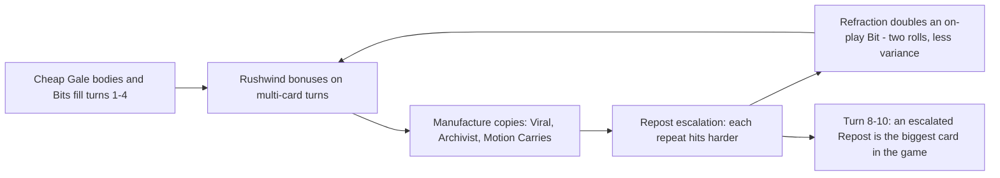
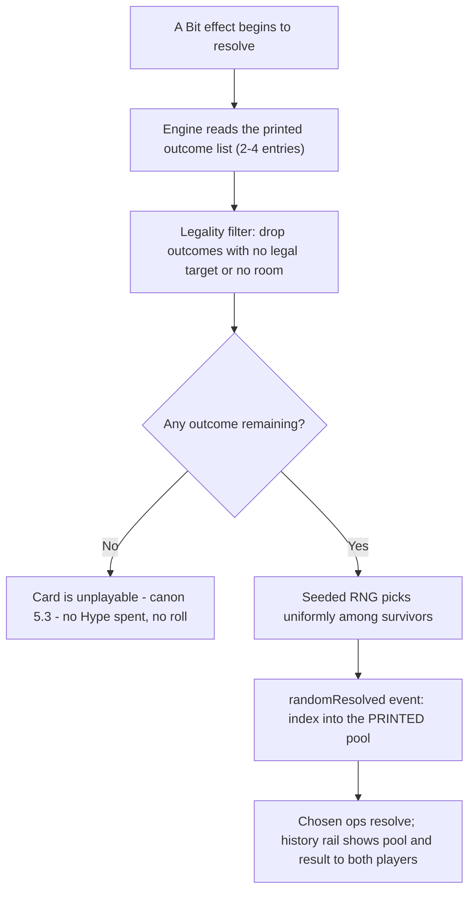

# Faction 10 — Meme Collective

> Part of the HYPEBOUND faction identity series (`docs/design/factions/`).
> Canon: [core rules](../00-core-rules.md) §6 (keywords), §7 (factions), §8 (Currents).
> Overview table: [faction guide](../04-faction-guide.md). Card data home: `data/cards/meme-collective.json`; Anon token in `data/cards/tokens.json`.
> Balance targets: [gameplay loop](../02-gameplay-loop-and-match-flow.md) §5.2.
> Siblings: [Neon Idols](./01-neon-idols.md) · [Gothic Royalty](./02-gothic-royalty.md) · [Viral Influencers](./03-viral-influencers.md) · [Cosplay Champions](./06-cosplay-champions.md)

**Currents: Prism (primary identity) / Gale** · **Playstyle: bounded randomness, repeated-joke escalation, unusual interactions**

---

## 1. Fantasy & Tone

The Meme Collective is an anarchic commune that lives in the basement of a
forum that shut down in 2011 and never told anyone. It has no leader — it
insists on this constantly, at length, in writing, in a laminated binder. It has
a Chairperson, a Curator, a rota for the soup, seventeen bylaws, and a whiteboard
tally of who has said the joke most times this week. It does not have a leader.

Their satire target is meme culture as a *social institution*: the way a group
of people can turn a stupid image into a shared language, then a ritual, then a
legal system. Nothing here is spontaneous. The chaos is scheduled. When a
Collective member does something bewildering mid-match, it is because the
commune voted on it in March.

The comedy is warm and communal rather than cruel — these are people who
genuinely like each other and express it exclusively through repetition. Every
character is an original archetype: the Chairperson of a leaderless commune, the
feral curator of the format vault, the anonymous poster who is somehow four
people. Never a real creator, community, or a recognisable specific meme.

Mechanically the fantasy is **the joke gets funnier because you keep telling
it** — and the second fantasy, equally load-bearing, is that **the Collective's
randomness is a menu, not a dice roll**: you always know every possible outcome
before it happens, and you would have been fine with any of them.

---

## 2. Visual Identity & Color Language

The Collective owns the "3 a.m. basement" corner of the digital-nightlife
palette: the one lit room in a dark building, cardboard signage, and a laptop
with more stickers than laptop.

| Role | Color | Hex | Usage |
|---|---|---|---|
| Primary | Format Lime | `#A8FF3C` | Faction emblem, board trim, Bit outcome highlights |
| Secondary | Deep-Fry Magenta | `#FF2FC2` | Randomness VFX, over-compressed edges, transformation bursts |
| Accent | Prism Sheen | `#DCEBFF` | Refract shimmer, crystal facets (shifting spectrum) |
| Support | JPEG Amber | `#FFB03A` | Repost stamp counters, compression artifacts, tally marks |
| Base | Basement Grey | `#101216` | Backgrounds, unlit squat interior, negative space |

- **Motifs:** sticker-bombed laptop lids, a corkboard with red string connecting
  unrelated images, the laminated bylaws binder, a communal soup pot with a
  hand-lettered sign, a whiteboard tally, an "EST. 2009" plaque screwed into
  bare concrete, and a prize wheel whose every face is large, labelled, and
  legible from across the room.
- **The prize wheel is the faction's thesis in a prop.** Wherever randomness
  appears in art, UI, or VFX, the full set of outcomes is visible in the frame.
  The Collective never hides a face of the wheel.
- **VFX language:** a **Bit** resolves as a face-up fan — every possible outcome
  arcs out readable, holds ~350 ms, then the chosen one slides forward with a
  rubber-stamp thunk. A **Repost** stamps a JPEG-amber impression on the card
  with a rising tally number and visible compression artifacts. Both animations
  obey the global animation-speed and reduced-motion settings; in instant mode
  the fan collapses to a text line in the history rail listing the pool and the
  result.
- **Card frames** follow the Current, per canon §8.2: Prism cards use the
  crystal-facet frame with shifting spectrum; Gale cards use the swept,
  ribbon-cut asymmetric frame. Faction identity lives in art, emblem, and board
  skin — never in frame shape, and never in color alone. Faction badge: a
  cardboard square with a hand-drawn upward arrow, plus text label.
- **Audio:** chiptune-plunderphonics with a kazoo section
  (`music.battle.meme-collective`). The Repost sting transposes up one semitone
  per stamp, capping at +5 — after that it simply gets louder, which is both a
  joke and a readability ceiling.

---

## 3. Currents: Prism / Gale

| Current | Why it fits |
|---|---|
| **Prism** (all — possibility, harmony, instability) | A format *is* possibility: the same template becomes a threat, an answer, or a joke depending on what the moment needs. **Refract** is the commune deciding what today's bit is about. Meme Collective is one of the two Prism-primary factions (canon §8.6) and pays the canonical Prism tax — its Prism cards cost ~1 more or are statted one step lower. |
| **Gale** (wind — freedom, speed, rumor) | Memes travel like weather and are impossible to hold. **Rushwind** rewards the commune's actual behaviour: many small cheap things, fast, in no particular order. |

**Advantage cycle notes (canon §8.4):** Gale hits Root for +1 (Touch-Grass
Order, Corporate Creators, Gothic Royalty's Root half) and takes +1 from Cinder
(Viral Influencers, Digital Demons, Afterparty Crew). Prism is neutral — it
neither gives nor takes the +1 — until **Refract** resolves, after which the
card carries the chosen Current's advantages *and* weaknesses. The faction's
Prism bodies are therefore slightly stickier defensively and slightly worse
offensively than their statlines suggest; this is deliberate compensation for
the Prism tax.

**Confluence — native and always on.** As a Prism-primary faction the
Collective's Confluence is **Refraction** (Prism + any): after playing a Prism
card and a card of a second Current in the same turn, the next card of that
second Current triggers its on-play effect **twice**.

> **Ruling (variance-smoothing, binding):** a doubled on-play **Bit** rolls
> **twice, independently** — it is not the same outcome applied twice. Two rolls
> from the same pool converge toward the pool average, so **Refraction is the
> faction's single best consistency tool**, not its biggest gamble. The UI
> announces both rolls separately in the history rail.

The engine-wide ruling established in [Cosplay Champions](./06-cosplay-champions.md)
§3 applies here: playing a **Refract** card registers as **both** Prism and the
chosen Current for that turn's Confluence eligibility, so a single Refract card
can enable Refraction by itself.

Pure-**Gale** lists (no Prism at all) trade Refraction for **Perfect
Resonance (Gale)** after 7 Gale cards played (canon §8.6; per-Current bonus in
`data/currents.json`).

---

## 4. Gameplay Strategy

The Collective is a **midrange value-escalation** faction. Its cards are cheap,
flexible, and individually slightly under-rate; its power comes from playing
*many* of them, manufacturing copies of the good ones, and letting each repeat
hit harder than the last. Per the binding balance targets
([gameplay loop](../02-gameplay-loop-and-match-flow.md) §5.2), the faction's
default speed band is **midrange: lethal turn 8–10**, with one aggro-tempo build
at 7–8.



| Strengths | Weaknesses |
|---|---|
| Every deck slot does several jobs — Bits supply removal, bodies and draw from the same cards, so the deck answers matchups it was not built for | **Variance** (canon-listed): two draws of the same opening play out differently, and no line is fully rehearsable |
| **Repost** is the only *increasing* damage rate in the game; a fourth repeat outscales any printed card at its cost | **Inconsistent curves** (canon-listed): cheap originals and expensive copies stack awkwardly, and some turns have no correct play at your Hype |
| Best copy generation outside Viral Influencers; the hand rarely empties, so late-game topdecks are live | Hand-limit pressure — manufactured copies burn to **Lost in the Feed** at 10 cards (canon §2) |
| **Refraction** available essentially every turn; doubling a Bit reduces variance instead of raising it | Prism tax (canon §8.6): statlines run one step behind every non-Prism faction |
| Low Obsession profile → rarely **Obsessed**, so Touch-Grass Order's punish package is close to blank | Almost no board-wide answers; wide aggro can end the game before escalation matters |
| Prints on axes nobody defends: enemy hand size, discard size, Burnout counters, Hype spent | Gale takes +1 from Cinder — Viral Influencers and Digital Demons trade up on the whole deck |

---

## 5. Obsession Profile

The Collective is the game's **lowest-Obsession faction**. It buffs, heals and
shields rarely, so the canonical "+1 the first time each turn you support a
friendly character" (canon §3.2) fires perhaps every second or third turn, and
the faction runs almost no **Parasocial**. Expect the first Fixation around turn
4–6 and the Ultimate around turn 8–10 — later than any faction except pure
control.

That is a real cost, and a quiet strength. Collective players spend the match
comfortably below 8, so they are almost never **Obsessed** (+1 damage taken from
all enemy sources) and almost never legal targets for Touch-Grass Order's
Obsessed-punish cards. The commune is simply not that invested in anything.

A small number of **Bit** outcomes grant 1 Obsession. This is capped at **1 per
Bit, never more** — the meter is allowed a little bounded jitter, but it is
never randomised in a way that could accidentally push a player into the danger
zone against their intent.

---

## 6. The Bounded Randomness Charter (binding design constraint)

> **No HYPEBOUND match may ever be decided by a Meme Collective die roll.**

This is the faction's single most important rule and it constrains every card
that will ever be printed for it. Randomness here is a *flavour* generator, not
an *outcome* generator: it decides which equally-good thing happens, never
whether you win. A player who loses to the Collective must be able to name the
decision that lost them the game, and it must never be "the wheel."

The charter is binding on design, on the card validator, and on review.

### 6.1 The nine clauses

| # | Clause | Rule |
|---|---|---|
| 1 | **Small pools** | Every random effect chooses from **2–4** printed outcomes. Never 5, never "a random card." |
| 2 | **Visible pools** | Every outcome is printed in full on the card and shown face-up by the UI before it resolves. `predict()` exposes the surviving pool to the interface; the history rail logs the pool *and* the result for both players. |
| 3 | **Flat pools** | Options are equally weighted by default. The DSL's `weight` field may only be used on Epic/Legendary cards and never at a ratio worse than **2:1**. |
| 4 | **Level pools** | Every outcome must be valued within **1 Hype** of every other outcome in its pool on the faction costing curve. The card is costed at the pool **average**, never at the cheapest outcome — a random card gets no discount for being random. |
| 5 | **No dead outcomes** | No outcome may be blank in a board state where the card is legally playable. Enforced at runtime by the legality filter (§6.2), so "nothing happened" is impossible. |
| 6 | **Randomness never picks the victim** | Random *targeting* is permitted only for effects of **2 or less damage** or **+1/+1 or less**. Removal, transformation, **Cancelled**, **Banished**, and anything that can decide a trade or lethal is always player-targeted. |
| 7 | **Roll last, never target after** | A random effect never asks for a target *after* it rolls. Cards either pre-select one target for the whole effect (canonical `EffectDef.target`, resolved once) or use only untargeted selectors. This keeps intents complete, replays exact, and the player in charge of the only decision that matters. |
| 8 | **Pools you built** | Card generation draws from **your own deck or discard** — pools you assembled at deck-building time and can inspect in-match — never from the global card set, never from another faction's cards, never from the opponent's deck. |
| 9 | **Deterministic and auditable** | All rolls flow through the seeded RNG in `MatchState` (architecture contract §3). Same seed + same intents ⇒ same rolls, always. Every roll emits a `randomResolved` event, so replays, spectating, and post-match review are exact. |

### 6.2 Resolution pipeline



The `randomResolved` index always refers to the **printed** pool rather than the
filtered survivor list, so a replay of the same seed reproduces the same result
even if presentation code changes.

### 6.3 The fairness test (worked example)

*Dogpile* — 2 Hype, Gale, Common. Pre-selected target: one enemy character.

| Outcome | Valuation | Live when? |
|---|---|---|
| Deal 2 damage to it | 2.00 | always (target pre-chosen) |
| Apply **Weakened 2** to it until your next turn and draw a card | 2.25 | always |
| Deal 1 damage to it and apply **Scorched** to it | 1.75 | always |

Spread = 0.50 Hype (≤ 1 ✓). Average = 2.00 → the card costs **2** ✓. No outcome
can be dead ✓. The target was chosen by the player before the roll ✓. Every
outcome is printed on the card ✓. **Ships.**

### 6.4 Cards this faction will never print

| Rejected card | Clause violated |
|---|---|
| "Deal 4 damage to a random enemy character." | 6 — randomness picking which character dies |
| "Discard a random card from your hand." | 2, 5 — randomness applied to hidden information the player cannot plan around |
| "Summon a random Legendary." | 1, 4, 8 — unbounded pool, wild value spread |
| "Transform a character into a random 5-cost character." | 1, 4 — spread of several Hype |
| "Flip a coin: if heads, deal double damage." | 3, 4 — coin-flip on the axis that decides the game |
| "This card becomes a random Current." | canon §8.7 + clause 1 — random Current changes must be rare, Epic+, and clearly worded; unbounded ones are simply banned here |
| "Draw a random card from your opponent's deck." | 8 — a pool the player never built and cannot see |

### 6.5 Why the faction is still "random"

Because the *sequence* is unrepeatable even though every step is fair. A
Collective player's turn 6 is assembled from outcomes they chose to expose
themselves to; two matches with the same deck produce different-looking turns
with the same expected value. The variance lives in **texture**, not in
**outcome** — which is exactly the promise in the faction's canon line
("unpredictable but not pure luck", REQUIREMENTS §Factions 10).

---

## 7. Signature Mechanics

**Canonical keywords used heavily:** **Refract**, **Rushwind**, **Viral**,
**Trending**, **Raid**, **Spotlight** (sparingly), plus the **Scorched** and
**Weakened X** statuses as small, chartered Bit outcomes.

Both faction mechanics below are **templated phrases, not new keywords** —
`KeywordId` in `src/engine/types.ts` is a closed union and neither appears in a
card's `keywords` array. They are identified for rules purposes by tags, which
the validator enforces.

### 7.1 Faction mechanic — Bit

> **Bit** — *Randomly choose one of the listed outcomes. Every outcome is
> printed on this card; outcomes with no legal target are excluded before the
> choice.*

The faction's templated notation for chartered randomness. Outcomes print as a
bulleted list. Every Bit card carries the tag `bit`. Composes directly from the
canonical `randomOp` opcode — no engine machinery beyond the legality filter,
which is a general improvement to `randomOp` and benefits every faction.

Two legal templates, per charter clause 7:

**Template A — targeted Bit.** The card names one target up front; every outcome
addresses it with `{ select: "triggering" }`.

```jsonc
// Dogpile (excerpt)
{ "trigger": "onPlay",
  "target": { "select": "choose", "side": "enemy", "zone": "board" },
  "ops": [ { "op": "randomOp", "options": [
      { "ops": [ { "op": "damage", "target": { "select": "triggering" }, "amount": 2 } ] },
      { "ops": [ { "op": "applyStatus", "target": { "select": "triggering" }, "status": "weakened", "amount": 2, "durationTurns": 1 },
                 { "op": "draw", "count": 1 } ] },
      { "ops": [ { "op": "damage", "target": { "select": "triggering" }, "amount": 1 },
                 { "op": "applyStatus", "target": { "select": "triggering" }, "status": "scorched" } ] } ] } ] }
```

**Template B — untargeted Bit.** Every outcome uses only `self`, `all`,
`leader`, `summon`, `draw`, or charter-legal `random` selectors (≤2 damage).

```jsonc
// Do A Bit (Skree's Fixation, excerpt)
{ "op": "randomOp", "options": [
    { "ops": [ { "op": "damage", "target": { "select": "random", "side": "enemy", "zone": "board" }, "amount": 2 } ] },
    { "ops": [ { "op": "summon", "cardId": "token-anon" } ] },
    { "ops": [ { "op": "draw", "count": 1 } ] } ] }
```

### 7.2 Faction mechanic — Repost

> **Repost** — *This effect is stronger for each other copy of this card you
> have already played this match.*

The repeated-joke escalator, and the faction's deterministic spine: nothing
about Repost is random, which is precisely why it exists. It composes from the
canonical `{ kind: "count" }` amount expression over the discard zone with a
per-card unique tag.

```jsonc
// Same Joke, But Louder — tag "rp:same-joke-louder" is unique to this card
{ "trigger": "onPlay",
  "target": { "select": "choose", "side": "any", "zone": "board" },
  "ops": [
    { "op": "damage", "target": { "select": "triggering" }, "amount": 2 },
    { "op": "damage", "target": { "select": "triggering" },
      "amount": { "kind": "count",
                  "target": { "select": "all", "side": "friendly", "zone": "discard",
                              "filter": { "tag": ["rp:same-joke-louder"] } } } } ] }
```

**Binding restrictions and rulings:**

| Topic | Ruling |
|---|---|
| Card types | Repost prints **only** on Action, Reaction, and Transformation cards, which reach the discard when they resolve. Characters escalate instead off the shared `format` tag (a faction-wide counter), never a per-card one. |
| Reactions | A face-down Reaction has not resolved, so it does not yet count. It counts once it triggers and is discarded. |
| Deck limits | Max 2 copies per deck (canon §2), so escalation past +1 must be **manufactured** — via **Viral**, Format Archivist, The Commune Basement, or Chairperson Nobody's passive. Escalation is a deck-building payoff, not a freebie. |
| Realistic ceiling | 3–5 resolutions of a key Repost card across a full match ⇒ **+2 to +4**. The design ceiling for any single Repost step is **1** (damage, stat, or card). |
| Milled/discarded copies | Copies that reach your discard without being played **do** count. The Collective does not check your sources. This is intentional, harmless (bounded by copy count), and one of the faction's advertised "unusual interactions." |
| Zero steps | An escalation of 0 resolves as a no-op and emits no event (see §12). |

### 7.3 Unusual interactions (no new machinery)

The faction's third pillar is *caring about things nobody defends*. Every one of
these is an existing canonical amount or condition expression from
`src/engine/types.ts` that other factions barely touch — the Collective simply
prints on them.

| Canonical expression | What it lets the Collective print | Example |
|---|---|---|
| `{ kind: "handSizeAtLeast", side: "friendly" }` | Payoffs for a hand stuffed with manufactured copies | Skree's *Nine Tabs Open* passive |
| `{ kind: "handSizeAtLeast", side: "enemy" }` | Cards that punish a hoarding control opponent | *Post Through It* |
| `{ kind: "fatigueCounter" }` | Cards that get better as **Burnout** approaches | *Dead Forum* |
| `{ kind: "hypeSpentThisTurn" }` | Rewards for dumping a whole turn's Hype | *Overcommitted to the Bit* |
| `count` over `zone: "discard"` | Repost counting, and format-tribe scaling | *Same Joke, But Louder* |
| `{ kind: "obsession", side: "enemy" }` | Punishing an **Obsessed** opponent from an unexpected faction | *Touch Some Grass (Affectionate)* |
| `{ kind: "currentPlayedThisTurn" }` | Refraction enablers that check their own setup | *Format Shift* |

---

## 8. Leaders

### 8.1 Chairperson Nobody, Speaker of the Unanimous Nothing

| Field | Value |
|---|---|
| Id | `meme-leader-chairperson-nobody` (`data/cards/leaders.json`) |
| Currents | **Primary: Prism · Secondary: Gale** (leader card is Prism) |
| Health | 30 (canon default) |
| Passive — *Motion Carries* | The first **Repost** card you play each turn adds a copy of itself to your hand. The copy costs (2) more. |
| Fixation (3 Obsession, once per turn) — *Motion Seconded* | Choose a card in your hand: it costs (1) less. |
| Ultimate Fixation (7 Obsession, once per match) — *Motion to Repost Everything* | Add copies of 3 random cards costing (4) or more from your discard to your hand. They cost (2) less. |

**Personality:** the elected head of a collective that does not believe in
elected heads, a contradiction Nobody resolves by insisting the position is
purely administrative while running it like a small nation. Speaks exclusively
in the first-person plural. Carries the laminated bylaws everywhere and quotes
them from memory, including the ones that are jokes, which is all of them.
Genuinely kind; will not let you leave the basement hungry; will absolutely
table your motion.

**Kit notes.** *Motion Carries* is the faction's escalation engine: the copy's
`costDelta` compounds off the copy's current cost (2 → 4 → 6 → 8), so the loop
is self-limiting and deterministic, and every repeat is a Repost step. *Motion
Seconded* is the faction's only reliable curve-smoother — the answer to the
canon-listed "inconsistent curves" weakness is a leader button that fixes one
awkward Hype gap per turn. The Ultimate is bounded randomness at its most
honest: the pool is your own public discard, cost-filtered, and you can read it
before you press the button.

### 8.2 Skree Nine-Tabs, Feral Curator of the Vault

| Field | Value |
|---|---|
| Id | `meme-leader-skree-nine-tabs` |
| Currents | **Primary: Gale · no Secondary** (enables pure-Gale Perfect Resonance decks) |
| Health | 30 |
| Passive — *Nine Tabs Open* | While you have 5 or more cards in hand, your **Bit** cards cost (1) less. |
| Fixation (3 Obsession, once per turn) — *Do A Bit* | **Bit:** • Deal 2 damage to a random enemy character. • Summon a 1/2 **Anon**. • Draw a card. |
| Ultimate Fixation (7 Obsession, once per match) — *Maximum Bit* | Choose a category, then **Bit** within it. **Chaos:** • Deal 3 damage to all enemy characters. • Deal 5 damage to a character and 3 damage to the enemy leader. **Commune:** • Summon three 2/2 **Anons**. • Give all friendly characters +2/+2 and draw 2 cards. |

**Personality:** the commune's archivist, if an archivist were mostly teeth.
Maintains the format vault — nine hundred folders, no naming convention, perfect
recall. Has not closed a browser tab since a year they refuse to specify.
Communicates in half-sentences and screenshots, and is somehow always correct
about which old format is about to be relevant again.

**Kit notes.** *Nine Tabs Open* is an "unusual interaction" printed on the
leader: it rewards the hand-flooding the faction does naturally and puts real
tension on the 10-card **Lost in the Feed** limit (canon §2). *Maximum Bit* is
the charter's showcase — the player picks the *category* (agency), the wheel
picks the *punchline* (flavour), and all four outcomes are valued at 6–7 Hype so
the choice that matters is the category. Every outcome is subject to the
legality filter, and "draw 2 cards" style outcomes guarantee the pool is never
empty.

---

## 9. Deck Archetypes

### 9.1 Repost Choir (dual Prism/Gale · Chairperson Nobody)

- **Game plan:** curve out with cheap Gale bodies and Bits through turn 4, then
  convert every turn into a copy: *Motion Carries* on the first Repost card,
  Format Archivist pulling Actions back, The Commune Basement recycling on a
  three-turn clock. From turn 7 each repeat of *Same Joke, But Louder* is
  strictly better than the last, and by turn 9 it is the biggest removal spell
  in the format. Activates **Refraction** most turns.
- **Expected win turn:** **8–10** (Midrange band, gameplay loop §5.2).
- **Key cards:** Same Joke But Louder, Format Archivist, The Commune Basement,
  "Source?", Dogpile, *Motion to Repost Everything*.
- **Matchups:** favoured into removal-heavy control (Gothic Royalty, Corporate
  Creators) — every answer they spend gets re-answered by a larger copy of the
  same card, and Gale's +1 chews through their Root walls. Also favoured into
  Touch-Grass Order, whose Obsessed-punish package is nearly blank against a
  faction that lives at 3 Obsession. Unfavoured into Viral Influencers and
  Digital Demons: Cinder takes +1 on all our Gale bodies and both decks close
  before escalation matters.

### 9.2 Nine Tabs (pure Gale · Skree Nine-Tabs)

- **Game plan:** aggro-tempo. No Prism cards at all, trading Refraction for
  **Perfect Resonance (Gale)** at 7 Gale cards played — reachable by turn 5–6 on
  this curve. Flood cheap bodies, take every **Rushwind** bonus, keep hand size
  at 5+ so *Nine Tabs Open* discounts every Bit, and use *Do A Bit* as a free
  extra card almost every turn.
- **Expected win turn:** **7–8** (Aggro-tempo band, gameplay loop §5.2).
- **Key cards:** Anon Poster, Dogpile, Same Joke But Louder, Format War, "Source?",
  cheap neutral Gale bodies.
- **Matchups:** preys on Root ramp and wall decks (+1 elemental across the
  board) and on any deck whose stabilisation arrives on turn 7. Struggles
  against Cinder aggro (they trade up on every body) and against Armor/heal
  walls — the charter caps single Bit outcomes at ~2 Hype of value, so this deck
  cannot manufacture a burst turn out of nowhere the way Pulse or Cinder can.

### 9.3 Refraction Roulette (Prism-primary · Chairperson Nobody)

- **Game plan:** a slower toolbox built to hit **Refraction** every single turn.
  Prism-dense, so almost every card is one half of the pair; Format Archivist and
  Deep-Fried Beyond Recognition supply the doubled on-play Bits (two independent
  rolls each — see §3), and the deck grinds to *Old Bit* as either a 2/6 wall or
  an outright alternate win. Accepts the Prism tax everywhere in exchange for
  answering everything.
- **Expected win turn:** **9–11** (upper Midrange into Control band, gameplay
  loop §5.2).
- **Key cards:** Format Archivist, Deep-Fried Beyond Recognition, The Commune
  Basement, "Source?", Old Bit the Joke That Refuses to Die.
- **Matchups:** favoured into fair midrange that cannot pressure a 2/6 and into
  decks whose plan is one big threat (the toolbox always has an answer shape).
  Loses to cheap **Cancelled** effects, which blank *Old Bit* outright, and to
  Digital Demons burst turns that ignore the board entirely. Algorithm Syndicate
  is a coin-flip: they see the Finale coming, but their own clock is slower.

---

## 10. Example Cards

Tags in play: `format`, `anon`, `bit`, `repost`, plus one unique `rp:<slug>` tag
per Repost card. Reminder text appears on Common/Rare only, per canon §6
templating. Prism cards visibly pay the canonical Prism tax (canon §8.6).

| Name | Cost | Type | Current | Rarity | Stats | Rules text |
|---|---|---|---|---|---|---|
| Anon Poster | 1 | Character | Gale | Common | 1/2 | **Rushwind:** Summon a 1/2 **Anon**. *(Rushwind — bonus effect if this is not the first card you played this turn.)* |
| Dogpile | 2 | Action | Gale | Common | — | Choose an enemy character. **Bit:** • Deal 2 damage to it. • Apply **Weakened 2** to it until your next turn and draw a card. • Deal 1 damage to it and apply **Scorched** to it. *(Bit — randomly choose one of the listed outcomes; outcomes with no legal target are excluded first.)* |
| Same Joke, But Louder | 3 | Action | Gale | Common | — | Choose a character. Deal 2 damage to it. **Repost:** Deal 1 more damage for each other copy of this card you have already played this match. *(Repost — this effect is stronger for each other copy of this card you have already played this match.)* |
| "Source?" | 2 | Reaction | Gale | Rare | — | **Reaction:** When your opponent plays an Action, add a copy of it to your hand. It costs (2) more. |
| Format Archivist | 3 | Character | Prism | Rare | 2/3 | **Refract.** When you play this, **Bit:** • Draw a card. • Summon a 1/2 **Anon**. • This gains +1/+1 and **Spotlight**. |
| The Commune Basement | 4 | Location | Prism | Epic | Dur. 3 | Activate (once per turn): Add a copy of a random card costing (3) or less from your discard to your hand. It costs (1) more. |
| Deep-Fried Beyond Recognition | 4 | Transformation | Prism | Epic | — | Choose a friendly character. **Bit:** • Transform it into a 5/3 **Deep-Fried Gremlin** with **Raid**. • Transform it into a 3/5 **Deep-Fried Gremlin** with **Spotlight**. • Transform it into a 4/4 **Deep-Fried Gremlin** that draws you a card when it is defeated. |
| Format War | 5 | Event | Gale | Epic | 3 turns | At the start of each of your turns, **Bit:** • Deal 2 damage to a random enemy character. • Summon a 1/2 **Anon** with **Raid**. • Add a copy of a random card costing (3) or less from your discard to your hand; it costs (1) more. |

**Tokens** (`data/cards/meme-collective.json`, shared Anon in
`data/cards/tokens.json`): **Anon** 1/2 Prism (`token-anon`, tag `anon`) — a
deliberately Current-neutral body that neither gives nor takes the elemental +1
— plus its two printed variants `token-anon-raid` (1/2, **Raid**) and
`token-anon-crowd` (2/2); **Deep-Fried Gremlin (Crispy / Soggy / Perfect)** 5/3 **Raid** · 3/5
**Spotlight** · 4/4 draw-on-defeat, all three Prism so the transformation never
constitutes a random Current change (canon §8.7).

**Charter audit of the three multi-outcome cards above:** Dogpile spread 0.50
Hype; Format Archivist spread 0.50 (draw 1.5 / body 1.5 / +1/+1 with Spotlight
1.75, all self- or untargeted); Deep-Fried spread 1.00 (5/3 Raid 4.5 / 3/5
Spotlight 3.5 / 4/4 with a card 4.5). All ≤ 1 Hype ✓. All three pre-select their
target or use no target ✓.

---

## 11. Finale Legendary — Old Bit, the Joke That Refuses to Die

The Collective's alternate win: a bit that has been running so long it has
achieved legal personhood.

| Field | Value |
|---|---|
| Name / Id | Old Bit, the Joke That Refuses to Die · `meme-old-bit-refuses-to-die` |
| Cost / Type / Current / Rarity | 5 · Character · Prism · Legendary (max 1 copy) |
| Stats | 2/6 |
| Rules text | **Finale:** At the end of your turn, if you played 3 or more cards this turn, this gains a Punchline counter. At 4 Punchline counters, you win the match. |
| Flavor | *It stopped being funny in 2011. It stopped being a joke in 2019. Nobody is sure what it is now, but it is winning.* |

**Canon compliance (core rules §2, victory):**

- **(a) Visible progression:** Punchline counters render as stamped tally marks
  on the card; the opponent's HUD shows "Finale: 2/4" on every gain, and the
  history rail logs the end-of-turn check whether or not it succeeded.
- **(b) At least 2 turns from reveal to trigger:** at most 1 counter per turn,
  gained only in the end-of-turn state-check step — a minimum of **4 turns** from
  reveal to victory, which lands the clock inside the archetype's 9–11 win band.
- **(c) Interactable, on two axes:**
  1. *Kill the joke.* Old Bit is an attackable 2/6. **Cancelled** blanks her text
     and freezes progression; **Touch Grass**/**Banished** removes her and clears
     her counters (shared Finale ruling across all factions — Banished characters
     return with base stats and no statuses or attachments).
  2. *Starve the joke.* The condition is 3+ cards in a turn. An opponent who
     applies real pressure forces the Collective to spend Hype on 4- and 5-cost
     answers instead of three cheap cards, and the counter simply does not tick.
     This is a genuine tempo lever the opponent controls, not a formality.

Old Bit deliberately taxes the deck that runs her: 5 Hype for a 2/6 that does
nothing on the turn it lands, in a faction whose Prism cards already cost a tax.
She is an inevitability *option* for the slowest build, never a free rider on
the escalation plan — and note that she is the one card in the faction with no
randomness on her at all. The joke that finally kills you is the one you saw
coming for four turns.

---

## 12. Implementation Notes

- **Bit** → canonical `randomOp` with 2–4 equally weighted options. The engine
  applies the **legality filter** (§6.2) before rolling; if no option survives,
  the card is unplayable per canon §5.3 and no Hype is spent. `randomResolved`
  carries the index into the **printed** pool for replay stability. Every Bit
  card carries tag `bit`; Skree's passive filters on it.
- **Repost** → `{ kind: "count" }` over
  `{ select: "all", side: "friendly", zone: "discard", filter: { tag: ["rp:<slug>"] } }`.
  Every Repost card declares tag `repost` plus exactly one `rp:` tag matching its
  id slug; cosmetic variants (`variantOf`) inherit the same `rp:` tag so alternate
  art never splits a counter.
- **Chairperson Nobody — *Motion Carries*** → `onCardPlayed` with
  `playedFilter: { tag: ["repost"] }`, first-per-turn flag, then
  `{ op: "copyCardToHand", target: { select: "triggering" }, costDelta: 2 }`.
  `costDelta` compounds off the copy's current cost.
- **Chairperson Nobody — *Motion to Repost Everything*** →
  `{ op: "copyCardToHand", target: { select: "random", side: "friendly", zone: "discard", filter: { costMin: 4 }, count: 3 }, costDelta: -2 }`.
  Adds fewer cards if fewer qualify; never fails.
- **Skree — *Nine Tabs Open*** → `aura` trigger with
  `condition: { kind: "handSizeAtLeast", side: "friendly", value: 5 }` and
  `{ op: "aura", target: { select: "all", side: "friendly", zone: "hand", filter: { tag: ["bit"] } }, costDelta: -1 }`.
- **Skree — *Maximum Bit*** → `chooseOne` with two labelled branches, each
  branch containing one `randomOp` of two options. Player agency outside,
  bounded randomness inside.
- **Old Bit** → `finale: true`; end-of-turn state-check evaluation with
  `condition: { kind: "cardsPlayedThisTurnAtLeast", value: 3 }`, resolved after
  Afterparty triggers, **Scorched** damage, and Grow ticks (canon §2 turn
  sequence).
- **Token variants instead of keyword grants.** The canonical `summon` op takes
  only a `cardId`, so keyword-bearing summons ship as separate tokens rather than
  `summon` + `addKeyword`: `token-anon` (1/2), `token-anon-raid` (1/2, **Raid**),
  `token-anon-crowd` (2/2). All are Prism, `token: true`, tagged `anon`, and live
  in `data/cards/tokens.json`; the Deep-Fried Gremlin forms are faction-specific
  and live in `data/cards/meme-collective.json` per architecture contract §2.
- **Ruling — zero-amount ops.** A `damage`, `heal`, or `buff` op whose computed
  amount is 0 resolves as a no-op and emits no event. This keeps Repost steps of
  0 silent and keeps the history rail readable.
- **Ruling — transform preserves attack state.** `transform` retains
  `enteredOnTurn` and `attacksUsedThisTurn`, so Deep-Fried Beyond Recognition
  cannot launder an already-attacked body into a fresh **Raid** attack.
- **Faction validator rules** (added to `validation.ts` alongside the canonical
  checks):

  | Check | Rejection |
  |---|---|
  | `randomOp` option count | fewer than 2 or more than 4 options on a `meme-collective` card |
  | Weight ratio | any weight ratio worse than 2:1, or any weight at all below Epic rarity |
  | Random targeting | a `randomOp` option containing `damage` > 2 or `buff` > +1/+1 aimed at `select: "random"` |
  | Post-roll targeting | any `select: "choose"` inside a `randomOp` option |
  | Repost tagging | a Repost card that is not Action/Reaction/Transformation, or lacks exactly one `rp:` tag, or omits tag `repost` |
  | Bit tagging | a card containing `randomOp` without tag `bit` |
  | Pool value spread | flagged for manual review when declared outcome valuations differ by more than 1.0 (valuations live in the card's design metadata, not in shipped data) |
