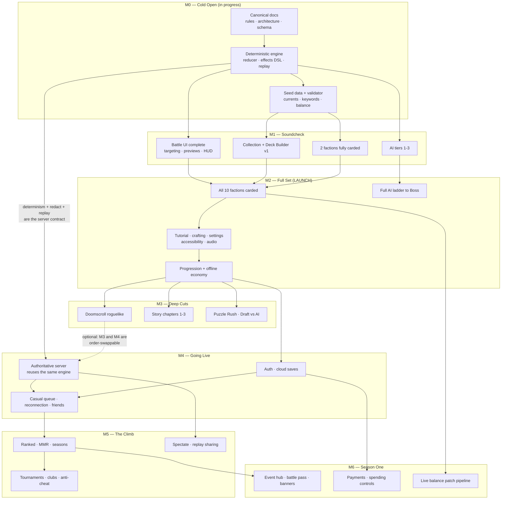
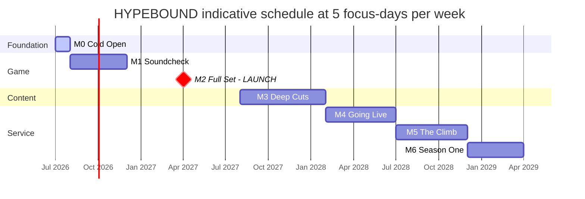
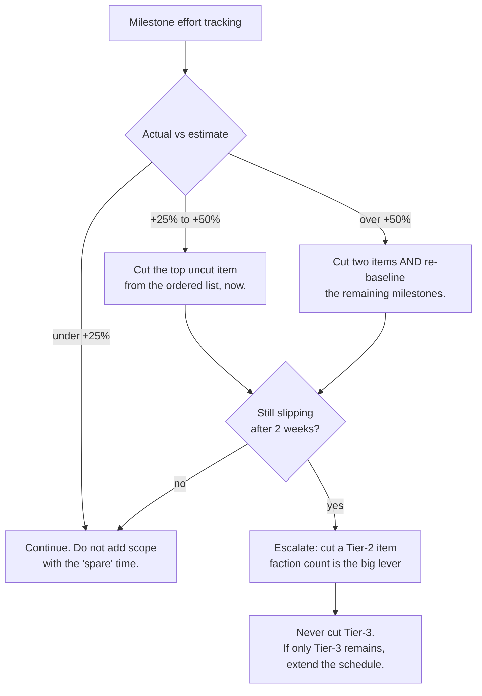

# HYPEBOUND — Development Milestones

> **Status: Planning document.** Subordinate to `../design/00-core-rules.md` (rules
> canon) and `../tech/00-architecture-contract.md` (tech canon). Nothing here may
> change a rule, a number, or a directory. Where this plan gives estimates they are
> forecasts, not commitments; where it gives *gates*, they are binding — a milestone
> is not finished until its gates pass.
>
> **Repository state verified 2026-07-24:** engine + AI + battle prototype compile
> and `npm test` passes 30 tests across 3 files; `data/cards/` contains
> `neon-idols.json` (20 entries), `neutral.json` (10), `tokens.json` (6).

This document defines seven milestones (M0–M6), each with a scope checklist, exit
criteria, and effort estimate; a dependency graph; a priority-ordered de-scope list;
and the project risk register.

---

## 1. How to read this plan

### 1.1 The estimating unit — the focus-day

| Term | Definition |
|---|---|
| **Focus-day (fd)** | One uninterrupted 4–6 hour working session by the owner, with AI tooling assisting. It is a *unit of attention*, not a calendar day. |
| **Sustained pace** | 3 fd/week. Evenings plus one weekend session. The default assumption for this plan. |
| **Committed pace** | 5 fd/week. Effectively full-time-adjacent. Sustainable in bursts, **not** for a year (see risk R5). |
| **Content-day throughput** | 8–12 finished cards per fd — design, JSON authoring, templated text, flavor, validator-clean, one interaction test. Plan at **10/fd**. |

Estimates carry explicit confidence bands: **±25 %** for M0–M1 (well-understood
work), **±40 %** for M2–M3 (content volume risk), **±60 %** for M4–M6 (server,
payments, and live-service work that has not been prototyped).

### 1.2 Quality gates (binding — a milestone does not exit without them)

| Gate | Check | How it is run |
|---|---|---|
| **G1 Types** | `npm run typecheck` clean, `strict: true`, zero `any` in `src/engine` | script |
| **G2 Tests** | `npm test` green, zero skipped, coverage of every keyword/status/Confluence touched by the milestone | script |
| **G3 Data** | `npm run validate` clean — every card in `data/cards/` passes the zod schemas and templating rules | script |
| **G4 Determinism** | Seeded soak: 1,000 AI-vs-AI matches re-simulated from `MatchRecord`; final `MatchState` byte-identical after `JSON.stringify` | soak script in `tests/` |
| **G5 Performance** | Meets the budget table in §1.3 on the reference devices | manual + profiler capture |
| **G6 Accessibility** | Milestone's new screens pass the checklist: keyboard reachable, shape+label never color-only, text scale 100–200 %, reduced-motion path, contrast ≥ 4.5:1 | manual audit |
| **G7 Readability review** | Pillar 1 litmus test: a first-time viewer can narrate a recorded match of the milestone build without help | recorded playtest |
| **G8 Honesty review** | No fake online surfaces, no unpublished odds, no dark patterns introduced (GDD §9) | manual review |

### 1.3 Performance budgets (reference devices)

| Target | Desktop reference (2020 mid-range laptop, integrated GPU, 1080p) | Mobile reference (2021 mid-range Android, landscape, 1080×2400) |
|---|---|---|
| Battle board frame rate | ≥ 60 fps sustained, ≥ 50 fps during Confluence VFX | ≥ 30 fps sustained, ≥ 24 fps during VFX |
| DOM screen interaction latency | ≤ 100 ms to visible response | ≤ 150 ms |
| Time from cold load to lobby | ≤ 3.0 s | ≤ 5.0 s on simulated 4G |
| Initial JS payload (gzipped, incl. three.js) | ≤ 1.2 MB | same |
| Battle scene draw calls | ≤ 150 | ≤ 110 (quality tier drops VFX layers) |
| Battle scene GPU texture memory | ≤ 256 MB | ≤ 128 MB |
| Engine `applyIntent` worst case | ≤ 8 ms for a 20-trigger cascade | ≤ 16 ms |

### 1.4 Tracking

- **The checklists in this document are the tracking board.** Tick boxes in place; do
  not create a parallel task tracker to drift out of sync.
- **Git tags** mark exits: `m0-foundation`, `m1-slice`, `m2-offline`, `m3-content`,
  `m4-online`, `m5-competitive`, `m6-liveops`.
- **Save schema versions** bump at three points only: `v1` (M1), `v2` (M2, adds
  collection/progression/economy), `v3` (M4, adds cloud-save envelope). Every bump
  ships with a migration function and a migration test.
- **Content freeze**: the last 15 % of every milestone's effort is bugfix and polish
  only. No new cards, no new screens, no new mechanics inside a freeze.

---

## 2. Milestone map

| # | Codename | Theme | Ships to | Remaining effort | Cumulative | ETA @ 3 fd/wk | ETA @ 5 fd/wk |
|---|---|---|---|---|---|---|---|
| **M0** | *Cold Open* | Docs, engine, data foundation | Owner only | **22 fd** *(≈40 fd already spent)* | 22 | ~2 mo | ~1 mo |
| **M1** | *Soundcheck* | Playable vertical slice vs AI | Private playtesters | **88 fd** | 110 | ~9 mo | ~5 mo |
| **M2** | *Full Set* | Complete offline game | **Public launch** | **166 fd** | 276 | ~21 mo | ~13 mo |
| **M3** | *Deep Cuts* | Single-player content depth | Public update | **126 fd** | 402 | ~31 mo | ~19 mo |
| **M4** | *Going Live* | Server, auth, casual multiplayer | Public update | **116 fd** | 518 | ~40 mo | ~24 mo |
| **M5** | *The Climb* | Ranked, spectate, replays, tournaments | Public update | **98 fd** | 616 | ~47 mo | ~29 mo |
| **M6** | *Season One* | Events, battle pass, banners | Live service | **107 fd** | 723 | ~56 mo | ~33 mo |

**Read the totals honestly.** M0–M2 is the game (276 fd). M3 is the content moat that
makes it worth returning to. M4–M6 is a *second project* of comparable size — a
service business with uptime, payments, moderation, and seasonal content obligations.
This plan therefore treats **M2 as the launch milestone** and M4+ as conditional on
M2/M3 demonstrating real demand. Building a server for an audience that does not
exist yet is the single most expensive mistake available to this project.

### 2.1 Dependency graph

**Dependency notes.**
1. **M4 depends on M0, not on M3.** The server hosts the same deterministic reducer;
   everything it needs (`applyIntent`, `redact`, `MatchRecord`) exists at M0. M3 and M4
   can be swapped if playtest data says players want ranked more than campaigns.
2. **M5 strictly requires M4.** Ranked without an authoritative server is unshippable —
   client-authoritative ladders are cheat farms.
3. **M6 requires M5 only for ranked-linked rewards.** Events and the battle pass could
   technically ship on M4, but shipping monetization before a stable competitive loop
   inverts the priorities in GDD §3 and is disallowed by this plan.
4. **Content authoring (cards) is on the critical path to M2 and nothing else.** It is
   also the most parallelizable work — see §10.1.

### 2.2 Indicative schedule at committed pace (5 fd/week)

---

## 3. M0 — *Cold Open* (foundation) — **IN PROGRESS**

**Goal.** Establish the three things every later milestone is built on: canonical
documentation, a deterministic engine that interprets card data, and validated seed
data. Nothing here needs to be pretty; everything here needs to be *right*, because
M1–M6 all inherit its mistakes.

**Entry criteria.** None (project start).

### 3.1 Status snapshot (2026-07-24)

| Area | State | Evidence |
|---|---|---|
| Canonical rules doc | Done | `docs/design/00-core-rules.md` |
| Architecture contract | Done | `docs/tech/00-architecture-contract.md` |
| Engine type contract | Done | `src/engine/types.ts` — full effects DSL |
| Reducer / effects / triggers / combat / currents / statuses / victory / replay | Done (first pass) | `src/engine/*.ts` |
| Seeded RNG, no `Math.random`/`Date` in engine | Done | `src/engine/rng.ts` |
| Data: currents, keywords, confluences, statuses, factions, balance, ai-profiles, audio-manifest | Done | `data/*.json` |
| Card data | **1 of 10 factions** — Neon Idols 20 entries, neutral 10, tokens 6 | `data/cards/` |
| AI baseline | Done (6 profiles, deterministic, sanity-tested) | `src/ai/*.ts`, `tests/ai.test.ts` |
| Battle board prototype | Rough but running (scene, board, card meshes, HUD, presenter, targeting, VFX) | `src/ui/battle/*.ts` |
| Card frame renderer | Done (procedural frames, placeholder art, icons) | `src/ui/cardRenderer/*.ts` |
| Tests | 30 passing across 3 files | `tests/` |
| **Missing vs. contract §2** | `engine/keywords.ts`, `engine/obsession.ts`, `engine/predict.ts`, `src/i18n/`, `src/net/`, `src/ui/components/`, `data/missions.json`, `data/events.json`, `data/progression.json` | — |

### 3.2 Scope checklist

**Documentation**
- [x] Canonical core rules (`design/00-core-rules.md`)
- [x] Canonical architecture contract (`tech/00-architecture-contract.md`)
- [x] Game Design Document, gameplay loop, screens & navigation
- [x] Economy, progression, game modes, social & safety
- [x] Story & roguelike design
- [x] Card JSON schema & effects DSL reference (`tech/01-card-schema.md`)
- [x] All 10 faction identity documents
- [ ] Keyword glossary + templating rules document (validator's written specification)
- [ ] Currents & lore document (per-Current identity kits, Resonance payload table)
- [ ] Balance assumptions document (costing baselines, stat curves, budget tables)
- [ ] Art direction, animation/VFX requirements, audio requirements
- [ ] Multiplayer architecture, AI design, testing plan (tech docs T2–T5)
- [ ] This milestone plan

**Engine**
- [x] `types.ts` contract; JSON-safe `MatchState`; intent/event model
- [x] Seeded PRNG; determinism enforced by construction
- [x] `reducer.ts` / `effects.ts` / `triggers.ts` / `combat.ts` / `currents.ts` / `statuses.ts` / `victory.ts` / `replay.ts` / `deck.ts` / `intents.ts`
- [x] `content.ts` + `validation.ts` (zod) with injectable content for tests
- [ ] `predict.ts` — pure preview API (damage/heal/lethal/Confluence availability)
- [ ] `keywords.ts` — extract Viral/Trending/Collab/Comeback runtime logic from `effects.ts`
- [ ] `obsession.ts` — gain/spend/threshold logic isolated and unit-tested
- [ ] `redact(state, seat)` per-seat view, asserted to leak nothing
- [ ] Trigger-cap (20) enforcement test with an intentionally infinite loop card fixture

**Data**
- [x] `currents.json`, `keywords.json`, `confluences.json`, `statuses.json`, `factions.json`, `balance.json`, `ai-profiles.json`, `audio-manifest.json`
- [x] Neon Idols first-pass card file + neutral + tokens
- [ ] `missions.json`, `events.json`, `progression.json` skeletons (schema-valid, may be near-empty)
- [ ] Resonance payload defined for all 8 Currents in `currents.json`
- [ ] All 9 Confluences implemented and individually tested

**Tooling**
- [x] `dev` / `build` / `preview` / `test` / `typecheck` / `validate` scripts
- [ ] `validate` promoted to a standalone CLI (not a vitest alias) so content work never needs the test runner
- [ ] Determinism soak script (G4) runnable with a seed range argument
- [ ] Lint rule or test asserting `src/engine` imports nothing but `src/engine/**` and `zod`, and contains no `Math.random`/`Date`

### 3.3 Exit criteria

1. G1–G4 pass. The determinism soak runs 1,000 seeded AI-vs-AI matches with zero divergence.
2. `npm run validate` rejects, with a readable message, each of six deliberately broken fixture cards (unknown op, unknown trigger, stat-less character, costed token without `token:true`, text/template mismatch, faction/current combination not allowed by `factions.json`).
3. Every canonical rule in core rules §2–§8 has at least one asserting test: hand limit burn, Burnout escalation, Spotlight enforcement, elemental +1, Obsessed +1 damage taken, Full Fixation reset to 5, Confluence once per turn, Perfect Resonance at 7, trigger cap at 20.
4. Every one of the 9 Confluences and all 8 Resonance payloads exist in data and resolve in a test.
5. The document set in §3.2 is complete; every doc's cross-references resolve to a file that exists.
6. A dev-only harness plays a full Neon Idols mirror match to a winner without a crash.

**Anti-scope for M0:** no polish on the battle board, no collection UI, no deck builder, no audio files, no additional factions beyond Neon Idols.

### 3.4 Effort

| Workstream | Total | Spent | Remaining |
|---|---:|---:|---:|
| Documentation | 20 | 15 | 5 |
| Engine core | 22 | 17 | 5 |
| Data + validator | 9 | 5 | 4 |
| Card renderer + board prototype | 10 | 3 | 7 |
| Tests + tooling | 5 | 2 | 3 |
| **Total** | **66** | **~44** | **≈22 fd** |

---

## 4. M1 — *Soundcheck* (playable vertical slice)

**Goal.** One complete, honest slice of the real game: boot → build a deck → play a
full match against AI on a polished board → see the result → repeat. Two factions,
fully carded, deep enough that the strategic loop is real, not a demo.

**Entry criteria.** M0 exit criteria met.

### 4.1 Faction selection for the slice — **[DECISION]**

Ship **Neon Idols** (Halo/Pulse) and **Digital Demons** (Cinder/Veil).

| Reason | Detail |
|---|---|
| Elemental coverage | Halo ↔ Veil is the mutual +1 pair — the advantage system is exercised in both directions every match |
| Systems coverage | Digital Demons' Cinder/Veil dual unlocks **Blackflame**, so Confluences are live; Neon Idols' Halo/Pulse has **no native Confluence** (core rules §8.5), so a pure-Halo Neon build exercises **Perfect Resonance** instead. One slice, both endgame systems |
| DSL stress | Demons need `transform`, `randomOp`, self-`damage`, `applyStatus: cursed`, `corrupt`-flavored branches; Idols need `buff`, `aura`, `inspire`, `summon`, `attackAgain`. Between them they exercise ~70 % of the op table |
| Head start | Neon Idols already has 20 authored entries |
| Fantasy contrast | Bright coordinated buff-chains vs. cursed high-risk tempo — playtesters can feel that factions are different, not reskinned |

### 4.2 Scope checklist

**Battle experience**
- [ ] `presenter.ts` animation queue: full → fast → instant tiers, per-event-type "seen once" memory
- [ ] Targeting arrows, legal-target highlighting, illegal targets visually excluded
- [ ] Damage/heal previews via `predict()`, including the elemental +1 and Shield/Armor absorption
- [ ] HUD complete: both leaders + health, Hype crystals, Obsession meters, hand, deck/discard counters, board slots, turn timer with the 15 s "Stream Buffering" rope, End Turn, action history rail, card enlargement, status inspection
- [ ] Trigger-order display showing the queue as it resolves
- [ ] Confluence button with both symbols and a rules preview; Resonance progress indicator
- [ ] Victory/defeat sequences; concede flow; match-summary screen
- [ ] Reaction zone (face-down count) and Event banner zone
- [ ] Per-Current VFX + SFX slots for Halo, Pulse, Cinder, Veil (4 of 8)

**Client systems**
- [ ] `src/i18n/` with `t(key)` and complete `en.json`; zero hardcoded user-facing strings
- [ ] `src/ui/components/` shared component set (button, dialog, meter, card tile, filter chip, toast)
- [ ] Pointer abstraction: mouse drag-to-play/attack, tap-tap touch fallback, keyboard navigation layer
- [ ] Mobile landscape layout 1280×720 → 4K, portrait rotate-device overlay
- [ ] `save/` v1: profile, settings, decks, collection, with versioned envelope + one migration test
- [ ] Settings v1: 5 audio channels, animation speed, reduced motion, text scale, colorblind-safe iconography toggle

**Meta screens (v1 — real, minimal, honest)**
- [ ] Collection: grid + detail, text search, filters (faction, cost, rarity, type, keyword, ownership), missing-card indicators
- [ ] Deck Builder: 30-card validation, max-copies rule, Leader selection, Current legality (Primary/Secondary + ≤3 Prism), resource curve, type distribution, save slots, immediate "Test vs AI"
- [ ] Lobby v1: Play button, current deck, selected leader, navigation to Collection/Deck Builder/Settings

**Content**
- [ ] Neon Idols to full set: 2 leaders + 34 deck cards (13 common / 12 rare / 6 epic / 3 legendary incl. 1 Finale) + tokens
- [ ] Digital Demons to full set: same shape
- [ ] Neutral pool to 24 deck cards
- [ ] 2 preconstructed starter decks per faction, validator-clean and AI-tested

**AI**
- [ ] Beginner / Casual / Intermediate profiles tuned against the two factions
- [ ] Evaluator understands: board trades, elemental advantage, lethal, Obsession risk, Confluence availability

**Verification**
- [ ] 5 external playtesters, each 3+ matches, structured feedback captured

### 4.3 Exit criteria

1. G1–G7 pass on the slice build.
2. A playtester who has never seen the game boots it, builds a legal 30-card deck unaided, and beats the Casual AI — with no verbal help from the owner and no crash.
3. 200-match unattended AI-vs-AI soak: zero exceptions, zero illegal intents, zero determinism divergences, zero matches exceeding 30 turns.
4. Median human match length 5–12 minutes; no single turn's animation budget exceeds 12 s at "full" speed or 4 s at "fast".
5. Both factions' full sets pass `npm run validate`; every card has at least one interaction test.
6. Mobile reference device sustains ≥ 30 fps for a full match in landscape.
7. Every string on screen resolves through `i18n.t()` (asserted by a pseudo-locale run that renders all keys as `[[key]]`).

**Anti-scope for M1:** no crafting, no packs, no progression, no tutorial, no other factions, no audio *files* (system only), no story, no roguelike, no online anything.

### 4.4 Effort

| Workstream | fd |
|---|---:|
| Battle UI completion (targeting, previews, HUD, history, trigger display, end sequences) | 20 |
| Presenter/animation queue + 4-Current VFX language | 10 |
| `predict.ts`, `keywords.ts`, `obsession.ts` + tests | 8 |
| Collection v1 | 7 |
| Deck Builder v1 | 10 |
| `save/` v1 + settings | 5 |
| AI tiers 1–3 tuning | 5 |
| Content: 2 full factions + neutral to 24 + starter decks | 8 |
| Mobile landscape + pointer/keyboard input abstraction | 6 |
| i18n + shared components + accessibility baseline | 4 |
| Playtest round, soak harness, fixes | 5 |
| **Total** | **88 fd** |

---

## 5. M2 — *Full Set* (complete offline game) — **LAUNCH MILESTONE**

**Goal.** The whole game, offline: ten factions, the complete collection and
deck-building experience, crafting, a tutorial that teaches everything, an AI ladder
from Beginner to Boss, and a settings/accessibility surface that meets every binding
requirement. This is what ships publicly. It must be complete enough that a player who
never sees a server still feels they bought — or rather, were given — a whole game.

**Entry criteria.** M1 exit criteria met; the two slice factions have survived at least
one balance revision without structural changes to the DSL.

### 5.1 Content budget

| Pool | Deck cards | Leaders | Tokens | Notes |
|---|---:|---:|---:|---|
| Per faction × 10 | 34 | 2 | ~3 | 13 common / 12 rare / 6 epic / 3 legendary (exactly one Finale legendary per faction) |
| Neutral | 40 | — | ~6 | Usable by every deck, Current-legal per `factions.json` |
| **Launch set total** | **380** | **20** | **~36** | ≈ 436 entries; ~38 fd at 10 cards/fd |

Rarity distribution is a design guardrail, not a power ladder: Legendary means unique
and complex, never strongest (core rules §9).

### 5.2 Scope checklist

**Content**
- [ ] 8 remaining factions carded to full set (272 deck cards + 16 leaders + tokens)
- [ ] Neutral pool to 40
- [ ] One free starter deck per faction (10 decks), each winnable against Casual AI
- [ ] Three balance passes: (1) AI self-play win-rate sweep per matchup, (2) human playtest round, (3) outlier nerf/buff pass under a published change log

**Modes (offline-now set)**
- [ ] **First Stream** tutorial — 7 scripted stages, deterministic seeds, progressive HUD reveal, ~15 minutes
- [ ] **Sparring** (AI practice, all 6 difficulties, faction/leader selection)
- [ ] **Quick Match (AI)** as the default Play action pre-server
- [ ] **The Lab** (sandbox: control both seats, set state, step turns)
- [ ] **Replay Theater** (local): `MatchRecord` playback with scrub, speed, and turn jump
- [ ] **The Daily Grind** (local daily challenges) + weekly missions
- [ ] Mode Select screen with honest "Coming Online" tiles for server-dependent modes

**AI**
- [ ] Advanced, Expert, Boss profiles; Boss AI supports unique cards and rule overrides via `MatchConfig.balanceOverrides`
- [ ] Difficulty ladder validated: each tier beats the tier below it ≥ 60 % over 200 matches

**Collection & deck building (v2 — full spec)**
- [ ] Favorites, locks, duplicate indicators, suggested replacements, card-lore pages, card interaction explanations, animated preview slot
- [ ] Crafting Workshop: craft/dismantle at published `economy.craftCost`/`dustValue`, duplicate protection, confirmation for last-copy dismantle
- [ ] Deck Builder v2: auto-generate deck, assisted suggestions, deck comparison, per-deck stats, custom covers, card-back selection, import/export codes (`HB1`), rename/duplicate/delete slots

**Progression & offline economy**
- [ ] Account level, faction mastery, leader mastery, achievements, titles
- [ ] Daily/weekly missions with reroll rules; login rewards
- [ ] Clout + Signal earned from offline play; Merch Drop (pack) opening with the published-odds page and pity progress visible
- [ ] Probability disclosure screen, spending-controls scaffolding (inert until M6 payments), privacy/legal/support screens

**Presentation & platform**
- [ ] All 8 Currents' VFX/SFX language complete; Confluence flourishes for all 9
- [ ] `AudioManager` wired to `audio-manifest.json`; game runs silently and correctly with zero audio files present; streamer-safe toggle
- [ ] Settings complete: remappable controls, controller support, high contrast, screen-shake toggle, animation speed, subtitles, icon labels, audio cues
- [ ] Accessibility audit across all shipped screens (G6) with findings fixed, not deferred
- [ ] Mobile performance pass: quality tiers, texture atlas budget, VFX layer dropping

**Screens**
- [ ] Lobby v2 per the layout spec (selected leader with animated background, deck, mission progress, unclaimed rewards, news, currency balances; promos never dominate navigation)
- [ ] Player profile, match history, statistics dashboard, inbox/reward claim, news & patch notes

**Testing**
- [ ] Per-faction interaction suites (10), keyword suite, status suite, Confluence suite, Resonance suite, fatigue/hand-limit/timer suite, save-migration suite
- [ ] Determinism soak raised to 5,000 seeds in CI-equivalent local runs

### 5.3 Exit criteria

1. G1–G8 all pass.
2. All 436 content entries validate; no card lacks flavor text, art key, or templated rules text.
3. No faction's aggregate win rate against the field deviates by more than **±5 pp** from 50 % in a 10,000-match AI-vs-AI sweep using the ten starter decks and two tuned decks per faction; no individual matchup exceeds 65/35.
4. No single card appears in more than 60 % of the AI's generated top decks (a crude but honest staple-check before live data exists).
5. Tutorial completion by 5 of 5 fresh playtesters without assistance, each finishing in ≤ 20 minutes, each then winning an unscripted match against Beginner AI.
6. Cold start to lobby within budget on both reference devices; full match at ≥ 30 fps on mobile reference.
7. A player can complete the entire offline loop — earn currency, open a pack, craft a missing card, build a deck, beat a Boss encounter — with no server and no purchase.
8. Zero fake-online surfaces: every server-dependent entry point shows the honest "Coming Online" explainer (G8).

**Anti-scope for M2:** no roguelike, no story chapters, no draft, no puzzles, no networking, no payments, no cosmetics store.

### 5.4 Effort

| Workstream | fd |
|---|---:|
| Card authoring — 8 factions + neutral expansion | 34 |
| Balance passes (3 rounds incl. sweep tooling) | 12 |
| Tutorial "First Stream" + scripted-encounter runner | 10 |
| Crafting workshop + duplicate protection | 6 |
| Collection v2 | 8 |
| Deck Builder v2 (auto-build, compare, codes, covers) | 9 |
| AI ladder completion (Advanced/Expert/Boss + boss rules) | 10 |
| Settings + full accessibility implementation & audit | 9 |
| Audio system wiring + manifest + streamer-safe | 5 |
| Progression systems + save v2 migration | 10 |
| Offline economy (packs, odds page, disclosures, starter decks) | 8 |
| Screens: lobby v2, profile, history, stats, replay theater, mode select, legal/support | 12 |
| Mobile performance + quality tiers | 7 |
| Localization extraction + pseudo-locale | 4 |
| Test expansion (per-faction, per-keyword, migrations) | 10 |
| Content freeze: bugfix & polish buffer | 12 |
| **Total** | **166 fd** |

---

## 6. M3 — *Deep Cuts* (content depth)

**Goal.** Give the offline game a reason to be played for months: a roguelike that
generates new decisions every run, story chapters that make the leaders characters
rather than portraits, puzzles that teach mastery, and draft against AI for players who
prefer building over collecting.

**Entry criteria.** M2 shipped and stable for at least two weeks of real player use;
crash-free session rate ≥ 99 %.

### 6.1 Scope checklist

**Doomscroll (roguelike campaign)**
- [ ] Run setup: small temporary starting deck, leader selection, run seed shown and shareable
- [ ] Map generation: 4 acts, branching paths, node distribution tables in `data/roguelike.json`
- [ ] Node types: normal fight, elite, event ("Notifications"), shop, rest, treasure, boss
- [ ] Temporary cards, card upgrades, temporary recruits
- [ ] 30 passive artifacts implemented as DSL effect bundles (no new engine features)
- [ ] 10 narrative event nodes with decisions and tracked consequences
- [ ] 4 faction bosses with declared rule twists (via `balanceOverrides`, never hidden rules)
- [ ] Run scoring, meta-progression that adds *variety*, never power

**Story: Terminally Online (chapters 1–3)**
- [ ] Dialogue runtime: scene schema, portrait system, branching decisions, flags with cross-chapter payoffs
- [ ] Battle encounters with special rules, defined as data
- [ ] Save/resume mid-chapter; skip/fast-forward respecting animation settings
- [ ] Full subtitle/localization support and screen-reader-friendly text pane
- [ ] Chapters 1 (Neon Idols), 2 (Gothic Royalty), 3 (Viral Influencers) authored and voiced by text
- [ ] Chapter-signature card unlocks (craftable elsewhere — never mode-exclusive power)

**Puzzle Rush**
- [ ] Puzzle definition format `{seedState, setupOps[], winCondition}` with solution assertions in `tests/`
- [ ] 30 puzzles across 5 difficulty bands; hint system; "show solution" after 3 failures
- [ ] Puzzle validator ensuring each puzzle is solvable and that the intended line is the *only* line (or that alternates are acknowledged)

**Draft vs AI (Gauntlet Practice)**
- [ ] Pick engine with published pick-pool rules and rarity weighting
- [ ] Draft AI capable of building a coherent deck under the same rules
- [ ] Run structure (wins/losses, retirement), offline reward curve

**Other**
- [ ] Weekly Boss (local rotation) and Remix Queue modifiers vs AI (10 launch modifiers)
- [ ] Character affinity ("Bias Board") and achievement expansion

### 6.2 Exit criteria

1. G1–G8 pass; all new content data validates.
2. 100 automated Doomscroll runs complete without a crash, an unwinnable state, or a soft-lock; run length distribution within the designed 35–60 minute band.
3. No artifact/temporary-card combination breaks the trigger cap or produces an infinite loop (asserted by a fuzz test over artifact pairs).
4. Every one of the 30 puzzles is proven solvable by an automated solver replaying its recorded solution.
5. Chapters 1–3 playable start to finish with every branch reachable; a branch-coverage test walks all decision paths.
6. Draft AI achieves ≥ 40 % win rate against human playtesters in drafted matches (it must be a real opponent, not a punching bag).
7. Story and roguelike text pass the tone contract: no real named people, jokes still land with references stripped.

**Anti-scope for M3:** chapters 4–10, co-op raids, anything requiring a server.

### 6.3 Effort

| Workstream | fd |
|---|---:|
| Doomscroll systems (map gen, nodes, shops, recruits, run state, save/resume) | 30 |
| Doomscroll content (artifacts, events, boss twists, balance) | 12 |
| Story dialogue runtime (scenes, portraits, branching, flags, encounters) | 26 |
| Story content authoring, chapters 1–3 | 12 |
| Puzzle Rush (format, editor, 30 puzzles, solver tests) | 12 |
| Draft vs AI (pick engine, draft AI, run structure) | 12 |
| Weekly Boss + Remix Queue modifiers | 7 |
| Affinity + achievements expansion | 5 |
| Buffer / polish | 10 |
| **Total** | **126 fd** |

---

## 7. M4 — *Going Live* (online foundation)

**Goal.** Stand up an authoritative server that hosts the *same* engine, add accounts
and cloud saves, and ship exactly one online mode — casual constructed — done properly:
reconnection, redacted views, server-side legality checks. Nothing competitive yet.

**Entry criteria.** M2 shipped; sustained player interest demonstrated (owner's
judgement, informed by retention data from local telemetry opt-in). Determinism soak
green at 5,000 seeds. A written multiplayer architecture doc (T3) exists and has been
reviewed against `types.ts`.

### 7.1 Scope checklist

- [ ] Node authoritative match host importing `src/engine` unchanged — **no second rules implementation, ever**
- [ ] `net/WsTransport` implementing the existing `MatchTransport` interface; `LocalTransport` remains the offline path
- [ ] Server applies every intent, sends only `redact(state, seat)` views and `EngineEvent[]`
- [ ] Auth: email + password with modern hashing, optional OAuth, session rotation, rate limiting, account recovery
- [ ] Cloud saves: versioned envelope v3, deterministic merge rules, explicit conflict UI ("keep local / keep cloud / compare"), offline-first with queued sync
- [ ] Casual constructed queue with lightweight skill bucketing (not ranked MMR)
- [ ] Reconnection: rejoin window, state resync from `MatchRecord` + snapshot, forfeit timer, opponent-facing status
- [ ] Turn timer authority moved server-side; client timer becomes a display
- [ ] Friends, presence, direct challenges; block/mute enforced server-side
- [ ] Server-side anti-tamper baseline: intent legality, rate limits, deck legality re-validation, collection ownership checks
- [ ] Telemetry pipeline with explicit opt-in and a documented event schema; dashboards for match length, faction win rate, card play rate
- [ ] Privacy surfaces: data export, account deletion, retention policy, legal/ToS screens
- [ ] Ops: deployment, monitoring, alerting, backups with a tested restore, incident runbook, status page copy
- [ ] Load test to 3× expected peak concurrent matches; graceful degradation and queue-pause behavior

### 7.2 Exit criteria

1. G1–G8 pass, plus new gate **G9 Server determinism**: 1,000 recorded online matches re-simulated offline from `MatchRecord` produce identical results.
2. A client with a modified local build cannot alter match outcomes — verified by an adversarial test suite that submits illegal intents, forged states, and out-of-turn actions; all are rejected and logged.
3. Reconnection succeeds in ≥ 99 % of injected disconnects (network drop, tab close, device sleep, app background on mobile) within the rejoin window.
4. Median matchmaking wait ≤ 30 s at simulated launch concurrency; p95 ≤ 90 s.
5. Cloud-save conflicts never destroy data: a conflict test matrix (offline edits on two devices, partial sync, corrupted payload) always resolves to a recoverable state.
6. Backup restore drill completed from a cold backup within 60 minutes.
7. Zero PII in logs; opt-in telemetry verified to send nothing when opted out.

**Anti-scope for M4:** ranked, leaderboards, tournaments, spectating, payments, events.

### 7.3 Effort

| Workstream | fd |
|---|---:|
| Server skeleton + authoritative match host | 18 |
| Auth, sessions, account recovery | 10 |
| Cloud saves + conflict resolution + v3 migration | 9 |
| Matchmaking (casual), queue service, reconnection | 12 |
| `WsTransport`, client net layer, latency/jitter handling | 10 |
| Friends, presence, challenges | 9 |
| Server-side validation, rate limits, anti-tamper | 8 |
| Ops: deploy, monitoring, backups, runbooks | 10 |
| Privacy/legal surfaces, data export/delete | 5 |
| Telemetry pipeline + dashboards | 7 |
| Load and failover testing | 6 |
| Buffer | 12 |
| **Total** | **116 fd** |

---

## 8. M5 — *The Climb* (competitive)

**Goal.** Make winning matter: a seasonal ranked ladder with honest MMR, leaderboards
and deck statistics, spectating, shareable replays, and tournaments — with the
anti-cheat and anti-smurf work that makes those features credible.

**Entry criteria.** M4 stable for four weeks; casual queue healthy; server-determinism
gate green continuously.

### 8.1 Scope checklist

- [ ] Ranked ladder: placements, divisions, star/point model, rank floors and milestone protection, seasonal soft reset
- [ ] MMR model separate from displayed rank; documented and published in-game
- [ ] Season service: rollover automation, reward distribution, season-history archive
- [ ] Seasonal cosmetic rewards; ranked chests; no gameplay power from rank (cosmetics + currency only)
- [ ] Leaderboards (global, regional, friends) with anti-abuse and a manual removal path
- [ ] Per-deck statistics: win rate by matchup, mulligan keep rate, average match length, card draw/played rates
- [ ] Spectator mode with a delay window and strict redaction (spectators never see hidden zones early)
- [ ] Replay sharing: upload, short codes, expiry policy, storage budget, embedded deck lists
- [ ] Tournament mode: bracket generation, check-in, rounds, admin controls, disconnect policy, results export
- [ ] Fan Clubs (guilds): creation, roles/permissions, club level, feed, club missions
- [ ] Anti-cheat: server-side heuristics (impossible timing, scripted patterns), replay-based investigation tooling
- [ ] Anti-smurf: placement calibration from account signals, accelerated MMR convergence, alt-account correlation heuristics with human review
- [ ] Reporting and moderation tooling: case queue, evidence attachment from replays, enforcement ladder, appeals

### 8.2 Exit criteria

1. G1–G9 pass.
2. A full simulated season (compressed) runs end to end: placements → climb → reset → rewards, with no manual intervention and no reward duplication or loss.
3. Ranked integrity test: scripted-client and timing-exploit scenarios are detected and flagged by the anti-cheat heuristics with a false-positive rate below 1 % on a labeled sample.
4. Spectator redaction test: no spectator packet ever contains hidden-zone data before its reveal event.
5. A 16-player tournament completes with two injected disconnects and one admin intervention, producing correct standings and an exportable result.
6. Leaderboard and deck statistics reconcile with raw match records within 0.5 %.
7. Moderation: a report filed in-match produces a case with attached replay evidence within 60 seconds, and the enforcement ladder is fully specified and testable.

**Anti-scope for M5:** payments, battle pass, banners, co-op raids.

### 8.3 Effort

| Workstream | fd |
|---|---:|
| Ranked ladder, divisions, MMR, placements, floors | 16 |
| Season service, rollover, reward distribution | 7 |
| Leaderboards + deck statistics | 8 |
| Spectate (delayed stream, redaction guarantees) | 10 |
| Replay sharing + storage + codes | 7 |
| Tournaments (brackets, admin, disconnect policy) | 14 |
| Fan Clubs + club missions | 12 |
| Anti-cheat, anti-smurf, reporting & moderation tooling | 14 |
| Buffer | 10 |
| **Total** | **98 fd** |

---

## 9. M6 — *Season One* (live operations)

**Goal.** Turn the game into a service that can run for years without betraying its
principles: seasonal events, a battle pass, Headliner banners with published odds and
pity, a cosmetics-only store, and — critically — the machinery to patch balance from
live data without shipping a new client build.

**Entry criteria.** M5 stable; population large enough that economy telemetry is
statistically meaningful (see risk R6); legal and payment prerequisites resolved.

### 9.1 Scope checklist

- [ ] Event Hub + limited-time event framework; event currencies with the 1:5 end-of-event conversion; event reruns and Archive Shop
- [ ] Seasonal battle pass ("Hype Wave"): free + premium tracks, catch-up mechanics, no daily-play requirement, completion achievable at ~40 min/day average
- [ ] Headliner banners: featured art, interactive previews, 1-pull and 10-pull, **exact published probabilities**, guaranteed-card progress, duplicate conversion detail, opening history, wishlist, targeted-card tokens, animation skip
- [ ] Duplicate protection algorithm implemented, tested against a 1,000,000-pull simulation matching published odds within tolerance
- [ ] Cosmetics catalog + entitlement service: card backs, leader skins, portraits, emotes, battlefields, profile frames, intro/victory animations, alt art, holo effects, music packs, UI themes
- [ ] Payments: provider integration, receipts, refunds, tax/regional handling, purchase confirmation with real prices
- [ ] Spending controls: self-imposed caps, cool-downs, parental controls, purchase history export, time-saver ceiling enforcement
- [ ] Co-op Raids ("Server Meltdown") with AI-partner rehearsal
- [ ] Live balance pipeline: versioned card-data sets, server-pushed data patches, client compatibility gating, automated patch notes generated from data diffs
- [ ] Economy analytics loop: acquisition funnel, free-player card-acquisition rate tracking against the published contract, price/odds review cadence
- [ ] New-player catch-up and returning-player rewards as standing systems, not events

### 9.2 Exit criteria

1. G1–G9 pass, plus new gate **G10 Economy honesty**: an automated audit compares published odds to a 1,000,000-pull simulation and to live pull telemetry; any deviation beyond sampling error blocks release.
2. A full event runs end to end in staging: start, participation, currency earn, shop spend, event end, leftover conversion, inbox notification.
3. Battle pass completes for a simulated player at the documented play rate without any daily-login requirement; catch-up mechanics verified for a player joining at 60 % elapsed.
4. Payment flows pass a compliance review: no fake discounts, no misleading countdowns, no real-money-exclusive gameplay cards, every price shown in local currency before confirmation.
5. Spending caps and parental controls are enforced server-side and cannot be bypassed client-side.
6. A live balance patch (data only) is deployed to staging and takes effect without a client rebuild, with generated patch notes matching the diff.
7. Free-player acquisition audit: a non-spending account following the documented weekly schedule reaches a full competitive deck within the published timeline.

### 9.3 Effort

| Workstream | fd |
|---|---:|
| Event Hub + event framework + currencies + archive | 14 |
| Battle pass tracks + reward service + catch-up | 12 |
| Headliner banners + pity/duplicate protection + odds UI | 12 |
| Cosmetics catalog + entitlements | 12 |
| Payments + spending/parental controls + refunds | 12 |
| Co-op Raids | 12 |
| Live balance patch pipeline + patch-note generation | 8 |
| Economy analytics + tuning loop | 7 |
| Content cadence (seasonal sets, catch-up, returning players) | 8 |
| Buffer | 10 |
| **Total** | **107 fd** |

---

## 10. Cross-cutting workstreams

These do not belong to one milestone; they run continuously and are budgeted inside
each milestone's totals.

### 10.1 Art pipeline (owner-supplied AI-generated art)

The game must ship and play perfectly with **zero art files**. Art is a continuous,
decoupled stream that upgrades an already-complete game.

| Rule | Detail |
|---|---|
| Naming | `public/assets/art/<card-id>.png` — the card id is the only contract |
| Fallback | Procedural placeholder (Current-colored gradient + Current icon + name) renders whenever a file is missing; never a broken image, never a blocking load |
| Batching | Art arrives in **batches of 40 cards**, one faction segment at a time, in the faction ship order of §11.3 |
| Throughput target | 40 finished, cropped, correctly-named images per art session; ~1 session per 2 weeks alongside development |
| Acceptance | Legibility at hand size (the art must read at 180×250 px), safe-zone respected under the frame, no text rendered in the image, no likeness of any real person |
| Gate | Art never blocks a milestone exit. A milestone can ship 100 % placeholder |

### 10.2 Audio

Same decoupling: `data/audio-manifest.json` maps slots to files; missing files log once
and no-op. Audio arrives after M2 in priority order — UI clicks, card play/attack SFX
per Current, battle music loops per faction, victory/defeat stings, leader intro lines,
menu ambience — each addition being a manifest edit, not a code change.

### 10.3 Localization

English is authored through `i18n.t()` from M1. A pseudo-locale run (all keys rendered
as `[[key]]`) is part of G2 from M1 onward, which makes hardcoded strings a test
failure rather than a discovery. Additional languages are deliberately deferred until
after M2 — translating a moving card set is waste.

### 10.4 Balance

| Phase | Method | Milestone |
|---|---|---|
| Costing baselines | Written cost/stat curves in the balance-assumptions doc; every card justified against them at authoring time | M0–M2 |
| AI sweep | 10,000-match AI-vs-AI matrix per balance pass; faction win-rate and card-inclusion reports | M2, M3 |
| Human playtest | Structured rounds of 5+ testers, 3+ matches each, with a fixed feedback form | M1, M2, M3 |
| Live data | Telemetry-driven, patched through the data pipeline | M4+ |

### 10.5 Testing

Test debt is never carried across a milestone boundary. Each milestone's exit requires
its own systems to be covered; the determinism soak is the one test that grows
monotonically (1,000 seeds at M0 → 5,000 at M2 → recorded-online replay at M4).

---

## 11. De-scope guidance

### 11.1 When to cut

**The rule that matters:** cut *scope*, never *quality gates*. A milestone that ships
with six factions and passes every gate is a success. A milestone that ships with ten
factions and a determinism regression is a failure that costs more later than it saved.

### 11.2 Ordered cut list (cut from the top)

| # | Cut | Tier | Saves | What it costs | Reversible later? |
|---|---|---|---:|---|---|
| 1 | Animated Premium + Alternate Art variants | 1 | 8 fd | Collector prestige; zero gameplay | Yes — pure data + assets |
| 2 | Cosmetic breadth: music packs, UI themes, intro/victory animations | 1 | 6 fd | Store depth; zero gameplay | Yes |
| 3 | Co-op Raids | 1 | 12 fd | One social mode | Yes |
| 4 | Fan Clubs (guilds) + club missions | 1 | 12 fd | Community retention layer | Yes |
| 5 | Tournament mode (auto brackets) | 1 | 14 fd | Organized play; friend battles + custom lobbies still cover it | Yes |
| 6 | Spectator mode | 1 | 10 fd | Streaming/social visibility | Yes |
| 7 | Story chapters 2–3 (ship chapter 1 only) | 2 | 16 fd | Narrative payoff; chapter 1 still establishes the world | Yes — additive content |
| 8 | Puzzle Rush 30 → 12 puzzles | 2 | 6 fd | Teaching depth | Yes |
| 9 | Weekly Boss + Remix Queue modifiers | 2 | 7 fd | Weekly variety hook | Yes |
| 10 | Draft vs AI (Gauntlet Practice) | 2 | 12 fd | A whole play style; strongly missed by CCG veterans | Yes, but expensive to bolt on |
| 11 | Doomscroll acts 3–4 (ship a 2-act run) | 2 | 12 fd | Run length and boss variety | Yes |
| 12 | Second leader per faction (ship 1 each) | 2 | 6 fd | Deck-building variety within a faction | Yes — data only |
| 13 | Battle pass → flat seasonal reward track | 2 | 8 fd | Season structure and monetization surface | Yes |
| 14 | **Faction count 10 → 6** | 2 | ~60 fd | The largest single lever. Costs Current coverage and roster identity | Yes — factions are pure data + docs, and 4 docs already exist for the cut ones |
| — | **Everything below this line: never cut** | 3 | — | — | — |
| N1 | Deterministic engine + replay determinism tests | 3 | — | Replays, server authority, and every future online feature depend on it | — |
| N2 | Readability-first UI: previews, target highlighting, trigger display | 3 | — | Design Pillar 1 | — |
| N3 | Accessibility baseline: shape+label, text scale, reduced motion, contrast, keyboard | 3 | — | Binding in core rules §10 | — |
| N4 | No-pay-to-win, published odds, duplicate protection, spending controls | 3 | — | Binding in core rules §10; cutting it changes what the product *is* | — |
| N5 | Tutorial | 3 | — | Without it, a strategically deep game is an unplayable one | — |
| N6 | Deck validation + card validator | 3 | — | Content velocity and correctness both collapse without them | — |
| N7 | Mobile landscape support | 3 | — | Half the audience; retrofitting is more expensive than doing it | — |
| N8 | Save migrations | 3 | — | Losing player collections is unrecoverable trust damage | — |

### 11.3 Faction ship order (used when cutting to 6, and for art batching)

| Order | Faction | Currents | Why here |
|---:|---|---|---|
| 1 | Neon Idols | Halo / Pulse | Already carded; the friendliest teaching faction; demonstrates Perfect Resonance |
| 2 | Digital Demons | Cinder / Veil | Sharpest contrast; unlocks **Blackflame**; stress-tests transform/corrupt ops |
| 3 | Viral Influencers | Gale / Cinder | Token swarm — the go-wide axis and the AoE counterplay lesson |
| 4 | Touch-Grass Order | Root / Gale | The control answer and the Obsession punisher; unlocks **Sandstorm**. Without it the meta has no brake |
| 5 | Gothic Royalty | Veil / Root | The slow inevitability axis; resurrection/sacrifice mechanics |
| 6 | Algorithm Syndicate | Pulse / Tide | Draw and deck manipulation; completes coverage of all 7 natural Currents |
| 7 | Afterparty Crew | Cinder / Tide | Delayed-payoff engines; unlocks **Steamveil** |
| 8 | Corporate Creators | Root / Halo | Ramp and expensive finishers; unlocks **Sanctuary** |
| 9 | Cosplay Champions | Prism / Tide | Prism-primary; needs the deepest equipment support and the most careful Prism costing |
| 10 | Meme Collective | Prism / Gale | Prism-primary; bounded randomness is the hardest thing to make fair and readable |

**Consequence to accept, stated plainly:** a 6-faction cut leaves only two natively
reachable Confluences (Blackflame, Sandstorm), because deck legality restricts a deck to
its Leader's Currents (core rules §8.6). **Refraction** remains reachable by any deck
through the 3-card Prism splash. Prism-*primary* play (Cosplay Champions, Meme
Collective) would be entirely absent, which is why those two are last: cutting them
removes a play style rather than a subset of one.

---

## 12. Risk register

Exposure = Likelihood × Impact, both 1–5. Reviewed at every milestone exit; a risk
whose tripwire fires is escalated to a decision, not a note.

| ID | Risk | Likelihood | Impact | Exposure | Owner action |
|---|---|---:|---:|---:|---|
| **R1** | Content balance debt | 5 | 4 | **20** | Budget balance passes as scheduled work, not slack |
| **R5** | Solo-developer burnout | 4 | 5 | **20** | Enforce the pace caps; treat rest as a deliverable |
| **R2** | Scope creep | 5 | 3 | **15** | Anti-scope lists per milestone; one-in-one-out rule |
| **R3** | Mobile performance | 3 | 4 | **12** | Budgets from M1; measure on real hardware every milestone |
| **R7** | Engine determinism regressions | 3 | 5 | **15** | Soak gate G4 grows monotonically; never disabled |
| **R6** | Economy tuning without live data | 4 | 3 | **12** | Ship conservative, model explicitly, hold levers in data |
| **R4** | Art pipeline throughput | 3 | 3 | **9** | Placeholder-first architecture; art never gates a milestone |
| **R8** | Dependency churn | 2 | 3 | **6** | Two runtime deps, pinned; upgrade windows only |

### R1 — Content balance debt

**The risk.** 380 deck cards authored against theoretical curves, with no live data and
one designer. Errors compound: a mis-costed common becomes a staple, warps deck
building, and every later card is designed around the distortion. By M3 the meta is
built on a mistake and fixing it invalidates months of playtesting.

*Early-warning signals:* a single card appearing in >60 % of AI top decks; a matchup
outside 65/35; playtesters describing a faction as "the one that just wins"; balance
passes producing more changes than the previous pass instead of fewer.

**Mitigations.**
1. Write costing baselines **before** authoring volume (M0 deliverable, not optional).
2. Every card's cost/stat line justified against the baseline in review; deviations must be a deliberate, documented design choice.
3. AI-vs-AI sweeps after each faction is completed, not only at milestone end — 10 cheap sweeps beat 1 expensive one.
4. Keep power concentrated in *readable* places: statlines and single-clause text. Complexity in interaction, not in numbers.
5. Ship the meta-brake faction (Touch-Grass Order) early (§11.3, order 4).
6. All numbers in `data/balance.json` and card JSON — a balance patch must never require an engine change.

*Contingency:* a "Rebalance Season" is pre-planned as a legitimate content beat, with a published change log and full Signal refunds for nerfed cards (already ethical, also an escape hatch).

*Tripwire:* if two consecutive balance passes each change >15 % of the card set, stop authoring new cards and fix the baselines first.

### R2 — Scope creep

**The risk.** The requirements brief is enormous and every part of it is genuinely
desirable. A solo project dies by accretion: each addition is individually reasonable,
and collectively they push launch past the point of ever happening.

*Early-warning signals:* a milestone's checklist growing after the milestone started; "while I'm in here" refactors; new mode ideas being prototyped before M2 exits.

**Mitigations.**
1. **Anti-scope lists** are published per milestone in this document and are binding.
2. **One-in-one-out:** adding an item to an in-flight milestone requires removing an item of equal estimated effort, recorded as an edit to this file.
3. Ideas go into a parking section of the relevant design doc, never into code.
4. The de-scope list (§11.2) is written *before* pressure arrives, when judgement is clear.
5. Milestones exit on gates, not on feeling finished.

*Contingency:* if M2's checklist has grown >20 % since its start, cut from §11.2 until it is back to baseline.

*Tripwire:* any milestone exceeding its estimate by 25 % triggers the cut flow in §11.1 automatically — no deliberation, no "just one more week."

### R3 — Mobile performance

**The risk.** three.js plus per-Current VFX plus DOM HUD overlay plus procedural card
textures on a mid-range phone in landscape. Performance work discovered late is
architecture work, not optimization work.

*Early-warning signals:* draw calls creeping past budget; texture memory growth after adding a faction's VFX; frame-time spikes during Confluence flourishes; battery/thermal throttling in >10 minute sessions.

**Mitigations.**
1. Budgets defined at M1 (§1.3) and measured **on real hardware** at every milestone gate (G5), never in a desktop emulator.
2. Quality tiers from the start: VFX layers, shadow quality, particle counts, and card texture resolution all tier down automatically; reduced-motion mode doubles as the lowest tier.
3. Shared card-texture atlas between DOM and three.js — one renderer, one cache, per-card canvas rendered once.
4. Keep the DOM HUD in DOM: text and layout stay off the GPU path.
5. The engine is pure and cheap (≤ 8 ms worst case); if a frame budget is blown it is presentation, and presentation is always degradable.
6. Thermal soak test: 15-minute continuous play on the mobile reference at each milestone.

*Contingency:* a "Lite Board" mode — flat orthographic board, no particle VFX, sprite cards — is architecturally available because the presenter owns all pacing and visuals. Estimated 8 fd if needed.

*Tripwire:* if the mobile reference drops below 24 fps sustained at any milestone gate, mobile optimization becomes the next milestone's first workstream.

### R4 — Art pipeline throughput

**The risk.** 436 card art assets, plus leader portraits, board backgrounds, cosmetics,
and story portraits — produced by one person alongside development. If art is on the
critical path, everything stops.

*Early-warning signals:* art batches slipping more than one cycle; the owner spending development sessions on art; pressure to lower the legibility standard to hit a count.

**Mitigations.**
1. **Placeholder-first is architectural, not a stopgap.** The game is fully shippable and reviewable with zero art files; art never appears in any exit criterion.
2. Art batches are 40 cards, aligned to the faction ship order — a faction is *playable* long before it is *illustrated*.
3. Naming is the only contract (`<card-id>.png`), so art can be produced, re-produced, and swapped by the owner alone at any time, forever.
4. Premium feel is carried by the **procedural frames**, board polish, and VFX — all code — exactly as the brief specifies. This decouples "looks premium" from "has final art."
5. A published legibility standard prevents re-doing batches: readable at 180×250 px, safe zones respected, no embedded text, no real-person likeness.
6. Art sessions are scheduled *between* milestones, in the fallow weeks required by R5 — different mode of work, genuine rest from code.

*Contingency:* ship publicly with placeholder art for late-order factions and fill in over time; frame the art rollout as visible progress rather than a deficiency.

*Tripwire:* if art work consumes >15 % of focus-days in any milestone, stop art entirely until that milestone exits.

### R5 — Solo-developer burnout

**The risk — and the irony.** This is a game whose satirical thesis is that being
chronically online consumes people, containing a faction (Touch-Grass Order) whose
entire purpose is punishing players who never log off, and a story chapter about
creative burnout. A ~720 focus-day solo project is exactly the machine that produces
the condition the game is about. **If the project burns out its only developer, the game
has failed its own thesis before anyone plays it.** This risk is therefore treated as a
first-class engineering constraint, not a wellness note.

*Early-warning signals:* skipped rest weeks; sessions ending with nothing committed; irritation at the codebase rather than curiosity; playing the game stops being enjoyable; "just push through M2" thinking; the done-log going quiet for more than a week.

**Mitigations (binding on this plan).**
1. **Pace caps.** Sustained pace is 3 fd/week; committed pace (5 fd/week) may run for at most 6 consecutive weeks, then reverts. Estimates in this document assume the caps hold; exceeding them does not buy time, it borrows it at interest.
2. **The Touch Grass Clause.** Every milestone exit is followed by a mandatory **5 consecutive days with zero project work** — no code, no docs, no cards, no thinking-about-it lists. It is part of the milestone's definition of done.
3. **Work rotation.** Alternate work types deliberately: engine → cards → UI → art → writing. Content authoring and art are different cognitive modes and restore, rather than deplete, the mode that engine work drains.
4. **Ship early, ship offline.** M2 is a complete, publicly shippable game. Reaching a real audience at ~13–21 months rather than ~33–56 months is the strongest single burnout mitigation available, because feedback is fuel.
5. **The done log.** Maintain a running list of what shipped each week. Solo work erases the sense of progress; the log restores it. Read it at every low point.
6. **Play the game weekly.** Not testing — playing. If it stops being fun to play, that is a design signal *and* a burnout signal, and both need attention.
7. **No-crunch rule.** There are no external deadlines on this project. A slipped estimate costs nothing real. Say this out loud when pressure appears from nowhere.
8. **Permission to pause.** A deliberate 4-week pause is an acceptable, planned outcome recorded in this file — not a failure and not an abandonment. The engine is deterministic and the docs are complete precisely so the project can be picked back up cold.

*Contingency:* if two consecutive fallow weeks fail to restore motivation, cut to the Tier-1 list wholesale and re-baseline for a smaller, finishable game. A finished 6-faction offline game is worth infinitely more than an unfinished 10-faction live service.

*Tripwire:* three consecutive weeks below half the planned focus-days, **or** any skipped Touch Grass Clause, triggers a mandatory re-baseline conversation with this document rather than a push to catch up.

### R6 — Economy tuning without live data

**The risk.** Pack odds, craft costs, currency earn rates, pity thresholds, and battle
pass curves are being designed with zero live data. Get it wrong generously and the
economy is trivial and progression is meaningless; get it wrong stingily and it violates
the "reliable free progression" promise in core rules §10 — and tightening later is the
single most trust-destroying change a card game can make.

*Early-warning signals:* modeled free-player timelines varying wildly with small assumption changes; playtesters unable to explain how they earn cards; the temptation to add "just one" purchase-only convenience.

**Mitigations.**
1. **Publish a model, not a guess.** The economy doc's 8-week worked model is the contract; the exit audit re-runs it against the implementation.
2. **Err generous.** Loosening later is a gift; tightening later is a betrayal. Where uncertain, choose the player-favorable number.
3. **Every economy number is data** (`balance.json`, `economy.*`), tunable server-side at M6 without a client build.
4. **Direct crafting is the safety valve.** Because any card is craftable at published cost, pack-odds errors degrade to "slower," never to "impossible."
5. **Simulate before shipping**: 1,000,000-pull simulation reconciled against published odds is a release gate (G10), and the duplicate-protection algorithm is tested, not assumed.
6. **Instrument from M2**, opt-in and offline-aggregated: cards owned over time, craft/dismantle ratios, sessions to first competitive deck. Have data *before* the store exists.
7. **Only tighten with compensation.** Any economy change that reduces player value ships with a compensating grant and a published rationale.

*Contingency:* if live data shows free progression is slower than published, the correction is immediate, retroactive, and announced — never a silent adjustment.

*Tripwire:* if the free-player audit shows a full competitive deck taking >125 % of the published timeline, the economy is corrected before any monetization work continues.

### R7 — Engine determinism regressions

**The risk.** Determinism is load-bearing for replays, spectating, server authority, and
anti-cheat. A regression may be silent for weeks — an unordered iteration, a
`Date.now()` in a helper, a floating-point path, a `structuredClone` assumption — and
then invalidates every stored replay and every server-verified match.

*Early-warning signals:* a soak divergence on any seed; test flakiness described as "just ordering"; engine code needing `sort` fixes to pass; anything in `src/engine` importing outside itself.

**Mitigations.**
1. **G4 is non-negotiable and monotonic:** 1,000 seeds at M0, 5,000 at M2, plus recorded-online re-simulation at M4. The soak is never skipped, never reduced, never marked "known failing."
2. **Structural enforcement:** an automated check fails the build if `src/engine` imports anything but `src/engine/**` and `zod`, or contains `Math.random`, `Date`, `performance`, or `crypto`.
3. **One randomness source:** the seeded PRNG in `MatchState.rngState`; RNG consumption order is part of the trigger-ordering specification and is itself tested.
4. **Deterministic collections only:** arrays with explicit ordering; no `Map`/`Set` iteration in rules paths; `MatchState` stays JSON-safe by contract.
5. **Trigger ordering is specified in canon** (rules §5.5) and tested with a fixture that would produce different results under any other order.
6. **Replay-verify in CI-equivalent runs:** every stored `MatchRecord` fixture re-verifies on every test run; adding a fixture is free insurance.
7. **One implementation, forever.** The M4 server imports the same engine module. There is never a second rules implementation to drift.

*Contingency:* on a divergence, bisect by seed against the fixture corpus; freeze feature work until green. Replays carry `schemaVersion`; incompatible historical replays are marked unplayable rather than silently mis-rendered.

*Tripwire:* any G4 failure stops all other work until it is resolved. No exceptions, no "fix it next milestone."

### R8 — Dependency churn

**The risk.** three.js ships breaking changes regularly; Vite, Vitest, TypeScript, and
zod all take majors. A project spanning years can lose weeks to upgrade archaeology, or
worse, become stranded on an unmaintained version with a security issue.

*Early-warning signals:* upgrades attempted mid-milestone; type errors after a patch bump; a dependency needed "just for this one feature."

**Mitigations.**
1. **Two runtime dependencies only** (`three`, `zod`), per the architecture contract. Adding a third requires explicit owner approval recorded in the contract — this is the single most effective mitigation and it is already canon.
2. **Exact pinning** via committed lockfile; no floating ranges in practice.
3. **Upgrade windows only:** dependency upgrades happen in the first week of a milestone, never mid-milestone, never during a content freeze. One dependency per window.
4. **Isolation:** the engine has zero rendering dependencies, so a three.js break can never touch rules correctness — worst case the board regresses while the game remains provably playable and testable.
5. **A thin three.js surface:** scene/board/cards/vfx are our own modules over a deliberately small subset of the API, keeping migration mechanical.
6. **Security-only exception:** a security advisory may be patched at any time, followed immediately by the full gate suite.
7. **Node/toolchain versions recorded** in the repo so a cold restart after a pause reproduces the environment.

*Contingency:* if a major upgrade exceeds 3 fd, revert and defer to the next window; document the reason. Staying one major behind is an acceptable, deliberate state.

*Tripwire:* two consecutive deferred upgrade windows means the next milestone opens with a dedicated dependency-modernization workstream.

### 12.1 Secondary watchlist (monitored, not actively mitigated)

| Risk | Note |
|---|---|
| Browser storage limits/eviction | localStorage caps and mobile eviction could lose collections pre-cloud-save; mitigated at M4, monitored before |
| Legal/compliance for payments and minors | Blocking prerequisite for M6, not for launch; must be started 2 months before M6 |
| Moderation load at scale | Cost scales with population, not with revenue; M5 tooling is the mitigation, staffing is the unknown |
| Card-set size and new-player comprehension | 436 entries is friendly; a second set makes it 800. Rotation or format policy must be decided before M6 content cadence begins |

---

## 13. Milestone exit ritual

Run this at every milestone boundary, in order:

1. **Freeze.** No new features; bugfix and polish only for the final 15 % of effort.
2. **Gates.** Run G1–G8 (plus G9 from M4, G10 from M6). Record results in the milestone's section above.
3. **Playtest.** One recorded external session; the G7 narration test.
4. **Tag.** Git tag per §1.4; note the tag here.
5. **Retro.** Three written lines: estimate vs actual, what to do differently, what to cut next time.
6. **Re-baseline.** Update the remaining milestones' estimates using this milestone's actual-vs-estimate ratio. Optimism is not a plan.
7. **Touch Grass Clause.** Five consecutive days off, mandatory (R5).

---

## 14. Decisions made where canon is silent

1. **Effort unit.** Estimates are expressed in *focus-days* (4–6 h owner sessions with AI tooling), with pace caps of 3/week sustained and 5/week for at most 6 consecutive weeks. Canon specifies no schedule.
2. **Milestone count and content.** Seven milestones (M0–M6) matching the assignment, with **M2 designated the public launch milestone** and M4–M6 explicitly conditional on demonstrated demand.
3. **Vertical-slice factions.** Neon Idols + Digital Demons, for the reasons tabulated in §4.1.
4. **Launch set size.** 34 deck cards + 2 leaders + ~3 tokens per faction, 40 neutral deck cards; rarity split 13/12/6/3 with exactly one Finale legendary per faction (~436 entries).
5. **Content throughput.** 10 finished, validated, tested cards per focus-day.
6. **Performance budgets and reference devices** (§1.3) — canon requires "performance budgets" without naming numbers.
7. **Quality gates G1–G10**, including the growing determinism soak (1,000 → 5,000 seeds → online re-simulation) and the 1,000,000-pull economy audit.
8. **Balance exit thresholds:** faction win rate within ±5 pp of 50 % over a 10,000-match AI sweep; no matchup beyond 65/35; no card in >60 % of AI top decks.
9. **Faction ship order** (§11.3), including the explicit consequence that a 6-faction cut leaves only Blackflame and Sandstorm natively reachable, with Refraction still available via Prism splash.
10. **Save-schema version plan:** v1 at M1, v2 at M2, v3 at M4, each with a migration function and test.
11. **Git tag names** per milestone, and the rule that this document *is* the tracking board.
12. **The Touch Grass Clause** — a mandatory 5-day zero-work period as part of every milestone's definition of done (R5).
13. **Art and audio are never exit criteria.** A milestone may ship 100 % placeholder art and zero audio files.
14. **Order-swappability of M3 and M4**, since the server depends only on M0's determinism contract, not on M3's content.

---

## 15. Cross-references

| Topic | Document |
|---|---|
| Canonical rules | [`../design/00-core-rules.md`](../design/00-core-rules.md) |
| Canonical architecture | [`../tech/00-architecture-contract.md`](../tech/00-architecture-contract.md) |
| Effects DSL / card schema | [`../tech/01-card-schema.md`](../tech/01-card-schema.md) |
| Vision, pillars, doc map | [`../design/01-game-design-document.md`](../design/01-game-design-document.md) |
| Match flow & pacing targets | [`../design/02-gameplay-loop-and-match-flow.md`](../design/02-gameplay-loop-and-match-flow.md) |
| Screens, navigation, offline/online labeling | [`../design/03-screens-and-navigation.md`](../design/03-screens-and-navigation.md) |
| Economy, odds, spending controls | [`../design/07-economy-and-monetization.md`](../design/07-economy-and-monetization.md) |
| Progression, missions, battle pass | [`../design/08-progression.md`](../design/08-progression.md) |
| Modes and ship status | [`../design/09-game-modes.md`](../design/09-game-modes.md) |
| Story & roguelike content | [`../design/11-story-and-roguelike.md`](../design/11-story-and-roguelike.md) |
| Social, moderation, safety | [`../design/12-social-and-safety.md`](../design/12-social-and-safety.md) |
| Faction identities | [`../design/factions/`](../design/factions/) |

---

*Last updated: 2026-07-24. This document is the project's tracking board: tick the
checklists in place, record actuals in the effort tables, and re-baseline at every
milestone exit.*
