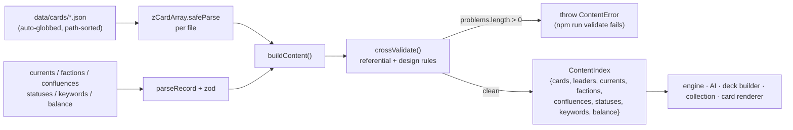
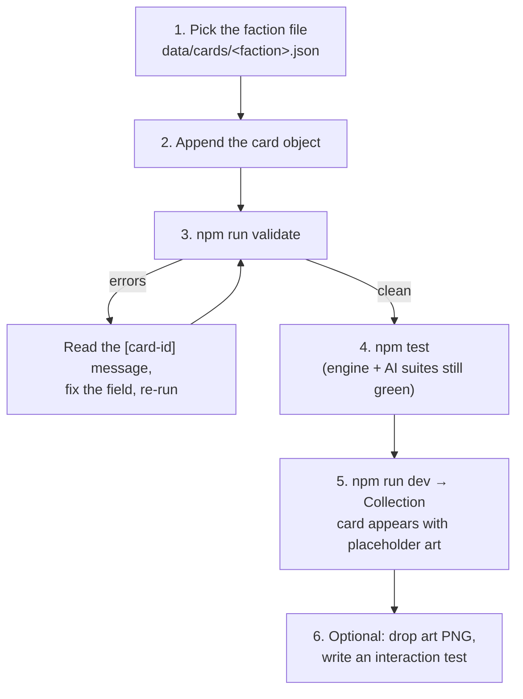
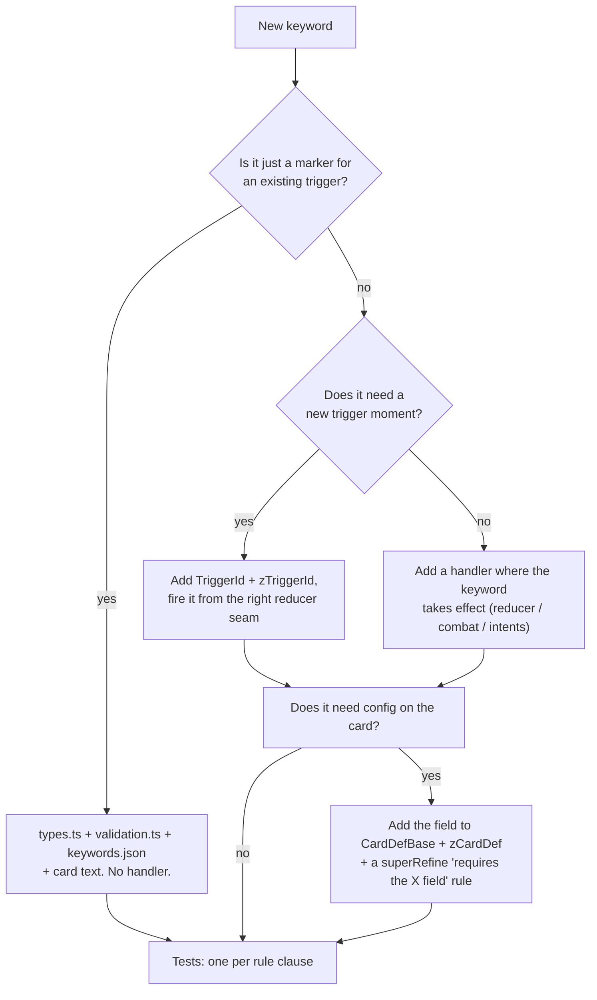

# HYPEBOUND — Card JSON Schema & Effects DSL

> **Status: implementation guide.** Subordinate to `../design/00-core-rules.md`
> (rules canon) and `./00-architecture-contract.md` (tech canon). The
> **executable** source of truth is `src/engine/types.ts` (shapes) and
> `src/engine/validation.ts` (zod schemas + cross-content checks). Where this
> guide and those two files disagree, **the code wins** — fix the guide and
> report it. Everything documented below is what the engine *actually does
> today*; behaviour that is specified but not yet wired is listed explicitly in
> §16 "Known gaps".

| At a glance | |
|---|---|
| Card data location | `data/cards/*.json` — one JSON **array** of card objects per file |
| File discovery | `import.meta.glob("../../data/cards/*.json", { eager: true })` in `src/engine/content.ts` — **adding a file requires zero code changes** |
| Schema | `zCardDef` / `zCardArray` in `src/engine/validation.ts` (`.strict()` — unknown fields are rejected) |
| Cross-file checks | `crossValidate(content)` in `src/engine/validation.ts` |
| Interpreter | `src/engine/effects.ts` (`runOp`, `resolveTargets`, `evalAmount`, `evalCondition`) |
| Validate command | `npm run validate` (→ `vitest run tests/data-validation.test.ts`) |
| Full test command | `npm test` · types: `npm run typecheck` |
| Card art | `public/assets/art/<card-id>.png` (falls back to procedural placeholder) |
| Audio | `data/audio-manifest.json` slots → `public/assets/audio/...` |
| Balance numbers | `data/balance.json` — never hardcode a number in a card |

---

## 1. Where card data lives and how it loads

```
data/
  cards/
    neon-idols.json          # every Neon Idols card INCLUDING its leaders
    gothic-royalty.json
    …one file per faction…
    neutral.json             # neutral (any-Current) collectible cards
    tokens.json              # summon-only tokens shared across factions
  currents.json  factions.json  confluences.json  statuses.json
  keywords.json  balance.json  ai-profiles.json  audio-manifest.json
```

Each `data/cards/*.json` file is a **JSON array**. It is not an object, so it
cannot carry a `_readme` key (record-shaped data files such as `factions.json`
may use `_`-prefixed keys — `content.ts` skips them). JSON has no comments:
design intent belongs in the faction design doc, not the data file.



Files are sorted by module path before parsing so that instance-id allocation
and every downstream iteration order stay **deterministic** across machines.
Duplicate card ids across files are a hard error.

---

## 2. Card object — common fields

Every card type shares this base (`CardDefBase` in `types.ts`, `zCardDef` in
`validation.ts`).

| Field | Type | Required | Semantics |
|---|---|---|---|
| `id` | `string` matching `^[a-z0-9]+(-[a-z0-9]+)*$` | yes | Globally unique kebab-case id, faction-prefixed (`idols-`, `royalty-`, `token-`, `neutral-`). Also the default art key and the collection key. |
| `name` | `string` (≥1 char) | yes | Display name. Comedic voice lives here. |
| `faction` | `FactionId` | yes | One of the 10 faction ids or `"neutral"`. |
| `current` | `CurrentId` | yes | `cinder \| tide \| root \| gale \| pulse \| halo \| veil \| prism`. Must be listed in the faction's `currents` (except leaders, which are checked against `primaryCurrent`, and tokens, which are exempt). |
| `type` | `CardType` | yes | `leader \| character \| action \| reaction \| equipment \| location \| transformation \| event`. |
| `rarity` | `Rarity` | yes | `common \| rare \| epic \| legendary`. Drives craft/dust value and copy limit (Legendary = 1 per deck). |
| `cost` | `int` 0–12 | yes | Hype cost. Leaders use `0`. |
| `tags` | `string[]` | yes (may be `[]`) | Free-form lowercase nouns used by `filter.tag` and by **Collab** (`idol`, `performer`, `fan`, `gear`, `venue`, `night-owl`, …). Tags are *not* validated against a list — keep them consistent by hand. |
| `keywords` | `KeywordId[]` | yes (may be `[]`) | Display + marker keywords, see §3. |
| `effects` | `EffectDef[]` | yes (may be `[]`) | The card's behaviour, see §5. |
| `text` | `string` | yes | Rules text shown on the card. Required to be non-empty for any non-token card that has effects. See §12. |
| `flavor` | `string` | no | Italic flavour line. Never rules-relevant. |
| `art` | `string` | no | Art asset key; defaults to `id`. Set it to share one image between cards/variants. |
| `token` | `boolean` | no | `true` = summon-only: excluded from decks, collection, packs and crafting (`collectibleCards()`), and not added to the discard pile when defeated. |
| `variantOf` | `string \| null` | no | Cosmetic variant of another card id (must exist). Variants are excluded from the collectible pool and never change rules. |
| `collab` | `{ kind: "current"\|"faction"\|"tag", value: string }` | when `keywords` includes `collab` | Parameter for the **Collab** keyword's card text. |
| `comeback` | `{ mode: "hand"\|"play", delayTurns: int ≥1 }` | when `keywords` includes `comeback` | Return mode and delay in **your** turns. |
| `grow` | `{ turns: int ≥1, ops: EffectOp[] }` | when `keywords` includes `grow` | Turn count and the upgrade ops run on completion. |
| `overload` | `int ≥1` | when `keywords` includes `overload` | Hype locked next turn when the card is played. |
| `finale` | `boolean` | no | Marks an alternate-win Legendary ("Finale" card, canon §2). Purely declarative today — the win condition itself is written with ops. |

### 2.1 Type-specific fields

| Type | Extra fields | Rules |
|---|---|---|
| `character` | `attack: int ≥0`, `health: int ≥1` | Both required. Occupies a board slot; summoning-sick unless it has `raid`. |
| `action` | — | Resolves `onPlay`, then goes to the discard pile. |
| `transformation` | — | An Action subtype; identical handling, distinguished for card text, filters and collection facets. |
| `reaction` | — | Must have **exactly one** effect with `trigger: "reaction"`, and that effect must set `reactionOn`. Set face-down; max 2 (`board.maxSetReactions`). |
| `equipment` | `equipAttack?: int`, `equipHealth?: int`, `grantKeywords?: KeywordId[]` | Attaches to a friendly character (targets[0] of the intent). Replaces the existing equipment. Never use `attack`/`health` here — the validator rejects it. |
| `location` | `durability?: int ≥1` | Occupies the single location slot. `durability` is consumed by `activate` uses; omit it for aura-only locations (`durability: null` at runtime = unlimited activations, still once per turn). |
| `event` | `durationTurns: int ≥1` | Required. Ticks at the start of each of the controller's turns; max 1 active per player. |
| `leader` | `health`, `primaryCurrent`, `secondaryCurrent?`, `passive: EffectDef[]`, `fixation: LeaderAbility`, `ultimate: LeaderAbility`, `title` | All required except `secondaryCurrent`. `current` **must equal** `primaryCurrent`. `health` must equal `balance.leader.startingHealth` (enforced by the content test). Fixation costs 3 Obsession, Ultimate 7 (`balance.obsession.*`). |

`LeaderAbility` = `{ name, obsessionCost, target?, ops, text }`. Its `target` is
resolved once from the intent and bound to `{ "select": "triggering" }` inside
`ops`, exactly like an effect's `target`.

### 2.2 Rules the validator enforces

**Per card (`zCardDef.superRefine`):**

| Rule | Error message fragment |
|---|---|
| Characters need `attack` and `health` | `characters need attack and health` |
| Events need `durationTurns` | `events need durationTurns` |
| Leaders need `health`, `primaryCurrent`, `fixation`, `ultimate`, `title`, `passive` | `leaders need …` |
| `leader.current` must equal `primaryCurrent` | `leader.current must equal primaryCurrent` |
| Reactions need exactly one `reaction` effect with `reactionOn` | `reaction cards need exactly one effect with trigger 'reaction'` |
| `collab` / `comeback` / `grow` / `overload` keyword ⇒ matching config field | `keyword X requires the X field` |
| Leader-only fields on a non-leader card | `leader-only fields present on non-leader card` |
| `attack`/`health` on a non-character (health also allowed on leaders) | `attack/health only allowed on characters` |
| Non-token card with effects and empty `text` | `non-token cards with effects need rules text` |
| `trigger: "reaction"` only on reaction cards | `trigger 'reaction' only on reaction cards` |
| `trigger: "eventTick"` only on event cards | `trigger 'eventTick' only on event cards` |
| `trigger: "activate"` only on location cards | `trigger 'activate' only on location cards` |
| Unknown field anywhere (`.strict()`) | `Unrecognized key(s) in object` |

**Across all content (`crossValidate`):**

| Rule | Error message fragment |
|---|---|
| Duplicate card id | `duplicate card id: <id>` |
| Card's `current` not permitted for its faction (non-leader, non-token) | `current 'x' not permitted for faction 'y'` |
| Leader's primary/secondary Current not in the faction's currents | `leader primaryCurrent … not in faction currents` |
| `variantOf` points at a missing card | `variantOf references unknown card` |
| `summon.cardId` unknown or not a character | `summon references unknown card` / `is not a character` |
| `transform.intoCardId` unknown or not a character | `transform references unknown card` / `is not a character` |
| Confluence other than `refraction` missing its Current pair | `missing currents pair` |
| Advantage graph: Prism beats nothing; every other Current beats exactly one | `prism must have no natural advantage` |

Op references are checked **recursively** — inside `ops`, `then`, `else`, and
`options[].ops`, plus `grow.ops`, leader `passive`, `fixation.ops` and
`ultimate.ops`.

**Additional content-health assertions** live in `tests/data-validation.test.ts`
(they fail `npm run validate` too): every card with effects/keywords has
non-empty text; character `attack + health ≤ 2 × cost + 2`; every faction with
cards has a leader; every leader's ability costs match `balance.json`; all 8
Currents, all 9 Confluences, every Current has a Resonance.

---

## 3. Keywords

`KeywordId` is a closed union of 16 ids (`types.ts`) mirrored by `zKeywordId`
(`validation.ts`) and by `data/keywords.json` (names + canonical reminder text).

| Keyword | Config field | What the engine does with it |
|---|---|---|
| `viral` | — | On play (unless the instance is itself a viral copy) adds a copy of the card to your hand with `costDelta: -1`, flagged `viralCopy: true` so it cannot copy again. |
| `spotlight` | — | `legalAttackTargets` restricts the enemy to Spotlight characters while any is attackable. |
| `parasocial` | — | Whenever the controller *supports* the character (heal / positive status / buff / equip) it gains +1/+1 and its controller gains 1 Obsession. |
| `trending` | — | `effectiveCost` subtracts `cardsPlayedThisTurn`, floored at 1. |
| `collab` | `collab` | **Card text only.** The bonus itself is authored as an `if`/`condition` using `controlsAtLeast` — see the Backup Dancer pattern in `data/cards/neon-idols.json`. |
| `comeback` | `comeback` | On defeat, schedules a return at `globalTurnCounter + delayTurns × 2` (i.e. *your* next turn for `delayTurns: 1`) to hand or directly into play. |
| `raid` | — | Skips summoning sickness in `canAttack`. |
| `touch-grass` | — | Marker for banish cards; the banish itself is the `banish` op (which emits `keywordTriggered: "touch-grass"`). |
| `afterparty` | — | Marker; the behaviour is an effect with `trigger: "afterparty"`. |
| `rushwind` | — | On play, if this is **not** the first card played this turn, runs the card's `rushwind` effects. |
| `flow` | — | Marker; the behaviour is an effect with `trigger: "flow"`. |
| `grow` | `grow` | At the end of each of the controller's turns, `growProgress += 1`; at `grow.turns` it runs `grow.ops` once and fires `growComplete`. |
| `overload` | `overload` | On play, adds `overload` to `hypeLockedNextTurn`. (The `lockHype` op does the same thing from inside an effect — **do not use both** on one card or the debt doubles.) |
| `inspire` | — | Marker; the behaviour is an effect with `trigger: "inspire"`. |
| `corrupt` | — | Pure card-text marker (canon §6): the "darker version" is authored with `chooseOne` branches or a second effect. |
| `refract` | — | Makes the play intent require `refractChoice`; the chosen Current becomes the played card's Current for Confluence/Resonance tracking and (for characters) the summoned instance's Current. |

---

## 4. Effect definition (`EffectDef`)

```jsonc
{
  "trigger": "onPlay",                 // required — see §5
  "target": { "select": "choose", "side": "friendly", "zone": "board" },
  "playedFilter": { "type": ["character"] },   // only for trigger "onCardPlayed"
  "reactionOn": "enemyAttacksLeader",          // only for trigger "reaction"
  "condition": { "kind": "cardsPlayedThisTurnAtLeast", "value": 2 },
  "ops": [ { "op": "buff", "target": { "select": "triggering" }, "attack": 1, "health": 1 } ],
  "once": false,
  "text": "On play: give a friendly character +1/+1."
}
```

Resolution order inside `runEffect`:

1. If `condition` is present and evaluates false → the whole effect is skipped.
2. If `target` is present → it is resolved **once** and bound to
   `{ "select": "triggering" }` for every op in the effect. A mandatory
   (`optional` absent/false) `choose` target that resolves to zero refs aborts
   the effect.
3. `ops` run in array order, top to bottom.

**The one-target/many-ops pattern is the backbone of the DSL.** Ask the player
for one target on the *effect*, then address it repeatedly with
`{ "select": "triggering" }` in the ops (heal it, shield it, buff it). Never ask
for the same target twice.

`text` on an effect is the per-effect fragment used by the card inspector and
the (planned) auto-templater; `text` on the card is what is printed. Keep them
consistent — the card text is normally the effect fragments joined by spaces,
prefixed by the keyword line.

---

## 5. Triggers

All 19 `TriggerId` values, with the exact firing behaviour of `triggers.ts` +
`effects.ts`.

| Trigger | Fires when | Bound to `triggering` | Notes |
|---|---|---|---|
| `onPlay` | The card is played from hand | the intent's chosen targets (via the effect's `target`) | The only trigger that can prompt the player. Run twice by the **Refraction** Confluence. |
| `onDefeat` | This character is defeated | the dying character | Runs *before* the character leaves the board; only that character's own effects fire. |
| `afterparty` | End of a turn (canon: *your* turn — see §16 G2) | — | Resolves first in the end-of-turn order, before Scorched and Grow. |
| `startOfTurn` | Start of a turn (canon: *your* turn — see §16 G2) | — | Runs after banish/comeback/delayed returns and the turn draw. |
| `onAttack` | This character declares an attack | the attacker | Fires **before** damage; may remove the target (the reducer re-checks legality). |
| `onDamaged` | This character took ≥1 damage and is still resolving | the damaged entity | Fires for characters only, not leaders. |
| `onHealed` | This character was healed for ≥1 | the healed entity | Fires before `inspire`. |
| `inspire` | A friendly character was healed, given a positive status, or buffed | the supported character | Controller-filtered: only the supporter's own listeners fire. |
| `flow` | A friendly card was returned to hand (and other "exchange" moments) | the returned character | Controller-filtered. |
| `rushwind` | On play, when this is not the first card played this turn | the intent's targets | Requires `keywords: ["rushwind"]` on the card. |
| `onTargeted` | Reserved for Parasocial-style hooks | the targeted character | The shipped Parasocial behaviour is hardcoded in `fireSupportTriggers`; this trigger is available for card-specific extras. |
| `onCardPlayed` | The controller plays another card | the summoned character, if any | Currently unfiltered (see §16 G3). |
| `growComplete` | `grow.turns` end-of-turns survived | the grown character | Fires immediately after `grow.ops` run. |
| `aura` | Continuously, at read time | the aura's targets | Only meaningful with the `aura` op. Suspended by **Eclipse**. |
| `reaction` | The face-down Reaction's `reactionOn` condition occurs | the triggering entity (attacker or summoned character) | Reaction cards only; the card is spent and goes to the discard pile. |
| `activate` | The `activateLocation` intent | the intent's chosen targets | Location cards only. Once per turn; consumes 1 durability. |
| `onReturnToHand` | This card returns from play to hand | the card | Declared and validated; author cards against it only after adding the dispatch call. |
| `onDiscard` | This card is discarded from hand by a `discard` op | — | Fires with the discarded card as the effect source. |
| `eventTick` | Start of a turn while this Event is active | — | Event cards only; also decrements `remainingTurns`. |

```jsonc
// one example per commonly used trigger
{ "trigger": "onPlay",   "ops": [ { "op": "draw", "count": 1 } ] }
{ "trigger": "onDefeat", "ops": [ { "op": "summon", "cardId": "token-glitchling" } ] }
{ "trigger": "afterparty","ops": [ { "op": "damage", "target": { "select": "leader", "side": "enemy" }, "amount": 1 } ] }
{ "trigger": "startOfTurn","ops":[ { "op": "heal", "target": { "select": "leader", "side": "friendly" }, "amount": 1 } ] }
{ "trigger": "onAttack",  "ops": [ { "op": "applyStatus", "target": { "select": "triggering" }, "status": "empowered", "amount": 1, "durationTurns": 1 } ] }
{ "trigger": "onDamaged", "ops": [ { "op": "buff", "target": { "select": "self" }, "attack": 1 } ] }
{ "trigger": "onHealed",  "ops": [ { "op": "draw", "count": 1 } ] }
{ "trigger": "inspire",   "ops": [ { "op": "buff", "target": { "select": "self" }, "attack": 1 } ] }
{ "trigger": "flow",      "ops": [ { "op": "gainHype", "amount": 1 } ] }
{ "trigger": "rushwind",  "ops": [ { "op": "draw", "count": 1 } ] }
{ "trigger": "onCardPlayed", "playedFilter": { "type": ["action"] }, "ops": [ { "op": "buff", "target": { "select": "self" }, "attack": 1 } ] }
{ "trigger": "growComplete", "ops": [ { "op": "addKeyword", "target": { "select": "self" }, "keyword": "spotlight" } ] }
{ "trigger": "aura",      "ops": [ { "op": "aura", "target": { "select": "all", "side": "friendly", "zone": "board", "filter": { "tag": ["idol"] } }, "attack": 1 } ] }
{ "trigger": "reaction",  "reactionOn": "enemyAttacksLeader", "ops": [ { "op": "applyStatus", "target": { "select": "leader", "side": "friendly" }, "status": "armor", "amount": 3 } ] }
{ "trigger": "activate",  "target": { "select": "choose", "side": "friendly", "zone": "board" }, "ops": [ { "op": "heal", "target": { "select": "triggering" }, "amount": 2 } ] }
{ "trigger": "onDiscard", "ops": [ { "op": "summon", "cardId": "token-glitchling" } ] }
{ "trigger": "eventTick", "ops": [ { "op": "draw", "count": 1 } ] }
```

### 5.1 Reaction conditions (`ReactionConditionId`)

| Condition | Fires when | `triggering` binding | Dispatched today |
|---|---|---|---|
| `enemyPlaysCharacter` | The enemy plays a Character | the summoned character | yes (`applyPlayCard`) |
| `enemyPlaysAction` | The enemy plays any non-Character card | — | yes (`applyPlayCard`) |
| `enemyAttacksLeader` | The enemy declares an attack on your leader | the attacker | yes (`applyAttack`, **before** damage) |
| `enemyAttacksCharacter` | The enemy declares an attack on your character | the attacker | yes (`applyAttack`, before damage) |
| `enemyUsesFixation` | The enemy uses Fixation or Ultimate Fixation | — | yes (`applyFixation`, after the ability resolves) |
| `enemyActivatesConfluence` | The enemy activates a Confluence | — | yes (`applyConfluence`) |
| `friendlyCharacterDefeated` | One of your characters dies | — | **not yet dispatched** (§16 G5) |
| `friendlyLeaderDamaged` | Your leader takes damage | — | **not yet dispatched** (§16 G5) |

Reactions fire automatically, resolve fully, and are discarded. They are hidden
from the opponent (`redact()` exposes only `reactionCount`).

---

## 6. Targeting (`TargetSpec`)

```jsonc
{
  "select": "choose",          // required
  "side": "friendly",          // friendly | enemy | any     (default: friendly)
  "zone": "board",             // board | hand | deck | discard | location
  "filter": { "tag": ["idol"], "excludeSelf": true },
  "count": 1,                  // for choose / random (default 1)
  "optional": true             // may resolve to zero targets
}
```

### 6.1 `select` values

| Value | Resolves to | Notes |
|---|---|---|
| `choose` | The next `count` refs from the intent's `targets[]` | Legality is pre-validated by `checkPlayable` + the reducer against `legalChooseTargets`. Keep `count: 1` per choose spec — the reducer validates one ref per spec index. |
| `all` | Every board character matching `side` + `filter` | Returns **nothing** when `zone` is `hand`, `deck`, `discard` or `location`. |
| `random` | `count` random board characters matching `side` + `filter` | Uses the match rng (`pickMany`) — deterministic under replay. Never selects leaders. |
| `self` | The effect's source character | Empty for actions/locations/events with no source character. |
| `adjacent` | The source character's board neighbours (slots ±1) | Skips empty slots. |
| `leader` | The leader(s) of the seats implied by `side` | `side: "any"` yields both leaders. This — not `choose` — is how you hit a leader. |
| `triggering` | The current binding: the effect's resolved `target`, the entity that fired the trigger, or the current `forEach` item | The workhorse selector. |

### 6.2 `side` and `zone`

`side` is evaluated relative to the **effect's controller** (`ctx.seat`), which
for a triggered effect is the listener's controller, not the acting player.
Default is `friendly`.

`zone` currently narrows only `all` (as described above); character selection
always walks the board. Hand/deck/discard manipulation is done by dedicated ops
(`discard`, `modifyCost`, `stealCopy`, `resurrect`, `mill`, `scry`), which read
`target.side` (where applicable) and ignore the rest of the spec.

### 6.3 `filter` (`TargetFilter`)

| Field | Type | Matches when |
|---|---|---|
| `current` | `CurrentId[]` | The character's **runtime** Current (post-Refract) is in the list |
| `faction` | `FactionId[]` | The character's card faction is in the list |
| `tag` | `string[]` | The character has **at least one** of these tags |
| `type` | `CardType[]` | The character's card type is in the list — also the switch that makes leaders choosable (§6.4) |
| `costMax` / `costMin` | `int` | Base card cost ≤ / ≥ the value |
| `hasKeyword` | `KeywordId` | The character's runtime keyword list contains it |
| `hasStatus` | `StatusId` | The character currently has that status |
| `isDamaged` | `boolean` | `health < effectiveMaxHealth` equals the flag |
| `excludeSelf` | `boolean` | Drops the effect's own source character from the candidates |

Enemy characters that are **Lurking** or **Warded** are removed from every
candidate list automatically (`isTargetable`). Friendly targeting ignores both.

### 6.4 Targeting a leader

* Automatic: `{ "select": "leader", "side": "enemy" }`.
* Player-chosen: `{ "select": "choose", "side": "any", "filter": { "type": ["leader"] } }`
  — leaders are added to the legal set **only** when `filter.type` includes
  `"leader"` and the filter contains no character-only clause
  (`tag`, `hasKeyword`, `hasStatus`, `current`, `isDamaged`).
* `select: "random"` never returns a leader.

---

## 7. Amount expressions (`AmountExpr`)

A closed set — not a scripting language. Anywhere an amount is accepted you may
write a plain integer or one of these objects.

| Expression | Value |
|---|---|
| `4` | The literal number |
| `{ "kind": "count", "target": { … } }` | How many refs the target spec resolves to |
| `{ "kind": "perTurnCardsPlayed" }` | Controller's `cardsPlayedThisTurn` |
| `{ "kind": "obsession", "side": "friendly" \| "enemy" }` | That player's Obsession (0–10) |
| `{ "kind": "hypeSpentThisTurn" }` | Controller's Hype spent this turn |
| `{ "kind": "fatigueCounter", "side": "friendly" \| "enemy" }` | That player's Burnout counter |

```jsonc
{ "op": "damage", "target": { "select": "leader", "side": "enemy" }, "amount": 3 }
{ "op": "buff",   "target": { "select": "self" },
  "attack": { "kind": "count", "target": { "select": "all", "side": "friendly", "zone": "board", "filter": { "tag": ["follower"] } } } }
{ "op": "draw",   "count": { "kind": "perTurnCardsPlayed" } }
{ "op": "heal",   "target": { "select": "leader", "side": "friendly" }, "amount": { "kind": "obsession", "side": "friendly" } }
{ "op": "damage", "target": { "select": "all", "side": "enemy", "zone": "board" }, "amount": { "kind": "hypeSpentThisTurn" } }
{ "op": "damage", "target": { "select": "leader", "side": "enemy" }, "amount": { "kind": "fatigueCounter", "side": "enemy" } }
```

---

## 8. Condition expressions (`ConditionExpr`)

Used by `EffectDef.condition` and by the `if` op. Every side-taking condition
is relative to the effect's controller.

| Expression | True when |
|---|---|
| `{ "kind": "controlsAtLeast", "target": {…}, "min": 1 }` | The target spec resolves to ≥ `min` refs |
| `{ "kind": "obsessionAtLeast", "side": "enemy", "value": 8 }` | That player's Obsession ≥ value (8 = **Obsessed**) |
| `{ "kind": "handSizeAtLeast", "side": "friendly", "value": 5 }` | That player's hand size ≥ value |
| `{ "kind": "cardsPlayedThisTurnAtLeast", "value": 3 }` | Controller played ≥ value cards this turn |
| `{ "kind": "leaderHealthAtMost", "side": "enemy", "value": 10 }` | That leader's health ≤ value |
| `{ "kind": "currentPlayedThisTurn", "current": "veil" }` | Controller played a card of that Current this turn |
| `{ "kind": "not", "c": {…} }` | The inner condition is false |
| `{ "kind": "and", "list": [ … ] }` | Every listed condition is true |
| `{ "kind": "or", "list": [ … ] }` | Any listed condition is true |

```jsonc
{
  "trigger": "onPlay",
  "condition": {
    "kind": "and",
    "list": [
      { "kind": "cardsPlayedThisTurnAtLeast", "value": 2 },
      { "kind": "not", "c": { "kind": "obsessionAtLeast", "side": "friendly", "value": 8 } }
    ]
  },
  "ops": [ { "op": "gainObsession", "amount": 2 } ],
  "text": "If you played 2 other cards this turn and are not Obsessed, gain 2 Obsession."
}
```

---

## 9. Ops — the interpreter opcodes

38 opcodes, grouped. Every op below is executed by `runOp` in
`src/engine/effects.ts`.

### 9.1 Damage, healing and stats

| Op | One-line semantic |
|---|---|
| `damage` | Deal `amount` to each target; Shielded negates the whole instance (unless `ignoresShield`), Armor absorbs point-for-point, an Obsessed enemy leader takes +1; then defeated characters are cleaned up. |
| `heal` | Restore up to `amount` (capped at effective max health); blocked while Blackflame's heal-lock is active; fires `onHealed` + support triggers. |
| `buff` | Add `attack` / `health` permanently to each target (health raises both current and max) and fire support triggers. |
| `setStats` | Overwrite attack and health (and max health) with fixed numbers. |
| `swapAttackHealth` | Swap a character's current attack and health. |
| `attackAgain` | Refund one attack this turn (`attacksUsedThisTurn − 1`, floor 0). |

```jsonc
{ "op": "damage", "target": { "select": "choose", "side": "enemy", "zone": "board" }, "amount": 3 }
{ "op": "damage", "target": { "select": "triggering" }, "amount": 4, "ignoresShield": true, "cantBeHealedUntilNextTurn": true }
{ "op": "heal", "target": { "select": "all", "side": "friendly", "zone": "board" }, "amount": 2 }
{ "op": "buff", "target": { "select": "triggering" }, "attack": 2, "health": 1 }
{ "op": "setStats", "target": { "select": "triggering" }, "attack": 4, "health": 4 }
{ "op": "swapAttackHealth", "target": { "select": "self" } }
{ "op": "attackAgain", "target": { "select": "choose", "side": "friendly", "zone": "board" } }
```

### 9.2 Statuses and keywords

| Op | One-line semantic |
|---|---|
| `applyStatus` | Apply a status with optional `amount` (Armor/Weakened/Empowered stack) and `durationTurns` (omit = permanent); Armor on a leader goes to the leader's armor pool; positive statuses count as *support*. |
| `removeStatus` | With `status`: remove **all** instances of it. With only `polarity`: remove **exactly one** status of that polarity (the Sanctuary pattern). |
| `cancel` | Apply **Cancelled** (blank text, cannot attack) for `durationTurns` (omit = until it leaves play). |
| `addKeyword` / `removeKeyword` | Add/remove a keyword on the targeted character instances. |
| `refract` | Set the source character's Current to `intoCurrent` (**always specify it** — see §16 G9). |

```jsonc
{ "op": "applyStatus", "target": { "select": "triggering" }, "status": "shielded" }
{ "op": "applyStatus", "target": { "select": "all", "side": "enemy", "zone": "board" }, "status": "weakened", "amount": 1, "durationTurns": 1 }
{ "op": "removeStatus", "target": { "select": "triggering" }, "polarity": "negative" }
{ "op": "removeStatus", "target": { "select": "all", "side": "enemy", "zone": "board" }, "status": "shielded" }
{ "op": "cancel", "target": { "select": "choose", "side": "enemy", "zone": "board" }, "durationTurns": 2 }
{ "op": "addKeyword", "target": { "select": "self" }, "keyword": "spotlight" }
{ "op": "removeKeyword", "target": { "select": "triggering" }, "keyword": "spotlight" }
{ "op": "refract", "intoCurrent": "cinder" }
```

### 9.3 Board manipulation

| Op | One-line semantic |
|---|---|
| `summon` | Put `count` copies of `cardId` (must be a Character) into the first free slots of the chosen side; silently no-ops when the board is full. |
| `destroy` | Defeat the targets outright (runs `onDefeat`, Comeback scheduling and discard placement). |
| `transform` | Replace the target in its slot with a fresh instance of `intoCardId` — all buffs, statuses and equipment are lost and the new body is summoning-sick. |
| `returnToHand` | Return characters to their owner's hand (tokens are destroyed instead); fires **Flow**; burns if the hand is full. |
| `banish` | **Touch Grass**: remove from play, strip statuses/equipment/buffs, return at the start of your next turn (set `returnAtStartOfYourNextTurn: false` for permanent removal). |
| `resurrect` | Summon `count` random Character cards from your discard pile. |
| `destroyEquipment` | Destroy the equipment attached to the targets. |
| `disableAuras` | **Eclipse**: suspend every aura for `durationTurns` of your turns. |

```jsonc
{ "op": "summon", "cardId": "token-follower", "count": 2 }
{ "op": "summon", "cardId": "token-glitchling", "side": "enemy" }
{ "op": "destroy", "target": { "select": "choose", "side": "enemy", "zone": "board", "filter": { "hasStatus": "cursed" } } }
{ "op": "transform", "target": { "select": "triggering" }, "intoCardId": "token-main-character" }
{ "op": "returnToHand", "target": { "select": "choose", "side": "any", "zone": "board" } }
{ "op": "banish", "target": { "select": "choose", "side": "enemy", "zone": "board" }, "returnAtStartOfYourNextTurn": true }
{ "op": "resurrect", "target": { "select": "self" }, "count": 1 }
{ "op": "destroyEquipment", "target": { "select": "choose", "side": "enemy", "zone": "board" } }
{ "op": "disableAuras", "durationTurns": 1 }
```

### 9.4 Cards, hand and deck

| Op | One-line semantic |
|---|---|
| `draw` | Draw `count` cards for the chosen side (empty deck ⇒ Burnout damage; full hand ⇒ the card is burned to the discard pile). |
| `discard` | Discard `count` **random** cards from the hand of the side named by `target.side`; fires each discarded card's `onDiscard` effects. |
| `copyCardToHand` | Add a copy of each targeted character's card to your hand, with an optional `costDelta`. |
| `stealCopy` | Copy `count` random cards out of the enemy's hand, deck or discard into your hand (the originals stay). |
| `mill` | Move `count` cards from the top of a deck to that player's discard pile (no Burnout). |
| `scry` | Algorithm Syndicate deck manipulation: `bottomOne` sends one of the top `count` to the bottom; `reorder` re-arranges the top `count`. |
| `modifyCost` | Change the cost of matching cards **in hand** by `delta` (matches on `filter.type`, `filter.current`, `filter.tag` only). |

```jsonc
{ "op": "draw", "count": 2 }
{ "op": "draw", "count": 1, "side": "enemy" }
{ "op": "discard", "target": { "select": "all", "side": "enemy" }, "count": 1 }
{ "op": "copyCardToHand", "target": { "select": "choose", "side": "enemy", "zone": "board" }, "costDelta": -1 }
{ "op": "stealCopy", "from": "enemyDeck", "count": 1 }
{ "op": "mill", "count": 2, "side": "enemy" }
{ "op": "scry", "count": 3, "mode": "bottomOne" }
{ "op": "modifyCost", "target": { "select": "all", "side": "friendly", "filter": { "type": ["character"] } }, "delta": -1 }
```

### 9.5 Resources

| Op | One-line semantic |
|---|---|
| `gainHype` | Gain Hype this turn only, or with `permanent: true` raise max Hype (capped at `hype.cap`). |
| `lockHype` | **Overload**: lock that much Hype on your next turn. |
| `gainObsession` / `removeObsession` | Move a player's Obsession meter, clamped to 0–10, emitting threshold events. |

```jsonc
{ "op": "gainHype", "amount": 1 }
{ "op": "gainHype", "amount": 1, "permanent": true }
{ "op": "lockHype", "amount": 2 }
{ "op": "gainObsession", "amount": 2 }
{ "op": "removeObsession", "amount": 3, "side": "enemy" }
```

### 9.6 Control flow and scheduling

| Op | One-line semantic |
|---|---|
| `chooseOne` | Branch on a player choice; the branch index comes from `intent.choices` in encounter order (defaults to option 0 when no choice was supplied). |
| `randomOp` | Pick one branch using the match rng, optionally weighted — the only sanctioned randomness in card design. |
| `forEach` | Run `ops` once per resolved target, with that target bound to `triggering`. |
| `if` | Run `then` when the condition holds, otherwise `else`. |
| `scheduleDelayed` | Queue `ops` to run at the start of your turn `delayTurns` turns from now, with a label shown in the UI. |
| `aura` | Declare a continuous modifier (only under `trigger: "aura"`); recomputed on read, suspended by Eclipse. |

```jsonc
{ "op": "chooseOne", "options": [
    { "label": "Encore", "ops": [ { "op": "buff", "target": { "select": "triggering" }, "attack": 2, "health": 2 } ] },
    { "label": "Corrupt", "ops": [ { "op": "damage", "target": { "select": "triggering" }, "amount": 4 },
                                   { "op": "gainObsession", "amount": 1 } ] } ] }
{ "op": "randomOp", "options": [
    { "weight": 3, "ops": [ { "op": "summon", "cardId": "token-follower" } ] },
    { "weight": 1, "ops": [ { "op": "summon", "cardId": "token-main-character" } ] } ] }
{ "op": "forEach", "target": { "select": "all", "side": "friendly", "zone": "board", "filter": { "tag": ["idol"] } },
  "ops": [ { "op": "applyStatus", "target": { "select": "triggering" }, "status": "shielded" } ] }
{ "op": "if", "condition": { "kind": "leaderHealthAtMost", "side": "enemy", "value": 10 },
  "then": [ { "op": "damage", "target": { "select": "leader", "side": "enemy" }, "amount": 4 } ],
  "else": [ { "op": "draw", "count": 1 } ] }
{ "op": "scheduleDelayed", "delayTurns": 2, "label": "Album Drop",
  "ops": [ { "op": "summon", "cardId": "token-main-character" } ] }
{ "op": "aura", "target": { "select": "all", "side": "friendly", "zone": "board", "filter": { "tag": ["idol"] } }, "attack": 1 }
```

### 9.7 Op reference — quick index

| Op | Required fields | Optional fields |
|---|---|---|
| `damage` | `target`, `amount` | `ignoresShield`, `cantBeHealedUntilNextTurn` |
| `heal` | `target`, `amount` | — |
| `buff` | `target` | `attack`, `health`, `permanent` |
| `setStats` | `target`, `attack`, `health` | — |
| `summon` | `cardId` | `count`, `side` |
| `draw` | `count` | `side` |
| `discard` | `target` | `count` |
| `returnToHand` | `target` | — |
| `applyStatus` | `target`, `status` | `amount`, `durationTurns` |
| `removeStatus` | `target` | `status`, `polarity` |
| `destroy` | `target` | — |
| `transform` | `target`, `intoCardId` | — |
| `copyCardToHand` | `target` | `costDelta` |
| `stealCopy` | `from` | `count` |
| `banish` | `target` | `returnAtStartOfYourNextTurn` |
| `cancel` | `target` | `durationTurns` |
| `destroyEquipment` | `target` | — |
| `gainHype` | `amount` | `permanent`, `side` |
| `lockHype` | `amount` | — |
| `gainObsession` / `removeObsession` | `amount` | `side` |
| `addKeyword` / `removeKeyword` | `target`, `keyword` | — |
| `modifyCost` | `target`, `delta` | — |
| `chooseOne` | `options` (≥2) | — |
| `randomOp` | `options` (≥2) | `options[].weight` |
| `forEach` | `target`, `ops` | — |
| `if` | `condition`, `then` | `else` |
| `scheduleDelayed` | `delayTurns` (≥1), `ops`, `label` | — |
| `disableAuras` | `durationTurns` (≥1) | — |
| `resurrect` | `target` | `count` |
| `mill` | `count` | `side` |
| `scry` | `count` (≥1), `mode` | — |
| `swapAttackHealth` | `target` | — |
| `refract` | — | `intoCurrent` |
| `attackAgain` | `target` | — |
| `aura` | `target` | `attack`, `health`, `costDelta`, `grantKeyword` |

---

## 10. Worked example 1 — Character with keywords

`data/cards/afterparty-crew.json`

```json
{
  "id": "crew-last-call-bartender",
  "name": "Last-Call Bartender",
  "faction": "afterparty-crew",
  "current": "tide",
  "type": "character",
  "rarity": "rare",
  "cost": 4,
  "attack": 3,
  "health": 5,
  "tags": ["night-owl", "host"],
  "keywords": ["spotlight", "afterparty", "collab"],
  "collab": { "kind": "tag", "value": "night-owl" },
  "effects": [
    {
      "trigger": "afterparty",
      "condition": {
        "kind": "controlsAtLeast",
        "target": {
          "select": "all",
          "side": "friendly",
          "zone": "board",
          "filter": { "tag": ["night-owl"], "excludeSelf": true }
        },
        "min": 1
      },
      "ops": [
        { "op": "heal", "target": { "select": "all", "side": "friendly", "zone": "board" }, "amount": 1 },
        { "op": "damage", "target": { "select": "leader", "side": "enemy" }, "amount": 1 }
      ],
      "text": "**Afterparty** — **Collab (Night Owl):** restore 1 health to your characters and deal 1 damage to the enemy leader."
    }
  ],
  "text": "**Spotlight.** **Afterparty** — **Collab (Night Owl):** restore 1 health to your characters and deal 1 damage to the enemy leader.",
  "flavor": "\"You don't have to go home. You do have to stop explaining the lore.\""
}
```

**Generated card text (Rare ⇒ reminder text shown):**

> **Spotlight.** *(Enemies must attack characters with Spotlight before other
> targets.)* **Afterparty** — **Collab (Night Owl):** restore 1 health to your
> characters and deal 1 damage to the enemy leader.

**Runtime walkthrough.** At the end of a turn the reducer fires `afterparty`
before Scorched and Grow. The condition counts other friendly `night-owl`
characters; with at least one, the ops run in order: the heal touches every
friendly character (each successful heal is *support*, so it fires `inspire`
listeners, Parasocial bonuses and — once per turn — +1 Obsession), then 1
damage hits the enemy leader (+1 more if that leader is Obsessed). Stat budget:
3 + 5 = 8 ≤ 2 × 4 + 2, so the content-health test passes.

## 11. Worked example 2 — Reaction

`data/cards/touch-grass-order.json`

```json
{
  "id": "grass-log-off-warning",
  "name": "Log-Off Warning",
  "faction": "touch-grass-order",
  "current": "gale",
  "type": "reaction",
  "rarity": "rare",
  "cost": 2,
  "tags": ["intervention"],
  "keywords": ["touch-grass"],
  "effects": [
    {
      "trigger": "reaction",
      "reactionOn": "enemyPlaysCharacter",
      "ops": [
        { "op": "banish", "target": { "select": "triggering" }, "returnAtStartOfYourNextTurn": true },
        {
          "op": "if",
          "condition": { "kind": "obsessionAtLeast", "side": "enemy", "value": 8 },
          "then": [ { "op": "removeObsession", "amount": 3, "side": "enemy" } ]
        }
      ],
      "text": "Reaction — when the enemy plays a character: **Touch Grass** it. If that player is Obsessed, they lose 3 Obsession."
    }
  ],
  "text": "Reaction — when the enemy plays a character: **Touch Grass** it. If that player is Obsessed, they lose 3 Obsession.",
  "flavor": "Sent at 4:11 a.m. Read at 4:11 a.m. Ignored at 4:12 a.m."
}
```

**Generated card text (Rare ⇒ reminder text shown):**

> Reaction — when the enemy plays a character: **Touch Grass** *(Banish a
> character until the start of your next turn; it returns with base stats and no
> statuses or attachments.)* it. If that player is Obsessed, they lose 3
> Obsession.

**Runtime walkthrough.** Playing this card costs 2 Hype and sets it face-down
(max 2 set Reactions). When the enemy next summons a character from hand,
`applyPlayCard` calls `fireReactions(... "enemyPlaysCharacter", [ref of the new
character])`, so `{ "select": "triggering" }` is that character. `banish` strips
its buffs/statuses/equipment and schedules its return at the start of its
controller's next turn. The card is then discarded and its `reactionCount`
drops — the opponent learns what it was only from the `reactionTriggered` event.

## 12. Worked example 3 — Equipment

`data/cards/cosplay-champions.json`

```json
{
  "id": "champ-foam-greatsword",
  "name": "Foam Greatsword",
  "faction": "cosplay-champions",
  "current": "tide",
  "type": "equipment",
  "rarity": "rare",
  "cost": 3,
  "equipAttack": 2,
  "equipHealth": 1,
  "grantKeywords": ["raid"],
  "tags": ["gear", "prop"],
  "keywords": ["flow"],
  "effects": [
    {
      "trigger": "flow",
      "ops": [ { "op": "buff", "target": { "select": "self" }, "attack": 1 } ],
      "text": "**Flow:** the equipped character gains +1/+0."
    }
  ],
  "text": "Equipped character has +2/+1 and **Raid**. **Flow:** the equipped character gains +1/+0.",
  "flavor": "Weighs nothing. Cost four weekends. Cannot be checked as luggage."
}
```

**Generated card text (Rare ⇒ reminder text shown):**

> Equipped character has +2/+1 and **Raid** *(Can attack the turn it is
> played.)*. **Flow:** *(Triggers when a friendly card is returned to your hand,
> replayed, healed, or exchanged.)* the equipped character gains +1/+0.

**Runtime walkthrough.** Equipment is played with `targets[0]` = a friendly
character; the reducer replaces any existing equipment, pushes `grantKeywords`
onto the wearer's keyword list, emits `equipped`, and fires support triggers
(equipping counts as support: Inspire, Parasocial, +1 Obsession once per turn).
`equipAttack`/`equipHealth` are read live by `effectiveAttack` /
`effectiveMaxHealth`, so destroying the equipment removes the stats — but note
granted keywords currently persist (§16 G7). The equipment's own `flow` effect
is collected by `collectTriggers` with the **wearer** as its source character,
which is why `{ "select": "self" }` means the wearer here.

## 13. Worked example 4 — Location

`data/cards/gothic-royalty.json`

```json
{
  "id": "royalty-mourning-gardens",
  "name": "The Mourning Gardens",
  "faction": "gothic-royalty",
  "current": "root",
  "type": "location",
  "rarity": "epic",
  "cost": 4,
  "durability": 3,
  "tags": ["venue", "court"],
  "keywords": [],
  "effects": [
    {
      "trigger": "aura",
      "ops": [
        {
          "op": "aura",
          "target": { "select": "all", "side": "friendly", "zone": "board", "filter": { "tag": ["noble"] } },
          "attack": 1
        }
      ],
      "text": "Your Nobles have +1/+0."
    },
    {
      "trigger": "activate",
      "target": { "select": "choose", "side": "friendly", "zone": "board" },
      "ops": [
        { "op": "heal", "target": { "select": "triggering" }, "amount": 2 },
        { "op": "applyStatus", "target": { "select": "triggering" }, "status": "shielded" }
      ],
      "text": "Activate (once per turn): restore 2 health to a friendly character and give it Shielded."
    }
  ],
  "text": "Your Nobles have +1/+0. Activate (once per turn): restore 2 health to a friendly character and give it Shielded. Durability 3.",
  "flavor": "Every headstone is a retired username. The hedges are immaculate."
}
```

**Generated card text (Epic ⇒ reminder text omitted):**

> Your Nobles have +1/+0. Activate (once per turn): restore 2 health to a
> friendly character and give it Shielded. Durability 3.

**Runtime walkthrough.** Playing it replaces your existing location (the
`locationPlayed` event carries `replacedCardId` so the UI can animate the swap).
The `aura` effect is recomputed on every stat read and is suspended while
**Eclipse** is active. The `activate` effect runs from the `activateLocation`
intent: `usedThisTurn` is set, durability drops by 1, the chosen character is
healed and Shielded (both count as support), and at durability 0 the location is
destroyed into the discard pile.

## 14. Worked example 5 — Transformation

`data/cards/digital-demons.json`

```json
{
  "id": "demons-forced-rebrand",
  "name": "Forced Rebrand",
  "faction": "digital-demons",
  "current": "veil",
  "type": "transformation",
  "rarity": "epic",
  "cost": 3,
  "tags": ["curse", "glitch"],
  "keywords": ["corrupt"],
  "effects": [
    {
      "trigger": "onPlay",
      "target": { "select": "choose", "side": "any", "zone": "board" },
      "ops": [
        {
          "op": "chooseOne",
          "options": [
            {
              "label": "Debut",
              "ops": [
                { "op": "setStats", "target": { "select": "triggering" }, "attack": 4, "health": 4 },
                { "op": "addKeyword", "target": { "select": "triggering" }, "keyword": "raid" }
              ]
            },
            {
              "label": "Corrupt",
              "ops": [
                { "op": "transform", "target": { "select": "triggering" }, "intoCardId": "token-glitchling" },
                { "op": "gainObsession", "amount": 1 }
              ]
            }
          ]
        }
      ],
      "text": "Choose a character, then choose one — **Debut:** it becomes 4/4 and gains **Raid**; or **Corrupt:** it becomes a 1/1 Glitchling and you gain 1 Obsession."
    }
  ],
  "text": "Choose a character, then choose one — **Debut:** it becomes 4/4 and gains **Raid**; or **Corrupt:** it becomes a 1/1 Glitchling and you gain 1 Obsession.",
  "flavor": "The rebrand was announced at 2 a.m. by an account that no longer exists."
}
```

**Generated card text (Epic ⇒ reminder text omitted):**

> Choose a character, then choose one — **Debut:** it becomes 4/4 and gains
> **Raid**; or **Corrupt:** it becomes a 1/1 Glitchling and you gain 1
> Obsession.

**Runtime walkthrough.** The intent carries `targets: [ref]` and
`choices: [0 | 1]`. The effect resolves its `choose` target once, binds it to
`triggering`, then `chooseOne` consumes the first entry of `choices`. Branch 1
rewrites stats in place (buffs and statuses survive; the body does not change).
Branch 2 destroys the instance and instantiates `token-glitchling` in the same
slot — equipment, statuses and buffs are lost and the new body is
summoning-sick. `crossValidate` verifies that `token-glitchling` exists and is a
Character. Being a `transformation`, the card goes to the discard pile after
resolving, exactly like an Action.

---

## 15. Card text, templating and wording

* `text` is what prints on the card. All shipped cards supply it explicitly.
  `"auto"` is reserved for the templating pass described in the architecture
  contract; no templater is wired yet, so **write the text by hand** (§16 G10).
* The card renderer understands a tiny markdown subset: `**bold**` for keyword
  names, `*italic*` for reminder text and flavour.
* Canonical templating rules (core rules §6): keyword names bold; reminder text
  in italics on **Common** and **Rare**, omitted on **Epic** and **Legendary**
  (the accessibility setting "detailed card text" re-enables it for display);
  digits for numbers; costs written as `(N)`.
* Effect-level `text` fragments are the inspector's per-line explanation and the
  raw material for the future templater — keep each fragment a complete
  sentence, and keep the card's `text` equal to the keyword line plus the
  fragments in effect order.
* Every user-facing string ultimately flows through i18n; card `name`, `text`
  and `flavor` are localized by card id, so **never** encode rules in the name.

---

## 16. Known gaps between the schema and the engine

These are real, verified behaviours of the current code. Card designers must
work around them; the testing plan (`./04-testing-plan.md`) carries a regression
test for each.

| # | Gap | Impact on card design |
|---|---|---|
| G1 | `aura` applies **`attack` only**. `health`, `costDelta` and `grantKeyword` are computed and discarded. | Do not ship an aura whose value is health, cost reduction or a granted keyword until this is wired. |
| G2 | `afterparty`, `startOfTurn`, `eventTick` and `onCardPlayed` fire for **both** players' listeners, not just the turn owner's. | Avoid symmetric end-of-turn payoffs until fixed; canon (§6) is "end of **your** turn". |
| G3 | `playedFilter` is validated but never consulted. | An `onCardPlayed` effect fires on every card played. |
| G4 | `EffectDef.once` is validated but never enforced. | Do not rely on once-per-game effects; gate them with a status or a Grow instead. |
| G5 | Reaction conditions `friendlyCharacterDefeated` and `friendlyLeaderDamaged` are never dispatched. | Do not author Reactions on those two conditions yet. |
| G6 | Viral copies get a flat `−1` cost with no minimum-1 floor. | A 1-cost Viral card produces a 0-cost copy (canon says minimum 1). |
| G7 | Equipment targets are not re-validated as friendly, and `grantKeywords` are not removed when the equipment is destroyed. | Treat granted keywords as permanent when costing a card. |
| G8 | `scry` with `mode: "reorder"` shuffles the top N via the rng instead of letting the player order them. | Use `bottomOne` for deterministic-feeling deck manipulation until the UI lands. |
| G9 | The `refract` op defaults to `"prism"` when `intoCurrent` is omitted (the type comment says it comes from the intent). | Always write `intoCurrent` explicitly on the op. Card-level Refract (the keyword + `refractChoice`) works as specified. |
| G10 | `text: "auto"` is not expanded anywhere. | Always write explicit card text. |
| G11 | `MatchConfig.balanceOverrides` is declared but never read. | Mode-specific rule overrides need the resolver described in §19 before they work. |
| G12 | Over-limit **drawn** cards go to the discard pile; cards added by effects when the hand is full vanish entirely. | Resurrect/discard-matters cards see drawn burns but not effect burns. |
| G13 | `buff.permanent` is accepted and ignored (all buffs are already permanent stat changes). | Omit the flag. |
| G14 | `chooseOne` inside a triggered (non-`onPlay`) effect always takes option 0 — triggered effects never prompt. | Only put `chooseOne` in `onPlay`, `activate`, Fixation and Confluence ops. |

---

## 17. How to add a new card

**Zero engine changes are required** as long as the card uses existing ops,
triggers, targets and keywords.



1. **Choose the file.** `data/cards/<faction>.json`. Neutral cards go in
   `neutral.json`; summon-only bodies go in `tokens.json` with `"token": true`.
   A brand-new faction file is picked up automatically by the glob.
2. **Copy the nearest existing card** as a starting point and change the `id`
   first (kebab-case, faction prefix, globally unique).
3. **Set identity fields:** `name`, `faction`, `current` (must be one of the
   faction's two Currents, or `prism`), `type`, `rarity`, `cost`, `tags`.
4. **Set the body:** `attack`/`health` for characters (keep
   `attack + health ≤ 2 × cost + 2`), `equipAttack`/`equipHealth` for equipment,
   `durability` for locations, `durationTurns` for events.
5. **Write `effects`** using §5–§9. If a keyword needs configuration
   (`collab`, `comeback`, `grow`, `overload`), add that field too.
6. **Write `text`** and `flavor` per §15.
7. **Run `npm run validate`.** Errors are prefixed with the card id and name the
   exact field. Common ones:

| Message | Fix |
|---|---|
| `kebab-case id required` | Lowercase, hyphens only, no underscores or capitals |
| `Unrecognized key(s) in object: 'attackk'` | Typo'd or invented field — the schema is strict |
| `characters need attack and health` | Add both |
| `current 'veil' not permitted for faction 'neon-idols'` | Use one of the faction's Currents (see `data/factions.json`) or `prism` |
| `summon references unknown card 'token-x'` | The token must exist and be a Character |
| `keyword collab requires the collab field` | Add `"collab": { "kind": "tag", "value": "…" }` |
| `non-token cards with effects need rules text` | Fill in `text` |
| `<id> has 12 total stats for cost 4` | Lower the stat line or raise the cost |

8. **Run `npm test`** — the full engine, replay-determinism and AI suites run
   against live card data, so a broken card usually surfaces here too.
9. **See it in game.** `npm run dev`:
   * **Collection** — `collectibleCards()` includes every non-token, non-leader,
     non-variant card, so the new card appears immediately with procedural
     placeholder art.
   * **Deck builder** — `legalCardPool()` offers it to every leader whose
     faction and Currents allow it.
   * **AI decks** — `autoBuildDeck()` fills a curve from that same legal pool, so
     the AI starts playing the card with no configuration.
   * **Packs, crafting and dust** derive from `rarity` via `data/balance.json`.

## 18. How to add a new keyword

A keyword touches **four files minimum**: two type/enum edits, one data entry,
and exactly one engine handler.



**Step by step** (worked example: **Rewatch** — *"After you play this card,
shuffle a copy of it into your deck."*):

1. **`data/keywords.json`** — add the entry. This is what the UI shows and what
   the reminder-text templater reads:
   ```json
   "rewatch": { "id": "rewatch", "name": "Rewatch",
     "reminderText": "After you play this card, shuffle a copy of it into your deck." }
   ```
2. **`src/engine/types.ts`** — add `| "rewatch"` to the `KeywordId` union.
3. **`src/engine/validation.ts`** — add `"rewatch"` to `zKeywordId`. (These two
   lists must stay identical; `npm run typecheck` will not catch a mismatch, but
   the data-validation test will.)
4. **One engine handler.** Put it at the single seam where the keyword acts:

   | Keyword shape | Handler location |
   |---|---|
   | Fires when a card is played | `applyPlayCard` in `reducer.ts`, next to Viral/Rushwind/Overload |
   | Changes cost | `effectiveCost` in `intents.ts` (next to Trending) |
   | Changes attack legality or targeting | `canAttack` / `legalAttackTargets` in `combat.ts` (next to Raid/Spotlight) |
   | Fires on support/heal/buff | `fireSupportTriggers` in `effects.ts` (next to Parasocial) |
   | Fires at a turn boundary | `startTurn` / `applyEndTurn` in `reducer.ts` (next to Grow/Scorched) |

   For Rewatch, ~6 lines in `applyPlayCard`, emitting
   `{ e: "keywordTriggered", instanceId, cardId, keyword: "rewatch" }` so the
   presenter can animate it. **Never** add a second seam: one keyword, one
   handler, or determinism review gets much harder.
5. **Config field (only if the keyword takes a number or a parameter).** Add it
   to `CardDefBase` and `zCardDef`, plus a `superRefine` rule
   `keyword X requires the X field` — mirroring `overload` / `grow`.
6. **Card text.** Update the affected cards' `text` (bold keyword, italic
   reminder on Common/Rare) and the keyword glossary doc.
7. **Tests** (`tests/keywords.test.ts`): one test per clause of the rules text —
   the positive case, the negative case, the interaction with the hand limit or
   deck (whatever the keyword touches), plus one replay-determinism run if the
   keyword consumes rng.
8. **Run** `npm run typecheck && npm run validate && npm test`.

## 19. How to add a new game mode

Modes are **data + one registry entry**; the engine never learns about them.
The pattern mirrors card auto-discovery.

```
src/game/modes/
  registry.ts            # ModeDefinition type, register(), getMode(), listModes()
  quick-match.mode.ts    # one file per mode, auto-globbed
  weekly-boss.mode.ts
  puzzle.mode.ts
data/modes.json          # tunables per mode id (no code)
```

```ts
// src/game/modes/registry.ts
export interface ModeDefinition {
  id: string;                              // "weekly-boss"
  i18nKey: string;                         // "modes.weekly-boss.name"
  availability: "offline" | "online-later";// online-later ⇒ shown as "Coming Online"
  category: "solo" | "versus" | "compete" | "social";
  /** Build the match for this mode: decks, seed, first seat, rule overrides. */
  buildMatch(ctx: ModeContext): LocalMatchOptions;
  /** Extra victory/abort rules evaluated after each intent (puzzles, raids). */
  evaluateOutcome?(state: MatchState): ModeOutcome | null;
  /** Rewards granted on completion; resolved by the progression module. */
  rewards?: RewardSpec[];
  /** Screen route that hosts the mode's pre-match UI. */
  route: `#/${string}`;
}

const registry = new Map<string, ModeDefinition>();
export const registerMode = (m: ModeDefinition): void => void registry.set(m.id, m);
export const getMode = (id: string): ModeDefinition | undefined => registry.get(id);
export const listModes = (): ModeDefinition[] =>
  [...registry.values()].sort((a, b) => (a.id < b.id ? -1 : 1)); // stable order
```

1. **Create `src/game/modes/<id>.mode.ts`** exporting a `ModeDefinition` and
   calling `registerMode(...)` at module scope. The registry module globs
   `import.meta.glob("./*.mode.ts", { eager: true })`, so **no import list to
   maintain**.
2. **Add tunables to `data/modes.json`** keyed by mode id (starting health,
   AI profile id, seed policy, reward table). Never hardcode numbers in the
   mode file — the same rule as cards.
3. **Rule overrides** go through `MatchConfig.balanceOverrides` as dotted keys
   (`{"leader.startingHealth": 40, "hand.first": 6}`) resolved by a single
   helper — `resolveBalance(content.balance, overrides)` — cloned into the
   match's content view. **This resolver does not exist yet** (§16 G11); the
   first mode that needs an override implements it there and only there, so the
   engine core stays untouched.
4. **Boss/AI configuration** references an `AiProfile` id from
   `data/ai-profiles.json`; boss-only cards go in `bossCards` and live in a
   normal faction file with `"token": true` if they must not be collectible.
5. **Register the entry point** in the mode-select screen; the screen renders
   `listModes()` and greys out `availability: "online-later"` entries with the
   "Coming Online" label — never a fake lobby (architecture contract §7).
6. **Tests** (`tests/modes.test.ts`): the mode builds a legal `MatchConfig`; the
   deck it produces passes `validateDeck`; a scripted seed reaches the intended
   outcome; `evaluateOutcome` is pure and deterministic.

Mode designs, names and reward tables are specified in
`../design/09-game-modes.md`; this section is only the plumbing contract.

## 20. How to add music or sound

**Zero code changes** for any slot that already exists.

1. Drop the file in `public/assets/audio/` — e.g.
   `public/assets/audio/music/neon-idols-battle.ogg`. Any layout you like inside
   that folder; the manifest holds the path.
2. Open `data/audio-manifest.json` and set the slot's value to the path
   **relative to `public/assets/audio/`**:
   ```json
   "music.battle.neon-idols": "music/neon-idols-battle.ogg"
   ```
3. Reload. `AudioManager` resolves slots at play time; `null` slots and missing
   files log once and no-op, so the game always runs silently with zero assets.

| Slot family | Pattern | Channel |
|---|---|---|
| Menu / battle / victory music | `music.<context>[.<faction>]` | music |
| Ambience | `ambient.<context>` | ambient |
| UI clicks | `sfx.ui.<action>` | ui |
| Card play per Current | `sfx.card.play.<current>` | battle |
| Combat, statuses, confluences, resonance | `sfx.combat.*`, `sfx.status.*`, `sfx.confluence.<id>`, `sfx.resonance` | battle |
| Leader voice lines | `voice.<leaderCardId>.<intro\|play\|attack\|hurt\|win\|lose>` | voice |

Formats: `.ogg` preferred (`.m4a` fallback for Safari), 48 kHz, music −16 LUFS,
SFX −12 LUFS peak −1 dBTP, loops sample-accurate. Adding a **new** slot key is
the only case that touches code: add the key to the manifest and one
`audio.play("<slot>")` call at the moment it should fire.

## 21. How to add card art

1. Export a PNG named exactly after the card id: `public/assets/art/<card-id>.png`
   — e.g. `public/assets/art/crew-last-call-bartender.png`.
2. Reload. The renderer looks the file up by id; if it is missing it draws the
   procedural placeholder (deterministic, Current-themed, with an "art pending"
   watermark), so shipping is never blocked on art.

| Requirement | Value |
|---|---|
| File name | `<card-id>.png` (or `<art>.png` when the card sets an `art` key) |
| Art window | 346 × 244 px inside the 400 × 560 card (≈ 1.42:1 landscape) |
| Recommended export | 1384 × 976 px PNG (4×), sRGB, no alpha needed |
| Fit | Cover-fit and centre-cropped — keep faces and focal points inside the middle 80% |
| Bottom third | Sits under a vignette + name plate; avoid critical detail there |
| Shared art | Set `"art": "<other-key>"` to reuse one file across variants |
| Cosmetic variants | Separate card entries with `variantOf` and their own art key |

Do not bake stats, cost gems, frames or card names into the art — the renderer
draws the premium frame, cost gem, Current badge and name plate on top.

---

## 22. Cross-references

| Topic | Document |
|---|---|
| Canonical rules (authority for everything above) | [`../design/00-core-rules.md`](../design/00-core-rules.md) |
| Stack, directory layout, engine model, conventions | [`./00-architecture-contract.md`](./00-architecture-contract.md) |
| Test inventory, determinism, validator cases, QA checklists | [`./04-testing-plan.md`](./04-testing-plan.md) |
| Game modes (designs, rewards, rule overrides) | [`../design/09-game-modes.md`](../design/09-game-modes.md) |
| Faction identity, tags, archetypes | [`../design/factions/`](../design/factions/) |
| Executable schema | `src/engine/types.ts`, `src/engine/validation.ts` |
| Interpreter | `src/engine/effects.ts`, `src/engine/reducer.ts`, `src/engine/triggers.ts` |
