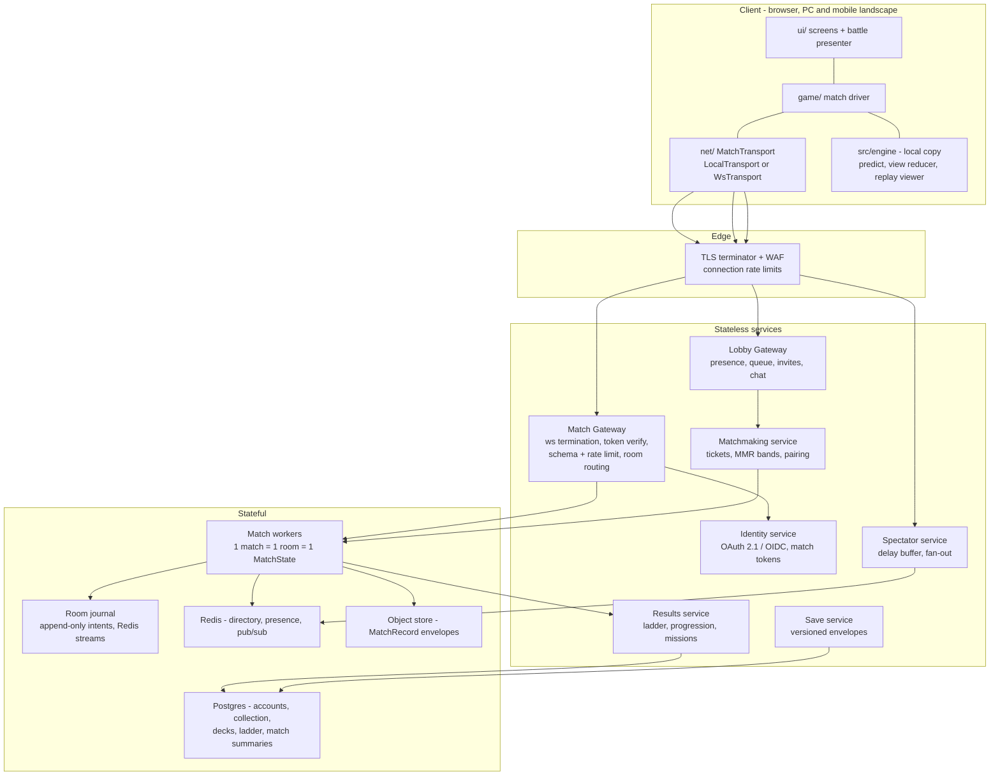
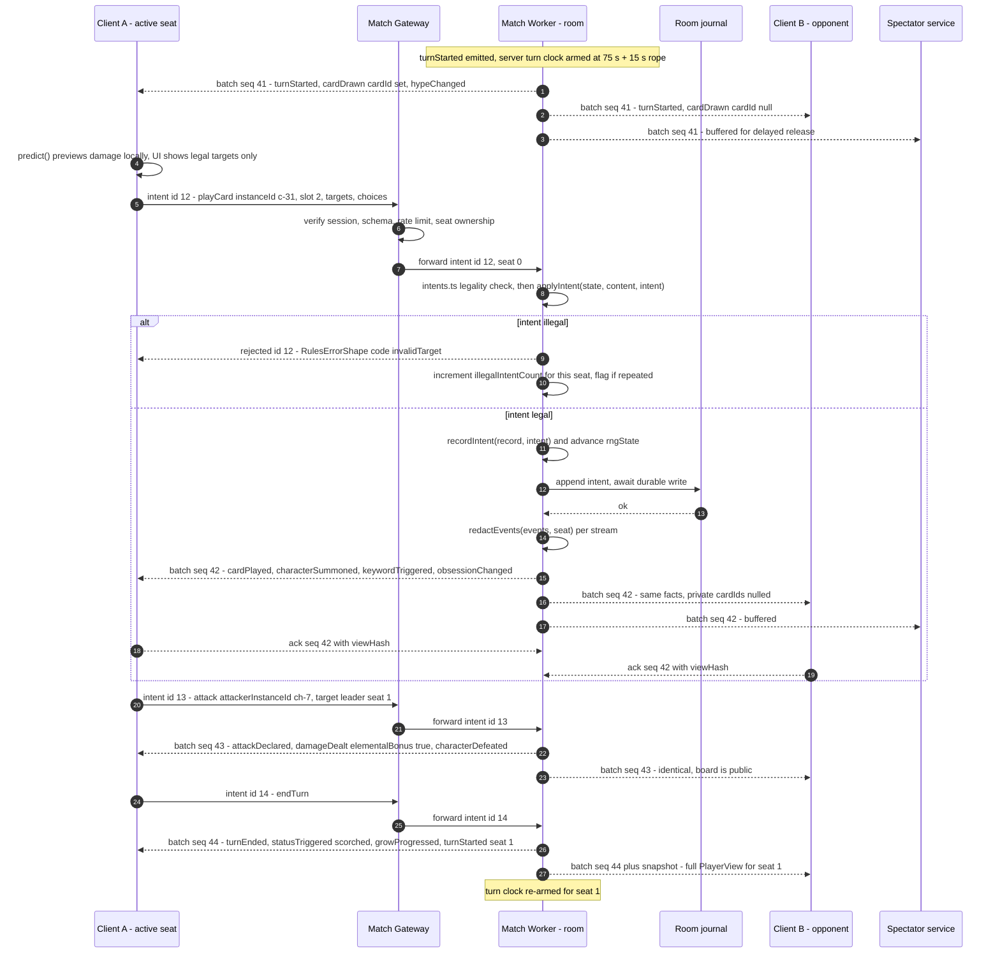
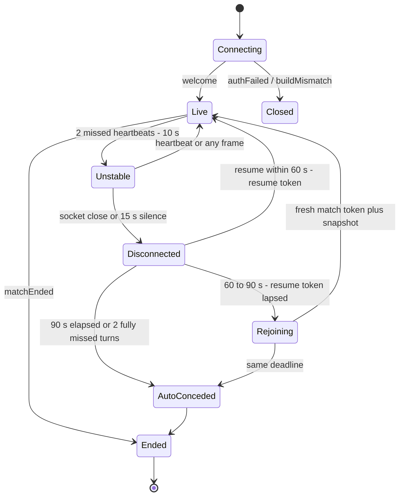
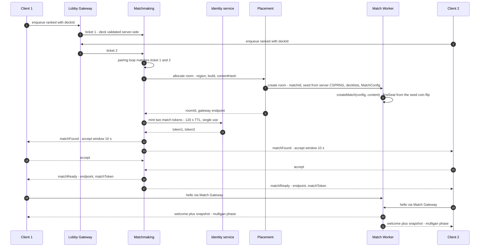
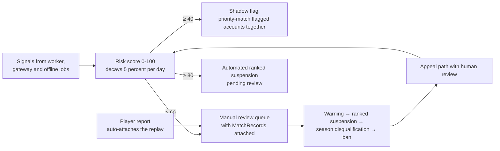
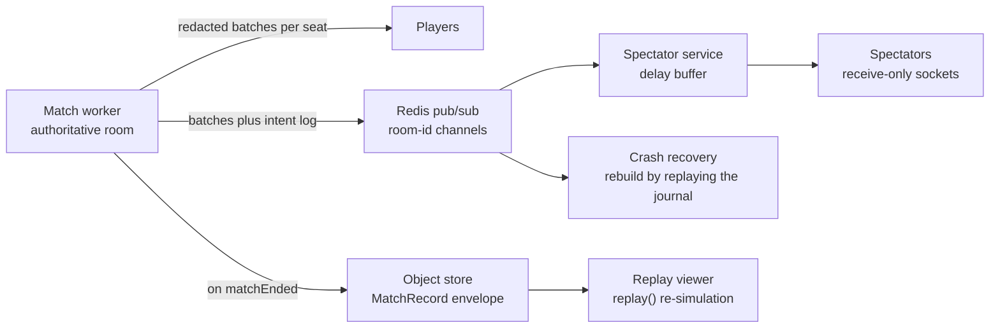
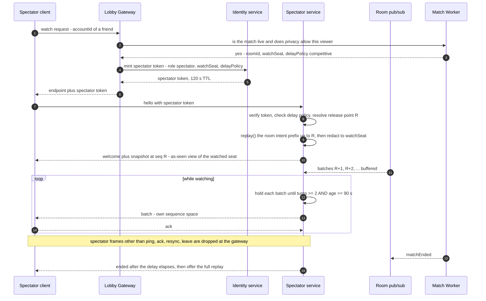

# HYPEBOUND — Multiplayer Architecture

> **Status: Derived technical design document. Designed, not implemented.**
> Rules authority is [`../design/00-core-rules.md`](../design/00-core-rules.md).
> Tech authority is [`00-architecture-contract.md`](00-architecture-contract.md),
> and the binding source of truth for every wire shape named here is
> [`../../src/engine/types.ts`](../../src/engine/types.ts). Where those documents
> are silent this document makes the binding decision and marks it **[DECISION]**.
> Nothing in this document may be "stubbed with lies" in the client: per
> architecture contract §7, online-only modes display *Coming Online* until the
> service behind them actually exists.

---

## 1. Scope and reading guide

This document specifies the future online stack for HYPEBOUND: an
**server-authoritative** 1v1 match service built directly on the existing
deterministic engine, plus the supporting services (matchmaking, auth, cloud
saves, replays, spectating) and the migration path from today's in-process
`LocalTransport`.

| Section | Answers |
|---|---|
| §2 | Why the engine is already server-shaped — no rewrite required |
| §3 | Topology and trust boundaries |
| §4 | Authoritative match flow (normal turn) |
| §5 | Per-seat event redaction on the wire |
| §6 | `MatchTransport` — the one interface that never changes |
| §7 | Wire protocol v1: envelopes, sequence numbers, acks, resume tokens |
| §8 | Session lifecycle, disconnects, reconnection, auto-concede |
| §9 | Matchmaking: MMR bands, queue widening, room placement |
| §10 | Authentication: OAuth 2.1 + short-lived match tokens |
| §11 | Anti-cheat model and detection signals |
| §12 | Cloud saves: versioned envelopes matching the local save format |
| §13 | Replays and spectating as event-stream fan-out |
| §14 | Scaling, operations, failure modes |
| §15 | Migration path from `LocalTransport` |
| §16 | Configuration keys |
| §17 | Non-goals and open questions |

**Non-goals (explicit).** No real-time/simultaneous input (the game is strictly
turn-based, so no rollback or prediction netcode is needed). No peer-to-peer. No
client authority of any kind. No cross-build matchmaking. No unrestricted public
voice chat (per the owner brief). No server-side 3D rendering — the server never
loads three.js, only `src/engine`.

---

## 2. Why this engine is already server-shaped

The engine was written to the architecture contract's determinism and
intent/event rules, which happen to be exactly the requirements of an
authoritative server. Concretely:

| Property | Where it lives today | What it buys the server |
|---|---|---|
| **Single mutation path** | `applyIntent(state, content, intent) → { state, events }` (`src/engine/reducer.ts`) | The server has exactly one entry point to guard. There is no other way state changes, so there is no "second path" a client could exploit. |
| **Seeded determinism** | `MatchState.rngState: [number, number, number, number]` advanced by sfc32 in `src/engine/rng.ts`; `Math.random`/`Date` banned in `src/engine` | Same seed + same intent list ⇒ same state on any machine. This is what makes replay, crash recovery, spectating and audit all the *same* mechanism. |
| **Serializable state** | `MatchState` is plain JSON (no classes, Maps, Dates) | A room can be snapshotted, journaled, shipped between workers, and diffed byte-for-byte. |
| **Intents are small and closed** | `PlayerIntent` union: `mulligan`, `playCard`, `attack`, `useFixation`, `activateLocation`, `activateConfluence`, `endTurn`, `concede` | The entire client→server attack surface is nine object shapes, all zod-validatable at the edge. |
| **Legality is engine-side** | `src/engine/intents.ts` (`checkPlayable`, `legalFixationTargets`, `canActivateLocation`, `enumerateLegalIntents`) throwing `RulesError` | The server reuses the *identical* validation the client uses to grey out illegal actions. No duplicated rules implementation, therefore no client/server rules drift. |
| **Events are the only presentation feed** | `EngineEvent` union; `presenter.ts` is the only engine→visuals bridge | The server can broadcast facts instead of state. The client cannot "re-derive" a different outcome because it never derives outcomes at all. |
| **Hidden information is already modeled** | `redact(state, seat) → PlayerView` (`src/engine/state.ts`); `RedactedOpponent` carries `handCount`, `deckCount`, `reactionCount` only | Opponent hand, deck order and face-down Reactions are never assembled into a client payload in the first place. Information-revealing hacks have nothing to reveal. |
| **`PlayerView` excludes `MatchConfig`** | `PlayerView` has no `config` field | The match **seed** and both **decklists** are structurally unreachable from a client view. Deck order is unknowable, not merely hidden. |
| **Replay = verification** | `MatchRecord { schemaVersion, config, intents[] }` + `replay()` + `stateHash()` (`src/engine/replay.ts`) | Every match is independently re-simulatable. `stateHash()` is the audit primitive for divergence detection and for crash recovery. |
| **Trigger cap** | `rules.triggerCap` (canon §5.5, default 20) enforced deterministically | A malicious deck cannot turn one intent into unbounded server CPU. |
| **Client-side `predict()` has no authority** | `src/engine/predict.ts` (pure, no mutation) | Previews are a UX convenience. Lying to `predict()` changes nothing that matters. |

The practical consequence: **the server is the existing engine plus a socket, a
clock, and a redaction pass.** There is no separate "netcode simulation", no
server-only rules module, and no divergence risk beyond build mismatch (§10.4,
§14.5).

### 2.1 The corollary nobody had written down: a query must not mutate

The table above says the RNG lives in `MatchState` and advances only through
`applyIntent`. Half of that was true.

`resolveTargets`' `select: "random"` branch calls
`pickMany(ctx.state.rngState, …)`, and `nextU32` writes the RNG's four words back
**in place**. `legalChooseTargets` — a pure query the UI calls to ask *"what
could this target?"* — handed it the live state. So **asking a question advanced
the authoritative RNG**, and `rngState` is precisely what `replay()` reproduces a
match from: a hover would have desynced a replay from the match that recorded
it, while that match was still being played.

`auraModifiersFor` had it too, by a longer road — a conditional aura evaluates a
condition, `evalCondition` can count a `TargetSpec`, and `totalAttack` →
`attackableBy` → the battle screen's `refresh()` calls it constantly. That one
would have fired on a redraw rather than a hover.

Latent rather than live: every shipped leader ability and confluence target is
`select: "choose"` (25 and 5, verified), and `cardTargetSpecs` admits nothing
else. But `legalFixationTargets` forwards `ability.target` verbatim, so the
distance between latent and live is one line of card data.

Both now build their context from a state whose `rngState` is copied.
`tests/query-purity.test.ts` hashes the **whole** state around every legality
helper, so a query that starts mutating anything else fails there too — and a
counter-test proves a real shuffle still rolls, because a fix that froze the RNG
everywhere would be a subtler bug than the one it replaced.

**The rule, stated so it can be pointed at:** anything the UI may call to decide
what to draw takes a `MatchState` **read-only**. `applyIntent` is the only
mutation path, and that includes the RNG.

---

## 3. Topology and trust boundaries



**Trust boundaries.**

| Boundary | Trusted | Never trusted |
|---|---|---|
| Client → Gateway | Nothing. Every frame is zod-validated, size-capped, rate-limited, and token-bound. | Timers, legality claims, `predict()` results, RNG outcomes, reported latency, telemetry. |
| Gateway → Worker | Authenticated seat identity (from a verified match token) and the raw `PlayerIntent` body. | The intent's legality — the worker re-checks via `intents.ts`. |
| Worker → Client | — | Worker output is authoritative but **redacted per seat** (§5) before it leaves the process. |
| Worker → Services | Match result written once, idempotent by `matchId`. | — |

**Rule (binding):** the worker is the only component that ever holds a full
`MatchState`. Gateways, spectator services and clients hold redacted derivatives
only.

---

## 4. Authoritative match flow

### 4.1 The loop, in one sentence

The client sends a `PlayerIntent`; the worker validates it by running the same
engine build the client is running; the worker appends the intent to the room
journal and to the `MatchRecord`; the worker redacts the resulting
`EngineEvent[]` per seat and broadcasts them as a sequenced batch.

### 4.2 Normal turn



### 4.3 Intent lifecycle and guarantees

| Stage | Owner | Guarantee |
|---|---|---|
| Client pre-check | `intents.ts` in the client build | Illegal intents are unreachable through the UI; `predict()` fills in previews. This is UX, not security. |
| Edge validation | Gateway | Frame ≤ 64 KB, protocol version match, zod schema match, session live, `intent.seat === session.seat`, token bucket (§7.6). |
| Legality | Worker (`intents.ts`) | Same code path as the client. Failure ⇒ `rejected` with a canonical `RulesErrorShape` code — never a free-text-only error. |
| Application | Worker (`applyIntent`) | Single-threaded per room; intents for a room are strictly serialized. RNG advances only here. |
| Durability | Room journal | The intent is durably appended **before** any batch is broadcast. A crash therefore never loses a fact a client has already seen. |
| Broadcast | Worker | Per-seat redaction, monotonic `seq` per stream, at-least-once with client acks and dedupe by `seq`. |
| Idempotency | Worker | `lastAppliedClientId[seat]`; a re-sent `intent` with `id <= lastApplied` is answered with the original batch `seq`, never re-applied. |

**One intent in flight per seat.** The client must not pipeline: it sends an
intent and waits for `batch` or `rejected`. This mirrors `LocalMatch`'s existing
`busy` guard and keeps causality trivially ordered. The server enforces it by
rejecting a second in-flight intent with `invalidIntent`.

### 4.4 Server-authoritative clocks

Canon §2: 75 s turn timer, then a 15 s "Stream Buffering" rope
(`timer.turnSeconds`, `timer.ropeSeconds`).

- The **only** authoritative clock is the worker's. The client displays a
  countdown interpolated from `clocks` in each batch plus a
  `pong`-derived offset; it never decides an expiry.
- On expiry the worker **injects** `{ type: "endTurn", seat }` itself. The
  injected intent is recorded in the `MatchRecord` exactly like a player intent,
  so replays are faithful and no special "timeout" branch exists in the engine.
- **[DECISION]** Injected-timeout batches carry `cause.kind: "timer"` so the
  presenter can play the rope-expiry flourish instead of a normal end-turn.
- AFK: 3 consecutive zero-intent rope turns ⇒ auto-concede (consistent with
  `../design/02-gameplay-loop-and-match-flow.md` §3.6). The worker submits
  `{ type: "concede", seat }`.
- Clock pauses exist only for the disconnect grace path (§8.3).

### 4.5 Optimistic presentation rules **[DECISION]**

Because the client cannot know the server's RNG, optimistic animation is allowed
only where the outcome is fully determined by public information:

| Intent / effect | Client may animate before the batch arrives? |
|---|---|
| `playCard` of a character with no random op, no draw, no shuffle | Yes — play the summon animation immediately, reconcile on batch. |
| `attack` (both bodies visible, `predict()` exact) | Yes. |
| `activateConfluence` with deterministic ops | Yes. |
| Anything containing `randomOp`, a `{ select: "random" }` target, `draw`, `mill`, `scry`, `resurrect` from an unknown pool, `stealCopy` | **No** — the card lifts and holds in a "resolving" state until the batch lands. |
| `useFixation` / `ultimate` | Yes for deterministic abilities, no otherwise (same rule). |

On `rejected`, the presenter reverses the optimistic animation and shows a
neutral "Resyncing…" toast, then requests a `snapshot`. Optimistic presentation
is a per-user setting (default on; auto-off if the measured p95 RTT exceeds
400 ms, to avoid visible rubber-banding).

### 4.6 State synchronization: events lead, snapshots correct

**[DECISION]** Events are the truth for *animation*; snapshots are the truth for
*state*.

- The client maintains a `PlayerView` updated by a small **view reducer**
  (`src/net/viewReducer.ts`) that applies `EngineEvent`s. This is presentation
  bookkeeping, not rules — it never decides an outcome.
- The worker sends a **full sanitized `PlayerView` snapshot** on: match start,
  every turn boundary (≤ 2 per round), every resume/rejoin, and on demand.
- Every `batch` carries a `viewHash` (FNV-1a over a canonicalized subset of the
  seat's view, the same technique as `stateHash()`). The client compares; on
  mismatch it sends `resync` and receives a `snapshot`. Drift is therefore
  bounded by one turn and self-healing.

Bandwidth: a sanitized `PlayerView` is ~8–25 KB JSON (~2–4 KB with
permessage-deflate); batches are 0.3–3 KB. A full 12-minute match costs roughly
**300–600 KB** per client — acceptable on mobile data.

---

## 5. Event redaction on the wire

`redact(state, seat)` already exists for state. Events need the same treatment.

**[DECISION]** Add a sibling pure function next to `redact()` in
`src/engine/state.ts`:

```ts
/** Strip facts a given seat is not entitled to see from an event batch. */
export function redactEvents(events: EngineEvent[], viewer: Seat): EngineEvent[];
```

It belongs in the engine (it is a hidden-information rule, and the engine imports
nothing outside itself), and it is unit-testable with the rest of the rules.

### 5.1 Redaction table

The rule is simple: **a card identity in a private zone is visible only to its
owner.** Public zones (board, discard, location, event banner, revealed
Reactions) are never redacted.

| `EngineEvent` | Treatment for the non-owning seat | Rationale |
|---|---|---|
| `cardDrawn` | `cardId → null` (the type already allows it) | Hand is private. `instanceId` stays so both clients can animate the same card back. |
| `cardAddedToHand` | `cardId → null`; `source` kept | Viral copies, steals and Comeback returns must not leak. Keeping `source` preserves the correct VFX. |
| `comebackReturned` | **dropped** when `mode: "hand"`; passes through when `mode: "play"` | Added when this table was implemented — see §5.1.1. `cardId` is not nullable, so the identity *is* the payload and there is nothing to blank. A `play` return lands on the public board. |
| `keywordTriggered` | **dropped** when `keyword: "comeback"` | Same leak, same fix. The other six emission sites name a card that is already public — the card just played, or a character on the board. |
| `reactionSet` | passes through unchanged | It carries no `cardId` by design. |
| `reactionTriggered` | passes through **unchanged** | A Reaction flips face-up when it fires; revealing it is correct. |
| `costModified` | passes through | Carries `instanceId` + `delta` only; no identity. |
| `deckScryed` | passes through | Count only; the peeked identities travel in the owner's snapshot, never in an event. |
| `cardBurned`, `cardDiscarded`, `cardMilled` | pass through | All three end in the public discard ("Lost in the Feed" burns are shown to both players by design). |
| `characterSummoned`, `characterDefeated`, `characterTransformed`, `characterResurrected`, `characterReturnedFromBanish` | pass through | Board is public. |
| `characterReturnedToHand` | passes through | The card was public on the board; both players saw it leave. |
| `chooseOneResolved`, `randomResolved` | pass through | Both players are entitled to see what the card resolved into. |
| `matchStarted`, `mulliganDone`, `turnStarted`, `turnEnded`, `hypeChanged`, `obsessionChanged`, `fixationUsed`, `confluenceActivated`, `resonance*`, `trigger*`, `matchEnded` | pass through | All public per canon. |
| **Spectator stream** | Built from the *spectated seat's* redaction, never omniscient | Canon-adjacent rule from `../design/09-game-modes.md` §20: spectating reveals nothing the spectated player cannot see. |

### 5.1.1 What implementing the table found

The two `comebackReturned` / `keywordTriggered` rows above are not in the
original design. They were added when `redactEvents()` was written, because
following the table exactly still leaked.

A `mode: "hand"` Comeback emits **three** events naming the same card:

```
cardAddedToHand   { seat, instanceId, cardId, source: "comeback" }   ← the table's case
comebackReturned  { seat, cardId, mode: "hand" }                      ← was not listed
keywordTriggered  { seat, instanceId: null, cardId, keyword }         ← was not listed
```

Blanking the first of three hides nothing: the redacted event is followed
immediately by two more that print the name. The table's own rationale for
`cardAddedToHand` — *"Comeback returns must not leak"* — was therefore stating a
goal the table did not achieve.

Both extras are **dropped** for the non-owner rather than blanked, because in
each the identity is the whole payload. Nothing is lost: the redacted
`cardAddedToHand` still carries `source: "comeback"`, which is what the
presenter animates from.

**`keywordTriggered` gained a `seat`.** It had none, which meant it could not be
attributed to a player, which meant it could not be redacted at all. That is a
defect independent of Comeback — every other player-scoped event carries a seat
— and it is the kind of thing only discovered by implementing redaction rather
than specifying it.

**The guarantee is a type, not a test.** `tests/redaction.test.ts` classifies
every event as public or private in a `Record<EngineEvent["e"], …>`, so adding a
variant to the union stops the file compiling until somebody classifies it — all
66 kinds, whether or not any test provokes one.

### 5.1.2 Three events the engine could not put on a wire

Building §5 and the view reducer turned up three defects of one shape: **an
event that cannot be attributed, or is never emitted at all.** None of them
mattered while the UI read `MatchState` directly. All three become wrong
pictures on a screen the moment it reads a `PlayerView` instead.

| Event | What was wrong | Fix |
|---|---|---|
| `keywordTriggered` | No `seat`. Unattributable, therefore unredactable — see §5.1.1 | Added `seat` |
| `refracted` | No `seat`. At the `playCard` site the hand card is spliced out *before* the event is pushed, so its `instanceId` resolves to nothing in **either** player's view and there was no way at all to tell whose Refract it was | Added `seat` |
| Armor gain | **Emitted nothing.** Armor on a leader is a scalar on `PlayerState`, not a status instance, so `applyStatus` short-circuits and returns `null` and the `statusApplied` emit never fires | Added `armorChanged` |

The Armor one is the sharpest. Losses were always inferable from
`damageDealt.absorbedByArmor`; **gains were invisible**. `RedactedOpponent.armor`
is published, the HUD draws it for both seats, and armor is granted mid-combat —
exactly when a stale value corrupts the lethal arithmetic a player is reading off
the screen.

`refracted` is the subtlest. `currentsPlayedThisTurn` is what
`availableConfluences` reads, so a client crediting the opponent's Refract to
itself offers a Confluence the room then refuses; and the chosen Current decides
the elemental bonus on every attack against that body.

### 5.2 Sanitizing the seat's own view **[DECISION]**

`PlayerView.you` is the full `PlayerState`, which includes `deck: CardInstance[]`
in exact order. That is correct for the local/AI build (the local process is the
authority) but is a real information leak online: a modified client would know
its own next draws.

The gateway/worker therefore **sanitizes the outgoing snapshot**:

- Each `you.deck` entry is replaced by an opaque placeholder that preserves
  count and identity-free bookkeeping:
  `{ instanceId, cardId: "hidden", costDelta: 0, addedKeywords: [], removedKeywords: [] }`.
- Entries the seat has legitimately learned — the Algorithm Syndicate's
  `{ op: "scry", count, mode }` and any future reveal op — are re-populated. The
  worker tracks a per-seat `revealedDeckInstanceIds: string[]`, cleared whenever
  the deck is shuffled.
- The snapshot envelope carries `revealedDeckInstanceIds` alongside the
  `PlayerView` (an envelope field, so **no canonical type changes**).

The same rule applies to `you.reactions`: the owner sees its own face-down
`cardId`s (it set them), the opponent already only receives `reactionCount`.

---

### 5.3 Fields no event carries **[DECISION: accept, with the cost written down]**

Six `PlayerState` fields change with **no event announcing them**. A view-based
client cannot track them by any amount of care; only §4.6's turn-boundary
snapshot repairs them. Found by replaying whole matches through the view reducer
and diffing against the authoritative view after every batch
(`tests/view-reducer.test.ts`), and listed here rather than left implicit,
because this is what a future protocol revision must either emit or knowingly
accept.

| Field | Why no event | What it costs |
|---|---|---|
| `reactions[].cardId` | `reactionSet` carries no `cardId` **by design** (§5.1) so a face-down card stays face-down — with the side effect that even the *owner* cannot recover which card they set | Moderate: your own Reaction reads as unknown until the next snapshot |
| `refractionCurrent` | The Refraction confluence arms it; `confluenceActivated` carries the confluence id, not the Current | Moderate: cannot show that the next card of that Current will trigger twice |
| `supportObsessionGainedThisTurn` | `obsessionChanged` reports the new total, not which clause spent the once-per-turn allowance | Low: a preview may predict a second support gain the room refuses |
| `afterpartyRepeatThisTurn` | Armed by a card effect that emits nothing naming the flag | Low: cannot warn that end-of-turn triggers will resolve twice |
| `board[].firedThisTurn` (both sides) | Per-instance trigger bookkeeping written straight onto the instance | None: no client path reads it, and `viewHash` omits it |

**Decision: accept for v1.** Every one is repaired within a turn by the
snapshot, none is load-bearing for legality, and the two that matter are display
hints rather than rules. Revisit if a mode ever shortens the snapshot cadence.

## 6. The transport contract

Per architecture contract §2/§7, `src/net/` owns a `MatchTransport` interface
with a `LocalTransport` implementation today and a `WsTransport` later. **The
interface is identical for both**; nothing above `src/net` knows which is in
use.

```ts
// src/net/transport.ts
import type {
  ConfluenceAvailability, EngineEvent, PlayerIntent, PlayerView,
  RulesErrorShape, Seat,
} from "../engine/types";

/** Server→client state correction. `view.you.deck` is sanitized (§5.2). */
export interface MatchSnapshot {
  seq: number;
  view: PlayerView;
  revealedDeckInstanceIds: string[];
  clocks: MatchClocks;
  spectatorCount: number;
}

/** One atomic, ordered group of engine facts. */
export interface EventBatch {
  seq: number;
  cause: { kind: "intent" | "timer" | "system"; seat: Seat; clientIntentId?: number };
  events: EngineEvent[];
  clocks: MatchClocks;
  viewHash: string;
  /** present on turn boundaries, resume and resync */
  snapshot?: MatchSnapshot;
}

export interface MatchClocks {
  activeSeat: Seat;
  turnMsRemaining: number;
  ropeMsRemaining: number;
  /** server monotonic clock at send time; client derives an offset */
  serverNowMs: number;
}

export type SubmitResult =
  | { ok: true; seq: number }
  | { ok: false; error: RulesErrorShape };

export type TransportStatus =
  | { kind: "connecting" }
  | { kind: "live"; rttMs: number }
  | { kind: "unstable"; rttMs: number }
  | { kind: "disconnected"; graceRemainingMs: number }
  | { kind: "opponentDisconnected"; graceRemainingMs: number }
  | { kind: "closed"; reason: string };

export interface MatchTransport {
  readonly seat: Seat;
  readonly matchId: string;
  /** Join or rejoin; resolves with the authoritative starting snapshot. */
  connect(): Promise<MatchSnapshot>;
  submit(intent: PlayerIntent): Promise<SubmitResult>;
  /** Preview helper; local impl computes it, ws impl computes it from the view. */
  confluences(): ConfluenceAvailability[];
  onBatch(listener: (batch: EventBatch) => void): () => void;
  onStatus(listener: (status: TransportStatus) => void): () => void;
  /** Non-authoritative side channel (§7.3). */
  sendEmote(emoteId: string): void;
  onEmote(listener: (seat: Seat, emoteId: string) => void): () => void;
  close(reason?: string): void;
}
```

**Why this shape survives the transition:**

- `submit()` is already async and already returns "rejected" information in
  `LocalMatch.submit()` (today: `Promise<string | null>`); `SubmitResult` is the
  typed version of the same thing.
- `onBatch()` is `LocalMatch.onEvents()` with a sequence number and clocks
  attached.
- `LocalTransport` fills `clocks` from a local timer, sets `seq` from a counter,
  runs the AI turn internally, and produces `snapshot`s from `redact()` — i.e.
  the local build exercises **every** online code path except the socket.

---

## 7. Wire protocol v1

Transport: **WSS only** (TLS 1.3), `permessage-deflate` enabled, JSON payloads,
subprotocol `hypebound.v1`. Binary/dictionary encoding is a future optimization
behind the same envelope (§17).

> **Implemented in [`../../src/net/protocol.ts`](../../src/net/protocol.ts).**
> **This section as drafted cannot be built verbatim** — the envelope collides
> with three of its own payloads. Fourteen conflicts were found writing the
> schemas; every resolution is recorded in §7.7 and implemented there. Where
> §7.7 and the tables below disagree, **§7.7 is what runs.**

### 7.1 Envelope

```ts
// src/net/protocol.ts — shared verbatim by client and server, zod-validated on BOTH ends.
export const PROTOCOL_VERSION = 1;

export interface ClientEnvelope { v: 1; t: ClientMessageType; id?: number; ts: number; /* + payload */ }
export interface ServerEnvelope { v: 1; t: ServerMessageType; seq?: number; ts: number; /* + payload */ }
```

- `v` — protocol version. Mismatch ⇒ immediate `fatal { code: "protocolVersion" }`.
- `id` — client message id, strictly increasing per session. Used for
  request/response correlation and idempotency.
- `seq` — **per-stream** server sequence number (see §7.4).
- `ts` — sender wall clock, diagnostics only, never authoritative.

### 7.2 Client → server messages

| `t` | Payload | Notes |
|---|---|---|
| `hello` | `{ matchToken, build, contentHash, protocol, resume?: { sessionId, resumeToken, lastAckSeq } }` | Must be the first frame, within 5 s of connect, or the socket is closed. |
| `intent` | `{ id, intent: PlayerIntent }` | One in flight per seat. `intent.seat` must equal the session seat. |
| `ack` | `{ seq, viewHash? }` | Acknowledges everything through `seq`. Piggybacks on `ping`. |
| `resync` | `{ reason: "hashMismatch" \| "userRequest" \| "resume" }` | Requests a full `snapshot`. Rate limited to 1 per 5 s. |
| `ping` | `{ ts }` | Every 5 s. Also carries the latest `ack`. |
| `emote` | `{ emoteId }` | Non-authoritative (§7.3). 1 per 3 s; muteable per-seat by the receiver. |
| `leave` | `{ reason: "menu" \| "closing" }` | Graceful close; server keeps the seat held for the grace window exactly as for a crash. |

### 7.3 Emotes are not intents **[DECISION / canon note]**

`types.ts` — the binding source of truth — has **no `emote` variant** in
`PlayerIntent` (the architecture contract's §3 prose lists one). Emotes
therefore do **not** touch `MatchState`, do not appear in `MatchRecord.intents`,
and cannot affect determinism. They are a gateway-level side channel with their
own rate limit, mute control and moderation hooks. This conflict is reported in
§17.2.

### 7.4 Server → client messages

| `t` | Payload | Notes |
|---|---|---|
| `welcome` | `{ sessionId, resumeToken, seat, matchId, netConfig, snapshot, seq, clocks }` | `netConfig` is the client-relevant subset of §16 so client and server can never disagree about timings. |
| `batch` | `{ seq, cause, events, clocks, viewHash, snapshot? }` | The workhorse. Ordered, gap-free per stream. |
| `snapshot` | `{ seq, view, revealedDeckInstanceIds, clocks, spectatorCount }` | Answer to `resync`, resume, and turn boundaries. |
| `rejected` | `{ id, error: RulesErrorShape }` | `error.code` is one of the canonical codes; the client maps it to an `i18n` key. |
| `presence` | `{ seat, status: "connected" \| "unstable" \| "disconnected", graceRemainingMs, spectators }` | Never exposes IPs, regions or network detail. |
| `clock` | `{ clocks }` | Standalone clock sync every 5 s when no batch has been sent. |
| `emote` | `{ seat, emoteId }` | — |
| `ended` | `{ winner, reason, matchId, replayAvailable }` | Mirrors `matchEnded` and closes the stream after a 30 s drain. |
| `pong` | `{ ts, serverTs }` | RTT + offset estimation. |
| `fatal` | `{ code, message }` | `protocolVersion`, `buildMismatch`, `authFailed`, `notAParticipant`, `roomGone`, `streamOverflow`, `rateLimited`, `kicked`. |

### 7.5 Sequence numbers, acks and resume tokens

- **One sequence space per stream.** Streams are `seat:0`, `seat:1` and each
  spectator subscription. Because each stream is redacted differently, batches
  differ per stream and each gets its own monotonic `seq` starting at 1. Resume
  is therefore stream-local and trivially correct.
- **Gap-free and ordered.** WebSocket guarantees order over one connection; the
  worker guarantees `seq = previous + 1` per stream. A client that observes a gap
  sends `resync` rather than guessing.
- **Acks drive retention.** The worker keeps every batch of the match in the room
  buffer (a full match is ~200–600 batches, well under 1 MB) so a resume never
  needs a costly rebuild. Acks are used for backpressure and for the
  "how far behind is this client" metric, not for freeing memory.
- **Backpressure.** If more than 256 unacked batches queue on a stream, the
  worker closes it with `fatal { code: "streamOverflow" }`; the client reconnects
  and resumes normally.
- **Resume tokens.** A 32-byte CSPRNG value, base64url-encoded, returned in
  `welcome`. Properties:

| Property | Value |
|---|---|
| Storage | Hashed (SHA-256) in the room; the plaintext exists only in the client's memory |
| Binding | `(sessionId, accountId, matchId, seat)` |
| Rotation | A new token is issued on every successful resume; the old one is invalidated immediately |
| Lifetime | `net.resumeGraceSeconds` = **60 s** of socket silence (§8) |
| Transport | Message body only — never a URL, never a cookie, never logged |
| Reuse | Single-use. A replayed token is refused with `authFailed` and flagged |

### 7.6 Rate limits and hard caps

| Limit | Value | On breach |
|---|---|---|
| Frame size | 64 KB | close `fatal:"rateLimited"` |
| Messages/second/session | 20 sustained, burst 40 | throttle then close |
| Intents per turn | 60 (comfortably above any legal turn) | `rejected: invalidIntent`, flag |
| Illegal intents per match | 5 | close + anti-cheat flag (an unmodified client cannot produce these) |
| `resync` | 1 / 5 s | ignore |
| `emote` | 1 / 3 s, 20 / match | drop |
| New connections per IP | 30 / min | edge 429 |
| `hello` deadline | 5 s | close |

---

### 7.7 Where this section disagrees with the code, and what was done

Fourteen conflicts, found by writing
[`../../src/net/protocol.ts`](../../src/net/protocol.ts) against §7 rather than
by reading it. Each is resolved in that file at the point it applies; this table
is the index. **These resolutions are binding** — the prose above is the draft
they correct.

| # | Conflict | Resolution |
|---|---|---|
| **C1** | **The flat envelope collides with three payloads.** §7.1 puts payload fields flat in `{ v, t, id?, ts }`, then §7.2 gives `intent { id }` and `ping { ts }`, and §7.4 gives `pong { ts, serverTs }`. All three collide. **The section cannot be implemented as written.** | Stay flat, drop the duplicates: `intent` uses the envelope's `id`, `ping` uses the envelope's `ts`, `pong` carries `clientTs`/`serverTs`. Nesting under a `p` key was the alternative; flat keeps frames readable in a network log |
| **C2** | `hello.protocol` duplicates envelope `v`, with no stated precedence | Dropped. Two version fields that can disagree is worse than one, and a `v` mismatch already has a documented path |
| **C3** | *"`ping` also carries the latest `ack`"* — with no field to carry one in | `ping` gained optional `ackSeq` and `viewHash`. §7.5's backpressure counter reads acks, so leaving this to an unwritten "send an ack first" convention would have made it silently load-bearing |
| **C4** | `emote { emoteId }` does not match the client, which sends a free-text **phrase** from `emoteWheel()` | Wire carries a **cosmetic id**; the room resolves it against the sender's entitlements. Free text on that channel is chat, which drags in the moderation question §17.1 leaves open — and makes an unowned emote unsendable rather than merely unclicked |
| **C5** | `welcome` ships `seq` and `clocks` twice — once at top level, once inside `snapshot` | Top-level pair dropped; the snapshot's are authoritative. Inside `batch`, the same duplication is pinned by a schema refinement: `batch.snapshot.seq === batch.seq` |
| **C6** | **`welcome` cannot describe a spectator.** §10.2 mints spectator tokens with a `role` and `watchSeat`, §13.3 answers them with a `welcome`, and the payload has only `seat` | Added `role: "player" \| "spectator"`. Without it a spectator cannot tell *"I am seat 0"* from *"I am watching seat 0"* — which decides whether the UI draws an End Turn button |
| **C7** | `presence.status` is 3 values against `TransportStatus`'s 6 kinds, with no mapping written | Kept at 3 on the wire (it is what the opponent is entitled to know) and documented as lossy on purpose: network detail is deliberately not shared |
| **C8** | `ended { reason }` unenumerated | Pinned to `matchEnded`'s four exactly. There is no `"timeout"` or `"disconnect"`: §4.4 and §8.2 both inject a real `concede`, so they arrive as `"concede"`. A room inventing one would break the canonical type |
| **C9** | **No frame carries the success half of `SubmitResult`.** §7.4 has `rejected` and nothing for success, so `WsTransport` would have to correlate against a batch by a rule §7 never states — and §4.3's idempotency promise ("answered with the original batch `seq`") describes a frame that does not exist | Added `accepted { id, seq }` |
| **C10** | `MatchClocks.serverNowMs` is documented monotonic and implemented as `Date.now()`, which can step backwards | Recorded. The room must derive it from a monotonic source and offset once; the comment is the contract |
| **C11** | `cause.seat` is required, but a `"system"` cause (match start, a scripted wave) has no seat, and `Seat` has no null member | `cause` became a discriminated union so the absence is expressible. `LocalTransport` was passing `activeSeat`, which reads like a fact and is not one |
| **C12** | §7.5 says `seq` starts at 1; a snapshot taken before any batch legitimately reads 0 | `MatchSnapshot.seq` is `nonnegative`, and means *"current as of this batch"* — a different thing from a stream counter, now written down |
| **C13** | §6's prose lists `sendEmote`/`onEmote`/`matchId` on `MatchTransport`; the implemented interface has none of them | Recorded as a known gap. Both emote frames are specified with nowhere to land above `src/net` until a transport grows the methods |
| **C14** | `revealedDeckInstanceIds` is specified, wired, and always empty | Correct as-is, but not for the stated reason. This engine's scry never reveals anything to a *player* — `{ op: "scry" }` resolves inside the reducer and no UI shows the peeked cards — so there is nothing to give back. The field stays for a future reveal effect |

**One defect the schemas had that §7 did not cause.** Zod ignores unknown keys by
default. `{ type: "playCard", choice: 0 }` therefore validated by silently
*dropping* the stray field — and `choice` (a number, on `activateConfluence`) and
`choices` (an array, on `playCard`) differ by one letter, so that is a plausible
client bug rather than an exotic attack, with a Choose One resolving the wrong
half as the consequence. Every intent variant is `.strict()`.

## 8. Session lifecycle and reconnection

### 8.1 Session states



### 8.2 The two-tier grace window **[DECISION]**

| Tier | Window | Path | What the player does |
|---|---|---|---|
| **Resume (fast)** | 0–**60 s** of silence (`net.resumeGraceSeconds`) | Same session, same resume token, replay from `lastAckSeq + 1` | Nothing — the client auto-reconnects with exponential backoff (0.5 s, 1 s, 2 s, 4 s, jittered) |
| **Rejoin (slow)** | 60–90 s (`net.seatHoldSeconds`) | Resume token has lapsed; client requests a **fresh match token** from the identity service and does a full `hello` without `resume` | May require the app to be reopened; the lobby offers a "Rejoin match" button |
| **Auto-concede** | at 90 s, or after **2 fully missed turns**, whichever first | Worker submits `{ type: "concede", seat }` | Counts as a loss; feeds the disconnect-abuse tracker |

This reconciles the transport-level 60-second grace with the 90-second seat hold
and 2-missed-turn rule already published in
[`../design/09-game-modes.md`](../design/09-game-modes.md) §7.10: **60 s** is how
long a *session* survives, **90 s** is how long a *seat* survives.

**Buffer Shield.** If the disconnect happens during the disconnected player's own
turn, the turn clock (and rope) pauses for up to 45 s, **once per player per
match** — the "Buffer Shield" from game-modes §7.10. Later disconnects let the
clock run. The opponent sees only "Connection unstable" on the enemy portrait,
never any network detail, and always sees the remaining grace countdown so the
wait is never a mystery.

### 8.3 Reconnection sequence

```mermaid
sequenceDiagram
  autonumber
  participant A as Client A
  participant G as Match Gateway
  participant W as Match Worker - room
  participant B as Client B

  Note over A,W: A has acked through seq 57
  A--xG: socket drops - subway, tab sleep, wifi flap
  G->>W: session lost, seat 0
  W->>W: mark seat 0 disconnected, start 60 s resume window and 90 s seat hold
  W->>W: if seat 0 is active, pause turn clock up to 45 s - Buffer Shield, once per match
  W-->>B: presence seat 0 disconnected, graceRemainingMs 90000
  Note over W: match continues; opponent triggers, timers and afterparty effects still resolve into the buffer

  A->>A: exponential backoff 0.5, 1, 2, 4 s with jitter
  A->>G: hello with resume - sessionId, resumeToken, lastAckSeq 57
  G->>G: verify resume token hash, session live, build and contentHash match
  G->>W: attach socket to seat 0
  W-->>A: welcome - new resumeToken, snapshot at seq 61, clocks
  W-->>A: batch 58, 59, 60, 61 - backlog since last ack
  A->>A: presenter fast-forwards backlog in instant mode, then resumes normal pacing
  A-->>W: ack seq 61 with viewHash
  W->>W: resume Buffer Shield remainder to the clock, clear disconnect state
  W-->>B: presence seat 0 connected

  alt no resume within 60 s but rejoin within 90 s
    A->>G: hello with a fresh match token, no resume block
    G->>W: rebind seat 0 - new session
    W-->>A: welcome plus full snapshot at current seq
  else nothing within 90 s or 2 fully missed turns
    W->>W: inject concede for seat 0
    W-->>B: batch - matchEnded winner seat 1 reason concede
    W-->>A: ended when or if A returns
  end
```

**Backlog delivery.** Both paths deliver a `snapshot` *first*, then the backlog
batches. The presenter fast-forwards the backlog at instant speed (respecting
the reduced-motion setting), so a 40-second absence costs ~1.5 s of catch-up, not
40 s of replayed animation.

### 8.4 What survives a disconnect

| Thing | Survives? |
|---|---|
| `MatchState`, RNG position, timers | Yes — held by the worker; the client is a viewer |
| Unsent intent the client had "in flight" | No — if no `batch`/`rejected` arrived, the intent was never applied. The client re-sends with the **same `id`**; the server dedupes if it did land |
| Optimistic animation | Discarded and rebuilt from the snapshot |
| Emote history, chat | Not replayed (non-authoritative) |
| Spectators | Unaffected — they subscribe to the room, not the player |

---

## 9. Matchmaking service

### 9.1 Queues

| Queue | Rating | Party | Accept step | Notes |
|---|---|---|---|---|
| `ranked` | Glicko-2, per season | solo only | 10 s explicit accept | Placement rules per game-modes §7.2 |
| `casual` | hidden casual Glicko-2 | solo | auto-accept | Softly prefers similar collection depth |
| `gauntlet` | Gauntlet MMR + run record | solo | auto-accept | Pairs by wins bracket first |
| `remix` | casual MMR | solo | auto-accept | Modifier id must match on both tickets |
| `friend` / `custom` | none | invite | invite accept | Direct room allocation, no queue |
| `tournament` | none | bracket | organizer-driven | Rooms pre-allocated per round |
| `coop-raid` | none | 2 players | party ready-check | One room, two allied seats + boss AI seat |

### 9.2 Ticket

```ts
interface MatchTicket {
  ticketId: string;
  accountId: string;
  queueId: QueueId;
  region: RegionId;            // routing + latency scoring
  rating: number;              // Glicko-2 mu
  rd: number;                  // Glicko-2 deviation
  enqueuedAt: number;          // server ms
  build: string;               // engine build hash
  contentHash: string;         // hash of the validated ContentIndex
  deckHash: string;            // server-validated decklist digest
  leaderCardId: string;
  recentOpponents: string[];   // last 3 accountIds
  flags: { newPlayer: boolean; riskFlagged: boolean; };
}
```

Deck legality (canon §2 sizes/copies and §8.6 Current restrictions) and
collection ownership are validated **at ticket creation**, not at match start —
an illegal deck never reaches a room.

### 9.3 MMR bands and queue widening **[DECISION]**

Baseline is the published rule from game-modes §7.3 (±150 MMR, widening to ±400
after 90 s). The full schedule:

| Elapsed in queue | Base band | Additional relaxations |
|---|---|---|
| 0–15 s | ±150 | Same region only; avoid `recentOpponents`; prefer RTT < 60 ms |
| 15–45 s | ±150 → ±250 (linear, ~+3.3/s) | Same region only |
| 45–90 s | ±250 → ±400 (linear, ~+3.3/s) | Adjacent region allowed if RTT < 120 ms |
| 90–150 s | ±400 (hold) | `recentOpponents` avoidance drops to the last 1 opponent |
| 150–240 s | ±400 + `min(200, 1.5 × RD)` | Any region with RTT < 180 ms |
| 240 s+ | unbounded within tier | Casual/Remix only: offer "Play the AI instead" (never a fake human). Ranked keeps searching and shows honest queue statistics |

- **Uncertainty widening:** the effective band is
  `band + min(200, 1.5 × RD)` at all times, so freshly placed and returning
  players (high RD) find games quickly and converge fast.
- **Never widened, ever:** `build` and `contentHash` must match exactly (§14.5);
  queue id must match; a flagged account is preferentially paired with other
  flagged accounts (game-modes §7.8).
- **Rematch damping:** pairing the same two accounts within 24 h costs a −120
  score penalty in ranked (0 in casual after 60 s of waiting) — this is also the
  first line of defence against win-trading (§11.3).

### 9.4 Pairing loop

```
every 1000 ms, per (queueId, region) shard:
  1. bucket tickets by rating into 50-point buckets
  2. for each ticket, oldest first:
       scan own bucket then outward while |Δrating| ≤ effectiveBand(waited)
       score(candidate) = 1000
                        − |Δrating|
                        − latencyPenalty(rttEstimate)      // 1 point per ms over 40
                        − rematchPenalty                    // 120 if paired < 24 h ago
                        + waitBonus(min(waited, 240) × 2)   // ageing prevents starvation
                        − smurfPenalty                      // flagged vs unflagged
  3. greedily commit highest-scoring pairs; committed tickets leave the pool
  4. emit pairing → placement (§9.5)
```

The loop is O(n) per tick with bucket indexing; a 20k-ticket region shard costs
well under 10 ms per tick.

### 9.5 Room placement and match start



- **Seed provenance:** `MatchConfig.seed` is drawn from a server CSPRNG at room
  creation. It is never sent to a client during the match (`PlayerView` has no
  `config` field), and it is released only in the post-match `MatchRecord`
  (§13.3). First-seat selection is the engine's own coin flip from that seed, so
  it is auditable and not client-influenceable.
- **Decline / timeout:** the accepting player is requeued with wait time and band
  preserved and priority scoring; the decliner gets a 30 s cooldown, escalating
  to 5 minutes after 3 declines in 10 minutes.
- **Mulligan phase** runs inside the room like any other intent
  (`{ type: "mulligan", seat, replaceInstanceIds }`), with its own 45 s clock;
  expiry submits an empty mulligan (keep all).

---

## 10. Authentication and authorization

### 10.1 Identity: OAuth 2.1 / OIDC

**[DECISION]** HYPEBOUND runs a first-party OIDC provider ("Signal ID"). The
login screen's email + password form (`../design/03-screens-and-navigation.md`
§4.1.3) is the *credential UI of that provider*, not a bespoke auth path;
federated providers (platform/social sign-in) plug in as additional
`identity_provider` options without changing anything downstream.

| Aspect | Decision |
|---|---|
| Flow | Authorization Code + **PKCE (S256)** only. No implicit, no password grant, no tokens in URLs |
| Access token | JWT, **EdDSA (Ed25519)**, 15 min TTL, `aud: "hypebound-api"`, held **in memory only** |
| Refresh token | Opaque, rotating, 30 days, in an `HttpOnly; Secure; SameSite=Strict` cookie scoped to the auth origin; reuse detection revokes the whole family |
| Session binding | Device id (random, stored locally) + user agent class; a token presented from a new device class forces re-auth |
| MFA | Optional TOTP; **required** to appear on the Main Character leaderboard (top 500) and to change email/password |
| Guest play | Local-only profile with a device-bound credential, upgradeable to a full account without losing progress (the local save is uploaded through §12's adopt flow) |
| Age gate & consent | At account creation, per the brief; regional data-handling flags ride on the account record |
| Revocation | `jti` deny-list in Redis (TTL = token lifetime); ban/suspension revokes access + refresh + all live match tokens |

### 10.2 Match tokens (short-lived)

A match token is a capability for **one seat in one room**, and nothing else.

```jsonc
{
  "iss": "signal-id",
  "aud": "gw-eu-west",          // one gateway region
  "sub": "acct_8f2…",
  "jti": "mt_01H…",             // single-use, tracked in Redis for 5 min
  "exp": 1730000120,            // 120 s TTL at issue
  "matchId": "m_01H…",
  "roomId": "room_7f…",
  "seat": 0,
  "role": "player",             // or "spectator"
  "build": "eng_9c41ab",        // engine build hash — must equal the room's
  "contentHash": "ct_5d0e"      // validated ContentIndex hash
}
```

- Minted by the identity service **only** for accounts the matchmaker (or the
  tournament/friend-invite service) has already placed in that room.
- Verified at the gateway with the provider's public key (cached JWKS); the
  gateway then asks the worker to bind the seat. A second `hello` for an
  already-bound seat is refused unless the previous session is `disconnected`.
- **Rejoin tokens** (§8.2 slow path) are minted on demand: valid access token +
  the account is a listed participant + the room is still live.
- **Spectator tokens** carry `role: "spectator"`, a `watchSeat`, and the
  room's `delayPolicy`; the gateway drops every client frame from a spectator
  except `ping`, `ack`, `resync` and `leave`.

### 10.3 Transport security

WSS/TLS 1.3 only; HSTS; no mixed content; no secrets in query strings; structured
logs redact tokens and IPs; CSP on the web client; CORS restricted to the game
origins; all service-to-service calls are mTLS inside the VPC.

### 10.4 Build binding

Determinism is only valuable if both sides run the same rules. `build` (engine
commit hash) and `contentHash` (hash over the validated `ContentIndex` — cards,
currents, keywords, confluences, statuses, factions, balance) are asserted at
three points: ticket creation, match-token minting, and `hello`. Any mismatch is
a hard refusal (`fatal: "buildMismatch"`) with an "Update required" screen —
never a silent fallback.

---

## 11. Anti-cheat model

### 11.1 What server authority already eliminates

| Classic card-game cheat | Why it is impossible here |
|---|---|
| Modified stats / free cards / infinite Hype | The client never mutates state. `applyIntent` on the worker is the only mutation path |
| Illegal plays (ignoring Spotlight, attacking twice, playing at 0 Hype) | Re-validated by the same `intents.ts` checks; rejected with a canonical `RulesErrorShape` |
| Reading the opponent's hand or face-down Reactions | Never transmitted — `RedactedOpponent` carries counts only, `redactEvents()` nulls private `cardId`s |
| Reading your own deck order / next draw | Sanitized on the wire (§5.2); the seed is never sent mid-match |
| RNG manipulation (re-rolling a `randomOp`, fishing for a `random` target) | The RNG lives in `MatchState.rngState` on the server; the client cannot observe or advance it |
| Timer manipulation / stalling | Clocks are server-owned; expiry injects `endTurn` server-side |
| Packet-crafted impossible intents | zod schema at the edge + legality on the worker; 5 illegal intents ends the session and flags the account |
| Result forgery / progression forgery | Results are written by the worker, idempotent by `matchId`; the client never reports outcomes |
| Replay/state forgery in reports | `MatchRecord` + `stateHash()` re-simulation is the ground truth |

The residual attack surface is therefore **not about state at all**. What remains
is people problems: **bots/automation** and **win-trading/collusion** (plus their
cousins: boosting, smurfing, and disconnect abuse).

### 11.2 Bot / automation detection signals

Signals feed a per-account risk score; none is a verdict on its own.

| Signal | Definition | Trip condition | Weight |
|---|---|---|---|
| Cadence uniformity | Coefficient of variation of think time across ≥ 60 decisions | CV < 0.15 | High |
| Sub-human reaction | Median ms from `batch` delivery to the next `intent` on multi-target plays | < 250 ms over ≥ 40 samples | High |
| Zero rope usage | Turns entering the 15 s rope, vs median think time | 0 ropes in ≥ 200 turns while median think time > 20 s | Medium |
| Mulligan determinism | Identical keep sets for identical opening hands | ≥ 95 % identical across ≥ 50 matches | Medium |
| Marathon sessions | Continuous queueing without idle gaps | > 6 h with < 3 min total idle, repeated ≥ 3 days | Medium |
| Reference-agreement | Agreement rate with a strong reference AI's top-ranked intent (recomputed offline from the `MatchRecord`) | > 92 % over 200 decisions at a rank where that is implausible | Medium |
| Input telemetry absence | Client-reported pointer-path entropy missing or synthetic | corroborative only — client telemetry is untrusted | Low |
| Protocol fingerprint | Non-browser frame ordering, absent `resync` after induced hash mismatch, perfect 5.000 s ping cadence | any | Medium |
| Illegal-intent rate | Intents rejected by the worker | ≥ 5 in one match, or ≥ 3 matches with any | High |

### 11.3 Win-trading / collusion / boosting signals

| Signal | Definition | Trip condition | Weight |
|---|---|---|---|
| Pair recurrence | Same two accounts matched in ranked | ≥ 3 times / 24 h | High |
| Queue co-entry | Enqueue timestamps within 3 s of each other | ≥ 5 times / day | High |
| Alternating outcomes | Win pattern regularity across a recurring pair | alternation score ≥ 0.8 over ≥ 6 matches | High |
| Instant concede | Matches ending by `concede` before turn 3 | ≥ 40 % of a pair's matches | High |
| No-play concede | 0 `playCard` intents before conceding | ≥ 60 % of a pair's matches | High |
| MMR laundering | Repeated losses to a much lower-rated account that then climbs sharply | Δ ≥ 300 MMR, ≥ 4 occurrences | Medium |
| Device/network clustering | Same device fingerprint or payment instrument across the pair (privacy-policy governed) | any, ranked only | Medium |
| Boosting | Account's decision fingerprint (cadence, mulligan policy, archetype preference) changes abruptly while win rate spikes | > 80 % over 25 games with fingerprint distance above threshold | Medium |
| Disconnect abuse | Losing-position disconnects | disconnect at < 40 % leader health in ≥ 30 % of losses | Medium |

### 11.4 Enforcement pipeline



Consistent with game-modes §7.9: penalties escalate warning → ranked suspension →
season disqualification → account ban; leaver/AFK penalties are loss + escalating
queue cooldowns (5 min → 30 min → 24 h in a rolling week). **Thresholds and
signal definitions stay internal** — this document is not player-facing.

### 11.5 Divergence detection (a bonus of determinism)

Clients optionally include a `viewHash` in every `ack`. A client whose hash
disagrees with the server's for the same `seq` is either (a) on a different
build — refused earlier, so this should be impossible — or (b) running modified
code. Persistent divergence is logged with the room's intent prefix so the exact
disagreement can be reproduced offline via `replay()` + `stateHash()`.

---

## 12. Cloud saves

### 12.1 Envelope: identical to local, plus metadata

Architecture contract §7 defines the local format as a versioned envelope
`{ version, data }` with migration functions. The cloud format **is that
envelope**, so a downloaded payload can be handed straight to the existing local
migration chain:

```ts
// src/save/format.ts (existing shape)
export interface SaveEnvelope<T> { version: number; data: T; }

// src/save/cloudSync.ts (new)
export type SaveSection =
  | "profile" | "settings" | "collection" | "decks" | "progression" | "history";

export interface CloudEnvelope<T> extends SaveEnvelope<T> {
  meta: {
    accountId: string;
    section: SaveSection;
    revision: number;      // server-assigned, monotonic per section
    updatedAt: string;     // ISO 8601, SERVER clock (client clocks are untrusted)
    deviceId: string;      // last writer
    deviceName: string;    // shown on the Cloud-save selection screen
    contentHash: string;   // ContentIndex hash the payload was written against
    checksum: string;      // SHA-256 of canonicalized `data`
  };
}
```

### 12.2 Sections, authority and conflict policy

Saving per section (not one blob) means a settings change on a phone can never
clobber a collection on a PC.

| Section | Local key | Authority once online | Sync trigger | Conflict policy |
|---|---|---|---|---|
| `profile` | `hb.profile` | Server (level, display name, titles) | Push on change; pull at lobby entry | Server wins |
| `settings` | `hb.settings` | Client | Debounced 5 s after change | Last-writer-wins by `revision` |
| `collection` | `hb.collection` | **Server** (pack rolls, crafting, duplicate protection all execute server-side) | Server push | Server wins; the local copy is a cache |
| `decks` | `hb.decks` | Client-authored, server-validated | On deck save | LWW **per deck id** — two devices editing different decks both survive |
| `progression` | `hb.progression` | **Server** (XP, missions, pass, ranked) | Server push after each results write | Server wins |
| `history` | `hb.history` | Client keeps last 50; server keeps the index | On match end | Append-only union by `matchId` |

**No merge.** The Cloud-save selection screen
(`../design/03-screens-and-navigation.md` §4.1.5) states this explicitly: the
player picks LOCAL or CLOUD wholesale at adoption time. After adoption,
per-section revisions handle everything else.

### 12.3 HTTP surface

| Endpoint | Purpose |
|---|---|
| `GET /v1/saves` | Manifest: per section `{ version, revision, updatedAt, deviceName, checksum }` — powers the LOCAL vs CLOUD comparison cards |
| `GET /v1/saves/{section}` | Fetch one `CloudEnvelope` |
| `PUT /v1/saves/{section}` with `If-Match: <revision>` | Write; `200 { revision }` or `409` with the server envelope attached (client routes to the conflict UI) |
| `POST /v1/saves/adopt` | `{ choice: "cloud" \| "local" }` — the one-time boot resolution; the losing side is archived server-side for 30 days as a support escape hatch |
| `POST /v1/saves/claims` | Idempotent offline reward claims (§12.5) |

Caps: 512 KB per section, 30 writes/minute/account, gzip required above 32 KB.

### 12.4 Versioning and migrations

- The client owns migrations (`migrations[version] → nextVersion`), exactly as
  offline. The server stores payloads opaquely and never rewrites them inline.
- The server publishes `maxKnownVersion[section]`. A client writing
  `version > maxKnownVersion` is refused with `426 Upgrade Required` — an old
  server must never half-understand a new save.
- A client reading a `version` **newer than it knows** refuses to adopt and shows
  "Update required to load this save" rather than silently downgrading.
- Batch migrations run as an offline job, writing new `revision`s; clients pick
  them up on the next pull.
- Every save write records `contentHash`, so a payload written against a retired
  card set can be repaired (e.g. removed cards dusted at full value) by a
  targeted migration.

### 12.5 Offline play with an online account

Offline PvE remains fully playable. Rewards earned offline are queued as
**idempotent claim operations** `{ opId (client UUID), kind, payload, matchRecordRef? }`
and flushed on reconnect. The server re-derives what it can from the attached
`MatchRecord` (mode, turns, outcome), enforces the same daily caps as online, and
ignores duplicate `opId`s. Anything the server cannot verify pays out at the
capped offline rate — consistent with `../design/09-game-modes.md` ("Daily Grind:
local now / verified later"). Pack openings, crafting and ranked results are
**never** offline operations; they require the server.

---

## 13. Replays and spectating

### 13.1 One mechanism, three products

A replay, a spectator stream and a crash recovery are all the same thing: *a
deterministic engine re-applying an intent log*. This is why
`../design/09-game-modes.md` §20 can honestly say the spectator client **is** the
replay viewer running on a live, delayed event stream.



### 13.2 Spectator delay policy **[DECISION]**

Delay is expressed in **both** turn and wall-clock terms, and a batch is released
only when **both** conditions are satisfied:

```
release(batch) when  seatTurnsCompletedSince(batch) >= policy.turns
                AND  now - batch.receivedAt        >= policy.floorSeconds
```

| Policy | `turns` | `floorSeconds` | Used by |
|---|---|---|---|
| `competitive` (default) | 2 | 90 | Ranked friend-spectates, tournaments (locked by the organizer) |
| `coaching` | 0 | 0 | Custom/friend lobbies where **both** players consent |
| `broadcast` | 2 | 180 | Featured/event streams |

Two seat-turns is the meaningful unit in a turn-based game (information stops
being actionable once both players have acted), and the 90-second floor keeps a
fast pair of turns from leaking anything — it matches the published 90-second
figure in game-modes §20 while making the guarantee turn-accurate.

Additional rules: the spectated player's privacy setting (friends / guild / off,
default friends-only) is checked at join **and** re-checked on change (revoked
consent disconnects viewers); spectator count is visible to both players;
Streamer Mode hides viewer identities; spectators never affect the room's clocks
and never occupy a seat.

### 13.3 Spectator join



Joining mid-match costs one `replay()` of at most a few hundred intents (tens of
milliseconds) — no separate snapshot machinery is needed, because the intent log
*is* the snapshot machinery.

### 13.4 Replay storage

On `matchEnded` the worker writes:

```jsonc
// object store: replays/{yyyy}/{mm}/{matchId}.json.gz
{
  "v": 1,                        // envelope version — same pattern as save envelopes
  "engineBuild": "eng_9c41ab",
  "contentHash": "ct_5d0e",
  "recordedAt": "2026-07-24T18:42:11Z",
  "mode": "ranked",
  "participants": [{ "accountId": "acct_…", "seat": 0, "displayName": "…" }],
  "record": { /* MatchRecord: schemaVersion, config, intents[], result */ }
}
```

The envelope carries build metadata **outside** `MatchRecord`, so the canonical
type is untouched. Sizes: a full match is ~200–600 intents ≈ 20–60 KB JSON,
~4–8 KB gzipped.

| Concern | Decision |
|---|---|
| Retention | Ranked: 90 days hot. Starred by either participant: retained for the account's lifetime. Reported matches: retained until the case closes + 180 days |
| Access | Participants always; others per profile privacy; moderators via audited access |
| Sharing | `replayCode` = base64url of the gzipped envelope for local export/import (game-modes §21), or a short cloud id for server-hosted retrieval |
| Cross-version | `engineBuild` + `contentHash` are checked before playback; a mismatch offers "view summary only" instead of a wrong simulation |
| Perspective | **As-Seen** replays re-run `redact()` for the chosen seat; **Omniscient** is permitted only after the match ends |

---

## 14. Scaling and operations

### 14.1 Component sizing

| Component | Statefulness | Unit | Capacity target | Scale trigger |
|---|---|---|---|---|
| Edge / TLS | stateless | — | per provider | — |
| Match Gateway | stateless (session→room map in Redis) | 2 vCPU / 2 GB | 20,000 sockets, 8,000 msg/s | sockets > 70 % or CPU > 60 % |
| Match Worker | **stateful** (rooms in memory) | 1 process per vCPU; 8 per 8-vCPU node | **600 rooms/process**, ~4,800/node | rooms > 70 % of target |
| Lobby Gateway | stateless | 2 vCPU | 40,000 presence sockets | — |
| Matchmaking | shard state in memory + Redis | 2 vCPU per (queue, region) shard | 20,000 tickets, 1 Hz tick | tickets > 15,000 |
| Spectator service | buffer state | 2 vCPU | 5,000 viewers, 300 rooms | viewers > 70 % |
| Identity | stateless | 2 vCPU | 2,000 token mints/s | — |
| Save service | stateless | 2 vCPU | 1,000 req/s | — |
| Redis | primary + replica | — | directory, presence, journals, pub/sub | memory > 60 % |
| Postgres | primary + replica | — | accounts, collection, decks, ladder, summaries | — |
| Object store | — | — | replay envelopes | — |

**Per-room budget:** `MatchState` ≈ 30–60 KB; batch buffer for a full match
≈ 120 KB; total ≈ **200 KB/room**, so 600 rooms ≈ 120 MB per process. CPU:
`applyIntent` costs ~0.3–2 ms; 600 rooms at ~0.5 intents/s ≈ 300 intents/s ≈
30 % of one core. Headroom is deliberate — the trigger cap (canon §5.5) bounds
worst-case intent cost.

**Rule of thumb:** one 8-vCPU worker node ≈ **4,800 concurrent matches ≈ 9,600
concurrent players**.

### 14.2 One match = one room

- A room is a single JavaScript object graph owned by one worker process, mutated
  only by `applyIntent`. No locks, no cross-room shared state, no cross-room
  transactions.
- Rooms are addressed by `roomId` through a Redis directory
  (`room:{id} → {workerId, endpoint, seats, spectatorChannel}`, TTL 15 min,
  refreshed by heartbeat) so any stateless gateway can route any socket.
- Rooms are ephemeral: created at pairing, destroyed 60 s after `matchEnded`
  (after the results write and the replay upload are confirmed).

### 14.3 Crash recovery is just replay

Because every applied intent is durably journaled **before** its batch is
broadcast (§4.3), a lost worker is not a lost match:

1. Directory heartbeat expires ⇒ the placement service marks the worker dead.
2. Rooms are reassigned to healthy workers in the same region.
3. The new worker calls `createMatch(config, content)` and re-applies the
   journaled intents (`replay()` semantics) — determinism guarantees an identical
   `MatchState`, verified with `stateHash()` against the last journaled hash.
4. Stream sequence numbers continue from the journal length, so clients simply
   `resume` and receive the backlog.
5. Target: rooms live again within **5 s**, inside the 60 s resume window, so
   players see "Reconnecting…" and nothing more.

### 14.4 Deploys and drains

Rolling deploys with a **15-minute drain**: a draining worker accepts no new
rooms and finishes existing ones (matches last 5–12 minutes; canon §1). Gateways
drain in seconds because they are stateless. Matchmaking pauses pairing for a
build during its cutover so no pair is split across builds.

### 14.5 Build/content pinning

A room is pinned to `(engineBuild, contentHash)` at creation. Clients on any other
pair cannot queue, cannot be paired, and cannot `hello` into a room. This is the
single most important operational invariant: **determinism across two machines is
only meaningful for identical code and identical data.**

### 14.6 Observability

| Metric | Alert threshold |
|---|---|
| `intent_apply_ms` p50 / p99 | p99 > 25 ms |
| `intent_reject_rate` by `RulesErrorShape.code` | > 0.5 % (indicates client/server rules drift — page immediately) |
| `viewhash_mismatch_rate` | > 0.1 % |
| `resume_success_rate` | < 97 % |
| `auto_concede_rate` | > 1.5 % of matches |
| `queue_wait_p50 / p90` per queue+region | p90 > 120 s |
| `room_recovery_time` | > 10 s |
| `batch_fanout_lag_ms` | > 500 ms |
| `journal_write_ms` p99 | > 10 ms |

Every log line carries `matchId`, `roomId`, `seat`, `seq` — enough to pull the
`MatchRecord` and reproduce any incident locally with `replay()`.

### 14.7 Failure modes

| Failure | Blast radius | Mitigation |
|---|---|---|
| Worker crash | Rooms on that worker | Journal replay (§14.3) |
| Redis outage | New routing/pairing | Existing rooms keep running (in-memory); queues pause; clients see honest "Matchmaking unavailable" |
| Postgres outage | Results/ladder writes | Results buffer to the journal and drain later (idempotent by `matchId`); matches still playable |
| Object store outage | Replay upload | Retry with backoff from the journal; replay marked "processing" |
| Gateway loss | Sockets on it | Clients resume through another gateway inside the 60 s window |
| Identity outage | New logins/match tokens | Live matches unaffected; existing access tokens valid up to 15 min |
| Region loss | That region | Queue drains to the nearest region with a latency warning; matches in flight are lost and refunded (ranked: no rating change, per the draw/interrupted policy) |

---

## 15. Migration path from `LocalTransport`

**The `MatchTransport` interface (§6) does not change at any step.** Everything
above `src/net/` — the driver, the HUD, the presenter, the 3D board — is written
once.

| Phase | Work | Status | Player-visible change |
|---|---|---|---|
| **0 — today** | `LocalMatch` (`src/game/localMatch.ts`) owns the authoritative state, runs the AI inline, records the `MatchRecord`. | done | Offline modes |
| **1 — extract the seam** | Add `src/net/transport.ts` (interface) and `src/net/localTransport.ts` wrapping `LocalMatch`: adapt `submit(): Promise<string \| null>` to `SubmitResult`, add `seq` counters, `MatchClocks` from a local timer, and `snapshot` from `redact()`. Driver talks only to `MatchTransport`. | **done** | None |
| **2 — network-shape the local build** | Add `redactEvents()` (§5) in the engine and the `viewReducer` in `src/net/`. `LocalTransport` now emits **redacted** batches and sanitized views to the UI even offline, and enforces seat ownership on `submit`. Add `src/net/protocol.ts` with zod schemas (unused by the local path, but validated in tests). | **done** — and it earned its place in the order: it found a redaction leak (§5.1.1), three unwireable events (§5.1.2), six fields no event carries (§5.3), fourteen conflicts in §7 (§7.7) and a determinism hole in the engine (§2.1) | None — but any hidden-info leak in the UI surfaces immediately, offline, in tests |
| **3 — the server package** | New top-level workspace `server/` importing `../src/engine` **verbatim** (no fork, no re-implementation): `gateway/`, `room/`, `matchmaking/`, `services/`. Room = `MatchState` + clock + journal + fan-out. | first online milestone | None |
| **4 — `WsTransport`** | `src/net/wsTransport.ts` implements the same interface over §7. Feature flag `net.online` picks the transport at match start. | first online milestone | Casual queue goes live; other online tiles still "Coming Online" |
| **5 — services** | Matchmaking (§9), identity (§10), cloud saves (§12), results/ladder, spectator + replay services (§13). | staged | Ranked, friend battles, tournaments, spectate flip from "Coming Online" per the game-modes ship-status table |

**Sequencing rules (binding).**

1. `src/engine` is never forked. Client and server import the same files, built
   from the same commit, hashed into `build` (§10.4).
2. No online UI ships before its service exists (architecture contract §7). The
   mode list shows an honest "Coming Online" status; there is never a fake queue.
3. Phase 2 must land before phase 4 so that redaction is validated by the offline
   test suite, not discovered in production.
4. New tests per phase: transport conformance suite run against **both**
   implementations (same script, same assertions); redaction tests asserting that
   no batch delivered to seat *n* contains a private `cardId` of seat *1−n*;
   resume tests (drop at every `seq`, resume, assert identical final view);
   journal-recovery tests (`stateHash()` equality after rebuild).

### 15.1 File map after phase 5

```
src/net/
  protocol.ts        # envelopes + zod schemas + PROTOCOL_VERSION (shared with server/)
  transport.ts       # MatchTransport, EventBatch, MatchSnapshot, MatchClocks
  localTransport.ts  # wraps LocalMatch (offline + AI)
  wsTransport.ts     # WebSocket implementation, resume/backoff/ack logic
  viewReducer.ts     # EngineEvent[] → PlayerView (presentation bookkeeping only)
  lobbySocket.ts     # presence, queue, invites, matchFound
src/save/
  cloudSync.ts       # CloudEnvelope, section sync, conflict → Cloud-save selection
server/
  src/gateway/       # ws termination, token verify, schema + rate limits, routing
  src/room/          # room.ts, clock.ts, redaction.ts, journal.ts, spectators.ts
  src/matchmaking/   # tickets, bands, pairing loop, placement
  src/services/      # identity, saves, results, replays, moderation
  src/shared/        # protocol re-export, token utils, telemetry
```

**[DECISION]** `server/` is a sibling workspace at the repo root rather than a
folder under `src/`, so the Vite client build never sees server code, while the
engine remains a single shared source of truth via a path alias.

---

## 16. Configuration keys

**[DECISION]** Network tunables live in `server/config/net.json`, **not** in
`data/` — `data/` is game content and balance (loaded and validated by
`content.ts`), while these are deployment parameters. The client never hardcodes
them: the client-relevant subset is delivered in the `welcome` message, so the
two sides cannot disagree.

| Key | Default | Meaning |
|---|---|---|
| `net.protocolVersion` | 1 | Wire version |
| `net.heartbeatSeconds` | 5 | Client ping cadence |
| `net.unstableAfterMissedPings` | 2 | → `unstable` status (10 s) |
| `net.disconnectAfterSilenceSeconds` | 15 | → `disconnected` |
| `net.resumeGraceSeconds` | **60** | Session + resume token survival |
| `net.seatHoldSeconds` | **90** | Seat survival before auto-concede |
| `net.missedTurnsAutoConcede` | 2 | Alternative auto-concede trigger |
| `net.bufferShieldSeconds` | 45 | Clock pause on disconnect, once per player per match |
| `net.maxFrameBytes` | 65536 | Frame cap |
| `net.maxUnackedBatches` | 256 | Backpressure limit |
| `net.maxIllegalIntentsPerMatch` | 5 | Session kill + flag |
| `net.matchTokenTtlSeconds` | 120 | Match token lifetime |
| `net.accessTokenTtlSeconds` | 900 | OAuth access token |
| `net.refreshTokenTtlDays` | 30 | Rotating refresh token |
| `mm.bandStart` / `mm.bandMax` | 150 / 400 | MMR band endpoints |
| `mm.bandWidenPerSecond` | 3.3 | Linear widening rate |
| `mm.rdBandFactor` / `mm.rdBandCap` | 1.5 / 200 | Uncertainty widening |
| `mm.acceptWindowSeconds` | 10 | Ranked accept prompt |
| `mm.rematchPenalty` | 120 | Pairing score penalty within 24 h |
| `mm.aiOfferAfterSeconds` | 240 | Casual/Remix honest AI offer |
| `spec.defaultPolicy` | `competitive` | `turns: 2`, `floorSeconds: 90` |
| `spec.maxViewersPerRoom` | 2000 | Fan-out cap |
| `save.maxSectionBytes` | 524288 | Per-section cloud cap |
| `save.writeRatePerMinute` | 30 | Per account |
| `room.recoveryTargetSeconds` | 5 | Journal-rebuild SLO |
| `room.drainMinutes` | 15 | Deploy drain |

Gameplay numbers referenced by the server (turn timer 75 s, rope 15 s, deck size,
hand limits, trigger cap) continue to come from `data/balance.json` through
`content.ts` — the server reads the same content the client validates.

---

## 17. Open questions, risks, and reported conflicts

### 17.1 Open questions (to resolve before the first online milestone)

1. **Co-op raids** need a 3-seat room shape (two allied players + boss AI) while
   `MatchState.players` is a fixed 2-tuple. Options: model raids as one shared
   seat with alternating control (no engine change, some UX cost) or extend the
   engine to N seats (canonical type change; must be justified). Preference:
   shared-seat first.
2. **Binary wire codec.** JSON + deflate is comfortably sufficient at these
   message rates; a dictionary/CBOR codec behind the same envelope is a later
   optimization, gated on measured mobile data cost.
3. **Region strategy at launch.** One region + latency-tolerant bands, or two
   regions with cross-region widening after 90 s? Depends on the actual player
   distribution at launch.
4. **Tournament rooms** need bracket-driven placement and organizer-controlled
   spectator policy; specified here only at the interface level.
5. **Moderation of emotes/deck names** at the gateway (filter lists vs. report
   only) is a policy decision outside this document.

### 17.2 Conflicts with canon, reported

| Canonical source | Conflict | Resolution taken here |
|---|---|---|
| `00-architecture-contract.md` §3 lists `emote` as a `PlayerIntent` | `src/engine/types.ts` `PlayerIntent` has **no** `emote` variant | types.ts wins (contract §0). Emotes are a non-authoritative transport message (§7.3); they never enter `MatchState` or `MatchRecord` |
| `00-architecture-contract.md` §3 shows `applyIntent(state: MatchState, intent: PlayerIntent)` | The implementation is `applyIntent(state, content, intent)` (`src/engine/reducer.ts`) | This document uses the three-argument form; the room passes its `ContentIndex` |
| `00-architecture-contract.md` §3 names events in PascalCase (`CardPlayed`, `DamageDealt`) | types.ts uses a camelCase `e` discriminator (`{ e: "cardPlayed" }`, `{ e: "damageDealt" }`) | types.ts naming is used throughout |

### 17.3 Decisions taken where canon and siblings were silent or approximate

- **60 s vs 90 s** (§8.2): 60 s is the *session* resume grace (this document's
  assignment); 90 s is the *seat* hold already published in game-modes §7.10.
  Both hold simultaneously; they describe different objects.
- **Spectator delay** (§13.2): expressed as `turns: 2` **and** `floorSeconds: 90`
  with an `AND` release rule, which satisfies both the turn-accurate requirement
  and the published 90-second figure.
- **OAuth vs the email/password login screen** (§10.1): the screen is the
  first-party OIDC provider's credential UI; the client always uses
  Authorization Code + PKCE.
- **`redactEvents()`** (§5) is a proposed engine addition next to `redact()`.
- **`you.deck` sanitization** (§5.2) is enforced at the wire layer with an
  envelope-level `revealedDeckInstanceIds`, so no canonical type changes.
- **Replay build metadata** (§13.4) rides in the storage envelope around
  `MatchRecord`, not inside it.
- **`server/` as a root workspace** and **`server/config/net.json`** for network
  tunables (§15, §16), keeping `data/` purely game content.

---

## 18. Cross-references

| Topic | Document |
|---|---|
| Canonical rules, turn timer, victory, hidden information | [`../design/00-core-rules.md`](../design/00-core-rules.md) |
| Engine model, determinism mandate, directory layout, `net/` placement | [`00-architecture-contract.md`](00-architecture-contract.md) |
| Wire shapes: `PlayerIntent`, `EngineEvent`, `PlayerView`, `MatchRecord`, `RulesErrorShape` | [`../../src/engine/types.ts`](../../src/engine/types.ts) |
| Ranked ladder, MMR model, anti-cheat policy, reconnection UX, spectator/replay modes | [`../design/09-game-modes.md`](../design/09-game-modes.md) |
| Match flow, rope, AFK, match end and `MatchRecord` capture | [`../design/02-gameplay-loop-and-match-flow.md`](../design/02-gameplay-loop-and-match-flow.md) |
| Login, account creation, Cloud-save selection screens | [`../design/03-screens-and-navigation.md`](../design/03-screens-and-navigation.md) |
| Server-authoritative pack rolls, spending controls | [`../design/07-economy-and-monetization.md`](../design/07-economy-and-monetization.md) |
| Progression writes, mission counters from the event stream | [`../design/08-progression.md`](../design/08-progression.md) |
| Original owner brief (completeness checklist) | [`../REQUIREMENTS.md`](../REQUIREMENTS.md) |
