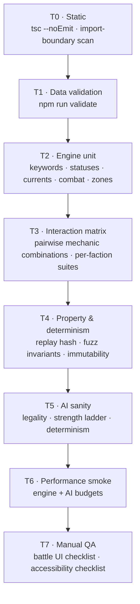
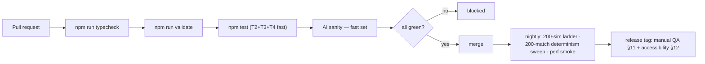

# HYPEBOUND — Testing Plan

> **Status: engineering specification.** Subordinate to
> `../design/00-core-rules.md` (rules canon) and `./00-architecture-contract.md`
> (tech canon). Card/DSL semantics under test are documented in
> [`./01-card-schema.md`](./01-card-schema.md). Every assertion in this plan is
> written against the *canonical* rule; where the engine currently deviates
> (card-schema doc §16, gaps **G1–G14**) the test is written **red first**, then
> the engine is fixed — never the other way round.

| At a glance | |
|---|---|
| Runner | Vitest 3 (`environment: "node"`, `include: tests/**/*.test.ts`) |
| Commands | `npm test` · `npm run validate` · `npm run typecheck` |
| Existing suites | `tests/engine-core.test.ts`, `tests/data-validation.test.ts`, `tests/ai.test.ts` |
| Dependency budget | Runtime deps stay `three` + `zod`. Test-only devDeps allowed: `vitest`, `@vitest/coverage-v8`. **No** jsdom, no fast-check, no testing-library |
| Randomness in tests | Only `seedRng()` from `src/engine/rng.ts`. `Math.random`, `Date.now`, `performance.now` (outside perf smoke) are banned |
| PR gate | typecheck + validate + full unit suite + fast AI sanity, < 3 min wall clock |
| Nightly gate | Adds the 200-sim AI ladder, the 200-match determinism sweep and performance smoke |

---

## 1. Testing principles

1. **The engine is a pure function.** `applyIntent(state, content, intent)` must
   never mutate its input and must depend on nothing but its arguments. Every
   engine test is therefore a plain data-in/data-out assertion — no mocks, no
   fakes, no timers.
2. **Determinism is a first-class feature, not a nice-to-have.** Replay,
   server authority and reproducible bug reports all rest on it, so it gets its
   own property-test tier (§7).
3. **Rules are asserted against canon, not against the implementation.** Quote
   the canon section in the test name (`"§5.1 attackers take counter-damage"`)
   so a failing test says which rule broke.
4. **Fixture content, not live content, for rule tests.** Rule suites build a
   tiny hand-authored `ContentIndex` (§3.3). Live `data/` is exercised by the
   data-validation, fuzz, AI and performance tiers. This keeps a balance tweak
   from turning 400 rule tests red.
5. **Every bug becomes a test.** The reproducing seed + intent list goes into
   `tests/regressions.test.ts` with the issue id in the test name.
6. **UI is not unit-tested; it is event-tested and hand-checked.** The presenter
   consumes `EngineEvent[]`, so event-shape assertions live in the engine tier
   and everything visual is covered by the manual QA checklist (§11) and the
   accessibility checklist (§12).

---

## 2. Test tiers



| Tier | Runs on | Blocking | Wall-clock budget |
|---|---|---|---|
| T0 | every PR | yes | < 20 s |
| T1 | every PR (and on any `data/` change) | yes | < 15 s |
| T2 | every PR | yes | < 60 s |
| T3 | every PR | yes | < 45 s |
| T4 | PR (fast set) / nightly (full sweep) | yes / yes | < 30 s / < 5 min |
| T5 | PR (24 sims) / nightly (200 sims) | yes / yes | < 60 s / < 20 min |
| T6 | nightly + before a release tag | yes | < 3 min |
| T7 | before a release tag, and on any battle-UI change | yes | ~45 min |

### 2.1 File layout

| File | Tier | Contents |
|---|---|---|
| `tests/helpers/fixtures.ts` | — | Fixture `ContentIndex` builders, fixture cards, `startMatch()` helper |
| `tests/helpers/scenario.ts` | — | Scenario DSL (§3.4): place characters, set stats/statuses/hype/obsession, run intents, capture events |
| `tests/data-validation.test.ts` | T1 | Schema + `crossValidate` + content-health (**exists**) |
| `tests/schema-rejection.test.ts` | T1 | Every rejection case in §8.2 |
| `tests/engine-core.test.ts` | T2/T4 | Setup, mulligan, Hype, victory, redaction, fuzz, replay (**exists**) |
| `tests/keywords.test.ts` | T2 | §4.1 — all 16 keywords |
| `tests/statuses.test.ts` | T2 | §4.2 — all 10 statuses |
| `tests/currents.test.ts` | T2 | §4.4–4.5 — advantage matrix, Resonance |
| `tests/confluences.test.ts` | T2 | §4.3 — all 9 Confluences |
| `tests/triggers.test.ts` | T2 | §4.6 — ordering, cascade cap, turn-boundary order |
| `tests/resources.test.ts` | T2 | §4.7–4.10 — fatigue, hand limit, Hype, Obsession |
| `tests/combat.test.ts` | T2 | §4.11 — attack legality, simultaneity, previews |
| `tests/zones.test.ts` | T2 | §4.12 — locations, events, reactions, equipment, banish |
| `tests/effects-dsl.test.ts` | T2 | Every op, target selector, amount and condition expression |
| `tests/interactions.test.ts` | T3 | §6 pairwise matrix |
| `tests/factions/<faction>.test.ts` | T3 | Per-faction signature-card interactions |
| `tests/determinism.test.ts` | T4 | §7 property tests |
| `tests/ai.test.ts` | T5 | §9 (**exists**) |
| `tests/performance.test.ts` | T6 | §10 budgets |
| `tests/regressions.test.ts` | all | One test per fixed bug, named with its id |

Helpers live under `tests/helpers/` and are not matched by the `*.test.ts`
include, so they never run as suites.

---

## 3. Test infrastructure

### 3.1 Building a match

```ts
import { buildContent } from "../src/engine/content";
import { createMatch } from "../src/engine/state";
import { applyIntent } from "../src/engine/reducer";
```

Rule tests never call `getContent()`; they pass a fixture `ContentIndex`
explicitly. `setContent(null)` is only used by suites that deliberately want
live data (validation, fuzz, AI, performance).

### 3.2 Determinism discipline in tests

* Seeds are literal integers listed in the test file; never derived from time.
* Any test that needs "random" choices drives them with
  `seedRng(<literal>)` + `nextInt`, exactly like `engine-core.test.ts` does.
* A test that asserts an rng-dependent outcome must also assert the outcome is
  stable across two runs with the same seed.

### 3.3 Fixture content

`tests/helpers/fixtures.ts` exposes:

| Helper | Purpose |
|---|---|
| `fixtureContent(overrides?)` | Minimal but complete `ContentIndex`: all 8 Currents with the canonical `beats` graph, all 9 Confluences, all 10 statuses, all 16 keywords, canonical `balance.json` values, 2 fixture leaders, ~30 fixture cards |
| `vanilla(cost, atk, hp, current, extras?)` | A statline-only Character used as a target dummy |
| `withEffect(card, effect)` | Clone a fixture card with one extra `EffectDef` — the standard way to test one op in isolation |
| `startMatch(content, opts)` | `createMatch` + both mulligans + skip to a given turn, returning `{ state, events }` |

Fixture cards are named for their role (`fx-dummy-2-2`, `fx-shield-bot`,
`fx-spotlight-wall`) so failures read clearly.

### 3.4 Scenario DSL

`tests/helpers/scenario.ts` turns a described board into a `MatchState`, so a
rule test is three lines:

```ts
const s = scenario(content, {
  turn: 5,
  you:   { board: ["fx-dummy-3-3"], hand: ["fx-bolt"], hype: 5, obsession: 3 },
  enemy: { board: ["fx-dummy-2-2@scorched"], leaderHealth: 12 },
});
const { state, events } = play(s, { type: "playCard", seat: 0, instanceId: s.hand[0], targets: [s.enemyBoard[0]] });
expect(damageTo(events, s.enemyBoard[0])).toBe(3);
```

The DSL builds state through public engine helpers only (`createMatch`,
`instantiateCharacter`, `applyStatus`) so it can never construct a state the
engine could not reach on its own.

---

## 4. Unit-test inventory

Every row below is at least one `it(...)`. Rows marked **(G#)** currently fail
against the engine and are the regression list for card-schema doc §16.

### 4.1 Keywords (16)

| Keyword | Assertions |
|---|---|
| **Viral** | Playing it adds one copy to hand; the copy costs 1 less; the copy is flagged `viralCopy` and does **not** copy again; the copy never costs less than 1 **(G6)**; a full hand emits `cardBurned` instead; `keywordTriggered` is emitted |
| **Spotlight** | With a Spotlight enemy on board, `legalAttackTargets` returns only Spotlight characters; the leader is illegal; attacking a non-Spotlight target throws `spotlightEnforced`; a Lurking Spotlight character does not lock targeting; two Spotlights are both legal |
| **Parasocial** | Buff/heal/positive status/equip on it grants +1/+1 and +1 Obsession; damage or a negative status does not; the enemy supporting it does not trigger it; it stacks per support event |
| **Trending** | Cost drops 1 per other card played this turn; floor is 1, never 0; the discount resets at start of turn; `costDelta` from other effects stacks additively before the floor |
| **Collab** | The `controlsAtLeast` condition pattern fires only with a matching other character; `excludeSelf` prevents self-satisfaction; the config field is required by the validator |
| **Comeback** | On defeat, `comebackScheduled` fires with `returnsOnTurn = globalTurnCounter + delayTurns × 2`; mode `hand` adds the card at the start of your next turn; mode `play` summons it; a full hand/board is handled without loss of state; it does not trigger for the opponent's kills of a different owner's card |
| **Raid** | Can attack the turn it is played; without Raid `canAttack` is false on the summoning turn; Raid granted by equipment also works |
| **Touch Grass** | `banish` removes from board, strips statuses, equipment and buffs; returns at the start of your next turn with base stats; `returnAtStartOfYourNextTurn: false` never returns it; a full board on return leaves it banished without crashing; `keywordTriggered` is emitted |
| **Afterparty** | Fires at end of the controller's turn, **only** for the turn owner **(G2)**; resolves before Scorched and Grow; does not fire from a Cancelled character; does not fire while banished |
| **Rushwind** | Fires only when the card is not the first card played this turn; the first card of the turn does not fire it; a second copy in the same turn does fire |
| **Flow** | Fires when a friendly card is returned to hand; controller-filtered (the opponent's Flow does not fire); fires from an equipment's own effect bound to the wearer |
| **Grow X** | `growProgress` advances at each of the controller's turn-ends; `grow.ops` run exactly once at the threshold; `growComplete` trigger fires after the ops; progress does not advance while banished; a defeated-and-returned body restarts at 0 |
| **Overload (X)** | Locks X Hype next turn; `hype = hypeMax − locked` at turn start; the lock clears after one turn; the `lockHype` op and the `overload` field do not double-apply on the same card |
| **Inspire** | Fires on heal, buff and positive status of any friendly character; controller-filtered; does not fire on a 0-value heal (already at max health) |
| **Corrupt** | Card-text-only marker: a `chooseOne` "Corrupt" branch resolves from `intent.choices`; the branch index is validated |
| **Refract** | `playCard` with `refractChoice` sets the played card's Current for Confluence/Resonance tracking and the summoned instance's `current`; the advantage cycle then uses the new Current; the `refract` op sets an explicit `intoCurrent` **(G9)** |

### 4.2 Statuses (10)

| Status | Assertions |
|---|---|
| **Scorched** | Deals exactly 1 at the end of the controller's turn; removed after triggering; re-applying renews it; a lethal Scorched kills and emits `characterDefeated`; `statusTriggered` precedes `damageDealt` |
| **Shielded** | Negates one full damage instance regardless of size; is consumed even by 1 damage; does not stop `ignoresShield` damage (Starflare); does not prevent counter-damage from being dealt to the other side; only one instance at a time |
| **Armor X** | Absorbs point-for-point on characters and leaders; multiple applications sum; drops off at 0; is spent before health; `damageDealt.absorbedByArmor` reports the exact amount |
| **Cancelled** | Blanks text (contributes no triggers via `collectTriggers`), zeroes attack, blocks attacking; expires after `durationTurns`; the character still counts for board-count effects; removing it restores the printed text |
| **Lurking** | Not targetable or attackable by the enemy; drops when it attacks; drops when it deals damage; friendly effects can still target it |
| **Warded** | Not targetable by enemy Actions/abilities but **is** attackable; expires on duration; does not block AoE that targets `all` (documented decision: `all` selectors skip Warded enemies) |
| **Weakened X** | −X attack, floored at 0; stacks additively; expires on duration; interacts correctly with Empowered |
| **Empowered X** | +X attack; stacks; expires; combines with equipment bonuses |
| **Cursed** | Applied and readable by `filter.hasStatus`; the card-defined payoff fires on its stated trigger; removal by `removeStatus` polarity `negative` |
| **Banished** | Off-board, not targetable, not counted by `controlsAtLeast`; returns at the stated turn with base stats and empty statuses |

Cross-cutting: `applyStatus` stacking rules (Armor/Weakened/Empowered accumulate,
booleans refresh the longer duration), `tickStatuses` decrements at the end of
the **affected** player's turn, leader Armor routes to `PlayerState.armor`, and
every status has a `statusApplied` / `statusRemoved` event pair.

### 4.3 Confluences (9)

Each: availability requires both Currents played this turn, one activation per
player per turn (`confluenceUsedThisTurn`), correct `confluenceActivated` event
with both Current ids, and the exact effect.

| Confluence | Pair | Effect asserted |
|---|---|---|
| **Steamveil** | Cinder + Tide | Chosen friendly character cannot be targeted by enemy Actions until your next turn (Warded, 1 turn) |
| **Bloom** | Tide + Root | Heals a character 3 **and** summons a 1/1 `token-sprout`; board-full still heals |
| **Sandstorm** | Root + Gale | All enemy characters get Weakened 1 until your next turn; new enemies played after are unaffected |
| **Tempest** | Gale + Pulse | Branch 0: 1 damage to up to 3 enemy characters. Branch 1: a friendly character may attack again. `intent.choice` selects the branch |
| **Starflare** | Pulse + Cinder | 4 damage that ignores Shielded; Armor still absorbs |
| **Blackflame** | Cinder + Veil | 2 damage and the target cannot be healed until your next turn (`healingDisabledUntilTurn`); a heal attempt emits `healed { amount: 0, blocked: true }` |
| **Sanctuary** | Root + Halo | Gives Shielded and removes exactly **one** negative status (not all) |
| **Eclipse** | Halo + Veil | `aurasDisabledUntilTurn` set; aura-derived stats revert for both players; auras re-enable and emit `aurasReenabled` |
| **Refraction** | Prism + any | Sets `refractionCurrent`; the next card of that Current runs its `onPlay` twice; the doubling is consumed; it clears at turn start |

Plus: `availableConfluences` reports `reasonUnavailable: "alreadyUsed"` after
use; a dual-Current deck can reach exactly its own pair; a Confluence with no
legal target is either unavailable or resolves harmlessly.

### 4.4 Perfect Resonance

| Assertion |
|---|
| `deckPureCurrent` returns the Current for a 30-card single-Current deck |
| Returns `null` when any card is Prism or when two Currents are present |
| `resonanceProgress` advances only on cards of the pure Current, only while not yet activated |
| Activation at `balance.resonance.threshold` (7) emits `resonanceActivated` and runs that Current's `resonance.ops` exactly once per match |
| All 8 Currents have a defined Resonance whose ops execute without error (loop over `content.currents`) |
| A dual deck never activates Resonance but can activate its Confluence; a pure deck can do neither of the other's |
| Viral copies count for Resonance only per the rule under test (`viralCopy` flag is asserted explicitly so the decision is locked) |

### 4.5 Elemental advantage pairs

| Assertion |
|---|
| The 7 directed advantage pairs each give exactly +1: Cinder→Gale, Gale→Root, Root→Pulse, Pulse→Tide, Tide→Cinder, Halo→Veil, Veil→Halo |
| The full 8 × 8 matrix (`advantageMatrix`) has exactly those 7 `true` cells |
| Prism has no advantage and takes no penalty in either direction |
| Bonus is exactly `balance.rules.elementalBonusDamage` — never doubled, never stacked with a second bonus |
| A 0-attack character gets no bonus (bonus applies only when attack > 0) |
| Counter-damage gets its own independent advantage check |
| Damage against a **leader** uses the leader card's Current |
| `previewAttack` reports identical numbers to the resolved attack for all 64 matrix cells (preview/reality parity) |
| After **Refract**, the character uses the new Current for both offense and defense |

### 4.6 Trigger ordering (canon §5.5)

| Assertion |
|---|
| Active player's listeners resolve before the opponent's |
| Within a player: board slots left→right (0→5) |
| A character's equipment effects resolve immediately after the wearer's |
| Location, then active Event, then leader `passive` resolve after all board characters |
| A **Cancelled** character contributes no triggers |
| A character that died earlier in the same cascade stops listening — except for its own `onDefeat` |
| The cascade cap (`rules.triggerCap` = 20) stops runaway loops and emits `triggerCapReached` exactly once |
| A two-card infinite loop terminates deterministically at the cap with an identical state hash across runs |
| End-of-turn order is **Afterparty → Scorched → Grow → status ticks → `turnEnded`** |
| Start-of-turn order is **banish returns → Comebacks → delayed effects → draw → event tick → `startOfTurn`** |
| `triggerQueued` events are emitted in resolution order with the correct `depth` |
| Nested triggers share one budget (a trigger fired inside a trigger still counts) |
| `inspire` and `flow` are controller-filtered; `afterparty` / `startOfTurn` / `eventTick` / `onCardPlayed` must be too **(G2, G3)** |

### 4.7 Fatigue ("Burnout")

| Assertion |
|---|
| Drawing from an empty deck deals `fatigue.start` (1), then 1 + increment each subsequent draw: 1, 2, 3, 4… |
| `fatigueCounter` increments once per failed draw and never resets |
| Fatigue damage emits `fatigueDamage` (not `damageDealt`) and can end the match |
| Fatigue ignores Armor and Shielded (documented decision: it is direct leader damage) |
| A multi-card `draw` op that empties the deck applies escalating damage per missing card |
| `{ "kind": "fatigueCounter" }` amount expression reads the same counter |
| The 30-card deck plus the canonical draw rate first burns on the expected turn (guards a draw-rate regression) |

### 4.8 Hand limit

| Assertion |
|---|
| Hand caps at `hand.limit` (10) |
| A drawn card over the limit is burned, emits `cardBurned { reason: "handFull" }` and lands in the discard pile |
| An effect-added card (Viral copy, steal, Comeback to hand) over the limit is burned; its destination is asserted explicitly so **(G12)** is locked or fixed |
| `returnToHand` on a full hand burns the card instead of losing the board body silently |
| Burning still advances the deck (the card is not re-drawn) |
| The second player's opening hand of 5 + Borrowed Clout does not exceed the limit |

### 4.9 Hype

| Assertion |
|---|
| Max Hype equals your own turn number, capped at `hype.cap` (10) |
| Hype refills fully at the start of your turn |
| Overload debt subtracts from the refill exactly once, then clears |
| `gainHype` (temporary) raises current Hype and `tempHypeThisTurn`, and is wiped at turn start |
| `gainHype { permanent: true }` raises `hypeMax`, still capped at 10 |
| Playing a card subtracts `effectiveCost` and increases `hypeSpentThisTurn` |
| A card that costs more than available Hype is rejected with `notEnoughHype` and does not appear in `enumerateLegalIntents` |
| Trending + `modifyCost` + Viral discount combine additively, floor 1 (Trending) / 0 (others) |
| `hypeChanged` events carry the post-change values |

### 4.10 Obsession

| Assertion |
|---|
| Supporting a friendly character grants `obsession.supportPerTurn` (1) — **once per turn**, from the first support of any kind (heal, buff, positive status, equip) |
| Parasocial grants an additional +1 per trigger, uncapped per turn |
| Card effects (`gainObsession` / `removeObsession`) clamp to 0–10 |
| At `obsessedThreshold` (8) the leader takes +`obsessedExtraDamageTaken` (1) from **enemy** sources only; self-damage is unaffected |
| `obsessedThresholdCrossed` fires on both entry and exit |
| At 10, `fullFixation` fires; the Ultimate costs 0 that turn but is still once per match; Obsession resets to `fullFixationResetTo` (5) after the Ultimate resolves |
| Fixation costs 3 and is once per turn; the Ultimate costs 7 and is once per match; both are blocked when unaffordable (`fixationUnavailable`) |
| Obsession does not decay on its own |
| `previewAttack` includes the Obsessed penalty in `attackerDamage` and `lethalOnLeader` |
| The `{ "kind": "obsession" }` amount and `obsessionAtLeast` condition read the same meter for both sides |

### 4.11 Combat and targeting

| Assertion |
|---|
| Summoning sickness: a character played this turn cannot attack unless it has Raid |
| One attack per turn per character; `attackAgain` refunds exactly one |
| Combat damage is simultaneous — a mutual-lethal trade kills both |
| Leaders deal no counter-damage |
| `legalAttackTargets` excludes Lurking characters and enforces Spotlight |
| `previewAttack` matches the resolved outcome for: plain trade, elemental bonus, Shielded defender, Armored leader, Obsessed leader, 0-attack attacker, Cancelled attacker |
| An `onAttack` trigger that removes the target aborts the attack cleanly (no crash, attack still spent) |
| A Reaction that kills the attacker before damage cancels the attack |
| `choose` targeting rejects illegal refs with `invalidTarget`; leaders are only choosable via `filter.type: ["leader"]` |
| A card whose mandatory target has no legal options is unplayable (`checkPlayable`) and absent from `enumerateLegalIntents` |

### 4.12 Zones and card types

| Assertion |
|---|
| **Location**: playing a second location replaces the first (`replacedCardId`); `activate` is once per turn, consumes 1 durability, and destroys the location at 0; aura-only locations have `durability: null` and cannot be activated |
| **Event**: max 1 active per player, replaced by a new one; `eventTick` fires at the controller's turn start and decrements `remainingTurns`; `eventEnded` fires at 0 |
| **Reaction**: max `board.maxSetReactions` (2) set at once; `reactionLimit` beyond that; hidden in redacted views; fires once and is discarded; all six dispatched conditions fire (**G5** covers the two that do not) |
| **Equipment**: replaces the previous equipment; `equipAttack`/`equipHealth` feed effective stats; `grantKeywords` are added; destroying the equipment removes the stats (and should remove granted keywords, **G7**); equipping counts as support; it can only be attached to a **friendly** character (**G7**) |
| **Transformation**: the new body loses buffs, statuses and equipment, occupies the same slot and is summoning-sick |
| **Token**: never in `collectibleCards()`, never added to the discard pile on defeat, rejected by `validateDeck` |
| **Discard/deck**: `mill` does not cause fatigue; `resurrect` only revives Characters; `stealCopy` leaves the original in place |

### 4.13 Effects-DSL coverage

`tests/effects-dsl.test.ts` asserts at least one behavioural test **per op
(38), per trigger (19), per target selector (7), per amount expression (6) and
per condition expression (9)**. The suite ends with a coverage guard:

```ts
it("exercises every op in the DSL", () => {
  const declared = OPS_IN_TYPES;             // literal list mirrored from types.ts
  expect([...exercisedOps].sort()).toEqual([...declared].sort());
});
```

`exercisedOps` is a `Set` that the helper `runOpUnderTest()` populates, so
adding an op to `types.ts` without testing it fails the suite.

---

## 5. Regression tests for known engine gaps

One test each, named `"G<n>: <canonical rule>"`, currently expected to fail and
tracked as blocking bugs (card-schema doc §16).

| Id | Test |
|---|---|
| G1 | An aura granting `health`, `costDelta` or `grantKeyword` changes the affected character's max health / a hand card's cost / its keyword list |
| G2 | An `afterparty` / `startOfTurn` / `eventTick` / `onCardPlayed` effect fires **only** for its controller's turn or cards |
| G3 | An `onCardPlayed` effect with `playedFilter: { type: ["action"] }` does not fire on a Character |
| G4 | An effect with `once: true` fires at most once per instance per game |
| G5 | Reactions on `friendlyCharacterDefeated` / `friendlyLeaderDamaged` fire |
| G6 | A 1-cost Viral card produces a copy that still costs 1 |
| G7 | Equipment cannot be attached to an enemy character; destroying equipment removes its granted keywords |
| G8 | `scry { mode: "reorder" }` applies the player's chosen order from the intent |
| G9 | `refract` with no `intoCurrent` uses the intent's `refractChoice` |
| G10 | `text: "auto"` renders generated text matching the effect fragments |
| G11 | `balanceOverrides` in `MatchConfig` change the effective balance for that match only |
| G12 | Over-limit cards from **all** sources have one documented destination |
| G13 | `buff.permanent` is either honoured or removed from the schema |
| G14 | A triggered `chooseOne` uses a deterministic, documented branch policy |

---

## 6. Card-interaction matrix

Pairwise combinations, not full combinatorics: with ~40 mechanic families the
full cross product is unmanageable, so the matrix is **risk-ranked**.

### 6.1 Method

1. **Tag every mechanic family** (the rows/columns below). Each new card is
   tagged with its families at authoring time (the tags come straight from its
   ops and keywords).
2. **Rank each pair** by risk: *S* = ordering-sensitive or state-destroying,
   *A* = numeric interaction, *B* = independent.
3. **Every S pair gets a hand-written test.** Every A pair gets a test when a
   shipped card actually creates the pair. B pairs rely on the fuzz tier.
4. **Every new card that creates a new S pair ships with its interaction test**
   — enforced at review, listed in the PR template.

### 6.2 The S-pair matrix (all hand-tested)

| ↓ acts on → | Buff/Aura | Shield/Armor | Damage/AoE | Cancel | Banish | Transform | Copy/Viral | Return-to-hand | Resurrect | Delayed/Comeback |
|---|---|---|---|---|---|---|---|---|---|---|
| **Buff/Aura** | stacking order; aura removal recalculates | buff then shield keeps both | buffed body survives exact-lethal AoE | Cancelled zeroes attack but keeps buffs on removal | banish strips buffs permanently | transform discards buffs | copy is the **printed** card, not the buffed body | return-to-hand discards buffs | resurrected body is base stats | delayed buff applies to whatever occupies the slot later |
| **Shield/Armor** | — | Shield consumed before Armor | Shield eats the whole instance; `ignoresShield` bypasses; Armor still applies | Cancelled keeps Shield | banish strips both | transform strips both | copies have no statuses | return strips both | resurrect strips both | Comeback body returns without them |
| **Damage/AoE** | — | — | simultaneous lethal kills both; cleanup order stable | damage to a Cancelled body still kills | damage cannot hit a banished body | damage during transform hits the new body's health | Viral copy is unaffected by board damage | lethal damage beats return-to-hand in the same cascade | resurrect after a wipe uses discard order deterministically | delayed damage resolves after the board changed |
| **Cancel** | — | — | — | re-cancel refreshes duration | banish clears Cancelled on return | transform clears Cancelled | — | — | — | Cancelled Afterparty does not fire |
| **Banish** | — | — | — | — | double banish does not duplicate the body | banish then transform: the banished body is untouched | — | banished body cannot be returned to hand | — | banish + Comeback resolve in a defined order |
| **Transform** | — | — | — | — | — | transform into a token: no discard entry | — | — | resurrect uses the **original** card id | — |
| **Copy/Viral** | — | — | — | — | — | — | copies of copies keep the flag | — | — | — |
| **Return-to-hand** | — | — | — | — | — | — | — | full hand burns the card | — | Comeback + return in one turn does not duplicate |
| **Resurrect** | — | — | — | — | — | — | — | — | board-full resurrect is a no-op, not a loss | — |
| **Delayed/Comeback** | — | — | — | — | — | — | — | — | — | two delayed effects on the same turn resolve in schedule order |

Additional S pairs held in the same suite: **Eclipse × aura-dependent stats**,
**Confluence × Resonance in one turn**, **Obsession threshold × leader damage
preview**, **Spotlight × Lurking**, **Trending × cost-modifying auras**,
**Overload × temporary Hype**, **Refract × advantage cycle**, **Grow ×
Cancelled**, **hand limit × every card-adding source**.

### 6.3 Per-faction suites

`tests/factions/<faction>.test.ts` — for each faction: its two signature
mechanics interacting with each other, its leader Fixation and Ultimate, its
archetype's core two-card combo, and the counterplay its documented weakness
implies (e.g. Viral Influencers' wide board versus a 3-damage AoE). Target: 8–12
tests per faction.

### 6.4 Interaction-ticket template

Every interaction test carries a one-line header comment so failures are
self-documenting:

```
// INTERACTION: Blackflame (heal lock) × Power Ballad (heal + shield)
// EXPECTED (canon §8.5): heal is blocked and emits healed{amount:0,blocked:true};
//                        the Shielded status is still applied.
```

---

## 7. Replay-determinism property tests

The core property: **same seed + same intents ⇒ identical state hash.**

| Property | Test |
|---|---|
| **P1 Replay equality** | For 200 seeded random matches, `stateHash(replay(record).state) === stateHash(liveState)` and `replay().errors` is empty |
| **P2 Divergence** | Different seeds produce different hashes (guards a hash that ignores real state) |
| **P3 Immutability** | `applyIntent` never mutates its input: hash before === hash after, for every intent type |
| **P4 Serialization stability** | `JSON.parse(JSON.stringify(state))` and `structuredClone(state)` both hash identically to the original (guards `undefined`, `Map`, `Date` or class instances sneaking into state) |
| **P5 RNG containment** | A source scan asserts no `Math.random`, `Date.`, `performance.`, `crypto.` or `new Date` in `src/engine/**` and `src/ai/**` |
| **P6 Id determinism** | Two runs of the same match produce identical `instanceId` sequences and identical `nextInstanceId` |
| **P7 Event determinism** | The full `EngineEvent[]` stream (JSON-stringified) is byte-identical between the live run and the replay |
| **P8 Golden vector** | A frozen fixture content + seed + intent list hashes to a checked-in constant; changing the engine's rules deliberately requires updating the golden in the same commit |
| **P9 Partial replay** | Replaying the first *k* intents of a record matches the live state after *k* intents, for several *k* (supports mid-match reconnection) |
| **P10 Redaction safety** | `redact(state, seat)` exposes no opponent hand, deck or face-down reaction ids; a redacted view JSON-stringified contains none of the hidden card ids |

**Fuzz invariants** (checked after *every* intent of every fuzz match, 200
matches × 8 difficulty/deck combinations nightly):

| Invariant |
|---|
| `hand.length ≤ hand.limit` and `board.length === board.characterSlots` |
| No board character has `health ≤ 0` |
| `0 ≤ obsession ≤ obsession.max`, `0 ≤ hype ≤ hypeMax + tempHypeThisTurn` |
| `reactions.length ≤ board.maxSetReactions`; at most one location and one active event |
| No duplicate `instanceId` anywhere in state |
| Every card instance is in exactly one zone |
| `winner !== null ⇒ phase === "ended"` and no further state changes occur |
| A cascade never exceeds `rules.triggerCap` resolved triggers |
| The intent count is bounded (no infinite turn: guard at 900 intents) |

Random matches are driven by `enumerateLegalIntents` + the seeded rng, exactly
as `engine-core.test.ts` already does; the fuzz tier only widens the seed set
and the invariant list.

---

## 8. Data-validation tests

### 8.1 Content health (live `data/`)

Already in `tests/data-validation.test.ts`; the full target list:

| Assertion |
|---|
| Every data file parses; `crossValidate` returns `[]` |
| 8 Currents, correct `beats` graph, Prism neutral; 9 Confluences with text; every Current has a Resonance with ≥1 op |
| Every card's Current is legal for its faction; every leader's Currents are legal |
| Every card with effects or keywords has non-empty text |
| Character stat budget: `attack + health ≤ 2 × cost + 2` |
| Every faction that has cards has ≥1 leader; every leader has Fixation (3) + Ultimate (7) and `leader.startingHealth` health |
| Every keyword id in `types.ts` exists in `keywords.json` with reminder text, and vice versa (guards the two-list drift described in card-schema §18) |
| Same bidirectional check for statuses and confluences |
| Every `summon`/`transform` target exists and is a Character (via `crossValidate`) |
| Every faction has ≥1 card of each of its two Currents once the faction file ships |
| No collectible card duplicates another card's `name` |
| `autoBuildDeck` produces a legal 30-card deck for **every** leader in `data/` |
| Every card id referenced by `ai-profiles.json` `bossCards` exists |
| Every audio-manifest slot key matches the documented naming pattern |

### 8.2 Schema rejection cases (`tests/schema-rejection.test.ts`)

Each row feeds a deliberately broken card to `zCardDef.safeParse` (or a broken
`ContentIndex` to `crossValidate`) and asserts the specific failure.

| # | Broken input | Expected rejection |
|---|---|---|
| 1 | `id: "Idols_Bad Id"` | kebab-case id required |
| 2 | Unknown field `"attackk": 3` | strict-mode unrecognized key |
| 3 | Character without `health` | characters need attack and health |
| 4 | `cost: 13` / `cost: -1` | out of range |
| 5 | `health: 0` | min 1 |
| 6 | Event without `durationTurns` | events need durationTurns |
| 7 | Leader with `current ≠ primaryCurrent` | leader.current must equal primaryCurrent |
| 8 | Leader without `fixation` / `ultimate` / `title` / `passive` | leaders need … |
| 9 | Reaction with two `reaction` effects | exactly one effect with trigger 'reaction' |
| 10 | Reaction effect without `reactionOn` | reaction effect needs reactionOn |
| 11 | `keywords: ["collab"]` without `collab` | keyword collab requires the collab field |
| 12 | Same for `comeback`, `grow`, `overload` | keyword X requires the X field |
| 13 | Non-leader card with `fixation` | leader-only fields present on non-leader card |
| 14 | Equipment with `attack`/`health` | attack/health only allowed on characters |
| 15 | Card with effects and `text: ""` | non-token cards with effects need rules text |
| 16 | `trigger: "reaction"` on a Character | trigger 'reaction' only on reaction cards |
| 17 | `trigger: "eventTick"` on an Action | trigger 'eventTick' only on event cards |
| 18 | `trigger: "activate"` on a Character | trigger 'activate' only on location cards |
| 19 | Unknown op `{"op":"nuke"}` | discriminated-union failure |
| 20 | Unknown trigger `"onVibe"` | enum failure |
| 21 | Unknown target selector `"select":"whoever"` | enum failure |
| 22 | Unknown status / keyword / current / faction id | enum failure |
| 23 | `chooseOne` with one option | min 2 options |
| 24 | `scheduleDelayed` with `delayTurns: 0` | min 1 |
| 25 | `scry` with `mode: "shuffle"` | enum failure |
| 26 | Malformed amount `{"kind":"count"}` (no target) | discriminated-union failure |
| 27 | Malformed condition `{"kind":"and"}` (no list) | union failure |
| 28 | Duplicate card id across two files | duplicate card id |
| 29 | Card Current not in its faction's Currents | current not permitted for faction |
| 30 | `summon` of a non-Character / unknown id | summon references … |
| 31 | `transform` into an Action | transform target is not a character |
| 32 | `variantOf` pointing at a missing card | variantOf references unknown card |
| 33 | Confluence (non-refraction) without a Current pair | missing currents pair |
| 34 | Prism with a non-empty `beats` | prism must have no natural advantage |
| 35 | A Current beating two Currents | must beat exactly one current |
| 36 | Token listed in a deck | `validateDeck` → `tokenInDeck` |
| 37 | 31-card deck / 3 copies / 2 Legendaries | `wrongSize` / `tooManyCopies` |
| 38 | 4 Prism cards in a non-Prism deck | `tooManyPrism` |
| 39 | Off-faction card in a deck | `illegalFaction` |
| 40 | Off-Current card in a deck | `illegalCurrent` |

Rejection tests assert the **message fragment**, not the full string, so
wording can improve without breaking the suite.

---

## 9. AI sanity tests

| # | Test | Threshold |
|---|---|---|
| A1 | The AI never submits an illegal intent | 0 `RulesError`s across 200 matches covering every difficulty pair and both seats |
| A2 | The AI always terminates its turn | No match exceeds 900 intents; the `guard` in `LocalMatch` is never hit |
| A3 | Determinism | Same seed + same profiles ⇒ identical winner, intent count and final state hash |
| A4 | Hidden-information safety | Permuting the opponent's hand and deck order (below the top card) does not change the chosen intent |
| A5 | Difficulty ladder | Over **200 simulations** with alternating seats, the higher tier wins **> 60%** of decided matches for each pair: expert>beginner, expert>casual, advanced>casual, advanced>beginner, intermediate>beginner |
| A6 | Lethal awareness | With an obvious lethal on board, `expert` takes it in ≥ 99% of 100 scripted positions; `beginner` takes it in roughly `lethalAwareness` (0.5) ± 0.15 |
| A7 | Confluence awareness | With a Confluence available and clearly beneficial, `expert` activates it ≥ 95% of the time; `beginner` rarely does |
| A8 | Mulligan sanity | `expert` only throws back cards costing > 4 (existing test); `beginner` may keep anything but never returns more cards than it holds |
| A9 | Resource use | `advanced`+ ends its turn with unspent Hype in < 20% of turns where a legal play existed |
| A10 | Boss profile | The boss profile loads, plays a legal match with `bossCards`, and respects any mode `balanceOverrides` |
| A11 | Decision budget | See §10 |

**Statistics note.** 200 simulations gives a 95% confidence interval of roughly
±7 percentage points, so a true 70% win rate passes a 60% gate reliably while a
true 60% rate is a coin flip. Tiers are therefore tuned to a **target of ≥70%**
and gated at 60%. The PR suite runs a 24-sim smoke version of A5 (expert vs
beginner only, the existing test); the full 200-sim ladder runs nightly with a
20-minute timeout. Seeds are fixed literals (`5000 + i`) so a failure is
reproducible.

---

## 10. Performance smoke tests

Node-side budgets are asserted with `performance.now()` inside
`tests/performance.test.ts`, at **3× headroom** so CI noise cannot flake them —
the assertion is "not catastrophically slower", and the measured value is
printed for trend tracking.

| Measurement | Target | Assert (3×) |
|---|---|---|
| `getContent()` cold load + validate | < 250 ms | < 750 ms |
| `createMatch()` | < 5 ms | < 15 ms |
| `applyIntent` median, mid-game board | < 1 ms | < 3 ms |
| `applyIntent` p95, full board + cascades | < 3 ms | < 9 ms |
| `enumerateLegalIntents`, 6 characters + 10-card hand | < 8 ms | < 24 ms |
| `structuredClone(state)` | < 0.5 ms | < 1.5 ms |
| `stateHash(state)` | < 1 ms | < 3 ms |
| AI decision — beginner/casual | < 30 ms | < 90 ms |
| AI decision — intermediate/advanced | < 150 ms | < 450 ms |
| AI decision — expert/boss (depth 3) | < 600 ms | < 1800 ms |
| Full AI-vs-AI match at `intermediate` | < 3 s | < 9 s |
| 200-match determinism sweep | < 90 s | < 270 s |

Client-side budgets are verified in the manual pass (§11) with the in-game perf
overlay, not in CI:

| Client measurement | Target |
|---|---|
| Frame time, desktop 1080p, busy board | ≤ 16.6 ms (60 fps) |
| Frame time, mid-range mobile landscape | ≤ 33 ms (30 fps floor) |
| Battle scene first paint after mode select | < 1.5 s |
| Card texture render (400 × 560) | < 8 ms |
| Collection scroll with 500 cards | no dropped frame > 50 ms |
| JS heap during a full match | < 350 MB, no growth across 5 consecutive matches |

---

## 11. Manual QA checklist — battle UI

Run before any release tag and on any change to `src/ui/battle/**`. Every line
is pass/fail; a fail blocks the tag. Perform once on desktop (mouse), once on
desktop (keyboard only), once on a mobile device in landscape (touch).

**Setup and board**
- [ ] Match starts with the correct hands (4 / 5 + Borrowed Clout) and the mulligan UI allows selecting any subset once
- [ ] Both leaders, health orbs, Hype crystals, Obsession meters, deck and discard counters are visible and correct
- [ ] 6 character slots per side, 1 location slot per side, Reaction and Event zones are visible with counts
- [ ] Camera pitch reads as the specified slight top-down; nothing important is occluded at 1280×720

**Targeting and previews**
- [ ] Dragging a card highlights only legal slots/targets; illegal targets are visibly excluded
- [ ] The targeting arrow follows the pointer and snaps to legal targets
- [ ] Damage preview shows the final number **including** the elemental +1, Shield absorption and the Obsessed penalty, and matches the result
- [ ] Healing preview shows the capped value and indicates a blocked heal (Blackflame)
- [ ] Lethal on the enemy leader is clearly indicated before confirming
- [ ] Spotlight forces attack targeting and explains why the leader is not selectable
- [ ] Cancelling a drag (right-click / escape / drag-off) never consumes the card or the attack

**Rules feedback**
- [ ] Status icons are distinct shapes with tooltips; no status is distinguished by colour alone
- [ ] The trigger-order display shows queued triggers as they resolve, in the resolved order
- [ ] The action-history rail lists every action with source and target, and is scrollable
- [ ] Confluence button appears only when available, shows both Current symbols plus a rules preview, and greys out after use with the reason
- [ ] Resonance progress is visible for pure decks and announces activation
- [ ] Obsession meter shows the 8+ danger state and the Full Fixation state distinctly
- [ ] Fixation / Ultimate buttons show cost, availability and once-per-turn / once-per-match state
- [ ] Card enlargement (hover / long-press) shows full text, reminder text and Current
- [ ] Burnout (fatigue), hand-limit burn and trigger-cap fizzle each produce a legible, non-silent message

**Flow and timing**
- [ ] Turn timer counts down, the 15 s rope is visually and audibly distinct, and auto-ends the turn
- [ ] End Turn is reachable at all times and never covered by animations
- [ ] Animations can be skipped/fast-forwarded after first view; the setting persists
- [ ] The engine never blocks on animation: rapid inputs queue correctly and no event is dropped
- [ ] Victory / defeat sequence plays, is skippable, and returns to the correct screen
- [ ] Conceding double-confirms and ends the match immediately

**Input and platform**
- [ ] Mouse: drag-to-play, drag-to-attack, hover previews, right-click inspect
- [ ] Touch: tap-tap fallback for play and attack, long-press inspect, no accidental drags while scrolling the hand
- [ ] Keyboard: full navigation of hand, board, leader abilities and End Turn, with a visible focus ring
- [ ] Portrait orientation shows the rotate overlay; returning to landscape resumes cleanly
- [ ] Layout is intact at 1280×720, 1920×1080, 2560×1440 and 4K, and on a 6.1" phone in landscape
- [ ] Emotes send, display and can be muted

**Audio and errors**
- [ ] With no audio files present the match is silent and error-free
- [ ] With files present, each of the five channels responds to its own volume slider
- [ ] An illegal intent (forced through) surfaces a readable message and does not desync the board
- [ ] Reloading mid-match returns to the lobby without a corrupted save

---

## 12. Accessibility QA checklist

Accessibility is **binding** (core rules §10, architecture contract §5). The
authoritative checklist is maintained with the UI specification — see
[`./02-ui-and-rendering.md`](./02-ui-and-rendering.md) ("Accessibility QA
checklist") and the settings surface in
[`../design/03-screens-and-navigation.md`](../design/03-screens-and-navigation.md)
§4.6.2. It is run in the same pass as §11 and gates a release tag.

For traceability, the battle-relevant items it must cover are:

| Requirement | Where verified |
|---|---|
| Scalable UI text 80–160% without clipping | Every DOM/HUD screen |
| Reduced motion (presenter falls back to fades) | Battle, pack opening |
| Colour-blind modes; no information by colour alone (shape + label always) | Statuses, Currents, factions, previews |
| High-contrast theme | All screens |
| Subtitles for every voice line | Battle, story |
| Screen-shake toggle and animation-speed control | Battle |
| Full keyboard navigation and remappable bindings | All screens |
| Controller support | All screens |
| Icon text labels option | Battle HUD, collection |
| Audio cues for turn start, lethal available, timer rope | Battle |
| Detailed card-text mode (reminder text on Epic/Legendary) | Collection, battle inspection |

---

## 13. CI, gates and definition of done



**Definition of done for a gameplay change**

1. Canon updated first if the rule itself changed (`../design/00-core-rules.md`).
2. Data change (`data/**`) rather than code change wherever possible.
3. Tests added at the lowest tier that can catch the bug.
4. `npm run typecheck && npm run validate && npm test` green locally.
5. If an rng-consuming path changed: the golden vector (P8) is updated in the
   same commit with a note explaining the intentional divergence.
6. If the change touches the battle UI: §11 checklist run and attached.

**Coverage targets** (with `@vitest/coverage-v8`, reported not enforced until
the engine stabilises, then enforced):

| Area | Line coverage | Hard requirement |
|---|---|---|
| `src/engine/**` | ≥ 90% | 100% of ops, triggers, selectors, amounts and conditions behaviourally exercised (§4.13) |
| `src/ai/**` | ≥ 75% | Every difficulty profile simulated |
| `src/game/**`, `src/save/**` | ≥ 70% | Every persistence migration round-tripped |
| `src/ui/**` | not gated | Covered by §11/§12 |

**Flake policy.** A test that fails intermittently is quarantined within one
working day (`it.skip` + issue link) and either fixed or deleted within a week.
No retries in CI: a deterministic engine has no legitimate flakes, so a flaky
engine test is a real bug in disguise.

---

## 14. Cross-references

| Topic | Document |
|---|---|
| Canonical rules under test | [`../design/00-core-rules.md`](../design/00-core-rules.md) |
| Engine model, determinism contract, directory layout | [`./00-architecture-contract.md`](./00-architecture-contract.md) |
| Card schema, effects DSL, known engine gaps (G1–G14) | [`./01-card-schema.md`](./01-card-schema.md) |
| UI, presenter and the accessibility QA checklist | [`./02-ui-and-rendering.md`](./02-ui-and-rendering.md) |
| Mode-specific rule overrides under test | [`../design/09-game-modes.md`](../design/09-game-modes.md) |
| Existing suites | `tests/engine-core.test.ts`, `tests/data-validation.test.ts`, `tests/ai.test.ts` |
