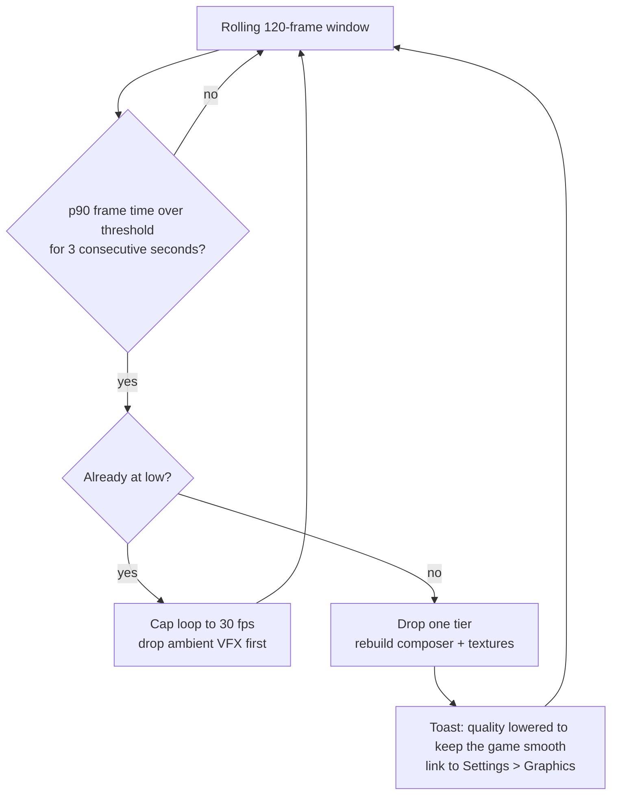
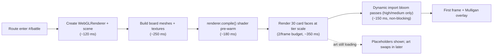

# HYPEBOUND — Performance, Platform & Asset Pipeline

> **Status:** Technical specification. Subordinate to `../design/00-core-rules.md`
> (rules canon), `00-architecture-contract.md` (tech canon) and `../../src/engine/types.ts`
> (shape canon). Components referenced here are specified in `02-ui-components.md`.
>
> This document owns: frame and load-time budgets, the three three.js quality tiers,
> mobile-landscape platform handling, the pipeline for owner-supplied AI-generated art
> (including the procedural placeholder rules), and the animation skip / fast-forward
> policy. Every constant here is a **budget**: exceeding it is a bug, not a trade-off to
> be argued per feature.

---

## 1. Scope, reference devices and enforcement

### 1.1 Why budgets, not guidelines

The brief requires a game that runs in a browser on PC *and* mid-range phones in
landscape, with premium presentation and 5–12 minute matches. That only holds if
performance is a fixed contract that features are designed *into*. Each budget below
names the metric, the number, the reference device, and how it is measured.

### 1.2 Reference devices (all budgets are stated against these)

| Class | Reference | Screen | Notes |
|---|---|---|---|
| **Desktop-min** | 2018 laptop, 4-core CPU, integrated GPU (Intel UHD 620-class), 8 GB RAM | 1920×1080 @ DPR 1 | The 60 fps target must hold here at `medium` tier |
| **Desktop-target** | 2021 desktop, 6-core, discrete GPU (GTX 1650-class) | 2560×1440 @ DPR 1 | 60 fps at `high` tier |
| **Mobile-min** | 2020 Android, Snapdragon 665-class, 3 GB RAM | 1600×720 landscape @ DPR 2 (capped to 1.0) | The 30 fps floor must hold here at `low` tier |
| **Mobile-target** | 2022 Android / iPhone 11-class, 6 GB RAM | 2340×1080 landscape @ DPR 2 (capped to 1.5) | 60 fps at `medium` tier where thermals allow |
| **Network** | Cold: 12 Mbps / 70 ms RTT ("4G"). Warm: HTTP cache primed | — | Load budgets are quoted for both |

### 1.3 Enforcement

| Mechanism | What it catches |
|---|---|
| `?perf=1` overlay (§10.1) | Live frame time, draw calls, texture memory, queue depth — used in every manual test pass |
| `tests/perf-budgets.test.ts` | Asserts the tier presets, cache caps and particle caps in code equal the tables in this document (a code/doc drift alarm) |
| Milestone acceptance checklist (§10.3) | Per-milestone sign-off on the reference devices |
| Bundle budget check in `npm run build` | Fails the build when a chunk exceeds §7.4 |

---

## 2. Frame budgets

### 2.1 Targets

| Platform | Target | Floor | Hard rule |
|---|---|---|---|
| Desktop | **60 fps** (16.7 ms) sustained during battle | 45 fps p99 | Never below 30 fps for more than 2 consecutive frames |
| Mobile | 60 fps where thermals allow | **30 fps floor** (33.3 ms) sustained | The `low` tier must hold the floor on Mobile-min |
| Menus (DOM screens) | 60 fps scroll/transition on both | — | No scroll jank > 50 ms |

### 2.2 Per-frame allocation, desktop 60 fps (16.7 ms)

| Slice | Budget | Owner |
|---|---|---|
| Engine work (`applyIntent`, only on frames with an intent) | ≤ 3.0 ms p99 | `src/engine/**` |
| Presenter queue step + event → animation mapping | ≤ 0.5 ms | `battle/presenter.ts` |
| Board scene update (card easing, VFX simulation, projections) | ≤ 2.5 ms | `battle/*.ts` |
| DOM HUD update (meters, rails, badges) | ≤ 2.0 ms | `battle/hud.ts` |
| three.js render submission + GPU wait | ≤ 7.0 ms | renderer/composer |
| Slack (GC, browser work) | ≥ 1.7 ms | — |

### 2.3 Per-frame allocation, mobile 30 fps floor (33.3 ms)

| Slice | Budget |
|---|---|
| Engine | ≤ 4.0 ms p99 |
| Presenter + scene update | ≤ 4.0 ms |
| DOM HUD (throttled to 30 Hz on `low`) | ≤ 3.0 ms |
| Render submission + GPU | ≤ 19.0 ms |
| Slack | ≥ 3.0 ms |

### 2.4 Long-task and latency rules

| Rule | Budget |
|---|---|
| No single JS task during a match | **> 8 ms desktop / 12 ms mobile is a bug** |
| Pointer-down → visual response (card lift, arrow appears) | ≤ 50 ms desktop, ≤ 80 ms mobile |
| Drop card → `cardPlayed` visual starts | ≤ 100 ms |
| `predict()` per pointer-move during a drag | ≤ 0.5 ms; results memoised per `(sourceId, targetRef, stateVersion)` |
| Card texture render (full detail) | ≤ 4.0 ms; **max 2 per frame** during a match, remainder deferred |
| Card texture render (compact) | ≤ 1.5 ms; collection grids render in `requestIdleCallback` slices, ≤ 4 cells per slice |
| AI think time | Beginner 60 ms · Casual 120 ms · Intermediate 250 ms · Advanced 450 ms · Expert 700 ms · Boss 900 ms; **hard cap 1200 ms**, "thinking" indicator after 400 ms |
| AI execution | In a Web Worker when available (`MatchState` is structured-cloneable by contract §3); otherwise time-sliced on the main thread at ≤ 6 ms per slice |
| Save writes (`localStorage`) | ≤ 3 ms, debounced 500 ms, never during an animation queue drain |

---

## 3. Battle scene budgets

### 3.1 Draw calls

Counted as `renderer.info.render.calls` for a fully populated board (12 characters,
10 cards in hand, 10 enemy hand backs, 2 leaders, 2 locations, 2 events, 4 set
Reactions, 2 concurrent VFX emitters).

| Bucket | Composition | High | Medium | Low |
|---|---|---|---|---|
| Board furniture | Table, rails, seam, 2 podiums, 2 location plates | 10 | 8 | 6 |
| Slot markers | 12 slots (glow sprites; flat rings on low) | 12 | 12 | 12 |
| Light pools / ambience | Rim pools, spot cone | 6 | 3 | 0 |
| Board cards | 12 × (front + rim); rim removed on low | 24 | 24 | 12 |
| Hand cards (yours) | 10 × (front + rim) | 20 | 20 | 10 |
| Enemy hand | 10 × (back + rim) | 20 | 20 | 10 |
| Leaders / locations / reaction backs | 10 objects × ~2 | 20 | 20 | 12 |
| VFX emitters | ≤ 6 concurrent `Points` systems (≤ 3 medium, ≤ 2 low) | 6 | 3 | 2 |
| Post-processing | Render + UnrealBloom mip chain + output | 14 | 12 | 0 |
| **Budget total** | | **≤ 150** | **≤ 110** | **≤ 75** |
| Warning threshold (perf HUD turns amber) | 80 % of budget | 120 | 88 | 60 |

Rules: card fronts/backs/rims are *not* batched (each has a unique texture), which is
why card **count** is the draw-call driver. Any new persistent board decoration must
either be merged into an existing geometry or justified against this table.

### 3.2 Geometry and materials

| Metric | Budget | Note |
|---|---|---|
| Triangles per frame | ≤ 60 000 | A card is 16 triangles; the board is the only heavy mesh. Geometry is never the bottleneck — **fill rate and draw calls are** |
| Unique materials alive | ≤ 90 | One per card object rim + shared plane materials |
| Shader programs compiled | ≤ 12 | Compiled during the battle load screen, never mid-match (pre-warm with `renderer.compile()` before the first frame) |
| Overdraw | Bloom + fog + glow sprites are the fill cost; glow sprites ≤ 18 on screen at once | |

### 3.3 Texture memory

Card faces are the dominant consumer. Face textures are rendered by the shared
`cardRenderer` at a tier-dependent scale of the 400×560 card space.

| Tier | Face texture | RGBA bytes | +mipmaps (×1.33) | LRU cache cap | Card-face pool |
|---|---|---|---|---|---|
| high | 448 × 628 (1.12×) | 1.07 MB | **1.43 MB** | 64 faces | **≤ 92 MB** |
| medium | 352 × 492 (0.88×) | 0.66 MB | **0.88 MB** | 44 faces | **≤ 39 MB** |
| low | 256 × 358 (0.64×) | 0.35 MB | **0.47 MB** | 28 faces | **≤ 14 MB** |

Other GPU textures:

| Asset | High | Medium | Low | Notes |
|---|---|---|---|---|
| Battlefield diffuse | 2048² (22.4 MB w/ mips) | 1024² (5.6 MB) | 512² (1.4 MB) | Owner-supplied battlefields are authored at 2048² and downsampled at load via `createImageBitmap({resizeWidth})` |
| Board sheen/detail mask | 512² shared (0.9 MB) | 512² | — | Greyscale, reused across battlefields |
| Glow sprite | 256² (0.35 MB) | 256² | 128² | Shared by all slot markers and light pools |
| Card back | 256×358 (0.47 MB) | same | same | One per equipped card back |
| UI/icon atlas | none (all iconography is procedural canvas) | — | — | Zero icon-atlas memory by design |

| Total GPU texture budget | High **≤ 160 MB** · Medium **≤ 80 MB** · Low **≤ 40 MB** |
|---|---|
| Typical measured occupancy | High ≈ 118 MB · Medium ≈ 47 MB · Low ≈ 17 MB |

Additional rules:

- **Eviction is by memory, not by count.** The cache tracks bytes and evicts LRU entries
  until it is under the pool cap for the active tier. Changing tier re-keys the cache and
  disposes everything from the previous tier.
- **Detail renders don't count.** The card-inspect overlay and collection detail panel
  render to DOM canvases at up to 500 CSS px; they are never uploaded as GPU textures.
- **Cache keys** include everything that changes pixels: `cardId | attack | health |
  maxHealth | highlight | dimmed | premium | tier`. A character taking damage creates a
  new entry; that is intended and is why the pool is sized for ~2 entries per live card.
- **Art arrival invalidation:** `onArtLoaded(cardId)` → `invalidateCardTextures(cardId)`
  → the affected objects re-render on the next frame (max 2 per frame, §2.4).

### 3.4 CPU memory

| Metric | Desktop | Mobile |
|---|---|---|
| JS heap during a match | ≤ 220 MB | ≤ 120 MB |
| `ContentIndex` (all validated JSON) | ≤ 12 MB | same |
| Decoded art `ImageBitmap` LRU | ≤ 120 entries / 180 MB | ≤ 48 entries / 60 MB |
| `localStorage` save envelope total | ≤ 4 MB (match history capped at 50 records / 300 KB; oldest pruned) | same |

---

## 4. Quality tiers

Three tiers exist (`QualityTier = "high" | "medium" | "low"`), selected automatically and
overridable in Settings → Graphics (auto/low/medium/high).

### 4.1 Exactly what degrades

| Feature | high | medium | low |
|---|---|---|---|
| Context antialias | on | on | **off** |
| `pixelRatioCap` | 2.0 | 1.5 | 1.0 |
| Bloom (`UnrealBloomPass`) | on, strength 0.52 | on, strength 0.36 | **off** (no composer at all — direct render) |
| Shadow map | on, `PCFSoftShadowMap`, 1024² directional | **off** — replaced by baked blob-shadow sprites under cards | off, **no blobs** |
| Fog (`FogExp2` 0.028) | on | on | on (free, keeps depth read) |
| Lights | ambient + directional + 2 point rims + spot | ambient + directional + 1 point rim + spot (no penumbra) | ambient + directional only |
| Board material | `MeshStandardMaterial` (metalness/roughness) | `MeshStandardMaterial`, flat roughness | `MeshBasicMaterial` (unlit, baked look) |
| Slot markers | animated glow sprites | static glow sprites | flat ring outlines |
| Card rim mesh (thickness) | on, emissive | on, emissive | **removed** — planes only |
| Card face texture scale | 1.12× | 0.88× | 0.64× |
| Card texture cache | 64 faces / 92 MB | 44 / 39 MB | 28 / 14 MB |
| Texture anisotropy | 8 | 4 | 1 |
| Global particle cap | **420** | **200** | **70** |
| Ambient board motes | on (60) | on (24) | **off** |
| Hand hover tilt/parallax | full | reduced (no parallax) | none (scale only) |
| Foil animation (premium cards) | animated everywhere | animated on the focused card only | static gradient |
| Battlefield texture | 2048² | 1024² | 512² |
| Light "breathing" animation | on | on | off |
| DOM `backdrop-filter` blur | 18 px | 10 px | **off** — solid `--glass-strong` fallback |
| HUD update rate | every frame | every frame | 30 Hz (meters lerp at half rate) |
| Camera micro-parallax on pointer | on | off | off |

**Never degraded at any tier** (readability is Pillar 1): stat chips, cost gems, Current
badges and labels, status icons, targeting arrows, damage/heal previews, meters, history
rail, trigger queue, turn timer, and every DOM text element.

### 4.2 Automatic detection

`detectQuality()` runs once at boot:

```
coarse pointer AND (deviceMemory <= 4 OR hardwareConcurrency <= 4)  -> "low"
deviceMemory <= 4 OR hardwareConcurrency <= 4                       -> "medium"
otherwise                                                            -> "high"
```

**Decision — required additions to the heuristic:**

| Signal | Action |
|---|---|
| No WebGL2 context | Unsupported screen (§11.2) — never a silent broken board |
| `MAX_TEXTURE_SIZE < 4096` | Force `low` and cap battlefield to 1024² |
| `UNMASKED_RENDERER` matches SwiftShader/llvmpipe/ANGLE-software | Force `low`, disable bloom permanently |
| `deviceMemory <= 2` | Force `low` and halve the texture pool |
| `navigator.getBattery()` reports `saving` or level < 15 % | Cap the render loop to 30 fps (frame skip), tier unchanged |
| `prefers-reduced-motion` | Does **not** change tier; it changes the presenter (§9.6) |

### 4.3 Runtime watchdog (dynamic downgrade)



| Rule | Value |
|---|---|
| Downgrade threshold | p90 > 26 ms when targeting 60 fps; p90 > 40 ms when targeting 30 fps |
| Max automatic downgrades | 2 per match (high → medium → low) |
| Automatic upgrade | **never** mid-match (prevents oscillation); re-evaluated on the next boot |
| Manual override | Settings → Graphics pins a tier; the watchdog then only warns, never changes |
| Tier change cost | Composer rebuild + texture-cache flush; budgeted at ≤ 250 ms, executed during the next turn transition, never mid-animation |

---

## 5. VFX and particle budgets

`maxParticles` is a **global concurrent** cap per tier (420 / 200 / 70). Individual
effects draw from that pool.

### 5.1 Per-effect allocation

| Effect | Trigger event | High | Medium | Low | Critical? |
|---|---|---|---|---|---|
| Ambient board motes | continuous | 60 | 24 | 0 | no |
| Card play flourish (per Current) | `cardPlayed` | 60 | 28 | 10 | no |
| Character summon | `characterSummoned` | 70 | 32 | 12 | no |
| Attack impact | `attackDeclared` → `damageDealt` | 40 | 18 | 6 | no |
| Elemental +1 spark (dual-Current motif) | `damageDealt.elementalBonus` | 24 | 12 | 6 | **yes** |
| Status applied | `statusApplied` | 20 | 10 | 4 | no |
| Status triggered (e.g. Scorched burn) | `statusTriggered` | 18 | 9 | 4 | no |
| Keyword triggered (Viral copy, Rushwind…) | `keywordTriggered` | 30 | 14 | 6 | no |
| Character defeated | `characterDefeated` | 50 | 24 | 8 | no |
| Heal / shield | `healed`, `statusApplied(shielded)` | 30 | 14 | 6 | no |
| **Confluence flourish** | `confluenceActivated` | 180 | 80 | 28 | **yes** |
| **Perfect Resonance activation** | `resonanceActivated` | 220 | 100 | 34 | **yes** |
| Fixation | `fixationUsed(fixation)` | 90 | 42 | 16 | no |
| **Ultimate Fixation** | `fixationUsed(ultimate)` | 200 | 90 | 30 | **yes** |
| Full Fixation (Obsession 10) | `fullFixation` | 120 | 54 | 20 | **yes** |
| Fatigue / Burnout hit | `fatigueDamage` | 40 | 18 | 8 | **yes** |
| Victory / defeat sequence | `matchEnded` | 300 | 140 | 48 | **yes** |
| Pack-opening Legendary flare (DOM canvas, separate pool) | reveal | 240 | 120 | 40 | no |

### 5.2 Allocation rules

1. **Never exceed the global cap.** A request that would exceed it is served at reduced
   count, floor 25 % of its allocation.
2. **Culling order** when the pool is full: ambient motes → oldest non-critical emitter →
   reduce (never cancel) critical emitters.
3. **Emitter cap:** 6 concurrent systems on high, 3 on medium, 2 on low (see §3.1).
4. **Lifetime cap:** no emitter lives longer than 2.5 s except ambient motes.
5. **Critical effects always play something** — if particles are unavailable, a single
   sprite flash plus the DOM label/glyph runs instead. Information is never lost because
   the pool was full.
6. **Reduced motion:** particle count is 0 for every effect; each is replaced by a
   160 ms cross-fade plus its static glyph (one sprite, one draw call), and the history
   rail entry is emphasised instead.
7. **Screen shake** is a separate toggle; when off, impact effects keep particles but
   drop camera displacement entirely.

---

## 6. Load-time budgets

### 6.1 Boot and per-screen budgets

Measured from navigation start (cold) or route change (warm), on the reference devices.

| Milestone | Desktop cold | Mobile cold | Warm |
|---|---|---|---|
| First paint — Splash visible | ≤ 1.2 s | ≤ 2.0 s | ≤ 0.6 s |
| All `data/*.json` fetched + zod-validated | ≤ 0.6 s (after shell) | ≤ 1.2 s | ≤ 0.3 s |
| Card renderer warm (one showcase card drawn) | ≤ 0.2 s | ≤ 0.4 s | ≤ 0.2 s |
| **Main lobby interactive** | **≤ 3.5 s** | **≤ 6.0 s** | ≤ 1.5 s |
| Route change, DOM → DOM: first paint | ≤ 250 ms | ≤ 400 ms | — |
| Route change, DOM → DOM: fully populated | ≤ 400 ms | ≤ 600 ms | — |
| Collection first paint (1 000+ cards, virtualised) | ≤ 400 ms | ≤ 700 ms | — |
| Collection scroll steady-state | 60 fps; ≤ 4 cell renders per idle slice | 30 fps floor | — |
| Deck builder open (with pool + stats) | ≤ 350 ms | ≤ 600 ms | — |
| **Battle: first rendered frame** | ≤ 1.8 s | ≤ 3.0 s | — |
| **Battle: mulligan interactive** | ≤ 2.5 s | ≤ 4.0 s | — |
| Pack opening ready to tear | ≤ 800 ms | ≤ 1.2 s | — |
| Replay start from Match history | ≤ 1.5 s | ≤ 2.5 s | — |
| Screen exit → GPU resources released | ≤ 100 ms (asserted: `renderer.info.memory` returns to baseline) | same | — |

### 6.2 Battle load sequence (what fills that 1.8 s)



Rules: the battle never blocks on art (§8.5) or audio (contract §6). Bloom import
failure degrades to a plain render, never an error.

### 6.3 Bundle budgets (gzipped)

| Chunk | Budget | Loading |
|---|---|---|
| App shell (`shell.ts`, theme, components, i18n) | ≤ 110 KB | eager |
| Engine + AI | ≤ 90 KB | eager (needed by lobby deck validation) |
| `data/*.json` (all content, all factions) | ≤ 500 KB | eager, validated at boot |
| three.js core | ≤ 190 KB | **lazy** — first entry into the lobby 3D scene or battle |
| Post-processing passes | ≤ 25 KB | lazy, only on high/medium |
| Battle screen bundle | ≤ 70 KB | lazy on `#/battle` |
| Collection + deck builder | ≤ 60 KB | lazy |
| Shop / banner / pack opening | ≤ 45 KB | lazy |
| CSS | ≤ 40 KB | eager |
| **Total eager payload** | **≤ 260 KB** | — |

`npm run build` fails when a chunk exceeds its budget by more than 10 %.

---

## 7. Mobile and platform handling

### 7.1 Landscape enforcement

Mobile is **landscape only** (contract §1). Implementation:

| Concern | Implementation |
|---|---|
| Detection | `matchMedia("(orientation: portrait)")` listener, plus `screen.orientation?.type` where available; a resize fallback compares `innerWidth < innerHeight` |
| Overlay | `#rotate-overlay` (already in `theme/base.css`): fixed, `z-index 9999`, animated rotate glyph, copy: *"Rotate your device — HYPEBOUND is landscape only."* Reduced motion → static glyph |
| While portrait | `renderer.setAnimationLoop(null)`, audio ducked to 0, DOM screens keep their state |
| Timers | Offline/vs-AI matches pause the turn timer while the overlay is up. Online matches **do not** pause — the overlay says so explicitly ("your turn timer is still running") |
| Orientation lock | Attempted via `screen.orientation.lock("landscape")` only inside a user gesture and only when the document is fullscreen; failure is silent (iOS Safari does not support it) |
| Minimum viewport | 640 × 360 CSS px. Below that, the unsupported-viewport panel appears with the required minimum stated |

### 7.2 Safe-area insets

```html
<meta name="viewport" content="width=device-width, initial-scale=1, viewport-fit=cover">
```

```css
:root {
  --safe-t: env(safe-area-inset-top, 0px);
  --safe-r: env(safe-area-inset-right, 0px);
  --safe-b: env(safe-area-inset-bottom, 0px);
  --safe-l: env(safe-area-inset-left, 0px);
}
.top-bar    { padding-inline: max(var(--sp-4), var(--safe-l)) max(var(--sp-4), var(--safe-r)); }
.nav-bar    { padding-bottom: var(--safe-b); }
.hud-left   { left:  max(var(--sp-3), var(--safe-l)); }
.hud-right  { right: max(var(--sp-3), var(--safe-r)); }
```

| Rule | Detail |
|---|---|
| Landscape has **two** side insets | A notch on one side and a home indicator on the other are simultaneous — never assume one side |
| Board framing margin | The camera framing reserves 4 % of the viewport on each edge, so scaled DOM overlays (text scale up to 160 %) never occlude board slots |
| Dynamic viewport | Layout uses `100dvh` plus a `visualViewport` resize listener; the URL-bar collapse must not resize the WebGL canvas more than once per gesture (debounced 120 ms) |
| Interactive gutters | No interactive control is placed within 12 px of a safe-area edge |

### 7.3 Unified pointer input

One abstraction (`PointerEvent` only — no separate mouse/touch code paths, contract §5).

| Concern | Rule |
|---|---|
| Capability queries | `(hover: hover)` gates hover affordances; `(pointer: coarse)` enables compact density, 10 px hit slop, and tap-tap as the default play gesture |
| Drag threshold | 6 px movement (10 px coarse) distinguishes tap from drag |
| Pointer capture | `setPointerCapture` on drag start; a lost pointer (`pointercancel`) always returns the card to hand with a 120 ms recoil |
| Multi-touch | Only the first active pointer drives interaction; additional pointers are ignored during a drag (palm rejection) |
| Long press | 400 ms → card inspect; movement > 8 px cancels it |
| Canvas gestures | `touch-action: none` on the WebGL canvas; `overscroll-behavior: none` globally; context menu suppressed on the board |
| Zoom | Double-tap zoom disabled via `touch-action: manipulation` on the body; pinch-zoom is not used by the game |
| Keyboard/controller | A parallel focus model exists for every gesture (see `02-ui-components.md` §8.2) — touch is never the only way to do anything |
| Audio unlock | The `AudioContext` resumes on the first pointer/key gesture; before that the game runs silently without warnings |

### 7.4 Lifecycle, thermals and battery

| Event | Behaviour |
|---|---|
| `document.hidden` | Stop the render loop, mute channels, pause the offline turn timer; online play continues per server rules |
| `pagehide` / `freeze` | Flush the save envelope; dispose GPU resources if the page is being frozen |
| Battery saver / level < 15 % | Cap to 30 fps by frame-skipping (tier unchanged), disable ambient motes |
| Sustained low-tier miss | Frame-skip to 30 fps, then reduce the particle cap by 50 %, then disable ambient effects; the board and HUD never lose information |
| Memory pressure (`deviceMemory <= 2` or texture pool eviction thrashing) | Halve the texture pool cap and drop the battlefield to 512² for the rest of the session |
| Screen exit | `dispose()` walks the scene and frees geometries, materials, textures, and the composer (already implemented in `scene.ts`) |

---

## 8. Asset pipeline (owner-supplied AI-generated art)

The owner supplies art later; the game must ship, look finished, and run at full quality
with **zero art files present** (brief + contract §5). No build step and no extra
dependencies are involved: the owner drops files into `public/assets/` and the game picks
them up.

### 8.1 Directory contract

```
public/assets/
  art/                     <card-id>.png|webp|jpg          card art (512 × 680)
  art/                     <card-id>@2x.png|webp|jpg       OPTIONAL hi-res (1024 × 1360)
  portraits/               <leader-id>.png                  768 × 1024, alpha
  battlefields/            <battlefield-id>.jpg|webp        2048 × 2048 max
  cardbacks/               <cardback-id>.png                512 × 716, alpha
  frames/                  <frameskin-id>.png               400 × 560, alpha (cosmetic frame skins)
  emotes/                  <emote-id>.png                   256 × 256, alpha
  avatars/                 <avatar-id>.png                  256 × 256
  banners/                 <banner-id>.jpg|webp             1600 × 640
  audio/                   (see architecture contract §6 — manifest-driven)
```

### 8.2 Card art specification

| Property | Value |
|---|---|
| **Source size** | **512 × 680 px** (5:7 — the same aspect as the card itself) |
| Formats probed, in order | `.png` → `.webp` → `.jpg` (matches `artLoader.ts`) |
| Colour space | sRGB, 8-bit, no embedded ICC profile |
| Alpha | Allowed but unnecessary; the art window is opaque |
| File size guidance | ≤ 400 KB (webp q82) / ≤ 900 KB (png) per card |
| Naming | Exactly the card's `art` field, defaulting to its `id` — kebab-case, e.g. `idol-encore-diva.png` |
| Variants | Cosmetic variants are separate card ids (`variantOf`), so their art file uses the **variant's** id |
| Optional hi-res | `<id>@2x` at 1024 × 1360, fetched **only** for the card-inspect overlay and the collection detail panel |

**Crop / safe zone (binding for composition).** The renderer cover-fits the source into
the 346 × 244 art window, so a 512 × 680 image shows its **vertical middle 53 %** at full
width:

```
   512 x 680 SOURCE                         WHAT THE CARD SHOWS
   +------------------------+  y=0
   |   cropped (23.4%)      |               nothing
   +------------------------+  y=159  ---+
   |                        |            |
   |     F O C A L  B A N D |            |  the 346 x 244 art window
   |     subject's face at  |            |  (full width, 53.1% of height)
   |     y ~ 300 (44%)      |            |
   |                        |            |
   +------------------------+  y=521  ---+
   |   cropped (23.4%)      |               nothing
   +------------------------+  y=680
```

Guidance given to the art generator: **keep the subject's head and the composition's
focal point between 25 % and 70 % of the image height, and keep meaningful detail out of
the outer 20 % top and bottom.** Full-bleed art (art extending under the name plate and
text box) is a planned later frame variant; today the window crop above is authoritative.

### 8.3 Other asset specifications

| Asset | Size | Format | Notes |
|---|---|---|---|
| Leader portrait | 768 × 1024 | PNG (alpha) | Character gallery, lobby showcase, victory sequence; ≤ 800 KB |
| Battlefield | 2048 × 2048 | JPG/WebP | Downsampled at load per tier (§3.3); ≤ 1.5 MB |
| Card back | 512 × 716 | PNG | Procedural default ships in code; files override by id |
| Frame skin | 400 × 560 | PNG (alpha) | Replaces frame layers L1–L4 (`02-ui-components.md` §2.7) |
| Emote | 256 × 256 | PNG (alpha) | ≤ 60 KB |
| Avatar | 256 × 256 | PNG | Profile/`PlayerChip` |
| News / banner art | 1600 × 640 | JPG/WebP | Lobby carousel and banner hero; ≤ 400 KB |

**Not assets:** Current icons, status icons, faction crests, rarity gems, cost gems and
frames are **procedural canvas drawings** (`cardRenderer/icons.ts`, `frameShapes.ts`).
They cost zero download, scale to any size, and are guaranteed present.

### 8.4 Loading behaviour (implemented in `src/ui/art/artLoader.ts`)

1. First request for a card returns `null` and starts a background probe
   (`png` → `webp` → `jpg`); the card renders with its placeholder immediately.
2. On success the image is cached, `onArtLoaded(cardId)` fires, board/DOM consumers call
   `invalidateCardTextures(cardId)` and re-render (max 2 per frame, §2.4).
3. On exhausting all extensions the key is marked `missing` and never re-probed that
   session — one failed request per card per session, maximum.
4. `preloadArt(cards)` warms a screen's working set on entry; the battle preloads only
   the two decks' cards (≤ 62 ids), never the whole collection.
5. Collection screens load art lazily through the `VirtualGrid` (≤ 24 concurrent fetches,
   decode via `createImageBitmap` off the main thread where supported).
6. `artCoverage(cards)` powers a dev-only coverage readout ("art present for 84 / 312
   cards") in the loading screen and the validator report.

### 8.5 Procedural placeholder rules (binding)

Until an image exists, every card renders a **deterministic, Current-themed composition**
(`cardRenderer/placeholderArt.ts`).

| Rule | Detail |
|---|---|
| Determinism | Seeded by `hash(card.name + card.current)` with an internal xorshift PRNG — identical on every run, every device, and inside replays. It never uses `Math.random`, and it is never part of engine state |
| Composition | (1) stage-wash gradient in the Current's `lo`/`key`/`abyss` tones; (2) 7–11 skyline/rigging bars; (3) three spotlight cones in `screen` blend; (4) a centred figure silhouette with a rim-light halo; (5) a Current-specific motion motif |
| Per-Current motif | Cinder → rising embers · Tide → wave bands · Root → growing stems · Gale → speed lines · Pulse → circuit traces · Halo → radial rays · Veil → fracture cracks · Prism → refracted spectrum bands |
| Watermark | `ART PENDING`, 10 px, 28 % alpha, bottom-right of the art window — quiet enough to look intentional, honest enough that nobody ships a placeholder by accident |
| Never | A broken-image box, an empty rectangle, a "missing texture" checkerboard, a network error toast, or a blocked render |
| Cost | ≤ 1.2 ms per placeholder at full card size; drawn inside the normal card render, so it consumes no extra budget |
| Validation | `npm run validate` reports missing art as a **warning**, never an error — the game is always shippable without art |
| Replacement | Dropping `public/assets/art/<id>.png` and reloading is the entire workflow. No rebuild, no manifest edit, no code change |

---

## 9. Animation skip and fast-forward policy

Canon (core rules §10 and contract §5): animations are exciting on first view and
**skippable/shortenable forever after**; the engine never waits on the presenter.

### 9.1 Architecture

```mermaid
flowchart LR
  R["reducer.applyIntent()"] -->|EngineEvent[] synchronously| P["presenter.enqueue()"]
  P --> Q["Animation queue<br/>Step{ id, kind, fullMs, minMs, critical }"]
  Q -->|drained on the render loop| V["3D + HUD components"]
  R --> S["MatchState (already final)"]
  S --> HUD["HUD reads final state at any time"]
  SKIP["Skip input (click / tap / Space)"] --> Q
```

The engine's state is **already final** when the queue starts draining. Skipping cannot
change an outcome; it only compresses presentation. This is what makes replay determinism
independent of animation settings (asserted in `tests/replay-determinism.test.ts`).

### 9.2 Speed modes

| Mode | Multiplier | Where it comes from |
|---|---|---|
| `full` | 1.00 | Settings → Gameplay → Animation speed (default for new players) |
| `fast` | 0.45 | Settings, or auto-adopted after a double-skip (§9.4) |
| `instant` | 0.00 (minimums still apply, §9.5) | Settings |

### 9.3 First-view memory (the "shortened after first view" rule)

```ts
type AnimKey = `${EngineEvent["e"]}` | `${EngineEvent["e"]}:${string}`; // optional card id

function stepDuration(key: AnimKey, fullMs: number): number {
  const base = SPEED[settings.animation.speed];          // 1.00 | 0.45 | 0
  const seen = seenCount(key);                            // persisted + per-match
  const familiarity =
    settings.animation.speed !== "full" ? 1 :
    seen >= 8 ? 0.35 :
    seen >= 3 ? 0.60 : 1;
  return fullMs * base * familiarity;
}
```

| Rule | Detail |
|---|---|
| Counter storage | `settings.animation.seen: Record<AnimKey, number>` in the versioned save envelope (contract §7); capped at 400 keys, LRU-pruned |
| Keying | Per **event type**; additionally per **card id** for the showpiece moments: Legendary summons, Ultimate Fixation, Perfect Resonance, Finale reveals |
| Reset | A card that changes in a patch resets its key (patch notes list the ids); a full reset button lives in Settings → Gameplay |
| Never shortened by familiarity | Information-reveal steps (§9.5) — they are already at their minimum |

### 9.4 Skip input

| Input | Effect |
|---|---|
| Click / tap on the board, `Space`, or `Esc` | Fast-forward the **entire current queue** to completion: all steps commit instantly, in order, and the resulting board state is exactly what the engine already computed |
| A second skip within 400 ms | Sets the session speed to `fast` and shows a toast ("Animations set to fast — change in Settings") |
| Skip during a required input | **Impossible**: target selection, `chooseOne`, `refractChoice`, mulligan and Confluence targeting are *intents*, not animations. The queue never contains them and skip never dismisses them |
| Skip during the outro | Jumps to the results panel (§`02-ui-components.md` §4.26) |
| Skip during pack opening | Reveals the full grid; the preference is remembered per the Banner page toggle |

### 9.5 Minimum durations (readability floor)

Even at `instant`, some steps hold a floor so the player can perceive new information:

| Step class | Floor | Reason |
|---|---|---|
| Hidden → visible information (enemy card played, Reaction reveal, drawn-card identity, Comeback return) | **90 ms** + a history-rail entry | Otherwise the information effectively never existed |
| Damage/heal numbers on units | 80 ms | The number must be readable; the value also persists on the unit |
| Trigger queue chips | 60 ms per chip, or a single collapsed `N triggers` chip if the queue exceeds 6 | Order must remain inspectable in the history rail |
| Match end | 300 ms before the outro panel | Prevents a "sudden loss" with no cause shown |
| Everything else | 0 ms | — |

### 9.6 Reduced motion

`[data-reduced-motion="true"]` (Accessibility settings) overrides speed handling:

- Every step becomes a cross-fade at `--dur-fast`; no translation, scale, rotation, or
  camera movement.
- Particle counts go to 0 (§5.2 rule 6); static glyph pops replace them.
- Card hover lift becomes a border highlight; the hand fan does not re-splay.
- The rope, Obsessed pulse and Full Fixation flash become non-animated state changes with
  their labels and audio cues intact.
- Screen shake is independently disabled by its own toggle.

### 9.7 Catch-up mode (bounded combo turns)

| Trigger | Action |
|---|---|
| Queue length > 24 steps, or pending duration > 2.5 s | Non-critical steps switch to `instant` until the queue drains below 8 |
| Trigger cascade approaching the 20-trigger cap (canon §5.5) | Trigger chips collapse into a single counting chip; the full order stays in the history rail |
| Replay at 2× / 4× | Durations are multiplied by 0.5 / 0.25; at 4× non-critical steps run `instant` |
| Reconnect / spectate catch-up (online) | The backlog is applied at `instant` with a "catching up…" banner, then normal speed resumes |

### 9.8 Reference durations (full speed)

| Event | Full | Fast (0.45) | Instant |
|---|---|---|---|
| `turnStarted` (banner + hype refill) | 600 ms | 270 ms | 0 |
| `cardDrawn` | 260 ms | 117 ms | 0 |
| `cardPlayed` (reveal + travel) | 700 ms | 315 ms | 90 (reveal floor) |
| `characterSummoned` | 500 ms | 225 ms | 0 |
| `attackDeclared` → `damageDealt` | 800 ms | 360 ms | 80 |
| `healed` / `statusApplied` | 300 ms | 135 ms | 0 |
| `characterDefeated` | 600 ms | 270 ms | 0 |
| `triggerQueued` → `resolved` (each) | 400 ms | 180 ms | 60 |
| `reactionTriggered` (flip + name) | 900 ms | 405 ms | 90 |
| `confluenceActivated` | 1 200 ms | 540 ms | 150 |
| `resonanceActivated` | 1 600 ms | 720 ms | 150 |
| `fixationUsed` (fixation / ultimate) | 900 / 2 000 ms | 405 / 900 ms | 120 / 200 |
| `fullFixation` | 1 000 ms | 450 ms | 120 |
| `fatigueDamage` | 700 ms | 315 ms | 80 |
| `matchEnded` → outro | see `02-ui-components.md` §4.26 | | |

Sanity check against pacing targets (`../design/02-gameplay-loop-and-match-flow.md` §5.1):
a typical 4-action turn costs ≈ 3.4 s of animation at full speed, ≈ 1.5 s at fast, and
≈ 0.4 s at instant — inside the "single action ≤ 1.2 s" budget and comfortably within the
25–55 s behavioural turn targets.

---

## 10. Measurement and tooling

### 10.1 In-app performance overlay (`?perf=1`)

| Readout | Source |
|---|---|
| fps, frame time p50 / p90 / p99 (120-frame window) | render loop timestamps |
| Draw calls, triangles, programs | `renderer.info.render` / `.programs` |
| Texture count + estimated bytes | `renderer.info.memory` + the card cache's own byte counter |
| Card-cache entries / bytes / evictions per minute | `cardMesh` cache |
| Active particle count / emitters | vfx module |
| Presenter queue depth and pending ms | `presenter.ts` |
| JS heap (Chromium only) | `performance.memory` |
| Active quality tier + whether the watchdog has downgraded | scene handles |

The overlay is a DOM panel, never part of the 3D scene, and is excluded from production
builds by a Vite define flag.

### 10.2 Automated checks

| Check | Where |
|---|---|
| Tier presets, particle caps, texture-cache caps equal this document | `tests/perf-budgets.test.ts` |
| No `Math.random` / `Date` in `src/engine` (determinism, which perf work must not break) | existing engine tests |
| Replay determinism at every animation speed and quality tier | `tests/replay-determinism.test.ts` |
| Bundle sizes per chunk | `npm run build` post-step |
| `dispose()` returns `renderer.info.memory` to baseline after a battle exit | `tests/scene-dispose.test.ts` (jsdom + stub WebGL) |
| Card render cost sampling (≤ 4 ms full / ≤ 1.5 ms compact) | `tests/card-render-perf.test.ts` (node-canvas-free: measures the draw-call script length and is a regression tripwire, with the real timing done manually per §10.3) |

### 10.3 Milestone acceptance checklist

Run on Desktop-min and Mobile-min before every milestone sign-off:

1. Full match (≥ 12 turns, both boards full, ≥ 3 Confluences, 1 Ultimate, 1 Resonance)
   at `high` on desktop: p90 ≤ 16.7 ms, draw calls ≤ 150, no downgrade fired.
2. The same match on Mobile-min at `low`: p90 ≤ 33.3 ms, no dropped inputs, no thermal
   downgrade before minute 8.
3. Collection scroll through 1 000 cards: no frame > 50 ms, texture pool never exceeds
   its tier cap.
4. Battle enter → exit → enter, five times: GPU texture bytes return to baseline ±5 %.
5. Cold-boot to lobby within §6.1 on both reference devices, over throttled 4G.
6. All three animation speeds and reduced motion produce identical final match states
   from the same replay.
7. Portrait rotation, backgrounding, and battery-saver transitions during a match: no
   crash, no lost state, no double-applied intents.

---

## 11. Device support and graceful degradation

### 11.1 Support matrix

| Platform | Minimum | Notes |
|---|---|---|
| Desktop browsers | Chromium 100+, Firefox 100+, Safari 16+ | WebGL2 required |
| Android | Android 9+, Chrome 100+, 3 GB RAM | Landscape only |
| iOS/iPadOS | iOS 15+, Safari 16+ | Landscape only; no orientation lock API — the rotate overlay is the mechanism |
| Input | Mouse (primary), touch, keyboard, gamepad | All four are first-class (`02-ui-components.md` §8.2) |
| Minimum viewport | 640 × 360 CSS px | Below this, an explicit unsupported-viewport panel |

### 11.2 Failure modes (honest, never fake)

| Failure | Behaviour |
|---|---|
| No WebGL2 | Full-screen explanation with the requirement and a link to Support. DOM screens (collection, deck builder, settings) remain fully usable; battle entry is blocked with the reason stated |
| WebGL context lost | Listen for `webglcontextlost`; pause, show "Restoring the board…", rebuild the scene from `PlayerView` on `webglcontextrestored`. The match state is untouched because it lives in the engine, not the scene |
| Bloom module import fails | Render without post-processing; log once |
| Art file missing | Procedural placeholder (§8.5) |
| Audio file missing | Manifest no-op (contract §6); the game runs silently |
| `localStorage` unavailable / full | In-memory profile for the session plus a persistent warning banner explaining that progress will not be saved |
| Data validation failure at boot | Error dialog with "Retry" and "Copy diagnostic report" — never a silent partial-content boot |

---

## 12. Implementation notes and required code deltas

The following constants in the current implementation must be reconciled with this
document (they predate it):

| File | Current | Required |
|---|---|---|
| `src/ui/battle/cardMesh.ts` | `TEXTURE_SCALE = 1.6` (fixed) | Tier-driven: 1.12 / 0.88 / 0.64 (§3.3) |
| `src/ui/battle/cardMesh.ts` | `MAX_CACHED = 160` entries | Byte-based LRU with caps 92 / 39 / 14 MB (64 / 44 / 28 entries) (§3.3) |
| `src/ui/battle/cardMesh.ts` | `texture.anisotropy = 8` (fixed) | 8 / 4 / 1 by tier (§4.1) |
| `src/ui/battle/scene.ts` | `QUALITY_PRESETS` covers bloom/shadows/particles/DPR | Extend with `textureScale`, `texturePoolBytes`, `anisotropy`, `ambientMotes`, `cardRim`, `hudHz` (§4.1) |
| `src/ui/battle/scene.ts` | `detectQuality()` uses memory/cores/pointer | Add the WebGL2, `MAX_TEXTURE_SIZE`, software-renderer and `deviceMemory <= 2` rules (§4.2) |
| `src/ui/battle/scene.ts` | No frame-time watchdog | Add the rolling-window downgrade watchdog (§4.3) |
| `src/ui/theme/base.css` | No safe-area variables | Add `--safe-t/r/b/l` and the gutter rules (§7.2) |
| `src/ui/art/artLoader.ts` | Probes `png`/`webp`/`jpg` for `<id>` | Add the optional `<id>@2x` probe used only by inspect/detail surfaces (§8.2) |
| `index.html` | Viewport meta | Add `viewport-fit=cover` (§7.2) |

None of these changes touch `src/engine/**`; performance work must never alter engine
behaviour, because determinism is the foundation of replays, spectating and the future
server (contract §3).

---

*Related documents: architecture — `00-architecture-contract.md`; component inventory —
`02-ui-components.md`; screens and layouts — `../design/03-screens-and-navigation.md`;
pacing targets — `../design/02-gameplay-loop-and-match-flow.md`; rules canon —
`../design/00-core-rules.md`.*
